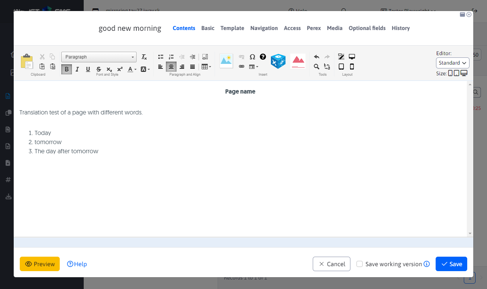
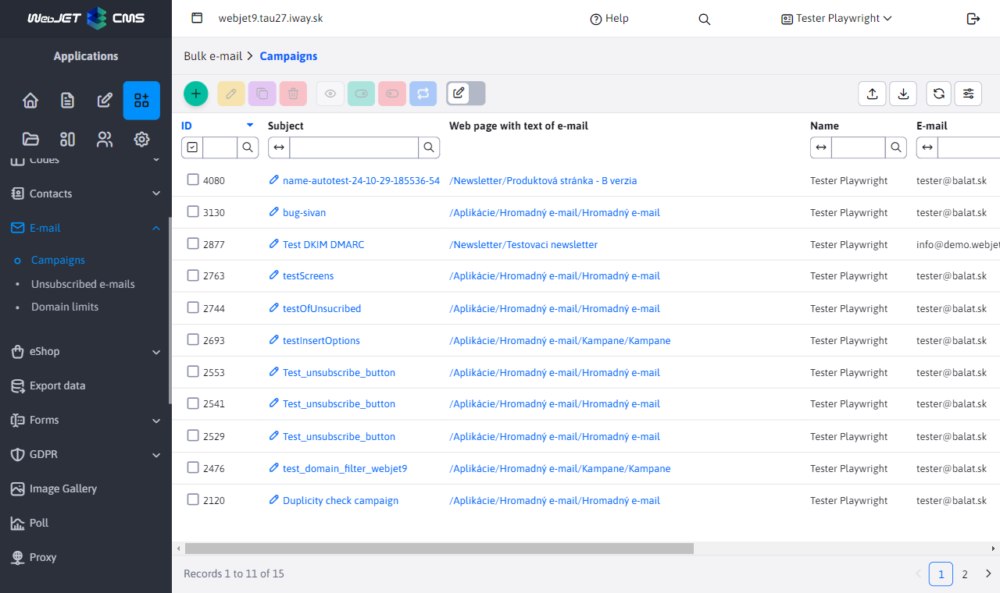
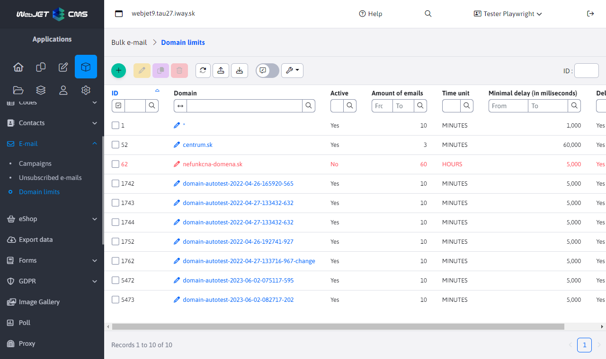
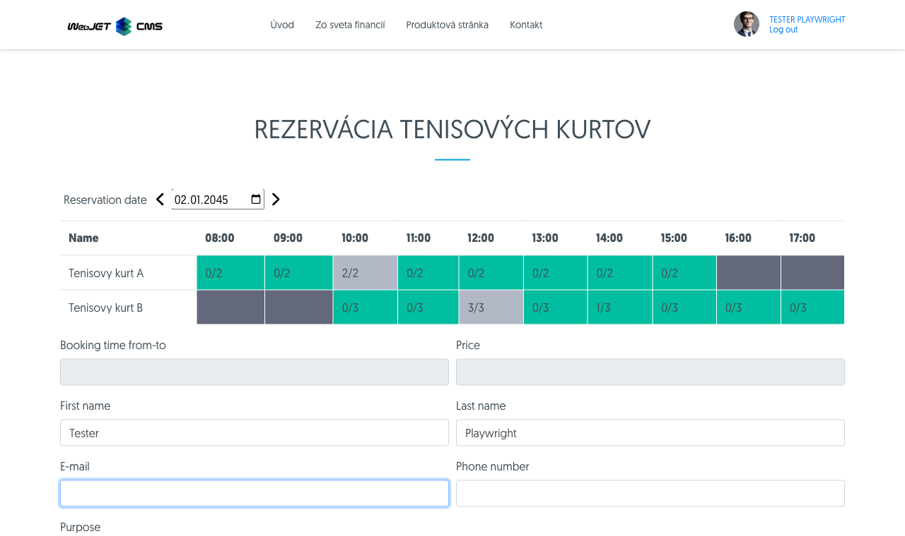

# New Features Overview - 2025

This section contains descriptions of the features and **functionalities of WebJET CMS in plain language**, without unnecessary technical formulations in 2025. New entries are added to the top (below this introduction), so the newest features are always at the top.

---

## AI assistants

WebJET CMS brings **complete integration of artificial intelligence** directly into the content management system. Editors and administrators thus gain intelligent assistants that help them with the creation and editing of content — from text to images to complete websites. Unlike most CMS systems, where AI is only an additional third-party function, in WebJET CMS **AI is natively integrated into every editing window** — text fields, images, page editor and PageBuilder.

The system supports **multiple AI service providers** (OpenAI, Google Gemini, OpenRouter, and even in-browser AI), giving the customer the freedom to choose based on price, quality, and availability. The administrator can set up different providers for different tasks — for example, a cheaper model for grammar correction and a more powerful one for content generation. With **OpenRouter** support, the customer has access to hundreds of AI models through a single interface, including many free options for testing.

A unique feature is **AI in the browser** — using models directly on the user's device without the need for an external API, which means **zero call costs** and **maximum data protection** because the data never leaves the computer. This technology is ideal for organizations with strict data privacy requirements.

**AI assistants are fully configurable** — the administrator can create their own assistants with precise instructions for specific fields and entities. Each assistant can be assigned to a specific field in the system, so the editor always sees only the relevant assistants. The system allows you to define instructions, select a model, set up response streaming, and request user input — all without the need for programming.

**PageBuilder** also features a **chat mode**, where AI can generate complete web page blocks, edit existing sections, or design the entire page structure based on the editor's request. The editor can gradually enter requests and fine-tune the result without manual coding.

The solution also includes **detailed usage statistics** of AI assistants — graphs of the most used assistants, token consumption over time, identification of users with the highest consumption. This allows the organization to **control costs**, optimize instructions, and evaluate the return on investment in AI tools.

**Main benefits:**

- **Native integration throughout the system**: AI assistants are available in every text field, image field, web editor, and PageBuilder — the editor doesn't have to switch between tools.
- **Provider flexibility**: Support for OpenAI, Gemini, OpenRouter, and AI in the browser — the customer chooses based on price, quality, and data protection requirements.
- **Zero Cost with In-Browser AI**: Local processing without API calls means no fees for common tasks like summarization, translation, or text editing.
- **Full configurability without programming**: The administrator creates custom assistants, defines instructions, and assigns them to fields — no code intervention.
- **Image generation and editing**: AI can create illustrative images from text descriptions, remove backgrounds, or edit existing photos directly in the CMS.
- **Chat mode for PageBuilder**: Complete generation and editing of website structure including blocks, texts and layout via conversation with AI.
- **Cost Control**: Detailed token consumption statistics by assistants, users, and days enable optimization and predictable budgeting.
- **Security and Privacy**: The ability to encrypt API keys, local AI in the browser, and granular permissions ensure compliance with organizational security policies.
- **Undo function**: Every AI result can be undone with one click, eliminating the worry of incorrect edits.

Detailed documentation: [AI assistants](../../redactor/ai/README.md)

## Document manager

WebJET CMS offers **Document Manager** — a comprehensive application for **document and version management** in one place. An organization can centrally manage all important documents (contracts, forms, guidelines, technical sheets), **automatically track their versions** and ensure that website visitors or internal users always have access to the latest version. The system also keeps the entire history of changes, so it is possible to return to a previous version of a document at any time.

A key feature is **planning the publication of documents in the future**. If an organization needs to publish a new price list, guideline or form on a specific date (for example, January 1 of the new year), it is enough to upload the document in advance and set the automatic publication date. At the specified time, the system **will automatically replace the old version with the new one** and optionally send a notification to the responsible persons. This eliminates the risk of human error and ensures **compliance with legislative deadlines**.

Documents can be organized using **products, categories, and product codes**, which allows for clear filtering even for hundreds of documents. The system automatically **checks for duplicate content** — if someone tries to upload a document that already exists in the manager, the system will notify you. On the website, documents are displayed using a **configurable application**, where the editor sets which documents should be displayed and in what order, including the option **to display historical versions and sample documents**.

**Main benefits:**

- **Central document management**: All organization documents are in one place with clear version history, categorization, and full-text search.
- **Automatically publish on date**: New document versions are published automatically at a set time — ideal for price lists, guidelines, or regulatory documents with a fixed effective date.
- **Version management and rollback**: Complete change history with the ability to instantly revert to a previous version with one click, without the need for an IT department.
- **Duplicate Protection**: The system checks the content of uploaded files and warns of existing duplicates, preventing chaos and inconsistency.
- **Sample documents**: A sample filled-in document can be assigned to each main document (e.g. a form), which improves the user experience for visitors.
- **Export and Import**: Bulk export of documents to a ZIP file and re-import allows for easy backup, migration between environments, or sharing between teams.
- **Detailed permissions**: Access to individual functions (management, editing, export, import, rollback) is controlled by separate permissions, allowing for safe delegation of tasks.

Detailed documentation: [Document Manager](../../redactor/files/file-archive/README.md)

## Automatic mirroring and translation of web pages

WebJET CMS offers **automatic mirroring of website structure** between language mutations — a feature that significantly simplifies **managing multilingual websites**. When an editor creates a new page or folder in one language version, the system **automatically creates an equivalent in all other language mutations** and links them together. Deleting, reordering, or moving pages is also automatically mirrored. This eliminates the need for manual duplication of the structure, which saves **hours of editor work** for websites with dozens or hundreds of pages.

The solution includes **integrated automatic content translation** — when creating a new page, the system automatically translates the title, URL, and all content into the target language. The system intelligently distinguishes whether the translated page has already been manually edited by an editor — if so, **automatic translation will not overwrite it**, thus preserving the proofreader's work. If the page has not yet been proofread, the translation will be automatically updated when the original changes.

A **language version switcher** is available for website visitors, which is simply inserted into the header of the page. By clicking on the language version (SK, EN, DE...), the visitor will go directly to the **equivalent of the currently displayed page** in the selected language — not to the home page, but to the exact same section in another language. The switcher supports both text links and flags and also automatically generates `hreflang` attributes for **search engine optimization (SEO)**.

**Main benefits:**

- **Saves editors time**: Creating a page in one language automatically creates an equivalent in all other mutations — no need to manually duplicate the structure.
- **Automatic content translation**: New pages are instantly translated, including the title, URL, and all content, dramatically speeding up the deployment of a multilingual website.
- **Intelligent change detection**: The system recognizes if a page has already been edited by a human and does not overwrite manual edits — the editor never loses their work.
- **Consistent structure across languages**: The structure of the site cannot fall apart over time — reordering, moving, and deleting are automatically synchronized.
- **Visitor Language Switcher**: With one click, the visitor is taken to the exact equivalent of the page in another language, improving the user experience.
- **SEO optimization**: Automatic generation of hreflang attributes improves search engine rankings for multilingual websites.
- **Flexible configuration**: Ability to set which directories are mirrored, multiple domains and any number of language mutations are supported.
- **Reduce Error**: Automation eliminates human error when manually copying the structure and ensures consistency.

Detailed documentation: [Structure Mirroring](../../redactor/apps/docmirroring/README.md)

## Mass email while respecting domain limits

WebJET CMS includes **its own built-in system for sending mass emails** (newsletters), thanks to which the customer is not dependent on external third-party services such as Mailchimp, SendGrid or other paid platforms. The entire process — from managing recipients to creating content to sending and tracking statistics — takes place **directly in the WebJET CMS administration**. This means lower costs, full control over data and no restrictions from the external provider on the number of emails sent or recipients.

The key feature is **intelligent respect of domain limits**. Email servers of large providers (Gmail, Outlook, Zoznam and others) block or move these messages to the spam folder when there is a high number of emails from one IP address. WebJET CMS allows the administrator to **set the maximum number of emails per time unit** for each domain separately and also **the minimum gap between individual emails**. The system thus sends emails gradually and in a controlled manner, which significantly increases **message deliverability** to recipients' mailboxes.

Recipient management is flexible — emails can be **added from user groups** registered in WebJET CMS, **imported from Excel (xlsx) files** or entered manually. The system automatically checks for duplicates, invalid email formats, and unsubscribed recipients, so the administrator can be sure that the campaign is sent only to valid and authorized addresses. Each email is **personalized** — the recipient's name, surname, company, and other data can be entered into the message. The solution also includes automatic unsubscribe management in accordance with email client requirements (`List-Unsubscribe` header) and **opening and click statistics**.

**Main benefits:**

- **Independence from external services**: No monthly fees for third parties, no limits on the number of emails — everything runs on your own infrastructure.
- **Higher deliverability thanks to domain limits**: Intelligent sequential sending prevents emails from being blocked by mail servers and reduces the risk of being marked as spam.
- **Full control over data**: Recipient lists, email content, and statistics remain in your system — no data sharing with external platforms.
- **Flexible recipient management**: Import from Excel, add from user groups or enter manually — including automatic protection against duplicates and invalid addresses.
- **Content Personalization**: Each email can include the name, company, city, and other details of a specific recipient for a higher open rate.
- **Compliance with legislation and good practices**: Automatic unsubscribe management, DKIM/SPF support, and `List-Unsubscribe` headers ensure compliance with email client requirements and GDPR.
- **Scheduling and statistics**: Ability to set the sending start date and track who opened the email and what they clicked on.

Detailed documentation: [Mass Email - Campaigns](../../redactor/apps/dmail/campaings/README.md), [Domain Limits](../../redactor/apps/dmail/domain-limits/README.md)

## Reservation system

WebJET CMS includes a **complete reservation system** that allows organizations to offer online reservations for various facilities and services — from meeting rooms and company vehicles, through sports facilities and wellness, to accommodation capacities and consultation hours. The system covers **two basic reservation modes**: hourly (for specific time intervals within the day) and all-day (for one or more calendar days). Both modes are fully configurable and adaptable to the needs of the organization without the need for programming.

**Hourly booking** is ideal for services with shorter durations — for example, booking a tennis court for an hour, a boardroom for a meeting, or a company vehicle for an afternoon. The administrator sets **available time slots for each day of the week separately**, the maximum number of concurrent bookings, and the price per hour. The visitor sees a clear table with availability, where they select the desired contiguous time range with one click. **All-day booking** uses an interactive calendar with a visual display of availability and prices for each day, which is ideal for accommodation, renting equipment for full days, or planning vacations in shared facilities.

The system offers **automatic approval or workflow with an approver** — the organization sets for each object whether reservations are confirmed immediately or require manual approval by a responsible person. After creating and approving/rejecting a reservation, the system **automatically sends email notifications**, eliminating the need for manual communication. For logged-in users, the form is **automatically pre-filled**, which speeds up the reservation process. The system also supports **discounts according to user groups** — for example, employees can have a preferential price or a service completely free, while external visitors pay the full amount.

**Main benefits:**

- **Universal use**: One system for various types of reservations — meeting rooms, vehicles, sports facilities, wellness, accommodation facilities, consultation hours and other services.
- **Two modes in one solution**: Hourly and all-day booking with full configuration of availability, capacity and prices for every day of the week.
- **Automatic notifications and approvals**: Email confirmations when bookings are created, approved, and declined eliminate manual communication and reduce administrative burden.
- **Discounts and pricing policy**: Flexible pricing with automatic application of percentage discounts according to user groups — ideal for differentiating between internal employees and external clients.
- **Collision Protection**: The system checks availability and capacity in real time, so double bookings above the set limit cannot occur.
- **Configuration without programming**: The administrator sets objects, time intervals, capacities, prices and the approval process through a clear interface without interfering with the code.
- **Website Integration**: The application is embedded directly into any website page via the editor — visitors book without leaving the company website.

Detailed documentation: [Time Reservation](../../redactor/apps/reservation/time-book-app/README.md) | [Day Reservation](../../redactor/apps/reservation/day-book-app/README.md)

## E-commerce — revamped administration, payment gateways, and delivery

WebJET CMS brings **a completely renewed E-commerce application**, which provides everything needed to operate an online store directly in the content management system. Administrators get **clear management of products, orders, payment methods and delivery** in a modern interface without the need for external tools. Products are organized into a **category tree structure**, where it is possible to easily create new categories, assign images, filtering tags and attributes (manufacturer, parameters, specifications) to products. Order management includes a complete life cycle — from creation to tracking payment status to customer notification of changes.

The key innovation is the **integration of the GoPay payment gateway**, which allows customers to pay online by card, bank transfer or other electronic payment methods. The payment gateway is configured directly in the administration — just enter your access data and activate the required payment methods. The system **automatically processes payments**, tracks their statuses (successful, unsuccessful, pending) and also supports **refunds** — returning the entire amount or part of it directly through the administration. A complete **history of all payment transactions** is available for each order, which simplifies accounting and resolving complaints.

**Configuring delivery methods** allows you to set different delivery options by country, including price excluding VAT, VAT rate and display order. Each delivery method can have **specific parameters** according to the type of carrier. The system supports multiple countries at the same time, which is important for customers operating in multiple markets. The entire module is **extensible** — the programmer can add new payment methods and delivery methods according to customer requirements.

**Main benefits:**

- **Complete e-shop management in CMS**: Products, orders, payments and delivery in one place — no separate e-shop system or external tools required.
- **GoPay payment gateway integration**: Online payments by card and bank transfer with automatic transaction processing, balance tracking, and refund support.
- **Flexible payment methods**: Configuration of multiple payment methods (GoPay, transfer, cash on delivery) with individual settings for each method directly in the administration.
- **Shipping methods by country**: Set up different shipping methods with prices and VAT for each supported country — ideal for international sales.
- **Automatic tracking of payments and order statuses**: The system automatically recalculates paid amounts and changes the order status (new, partially paid, paid), eliminating manual work.
- **One-click refunds**: Full or partial refund of payment directly from the administration, including processing through the payment gateway.
- **Customer Notifications**: Automatic email notifications about order status changes with configurable text and order overview.
- **Extensibility**: Possibility to programmatically add new payment methods and delivery methods according to individual customer requirements.

Detailed documentation: [E-shop](../../redactor/apps/eshop/product-list/README.md)
