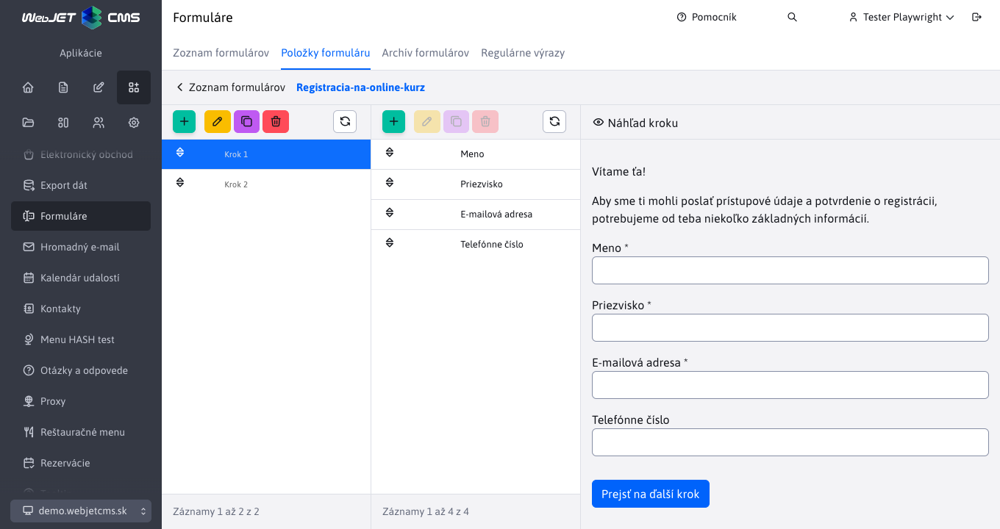

# Information for the trader - year 2026

This file contains descriptions of WebJET CMS features shipped in 2026 from a sales perspective. New entries are added to the top (below this introduction), so the newest features are always at the top.

---

## Automated website accessibility testing

WebJET CMS introduces **automated accessibility testing**, which verifies whether websites and the administrative interface are accessible to **all users** — including those with visual, hearing, motor or cognitive disabilities. The system automatically checks compliance with the international standard **WCAG 2.2** (Web Content Accessibility Guidelines) at levels A and AA, which is a requirement of EU and Slovak legislation for public sector websites and increasingly for commercial entities.

In practice, this means that **every change to the website can be automatically checked** for accessibility before it is put into operation. The developer does not have to manually check dozens of rules, because the system can do it for him automatically and repeatedly with each change.

Accessibility testing can be **built directly into the development process**, it is not an external audit performed once a year. This means that problems are captured continuously and fixed at the moment of their occurrence, which is **significantly cheaper and faster** than additional correction after an external audit. The system generates **clear HTML reports** with a detailed description of each violation, which facilitates communication between the development team and those responsible for accessibility.

**Main benefits:**

- **Compliance with legislation**: Automatic checking ensures that the website meets the requirements of the European Web Accessibility Directive (EAA) and Slovak legislation, thus preventing the customer from legal risks and fines.
- **Inclusive website for all**: The website is also accessible to people with health limitations, which expands the potential target group and improves the organization's reputation.
- **Continuous control instead of a one-time audit**: Every change is automatically verified, so problems are caught immediately — fixing them at the moment they occur is an order of magnitude cheaper than an additional audit.
- **Lower repair costs**: Early detection of breaches reduces accessibility repair costs by up to 80% compared to post-production repairs.
- **Clear reports**: Automatically generated HTML reports with a description of violations and their severity simplify repair prioritization and team communication.
- **WCAG 2.2 standard support**: The check covers the latest version of the standard, including levels A and AA, ensuring up-to-dateness against future legislative requirements.

Detailed documentation: [Accessibility Testing](../../developer/testing/a11y.md)

## AI Skills — intelligent skills for faster CMS development and management

WebJET CMS integrates a set of **AI Skills** — specialized artificial intelligence skills that significantly **accelerate the development, maintenance, and expansion** of web projects. AI Skills work directly in the development environment (VS Code with GitHub Copilot) and can **automatically generate ready-made code, tests, documentation, and entire new modules** based on a simple request in accordance with the conventions and structure of WebJET CMS. This way, the developer does not have to manually create dozens of files and remember all the technical details — just describe what he needs, and AI Skills will deliver a functional result.

For the customer, this means, above all, **significantly faster delivery of new features and modifications**. Changes that previously took hours or days can now be delivered in minutes. Equally important is the **rapid prototyping** option — the customer can have a prototype of a new module, form or administration page prepared almost immediately and decide whether the direction is right, even before investing in full development. If the customer has their own development team and is modifying the project independently, they can **use AI Skills directly** — the system will guide them through the entire process and ensure that the result is compatible with the WebJET CMS architecture.

Deploying AI Skills also increases the **quality and consistency** of the code you deliver. Each skill enforces best practices, automatically adds tests, and adheres to design conventions, reducing the risk of errors and simplifying future maintenance.

**Main benefits:**

- **Faster Delivery**: New features and customizations are available in a fraction of the original time, reducing time to market.
- **Rapid prototyping**: The customer receives a working prototype of the new module almost immediately and can evaluate it before approving full development.
- **Lower development costs**: Automating routine tasks reduces the number of developer hours needed.
- **Higher code quality**: AI Skills follow best practices, generate tests, and check for consistency, reducing errors.
- **Customer Independence**: Customers with their own development team can use AI Skills themselves to extend and customize their project.
- **Ease of use**: Just describe the requirement in plain language — AI Skills will translate the intent into ready-made, functional code.

### Available AI Skills

| Skill | Description |
| ----------- | ------- |
| **Creating an application (AppStore)** | Generates a complete application for the page editor — Java class, template, configuration, and registration in the application list. |
| **Creating an administration page (DataTable)** | It prepares the entire CRUD module for administration — database entity, REST interface, HTML page, and automated tests. |
| **Automated E2E tests (CodeceptJS)** | Writes end-to-end browser tests that verify the functionality of pages, forms, and permissions. |
| **Code Review** | Reviews code changes for correctness, security, backward compatibility, and adherence to project conventions. |
| **Accessibility Audit** | It will perform a web accessibility audit according to the WCAG 2.2 standard and suggest fixes for keyboard navigation, contrast, and screen readers. |
| **Documentation update** | It automatically updates technical documentation based on code changes, keeping documentation always up to date. |
| **Comment translation** | Translates source code comments from Slovak to English without changing functionality, improving readability for international teams. |
| **Marketing content** | Based on the changes delivered, it generates materials for the blog, social networks, or changelog — saving the marketing team time. |
| **Description of properties for sale** | Analyzes technical changes and creates a clear description from the customer's perspective and business benefits. |

## Logging in via OAuth2/Keycloak

WebJET CMS now supports **user login via external identity providers** such as Google, Facebook, GitHub, Okta or the enterprise Keycloak server. Technically, this is the **OAuth2/OpenID Connect** standard — in practice, this means that users can log in **with one click via an account they already have** (for example, a corporate Google account or an **enterprise SSO** system), without having to remember another password. The website administrator simply configures which providers they want to allow, and the system automatically displays the appropriate login buttons.

The key advantage is **automatic synchronization of groups and rights**. If the organization uses a corporate identity server (e.g. Keycloak), WebJET CMS can automatically download the groups and roles in which the user is included at each login, and **assign him the corresponding rights** in the CMS. This eliminates the need for manual authorization management — when an employee's role changes in the corporate system, **the change is automatically transferred to WebJET CMS**. Administrators are set up automatically based on membership in a defined group, which simplifies access management even in large organizations.

The solution is **flexible and extensible** — the customer can configure any OAuth2 provider, not just the predefined ones (Google, Facebook, GitHub, Okta). **simultaneous use of multiple providers** is also supported (e.g. Keycloak for administrators and Google for the customer zone) and the configuration can be fully customized to the needs of the organization, including custom login attributes. It is possible to set up different providers with different levels of rights synchronization for both the customer zone and the administration.

**Main benefits:**

- **Single Sign-On (SSO)**: Users log in with an account they already know — no more passwords to remember, increasing both security and convenience.
- **Automatic rights synchronization**: Groups and roles are downloaded from the corporate identity server at every login — eliminating the need for manual rights management in the CMS.
- **Support for any OAuth2 provider**: In addition to the predefined ones (Google, Facebook, GitHub, Okta), any custom OAuth2/OpenID Connect server can be configured.
- **Enterprise-level security**: Authentication takes place on the side of a verified provider — WebJET CMS never stores passwords for external services, which reduces security risks.
- **Separate configuration for admin and customer zones**: Different providers for different parts of the system allow precise access control by user type.
- **Lower operating costs**: Central user management in one system (e.g. Keycloak) reduces administrative burden and eliminates duplicate account management.
- **Easy installation**: For popular providers (Google, Facebook) you only need to set two configuration parameters; for enterprise Keycloak, a ready-made Docker configuration is available.

    <iframe width="560" height="315" src="https://www.youtube.com/embed/q8xs3qDq-G4" title="YouTube video player" frameborder="0" allow="accelerometer; autoplay; clipboard-write; encrypted-media; gyroscope; picture-in-picture" allowfullscreen></iframe>

Detailed documentation: [OAuth2 Authentication](../../install/oauth2/oauth2.md) | [Keycloak - Installation and Configuration](../../install/oauth2/keycloak.md)

## Multi-step forms

WebJET CMS offers multi-step forms that **divide long forms into smaller, more user-friendly parts**. Instead of one cluttered form, the visitor gets a **clearly guided step-by-step process**, which reduces the feeling of being overwhelmed and helps increase the number of successfully completed submissions. This functionality is suitable for registrations, inquiry forms, recruitment forms, applications, or internal collection processes, for example.

It is also important for the customer that the form does not have to remain in its basic settings. Individual steps can be named, supplemented with introductory texts and button texts can be customized according to a specific campaign or process. The solution thus combines **better user experience** with a high level of customization without the need to prepare each form from scratch.

**Main benefits:**

- **Higher submission success**: Dividing the form into steps reduces the barrier to completion and helps guide visitors to submission.
- **Better user experience**: The form looks clearer, less stressful, and is better to use even with larger amounts of data.
- **Suitable for various scenarios**: The solution can be used for sales, marketing, HR and customer service without changing the basic principle.
- **Easy communication customization**: Step and button texts can be customized to suit a specific campaign goal or corporate style.

Detailed documentation: [Multistep Forms](../../redactor/apps/multistep-form/README.md)

### Flexible form editor without programmer dependency

The solution includes an editor where the administrator can **continually modify the form according to current needs**. Steps and individual items can be added, duplicated, moved, reordered, and continuously checked in the preview. This significantly reduces the time needed to prepare new forms and allows you to quickly respond to new business or operational requirements.

A big advantage is also the high degree of variability. For individual fields, it is possible to set **obligation to fill in, validation rules, pre-filled values**, help texts or information bubbles. In addition, forms can be **personalized with data** about the logged in **user** and adapted to specific display scenarios. For the customer, this means less dependence on the supplier and a greater ability to adjust processes on their own.

**Main benefits:**

- **Quickly deploy changes**: Marketing or admin can edit the form without lengthy development and waiting for technical intervention.
- **More accurate data collection**: Required fields, validation rules, and help texts reduce error rates and increase the quality of collected data.
- **Personalization for greater comfort**: Pre-filling data about the logged-in user speeds up completion and reduces the number of abandoned forms.
- **Future extensibility**: Field types and available settings can be customized to suit the needs of a specific project or segment.

    <iframe width="560" height="315" src="https://www.youtube.com/embed/XRnwipQ-mH4" title="YouTube video player" frameborder="0" allow="accelerometer; autoplay; clipboard-write; encrypted-media; gyroscope; picture-in-picture" allowfullscreen></iframe>

Detailed documentation: [Multistep Form Editor](../../redactor/apps/multistep-form/README.md)

### Form statistics for quick decision making

WebJET CMS complements multi-step forms with a **clear statistics section** that shows not only the number of submitted responses, but also **average completion time**, the number of days since the form was created, and the time of the last response. This gives the customer an **instant picture of whether the form is working**, whether it is understandable for users, and whether it is worth working on further.

Even more valuable are **charts of responses for individual questions**. The organization can determine which fields it wants to track, what type of chart to use, how many responses to display, and whether to combine less frequent or incomplete responses. In practice, this means that marketing, sales, or HR teams get **visual and quickly readable data** without the need to export data to external tools. At the same time, the solution remains flexible, as statistics settings can be changed directly on the form items.

**Main benefits:**

- **Instant form performance insights**: Basic metrics help you quickly assess whether your form is meeting its goal.
- **Better decision-making without additional tools**: Response graphs allow you to make operational decisions directly in the system administration.
- **Higher quality of data interpretation**: The ability to group responses, display unanswered items, or filter top values ​​refines the view of user behavior.
- **Customization**: The chart type, color scheme, and display method can be set based on what a specific team needs to track.

Detailed documentation: [Multistep Form Statistics](../../redactor/apps/multistep-form/stat.md)

