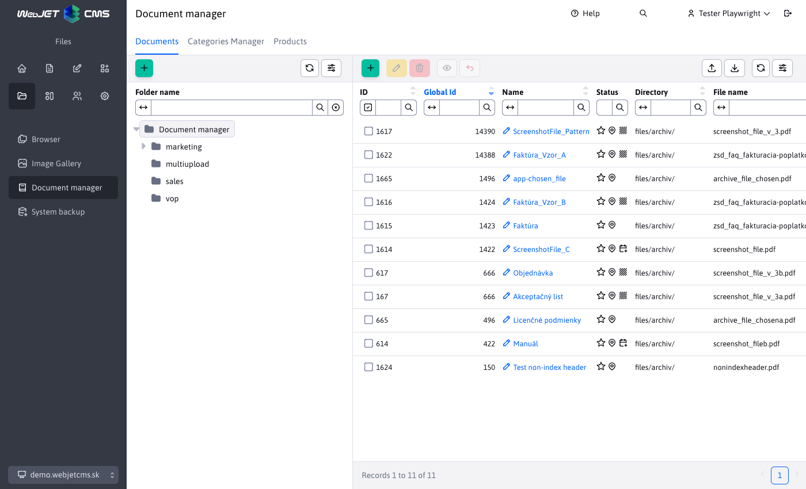
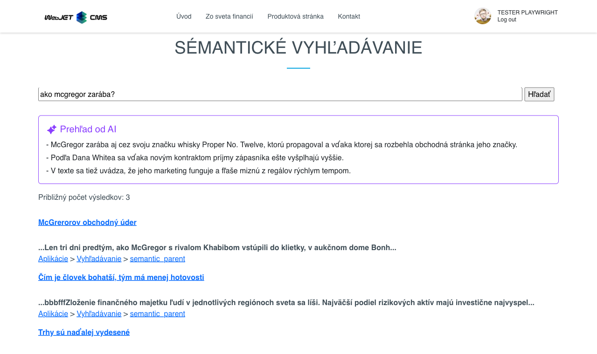
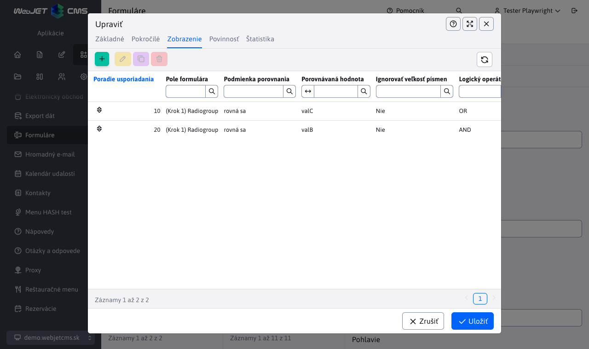
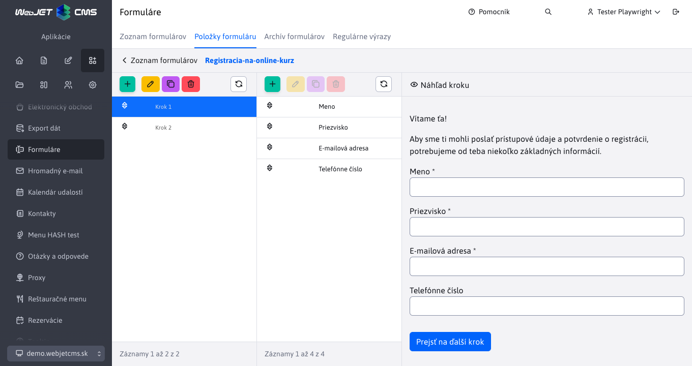

# New Features Overview - 2026

This section contains descriptions of the features and **functionalities of WebJET CMS in plain language**, without unnecessary technical formulations in 2026. New entries are added to the top (below this introduction), so the newest features are always at the top.

---

## Easily detect and remove unused files

WebJET CMS helps organizations **reveal files that are probably no longer needed** directly in the folder properties in Explorer. The administrator runs a scan of the selected folder and the system compares its contents with those used in published websites, media, banners, galleries and other standard parts of the CMS. This provides a basis for freeing up storage and removing obsolete digital content without the need for lengthy manual searches.

The scan runs **in the background without blocking work** and its scope can be customized by selecting a specific folder or including all subfolders. The result is displayed in a clear table with the name, location, modification date and file size; the file can be opened in preview before making a decision. The administrator can then remove only the marked items or the entire scanned list at once, allowing for a combination of fast bulk cleaning with individual scanning of sensitive files.

The feature respects **access rights, domain separation, and folder write permissions**. The results of individual administrators are not shared, and the system coordinates concurrent checking and deletion to reduce collisions in team management. Since a file used from custom code, an external system, or other non-standard source may not be recognized, the result is intentionally intended for a controlled administrator decision; marked files must be verified before permanent deletion.

**Main benefits:**

- **Lower storage costs**: Uncovering forgotten images, documents, and other files helps free up disk space without manual inventory.
- **Faster content maintenance**: Automatic checking of standard CMS parts replaces the tedious search for links and links to each file.
- **Flexible scope of inspection**: The administrator selects a specific folder and includes its subfolders as needed, so the cleaning can be tailored to the size and structure of the project.
- **The decision remains in control**: Preview and details about each file allow you to review the result and delete only selected items or the entire list.
- **Smooth work of administrators**: The analysis runs in the background and the system continuously displays its status, so there is no need to wait in a blocked window.
- **Securer team management**: Respecting permissions, domains, and coordinating concurrent operations reduces the risk of unwanted interference with third-party content.

Detailed documentation: [Unused files](../../redactor/files/fbrowser/folder-settings/README.md#unused-files)

## Safe cleaning and redirect optimization

WebJET CMS provides **transparent control and cleaning of URL redirects**, which naturally accumulate during the operation of the website when moving or renaming content. The system will detect outdated and duplicate rules, cyclic redirects leading the visitor into a loop, and unnecessarily long chains of multiple redirects. This way, the organization can keep the navigation on the website reliable without time-consuming manual checking of each record.

The cleaning is designed as a **controlled two-step process**. The administrator first runs the analysis and sees each proposed change in a clear table; only then does he confirm its implementation. In the case of duplicates, the system preserves the original record, in the case of a cycle, the step that closes the loop is removed, and the string of the type `/a → /b → /c` is shortened to the more direct `/a → /c`. This reduces the risk of unintentional interventions and at the same time, visitors and search engines get to the target content in a shorter and more reliable way.

The analysis respects **domain separation** and can optionally include rules without an assigned domain. It leaves special pattern-based redirects and time-based rules unchanged. If the same domain is managed by multiple administrators, the system will not allow concurrent cleaning, which helps prevent collisions. The solution is therefore also suitable for large websites with a large number of redirects and multiple administrators.

**Main benefits:**

- **Lower risk of broken links**: Revealing outdated rules and cycles helps reliably lead visitors to the right content.
- **Faster and easier maintenance**: Automatic analysis replaces the tedious manual review of a large number of redirects.
- **Check before making changes**: The administrator sees the exact proposed changes and starts the cleaning only after it is verified and confirmed.
- **Shorter path to content**: Shortening strings reduces unnecessary intermediate steps for both visitors and search engines.
- **Secure multi-site management**: Redirects are evaluated separately for the selected domain and the system protects against concurrent administrator interventions.
- **Preserve special rules**: Time-controlled and advanced redirects remain untouched, so automation respects individual project settings.

Detailed documentation: [Cleaning redirects](../../redactor/webpages/redirects/README.md#cleaning-redirects)

## Faster document management and uploading

WebJET CMS connects the **Document Manager directly to the website editor**. When creating a link, the editor can browse the archive folders, select a document and paste its address without copying between multiple windows. If the document does not yet exist, it can be uploaded directly in the same dialog. Publishing attachments, forms, price lists or annual reports is thus faster and less prone to errors.

The Document Manager itself has a **clear folder tree structure** with the ability to create new folders and filter documents by selected location. Multiple files can be uploaded at once by simply dragging them from your computer (`drag&drop`), while the system displays the progress of each item and the entire upload. This allows teams to process large document updates much more efficiently without tediously repeating the same steps.

When a file with the same name is found, the system pauses the upload and offers a **safe decision for each file or for the entire batch**: skip it, replace the current document, or save it as a new version while preserving the previous version in history. The update is performed over the existing record, so its metadata and links are preserved. Allowed file types, target folders, and write permissions respect the project settings, making the solution **controlled, safe, and customizable** to the needs of the organization.

**Main benefits:**

- **Fewer steps when publishing**: The editor finds, uploads, and inserts the document directly from the link dialog without switching between applications and manually copying the URL.
- **Fast bulk updates**: Multiple documents can be uploaded at once and a common decision applied to the entire batch, saving time when regularly changing price lists, forms, or product materials.
- **Duplicate Control**: The system prompts for a decision before overwriting a file, reducing the risk of unwanted loss or creating messy copies.
- **Document History and Continuity**: Selecting a new version will preserve the original document in history while preserving existing metadata and links.
- **Clearer content organization**: The folder tree and filtering shorten the time it takes to search for documents and manage large archives.
- **Secure operation according to organization rules**: Uploading respects allowed file types, destination folder, and user access rights.

Detailed documentation: [Document Manager](../../redactor/files/file-archive/README.md) | [Inserting file links](../../redactor/webpages/working-in-editor/README.md#file-links-and-uploading-files)

## Headless CMS for modern and flexible websites

WebJET CMS can be used in **headless mode**, where it remains a central place for content management, but the appearance and user interface of the website can be created in any modern technology. Content, navigation, news and search are provided via **API (Application Programming Interface)**, thanks to which the customer is not tied to a single presentation layer or a single way of creating a website.

A single WebJET CMS installation can **centrally manage content for multiple websites and domains**, even if each of them uses a different design or technology, such as `Astro, Next.js, Vue` or `React`. An organization can launch new portals, microsites or digital services faster without building a separate editorial administration for each project. At the same time, it can continue to use existing WebJET CMS applications, such as the gallery, forms or cookie consent management.

The solution also provides a **ready-made demo application**, which reduces the time and risk of first deployment. It transfers SEO data, supports preview of unpublished content and preservation of user sessions. Access can be limited to allowed domains and IP addresses, and requests to change data are protected against forgery. The customer thus obtains an **scalable architecture with controlled security**, suitable for the gradual modernization of large websites.

**Main benefits:**

- **Freedom in choosing technology**: The frontend can be created in the technology most suitable for a specific project without losing comfortable content management in WebJET CMS.
- **One administration for multiple websites**: Central content management for multiple domains reduces duplication, operating costs, and editor training requirements.
- **Faster time to market for digital services**: Ready-made interfaces and a sample application accelerate the development and validation of a new solution.
- **Reuse of existing features**: The new website can use content, search, news, forms, gallery, and cookie management from the existing CMS.
- **Secure and controlled linking**: Allowed domains, IP restrictions, and request protection help protect the content and traffic of linked sites.
- **Room for gradual modernization**: An organization can modernize individual websites at its own pace without having to replace the entire content management system at once.

Detailed documentation: [Headless mode](../../frontend/headless/README.md) | [Sample application](../../frontend/headless/example.md) | [Available services](../../frontend/headless/services.md)

## AI answer directly in web search

WebJET CMS extends search with the ability to display **brief AI answers above the results**. Visitors no longer have to click through multiple pages to find basic information. The system first finds relevant parts of the content and then creates a clear answer from them, which helps to understand the topic faster and continue to the right content.

From a customer perspective, this results in **faster information delivery**, a better user experience, and a higher likelihood of the visitor staying on the site. The feature is especially useful for large portals, product sites, and customer zones, where people often ask questions in natural language. The new settings also allow you to choose whether to use classic, semantic, or **hybrid search** (a combination of question meaning and full text), so that results can be tailored to a specific type of content.

An important advantage is **control and safer operation**. The answer is created only from indexed web content, while it is possible to set context limits, similarity and AI assistant selection. The organization thus gains modern functionality, but with clear rules over output quality, costs and operational risk. The solution is also **extensible** via configuration and API (interface for connecting to other systems), which is important for corporate and enterprise deployments.

**Main benefits:**

- **Faster path to the answer**: The visitor gets the gist of the information right above the search results.
- **Higher satisfaction and lower bounce rates**: Less searching and clicking means a smoother user experience.
- **Better relevance of results**: Hybrid mode combines the benefits of semantic and fulltext according to the type of query.
- **Control over quality and costs**: Adjustable context, similarity, and assistant selection limits help keep responses accurate and efficient.
- **Extensibility for enterprise projects**: The function can be customized through configuration and connections to existing customer processes.

Detailed documentation: [Semantic Search (RAG)](../../redactor/apps/semantic-search/README.md)

## Smart search by question meaning

WebJET CMS delivers **semantic search** that goes beyond keyword matching, but also understands **the meaning of the user query**. This means that visitors will find relevant content even when they don't use the exact wording from the web. The result is a more natural search that behaves more closely to how people actually ask questions.

For the customer, this means **higher success rate of finding an answer on the first try**, fewer page bounces and a better user experience, especially on content-intensive websites. The feature is suitable for the public sector, corporate portals, product websites and customer service centers, where regular full-text search often returns too many irrelevant results.

The solution is also **flexible and extensible**. It is possible to combine classic full-text and semantic search (hybrid mode), adjust the sensitivity of results and adapt it to the customer's infrastructure, including a separate vector database. In practice, this brings lower operational risk, better scalability and the possibility of gradual deployment without the need to change the entire website at once.

**Main benefits:**

- **More relevant results for visitors**: The system searches by meaning, not just by exact words, which increases the chance that the user will quickly find what they need.
- **Higher conversion and user satisfaction**: Fewer blind results and a shorter path to information help reduce website bounces.
- **Competitive advantage of modern AI search**: The organization gains a feature that conventional CMS solutions often lack in production quality.
- **Secure and scalable deployment**: Support for a standalone vector database enables deployment even in environments where the main database is not PostgreSQL.
- **Fine-tuning capability**: Configurable parameters allow you to balance accuracy, performance, and cost according to the type of project.

Detailed documentation: [Semantic Search](../../custom-apps/apps/rag/semantic-search/README.md) | [Managing Indexed Data](../../redactor/apps/semantic-search/README.md)

## Smart forms that adapt to user responses

WebJET CMS brings **conditional display and conditional field requirement** to multi-step forms, allowing the form to **dynamically change while being filled out**. The user sees only the questions that are relevant to their situation, and the system automatically determines which fields must be filled in. In practice, this means a shorter, more understandable form without unnecessary steps.

This brings a measurable business effect for the customer: **higher form completion rates**, fewer submission errors, and better quality data for further processing in the store, marketing, or customer support. When a form is personalized to the user, frustration is reduced, completion time is shortened, and the chance that the visitor will actually submit the form increases.

The solution is also prepared for long-term project growth. The administrator can **set rules directly in the editor** without interfering with the code, and the functionality is **extensible** for customer-specific processes (for example, different logic for different types of queries, client segments, or internal workflows). It also includes protection against invalid configurations, which reduces operational risk when editing the form.

**Main benefits:**

- **More accurate data collection**: Conditional field requirements ensure that the system only requests data that is truly necessary in a specific situation.
- **Better user experience**: Dynamic display shortens the form and makes it clearer even for more complex processes.
- **Quick edits without development**: Sales or marketing teams can change form logic directly in the administration.
- **Lower operational risk**: Field dependency checks help prevent invalid settings and regressions.

Detailed documentation: [Conditional display/item validation](../../redactor/apps/multistep-form/README.md#conditional-displayitem-validation)

## Automated website accessibility testing

WebJET CMS introduces **automated accessibility testing**, which verifies whether websites and the administrative interface are accessible to **all users** — including those with visual, hearing, motor or cognitive disabilities. The system automatically checks compliance with the international standard **WCAG 2.2** (Web Content Accessibility Guidelines) at levels A and AA, which is a requirement of EU and Slovak legislation for public sector websites and increasingly for commercial entities.

In practice, this means that **every change to the website can be automatically checked** for accessibility before it is put into operation. The developer does not have to manually check dozens of rules, because the system can do it for him automatically and repeatedly with each change.

Accessibility testing can be **built directly into the development process**, it is not an external audit performed once a year. This means that problems are captured continuously and fixed at the moment of their occurrence, which is **significantly cheaper and faster** than additional correction after an external audit. The system generates **clear HTML reports** with a detailed description of each violation, which facilitates communication between the development team and those responsible for accessibility.

**Main benefits:**

- **Compliance with legislation**: Automatic checking ensures that the website meets the requirements of the European Web Accessibility Directive (EAA) and Slovak legislation, thus preventing the customer from legal risks and fines.
- **Inclusive website for all**: The website is also accessible to people with health limitations, which expands the potential target group and improves the organization's reputation.
- **Continuous control instead of a one-time audit**: Every change is automatically verified, so problems are caught immediately — fixing them at the moment they occur is an order of magnitude cheaper than an additional audit.
- **Lower repair costs**: Early detection of breaches reduces accessibility repair costs by up to 80% compared to post-production repairs.
- **Clear reports**: Automatically generated HTML reports with a description of violations and their severity simplify repair prioritization and team communication.
- **WCAG 2.2 standard support**: The check covers the latest version of the standard, including levels A and AA, ensuring up-to-dateness against future legislative requirements.

Detailed documentation: [Accessibility Testing](../../developer/testing/a11y.md)

## AI Skills — intelligent skills for faster CMS development and management

WebJET CMS integrates a set of **AI Skills** — specialized artificial intelligence skills that significantly **accelerate the development, maintenance, and expansion** of web projects. AI Skills work directly in the development environment (VS Code with GitHub Copilot) and can **automatically generate ready-made code, tests, documentation, and entire new modules** based on a simple request in accordance with the conventions and structure of WebJET CMS. This way, the developer does not have to manually create dozens of files and remember all the technical details — just describe what he needs, and AI Skills will deliver a functional result.

For the customer, this means, above all, **significantly faster delivery of new features and modifications**. Changes that previously took hours or days can now be delivered in minutes. Equally important is the **rapid prototyping** option — the customer can have a prototype of a new module, form or administration page prepared almost immediately and decide whether the direction is right, even before investing in full development. If the customer has their own development team and is modifying the project independently, they can **use AI Skills directly** — the system will guide them through the entire process and ensure that the result is compatible with the WebJET CMS architecture.

Deploying AI Skills also increases the **quality and consistency** of the code you deliver. Each skill enforces best practices, automatically adds tests, and adheres to design conventions, reducing the risk of errors and simplifying future maintenance.

**Main benefits:**

- **Faster Delivery**: New features and customizations are available in a fraction of the original time, reducing time to market.
- **Rapid prototyping**: The customer receives a working prototype of the new module almost immediately and can evaluate it before approving full development.
- **Lower development costs**: Automating routine tasks reduces the number of developer hours needed.
- **Higher code quality**: AI Skills follow best practices, generate tests, and check for consistency, reducing errors.
- **Customer Independence**: Customers with their own development team can use AI Skills themselves to extend and customize their project.
- **Ease of use**: Just describe the requirement in plain language — AI Skills will translate the intent into ready-made, functional code.

### Available AI Skills

| Skill | Description |
| ----------- | ------- |
| **Creating an application (AppStore)** | Generates a complete application for the page editor — Java class, template, configuration, and registration in the application list. |
| **Creating an administration page (DataTable)** | It prepares the entire CRUD module for administration — database entity, REST interface, HTML page, and automated tests. |
| **Automated E2E tests (CodeceptJS)** | Writes end-to-end browser tests that verify the functionality of pages, forms, and permissions. |
| **Code Review** | Reviews code changes for correctness, security, backward compatibility, and adherence to project conventions. |
| **Accessibility Audit** | It will perform a web accessibility audit according to the WCAG 2.2 standard and suggest fixes for keyboard navigation, contrast, and screen readers. |
| **Documentation update** | It automatically updates technical documentation based on code changes, keeping documentation always up to date. |
| **Comment translation** | Translates source code comments from Slovak to English without changing functionality, improving readability for international teams. |
| **Marketing content** | Based on the changes delivered, it generates materials for the blog, social networks, or changelog — saving the marketing team time. |
| **Description of properties for sale** | Analyzes technical changes and creates a clear description from the customer's perspective and business benefits. |

## Logging in via OAuth2/Keycloak

WebJET CMS now supports **user login via external identity providers** such as Google, Facebook, GitHub, Okta or the enterprise Keycloak server. Technically, this is the **OAuth2/OpenID Connect** standard — in practice, this means that users can log in **with one click via an account they already have** (for example, a corporate Google account or an **enterprise SSO** system), without having to remember another password. The website administrator simply configures which providers they want to allow, and the system automatically displays the appropriate login buttons.

The key advantage is **automatic synchronization of groups and rights**. If the organization uses a corporate identity server (e.g. Keycloak), WebJET CMS can automatically download the groups and roles in which the user is included at each login, and **assign him the corresponding rights** in the CMS. This eliminates the need for manual authorization management — when an employee's role changes in the corporate system, **the change is automatically transferred to WebJET CMS**. Administrators are set up automatically based on membership in a defined group, which simplifies access management even in large organizations.

The solution is **flexible and extensible** — the customer can configure any OAuth2 provider, not just the predefined ones (Google, Facebook, GitHub, Okta). **simultaneous use of multiple providers** is also supported (e.g. Keycloak for administrators and Google for the customer zone) and the configuration can be fully customized to the needs of the organization, including custom login attributes. It is possible to set up different providers with different levels of rights synchronization for both the customer zone and the administration.

**Main benefits:**

- **Single Sign-On (SSO)**: Users log in with an account they already know — no more passwords to remember, increasing both security and convenience.
- **Automatic rights synchronization**: Groups and roles are downloaded from the corporate identity server at every login — eliminating the need for manual rights management in the CMS.
- **Support for any OAuth2 provider**: In addition to the predefined ones (Google, Facebook, GitHub, Okta), any custom OAuth2/OpenID Connect server can be configured.
- **Enterprise-level security**: Authentication takes place on the side of a verified provider — WebJET CMS never stores passwords for external services, which reduces security risks.
- **Separate configuration for admin and customer zones**: Different providers for different parts of the system allow precise access control by user type.
- **Lower operating costs**: Central user management in one system (e.g. Keycloak) reduces administrative burden and eliminates duplicate account management.
- **Easy installation**: For popular providers (Google, Facebook) you only need to set two configuration parameters; for enterprise Keycloak, a ready-made Docker configuration is available.

    <iframe width="560" height="315" src="https://www.youtube.com/embed/q8xs3qDq-G4" title="YouTube video player" frameborder="0" allow="accelerometer; autoplay; clipboard-write; encrypted-media; gyroscope; picture-in-picture" allowfullscreen></iframe>

Detailed documentation: [OAuth2 Authentication](../../install/oauth2/oauth2.md) | [Keycloak - Installation and Configuration](../../install/oauth2/keycloak.md)

## Multi-step forms

WebJET CMS offers multi-step forms that **divide long forms into smaller, more user-friendly parts**. Instead of one cluttered form, the visitor gets a **clearly guided step-by-step process**, which reduces the feeling of being overwhelmed and helps increase the number of successfully completed submissions. This functionality is suitable for registrations, inquiry forms, recruitment forms, applications, or internal collection processes, for example.

It is also important for the customer that the form does not have to remain in its basic settings. Individual steps can be named, supplemented with introductory texts and button texts can be customized according to a specific campaign or process. The solution thus combines **better user experience** with a high level of customization without the need to prepare each form from scratch.

**Main benefits:**

- **Higher submission success**: Dividing the form into steps reduces the barrier to completion and helps guide visitors to submission.
- **Better user experience**: The form looks clearer, less stressful, and is better to use even with larger amounts of data.
- **Suitable for various scenarios**: The solution can be used for sales, marketing, HR and customer service without changing the basic principle.
- **Easy communication customization**: Step and button texts can be customized to suit a specific campaign goal or corporate style.

Detailed documentation: [Multistep Forms](../../redactor/apps/multistep-form/README.md)

### Flexible form editor without programmer dependency

The solution includes an editor where the administrator can **continually modify the form according to current needs**. Steps and individual items can be added, duplicated, moved, reordered, and continuously checked in the preview. This significantly reduces the time needed to prepare new forms and allows you to quickly respond to new business or operational requirements.

A big advantage is also the high degree of variability. For individual fields, it is possible to set **obligation to fill in, validation rules, pre-filled values**, help texts or information bubbles. In addition, forms can be **personalized with data** about the logged in **user** and adapted to specific display scenarios. For the customer, this means less dependence on the supplier and a greater ability to adjust processes on their own.

**Main benefits:**

- **Quickly deploy changes**: Marketing or admin can edit the form without lengthy development and waiting for technical intervention.
- **More accurate data collection**: Required fields, validation rules, and help texts reduce error rates and increase the quality of collected data.
- **Personalization for greater comfort**: Pre-filling data about the logged-in user speeds up completion and reduces the number of abandoned forms.
- **Future extensibility**: Field types and available settings can be customized to suit the needs of a specific project or segment.

    <iframe width="560" height="315" src="https://www.youtube.com/embed/XRnwipQ-mH4" title="YouTube video player" frameborder="0" allow="accelerometer; autoplay; clipboard-write; encrypted-media; gyroscope; picture-in-picture" allowfullscreen></iframe>

Detailed documentation: [Multistep Form Editor](../../redactor/apps/multistep-form/README.md)

### Form statistics for quick decision making

WebJET CMS complements multi-step forms with a **clear statistics section** that shows not only the number of submitted responses, but also **average completion time**, the number of days since the form was created, and the time of the last response. This gives the customer an **instant picture of whether the form is working**, whether it is understandable for users, and whether it is worth working on further.

Even more valuable are **charts of responses for individual questions**. The organization can determine which fields it wants to track, what type of chart to use, how many responses to display, and whether to combine less frequent or incomplete responses. In practice, this means that marketing, sales, or HR teams get **visual and quickly readable data** without the need to export data to external tools. At the same time, the solution remains flexible, as statistics settings can be changed directly on the form items.

**Main benefits:**

- **Instant form performance insights**: Basic metrics help you quickly assess whether your form is meeting its goal.
- **Better decision-making without additional tools**: Response graphs allow you to make operational decisions directly in the system administration.
- **Higher quality of data interpretation**: The ability to group responses, display unanswered items, or filter top values ​​refines the view of user behavior.
- **Customization**: The chart type, color scheme, and display method can be set based on what a specific team needs to track.

Detailed documentation: [Multistep Form Statistics](../../redactor/apps/multistep-form/stat.md)
