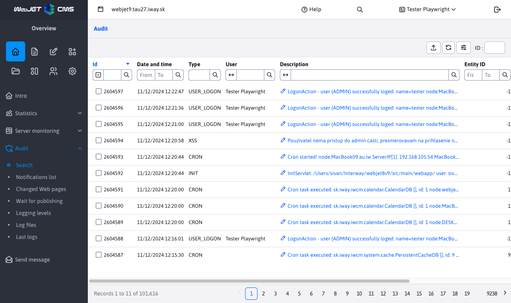

# Audit

The Audit application is a tool for tracking changes in the system. The Audit -> Search section allows you to view and filter individual recorded values. Filtering is possible by type of audit records, time, user, etc.

# Types of audit records

Each audit record automatically records the date and time, the ID of the logged-on user, the IP address, and, if the reverse DNS server is enabled, the computer name. The cluster node name, URI address, domain, and the value of the User-Agent http header are automatically inserted into the text of the audit record.
- `ADMINLOG_NOTIFY` - change in the list of notifications in the Audit application.
- `BANNER` - operations in the Banner System application
- `BASKET` - operations in the E-Commerce application
- `CALENDAR` - operations in the Event Calendar application
- `CONF_DELETE` - deleting a configuration variable, records its name
- `CONF_UPDATE` - changing or adding a configuration variable (in the Settings section), records the name, current value and new value of the variable
- `COOKIE_ACCEPTED` - acceptance of cookies on the website
- `COOKIE_REJECTED` - refusal to use cookies on the website
- `CRON` - logs background jobs running if the Audit option is checked. It also saves errors during task execution (if any), in which case it logs `Stack Trace`.
- `DATA_DELETING` - records the execution of the data deletion in Settings-Data deletion. Records the key that was deleted in the cache, or `ALL` to delete everything. When deleting the image cache, it records the path to the directory. When deleting the persistent cache, records the record ID.
- `DMAIL` - Bulk email application
- `DMAIL_AUTOSENDER` - used in the special situation of automatic sending of bulk email
- `DMAIL_BLACKLIST` - change in Bulk email->Unsubscribed emails
- `DMAIL_DOMAINLIMITS` - change in Bulk email->Domain limits
- `EXPORT_WEBJET` - not used
- `EXPORT` - data export operations (add, change, delete data export)
- `FILE_CREATE` - create a file or directory, record the path
- `FILE_DELETE` - deleting a file or directory, records the path
- `FILE_EDIT` - renaming, or editing a file, records the path
- `FILE_SAVE` - saving a file, e.g. when copying/moving it, etc. Record the path to the file
- `FILE_UPLOAD` - Uploading a file to WebJET, either via classic upload or Drag & Drop. It typically records the path to the uploaded file.
- `FORMMAIL` - submitting the form. It records the successful submission with a report `FormMail formName:` the name of the form, the list of beneficiaries and `referer`. On failure, it records the reason for not sending with a report `ERROR: formName:` name of the form, `fail:` reason for not sending. It also records spam detection by reporting `detectSpam TRUE:` reason for detection as spam.
- `FORM_ARCHIVE` - archiving the form, records the name of the form
- `FORM_DELETE` - form deletion, records the name of the form and possibly the ID if it is a deletion of a single record
- `FORM_EXPORT` - export of the form via the Export tab, currently universal export via buttons under the table is not recorded. The date of the last export is determined by this record for the ability to export since the last export.
- `FORM_REGEXP` - change in Forms->Regular expressions
- `FORM_VIEW` - not used
- `FORUM_SAVE` - detects the detection of vulgarity in the discussion forum
- `FORUM` - operations in the Discussion app
- `GALLERY` - changes in the Gallery app - creating a directory, adding/deleting a photo
- `GDPR_FORMS_DELETE` - GDPR application, deletion of old forms
- `GDPR_USERS_DELETE` - GDPR application, deleting old users
- `GDPR_BASKET_INVOICES_DELETE` - GDPR application, deleting old orders from e-commerce
- `GDPR_EMAILS_DELETE` - GDPR application, deleting old emails
- `GDPR_REGEXP` - GDPR application, regular expression management
- `GDPR_DELETE` - GDPR application, data deletion settings
- `GDPR_COOKIES` - GDPR application, cookie management
- `GROUP` - create/save/delete a directory in the Web pages section
- `HELPDESK` - not used
- `HELP_LAST_SEEN` - is used to record the date the What's New section is displayed in the help. When logging in, this section looks for the most recent file and compares it against the recorded date in Audit. If there is a newer file, a pop-up help window with the What's New section will appear after logging in.
- `IMPORTXLS` - Excel file import, used in customer implementations. Records the path to the imported file and its size
- `IMPORT_WEBJET` - not used
- `INIT` - WebJET initialization (start), records the path to the directory in which WebJET was started on the application server and the WebJET version number
- `INQUIRY` - operations in the Poll app
- `INQUIRY` - adding a question in the Poll app, records the text of the question
- `INSERT_SCRIPT` - change in the Scripts application
- `INVENTORY` - operations in the Property application
- `JSPERROR` - error when executing a JSP file when displaying a web page, logged `Stack Trace` errors
- `MEDIA` - Media operation (Media tab in the web page).
- `MEDIA_GROUP` - Media group management application.
- `PAGE_DELETE` - delete, move to trash, or request to delete a page, records the page ID
- `PAGE_UPDATE` - records changes in the page outside the standard saving in the editor - bulk operations in the page list
- `PAYMENT_GATEWAY` - calling the payment gateway in the E-Commerce application
- `PEREX_GROUP_CREATE` - create a perex group, record its name
- `PEREX_GROUP_DELETE` - deleting a group's perex, records its name and ID
- `PEREX_GROUP_UPDATE` - change the perex of a group, record its name
- `PERSISTENT_CACHE` - change in Data deletion->Persistent cache objects
- `PROP_DELETE` - deleting the translation text, records the language and key
- `PROP_UPDATE` - editing the translation text (in the Settings section), records the language, key and value
- `PROXY` - proxy application operations
- `QA` - operations in the Questions & Answers app
- `REDIRECT_CREATE` - create a new redirect (url or domain)
- `REDIRECT_DELETE` - deleting a redirect (url or domain), records the source and, for the domain, the destination of the redirect
- `REDIRECT_UPDATE` - change redirection (url or domain), record source and destination address
- `RUNTIME_ERROR` - logs a missing template for page view
- `SAVEDOC` - saving the web page in the Editor, it also records requests for approval. Records page title, page ID and ID in history
- `SENDMAIL` - sending an email (outside of forms), records the sender's email, the recipient's email and the subject of the email
- `SE_SITEMAP` - file generation `/sitemap.xml`, records the ID of the directory for which the sitemap is being generated and the contents of the User-Agent header
- `SQLERROR` - database error, logs the SQL error, the source of the error and `Stack Trace`
- `TEMPLATE_DELETE` - deleting a template, records the name of the deleted template
- `TEMPLATE_INSERT` - create a new template, record its name
- `TEMPLATE_UPDATE` - change in template, records list of changed fields
- `TEMPLATE_GROUP` - change in template group
- `TIP` - operations in the Tip of the Day app
- `TOOLTIP` - change in the Tooltip app
- `UPDATEDB` - making changes to the database via the admin console
- `USER_AUTHORIZE` - user authorization (approval of access to the password-protected section). Records the ID of the deleted user, if the user's ID is also known `login` and name.
- `USER_CHANGE_PASSWORD` - audits the user's password change. Based on the date, the password change interval is calculated (if set)
- `USER_DELETE` - deleting a user. Records the ID of the deleted user, if known, and the user's `login` and name.
- `USER_EDIT` - records the user's edit open event, it is not yet a save. Logs the user ID, `login` and name.
- `USER_GROUP_DELETE` - delete a user group, record the group name and its ID
- `USER_GROUP_INSERT` - create a new user group, record the name of the new group and its type
- `USER_GROUP_UPDATE` - save a group of users, record the name of the group and a list of changes
- `USER_INSERT` - creating a new user (or a new registration in a password-protected section). Record the user ID, `login` and name.
- `USER_LOGOFF` - logging out a user by clicking on the logout icon, it records the login name and information about whether the user is an administrator or a registered visitor
- `USER_LOGON` - user login, records the login name and information about whether the user is an administrator or a registered visitor. It also logs an invalid password event if the user is not authorized or the login name is unknown
- `USER_PERM_GROUP` - operations with rights groups, records the name of the group and, when changed, the list of changes
- `USER_SAVE` - records changes to the user in a password-protected section (if it contains a form for changing data)
- `USER_UPDATE` - saving an existing user. Records the current rights settings and changes to the entered data
- `WEB_SERVICES` - customer calls `WebServices` (usage depends on the implementation for a specific customer)
- `XSRF` - XSRF attack on the server (unauthorized referer header), logs the domain name value from `referer` Headers
- `XSS` - XSS attack on the server or a direct (unauthorized) call to a JSP file. Logs the URL or expression for which the attack was evaluated (e.g., unauthorized token in the URL, unauthorized HTTP method). Also logs cookie stealing (session IP address change).

# Special audit format

If necessary, code can be added to WebJET that will save audit records to a special file or send them to a designated service. It is necessary to set the conf. variable `adminlogCustomLogger` to a Java class that implements the class `sk.iway.iwcm.AdminlogCustomLogger`. For each entry, the method is called `addLog(logType, requestBean, descriptionParam, timestamp)`
