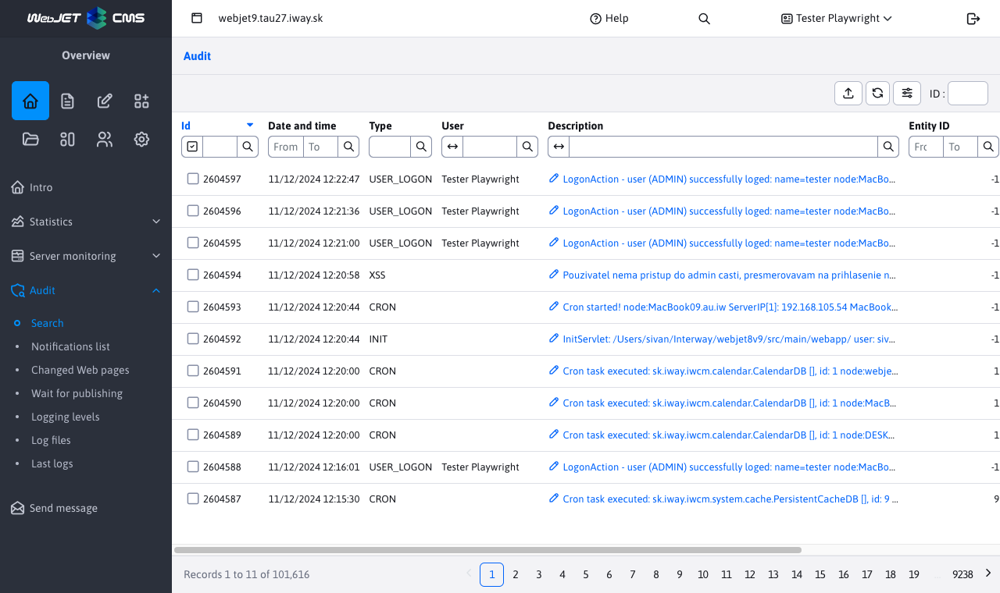

# Audit

The Audit application is a tool for tracking changes in the system. The Audit -> Search section allows you to view and filter individual recorded values.
Filtering is possible by audit trail type, time, user, etc.



# Types of audit trails

Each audit log automatically records the date and time, the logged-in user ID, the IP address, and if reverse DNS is enabled, the computer name. The cluster node name, URI, domain, and the value of the User-Agent http header are automatically inserted into the audit log text.

- ```ADMINLOG_NOTIFY``` - ​​change in the list of notifications in the Audit application.
- ```BANNER``` - ​​operations in the Banner System application
- ```BASKET``` - ​​operations in the E-commerce application
- ```CALENDAR``` - ​​operations in the Event Calendar application
- ```CONF_DELETE``` - ​​delete configuration variable, record its name
- ```CONF_UPDATE``` - ​​change or add a configuration variable (in the Settings section), records the name, current value, and new value of the variable
- ```COOKIE_ACCEPTED``` - ​​accepting cookies on the website
- ```COOKIE_REJECTED``` - ​​refusal to use cookies on the website
- ```CRON``` - ​​records background tasks running if Audit is checked. It also records errors during task execution (if any occur), in which case it records ```Stack Trace```.
- ```DATA_DELETING``` - ​​records the execution of data deletion in Settings-Data deletion. Records the key that was deleted in the cache, or ```ALL``` to delete everything. Records the path to the directory when deleting the image cache. Records the record ID when deleting the persistent cache.
- ```DMAIL``` - ​​Bulk Email application
- ```DMAIL_AUTOSENDER``` - ​​used in a special situation of automatically sending mass email
- ```DMAIL_BLACKLIST``` - ​​change in Bulk Email->Unsubscribed Emails
- ```DMAIL_DOMAINLIMITS``` - ​​change in Bulk Email->Domain Limits
- ```EXPORT_WEBJET``` - ​​not used
- ```EXPORT``` - ​​operations in the Data Export application (adding, changing, deleting data export)
- ```FILE_CREATE``` - ​​create a file or directory, record the path
- ```FILE_DELETE``` - ​​delete file or directory, records path
- ```FILE_EDIT``` - ​​renaming or editing a file, records the path
- ```FILE_SAVE``` - ​​saving a file, e.g. when copying/moving it, etc. Records the path to the file
- ```FILE_UPLOAD``` - ​​uploading a file to WebJET, either via classic upload or Drag & Drop. Typically records the path to the uploaded file.
- ```FORMMAIL``` - ​​form submission. Records successful submission with message ```FormMail formName:``` form name, recipient list and ```referer```. In case of failure, records the reason for non-submission with message ```ERROR: formName:``` form name, ```fail:``` reason for non-submission. Records also spam detection with message ```detectSpam TRUE:``` reason for detection as spam.
- ```FORM_ARCHIVE``` - ​​form archiving, records the form name
- ```FORM_DELETE``` - ​​delete form, records form name and possibly ID if deleting a single record
- ```FORM_EXPORT``` - ​​export form via the Export tab, currently universal export via the buttons below the table is not recorded. This record determines the date of the last export for the export from last export option.
- ```FORM_REGEXP``` - ​​change in Forms->Regular expressions
- ```FORM_VIEW``` - ​​not used
- ```FORUM_SAVE``` - ​​records detection of vulgarity in a discussion forum
- ```FORUM``` - ​​operations in the Discussion application
- ```GALLERY``` - ​​changes in the Gallery application - creating a directory, adding/deleting photos
- ```GDPR_FORMS_DELETE``` - ​​GDPR application, deleting old forms
- ```GDPR_USERS_DELETE``` - ​​GDPR application, deleting old users
- ```GDPR_BASKET_INVOICES_DELETE``` - ​​GDPR application, deleting old orders from e-commerce
- ```GDPR_EMAILS_DELETE``` - ​​GDPR application, deleting old emails
- ```GDPR_REGEXP``` - ​​GDPR application, regular expression management
- ```GDPR_DELETE``` - ​​GDPR application, data deletion settings
- ```GDPR_COOKIES``` - ​​GDPR application, cookie management
- ```GROUP``` - ​​create / save / delete directory in the Web page section
- ```HELPDESK``` - ​​not used
- ```HELP_LAST_SEEN``` - ​​used to record the date the What's New section was displayed in the Help. When logging in, the latest file is searched in this section and compared against the date recorded in Audit. If there is a newer file, a Help pop-up window with the What's New section is displayed after logging in.
- ```IMPORTXLS``` - ​​Excel file import, used in customer implementations. Records the path to the imported file and its size
- ```IMPORT_WEBJET``` - ​​not used
- ```INIT``` - ​​WebJET initialization (start), records the path to the directory in which WebJET was run on the application server and the WebJET version number
- ```INQUIRY``` - ​​operations in the Poll application
- ```INQUIRY``` - ​​adding a question in the Poll application, records the question text
- ```INSERT_SCRIPT``` - ​​change in the Scripts application
- ```INVENTORY``` - ​​operations in the Asset application
- ```JSPERROR``` - ​​error executing JSP file when displaying web page, logs ```Stack Trace``` errors
- ```MEDIA``` - ​​operation with Media (Media tab in the web page).
- ```MEDIA_GROUP``` - ​​media group management application.
- ```PAGE_DELETE``` - ​​deleting, moving to trash, or requesting page deletion, records page ID
- ```PAGE_UPDATE``` - ​​records changes to the page outside of the standard save in the editor - bulk operations in the page list
- ```PAYMENT_GATEWAY``` - ​​calling the payment gateway in the E-commerce application
- ```PEREX_GROUP_CREATE``` - ​​creation of a perex group, records its name
- ```PEREX_GROUP_DELETE``` - ​​delete perex group, record its name and ID
- ```PEREX_GROUP_UPDATE``` - ​​change perex group, record its name
- ```PERSISTENT_CACHE``` - ​​change in Data Deletion->Persistent cache objects
- ```PROP_DELETE``` - ​​delete translation text, record language and key
- ```PROP_UPDATE``` - ​​editing the translation text (in the Settings section), records the language, key and value
- ```PROXY``` - ​​operations in the proxy application
- ```QA``` - ​​operations in the Questions and Answers application
- ```REDIRECT_CREATE``` - ​​creating a new redirect (url or domain)
- ```REDIRECT_DELETE``` - ​​delete redirect (url or domain), records the source and, for the domain, the redirect target
- ```REDIRECT_UPDATE``` - ​​change redirect (url or domain), records source and destination address
- ```RUNTIME_ERROR``` - ​​reports a missing page view template
- ```SAVEDOC``` - ​​saves a web page in the Editor, also records approval requests. Records the page title, page ID and history ID
- ```SENDMAIL``` - ​​sending an email (outside forms), records the sender's email, recipient's email, and the subject of the email
- ```SE_SITEMAP``` - ​​generating file ```/sitemap.xml```, records the directory ID for which the sitemap is generated and the contents of the User-Agent header
- ```SQLERROR``` - ​​database error, logs SQL error, error source and ```Stack Trace```
- ```TEMPLATE_DELETE``` - ​​template deletion, records the name of the deleted template
- ```TEMPLATE_INSERT``` - ​​creating a new template, records its name
- ```TEMPLATE_UPDATE``` - ​​change in template, records a list of changed fields
- ```TEMPLATE_GROUP``` - ​​change in template group
- ```TIP``` - ​​operations in the Tip of the Day application
- ```TOOLTIP``` - ​​change in the Tooltip application
- ```UPDATEDB``` - ​​making changes to the database via the admin console
- ```USER_AUTHORIZE``` - ​​user authorization (approval of access to a password-protected section). Records the ID of the deleted user, if their ```login``` and name are also known.
- ```USER_CHANGE_PASSWORD``` - ​​audits user password changes. Based on the date, the password change interval is calculated (if set)
- ```USER_DELETE``` - ​​user deletion. Records the ID of the deleted user if their ```login``` and name are also known.
- ```USER_EDIT``` - ​​records the event of opening the user's edit, it is not yet a save. It records the user ID, ```login``` and name.
- ```USER_GROUP_DELETE``` - ​​delete a user group, records the group name and its ID
- ```USER_GROUP_INSERT``` - ​​creating a new user group, records the name of the new group and its type
- ```USER_GROUP_UPDATE``` - ​​save user group, records group name and list of changes
- ```USER_INSERT``` - ​​creating a new user (or new registration in a password-protected section). Records the user ID, ```login``` and name.
- ```USER_LOGOFF``` - ​​logging out a user by clicking on the logout icon, records the login name and information about whether they are an administrator or a registered visitor
- ```USER_LOGON``` - ​​user login, records the login name and information about whether the user is an administrator or a registered visitor. It also records the event of entering an invalid password if the user is not authorized or the login name is unknown
- ```USER_PERM_GROUP``` - ​​operations with rights groups, records the group name and, when changed, a list of changes
- ```USER_SAVE``` - ​​records changes to the user in a password-protected section (if it contains a form for changing data)
- ```USER_UPDATE``` - ​​save an existing user. Records the current rights settings and changes to the entered data
- ```WEB_SERVICES``` - ​​calling customer ```WebServices``` (usage depends on the implementation for a specific customer)
- ```XSRF``` - ​​XSRF attack on the server (illegal referer header), records the domain name value from the ```referer``` header
- ```XSS``` - ​​XSS attack on the server or direct (unauthorized) call to a JSP file. Records the URL address or expression that caused the attack to be evaluated (e.g., an unauthorized token in the URL, an unauthorized HTTP method). Records also cookie theft (change of session IP address).

# Special audit format

If necessary, it is possible to add code to WebJET that will save audit records to a special file or send them to a specified service. It is necessary to set the conf. variable ```adminlogCustomLogger``` to a Java class that implements the class ```sk.iway.iwcm.AdminlogCustomLogger```. The method ```addLog(logType, requestBean, descriptionParam, timestamp)``` is called for each entry

