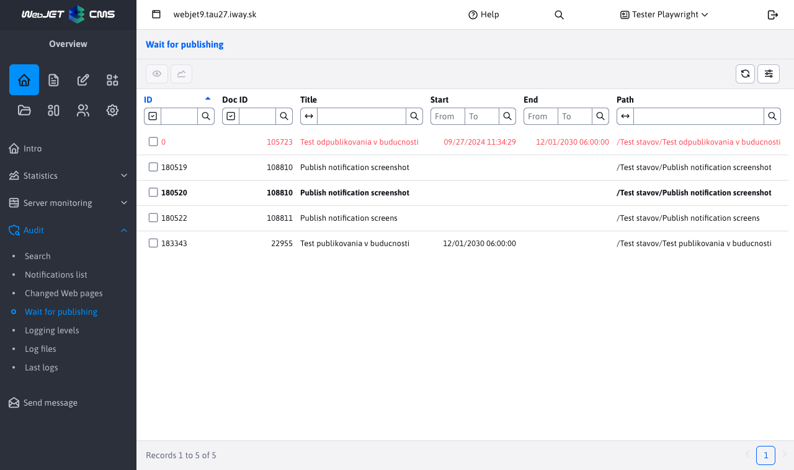

# Awaiting publication

The Pending menu item lists the pages that are scheduled to be published in the future. It contains information about what web page (at what address/path) and when it will be published. For more information about the web pages, please click here [List of web pages](../../redactor/webpages/README.md).

The goal is to clearly display a list of pages that will be automatically changed in the future. All pages are displayed, regardless of the user's rights to the page tree structure and the selected domain.

Web pages that are waiting for display to be turned off are shown in red - they are set to Publish page after this date. Such pages will not be publicly viewable after the set date.

The list does not show the pages in the trash, no publishing is done for those.

