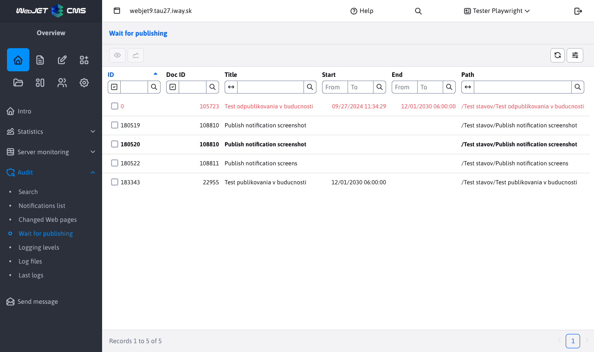

# Awaiting publication

The Pending publication menu item lists pages that are scheduled for publication in the future. It contains information about which website (at what address/path) and when it will be published. More information about websites can be found here [List of websites](../../redactor/webpages/README.md).

The goal is to clearly display a list of pages that will be automatically changed in the future. All pages are displayed regardless of the user's rights to the page tree structure and the selected domain.

Red indicates web pages that are waiting to be turned off - they have the option to Make the page public after this date set. Such pages will not be publicly viewable after the set date.

Pages in the trash are not displayed in the list; publishing is not performed for them.

