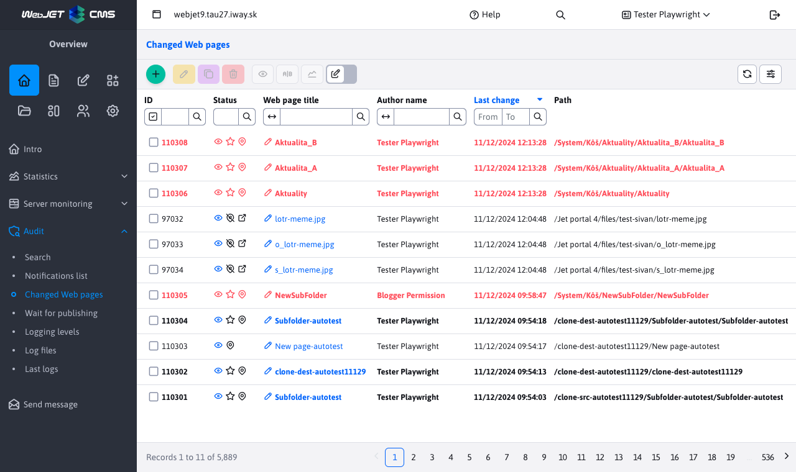

# Changed pages

In the menu item Changed pages you can see a list of changed pages, sorted by the last changed. You can work with these pages in the same way as in the [List of web pages] section (../../redactor/webpages/README.md).

All pages are displayed regardless of the user's rights to the page tree structure and the selected domain.

