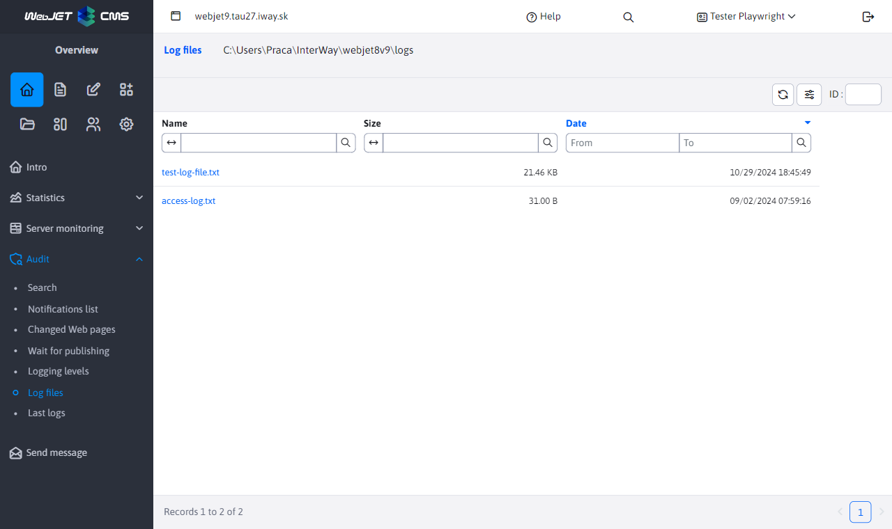
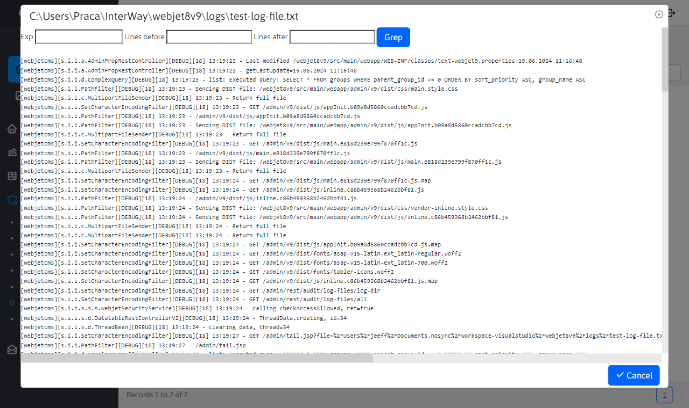

# Log files

The application provides an overview of all log files. Modifications above the table are not allowed. The table is for overview only. In the top left of the page, you can see the path where these files are stored.

When you click on the file name, a window with the contents of the file is displayed. The header contains fields for the ability to filter through the file using regular expressions (or directly by search term only).

