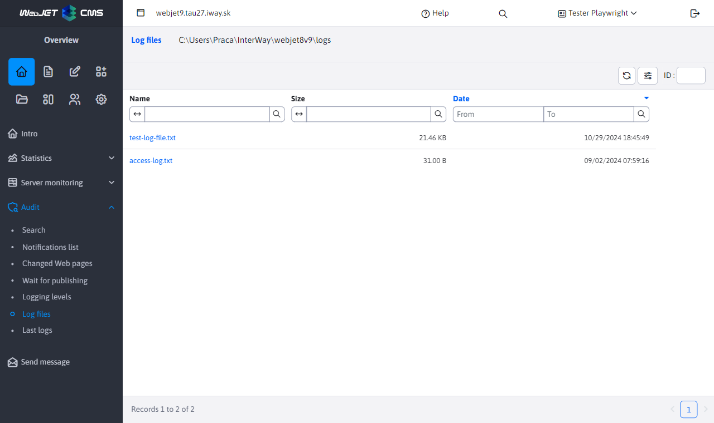
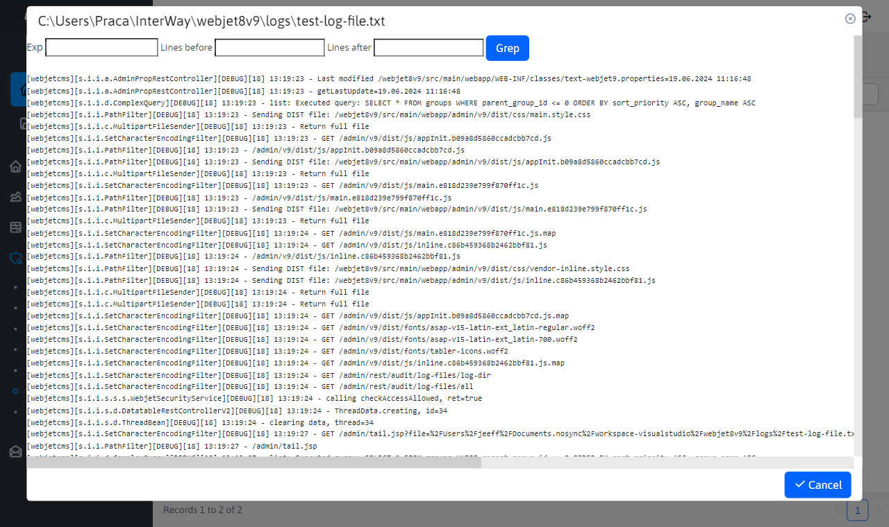

# Log files

The application provides an overview of all log files. Editing above the table is not allowed. The table is for overview purposes only. In the upper left part of the page, you can see the path where these files are stored.

When you click on the file name, a window with the file contents will appear. The header contains fields for filtering the file using regular expressions (or directly just the search term).

