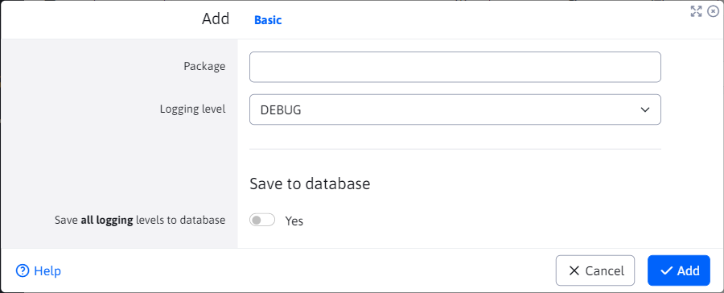

# Logging levels

The Logging Levels application allows you to manage the logging levels for individual java packages.


The first record in the table is always **Main logging level** (basic level).

2  configuration variables are used:
- **logLevel**, contains the logging level value for **Main logging level**
- **logLevels**, contains a list of java packages with logging levels (each on a new line). For example:

```
sk.iway=DEBUG
sk.iway.iwcm=WARN
org.springframework=WARN
```

Changes above the table are stored locally in a constant. If you want to save the changes (settings) permanently, in the editor you need to select the option **Save to database**. When saved, the configuration variables in the database are updated.

# Add

For add actions, the java package value and logging level are required. If you specify an already added package, a duplicate value is not created but the existing one is updated.



# Edit by

The editing action behaves differently for the Main logging level and other logging levels.

## Main logging level

When editing the main level, we can only select NORMAL or DEBUG logging (for detailed logging). If you change the value in the editor `Package`, no change shall be made. Since the main level must still be present, only the logging level value can be changed.

## Other logging

The logging level change will be saved, if you change the package, the original logging will disappear and will be replaced by this new one. All logging levels are allowed except the NORMAL value.

# Lubrication

All logging level packages can be deleted except **Main logging level**. When you try to delete it, nothing will happen to it (not even the value will change).
