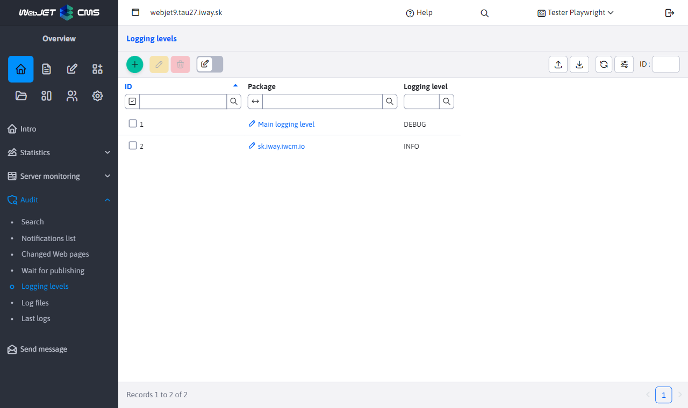
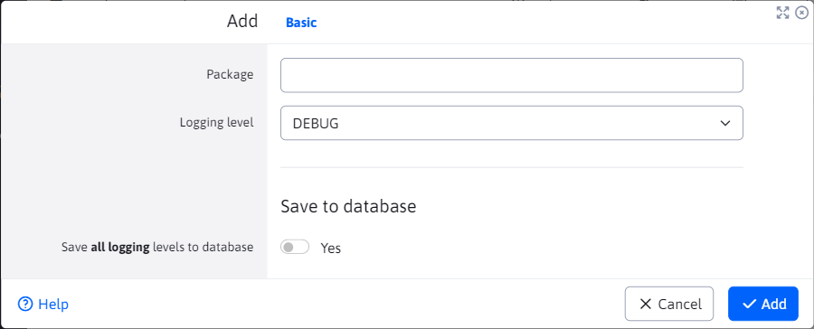

# Logging levels

The Logging Levels application allows you to manage logging levels for individual Java packages.



The first entry in the table is always **Main logging level** (basic level).

2 configuration variables are used:

- **logLevel**, contains the logging level value for **Main logging level**
- **logLevels**, contains a list of java packages with logging levels (each on a new line). For example:

```
sk.iway=DEBUG
sk.iway.iwcm=WARN
org.springframework=WARN
```

Changes above the table are stored locally in a constant. If you want to save the changes (settings) permanently, you need to select the **Save to database** option in the editor. When saving, the aforementioned configuration variables in the database are updated.

# Adding

The add actions require a java package and logging level value. If you specify a package that has already been added, a duplicate value will not be created but the existing one will be updated.



# Editing

The edit action behaves differently for the Main logging level and other logging levels.

## Main logging level

When editing the main level, we can only select NORMAL or DEBUG (for detailed logging). If you change the value of `Package` in the editor, no change will be made. Since the main level must always be present, only the value of the logging level can be changed.

## Other logging

The change in logging level is saved, if you change the package, the original logging will disappear and be replaced by this new one. All logging levels except NORMAL are allowed.

# Lubrication

All packages with logging levels can be deleted except **Main Logging Level**. When you try to delete it, nothing will happen to it (not even the value will change).