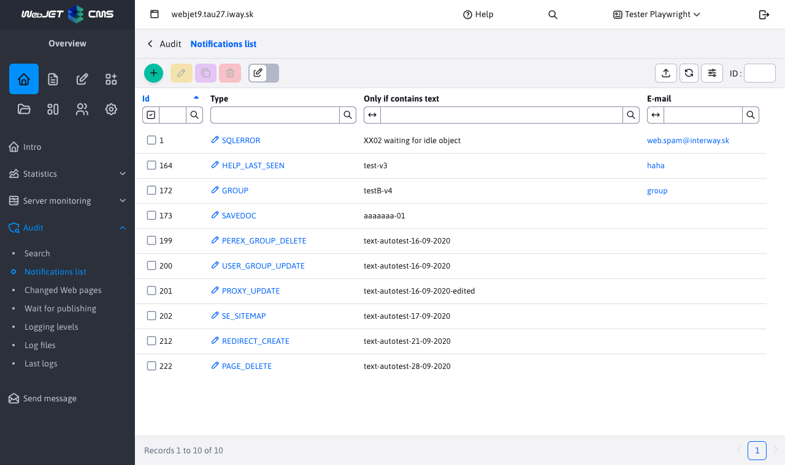

# List of notifications

In the menu item Notification list you can set up email notifications for certain system events/errors. We recommend to set notification for events of the type `XSS` a `SQLERROR`.

In the editor, you can also set the additional text that the error must contain to be sent to the specified email.

The recipient's email will be used as the sender's email. If necessary, the sender name and email of all audit notification emails can be set using configuration variables `auditDefaultSenderName` a `auditDefaultSenderEmail`.
