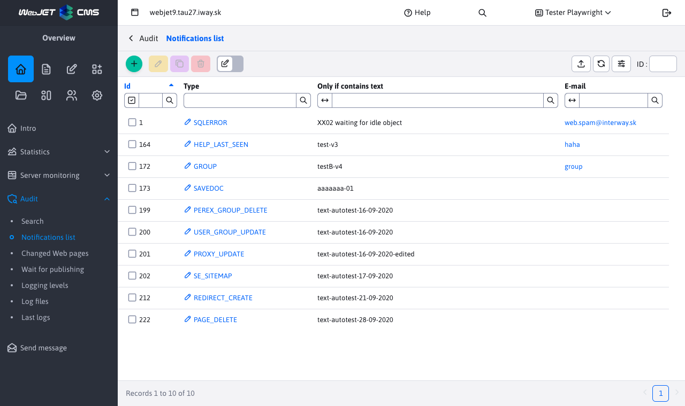

# Notification list

In the Notification List menu item, you can set up email notifications for certain events/system errors. We recommend setting up notifications for events of the `XSS` and `SQLERROR` types.

In the editor, you can also set additional text that the error must contain in order to be sent to the specified email.

The sender email will be the recipient's email. If necessary, you can set the sender name and email for all audit notification emails using the configuration variables `auditDefaultSenderName` and `auditDefaultSenderEmail`.