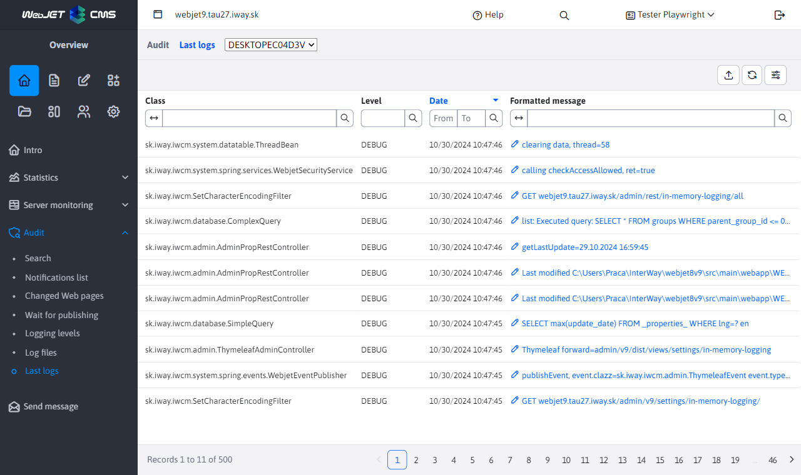

# Latest logs

The application is designed to display the most recent logs, in case you do not have access to the logs on the file system. It displays logs that pass through the log framework (i.e. use the class `Logger`), does not display logs written directly via `System.out` or `System.err`.



It supports clustering, so it is possible to request the last logs from another node of the cluster. In the tab `Stack Trace` stack dump is located (but the contents are only displayed for error logs, for standard log levels it is empty).

## Configuration options/settings:
- `loggingInMemoryEnabled` - by setting it to `true/false` Enable or disable log storage.
- `loggingInMemoryQueueSize` - maximum number of logs written to memory (default 200). Please note that all data is loaded into the table at once and due to the transfer `stack trace` can be large. We do not recommend setting this variable to an extremely high value.
To function properly, it must be `logger` also set in the file `logback.xml`. By default it is set this way, but if you have changed the file, you need to add `IN_MEMORY appender` and add his call for `root` element.

```xml
    ...
    <appender name="IN_MEMORY" class="sk.iway.iwcm.system.logging.InMemoryLoggerAppender" />

    <root level="ERROR">
        <appender-ref ref="STDOUT" />
        <appender-ref ref="IN_MEMORY" />
    </root>
    ...
```

## Implementation details

- `sk.iway.iwcm.system.logging.InMemoryLoggerAppender` - `appender` For `logback`, which ensures that logs are sent to `InMemoryLoggingDB`
- `sk.iway.iwcm.system.logging.InMemoryLoggingDB` - class provides writing and retrieving logs from and to `queue`, retrieving logs on the cluster
- `sk.iway.iwcm.system.logging.InMemoryLoggingEvent` - model for log event
- `sk.iway.iwcm.system.logging.InMemoryLoggerRestController` - controller for log dump to DataTable
