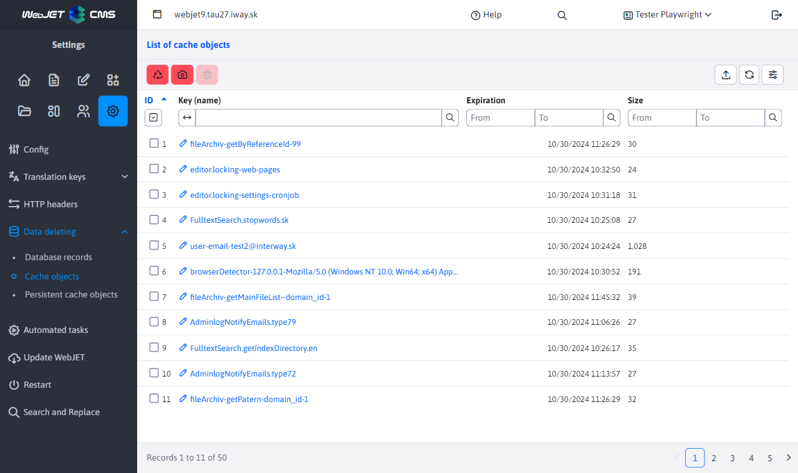

# Data deletion

Application **Data deletion** allows you to remove unnecessary data from the database, which can increase server performance and free up disk space. You can find this tool in the **Settings** under the heading **Data deletion**.

## Database records

Deleting data from selected database tables, deletion is possible from the following groups:
- **Statistics**: Removes statistical data. Deleting older data can significantly improve server performance, but you will lose information about site traffic for the selected period.
- **Emails**: Allows you to delete sent emails from the Bulk Email application and emails sent with a time delay (or emails sent within a multi-node cluster).
- **Site History**: Deletes the recorded historical versions of web pages, these are saved each time a web page is published. They are displayed in the History tab when editing a web page. Deleting does not affect the currently displayed pages, the historical versions are deleted.
- **Server monitoring**: Removes logged server monitoring data such as performance metrics and logs.
- **Audit**: Deletes audit records that monitor user activity and system events, only selected record types can be deleted.

With each deletion, an optimization of the database table is also performed to physically free up disk space and optimize the order of records in the database table.

## Cache objects

Displays a list of objects stored in the application cache and allows you to delete them individually, which can reduce memory consumption or trigger a restore of data in the server cache. By clicking on the name, you can view the contents of the record for selected data types. The object is used for work [Cache](../../../../../src/webjet8/java/sk/iway/iwcm/Cache.java)

## Persistent cache objects

Managing and deleting objects stored in a persistent cache that retains data even after a server restart (data is stored in the database). The object is used for work [PersistentCacheDB](../../../../../src/webjet8/java/sk/iway/iwcm/system/cache/PersistentCacheDB.java). Only text data can be stored in this cache, typically the method `downloadUrl(String url, int cacheInMinutes)` which downloads data from the specified URL in the background and updates it at the set time. The application uses this method and immediately retrieves the data from the cache.

