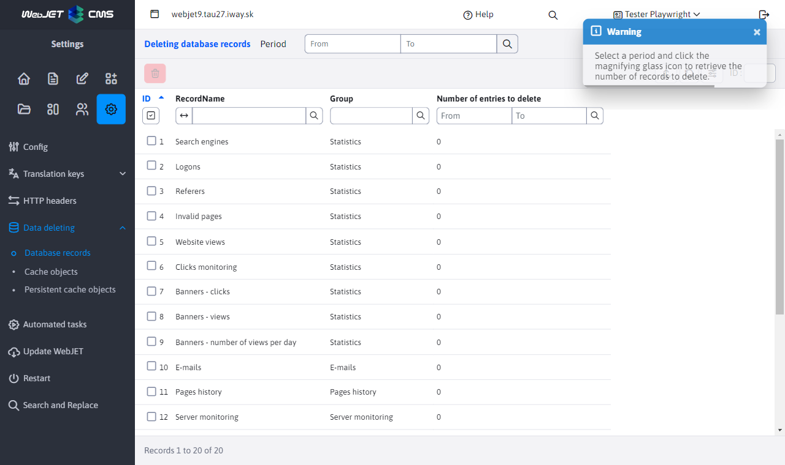
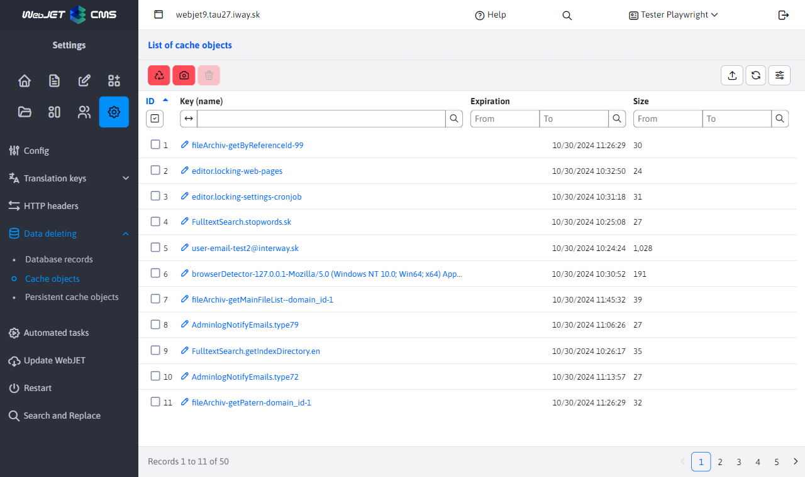
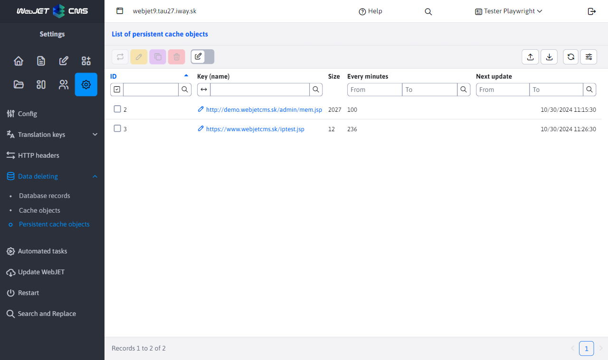

# Data deletion

The **Data Wipe** application allows you to remove unnecessary data from the database, which can increase server performance and free up disk space.
You can find this tool in the **Settings** section under **Data Erase**.

## Database records

Deleting data from selected database tables, deletion is possible from the following groups:

- **Statistics**: Removes statistical data. Deleting older data can significantly improve server performance, but you will lose information about website traffic for the selected period.
- **Emails**: Allows you to delete emails sent from the Bulk Email application and emails sent with a time delay (or emails sent within a multi-node cluster).
- **Page History**: Deletes recorded historical versions of web pages, which are saved each time a web page is published. They are displayed in the History tab when editing a web page. Deleting does not affect the currently displayed pages, historical versions are deleted.
- **Server Monitoring**: Deletes recorded server monitoring data, such as performance metrics and logs.
- **Audit**: Deletes audit logs that monitor user activities and system events, only selected log types can be deleted.

With each deletion, an optimization of the given database table is also performed to physically free up disk space and optimize the order of records in the database table.

## Cache objects

Displays a list of objects stored in the application cache and allows them to be deleted individually, which can reduce memory consumption or refresh data in the server cache. By clicking on the name, it is possible to view the content of the record for selected data types. The [Cache](../../../../src/main/java/sk/iway/iwcm/Cache.java) object is used for work

## Persistent cache objects

Management and deletion of objects stored in a persistent cache that retains data even after a server restart (data is stored in the database). The [PersistentCacheDB](../../../../src/main/java/sk/iway/iwcm/system/cache/PersistentCacheDB.java) object is used for work. Only text data can be stored in this cache, typically the `downloadUrl(String url, int cacheInMinutes)` method is used, which downloads data from the specified URL in the background and updates it at a set time. The application uses this method and immediately retrieves data from the cache.

