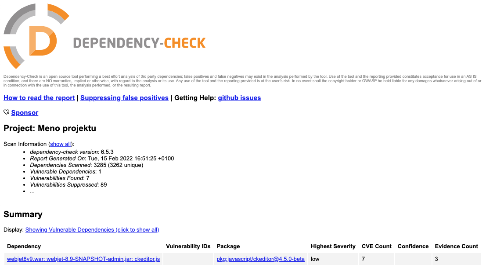

# Vulnerability scanning of libraries

Using the tool [OWASP Dependency-Check](https://jeremylong.github.io/DependencyCheck/index.html) you can easily check for vulnerabilities in the Java and JavaScript libraries of a web application. We recommend checking these on a regular basis.

If you have access to the source code/gradle of the project you can run the analysis directly using [gradlew command](../../developer/backend/security.md#kontrola-zraniteľností-v-knižniciach).

But the tool can also be run over the generated `war` web application archive. Install the version of the tool for [command line](https://jeremylong.github.io/DependencyCheck/dependency-check-cli/index.html).

You can then run the check using the command:

```sh
dependency-check --project "Meno projektu" --suppression dependency-check-suppressions.xml --suppression dependency-check-suppressions-project.xml --scan build/libs/*.war
```

parameters are set:
- `--project` - the name of the project that will be displayed in the report.
- `--suppression` - way to [file with exceptions](../../developer/backend/security.md#kontrola-zraniteľností-v-knižniciach), typically this file is part of a git repository.
- `--scan` - the path to the file/directory to be analyzed.
The result is a set of `dependency-check-report.html` in the current directory.


