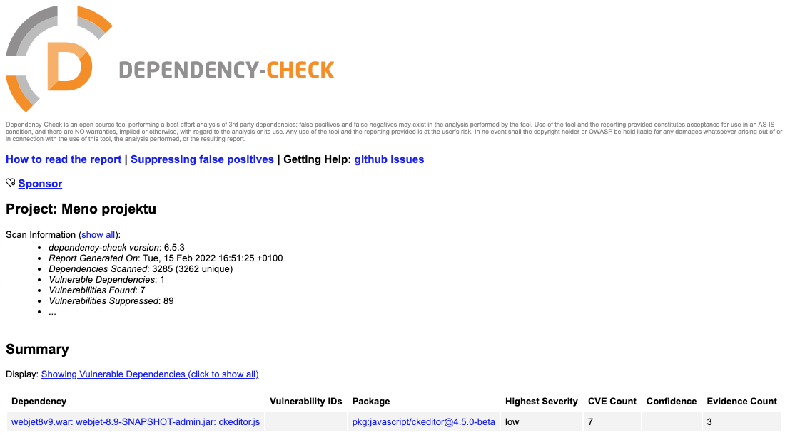

# Checking library vulnerabilities

You can easily check for vulnerabilities in your web application's Java and JavaScript libraries using the [OWASP Dependency-Check](https://jeremylong.github.io/DependencyCheck/index.html) tool. We recommend checking these on a regular basis.

If you have access to the source code/gradle project, you can run the analysis directly using the [gradlew command](../../developer/backend/security.md#library-vulnerability-check).

However, the tool can also be run on a generated ```war``` web application archive. Install the [command line](https://jeremylong.github.io/DependencyCheck/dependency-check-cli/index.html) version of the tool.

You can then run the scan using the command:

```sh
dependency-check --project "Meno projektu" --suppression dependency-check-suppressions.xml --suppression dependency-check-suppressions-project.xml --scan build/libs/*.war
```

The parameters are set to:

- ```--project``` - ​​project name that will be displayed in the report.
- ```--suppression``` - ​​path to [files with exceptions](../../developer/backend/security.md#library-vulnerability-checking), typically this file is part of a git repository.
- ```--scan``` - ​​path to the file/directory to be analyzed.

The result is the file ```dependency-check-report.html``` in the current directory.

