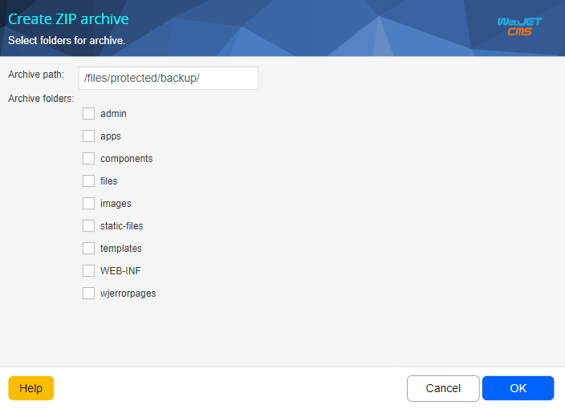

# System backup

The application is used to create a ZIP archive of individual folders of the WebJET file system. You can choose which folders to include in the ZIP archive and which folder to create the resulting ZIP archive in. A database backup is not created, this must be created with the database backup tools.

!> **Warning:** The amount of data in the selected folders can be large and the ZIP file may not be generated correctly (the limitation is to a 2GB file). If necessary, you can create backups in parts (individual folders).

This process can take several tens of minutes depending on the amount of data in the selected folders. Wait for the whole process to finish. During this time, you should see information in the window about the number of pages already generated and the total number of pages.

The result is a zip archive created in the specified folder.
