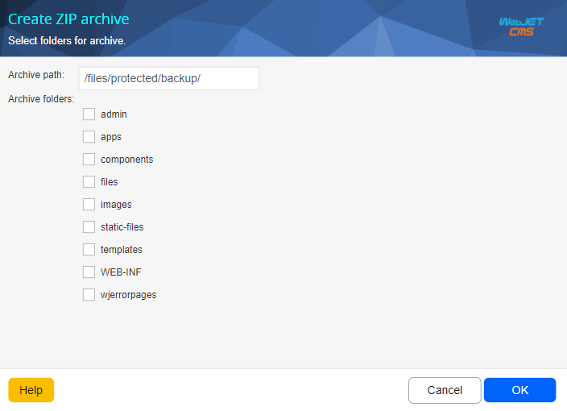

# System backup

The application is used to create a ZIP archive of individual folders of the WebJET file system. You can choose which folders to include in the ZIP archive and in which folder the resulting ZIP archive should be created. A database backup is not created, this must be created using database backup tools.

!> **Warning:** The amount of data in the selected folders may be large and the ZIP file may not be generated correctly (the limit is 2GB file). If necessary, you can create backups in parts (individual folders).

This process may take several tens of minutes depending on the volume of data in the selected folders. Wait until the entire process is finished. During this time, the window should display information about the number of pages already generated and the total number of pages.

The result is a zip archive created in the specified folder.
