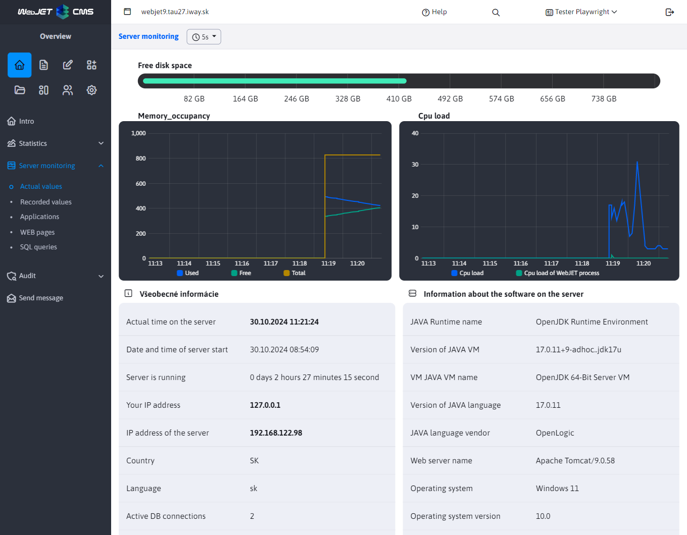
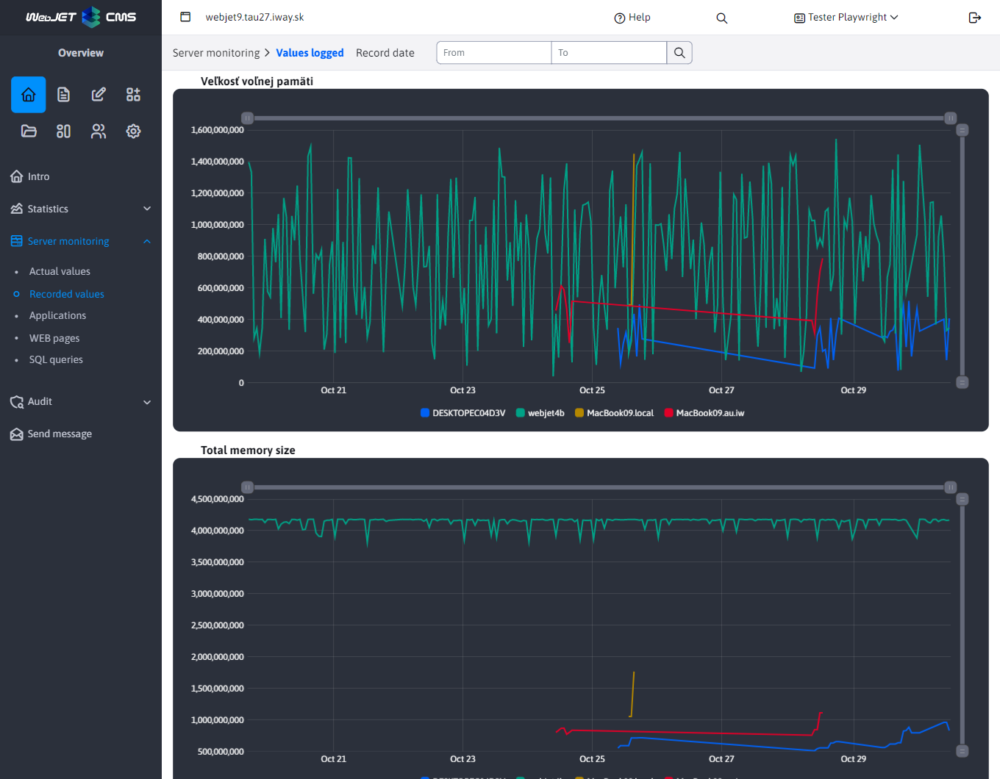

# Server monitoring

## Internal monitoring

Analysis of the performance and load of the server, individual applications, database queries, and the pages themselves can be monitored directly in the Server Monitoring application (in the WebJET administration in the Overview section).

The module provides the following options:

- **Current values** - current values ​​of server load, memory and number of database connections.



- **Recorded values** - a list of historical recorded values ​​of memory usage, ```sessions```, cache and database connections. To save historical values, you need to set the config variable ```serverMonitoringEnable``` to the value ```true```.



After setting the configuration variable ```serverMonitoringEnablePerformance``` to ```true```, the following are also available:

- **Applications** - statistics on executions of individual applications. It shows the number of executions, average execution time, number of executions from cache memory and the slowest execution.
- **WEB pages** - statistics of views of individual web pages. Shows the number of views, average view time, slowest and fastest views.

After setting the configuration variable ```serverMonitoringEnableJPA``` to ```true```, the following is also available:

- **SQL queries** - statistics on the speed of SQL query execution. It shows the number of executions, average execution time, slowest and fastest execution, and the SQL query itself.

!>**Warning:** Enabling monitoring has an impact on server performance and memory usage. In addition to the recorded values ​​option, enabling monitoring has an impact on server performance. All data except the recorded values ​​section is
kept only in the server's memory, so they will start being recorded again after it is restarted.

!>**Warning:** **Applications**, **WEB pages** and **SQL queries** module options use a unique common logic, which is described in more detail in [Server monitoring by selected node](nodes-logic.md)

## Remote server monitoring

If you need to monitor the status of WebJET via [Nagios](http://www.nagios.org) /[Zabbix](https://www.zabbix.com) or another service, WebJET provides its status at the URL ```/components/server_monitoring/monitor.jsp```. It responds with an HTTP **status 200 if everything is OK**, or **status 500** (Internal Server Error) if **all checks are not met**.

The specified URL can also be called at second intervals, we recommend using it within a cluster to monitor the availability of individual nodes.

**Allowed IP addresses** for which monitor.jsp responds correctly are set in the configuration variable ```serverMonitoringEnableIPs```.

The component monitors the following parts:

- **WebJET initialization**, including its ```preheating``` (waiting for initialization of cache objects or background tasks). The preheating time is set in the conf. variable monitoringPreheatTime (default 0). WebJET responds with the text ```NOT INITIALISED``` if it is not correctly initialized (e.g. there is no connectivity to the database at its startup, or it has an invalid license). It responds with the text ```TOO SHORT AFTER START``` during the preheating time (cluster inclusion should wait for the completion of loading cache objects/background tasks).
- Monitoring **database connection availability** - SQL select is performed from table `documents` (specifically ```SELECT title FROM documents WHERE doc_id=?```), while the configuration variable ```monitorTestDocId``` contains the docid of the tested page. If the SQL query fails, it responds with the text ```DEFAULT DOC NOT FOUND```.
- **Template availability** - if the list of initialized templates is less than 3, it responds with the text ```NOT ENOUGHT TEMPLATES```.
- **Statistics data write** - verifies that there are not a suspiciously large number of records in the statistics write stack (their number is set in the configuration variable ```statBufferSuspicionThreshold```, default 1000). If the statistics write stack contains a large amount of data to write, this indicates either a problem with the SQL server performance or a problem with background tasks. In case of exceeding the number of records, it responds with the text ```STAT BUFFER SUSPICION```.
- If **another error** occurs, it responds with the text ```EXCEPTION: xxxx```.

WebJET can also be manually **switched to service mode** by setting the configuration variable ```monitorMaintenanceMode``` to true. Then monitor.jsp responds with the text ```UNAVAILABLE```.

If everything is fine, it responds with the text ```OK```. For monitoring **it is enough to monitor the HTTP status** of the response, the text is only informative for more precise determination of the problem.

## Configuration variables

- ```serverMonitoringEnable``` - ​​if set to ```true```, it starts monitoring the server every 30 seconds and writes these values ​​to the `monitoring` table
- ```appendQueryStringWhenMonitoringDocuments``` - ​​capture SQL parameters during monitoring `?`
- ```monitorTestDocId``` - ​​ID of the page whose database connection (getting the name) is being tested in the `/components/server_monitoring/monitor.jsp` component that can be tested by the supervisory SW (default value: 1)
- ```serverMonitoringEnablePerformance``` - ​​if set to `true`, it starts monitoring the speed of SQL queries, websites and applications (default value: false)
- ```serverMonitoringEnableJPA``` - ​​if set to `true`, it starts monitoring the execution speed of SQL queries for JPA, but it results in an increase in the load on the server memory (default value: false)
- ```serverMonitoringEnableIPs``` - ​​List of IP addresses from which the `monitor.jsp` component is available for server monitoring (default value: 127.0.0.1,192.168.,10.,62.65.161.,85.248.107.,195.168.35.)
- ```monitoringPreheatTime``` - ​​Number of seconds needed to warm up the website (load cache) after a restart, during which the `monitor.jsp` component will return cluster node unavailability (default value: 0)
- ```monitoringEnableCountUsersOnAllNodes``` - ​​If public cluster nodes do not have the ability to write to the `_conf_/webjet_conf` table, set it to the value `false`. The total number `sessions` will then only be available as a sum of individual records in the server monitoring.