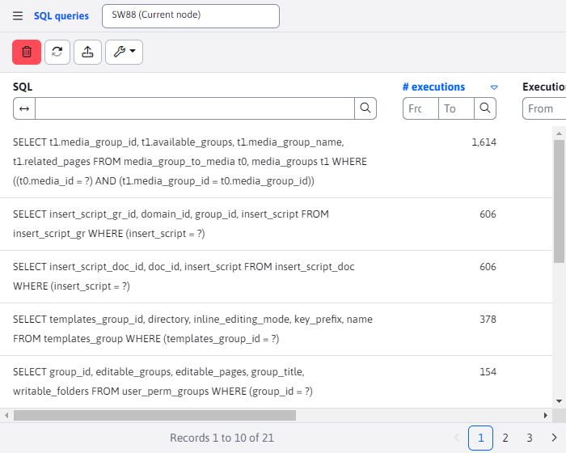
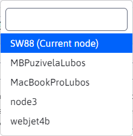
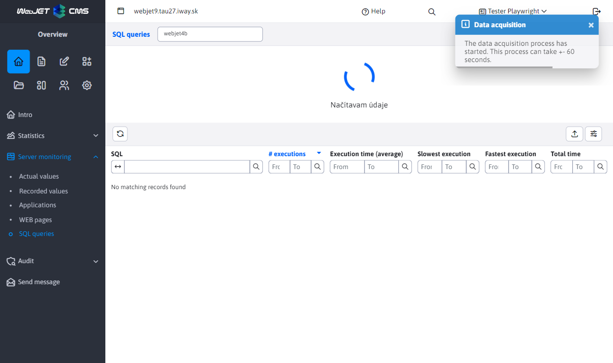

# Exchange cluster node data

Website **Applications**, **WEB pages** a **SQL queries** share the same logic regarding server monitoring according to the currently selected node. To select a node, use the field that appears in the page header next to the page name.

When opened by clicking, we can see all the available options. The default value is always the current node (the node of the cluster you are currently logged in to), which is marked with the text `(Aktuálny uzol)`.

If the selected node is current, the locally stored data is displayed. In this case, there is also a delete button that deletes this locally stored data (the delete button is only available for the current node). In the case of a node other than the current node, the data is retrieved from the database table.

## Restore data - current node

If the current node is selected, pressing the data refresh button will only retrieve the currently stored data (database tables are not worked with here). If the data was previously deleted, it may take a while for new records to appear.

## Data recovery - remote node

For nodes other than the current one, data recovery is more difficult. The data of other nodes is stored in a table `cluster_monitoring`. The data recovery process starts by deleting the data from the table, as it may no longer be up-to-date.

As you can see in the image above, the data has been removed and the animation waiting for the data is displayed. We also see an informational notification that warns us that this process may take +- a few seconds. This interval may vary depending on the configuration variable set `clusterRefreshTimeout`.

The process of retrieving current data consists of creating a request for current data for a node by creating a record in a database table `cluster_refresher`. The cluster itself in the intervals specified by the conf. variable `clusterRefreshTimeout` updates the data in the table `cluster_monitoring` for a specific node, if there is a request for that node in the table `cluster_refresher`. Therefore, the data retrieval process may take several minutes and may vary depending on the cluster refresh interval set (there may be a situation where the cluster interval was just before the refresh and the actual data is retrieved in 10 seconds, even though the interval was set to 5 minutes).

Although it is not displayed, the page will ask every 10 seconds if the table `cluster_monitoring` no new data has been added that could be displayed. If the requested node did not contain any data (but the table has already been updated), a new cluster request for the data will be created, and again we will check every 10 seconds to see if the data has already been updated. The whole process will repeat until the updated table `cluster_monitoring` will not contain at least one record to display. At that point, the animation is hidden and the currently retrieved data of the other node is displayed.
