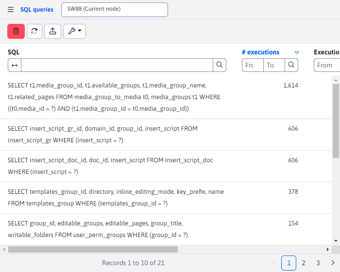
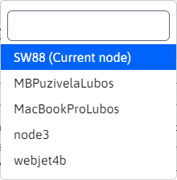
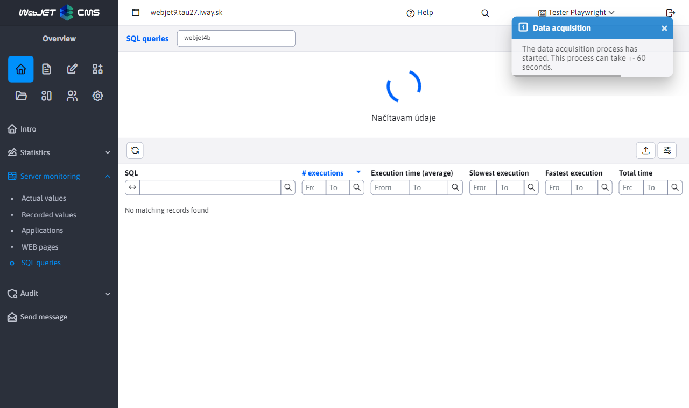

# Cluster node data exchange

The **Applications**, **WEB Pages** and **SQL Queries** pages share the same logic regarding server monitoring based on the currently selected node. The node is selected using the field located in the page header next to the page name.



After opening it by clicking, we can see all the available options. The default value is always the current node (the cluster node you are currently logged in to), which is marked with the text ```(Aktuálny uzol)```.



If the selected node is current, the locally stored data is displayed. In this case, a delete button is also available to remove this locally stored data (the delete button is only available for the current node). In the case of a node other than the current node, the data is retrieved from a database table.

## Data recovery - current node

If the current node is selected, pressing the refresh button will only retrieve the currently stored data (no database tables are being worked on here). If the data was previously deleted, it may take a while for new records to appear there.

## Data recovery - remote node

For nodes other than the current one, data recovery is more complicated. Data from other nodes is stored in the table ```cluster_monitoring```. The data recovery process begins by deleting this data from the table, as it may no longer be current.



As you can see in the image above, the data has been deleted and an animation waiting for the data is displayed. We also see an information notification that warns us that this process may take +- a few seconds. This interval may vary depending on the configuration variable ```clusterRefreshTimeout``` set.

The process of obtaining current data consists of creating a request for current data for a node by creating a record in the database table ```cluster_refresher```. The cluster itself, at intervals specified by the conf. variable ```clusterRefreshTimeout```, updates the data in the table ```cluster_monitoring``` for a specific node, if there is a request for this node in the table ```cluster_refresher```. Therefore, the data acquisition process can take several minutes and may vary depending on the set cluster refresh interval (a situation may also occur where the cluster interval was just before refresh and we obtain current data in 10 seconds, even if the interval was set to 5 minutes).

Although it is not displayed, the page will query every 10 seconds whether new data has been added to the ```cluster_monitoring``` table that could be displayed. In case the requested node did not contain any data (but the table has already been updated), a new cluster request for data will be created, and we will check again every 10 seconds whether this data has already been updated. The whole process will be repeated until the updated table ```cluster_monitoring``` contains at least one record to display. At that moment, the animation will be hidden and the currently retrieved data of another node will be displayed.