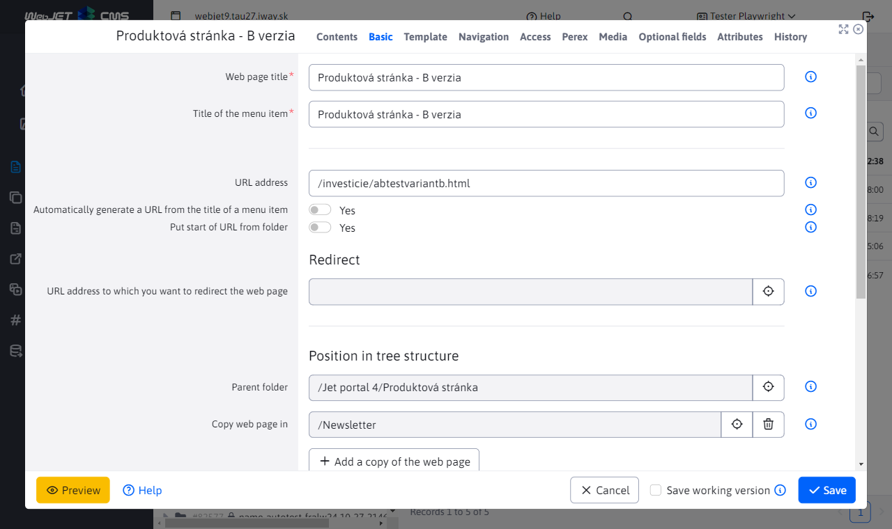

# Server performance

For optimal server performance, several requirements and settings need to be met. Each application (e.g. photo gallery, survey, etc.) embedded into a website causes slowdowns. Applications typically perform additional database requests or need to read data from the file system.

Search engines that constantly crawl and index web pages on your server can also have a significant impact on performance. Their traffic may not be visible in, for example, Google Analytics, but it is visible in the [statistics](../../redactor/apps/stat/README.md) provided by WebJET CMS.

## Problem identification

First, you need to identify the places where the slowdown occurs. If you can identify at first glance the web page that seems slow to you, you can use the URL parameter `?_writePerfStat=true`. Otherwise, turn on server monitoring, in which you can identify the web pages that are executing the longest.

### URL parameters

Using the URL parameter `?_writePerfStat=true`, it is possible to get a list of applications embedded in a web page with their execution time. For example, you can display the page `/sk/` as `/sk/?_writePerfStat=true`.

When displaying a web page in this way, an expression of the type `PerfStat: 3 ms (+3) !INCLUDE(...)` is inserted into the HTML code after each application. It may not be easy to search for in the standard web page, so we recommend viewing the source code of the page - in the Chrome menu View-Developer-View source code. Then use the search in the browser for the expression `PerfStat:`.

This expression is in the format `PerfStat: 3 ms (+3)` where the first number means the total execution time of one `iwcm:write` expression and the number in parentheses is the execution time of this application. This is followed by the path to the application and its parameters. So you are interested in the primary number in parentheses.

The application cache can be disabled using the URL parameter `_disableCache=true`.

### Server monitoring

For a comprehensive view, you can enable the [server monitoring](../monitoring/README.md) feature by setting the following configuration variables:

- `serverMonitoringEnable` - ​​enables server monitoring and logging function
- `serverMonitoringEnablePerformance` - ​​turns on the performance monitoring function for applications and websites
- `serverMonitoringEnableJPA` - ​​turns on the SQL request monitoring feature

!>**Warning:** monitoring application performance and SQL requests places a load on the server, we do not recommend having this feature permanently enabled.

After setting the configuration variables, you need to **restart the application server** to enable performance monitoring at initialization.

Then, in the Server Monitoring - Applications/WEB Pages/SQL Queries section, you can identify the parts that are taking a long time to execute. Focus on the most frequently executed applications/SQL queries and optimize them.

### Total web page generation time

There is an application `/components/_common/generation_time.jsp` that, if you insert it into the footer of a website template, will generate the total time it took to generate the website into HTML code.

The following application parameters can be set:

- `hide` - ​​default `true` - generation time will be displayed as a comment in the HTML code
- `onlyForAdmin` - ​​default `false` - generation time is only displayed if the administrator is logged in

Insert the following code into the footer (or a suitable free field) of your website template:

```html
!INCLUDE(/components/_common/generation_time.jsp, hide=true, onlyForAdmin=false)!
```

Information about the execution time of the entire web page in ms will be displayed at the location of the embedded application:

```html
<!-- generation time: 4511 ms -->
```

## Measuring database server and file system performance

To compare the performance of environments - e.g. test VS production environment, you can use the scripts below. Running them requires the right to update WebJET. You can measure and compare environments without load, but also during operation or performance tests.

- `/admin/update/dbspeedtest.jsp` - ​​measures the performance of reading data from the database server.

Good values ​​are, for example:

```html
Image read, count=445
...
Total time: 649 ms, per item: 1.4584269662921348 ms
Total bytes: 4.8050469E7, per second: 7.403770261941448E7 B/s

Random web page read, count=3716
...
Total time: 3608 ms, per item: 0.9709364908503767 ms
Total bytes: 1371566.0, per second: 380145.78713968955 B/s

Only documents.data web page read, count=3716
...
Total time: 2205 ms, per item: 0.5933799784714747 ms
Total bytes: 685783.0, per second: 311012.6984126984 B/s

Documents read using web page API, count=3716
...
Total time: 1869 ms, per item: 0.5029601722282023 ms
Total bytes: 685783.0, per second: 366925.09363295883 B/s
```

Due to the different number of records in the database, it is necessary to compare `per item` values.

- `/admin/update/fsspeedtest.jsp` - ​​checks the speed of reading the file list from the file system, it is necessary to check especially if you are using a network file system.

Good values ​​are, for example:

```html
Testing mime speed, start=0 ms
has base file object, fullPath=/Users/jeeff/Documents.nosync/workspace-visualstudio/webjet/webjet8v9-hotfix/src/main/webapp/components/_common/mime diff=1 ms
listFiles, size=678, diff=284 ms
listing done, diff=16 ms


Testing modinfo speed, start=0 ms
modinfo list, size=102, diff=1 ms
modinfo listing done, diff=220 ms
Total time=522ms
```

## Database request optimization

You can optimize the number of database requests by turning on caching - `cache`.

### Website

Every web page has an option in the Basic tab **Enable page caching**. By enabling this option, the web page content from the `documents` table will be cached. When the web page is displayed, there will be no need to make a database call to retrieve the web page content.

We recommend enabling this option on the most visited websites, a list of which can be found in the [statistics](../../redactor/apps/stat/README.md#top-sites) application.



### Applications

Similar to websites, it is possible to enable caching for applications. Some applications have this option available directly in the [application settings](../../custom-apps/appstore/README.md#display-tab) embedded in the website in the Display tab as the **Cache Time** field.


If the application does not have this setting available, you can still set the parameter in the HTML code of the web page text by adding the parameter `, cacheMinutes=xxx` to the parameters of the embedded application, for example:

```html
!INCLUDE(sk.iway.iwcm.components.reservation.TimeBookApp, reservationObjectIds=2560+2561, device=, cacheMinutes=10)!
```

!>**Note:** it is important to note that the cache is global for the entire application server. The key is the path to the application file, individual parameters specified in the HTML code of the web page, and the language of the currently displayed web page. The URL parameters of the web page are not taken into account.

The cache cannot be used, for example, if a list is displayed with a pagination where the page number is transmitted using a URL parameter. However, in order to be able to save the news list, there is an exception - for applications containing `/news/news` in the file name, the cache is used only if the URL address does not contain the parameter `page`, or the value of this parameter is different from `1`. Thus, the cache is also used for the news list, but only the first page of results is saved. Other pages are not saved.

## File system optimization

Web pages typically contain many additional files - images, CSS styles, JavaScript files, etc., which need to be loaded along with the web page. The display speed therefore also depends on the number and size of these files.

### Setting the cache

For web page files, it is possible to set the use of cache in the browser - the file will not be read repeatedly each time the web page is viewed, but if the browser already has it in the cache, it will be used. This will speed up the display of the web page and reduce the load on the server. An example is a logo image, which is typically on every page, but its change is highly unlikely - or rather, it changes on the order of once every few months.

The following configuration variables can be set that affect the HTTP header `Cache-Control`:

- `cacheStaticContentSeconds` - ​​set number of seconds, default is `300`.
- `cacheStaticContentSuffixes` - ​​list of extensions for which the HTTP header `Cache-Control` will be generated, by default `.gif,.jpg,.png,.swf,.css,.js,.woff,.svg,.woff2`.

For more precise settings, you can use the [HTTP Headers](../../admin/settings/response-header/README.md) application, where you can set different values ​​for different URLs.


## Behavior for the administrator

If an administrator is logged in, the application cache is not used (it is assumed that the administrator always wants to see the current status).

This behavior can be changed by setting the configuration variable `cacheStaticContentForAdmin` to the value `true`. This value is suitable mainly for intranet installations where users authenticate against the `SSO/ActiveDirectory` server and have administrator rights even when working normally in an intranet environment.

## Search engines

Search engines and various other robots can significantly load the server. Especially with the advent of artificial intelligence learning, there is a significant amount of Internet browsing and filling of databases for artificial intelligence training. Robots often try different URL parameters to obtain additional data.

### Robots.txt settings

The behavior of robots can be influenced by settings in the file `/robots.txt`. If this does not exist, it is generated in the default state. You place your modified version in `/files/robots.txt`, from this location WebJET will display it when calling `/robots.txt`.

Using the [robots.txt](https://en.wikipedia.org/wiki/Robots.txt) file, you can influence the behavior of robots and search engines - restrict the URLs they can use, set the interval between requests, etc.

## Other settings

### Reverse DNS server

Statistics, auditing and other applications can retrieve a reverse DNS record from an IP address. The API call `InetAddress.getByName(ip).getHostName()` is used. However, on servers/in the DMZ, the DNS server may not be available and this call may take several seconds before an error occurs. In general, such a call slows down the execution of the HTTP request.

By setting the configuration variable `disableReverseDns` to the value `true`, it is possible to disable DNS name retrieval from the visitor's IP address and speed up request execution. The value of the IP address is then written to the field for the value `hostname`.

### Disabling statistics

Writing statistics data is asynchronous, it is performed in batches so that the web page display does not wait for the statistics data to be written to the database.

During high traffic or to troubleshoot performance issues, you can temporarily disable traffic statistics logging by setting the configuration variable `statMode` to the value `none`. The default value is `new`.