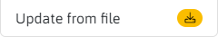
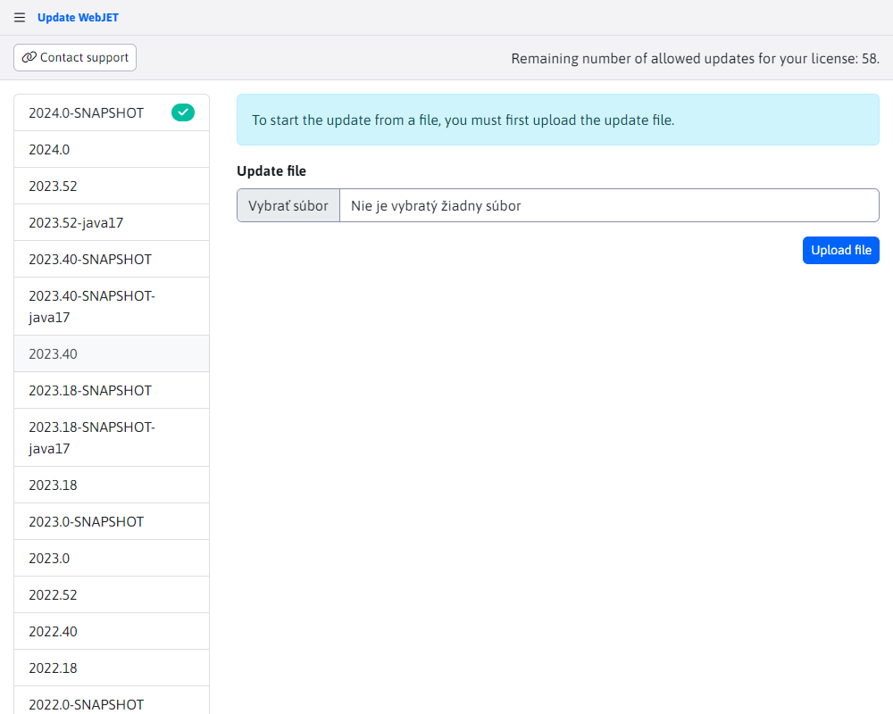

# WebJET update

The WebJET Update section is used to update WebJET versions. The left part of the screen displays a list of available WebJET versions to which your WebJET can be updated. The current version of your WebJET is marked in the list with the  icon.

When you click on individual versions, a list of all changes that the selected version brings will appear on the right side of the screen.

!>**Warning:** Only update WebJET if you know what you are doing. Before updating, contact your hosting provider for support. It may happen that WebJET does not start properly after the update and a server restart will be required.

If your project contains additional JAR libraries, you need to place them in the `/WEB-INF/lib-custom/` folder as well. During the update, the `/WEB-INF/lib/` folder is completely replaced, so your libraries would be deleted. This may result in the inability to run after a reboot. If this happens, copy the missing libraries to `/WEB-INF/lib/` from the backup.

## Update to a specific version

To update WebJET to a specific version, you need to select the desired version and then use the button to start the update

## Updating from a file

The option to use update from file is also supported. This option can also be selected in the left menu as .

You will then be prompted to select and then upload a file using the  button. If the file is successfully uploaded, you will be prompted to start the update itself using the  button.

