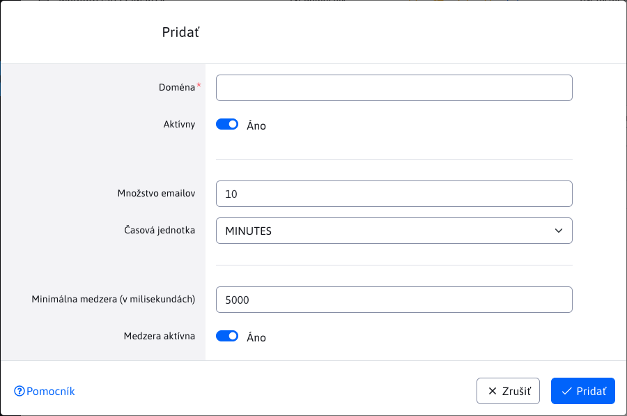

# Doménové limity

Aplikácia doménové limity umožňuje nastaviť limity počtu odosielaných emailov podľa domény. Zlepší tak doručenie emailov, pretože mail servery pri vysokom počte odoslaných emailov z jednej IP adresy môžu emaily blokovať, alebo ich rovno dávať do priečinka spam.

V tabuľke sú červenou farbou zvýraznené limity, ktoré sú neaktívne a neaplikujú sa pri odosielaní emailov. Pre presne nešpecifikované domény sa použijú hodnoty zadané pre doménu ```*```, čiže nastavenie limitov s doménou ```*``` sa aplikuje na všetky neuvedené domény.


V editácii v poli "Doména" zadajte doménové meno za zavináčom email adresy (napr. gmail.com, centrum.sk, zoznam.sk).

Pole "Množstvo emailov" definuje maximálne množstvo emailov zaslaných na danú doménu v intervale Časová jednotka. Môžete teda nastaviť napr. 10 emailov za minútu.

Pole "Minimálna medzera (v milisekundách)" nastavuje minimálny interval medzi jednotlivými emailami. Nastavením hodnoty 5000 bude minimálny interval 5000 ms (5 sekúnd) medzi odoslaniami emailu na zadanú doménu.

