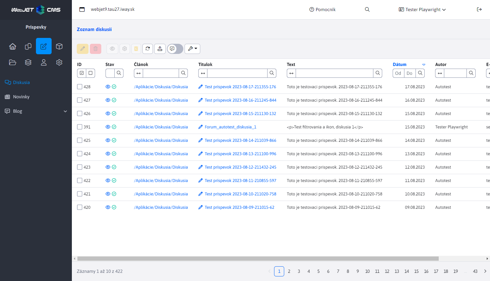
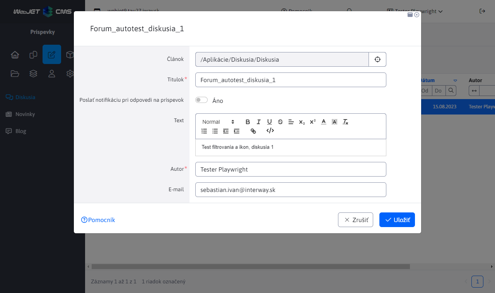
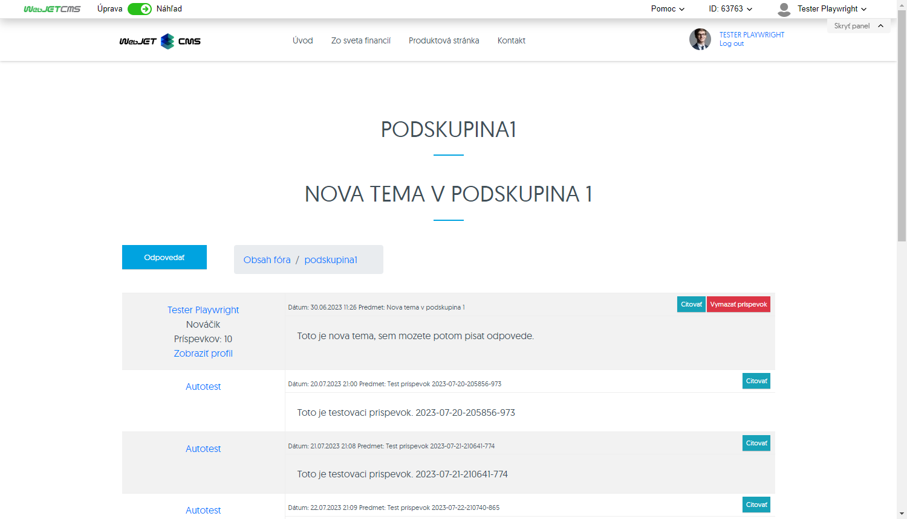
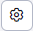
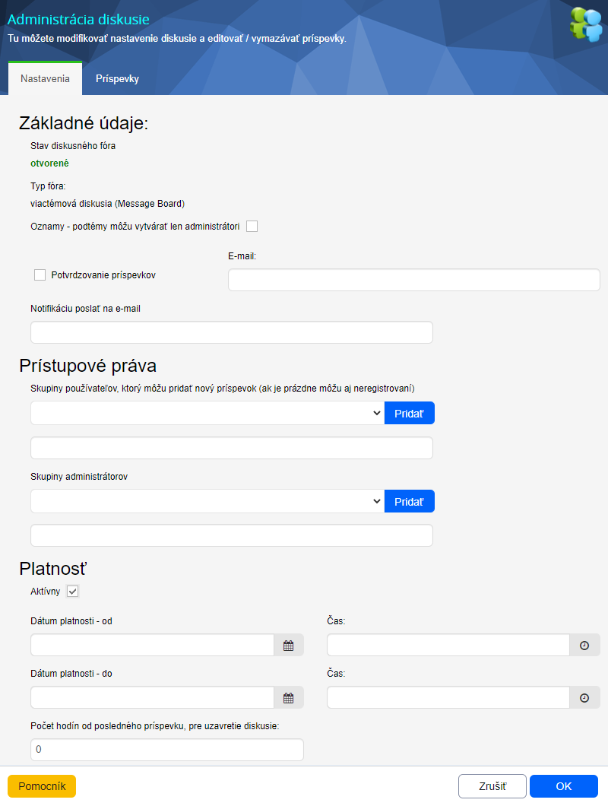
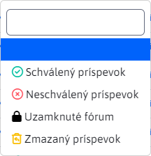

# Zoznam diskusií

Zoznam diskusií sa nachádza v sekcií Príspevky. Obsahuje zoznam všetkých príspevkov, ktoré patria pod ```Diskusné fóra``` a ```Message board```.



## Editácia príspevku

Na editáciu príspevku slúži tlačidlo , ktoré vyvolá editor a je aktívne iba ak je označený aspoň jeden príspevok. Editor môže byť vyvolaný aj kliknutí na hodnotu stĺpca ```Titulok``` v tabuľke.



Editor obsahuje polia:

- Článok - web stánka, ku ktorej je diskusia pripojená
- Titulok - predmet/názov príspevku
- Text - samotný text príspevku
- Autor - meno autora príspevku
- E-mail - email adresa autora príspevku, posiela sa naň notifikácia v prípade odpovedi na príspevok (ak je táto možnosť zvolená).

## Mazanie a obnovenie príspevku

Na vymazanie príspevku slúži tlačidlo  a je aktívne iba ak je označený aspoň jeden príspevok. Mazanie má dva režimy:

- Označené ako zmazané - príspevok nebude vymazaný z databázy, iba označený ako vymazaný a stále bude v tabuľke dostupný. Takýto príspevok môže byť znovu obnovený a to tlačidlom obnovenia .
- Reálne zmazanie z databázy - príspevok bude vymazaný z databázy a už nikdy nebude prístupný.

To, ktorý mód mazania sa na pozadí použije závisí na nastavenej konfiguračnej premennej ```forumReallyDeleteMessages```. Ak je táto konfiguračná premenná nastavená na hodnotu `true` vykoná sa aj zmazanie záznamu z databázy.

## Zobrazenie príspevku

Na zobrazenie príspevku slúži tlačidlo  alebo priamo kliknutie na hodnotu stĺpca ```Článok``` v tabuľke.

Tlačidlo je aktívne iba ak je označený aspoň jeden príspevok a funguje v závislosti od typu diskusie pod ktorú patrí príspevok.

**Diskusné fórum**

V prípade že príspevok patrí pod Diskusné fórum, stlačenie ikony  alebo odkazu v stĺpci  ```Článok``` má rovnaký výsledok. Budete presmerovaný na Diskusné fórum, kde budete vidieť všetky príspevky, nie len ten cez ktorý ste sa tam dostali. To znamená, že konkrétny príspevok nebude filtrovaný.


**Message board**

V prípade že príspevok patrí pod `Message board`, funkcia sa bude líšiť v závislosti čo stlačíte.

-   Ak využijete linku v stĺpci ```Článok```, budete presmerovaný na hlavnú stránku danej diskusie typu Message board, kde uvidíte zoznam všetkých tém diskusie. Odtiaľ sa viete presmerovať priamo na danú tému kliknutím na jej názov.


-   Ak využijete tlačidlo , budete presmerovaný priamo na tému diskusie, kde bude zoznam príspevkov. Opäť, konkrétny príspevok nebude filtrovaný ale uvidíte celý zoznam.



## Zobrazenie administrácie diskusie

Na zobrazenie administrácie diskusie slúži tlačidlo  a je aktívne iba ak je označený aspoň jeden príspevok. Po stlačení sa objaví dialógové okno pre Administráciu diskusie.

Karta Nastavenia obsahuje parametre diskusného fóra:

-   ```Stav diskusného fóra```, informuje o aktivite diskusie. V prípade, že je presiahnuté niektoré z obmedzení, alebo je manuálne vypnutá aktivita, bude stav diskusného fóra: "uzavreté"
-   ```Potvrdzovanie príspevkov```, ak označíte túto možnosť, tak pri každom pridaní nového príspevku, sa na uvedenú adresu odošle mail s textom príspevku a odkazom na potvrdenie alebo vymazanie príspevku. V prípade, že príspevok bude schválený, bude sa zobrazovať na web stránke diskusného fóra
-   ```Aktívny```, môžete nastaviť aktivitu diskusného fóra. Tá je podmienená aj nasledovnými dátumovými a hodinovými obmedzeniami.
-   ```Dátum platnosti (od)```, nastavte dátum a čas, odkedy má byť fórum aktívne.
-   ```Dátum platnosti (do)```, nastavte dátum a čas, konca platnosti fóra.
-   ```Počet hodín od posledného príspevku, pre uzavretie diskusie```, pokiaľ nastavíte hodnotu väčšiu ako 0, bude sa obmedzenie aktívne.



## Stav diskusie

Tabuľka obsahuje špeciálny stĺpec ```Stav```, ktorý obsahuje ikony indikujúce stav danej diskusie (viditeľný na obrázku v sekcií ['Zoznam diskusií](#zoznam-diskusií)). Každý záznam (nezáležiac od stavu) obsahuje ikonu "oka", na ktorú sa dá kliknúť a má rovnakú funkciou ako tlačidlo oka  na zobrazenie príspevku (viac v sekcií ["Zobrazenie príspevku"](#zobrazenie-príspevku)).

Zvyšné stavové ikon už majú aj význam. Zoznam týchto ikon ako aj s ich popisom nájdeme v pri filtrovaní nad stĺpcom ```Stav```.



Z tohto zoznamu ešte ikona reprezentujúca Zmazaný príspevok funguje ako tlačidlo (ako v prípade ikony oka) a má rovnakú funkcionalitu, ako zodpovedajúce tlačidlo na obnovenie príspevku (viac v sekcií ["Mazanie a obnovenie príspevku"](#mazanie-a-obnovenie-príspevku)).