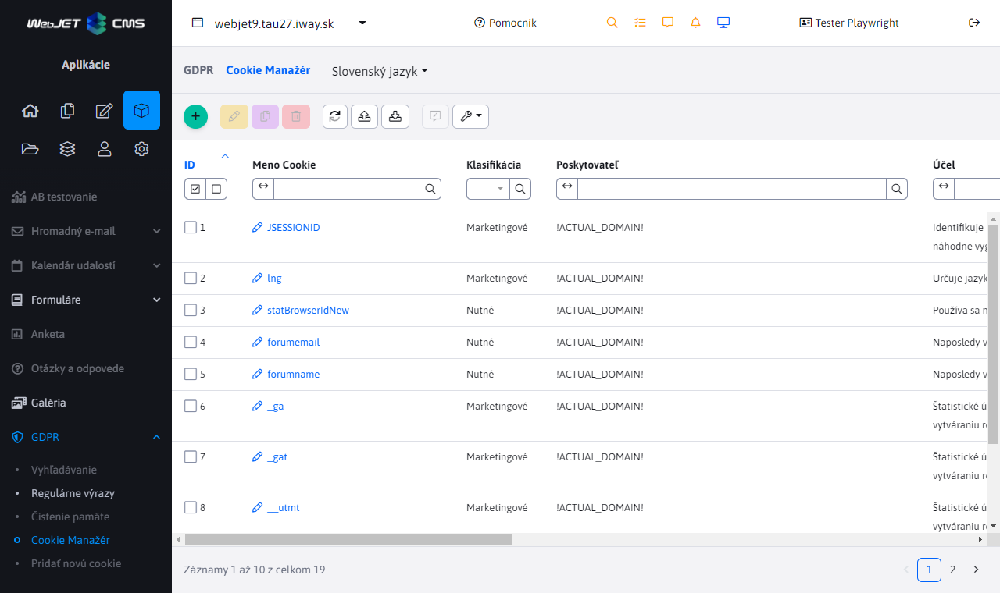

# Cookies manažér

Modul GDPR umožnuje spravovanie cookies a ich klasifikácií, ktoré sa zobrazujú návštevníkom webu v cookies lište. Znamená to, že sa na cookies lište budú nachádzať informácie o tom, aké cookies sa na webstránkach zbierajú a umožniť návštevníkom možnosť vypnutia zbierania niektorých klasifikácií cookies.

V ľahej hornej časti stránky sa nachádzajú tlačidla na pridanie/úpravu/duplikovanie/mazanie cookies, export cookies do excel súboru a import cookies z excel súboru.

## Zadefinovanie cookies v rôznych jazykoch

Pri tvorbe a editácií cookies je možné zadefinovať hodnotu textového poľa "Účel" v rôznych jazykových mutáciach SK/CZ/EN/DE atď. Ak sa cookie vytvorí v Slovenskom jazyku, hodnota poľa "Účel" sa predvolene prenesie aj do ostatných jazykov. Ale ak sa hodnota poľa "Účel" zmení po prepnutí do Českého jazyka, táto hodnota ostane zadefinovaná len pre daný jazyk a hodnotu poľa "Účel" v iných jazykoch to neovplyvní. Takto sa dá zadefinovať odlišná hodnota textového poľa "Účel" pre každý jazyk zvlášť. Jazyk sa dá zmeniť selektorom v ľavej hornej časti stránky vedľa názvu stránky.

## Zadefinovanie cookies v rôznych doménach

Vytvorená cookies sa bude zobrazovať iba pre doménu v ktorej bola vytvorená. Pre vytvorenie rovnakej cookies alebo tej istej s inými hodnotami vo viacerých doménach bude potrebné ich zadefinovanie pre každú doménu zvlášť. Doména sa dá zmeniť pomocou doménového selektora, ktorý sa nachádza v ľavom hornom rohu stránky.

## Potvrdenie zbierania cookies návštevníkom webstránky

Zvolený výber návštevníka webstránky o zbieraní/nezbieraní niektorých klasifikácií cookies bude ďalej ukladaný a správovaný pomocou modulu Skripty.

