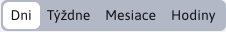
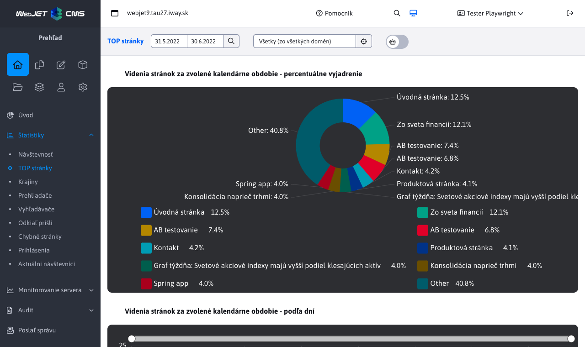
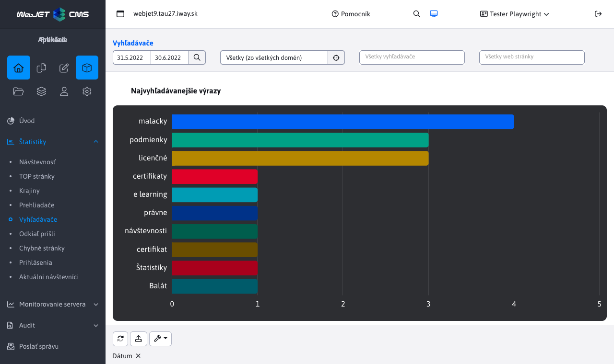

# Štatistika

Aplikácia štatistika vám umožňuje zobraziť štatistické informácie o návštevníkoch vášho web sídla. Je dostupná v sekcii Prehľad ľavom menu ako položka Štatistiky.

V aplikácii sa používajú nasledovné výrazy:

- ```videní``` - celkový počet zobrazených stránok
- ```návštev (alebo sedení)``` - počet návštev jednotlivých ľudí, pričom za jednu návštevu sa považuje čas, počas ktorého návštevník nezatvoril internetový prehliadač. Čiže ak sa návštevník dostal na vašu stránku a pozrel si 5 stránok zaráta sa 5 videní a 1 návšteva. Keď zatvorí internetový prehliadač (alebo si nepozrie žiadnu stránku za viac ako 30 minút) a na stránku príde znova, zaráta sa to ako ďalšia návšteva
- ```rôznych používateľov``` - približné číslo skutočne rozdielnych návštevníkov stránky. Ak návštevník navštívi vašu stránku zašle sa mu cookie, pomocou ktorého bude identifikovaný aj pri ďalšej návšteve. Platnosť tejto cookie je nastavená na jeden rok, čiže aj keby prišiel na stránku za relatívne dlhé obdobie, stále sa bude považovať za toho istého návštevníka

Upozornenie: ukladanie štatistiky je podmienené GDPR súhlasom na ukladanie štatistických cookies. Pokiaľ návštevník nedá súhlas na ich ukladanie je štatistika anonymizovaná:

- čas návštevy je zaokrúhlený na 15 minút
- prehliadač je nastavený na neznámy
- krajina je nastavená na neznáma

Sekcia Štatistika využíva externý filter, ktorý je podrobnejšie opísaný tu [Externý filter](./external-filter.md)

## Návštevnosť

> Zistíte v ktoré dni (napr. pravidelne v stredy) rastie návštevnosť, prípadne v zoskupení podľa hodín v ktorom čase máte najvyššiu/najnižšiu návštevnosť.

Sekcia **Návštevnosť** ponúka prehľad návštevnosti celého web sídla a čiarové grafy návštevností podľa dní, týždňov, mesiacov a hodín.


**Výber zoskupenia**



K výberu sú štyri možnosti zoskupenia štatistík. Zoskupenie mení počítanie hlavne unikátnych (rôznych) používateľov. Ak ja ako unikátny používateľ navštívim web stránku dnes aj zajtra som v zoskupení podľa dní zarátaný každý deň. V zoskupení podľa týždňa alebo mesiaca ale už len raz.

Mesačné zoskupenie porovná celkovú návštevnosť medzi viacerými mesiacmi. Vidíte celkový počet zobrazení web stránky a aj počet rôznych používateľov podľa mesiacov v roku.

Zoskupenie podľa hodín je vhodné pre určenie najväčšej návštevnosti počas dňa - v ktorú hodinu má web najväčšiu návštevnosť, čo je typicky spojené s najväčšou záťažou na servery a infraštruktúru.

## Top stránky

> Aké stránky sú najnavštevovanejšie?

Zobrazuje zoznam web stránok s najväčším počtom videní. Zobrazený je koláčový graf 10 najnavštevovanejších stránok, časový prehľad a tabuľka so zoznamom 100 najnavštevovanejších stránok.

V tabuľke je zoznam najnavštevovanejších stránok s údajmi o počte videní, návštev a počtu rôznych používateľov.



## Krajiny

> Z ktorých krajín prichádzajú návštevníci? Na aké jazykové mutácie je potrebné sa zamerať?

Zobrazuje návštevnosť podľa krajín. Krajina sa určí podľa HTTP hlavičky ```accept-language``` prehliadača, ktorý zobrazuje web stránku. Typicky je to jazyk, ktorý má používateľ nastavený v operačnom systéme. Ak sa krajinu nepodarilo identifikovať je zaradená ako ```Neznáma```.


## Prehliadače

> Aké prehliadače návštevníci používajú? Na aké prehliadače a aké operačné systémy je potrebné stránku optimalizovať?

Zoznam používaných prehliadačov a ich verzií. V grafe sú zobrazené najpoužívanejšie prehliadače s verziou, časové zobrazenie a kompletná tabuľka.

Hodnota ```Neznámy``` alebo ```???``` sa zobrazuje pre neznáme prehliadače a pre prehliadače pri ktorých návštevník nedal súhlas na zbieranie štatistických cookies.


## Vyhľadávače

> Čo návštevníci vyhľadávajú na našej stránke? Na aké vyhľadávané výrazy sa dostali na náš web z vyhľadávačov?

Zoznam vyhľadávaných výrazov na vašom web sídle, ale aj na externých vyhľadávačoch ```google```, ```seznam``` atď. Kliknutím na hľadaný výraz zobrazíte detailný zoznam časov a použitého vyhľadávača pre hľadanie daného výrazu. V stĺpci adresa počítača sa zobrazuje IP adresa/doménové meno počítača z ktorého bolo vykonané hľadanie. Hodnota ```0.0.0.0``` sa zobrazí ak návštevník nedal súhlas na zbieranie štatistických cookies.

Graf a tabuľku môžete ďalej v hlavnom hornom filtri filtrovať podľa vyhľadávača a prípadne stránky kde sa nachádzajú výsledky vyhľadávania (alebo bol prechod na danú stránku z externého vyhľadávača).



## Odkiaľ prišli

> Z akých externých stránok sa "pre-klikli" návštevníci na náš web?

Zoznam domén web stránok z ktorých prišli návštevníci na vašu web stránku (klikli na odkaz na uvedenej doméne). Stránka z ktorej prichádzajú musí byť na zabezpečenom (https) protokole a nesmie zakazovať prenos odkazu na iný server (HTTP hlavička ```referrer```).


## Chybné stránky

> Na aké URL adresy/stránky vedie "niekde" odkaz, ale stránka/URL už neexistuje?

Zoznam URL adries, pre ktoré je zobrazená chybová stránka (HTTP kód 404). Každá chybná URL adresa je zoskupené podľa týždňa, v tabuľke tak vidíte počty volaní chybnej URL adresy za týždeň.

Graf a tabuľku môžete ďalej v hlavnom hornom filtri filtrovať podľa URL výrazu (vyhľadáva sa v režime obsahuje). Môžete tak zúžiť zobrazenie len pre zadaný výraz (napr. ```/files/``` alebo ```.pdf``` zobrazí odkazy na chýbajúce súbory).

**TIP:** Chybné stránky odporúčame opraviť, alebo presmerovať na inú vhodnú stránku/URL adresu.


## Prihlásenia

> Ako dlho a koľko krát sa prihlásili návštevníci alebo administrátori web sídla?

Štatistika prihlásení používateľov do zabezpečenej (zaheslovanej) zóny, alebo do administrácie. Údaj o počte minút prihlásenia nemusí byť presný, používateľ sa nemusí korektne odhlásiť a zároveň môže byť naraz prihlásený vo viacerých oknách/prehliadačoch, jedná sa len o orientačný údaj.

Kliknutím na meno používateľa zobrazíte podrobnú štatistiku prihlásení zvoleného používateľa.


## Aktuálni návštevníci

> Koľko má web práve návštevníkov?

Zoznam aktuálnych sedení na web stránke, obsahuje aj zoznam neprihlásených používateľov (ich sedenia). Ak máte web sídlo v clustri obsahuje tento zoznam len používateľov na uzle na ktorom ste práve prihlásený, nie je vidno zoznam zo všetkých uzlov.

 Kliknutím na meno používateľa zobrazíte podrobnú štatistiku prihlásení zvoleného používateľa.

