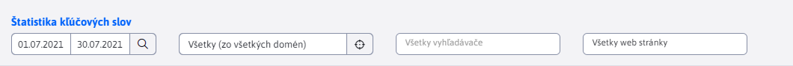
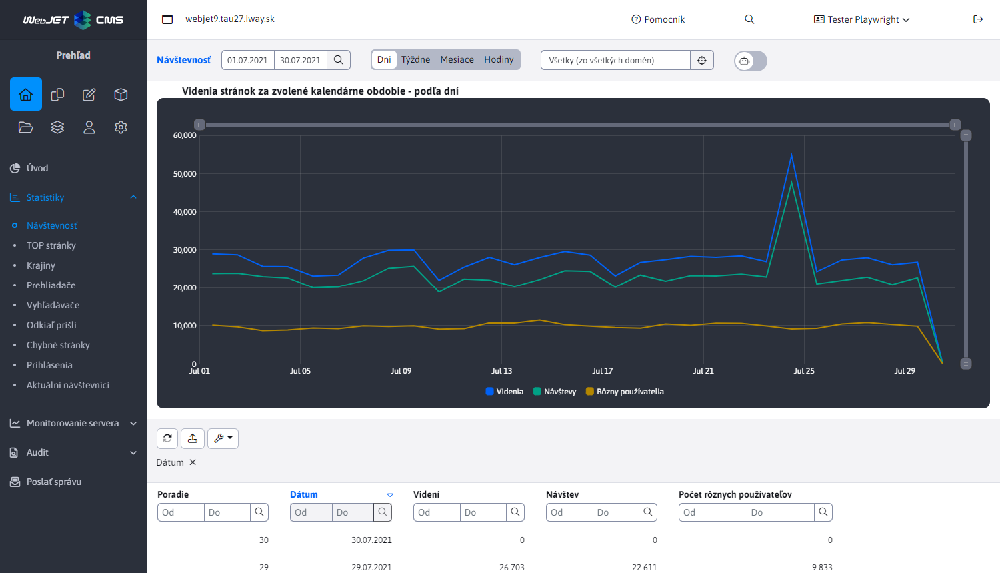
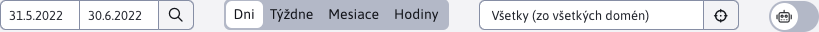
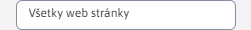

# Externý filter

Externý filter je špeciálny druh filtra, ktorý využívajú sekcie ```Štatistika``` a ```SEO```. Údaje je možné v hornej časti pod nadpisom stránky filtrovať podľa nižšie uvedených možností. Tento filter pracuje inak, ako v ostatných datatabuľkách. V hornej časti pri nadpise je hlavný filter, ktorý filtruje načítanie dát zo servera. Následne v datatabuľkách je možné filtrovať v zobrazených dátach podľa ďalších stĺpcov, filtrovanie sa ale už deje len nad dátami načítanými podľa hlavného filtra.



V prípade, že externý filter obsahuje filtrovanie podľa stĺpca, ktorý je aj v datatabuľke, filtrovanie nad týmto stĺpcom je automaticky znemožnené. Dôvod je aby sa zabránilo viacnásobnému filtrovaniu pre ten istý parameter. 

Takýto prípad môžete vidieť na nasledujúcom obrázku, kde externý filter obsahuje filtrovanie podľa dátumu a to isté filtrovanie v datatabuľke je znemožnené.



> Nastavené údaje si hlavný filter v hornej časti **pamätá v prehliadači pokiaľ ho nezatvoríte**. Ak teda nastavíte obdobie od-do môžete prechádzať cez jednotlivé časti sekcií ```Štatistika``` a ```SEO```, pričom všetky externé filtre obsahujúce filtrovanie podľa obdobia sa automaticky nastavia podľa Vami zadanej hodnoty. Dáta sú v takomto prípade automaticky filtrované pri načítaní zo servera. To isté platí aj pre filtrovanie pomocou priečinka atď.

## Filter dátumu

Filter dátumu umožňuje nastaviť rozsah dátumov pre zobrazenie dát (napr. návštevnosti u Štatistiky).

Ak filter nie je zadaný, načítajú sa údaje za:

**SEO**
- posledných 30 dní

**Štatistika**
- posledných 30 dní v prípade zoskupenia podľa dní, týždňov a hodín
- posledných 6 mesiacov v prípade zoskupenia podľa mesiacov.

Ak je zadaná iba časť "od", zobrazí sa návštevnosť od zadaného dátumu do aktuálneho dňa. Ak je nastavená iba časť do, zobrazí sa :

**SEO**
- posledných 30 dní k danému dátumu.

**Štatistika**
- posledných 30 dní k danému dátumu v prípade štatistiky pre dni, týždne a hodiny a 6 mesiacov v prípade štatistiky mesiacov.



## Zobraziť z priečinka

Môžete filtrovať dáta len pre určitý priečinok, napr. pri jazykových mutáciách, alebo produktových mikro stránkach. Predstaviť si pod tým môžeme návštevnosť u štatistiky. Možnosť ```Všetky (zo všetkých domén)``` je prednastavená hodnota a zobrazí dáta bez ohľadu na priečinok a doménu, čo v prípade Štatistiky reprezentuje **kompletnú návštevnosť**.


## Filter web stránok

Filtrovanie web stránok umožňuje konkretizovať filtrovanie pre jednu zvolenú web stránku. Ponúkané hodnoty sú závislé o zvoleného priečinka. Ak sa hodnota zvoleného priečinka zmení, získa sa nový zoznam ponúkaných web stránok zo servera. V prípade, že bola nejaká stránka zvolená, tak už naďalej zvolená nebude, aj keď je stále v ponuke možností.

Vrátený zoznam web stránok k výberu (filtrovaniu) je zoznam iba pre daný priečinok a iba v danej úrovni. To znamená, že web stránky pod-adresárov sa nezobrazia. Ak žiaden adresár nie je zvolený (filtrovanie priečinka ma zvolenú hodnotu ```Všetky (zo všetkých domén)```), nie je zobrazená žiadna web stránka k výberu.

Prednastavená možnosť je ```Všetky web stránky``` a zobrazí dáta všetkých web stránok, ktoré vyhovujú ostatným parametrom.



## Filter vyhľadávača

Filter vyhľadávača umožňuje filtrovanie dát na základe zvoleného vyhľadávača. 

**Štatistika**
V tejto sekcií je filtrovanie využité napr. k odfiltrovaniu vyhľadaných výrazov iba pre konkrétny vyhľadávač, čo umožňuje overiť, ktorý vyhľadávač sa použil najviac k prístupu na náš web.

**SEO**
V tejto sekcií je filtrovanie využité napr. na špecifikovanie vyhľadávača k overeniu najviac vyhľadávaných kľúčových slov.

Ponúkané vyhľadávače k filtrovaniu sú závislé od zvoleného časového rozsahu, zvoleného priečinka a filtrovanej web stránky. To znamená, že pri zmene ktorejkoľvek z týchto hodnôt sa celý ponúkaný zoznam vyhľadávačov znovu získa zo servera pomocou nových hodnôt. V prípade, že bol nejaký vyhľadávač zvolený, tak už naďalej zvolený nebude, aj keď je stále v ponuke možností.

Prednastavená možnosť je ```Všetky vyhľadávače``` a zobrazí dáta všetkých vyhľadávačov. 


## Prepínač odfiltrovať botov

Špecifický iba pre sekciu Štatistika.
Ak nechcete v štatistike zobrazovať údaje od botov (vyhľadávacie roboty, spam boty) môžete ich v zobrazení odfiltrovať. Pre určenie záťaže na server je potrebné rátať aj s botmi, ale pre marketingové účely je vhodné ich filtrovať.

