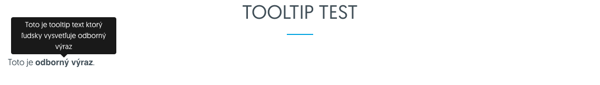
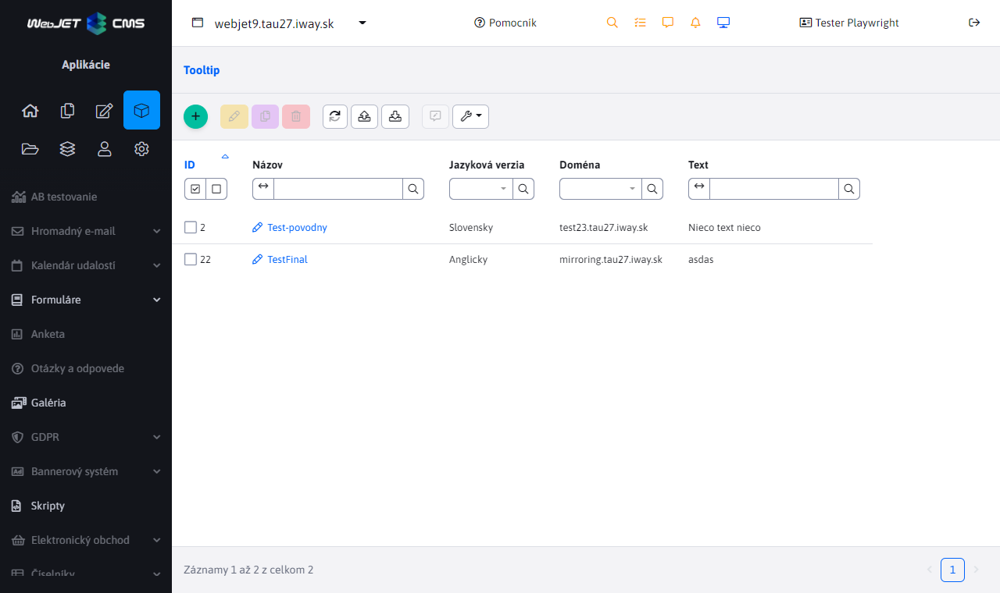
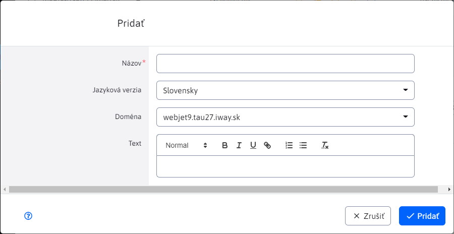
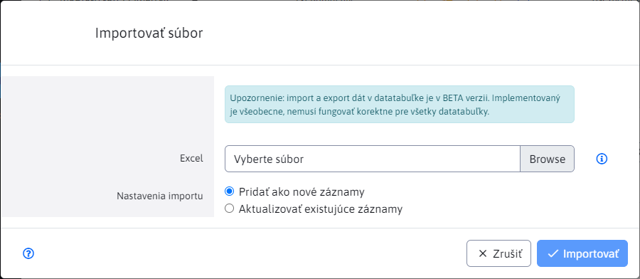

# Tooltip

V aplikácii Tooltip môžete definovať pomocný text/vysvetlenie pre odborné výrazy, ktoré zobrazujete na web stránke. Zvyčajne sa zobrazujú ako pomocný text v "bubline" po prechode kurzorom ponad odborný výraz. Definovanie Tooltip-u cez aplikáciu umožňuje na jednom mieste globálne upravovať vysvetlenie týchto odborných výrazov. Následne keď ho upravíte zmení sa vo všetkých použitiach naraz.



## Vytvorenie tooltip-u



Kliknutím na ikonu „Pridať“ sa vám zobrazí dialógové okno pre vytvorenie tooltip-u.

V tomto okne definujete nasledujúce parametre:
-	Názov – jednoznačný identifikátor pre daný Tooltip / odborný výraz
-	Jazyková verzia – SK / CZ / EN ...
-	Doména – voľba, na ktorej doméne sa má daný Tooltip použiť
-	Text – textový obsah tooltip-u



Rovnako vyzerá aj dialógové okno pre editáciu existujúceho tooltip-u.

V tabuľke máte k dispozícii tlačidlo „Duplikovať“, pokiaľ chcete existujúci tooltip skopírovať a uložiť pod iným názvom, pre inú jazykovú verziu, alebo pre inú doménu.

## Import tooltip-ov

V záložke Import sa nachádza formulár pre nahratie excelu s tooltip-mi. Formát excelu by mal byť totožný s formátom, ktorý získate pri exporte aktuálneho zoznamu do Excelu. Ikonka pre export sa nachádza v ľavej hornej časti.



## Vloženie tooltip-u do stránky

Vytvorenie bubliny nad odborným výrazom je možné priamo v editore označením odborného výrazu a následným kliknutím na ikonu:

-  Vložiť tooltip

Otvorí sa dialógové okno, v poli Tooltip (kľúč) zadajte začiatok odborného výrazu. Zo servera sa načíta zoznam výrazov obsahujúcich zadaný text, kliknutím myšou vyberte presný výraz:


Následne v HTML kóde stránky vznikne kód typu:

```html
<p>Toto je <span class="wjtooltip" title="!REQUEST(wjtooltip:TestFinal)!">odborný výraz</span>.</p>
```

ktorý je na serveri spracovaný a je vložené aktuálne znenie textu. Pre pekné zobrazenie "bubliny" je potrebné v šablóne (alebo cez aplikáciu skripty, alebo v najhoršom prípade cez pole HTML kód do hlavičky v editore stránky v karte Šablóna) doplniť nasledovný JavaScript kód:

```javascript
<script type="text/javascript">
    $(document).ready(function() {
        $(".wjtooltip").tooltip();
    });
</script>
```


použité je rozšírenie [Bootstrap Tooltip](https://getbootstrap.com/docs/4.0/components/tooltips/).