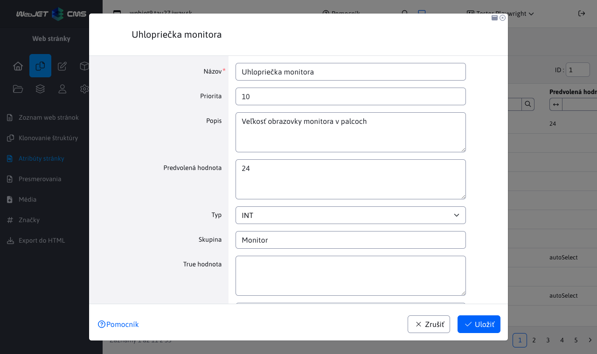

# Atribúty stránky

> Atribúty stránky umožňujú definovať dodatočné polia pre editor web stránky. Môžu byť rôznych dátových typov a je možné ich organizovať do skupín. Zvyčajne sa používajú v elektronickom obchode na definovanie parametrov produktov.

Výhoda oproti voliteľným poliam je v teoreticky nekonečnom počte polí a zároveň v možnosti organizovať polia do skupín. V databáze sú hodnoty ukladané v korektných dátových typoch, čo umožňuje vykonávať usporiadanie pomocou databázových dotazov (voliteľné polia aj typ číslo dátovo ukladajú ako reťazec).

<div class="video-container">
    <iframe width="560" height="315" src="https://www.youtube.com/embed/e-K-6Z_m-hg" title="YouTube video player" frameborder="0" allow="accelerometer; autoplay; clipboard-write; encrypted-media; gyroscope; picture-in-picture" allowfullscreen></iframe>
</div>

## Definícia atribútov

V menu položke Atribúty stránky môžete pridávať/editovať/mazať definíciu atribútov. Takto definované atribút je následne možné nastavovať web stránke.



Atribút má nasledovné polia:

- Názov - názov atribútu. Pre viac jazyčné zobrazenie je podporovaný formát ```JAZYK:hodnota|JAZYK:hodnota```, napr. ```SK:hmotnosť|CZ:hmotnost|EN:weight```.
- Priorita - poradie atribútu v zozname atribútov.
- Popis - rozšírený opis atribútu, je na dizajnérovi kde sa tento opis bude na web stránke zobrazovať.
- Predvolená hodnota - predvolená hodnota atribútu v editore stránok (nastaví sa pre novú hodnotu).
- Typ - dátový typ atribútu
  - ```STRING``` - textové pole
  - ```INT``` - celočíselná hodnota
  - ```BOOL``` - binárna hodnota áno/nie
  - ```DOUBLE``` - číselná hodnota s desatinným miestom
- Skupina - zaradenie atribútu do skupiny. Napr. pre rôzne skupiny produktov ako TV, chladničky, počítače máte rôzne atribúty.
- ```True hodnota``` - zobrazený text pre typ ```BOOL``` pre zvolenú možnosť (napr. áno, alebo obsahuje).
- ```False hodnota``` - zobrazený text pre typ ```BOOL``` pre nezvolenú možnosť (napr. nie, alebo neobsahuje).

Pre textové pole je do Predvolená hodnota možné zadať špeciálne hodnoty:

- ```autoSelect``` - pri zadávaní atribútu v stránke sa automaticky načítajú existujúce hodnoty v iných stránkach a ponúknu sa na výber. Redaktor ale môže zadať do poľa aj novú hodnotu.
- ```hodnota1|hodnota2|hodnota3``` - pole sa zobrazí ako výberové pole, používateľ môže voliť len zo zadaných hodnôt (nemôže zadať novú hodnotu). Ako rozdeľovač je možné zadať znak ```|``` alebo znak ```,```. Príklad ```Apple,Samsung,Xiaomi```.
- ```multiline-w-h``` - zadávanie viac riadkového textu (pole typu textová oblasť), hodnota ```w``` reprezentuje počet znakov na riadok a hodnota ```h``` počet riadkov, príklad ```multiline-80-10```. Technicky ale z dôvodu responzívneho zobrazenia sa pole vždy zobrazí na plnú šírku a teda hodnota ```w``` sa neaplikuje.

## Nastavenie atribútov web stránky

Ak sú definované atribúty, tak v editore web stránok sa začne zobrazovať karta Atribúty. Karta sa nezobrazuje pri hromadnej editácii viacerých stránok naraz, kedy atribúty zostanú zachované pre každú stránku samostatne.

Pomocou výberového poľa Skupina viete zvoliť skupinu zobrazených atribútov. Pri existujúcej stránke sa skupina pred nastaví podľa prvého atribútu, ktorý obsahuje textovú hodnotu v niektorom atribúte.


## Zobrazenie atribútov na web stránke

Pripravené sú nasledovné aplikácie na zobrazenie atribútov stránky:

### Porovnávacia tabuľka

Porovnávacia tabuľka zobrazuje všetky stránky so zadaného priečinka (voliteľne vrátane pod priečinkov) s hodnotami atribútov zadanej skupiny:


Do HTML kódu stránky zadajte aplikáciu ako:

```!INCLUDE(/components/attributes/atr_table.jsp, group="Monitor")!```

aplikácia má nasledovné parametre:

- ```group``` - skupina atribútov, predvolene ```default```.
- ```dirId``` - ID priečinka web stránok, ak nie je zadané, použije sa aktuálny priečinok.
- ```includeSub``` - určuje, či sa majú načítať aj stránky z pod priečinkov (predvolene ```true```).
- ```includeCurrentPage``` - vylúčenie aktuálnej stránky z tabuľky (aby sa v tabuľke nezobrazovala aktuálna stránka), predvolene ```false```.
- ```sortBy``` - spôsob usporiadania stránok, predvolene podľa názvu stránky (```title```), možnosti korešpondujú voči atribútom ```DocDetails``` s prefixom ```doc.``` alebo atribútom ```AtrDocBean```.

### Vyhľadávanie/filtrovanie zobrazených stránok

Zobrazenú tabuľku je možné filtrovať (vyhľadávať) pomocou URL parametrov. Napr. pri zadaní URL adresy ```/apps/atributy-stranky/monitory/?atrs_GT_Power+Delivery+(W)=90``` sa v tabuľke zobrazia len monitory, ktorých hodnota v atribúte ```Power Delivery (W)``` je väčšia ako 90. Formát URL parametra je ```atrs_TYP_MENO``` kde typ môže mať hodnoty:

- ```SS``` (substring) - pod reťazec, čiže vyhľadávanie textovej hodnoty, ktorá obsahuje zadaný výraz.
- ```EQ``` (equal) - hľadanie presnej zhody zadaného výrazu.
- ```LT``` (less than) - hľadanie hodnoty ktorá je menej ako zadaná hodnota.
- ```GT``` (greater than) - hľadanie hodnoty ktorá je viac ako zadaná hodnota.
- ```GTLT``` - hľadanie hodnoty v zadanom intervale ```od:do```. Hodnota je vrátane, teda napr. ```?atrs_GTLT_Power+Delivery+(W)=60:120``` zobrazí aj stránky, ktoré majú zadanú hodnotu 60 alebo 120.

Ak názov obsahuje medzeru, môžete použiť znak ```+``` na jej nahradenie. Pri názve nemusíte použiť diakritiku, názov sa porovnáva s odstránením diakritiky.

### Atribúty aktuálne zobrazenej stránky

Atribúty aktuálne zobrazenej web stránky, napr. ako zoznam vlastností produktu:


Do HTML kódu stránky (alebo ideálne niektorého poľa šablóny, aby sa aplikácia použila na každej stránke produktu) zadajte aplikáciu ako:

```!INCLUDE(/components/attributes/attributes.jsp, group="Monitor")!```

aplikácia má nasledovné parametre:

- ```group``` - skupina atribútov, predvolene ```default```.

### Zobrazenie hodnoty konkrétneho atribútu

Ak niekde v stránke potrebujete zobraziť hodnotu konkrétneho atribútu môžete použiť aplikáciu:

```!INCLUDE(/components/attributes/attribute.jsp, group="Monitor", name="Cena")!```

aplikácia má nasledovné parametre:

- ```group``` - skupina atribútov, predvolene ```default```.
- ```name``` - meno atribútu.