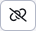

# Kontrola odkazov a prázdnych stránok

> Vo web stránkach po zvolení priečinka a následnom stlačení tlačidla  sa zobrazí tabuľka s výpisom chybných odkazov a prázdnych stránok.

Aplikácia skontroluje odkazy a web stránky zo zvoleného priečinka a taktiež aj zo všetkých pod priečinkov. Výsledok zobrazí v 3 kartách:

- Nefunkčné odkazy - odkazy ktoré neexistujú. Kontrolujú sa len lokálne odkazy, nie odkazy na externé stránky (začínajúce na http).
- Stránky so zakázaným zobrazovaním - stránky, ktoré majú vypnuté zobrazenie.
- Prázdne stránky - stránky, ktoré sú prázdne (majú menej ako 100 znakov, tento počet sa dá nastaviť v konf. premennej ```linkCheckEmptyPageSize```).


Všetky karty obsahujú tabuľku zobrazujúcu web stránky a opis chyby. Tabuľka obsahuje stĺpce:

- ID - ```id``` web stránky (```docid```).
- Stránka - cesta (priečinková štruktúra) a názov web stránky. Kliknutím na odkaz zobrazí editácia web stránky.
- Chyba - opis nájdenej chyby pri kontrole odkazu a stránky.
- Url adresa - URL adresa nefunkčného odkazu, alebo URL adresa stránky (v karte Prázdne stránky). Kliknutím na odkaz sa v novom okne otvorí zobrazená Url adresa.