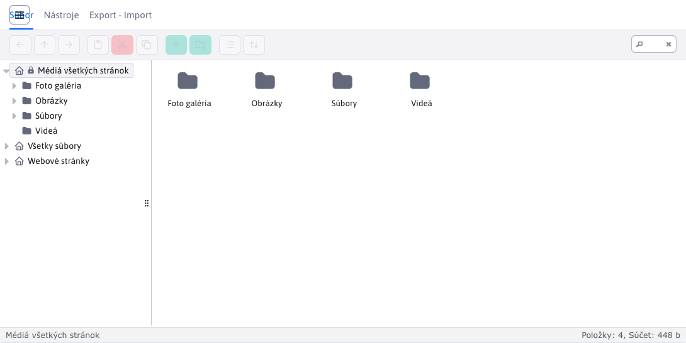
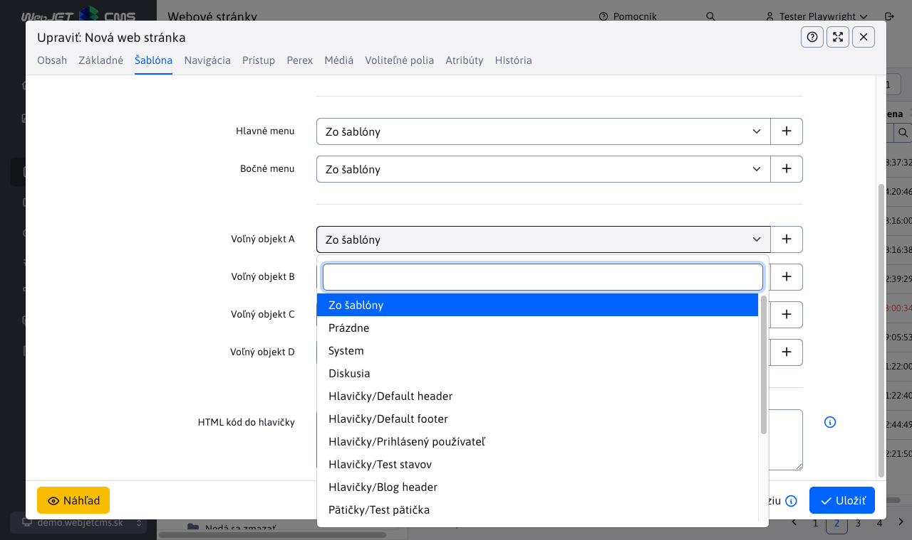
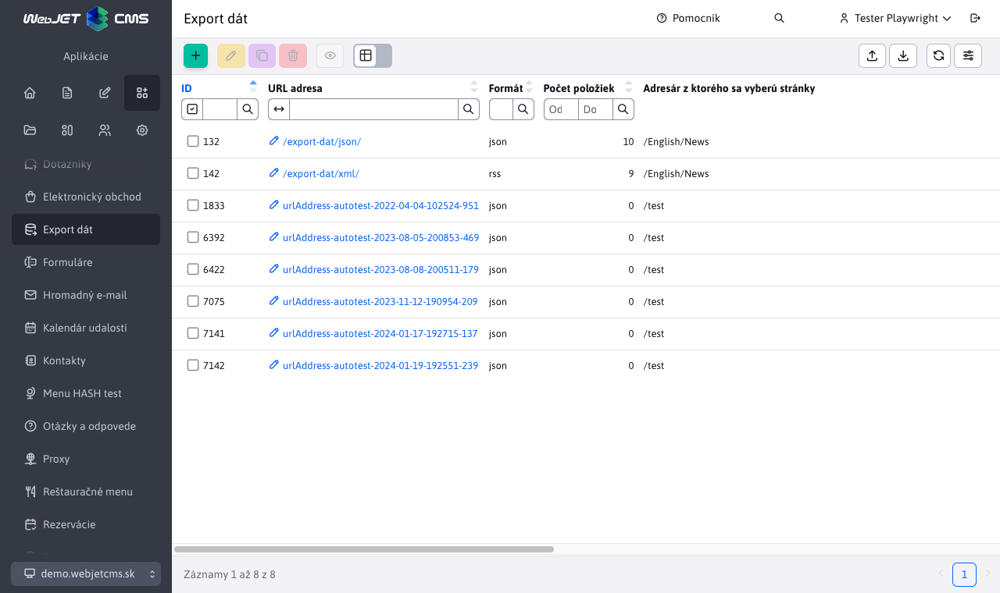
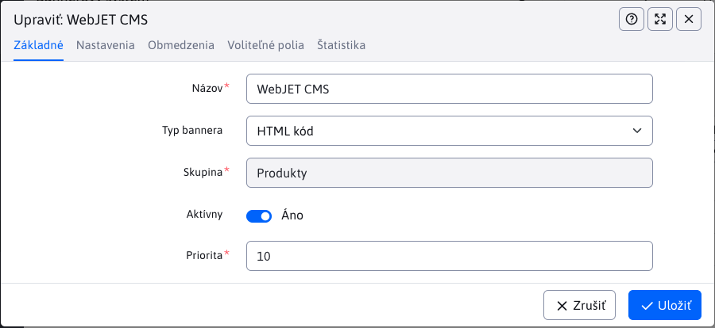
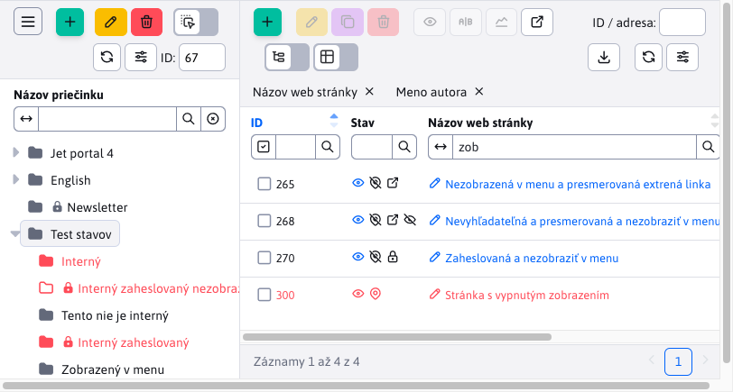
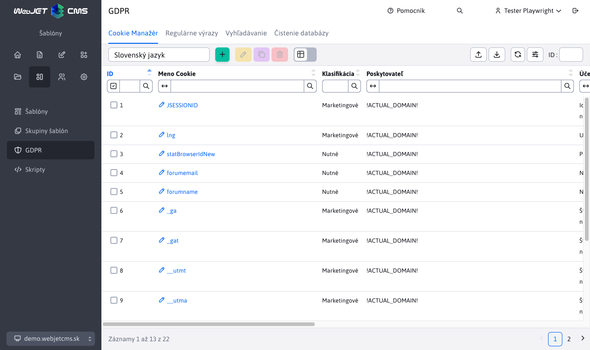
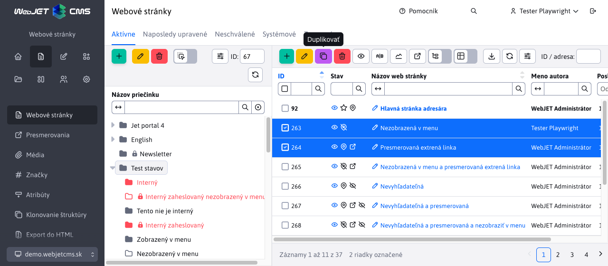
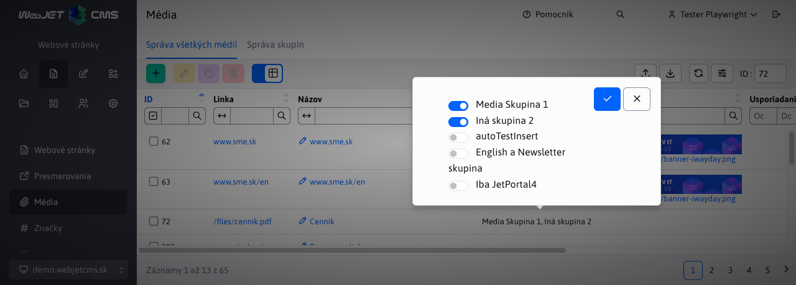
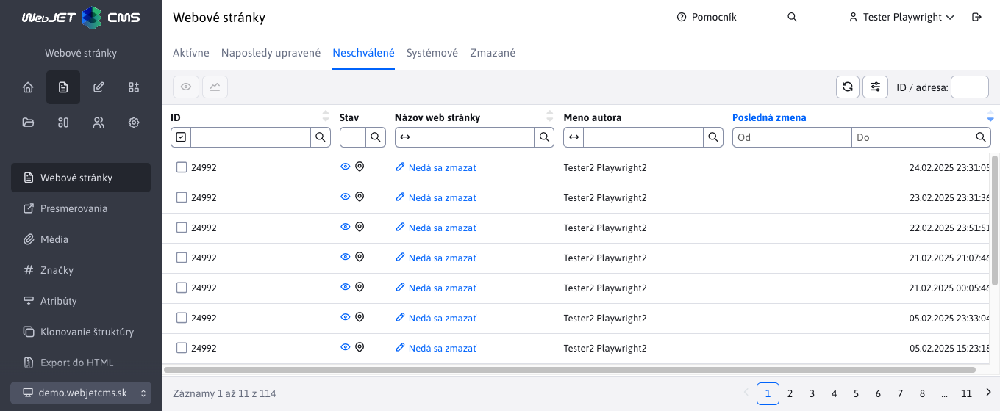
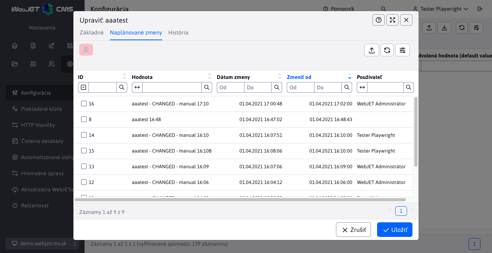

# Changelog verzia 2021

## 2021.52

> Verzia 2021.52 má nový dizajn aj pre staré verzie aplikácií, zlepšuje responzívnu verziu, pridáva nové polia web stránkam a zlepšuje správanie URL adries stránok pri ich presune do iného adresára.

**Redizajn verzie 8**

Upravili sme dizajn aplikácií starej verzie 8 tak, aby farebná schéma a rozloženie korešpondovalo s dizajnom novej verzie WebJET CMS. Menu sa správa rovnako, ako v novej verzii pre pohodlnejší prechod medzi starými a novými aplikáciami (#54233).

Kliknutím na ikonu "Prepnúť na verziu 8" v hlavičke, môžete stále prepnúť rozhranie do dizajnu verzie 8.



**Web stránky**

- Pridaná možnosť uložiť [pracovnú verziu web stránky](redactor/webpages/README.md). Uloží sa do histórie a nebude zatiaľ dostupná pre návštevníkov web sídla (#54161).


- Kompletne prerobené [API editácie web stránky](developer/apps/webpages/api.md) z pôvodného ```EditorDB``` na ```EditorFacade```. Web stránky sa načítavajú a ukladajú cez Spring DATA, čo do budúcna umožní jednoducho pridávať nové databázové atribúty (aj špecificky na klientskych projektoch). Je to len jeden riadok v changelog-u, ale reálne sa jedná o 95 nových/zmenených súborov (#54161).
- Pridaná možnosť otvoriť z editora ďalší editor. Zatiaľ je funkcia implementovaná na pole Šablóna web stránky v editore stránok. Máte možnosť kliknutím na ceruzku upraviť nastavenú šablónu, alebo kliknutím na ikonu + pridať novú šablónu bez toho, aby ste opustili editor stránky. Postupne bude táto funkcia pridaná aj na ďalšie polia ako Hlavička, Pätička, voľné polia atď.


- Upravené pole pre zadanie domény vo vlastnostiach adresára - zobrazuje sa už len pre koreňový adresár.
- Doplnené popisné/info texty k poliam v editore stránok a priečinka.
- Stavové ikony presunuté do samostatného stĺpca s možnosťou filtrovania podľa stavu, pridaná ikona oka pre priame zobrazenie web stránky so zoznamu stránok.


- Doplnená kontrola práv na možnosť vytvárania/editácie/zmazania web stránok a adresárov a kontrolu práv na jednotlivé adresáre (#54257).
- Doplnené stavové ikony do samostatného stĺpca s možnosťou filtrovania a priameho zobrazenia web stránky kliknutím na ikonu oka (#54257).
- Doplnené nezávislé možnosti nastavenia zobrazenia adresára a web stránky v mape stránok a v navigačnej lište. Verzie 8 mala tieto možnosti naviazané na zobrazenie v menu. Niekedy ale bolo potrebné položky rozdielne zobrazovať v menu a napr. v mape stránok (#54205).


- Vo web stránke doplnená možnosť nastavovať Voľný objekt A-D v karte šablóna. Je tak možné meniť nielen hlavičky/pätičky/menu, ale aj voľné objekty šablóny pre každú web stránku zvlášť. Nastaviť je možné aj prázdnu hodnotu.



- Pridané nové možnosti [automatického generovania URL adresy stránky](redactor/webpages/editor.md#url-adresa) podľa Názov položky v menu (pri presune do iného priečinku sa URL adresa automaticky zmení), alebo možnosť automaticky zdediť začiatok URL adresy z priečinku (pri presune do iného priečinku sa začiatočná časť URL adresy automaticky zmení) (#54237).


**Responzívna verzia**

Dokončená generická verzia administrácie pre [mobilné zariadenia](redactor/admin/README.md). Pri šírke pod 1200 bodov sa schová ľavé menu a hlavička, dostupné je po kliknutí na hamburger menu.


Pri šírke menej ako 992 bodov sa okno editora zobrazuje na celú veľkosť okna, pri šírke menej ako 576 bodov sa názvy polí presunú nad pole.


**Voliteľné polia**

Pridaná možnosť [výberového poľa viacerých možností](frontend/webpages/customfields/README.md#výberové-pole-viac-možností) zadaním prefixu ```multiple:``` pred zoznam možných hodnôt. Hodnoty sa do poľa potom ukladajú oddelené znakom ```|```.


**Úvod**

- Pre ľahkosť použitia nevyžaduje zmena domény na stránke Úvod potvrdenie (doméne sa ihneď zmení).

**Konfigurácia**

- Doplnený import a export konfigurácie podľa verzie 8 v ktorom sa exportuje do XML formátu a importuje sa s porovnaním existujúcich hodnôt.
- Opravená úprava bunky, doplnená možnosť upravovať aj hodnotu.
- Opravené zobrazenie pôvodnej hodnoty a opisu po zmene hodnoty.

**Data tabuľky**

- Pridaný nový typ dátového poľa pre číselníkové polia typu ```select``` s možnosťou [editácie, alebo pridania záznamu](developer/datatables-editor/field-select-editable.md) do výberového poľa. Umožňujú ľahko upraviť objekt, ktorý sa vyberá v poli, ako napr. šablóna stránky, odkaz na stránku hlavičky a podobne.


- Pridané upozornenie o konflikte - ak má okno editora s rovnakým záznamom otvorený aj iný používateľ zobrazí sa notifikácia so zoznamom ostatných používateľov. Zobrazí sa pri otvorení okna a následne sa kontroluje každú minútu.


- Pridaná možnosť vkladať ```tooltip``` k poliam v editore s formátovaním pomocou [Markdown formátu](developer/frameworks/webjetjs.md#markdown-parser). Kvôli bezpečnosti nie je možné vkladať odkazy a iné ako základné Markdown značky.
- Prekladový kľúč pre tooltip sa automaticky hľadá podľa prekladového kľúča ```title``` so suffixom ```.tooltip```. Ak teda máte anotáciu ```@DataTableColumn(title = "group.superior_directory"``` automaticky sa hľadá prekladový text s kľúčom ```group.superior_directory.tooltip```. Ak existuje, použije sa.
- Opravené vyhľadávanie podľa dátumov v tabuľkách s klientským stránkovaním a nezobrazenými niektorýmii stĺpcami (zle určený index stĺpca).
- Doplnená možnosť nastavenia [stavových ikon](developer/datatables/README.md#stavové-ikony), zrušená pôvodná možnosť doplnenia ikon k odkazu na otvorenie editora pomocou funkcie ```addTextIcon``` (to bolo nevhodné z UX pohľadu).

**Deployment**

Upravený deployment na artifactory server. Do ```ant/build.xml``` pridaná úloha ```createUpdateZip```, ktorá vytvorí a nahrá na licenčný server aktualizáciu vo formáte používanom pre prechodom na ```gradle``` verziu. Je tak ľahko možné aktualizovať staršie inštalácie WebJETu klasickým spôsobom cez menu Ovládací panel->Aktualizácia WebJETu (#54225).

Upravené a porovnané archívy voči starej verzii 8 tak, aby obsahovali všetky potrebné súbory. Doplnené chýbajúce písma pre knižnicu ```pd4ml``` pre generovanie PDF súborov.

Pre povolenie aktualizácie na verziu 2021 kontaktujte [obchodné oddelenie InterWay](https://www.interway.sk/kontakt/).

Upozornenie: z dôvodu veľkého počtu zmien v jar knižniciach bude počas aktualizácie potrebné vykonať reštart aplikačného servera. Presvedčte sa pred aktualizáciou, že máte dostupnú technickú pomoc pre reštart.

**Dokumentácia**

- Doplnená dokumentácia k uloženiu [pracovnej verzie web stránky](redactor/webpages/README.md).
- Pre-generované fotky obrazovky dokumentácie k web stránkam.
- Pripravený základ pre generovanie [JavaDoc dokumentácie](../javadoc/index.html). Upravené ```docsify``` pre otváranie JavaDoc dokumentácie do nového okna.
- Web stránky - doplnená dokumentácia pre [programátora k API](developer/apps/webpages/api.md).
- Vytvorená dokumentácia [hlavných ovládacích prvkov](redactor/admin/README.md) administrácie a [prihlasovania a odhlasovania](redactor/admin/logon.md).
- Vytvorená dokumentácia pre [výberové pole s možnosťou editácie](developer/datatables-editor/field-select-editable.md).
- Doplnená dokumentácia pre funkciu [WJ.openIframeModal](developer/frameworks/webjetjs.md?id=iframe-dialóg) pre možnosť nastavenia textu tlačidla, pozície tlačidla pre zatvorenie a udalosti ```onload``` vykonanej po načítaní obsahu modálneho okna.
- Doplnená dokumentácia pre funkciu [WJ.hasPermission(permission)](developer/frameworks/webjetjs.md?id=kontrola-práv) pre kontrolu práv používateľa.
- Doplnená dokumentácia pre funkciu [WJ.parseMarkdown(markdownText, options)](developer/frameworks/webjetjs.md#markdown-parser) na konverziu Markdown formátu do HTML kódu.
- Prerobená dokumentácia nastavenia ikon na použitie [stavových ikon](developer/datatables/README.md#stavové-ikony).
- Doplnený manál pre redaktora o aplikácie [Menu](redactor/apps/menu/README.md), [Navigačná lišta](redactor/apps/navbar/README.md) a [Mapa stránok](redactor/apps/sitemap/README.md).
- Vytvorená dokumentácia o možnostiach generovania URL adresy stránok [automatického generovania URL adresy stránky](redactor/webpages/editor.md#url-adresa).

**Testy**

- Web stránky - doplnené nové testy pre uloženie pracovnej verzie, notifikácie pri nastavení už existujúcej URL adresy, notifikácie pri zmene linky v stránke (pri premenovaní adresy stránky), notifikácie pri publikovaní so zadaným dátumom začiatku, overenie časového publikovania web stránky.
- Vytvorená funkcia ```DTE.fillCkeditor(htmlCode)``` pre vloženie HTML kódu do aktuálne zobrazeného CKEditor-a.
- Doplnený test pre výberové pole s možnosťou editácie aj s testom chyby obnovenia údajov výberových polí po uložení (poliam sa nedala zmeniť hodnota).
- Web stránky - doplnený test vyhľadávania podľa stavových ikon.
- Web stránky - doplnený test práv na jednotlivé funkcie (pridať, editovať, zmazať) a práv na jednotlivé adresáre (#54257).
- Web stránky - doplnený test nastavovania URL adresy (#54237).

**Oprava chýb**

- Opravené zobrazenie nastavení datatabuľky.
- Šablóny - doplnená možnosť Prázdne pre polia hlavičky/pätičky/menu.
- Opravené zobrazovanie pomocných textov tlačidiel v galérii, mazaní dát a skupinách používateľov.
- Datatabuľky - načítanie údajov pri duplikovaní záznamu pri serverovom načítaní dát (znova načítanie všetkých údajov pred duplikáciou).
- Web stránky - opravené načítanie záznamov z histórie a z karty Naposledy upravené.
- Web stránky - opravené nastavenie prázdnej hodnoty do poľa ```password_protected``` (chybne sa ukladal znak ```,```).
- Datatabuľky - opravená aktualizácia záznamu z REST služby pri označení viacerých riadkov, alebo pri duplikovaní záznamov.
- Opravené zobrazenie pomocných textov (tooltip) tlačidiel vlastností adresára web stránok a v aplikáciách galéria, mazanie dát, skupiny používateľov.
- Opravené zobrazenie filtra pri nadpise stránky v monitorovaní servera a v aplikácii GDPR.
- Opravené označenie všetkých riadkov pri klientskom stránkovaní - označí sa len aktuálna strana (#54281).


## 2021.47

> Verzia 2021.47 pridáva upravené aplikácie Tooltip, Export dát, Hromadný-email/Doménové limity a Bannerový systém do nového dizajnu. Pridali sme notifikácie o schvaľovaní pri uložení stránky a zlepšili mobilnú verziu.

**Aplikácie**

- Tooltip - administrácia upravená na nový dizajn, doplnená [dokumentácia pre redaktora](redactor/apps/tooltip/README.md).


- Export dát - administrácia upravená na nový dizajn, doplnená [dokumentácia pre redaktora](redactor/apps/export/README.md).



- Hromadný e-mail - Doménové limity - administrácia upravená na nový dizajn, doplnená [dokumentácia pre redaktora](redactor/apps/dmail/domain-limits/README.md).


- Bannerový systém - administrácia upravená na nový dizajn, doplnená [dokumentácia pre redaktora](redactor/apps/banner/README.md).



**Web stránky**

- Pridaná notifikácia pri publikovaní stránky, ktorá podlieha schvaľovaniu a notifikácia ak stránka má rozpracované/neschválené zmeny.


- V editore v karte História je tučným písmom zvýraznená aktuálne publikovaná verzia stránky.

**Data tabuľky**

- Upravené kopírovanie atribútov existujúcej entity pri jej editovaní. Štandardne z editora nemusia prichádzať všetky atribúty entity, preto sa pred uložením spájajú hodnoty existujúcej entity a údajov zaslaných z editora. Štandardne sa prepíšu všetky nie ```null``` atribúty. To ale neumožňuje zadať prázdny dátum (ak už bol raz nastavený). Preto atribúty anotované DataTableColumn typu ```Date``` sú prenesené aj keď majú ```null``` hodnotu.

**Responzívna verzia**

- Zlepšená zobrazenie prihlasovacej obrazovky na mobilných zariadeniach.
- Upravené zobrazenie dialógového okna v mobilnej verzii - okno je na plnú výšku, karty sú na celú šírku okna, pätička je nižšia pre maximalizáciu priestoru.
- Vo web stránkach v editore je možné prstom posúvať tlačidlá editora pre prístup k všetkým tlačidlám editora.
- Zrušené zalomenie tlačidiel v datatabuľke do druhého riadku, teraz sa jednoducho nezobrazia.
- Upravené zobrazenie značiek vyhľadávania v tabuľke - presunuté z miesta za tlačidlami na nový riadok pod tlačidlá.



**Bezpečnosť**

- Vytvorená dokumentácia pre [nastavenie oprávnení a riešenie bezpečnostných nálezov](sysadmin/pentests/README.md) z bezpečnostných/penetračných testov. Dokumentácia sa nachádza v sekcii Manuál pre prevádzku a je vhodné nastavenie kontrolovať pri spustení web stránky/aplikácie do produkcie a následne pri každej väčšej zmene, minimálne raz kvartálne.
- JavaScript knižnice aktualizované na najnovšie verzie, opravili sa tak všetky zraniteľnosti v týchto knižniciach. Knižnica Bootstrap aktualizovaná z verzie 4 na verziu 5 (#54169).

**Dokumentácia**

- Vytvorená dokumentácia k [odosielaniu notifikácií z REST služby](developer/datatables-editor/notify.md) datatabuľky.
- Vytvorená dokumentácia k [aplikácii Tooltip](redactor/apps/tooltip/README.md) pre redaktora.
- Vytvorená dokumentácia k [aplikácii Export dát](redactor/apps/export/README.md) pre redaktora.
- Vytvorená dokumentácia k [aplikácii Hromadný e-mail - Doménové limity](redactor/apps/dmail/domain-limits/README.md) pre redaktora.

**Oprava chýb**

- Opravené aktualizovanie cache ```TemplatesDB``` pri uložení stránky v lokálnom (doménovom) Systém adresári.


## 2021.45

> Verzia 2021.45 prináša zobrazenie zoznamu web stránok aj z podadresárov, zlepšuje zobrazenie administrácie na mobilných zariadeniach a pridáva aplikáciu Otázky a odpovede. Okrem toho obsahuje mnoho zmien pod kapotou pri práci so zoznamom web stránok (prechod na serverové stránkovanie a vyhľadávanie, použitie Spring DATA pre prístup k databáze).

**Web stránky**

Pridaná možnosť zobraziť web stránky aj z podadresárov prepnutím prepínača **Zobraziť stránky aj z podadresárov** v hlavičke datatabuľky. Po prepnutí do režimu zobrazenia stránok z podadresárov sa zobrazia stránky z aktuálne zvoleného adresára v stromovej štruktúre vrátane jeho podadresárov. V stromovej štruktúre môžete kliknúť na iný adresár, čo znova spôsobí zobrazenie stránok z vybraného adresára a jeho podadresárov.


- REST služba pre získanie zoznamu stránok prerobená na použitie Spring DATA repozitárov.
- Umožňuje serverové stránkovanie a vyhľadávanie, čo je výhodné pri veľkom množstve stránok v adresári.
- Vznikla trieda ```DocBasic```, ktorá obsahuje spoločné údaje medzi tabuľkami ```documents``` a ```documents_history``` a následné triedy ```DocDetails``` a ```DocHistory```. Je dodržaná spätná kompatibilita triedy ```DocDetails``` s WebJET verzie 8, aj keď sme skonvertovali primitívne typy na objekty (týka sa hlavne dátumových objektov ktoré kvoli kolízii mien používajú názvy ```publishStartDate, publishEndDate, startDateDate```). Využíva sa [dedenie v JPA entitách](developer/backend/jpa.md#dedenie-v-jpa-entitách).
- Karta prístup rozdelená na časť skupiny používateľov - prístup pre registrovaných používateľov a skupiny pre hromadný email podobne ako je to aj v používateľoch.
- Editor - pridané nastavenie výberového poľa Formátovanie štýlov podľa aktuálne zobrazenej stránky/šablóny.
- Editor - pridaná plávajúca nástrojová lišta vlastností objektov v editore (napr. obrázky, tabuľky, formuláre).


**Responzívna verzia**

Začali sme práce na optimalizovaní administrácie pre mobilné zariadenia. Štandardné prvky vďaka použitiu ```bootstrap``` frameworku fungujú, bolo ale potrebné odladiť/opraviť viaceré detaily.

- Dialógové okno editora je na mobilných telefónoch roztiahnuté na celú veľkosť displeja. V režime na výšku sú názvy polí nad poľom (nie naľavo ako pri štandardnom zobrazení), šedé podfarbenie názvov polí je schované. Hlavička a pätička okna je nižšia (#54133).
- Opravené kliknutie na hamburger menu v mobilnej verzii (#47428).
- Opravené odsadenia na úvodnej stránke (#47428).
- Opravené pole pre výber domény (#54133).

**Aplikácie**

- [Otázky a odpovede](redactor/apps/qa/README.md) upravené do nového dizajnu administrácie a pridaná možnosť nastavenia [voliteľných polí](frontend/webpages/customfields/README.md).

**Správa údajov viacerých domén**

Do REST rozhrania data tabuliek sme pridali systém pre podporu správy údajov viacerých domén (keď napr. aplikácia Otázky a odpovede zobrazuje v multi doménovej inštalácii vždy len otázky a odpovede práve zvolenej domény).

Použitie je jednoduché rozšírením Spring DATA repozitára z triedy ```DomainIdRepository<T, ID>```, o zvyšok sa postará priamo ```DatatableRestControllerV2```. Viac informácii je priamo v dokumentácii [Oddelenie údajov domén](developer/datatables/domainid.md).

**Data tabuľky**

- Po vzore web stránok pridané do hlavičky každej datatabuľky pole ID s [ID aktuálne editovaného záznamu](developer/libraries/datatable-opener.md). ID sa nastaví aj do URL adresy v prehliadači ako parameter, po obnovení stránky s parametrom ```?id=xxx``` sa automaticky otvorí zadaný záznam v dialógovom okne editora. Hodnotu je možné zadať aj do poľa ID v hlavičke a po stlačení klávesy enter sa záznam vyhľadá a zobrazí. Aktuálna verzia zadané ID vyhľadáva postupným stránkovaním datatabuľky, nie je to vhodné na datatabuľky, ktoré majú veľké množstvo záznamov (limit prehľadania je 30 strán).


- Prerobené vyhľadávanie v prípade použitia Spring DATA repozitára typu ```JpaSpecificationExecutor```. V takom prípade sa vytvorí vyhľadávanie na základe ```HTTP request``` parametrov začínajúcich na výraz ```search```. Nepoužije sa už ```ExampleMatcher``` ale vyhľadávací výraz sa vyskladá na základe parametrov. Má to výhodu v tom, že v objekte môžu byť použité aj primitívne alebo nie ```NULL``` atribúty (ktoré by sa v prípade ```ExampleMatcher``` automaticky zahrnuli do vyhľadávania).

**Všeobecné**

- Doplnená JS funkcia ```WJ.htmlToText``` pre konverziu [HTML kódu na text](developer/frameworks/webjetjs.md#ostatné-funkcie).

**Bezpečnosť**

- Doplnený nový JPA konvertor ```AllowSafeHtmlAttributeConverter``` pre odstránenie [nebezpečného HTML kódu](developer/backend/security.md) zo vstupných polí.

**Oprava chýb**

- Web stránky - opravené načítanie a ukladanie stránky, ktorá je vo viacerých adresároch.
- Web stránky - opravené duplicitné volanie načítania zoznamu web stránok pri inicializácii (zbytočné volanie REST služby).
- Datatabuľky - opravené zobrazenie prepínača Úprava bunky vo vnorenej tabuľke v editore.
- Datatabuľky - opravené duplikovanie ikony i pri bunke a opätovnom otváraní tabuľky, ktorá neobsahuje viaceré karty.
- Datatabuľky - opravené nastavenie a získanie HTML kódu pri použití poľa ```QUILL``` (implementované v ```app-init.js```).
- Datatabuľky - opravené zobrazenie filtrov po pridaní stĺpcov v tabuľke cez jej nastavenia.

**Deployment**

Upravili sme proces zostavenia artifaktov novej verzie. V tejto verzii sa všetky Java triedy kompilujú nanovo zo [zdrojového kódu pôvodného WebJET](developer/install/deployment.md) 8 a zdrojového kódu verzie 2021. V novej verzii niekedy upravujeme Java triedy z pôvodnej verzie 8, čo môže viesť k nekompatibilite so starým API. Z toho dôvodu nastáva kompletné skompilovanie Java tried, ktoré zabráni alebo deteguje nekompatibilitu API.

**Testy**

- Aktualizovaný CodeceptJS na verziu 3.1.3 a Playwright na verziu 1.16.3. Nastala tam zmena v správaní okna (```BrowserContext```) ktoré sa pre každý scenár novo otvorí (má nový ```BrowserContext```) a bolo potrebné upraviť niekoľko testov (hlavne galéria kde sa používa v ID selektore znak /, ktorý je potrebné korektne escapovať cez spätné lomítko).
- Upravené automatizované testovanie datatabuliek - funkcia ```createSteps``` a ```editSteps``` sa volá pred nastavením povinných polí.
- Vytvorená funkcia ```DTE.fillField(name, value)``` pre vyplnenie štandardného poľa podľa jeho mena na backende/json definícii.
- Vytvorená funkcia ```DTE.fillQuill(name, value)``` pre vyplnenie hodnoty v poli typu ```QUILL```.
- Vytvorený test pre aplikáciu otázky a odpovede.
- Doplnený test filtrovania web stránok podľa ``boolean`` a ```password_protected``` stĺpca.
- Web stránky - vytvorený test ```webpage-spring.js``` pre verziu so serverovým stránkovaním.
- Web stránky - doplnené testy do ```webpages.js``` pre zobraziť web stránky aj z podadresárov.

**Dokumentácia**

- Vytvorená nová sekcia [Backend/Bezpečnosť](developer/backend/security.md) v dokumentácii pre programátora.
- Vytvorená dokumentácia k [otvorenia editora](developer/libraries/datatable-opener.md) podľa ```id``` parametra v URL.
- Vytvorený základ dokumentácie k bezpečnosti. Obsahuje zatiaľ informáciu k [nebezpečnému HTML kódu](developer/backend/security.md).
- Vytvorená dokumentácia pre [oddelenie údajov domén](developer/datatables/domainid.md).
- Vylepšený príklad použitia [voliteľných polí](developer/datatables-editor/customfields.md) v editore s využitím triedy ```BaseEditorFields```.
- Vytvorená dokumentácia k možnosti použitia [dedenia v entitách](developer/datatables/restcontroller.md#dedenie-v-jpa-entitách).
- Vytvorená dokumentácia k použitiu [dedenia v JPA entitách](developer/datatables/restcontroller.md#dedenie-v-jpa-entitách).


## 2021.40

> Verzia 2021.40 prináša prerobenú správu používateľov, skupín a skupín práv a prerobenú aplikáciu GDPR do vizuálu WebJET 2021. Okrem toho pridáva množstvo drobných vylepšení a opráv.

**Používatelia**

- [Zoznam používateľov](admin/users/README.md), [skupiny používateľov](admin/users/user-groups.md) a [skupiny práv](admin/users/perm-groups.md) prerobené na datatabuľku a REST rozhranie.
- Doplnené [zvýraznenie skupín práv](admin/users/README.md) v jednotlivých právach. Pomocou farebných kruhov zvýrazňuje práva v skupine práv, na prvý pohľad tak viete identifikovať práva, ktoré skupina obsahuje.


- Doplnené ikony jednotlivých práv až do 3. úrovne.
- Voliteľné polia v používateľoch [je možné konfigurovať](developer/datatables-editor/customfields.md) podobne ako pre web stránky pomocou prekladových kľúčov ```user.field_x.type```.
- Ak používateľ nemá nastavený dátum registrácie (z historických dôvodov) nastaví sa tento dátum na aktuálny pri jeho uložení (#53985).

**GDPR**

- Prerobená časť [Správa regulárnych výrazov](redactor/apps/gdpr/regexps.md) do dizajnu verzie 2021 (#53905).
- Prerobená časť [Cookie Manažér](redactor/apps/gdpr/cookiesmanger.md) do dizajnu verzie 2021 (#53881).
- Prerobená časť [Mazanie dát](redactor/apps/gdpr/data-deleting.md) do dizajnu verzie 2021 (#53985).
- Prerobená časť [Vyhľadávanie](redactor/apps/gdpr/search.md) do dizajnu verzie 2021 (#53989).



**Prekladové kľúče**

- Pole s hodnotou prekladu už nie je povinné pre možnosť zadania prázdnej hodnoty.

**Zákazkové aplikácie**

- Vytvorený základ pre [tvorbu zákazníckych aplikácií](custom-apps/admin-menu-item.md). Tie sa vytvárajú v adresári ```/apps/``` na rozdiel od starej verzie z adresára ```/components/``` (#54045).
- Aplikácie sú vkladané do dizajnu [priamo z html kódu](custom-apps/admin-menu-item.md#frontend), nie je potrebné vytvárať a kompilovať pug súbory.
- Vytvorená funkcia [WJ.breadcrumb](developer/frameworks/webjetjs.md#navigačná-lišta) pre generovanie navigačnej lišty.
- Do navigačnej lišty je možné pomocou makra ```{LANGUAGE-SELECT}``` vložiť výberové pole pre jazyk.

**Export a import**

- Upravený export a import dát z/do datatabuľky na použitie stĺpcov z editora (oproti pôvodnej verzii, ktorá používala stĺpce v tabuľke). Editor zvyčajne obsahuje viac stĺpcov ako tabuľka a tie sú potrebné na korektný import dát (#54097).
- Exportované sú aj zoznamy adresárov/stránok/adresárov na súborovom systéme, ktoré používajú typ poľa ```json```. Exportované aj importované sú v zobrazení celej cesty (napr. ```/Slovensky/Novinky```).
- Vytvorená dokumentácia pre [programátora](developer/datatables/export-import.md) aj [redaktora](redactor/datatables/export-import.md).


**Prekladač**

WebJET integruje možnosť [prekladu textov](admin/setup/translation.md), aktuálne je podporovaný prekladač [DeepL](https://www.deepl.com/). Automatický preklad je podporovaný v aplikácii [zrkadlenie štruktúry](redactor/apps/docmirroring/README.md).

**Web stránky**

- Pridaná možnosť vynúteného [obnovenia stromovej štruktúry](developer/apps/docmirroring.md) nastavením atribútu ```RequestBean.setAttribute("forceReloadTree", Boolean.TRUE);```.
- Doplnené zobrazenie textu "Spracúvam" pri použití drag&drop v stromovej štruktúre (čo pri použití zrkadlenia štruktúry môže trvať niekoľko sekúnd).
- Objektom ```DocDetails``` a ```GroupDetails``` doplnená anotácia atribútu ```fullPath``` s celou cestou k web stránke/adresáru. Predvolene sa nezobrazuje, v nastavení datatabuľky je možné zapnúť zobrazenie.

**Formuláre**

- Pre formuláre obsahujúce viac ako 5000 záznamov (nastaviteľné v konf. premennej formsDatatableServerSizeLimit) sa používa serverové spracovanie.
- Vyhľadávanie - pri serverovom spracovaní je podporované len vyhľadávanie "Začína na" ostatné možnosti sú odstránené z hlavičky tabuľky, podporované je vyhľadávanie maximálne v 6 stĺpcov naraz.
- Vyhľadávanie - doplnená možnosť kombinovania vyhľadávania podľa dátumu a podľa hodnoty v stĺpci.
- Zoznam aj detail formuláru je predvolene usporiadaný podľa dátumu vyplnenia posledného formuláru.
- Upravený odkaz na detail formuláru podľa dizajn manuálu.
- Podporované je hľadanie v maximálne 6 stĺpcoch naraz.
- Opravené poradie stĺpcov podľa definície formuláru (pred tým sa zobrazovali stĺpce v náhodnom poradí).

**Data tabuľky**

- Doplnený JPA konvertor ```DocDetailsConverter``` a ```DocDetailsNotNullConverter``` medzi ```doc_id``` v databáze a objektom ```DocDetailsDto``` pre jednoduchšie použitie poľa typu JSON pre výber ID stránky. Konverter ```NotNull``` vráti pri ```NULL``` objekte hodnotu ```-1```.
- Doplnený JPA konvertor ```GroupDetailsConverter``` medzi ```group_id``` v databáze a objektom ```GroupDetails``` pre jednoduchšie použitie poľa typu JSON pre výber ID adresára.
- Pre pole typu JSON [pre výber jednej stránky alebo adresára](developer/datatables-editor/field-json.md#možnosti-classname) doplnená možnosť zmazať nastavenú hodnotu nastavením typu poľa na hodnotu ```dt-tree-group-null``` pre adresár alebo ```alebo dt-tree-page-null``` pre web stránku.
- Pre pole typu JSON doplnená možnosť ```null``` objektu ```Group/DocDetails```. Pôvodná verzia pre ```null``` objekt nezobrazila ani pole pre výber adresára/stránky, nová verzia zobrazí prázdne pole.
- Pridaná možnosť [nastavenia nadpisu](developer/datatables-editor/datatable-columns.md#vlastnosti-datatablecolumneditor) pred vnorenú datatabuľku na samostatnej karte nastavením atribútu ```data-dt-field-full-headline```.
- Pridaná možnosť [vynúteného zobrazenia stĺpcov](developer/datatables/README.md#možnosti-konfigurácie) (napr. pre vnorenú datatabuľku) nastavením konfiguračnej možnosti ```forceVisibleColumns```.
- Pridaná možnosť zavolať JavaScript funkciu pre [úpravu zoznamu stĺpcov](developer/datatables/README.md#možnosti-konfigurácie) (napr. pre vnorenú datatabuľku) nastavením konfiguračnej možnosti ```updateColumnsFunction```.
- Pridaná možnosť [doplniť CSS štýl prepínačom kariet](developer/datatables-editor/README.md#karty-v-editore) v editore atribútom ```className```, pomocou CSS štýlu ```hide-on-create``` je možné schovať kartu pri vytváraní nového záznamu.
- Pridaná možnosť [skryť kartu na základe práv](developer/datatables-editor/README.md#karty-v-editore) v editore atribútom ```perms```.
- Do triedy ```DatatableRestControllerV2``` pridaná metóda ```public void afterSave(T entity, T saved)``` volaná po uložení entity (objekt ```entity``` je pôvodný odoslaný objekt, ```saved``` je uložená verzia - pri novom zázname sa ```ID``` nachádza len v ```saved``` entite).
- Do triedy ```DatatableRestControllerV2``` pridaná metóda ```public void afterDelete(T entity, long id)``` volaná po zmazaní entity.
- Pridané pole typu ```jstree``` pre zobrazenie [stromovej štruktúry](developer/datatables-editor/field-jstree.md) s výberovými polami uzlov stromu.
- Pole typu ```json``` rozšírené o možnosť [výberu zoznamu adresárov súborového systému](developer/datatables-editor/field-json.md).
- Pridané polia ```HIDDEN, RADIO, PASSWORD``` pre ```DatatableColumnType```.
- Zjednodušený proces práce s [doplnkovými/vnorenými atribútmi](developer/datatables-editor/datatable-columns.md#vnorené-atribúty), ```editorFields``` v REST controlleri. Implementáciou metód ```processFromEntity``` a ```processToEntity``` zabezpečíte korektné mapovanie dát medzi entitou a ```editorFields``` objektom.
- Import - doplnené podmienky pre ```domainId``` aby sa pri importe aktualizovali len záznamy aktuálnej domény.
- Import - upravený import s párovaním záznamov podľa vybraného stĺpca na používanie API ```insertItem``` a ```editItem``` aby import fungoval aj pre REST rozhrania nepoužívajúce Spring DATA repozitáre.
- Import - upravené dialógové okno tak, aby sa zobrazila chybová správa zo servera pri chybe importu.
- API - doplnená metóda ```getOneItem(long id)``` pre získanie jednej položky. Použitie je namiesto pôvodnej ```getOne``` čo je REST metóda (prepisovanie REST metód nie je odporúčané).
- Upravené dizajnové chyby pri výberových poliach pri prechode myšou a zobrazení skrytého stĺpca.
- Pridaná možnosť [zobrazenia HTML kódu](developer/datatables/README.md#zobrazenie-html-kódu) v bunke nastavením CSS štýlu ```allow-html``` (#53989).
- Pri volaní ```getAllItems``` sa automaticky deteguje možnosť ```serverSide``` (na základe URL parametra ```size```). Ak nie je detegovaný použije sa volanie ```repo.findAll()``` bez ```Pageable``` parametra pre vrátenie všetkých záznamov.
- Zobrazenie filtra pre zadanie dátumu sa prispôsobuje veľkosti - ak je pole prázdne je úzke aby zbytočne nezaberalo šírku stĺpca, po zadaní hodnoty sa pole automaticky zväčší. Veľkosť polí je aj rozdielna pre polia dátum a dátum+čas (#54097).
- Doplnené načítanie všetkých dát riadku zo servera pred editovaním bunky, pretože samotná datatabuľka nemusí vždy obsahovať všetky údaje potrebné pre editor (#54109).

**Bezpečnosť**

Integrovaná kontrola kvality hesla. Využíva knižnicu [zxcvbn-ts](https://zxcvbn-ts.github.io/zxcvbn/), ktorá hodnotí kvalitu hesla na základe viacerých parametrov. Okrem štandardných pravidiel ako **dĺžka** hesla, **veľké** písmená, **špeciálne** znaky kontroluje v hesle aj:

- postupnosť znakov na klávesnici, napr. ```asdf```
- dátumy a roky
- opakujúce sekvencie typu ```abcabc```
- bežné mená a priezviská
- známe heslá ako ```password```

Knižnica má **vstavaný slovník najpoužívanejších hesiel** a mien, voči ktorým kontroluje heslo.

Kontrola je implementovaná v administrácii pri vytváraní/úprave používateľa ale aj do prihlasovacej stránky v administrácii, na ktorej informuje používateľa o kvalite zadaného hesla.


REST rozhrania datatabuliek upravené na použitie ```ThreadLocal``` objektu, ktorý drží lokálne informácie (napr. že sa jedná o export dát), aby nedochádzalo k prepisovaniu informácií medzi viacerými požiadavkami.

**Zlepšenie použiteľnosti**

- Upravená pozícia dialógového okna pre nastavenie stĺpcov a počet záznamov na strane v datatabuľke (pozícia 5% z hora podobne ako má editor). Upravené dvojité zobrazenie tmavnutia pozadia.
- Zväčšená veľkosť dialógového okna pre nastavenie stĺpcov pre zobrazenie v 4 stĺpcoch, pridané možnosti zobrazenia 1000 a 2000 záznamov na stranu.
- Prerobená ikona Úprava bunky na posuvné pole pre lepšie zobrazenie stavu.
- Upravené ```hover``` stavy vo výberových poliach a výbere dátumu a času.
- Premenované niektoré názvy aby lepšie zodpovedali skutočnosti (konfigurácia, presmerovania, skupiny šablón).

**Testy**

- Vytvorené testy pre aplikáciu zrkadlenie štruktúry.
- Upravené časovanie viacerých testov (korektné čakanie na vykonanie namiesto fixných čakaní).
- Pridaná funkcia ```I.getRandomTextShort()``` pre získanie kratšieho náhodného reťazca (vo forme mmddrnd).
- V automatizovanom teste datatabuliek upravené overenie zobrazenia stĺpca (overujú sa len stĺpce s nastaveným atribútom ```visibleOriginal=true```, čiže iba tie, ktoré sa zobrazujú v štandardnom zobrazení).
- Pridaná možnosť [automatizovaného testovania importu](developer/testing/datatable-import.md) z Excelu do datatabuľky.

**Dokumentácia**

- Vytvorená dokumentácia k [prekladaču](admin/setup/translation.md).
- Vytvorená dokumentácia k právam používateľa - [pre správcu](admin/users/README.md), [pre vývojára](developer/apps/users/README.md).
- Vytvorená dokumentácia k [typu poľa jstree](developer/datatables-editor/field-jstree.md).
- Doplnená dokumentácia o možnosti rozšírenia poľa typu ```json``` o [zákazkovú verziu](developer/datatables-editor/field-json.md#vlastná-konfigurácia-zobrazenej-stromovej-štruktúry) jsTree štruktúry.
- Doplnená dokumentácia [Definícia hotového](developer/guidelines/definition-of-done.md) o podmienky testovania exportu a importu datatabuliek.
- Vytvorená dokumentácia [zoznam používateľov](admin/users/README.md), [skupiny používateľov](admin/users/user-groups.md) a [skupiny práv](admin/users/perm-groups.md).

**Oprava chýb**

- Datatabuľky - opravené nastavenie voliteľných polí pri novo vytváranom zázname.


## 2021.26

**Data tabuľky**

- Pridaná voľba ```onRowCallback``` pre možnosť [štýlovania riadku](developer/datatables/README.md#štýlovanie-riadku-a-ikony) na klientskej strane (napr. označenie riadku ako neaktívneho).
- Pridaná možnosť nastaviť [predvolenú hodnotu](developer/datatables-editor/datatable-columns.md#vlastnosti-datatablecolumn) pri vytvorení nového záznamu pomocou atribútu ```defaultValue``` anotácie ```@DatatableColumn```. Podporované sú aj makrá pre nastavenie aktuálne zvolenej domény alebo dátumu a času.

**Testy**

- Doplnená možnosť generovania [allure](developer/testing/README.md#generovanie-html-reportu) reportov.

## 2021.24

> Verzia 2021.24 pridáva možnosť duplikovať záznamy v data tabuľkách, automatické otvorenie koreňových adresárov ak doméne obsahuje napr. len adresár Slovensky a Anglicky (max. 2 adresáre), umožňuje vykonávať hromadnú úpravu vo web stránkach a zlepšuje vo viacerých miestach komfort práce.

**Web stránky**

- Premenovanie doménového mena doplnené o možnosť automatického premenovania prefixu domény v prekladových kľúčoch a konfiguračných premenných s prefixom starej domény.
- Ak stromová štruktúra obsahuje maximálne 2 adresáre (nastaviteľné v konfiguračnej premennej webpagesTreeAutoOpenLimit) automaticky sa zobrazia otvorené pre pohodlnejšiu prácu (#53805).
- V okne výberu rodičovského adresára je automaticky otvorený koreňový adresár pre krajšie a pohodlnejšie zobrazenie.
- Ak pre aktuálnu doménu existuje lokálny ```System``` adresár nebude sa globálny ```System``` adresár zobrazovať v stromovej štruktúre (napr. pri výbere rodičovského adresára stránky).
- Upravené iniciálne načítanie zoznamu stránok - zobrazí sa zoznam stránok pre prvý adresár v stromovej štruktúre.
- Pri automatickom vytvorení doménového ```System``` adresára (konf. premenná ```templatesUseDomainLocalSystemFolder=true``` a uloženie koreňového adresára) sa automaticky vytvoria aj pod adresáre Hlavičky, Pätičky a Menu.
- Použitie ckeditor upravené na štandardné [dátové pole datatabuľky](developer/datatables-editor/field-wysiwyg.md).
- Pri editácii viacerých riadkov sa už ckeditor správa ako štandardné pole datatabuľky a umožňuje ponechať samostatný HTML kód/text jednotlivých riadkov, alebo nastaviť do všetkých označených riadkov rovnaký HTML kód/text.

**Galéria**

- Úprava stromovej štruktúry prerobená z VUE komponenty na datatabuľku po vzore web stránok (#53561).
- Doplnené možnosti pre-generovať obrázky a Aplikovať na všetky podpriečinky do vlastností adresára (#53561).
- Pri zmazaní adresára stromovej štruktúry sa zmažú aj súbory z disku.
- Opravené opakované odosielanie údajov upravenej fotky z editora obrázkov.
- Opravené ukladanie obrázka z editora obrázkov (zle inicializovaný adresár pre uloženie).

**Data tabuľky**

- Doplnená funkčnosť duplikovania záznamov v tabuľke. Do nástrojovej lišty pridané fialové tlačidlo Duplikovať. Je možné naraz označiť aj viacero riadkov.



- Doplnená možnosť obnoviť zobrazené stĺpce podľa originálneho nastavenia zo servera. Nastavenie používateľa sa zmaže a obnoví sa originálna viditeľnosť stĺpcov.
- Do editora doplnené otvorenie pomocníka kliknutím na ikonu otáznika v pätičke dialógového okna.
- Doplnené zvýraznenie povinného poľa pomocou znaku *.
- Pri kontrole povinných polí zobrazené aj hlásenie pri tlačidlách na uloženie. Môže sa stať, že povinné pole je v inej ako aktuálne zobrazenej karte a používateľ tak nevedel prečo sa po kliknutí na uloženie nič nestalo. Takto sa zobrazí vždy viditeľné chybové hlásenie.
- Prerobená validácia polí pomocou anotácií na [prekladové kľúče z WebJETu](developer/datatables/restcontroller.md#validácia--povinné-polia). Upravené zobrazené chybové hlásenia na formát "Čo spôsobilo chybu. Čo má používateľ spraviť".

**Testy**

- Doplnený test rozbalenia prvej úrovne adresárovej štruktúry.

**Dokumentácia**

- Doplnený opis dátových typov a povinných polí pre [anotácie datatabuliek](developer/datatables-editor/datatable-columns.md).
- Vytvorená dokumentácia k dátovému poľu [wysiwyg](developer/datatables-editor/field-wysiwyg.md).
- Doplnená dokumentácia k označovaniu [povinných polí](developer/datatables-editor/datatable-columns.md#povinné-polia) v anotáciách.
- Rozšírená dokumentácia o [validáciach pomocou anotácií](developer/datatables/restcontroller.md#validácia--povinné-polia).

**Oprava chýb**

- Datatabuľka - Pre výberové polia, ktoré majú možnosti definované priamo v JSON definícií sa možnosti prenesú priamo do výberového poľa filtra.
- Presmerovania a Presmerovania domén - zrušené nepotrebné položky na pridanie záznamu v menu, upravené zobrazenie, aby možnosť editácie bola len na druhom stĺpci ako je to štandardne všade.
- Monitorovanie servera - opravený predvolený rozsah grafov na hodnotu posledných 14 dní.
- Datatabuľka - opravené zvýraznenie označených riadkov po uložení, ak prijaté dáta obsahujú nastavenie CSS štýlu riadku - zachová sa CSS štýl ```selected``` aj ```highlight```.


## 2021.20

> Verzia 2021.20 pridáva zobrazenie a konfiguráciu [voliteľných polí](frontend/webpages/customfields/README.md) pre web stránku a adresár stránok a pridáva (konečne) tlačidlo pre zobrazenie web stránky do nástrojovej lišty datatabuľky.

**Voliteľné polia**

Implementovali sme univerzálnu funkčnosť voliteľných polí (pôvodný názov Vlastné polia vo WebJET 8) do web stránok a adresárov web stránok (adresárom nebolo vo WebJET 8 možné naať typy polí). Vo web stránkach a adresároch je tak ľahko možné nastavovať rôzne typy polí.


Pripravili sme dokumentáciu s informáciami o [nastavení voliteľných polí](frontend/webpages/customfields/README.md) pre frontend programátora aj dokumentáciu s [technickými informáciami](developer/datatables-editor/customfields.md) pre backend programátora.

**Web stránky**

- Pridané tlačidlo do nástrojovej lišty datatabuľky pre zobrazenie web stránky. Označiť je možné aj viac riadkov a naraz zobraziť v nových listoch zvolené web stránky.

**Dokumentácia**

- Voliteľné polia - informáciami o [nastavení voliteľných polí](frontend/webpages/customfields/README.md) pre frontend programátora.
- Voliteľné polia - [technické informácie](developer/datatables-editor/customfields.md) pre backend programátora.
- Testovanie - snímky obrazovky - doplnená informácia a príklad s [možnosťou nastavenia CSS štýlov](developer/testing/screenshots.md?id=Úprava-css-štýlov) pred odfotením snímky obrazovky.
- Doplnená dokumentácia k WebJET JS funkciám - [Dialóg pre výber súboru/odkazu](developer/frameworks/webjetjs.md?id=dialóg-pre-výber-súboruodkazu).

**Testy**

- Voliteľné polia - doplnený základný test zobrazenia voliteľných polí vo web stránke a v adresári web stránky.
- Prekladové texty - doplnený test kontroly práv na modul a práv na Editácia textov - zobrazenie všetkých textov.

**Oprava chýb**

- Web stránky - opravené použitie API funkcie ```wjEdit```, doplnená funkcia ```wjEditFetch```, ktorá aj obnoví dáta zo servera. Upravené automatické otvorenie stránky podľa zadaného ```docid``` URL parametra pre použitie funkcie ```wjEditFetch``` pre získanie zoznamu voľných polí.
- Prekladové kľúče - doplnená kontrola práv na zmenu prekladového kľúča, opravené duplikovanie kľúča po zmene.
- Prekladové kľúče - doplnené vyvolanie zmeny kľúča v internej cache a v cache clustra.
- Prekladové kľúče - doplnená kontrola a test na právo Editácia textov - zobrazenie všetkých textov.


## 2021.18

> Verzia 2021.18 automaticky vytvorí [doménový](frontend/setup/README.md), ```System``` priečinok, pridáva editáciu [značiek](redactor/webpages/perexgroups.md) (perex skupín), vylepšuje správanie editácie bunky a opravuje chybu zobrazenia číselníkových hodnôt v datatabuľke. Administrácia používa nové písmo ```Asap```.

**Web stránky**

- Pridané automatické vytvorenie ```System``` priečinka pri uložení koreňového adresára domény v režime so zapnutou konfiguračnou premennou ```templatesUseDomainLocalSystemFolder=true``` (#53685).
- V zozname hlavičiek, pätičiek, menu a voľných objektov vo web stránke a šablóne sa v režime ```templatesUseDomainLocalSystemFolder=true``` zobrazujú aj web stránky z [prvej úrovne pod priečinkov](frontend/setup/README.md) pre možnosť ich organizácie (#53685).
- Editor - doplnené automatické zmazanie textu Nová web stránka v titulku stránky po kliknutí do poľa. Automatický prenos hodnoty aj do poľa Názov položky v menu a zmazanie URL adresy ak obsahuje výraz Nová web stránka.
- Skupiny šablón - upravený zoznam priečinkov - zobrazuje sa kompletný obsah priečinka ```/templates```, pričom v priečinkoch začínajúcich na meno (log)inštalácie sa meno inštalácie z hodnoty automaticky odstráni (následne ho pridá ```combine.jsp```, ale v databáze je hodnota uložená bez mena inštalácie).

**Značky (perex skupiny)**

- Pridaná možnosť pridávať/upravovať/mazať [značky (perex skupiny)](redactor/webpages/perexgroups.md), dostupné ako nová menu položka v časti Web stránky (#53701).

**Datatabuľka**

- Úprava bunky - pridaná možnosť upravovať [jednotlivé bunky](developer/datatables-editor/bubble.md) priamo v datatabuľke aj pre editor obsahujúce samostatné listy (doteraz to fungovalo len v editore bez listov). Pridaná možnosť nastaviť ne-editovateľné bunky.



- Upravená možnosť prepísať metódu ```searchItem``` v ```DatatableRestControllerV2``` pre vyhľadávanie. Neodporúča sa prepísať priamo REST metódu ```findByColumns```, pretože to pri zákazníckych projektoch robí vnútorný problém v Spring-u (#53677).

**Administrácia**

- Zmenené písmo na rez ```Asap``` (#53689).

**Dokumentácia**

- Pridaná prvá dokumentácia pre [frontend programátora](frontend/setup/README.md) s opisom nastavenia WebJETu pri správe viacerých domén a použitia lokálneho ```System``` priečinka.
- Pridaná základná dokumentácia k [značkám](redactor/webpages/perexgroups.md).

**Testy**

- Doplnený test automatickej zmeny a prenosu hodnoty Nová web stránka v titulku editora stránok.
- Doplnený test editácie značiek (perex skupín) a ich zobrazení vo web stránke podľa adresárov.

**Oprava chýb**

- Web stránky - opravená možná JavaScript chyba ak iniciálne údaje pri zobrazení zoznamu stránok obsahujú ukončujúcu script značku.
- Web stránky - opravené pre-generovanie URL adries stránok
- Datatabuľky - opravené nastavenie CSS triedy bunky pre dátumové stĺpce ak majú zároveň nastavené ```cell-not-editable```. Datatable zjavne ignoruje atribút ```className``` v ```columnDefs``` ak ```className``` nie je prázdne. Potrebná hodnota sa teda posiela už zo servera.
- Datatabuľky - refaktorované použitie typu ```TEXT_NUMBER``` na ```NUMBER``` pre presné zobrazenie čísel väčších ako 999. V režime ```TEXT_NUMBER``` sa zobrazujú takéto hodnoty zaokrúhlené ako napr. ```2 tis.```.
- Editácia textov - opravené vyhľadávanie v zákazníckych projektoch.
- Datatables - opravené zobrazenie číselníkových údajov pri vlastnom zobrazení zoznamu stĺpcov (#53653).


## 2021.13

> Verzia 2021.13 zlepšuje používateľský zážitok zvýšením rýchlosti zobrazenia zoznamu web stránok, možnosť zadať ID stránky alebo adresára pre jej zobrazenie (vrátane zapamätania v URL adrese prehliadača), možnosť nastavenia zobrazených stĺpcov v datatabuľke, preklady v JavaScript súboroch a množstvo ďalších vylepšení v celom WebJETe.

**Optimalizácia rýchlosti zobrazenia**

Optimalizovali sme [rýchlosť zobrazenia zoznamu web stránok](developer/apps/webpages/README.md). Minimalizovali sme úvodné REST volania, ktoré sú nahradené vložením prvotných dát priamo do HTML kódu stránky. Pri zobrazení stromovej štruktúry nie je potrebné čakať na dokončenie ďalšej požiadavky na server. Upravili sme aj poradie načítania JavaScript súborov pre zníženie zaťaženia CPU (niektoré súbory sa načítajú asynchrónne až po zobrazení zoznamu stránok) (#53513).

- V datatabuľke zoznamu web stránok sa predvolene zobrazujú len základné stĺpce, cez nastavenie tabuľky je možné zapnúť zobrazenie aj ostatných stĺpcov. Základné zobrazenie ale výrazne znižuje zaťaženie procesora/prehliadača pri vykresľovaní tabuľky.
- Optimalizované načítanie zoznamu stránok - nenačítava sa zbytočne zoznam médií a pole poznámka (načíta sa až pri otvorení editora stránok).
- V skrytej datatabuľke pre editáciu adresára sa rovnako ako pre web stránku zobrazujú len základné stĺpce. Keďže táto datatabuľka je skrytá ani nemá zmysel zobraziť všetky stĺpce a zbytočne zaťažovať procesor pri jej vykreslení.
- Údaje pre koreňové adresáre stromovej štruktúry sú poslané priamo v HTML kóde stránky bez potreby volania REST služby.
- Prerobené načítanie adresára pri editácii. Pôvodná verzia používala objekt vrátený pre stromovú štruktúru ```jstree``` a pri editovaní záznamu volala obnovenie objektu. Technicky ale datatabuľka nezískavala aktuálne položky pre výberové zoznamy (```options```) podľa aktuálneho adresára - všade sa zobrazoval napr. rovnaký zoznam všetkých šablón. Upravená verzia volá pred editovaním záznamu obnovenie zoznamu datatabuľky, čo načíta z REST služby aj aktuálne hodnoty pre výberové zoznamy.
- Prvé volanie ```refresher-a``` je vykonané až 10 sekúnd po načítaní web stránky.
- Knižnica pre import dát z ```XLSX``` je inicializovaná až po otvorení dialógového okna importu.
- Vo vnorenej datatabuľke sme optimalizovali načítanie dát - datatabuľka (napr. list Média alebo História v zozname stránok) sa inicializuje a načíta údaje z REST služby až po kliknutí na daný list. Ak používateľ nepotrebuje média alebo históriu zobraziť tak sa nemusí zbytočne volať REST služba a z pohľadu procesora sa nemusí inicializovať vnorená datatabuľka.

**Web stránky**

- Pridaná možnosť editovať stránku podľa zadaného ID stránky (```docid```) v URL parametri alebo zadaním do textového poľa v datatabuľke. Automaticky sa pre zadané ID otvorí adresárová štruktúra a následne sa otvorí editor stránky. Pri zadaní cez URL parameter sa aj korektne nastaví doména vo výberovom poli domén (#53429).
- Pridaná možnosť zadať ID adresára pre editáciu zadaním do textového poľa alebo ako URL parameter.
- Na úvodnej stránke upravené odkazy v zozname Moje posledné stránky aj Zmenené stránky tak, aby smerovali do editora stránok.
- Adresár - pridané zobrazenie plánovaných verzií a histórie adresára s možnosťou editácie záznamu podľa historickej/plánovanej verzie.
- Pridané zobrazenie zoznamu Naposledy upravené (zoznam stránok, ktoré naposledy upravoval ľubovoľný používateľ v aktuálnej doméne) a Čakajúce na schválenie (zobrazí sa len ak existujú stránky, ktoré má schváliť aktuálne prihlásený používateľ) (#53493).



**Administrácia**

- Pridané [publikovanie udalosti](developer/frameworks/thymeleaf.md#vloženie-vlastných-objektov-do-modelu), ```ThymeleafEvent``` pri zobrazení stránky administrácie. Umožňuje dynamicky vkladať objekty do modelu stránky.

**Preklady**

Implementovaný framework pre [preklad textov v JavaScript súboroch](developer/frameworks/jstranslate.md). Pozostáva z ```REST``` služby poskytujúcej mapu prekladový kľúč-text a z JavaScript knižnice poskytujúcej preklad na základe kľúča. Knižnica zároveň zabezpečuje uloženie prekladových kľúčov do pamäte prehliadača a ich aktualizáciu pri zmene textu prekladu (#53128).

Fixné texty boli nahradené prekladovými kľúčmi v JavaScript súboroch ```index.js``` pre datatabuľku a ```webjet.js``` pre globálne funkcie.

Počas implementácie vzniklo viacero knižníc pre zobrazenie logov v konzole prehliadača, prístup k ```storage``` objektu prehliadača a spúšťaniu udalostí. Štandardne už nie je možné využívať udalosť ```$(document).ready```, pretože najskôr musí byť inicializované úložisko prekladových kľúčov. Implementovali sme vlastnú funkciu ```window.domReady.add```, ktorá je vykonaná až po inicializácii úložiska prekladových kľúčov.

Celý systém prekladov pre JavaScript súbory je implementovaný ako knižnica a je možné ho v budúcnosti ľahko využiť aj v iných projektoch (aj napr. v Angular/VueJS aplikáciách).

**Konfigurácia**

- Doplnené zobrazenie zmien v konfiguračnej premennej do listu História, zmeny tak nie je potrebné vyhľadávať len v audite, ale sa ukladajú samostatne do databázy pre ich jednoduché zobrazenie.
- Pridaná možnosť šifrovať hodnotu a plánovať zmenu hodnoty do budúcna.
- Doplnený list Plánovanie pre zobrazenie plánovaných zmien, hodnoty v budúcnosti je možné zmazať.



**Datatabuľky**

- Pridaná podpora vyhľadávania anotácií aj v rodičovskej triede ```Java beanu``` (ak napr. rozširujete existujúcu triedu).
- Metóda ```DatatableRestControllerV2.throwError(String errorKey)``` upravená na použitie prekladových kľúčov (automaticky preloží zadaný kľúč na text), upravené použitie metódy v aktuálnom kóde (fixné texty zmenené na prekladové kľúče).
- Pridaná podpora vkladania vnorenej datatabuľky v liste, ktorý obsahuje už iné polia. Upravené počítanie výšky datatabuľky zohľadňujúc ostatné polia. Prerobené odsadenia v CSS, aby vnorená datatabuľka mohla byť od kraja po kraj a zobrazenie šedého bloku pod názvami polí.
- Pridaná podpora ```DATE``` polí, pôvodná verzia podporovala len ```DATETIME```.
- Pridaná možnosť automaticky [schovať niektoré tlačidlá](developer/datatables/README.md#možnosti-konfigurácie) v nástrojovej lište datatabuľky nastavením možnosti ```hideButtons```.
- Pridaná možnosť použiť prvotné údaje priamo z premennej namiesto volania REST služby nastavením objektu do vlastnosti ```initialData``` v konfigurácii datatabuľky.
- Zovšeobecnené [hľadanie podľa mena používateľa]((developer/datatables/restcontroller.md#zobrazenie-mena-používateľa-a-vyhľadávanie)) pri ukladaní len ID v databáze.
- Pridaná možnosť nastaviť vlastnú funkciu spravujúcu otvorenie editora cez možnosť ```onEdit``` konfigurácie datatabuľky.
- Pridané zapamätanie si nastavených stĺpcov v zobrazení datatabuľky. Nastavenie sa ukladá v prehliadači a je v ňom zapamätané pre aktuálne prihláseného používateľa. (#53545)

**Všeobecné**

- Doplnená možnosť používať ```autocomplete``` aj [mimo datatabuliek](developer/datatables-editor/autocomplete.md#použitie-mimo-datatabuľky).
- Doplnená nová prihlasovacia obrazovka do administrácie (pre jednoznačné rozlíšenie WebJET 2021) (#53617).

**Testy**

- Testy upravené pre asynchrónnu inicializáciu datatabuliek.
- Doplnený test kontrolujúci dostupné šablóny pre editáciu adresára.

**Dokumentácia**

- Vytvorená dokumentácia k [prekladom v JavaScript súboroch](developer/frameworks/jstranslate.md)
- Vytvorená dokumentácia k novým knižniciam [Translator](developer/libraries/translator.md), [StorageHandler](developer/libraries/storage-handler.md), [Store](developer/libraries/store.md), [Tools](developer/libraries/tools.md), [ReadyExtender](developer/libraries/ready-extender.md).
- Vytvorená dokumentácia k [optimalizácii rýchlosti zobrazenia](developer/apps/webpages/README.md) zoznamu web stránok.
- Doplnená dokumentácia k datatabuľke - doplnený [zoznam možností konfigurácie](developer/datatables/README.md#možnosti-konfigurácie).
- Vytvorená dokumentácia k možnosti [vkladania vlastných objektov](developer/frameworks/thymeleaf.md#vloženie-vlastných-objektov-do-modelu) do modelu v ```Thymeleaf``` na backende.
- Doplnená dokumentácia ku knižnici jstree o informáciu o vložení [inicializačných dát](developer/jstree/README.md#konfigurácia).
- Doplnená dokumentácia k vyvolaniu všeobecnej chyby v datatabuľke a k [zabráneniu editácie alebo zmazania](developer/datatables/restcontroller.md#zabránenie-zmazania--editácie-záznamu) záznamu.
- Doplnená dokumentácia k [zobrazeniu a vyhľadávaniu podľa mena používateľa](developer/datatables/restcontroller.md#zobrazenie-mena-používateľa-a-vyhľadávanie) pri uložení len ID v databáze.
- Doplnená dokumentácia k fungovaniu [zoznamu web stránok](developer/apps/webpages/README.md) - zobrazenie listov naposledy upravené a čakajúce na schválenie

**Oprava chýb**

- Opravené zobrazenie zoznamu šablón pri pridávaní/úprave adresára web stránky. Šablóny sa už zobrazujú podmienečne podľa nastavených adresárov (pôvodná verzia zobrazovala všade všetky šablóny).
- Opravená distribučná verzia pre iné projekty (Spring DATA repozitáre, chýbajúce súbory, aktualizované knižnice závislostí).


## 2021.12

**Web stránky**

- Doplnená ikona pre import a export stránok v XML formáte podľa pôvodnej funkčnosti WebJET 8 (#53497).

**Testy**

- Doplnený test zobrazenia ikony pre import a export stránok v XML formáte, vrátane overenia otvorenia importného okna.

## 2021.11

> Verzia 2021.11 pridáva zobrazenie histórie web stránky s možnosťou editácie, zobrazenia a porovnania.

**Web stránky**

- Sfunkčnený list História v editore stránok. Umožňuje načítať web stránku z histórie do editora, zobraziť stránku z histórie a porovnať aktuálnu verziu voči historickej verzii (#53385).


**Datatabuľky**

- Pridaná funkcia ```$.fn.dataTable.Buttons.showIfOneRowSelected(this, dt);``` pre zobrazenie tlačidla keď je označený presne [jeden riadok](developer/datatables/README.md#pridanieodobratie-tlačidiel).
- Rozšírená možnosť konfigurácie [vnorenej datatabuľky](developer/datatables-editor/field-datatable.md) v editore pomocou Java anotácií. Umožňuje nastaviť spôsob usporiadania, alebo vypnúť serverové stránkovanie.

**Všeobecné**

- Do projektu nastavený [mapstruct](developer/backend/mapstruct.md) vo verzii 1.4.2.

**Dokumentácia**

- Pridaná nová sekcia Programátor WebJET CMS/Aplikácie a moduly pre vývojársku dokumentáciu špecifickú pre aplikácie/moduly/časti WebJET CMS.
- Manuál pre redaktora doplnený o základné informácie k [histórii stránky](redactor/webpages/history.md).
- Pridaná dokumentácia k zobrazeniu [histórie web stránok](developer/apps/webpages/README.md).
- Pridaná dokumentácia a ukážka k mapovaniu [DTO objektov](developer/backend/mapstruct.md) cez framework ```mapstruct```.
- Rozšírená dokumentácia k pridávaniu [tlačidiel datatabuľky](developer/datatables/README.md#pridanieodobratie-tlačidiel).

**Oprava chýb**

- Audit - zamedzené mazanie riadkov auditu na REST službe.
- Vnorená datatabuľka - pridané volanie ```deselect``` pred načítaním nových dát vnorenej datatabuľky, aby sa korektne nastavili tlačidlá (deaktivovali sa, ak vyžadujú zvolený riadok).
- Opravené volanie ```TABLE.hideButton``` - tlačidlá schová len v danej tabuľke, nie vo všetkých (pridané obmedzenie na ID tabuľky pri hľadaní tlačidiel v DOM strome).


## 2021.10

> Verzia 2021.10 opravuje chybu veľkosti dialógového okna v editore stránok a opravuje viaceré gramatické chyby v opisoch aplikácií.

**Web stránky**

- Na základe testov práce s web stránkou upravené texty v zozname aplikácií.
- Opravené nastavenie veľkosti dialógového okna pri vkladaní aplikácie alebo formulárových prvkov v editore stránok.
- Opravené zobrazenie výstrahy pri vkladaní formuláru do stránky.
- Opravené nastavenie možnosti Povolená hodnota pri vkladaní formulárového prvku textové pole/oblasť podľa nastavených regulárnych výrazov vo formulároch.

**Testy**

- Doplnené testy pre web obsah web stránky (pridanie tabuľky, nájdi a nahraď, vloženie obrázka, krok späť, vloženie špeciálneho znaku).


## 2021.8

> Verzia 2021.8 pridáva **správu médií (pripojených súborov k web stránke)** a ich skupín. Oproti WebJET 8 pridáva možnosť spravovať média samostatne s možnosťou vyhľadania stránok používajúcich určité médium a podobne.

**Média**

- Pridaná správa médii a média skupín (#52462).
- Integrované do web stránky v záložke média ako vnorená datatabuľka (#52462).
- Pridaná menu položka Média s možnosťou editácie všetkých médií a správy média skupín do menu Web stránky.
- Pridané právo Média - správa všetkých médii pre zobrazenie zoznamu všetkých médií s možnosťou globálnych úprav médií (napr. vyhľadanie všetkých médii odkazujúcich na určitú linku alebo obrázok).


**Datatabuľky**

- Pre dátové pole typu ```elfinder``` je vyvolaná udalosť ```change``` po nastavení hodnoty (pre možnosť počúvania udalosti zmeny).
- Upravené získanie adresy REST služby editora zo statického volania na dynamický výpočet volaním ```WJ.urlAddPath(DATA.url, '/editor')``` pre možnosť zmeny URL adresy REST služby za behu.
- Dátové pole datatabuľka - doplnené nastavenie veľkosti a pozície stĺpcov hlavičky po zobrazení karty s datatabuľkou.
- Dátové pole datatabuľka - zapnuté atribúty ```fetchOnEdit, fetchOnCreate``` pre obnovenie údajov pri editácii a pridaní nového záznamu.
- Dátové pole datatabuľka - doplnené korektné nastavenie URL adresy REST služby pri zmene rodičovského objektu (keď sa napr. zmení ID stránky).
- Dátové pole elfinder - pridané vyvolanie udalosti ```change``` po výbere súboru v dialógovom okne.

**Bezpečnosť**

- Datatabuľky - pridané zobrazenie chybovej správy pri vrátení chyby z REST služby.

**Všeobecné**

- Triedy ```PathFilter, WebjetSecurityService``` presunuté do WebJET 8.
- Audit - pridaný typ auditného záznamu ```ADMINLOG_NOTIFY``` pre zoznam notifikácii v audite

**Testy**

- Doplnená možnosť programovo [odobrať práva](developer/testing/README.md#odobratie-práva) aktuálne prihlásenému používateľovi (aplikuje sa len na používateľa s prihlasovacím menom ```tester```).
- Do automatizovaného testu datatabuľky pridaná možnosť [kontroly práva](developer/testing/datatable.md#testovanie-práv).
- Do automatizovaného testy datatabuľky doplnená možnosť testovať vnorenú datatabuľku (dátové pole datatable) pomocou možnosti ```options.container```.
- Upravené testy na nové nastavenie databázy - multi domény, pridané typy auditových záznamov, zlepšené časovanie.
- Pridaný test použitia [CSRF tokenu](../src/test/webapp/tests/admin/security.js).
- Pridaná funkcia ```DT.checkPerms(perms, url)``` pre [kontrolu práv](developer/testing/README.md#odobratie-práva) volania REST služieb.
- Pridaná funkcia ```I.jstreeNavigate(pathArray)``` pre [postupné kliknutie](developer/testing/README.md#webjet-doplnkové-funkcie) na zadané názvy.
- Pridané testy pre [média](../src/test/webapp/tests/webpages/media-groups.js) a [média skupiny](../src/test/webapp/tests/webpages/media-groups.js).

**Dokumentácia**

- Doplnená dokumentácia k funkcii [WJ.dispatchEvent](developer/frameworks/webjetjs.md#ostatné-funkcie).
- Doplnená dokumentácia k dátovému poľu [datatable](developer/datatables-editor/field-datatable.md).
- Doplnená dokumentácia k [možnostiam nastavenia](developer/testing/datatable.md#možnosti-nastavenia) datatabuľky.
- Pridaná dokumentácia k možnosti [odobratia práv](developer/testing/README.md#odobratie-práva) pri testovaní.
- Pridaná dokumentácia základná dokumentácia k [používaniu Médii](redactor/webpages/media.md) pre redaktora

**Oprava chýb**

- Modálne okno - opravené nastavenie udalostí kliknutia pre modálne okno volané cez ```WJ.openIframeModal```. Keďže modálne okno je používané pre rôzne adresy vloženého iframe je potrebné dynamicky nastavovať funkciu po kliknutí. Pôvodná verzia ju po nastavení nezmenila a po zatvorení dialógu a otvorení nového sa vyvolala aj pôvodná ```click``` akcia. To napr. spôsobilo nastavenie linky z ```elfinder``` dátového poľa do viacerých polí v editore.
- Menu - opravené zobrazenie menu a aktívnej položky pri volaní ```/admin/v9/``` adresy bez lomky na konci. URL adresy menu položiek normalizované s lomkou na konci.


## 2021.7

> Verzia 2021.7 pridáva kontrolu spojenia so serverom a zobrazenie chybového hlásenia pri chybe spojenia, alebo chybe bezpečnostného (CSRF) tokenu. Sfunkčnili sme karty Systém a Kôš vo web stránkach a pridali prvý text manuálu pre redaktora. Celý changelog sme skontrolovali na pravopis.

**Konfigurácia**

- Pridaný našepkávač hodnoty Meno konfiguračnej premennej (#52999).
- Pridané doplnenie starej hodnoty a popisu aj pre novo pridávanú konfiguračnú premennú (#52999).
- Upravené zobrazenie varovania o zobrazení len zmenených konfiguračných premenných na štandardnú toast notifikáciu, ktorá sa po 10 sekundách schová.


**Web stránky**

- Zlepšili sme viditeľnosť poľa Poznámka redaktora - pri načítaní stránky, ktorá nemá prázdnu poznámku redaktora sa zobrazí štandardná notifikácia s textom poznámky. Zobrazená je 15 sekúnd.


- Sfunkčnili sme karty Systém a Kôš a pripravili prvý text [manuálu pre redaktora](redactor/webpages/README.md) s opisom správania týchto kariet.
- Zoznam web stránok je filtrovaný podľa zvolenej domény (zobrazia sa len priečinky a web stránky z aktuálne zvolenej domény)
- Pri vytváraní nového priečinka je automaticky nastavená doména

**Datatables**

- Doplnená možnosť pridania našepkávača/autocomplete k textovým poliam
- Upravili sme štýlovanie polí - majú odsadenie z hornej strany a nie spodnej, nie je potrebné mať vypnuté odsadenie na poslednom poli (to môže byť pri editácii skryté, čo spôsobilo nesprávne nastavenie spodného odsadenia)
- Doplnené posunutie obsahu (scroll) prvej záložky pri zatvorení a znova otvorení okna (#53119)

**Všeobecné**

- Doplnili sme WJ funkcie na [formátovanie dátumu a času](developer/frameworks/webjetjs.md#formátovanie-dátumu-a-času) v JavaScript-e (#52999).
- Doplnili sme systém pre udržiavanie spojenia so serverom a zobrazenie chybového hlásenia pri prerušení spojenia a pri chybe bezpečnostného tokenu (#53119).
- Notifikácie - pri prechode myšou ponad notifikáciu s progress barom sa po odchode myši progress bar spustí nanovo. (#53131)


**Testy**

- Web stránky - pridaný test chyby zobrazenia backdropu (stmaveného pozadia) (#53131).
- Web stránky - pridaný test zobrazenia poznámky redaktora (#53131).
- Web stránky - pridaný test zmeny domény
- Web stránky - pridaný test kariet systém a kôš
- Konfigurácia - upravený test na používanie waitFor namiesto fixného wait, upravené generovanie výrazu na štandardné I.getRandomText
- Konfigurácia - doplnený test úpravy premennej po jej pridaní a editácie hneď po editácii (bez obnovy okna), backend nenastavil korektne ID záznamu a nastávala chyba
- Skripty, Web stránky - upravené pre používanie adresára Test stavov namiesto test23

**Dokumentácia**

- Pridaná dokumentácia k [našepkávaču/autocomplete](developer/datatables-editor/autocomplete) textových polí
- Doplnená dokumentácia k CSS triedam [disable-on/hide-on](developer/datatables-editor/README#možnosti-konfigurácie-columns-objektu) pre editor
- Doplnená dokumentácia k udržiavaniu [spojenia so serverom](developer/frameworks/webjetjs.md#udržiavanie-spojenia-so-serverom-refresher) (#53119)
- Doplnené formátovanie ukážok príkazového riadka (použité shell formátovanie)
- Doplnená dokumentácia ku [generovaniu screenshotov](developer/testing/screenshots.md) pre dokumentáciu
- Vytvorili sme základ [definície používaných termínov/výrazov](developer/guidelines/terms.md), aby všade bolo používané rovnaké názvoslovie
- Doplnili sme rozšírenie pre kontrolu pravopisu vo VS Code a skontrolovali pravopis v súbore changelog.md

**Oprava chýb**

- Datatabuľka-editor - opravené vkladanie čiary (```data-dt-field-hr```) pre editor bez záložiek (listov) - pri druhom otvorení editora sa rozdeľovacia čiara nezobrazila(#52999).
- Datatabuľka-editor - opravené schovanie backdrop (stmavené pozadie) pri otvorení a zatvorení okien rôznych editorov (napr. vo web stránkach editácia adresára a následne web stránky) - pri určitej kombinácii sa backdrop neschoval a okno sa ďalej nedalo použiť. Pôvodná verzia používala schovanie cez odoberanie CSS štýlov, opravená používa modal API. (#53131)
- Notifikácie - opravené zobrazenie progress baru notifikácie (CSS transition spôsobovala anomálie). (#53131)
- Konfigurácia - opravené chyba pri pridaní a následnej editácii konfiguračnej premennej (#53137)
- Web stránky - opravená funkčnosť prepínania domén v hlavičke administrácie


## 2021.5

> Verzia 2021.5 pokračuje v oprave chýb. Zamerali sme sa na automatizované testy v sekcii web stránky, skúsenosti sme zhrnuli do novej sekcie Best practices v dokumentácii k testovaniu.

**Web stránky**

- Prenesené zmeny v editácii formulárov z WebJET 8 - použitie Bootstrap CSS tried pre formuláre a tabuľky.
- Po zmazaní adresára sa do zoznamu web stránok načíta obsah koreňového adresára (nezostane tam zoznam stránok zmazaného adresára).
- Zatiaľ nefunkčné karty Systém, Kôš, Naposledy upravené označené žltou farbou (ako TODO).
- Doplnené jquery-ui-autocomplete.

**Testy**

- Zrýchlenie vykonania testov - testy si medzi scenármi pamätajú cookie, nemusí pred každým scenárom prebehnúť prihlásenie používateľa.
- Upravili sme generovanie názvov pre testy, používajú unifikovanú funkciu I.getRandomText() pre získanie unikátneho reťazca.
- Aktualizovaná verzia CodeceptJS na verziu 3.0.5, zmazaný a nanovo vygenerovaný package-lock.json pre načítanie nových verzií všetkých závislostí

**Dokumentácia**

- Doplnená sekcia [Best practices](developer/testing/README.md#best-practices) k testovaniu.

**Oprava chýb**

- Web stránky - opravené chyby v textoch (diakritika, preklepy) (#52639).
- Web stránky - opravené vytvorenie prázdnej stránky (#52639).
- Web stránky - opravené chybné zobrazenie web stránok pri výbere adresára (#52639).
- Web stránky - adresár - opravená nastavenie Aplikovať na všetky podpriečinky Dostupnosť priečinku pre verejnosť (#52639).
- Web stránky - opravená JS chyba pri mazaní stránky ihneď po načítaní (bez editácie) - prázdny JSON objekt editora.
- Datatabuľky - pri otvorení dialógu sa už nezobrazujú chybové hlásenia z predchádzajúceho uloženia (#52639).
- Datatabuľky - opravené zobrazenie hlásenia Naozaj chcete zmazať túto položku? v editácii (po zrušení zmazania) (#52639).


## 2021.4

> Verzia 2021.4 je zameraná na opravu chýb. Do automatizovaných testov sme doplnili možnosť vizuálneho porovnania a doplnili testy pre aplikáciu skripty.

**Skripty**

- doplnené preklady cookie klasifikácie

**Datatables**

- upravené generovanie filtra datatabuľky - pre polia typu výberové pole (select) sa vo filtri automaticky generuje výberové pole (namiesto textovej oblasti)
- prázdna hodnota výberového poľa zmenená z Nothing selected na prázdnu hodnotu (aby bolo správanie podobné ako štandardné textové polia)
- doplnené preklady textu pri označení viacerých riadkov
- pridaná možnosť lokálne vyhľadávať v HTML kóde (predvolene datatabuľka HTML kód pri vyhľadávaní automaticky odstraňuje). Funkcia je aktivovaná automaticky na polia typu ```DataTableColumnType.TEXTAREA```, v prípade potreby je možné aktivovať nastavením ```className``` na hodnotu ```html-input```.

**Web stránky**

- aktualizované PageBuilder bloky

**Testy**

- do prihlasovacej sekvencie pridané nastavenie veľkosti okna
- pridaná [podpora vizuálneho testovania](developer/testing/README.md#vizuálne-testovanie) (porovnania obrázkov), výsledkom je vizuálne zvýraznenie chybnej oblasti ružovou farbou:

- pridaná funkcia pre jednoduché nastavenie výberového poľa filtra datatabuľky [DT.filterSelect(name, value)](developer/testing/README.md#webjet-doplnkové-funkcie)

**Dokumentácia**

- Testy - doplnená dokumentácia k možnosti [spustenia konkrétneho scenára](developer/testing/README.md#spustenie-testovania)
- Testy - doplnená dokumentácia k [podpora vizuálneho testovania](developer/testing/README.md#vizuálne-testovanie)
- Deployment - doplnili sme opis činností, ktoré je potrebné vykonať pred deploymentom [novej verzie](developer/install/deployment.md).

**Oprava chýb**

- Web stránky - nastavenie konfiguračných premenných ```pixabayEnabled``` a ```editorImageAutoTitle```
- Web stránky - vkladanie obrázka cez Drag&Drop v editore stránok
- Web stránky - mazanie adresárov obsahujúcich znak : v názve
- Datatables - opravené zobrazenie nastavenia datatabuľky (zobrazenie výberového menu bez orezania a pozícia)


## 2021.2

> Verzia 2021.2 prináša dátové pole pre vnorené datatabuľky (napr. zoznam médii vo web stránke) a výber odkazu na súbor/obrázok/inú web stránku (napr. pole presmerovanie alebo perex obrázok). Vytvorili sme prvú verziu dokumentácie Definition of Done.

**Dátové pole elfinder**

#52609 - Pridali sme dátové pole pre [Datatables Editor - Elfinder](developer/datatables-editor/field-elfinder.md) - výber súboru. Integruje do editora datatabuľky výber odkazu na súbor pomocou aplikácie elfinder/súbory. Pole sa zobrazuje ako textové pole, na konci má ikonu ceruzky. Kliknutím na ikonu sa otvorí dialógové okno s elfinderom/výberom súboru.

**Dátové pole datatable**

#52351 - Pridali sme nové dátové pole pre Datatable Editor - [vnorená datatabuľka](developer/datatables-editor/field-datatable.md). Umožňuje vrámci editora datatabuľky zobraziť ďalšiu datatabuľku. Napr. v editore stránok zobraziť datatabuľku pripojených médií.

Refaktorovali sme kód v index.js a presunuli definíciu dátových polí json a datatable do samostatných súborov [field-type-json.js](../src/main/webapp/admin/v9/npm_packages/webjetdatatables/field-type-json.js) a [field-type-datatable.js](../src/main/webapp/admin/v9/npm_packages/webjetdatatables/field-type-datatable.js)

**Web stránky**

- pridaný list Navigácia podobne ako pre priečinok obsahujúci poradie usporiadania a nastavenie zobrazenia v menu (#52609)
- pridaný výber perex obrázku a odkazu presmerovania cez nové pole typu elfinder (#52609)
- pridané začiarkavacie pole Zobrazovať pre možnosť vypnutia zobrazenia web stránky (#52609)

**Datatable**

- #52351 - pridaná možnosť ```nestedModal``` (boolean): ak je nastavené na true, jedná sa o datatabuľku vloženú ako pole v editore - [vnorená datatabuľka](../datatables-editor/field-datatable.md), vnorená tabuľka má pridanú CSS triedu ```DTE_nested_modal```.
- #52351 - upravený import pre možnosť vkladania vnorených vlastností (napr. ```editorField.groupDetails```)
- #52351 - generovaný JSON z anotácii objektu obsahuje atribút ```array```, ktorý definuje, že sa jedná o objekt typu pole. Využíva sa pri importe dát pre nastavenie korektnej hodnoty.
- upravené nastavenie CSS štýlov riadku z možnosti ```createdRow``` na ```rowCallback```, ktoré sa volá aj po zmene dát (aby sa CSS triedy riadku aplikovali po zmene stavu, napr. po vypnutí zobrazovania web stránky sa zmenila farba na červenú) (#52609)
- z dôvodu vysokého počtu listov vo web stránkach bol upravený pomer medzi label a hodnotou z ```col-sm-5/col-sm-6``` na ```col-sm-4/col-sm-7``` (#52609)

**Dokumentácia**

- pridaná nová sekcia Požiadavky na vývoj, vytvorený základ [Definícia hotového - Definition of Done](developer/guidelines/definition-of-done.md)
- dokumentácia k [použitiu Gitlabu](developer/guidelines/gitlab.md) presunutá do novej sekcie Požiadavky na vývoj
- vytvorená dokumentácia k [Datatable pole - vnorená datatabuľka v editore](developer/datatables-editor/field-datatable.md)
- vytvorená dokumentácia k [Datatable pole - elfinder/výber súboru](developer/datatables-editor/field-elfinder.md)
- doplnená dokumentácia k otvoreniu [dialógového okna typu iframe](developer/frameworks/webjetjs.md#iframe-dialog)

**Oprava chýb**

- datatables editor - opravené nastavenie CSS štýlov na ```multi checkboxoch``` (obalenie ```custom-switch```). Pôvodne sa CSS nastavili len pri prvom otvorení okna, ale pri zmene ```options``` hodnôt (napr. pri prechode do iného adresára) sa regenerovali a zobrazili sa namiesto posuvníkov ako štandardné zaškrtávacie polia. Nastavenie sa teraz vykoná pri každom otvorení okna editora. (#52609)
- datatables editor - opravená chyba pri ktorej zostal zobrazený backdrop dialógu po zatvorení okna (nastalo v situácii otvoriť okno editora, zrušiť, otvoriť okno priečinku, zrušiť, otvoriť znova okno editora, zrušiť - backdrop zostal otvorený). Pridané volanie ```$("div.modal-backdrop").hide();``` pri zatvorení okna editora. (#52609)


## 2021.1

> 2021.1 prináša editáciu adresára web stránok a aktualizovaný testovací framework

**Editácia adresára**

Doplnený dialóg editácie adresára o TODO položky (okrem histórie a plánovanie, ktoré čakajú na integráciu datatable do editora a nových nastavení menu, ktoré čakajú na dátové zmeny v ```documents``` tabuľke a následnú implementáciu v komponentoch mapa stránky a navigačná lišta). Jedná sa o veľkú zmenu: 42 komitov, 27 zmenených súborov.

- upravené načítanie dát pre Datatable Editor až po kliknutí na ikonu editácie - ušetrí sa tak jedno volanie REST služby pri každom kliknutí na adresár. Využíva sa ```GroupDetails``` objekt z jstree, ktorý sa umelo nastaví do datatabuľky cez API. Príklad je v [web-pages-list.pug](../src/main/webapp/admin/v9/views/pages/webpages/web-pages-list.pug) vo funkcii ```loadTablesForGroup```.
- pri kliknutí na ikonu editácie sa aktualizujú dáta zo servera a až následne sa zobrazí editor, doplnená aj animácia ukazateľa postupu v ikone editácie
- opravená chyba, kedy pri kliknutí na ikonu editácie adresára sa nič nestalo a bolo potrebné kliknúť znova (starý kód menil stav zaškrtávacieho poľa namiesto jeho nastavenia, takže sa pri prvom kliknutí zaškrtol a pri druhom od škrtol a preto bolo potrebné znova kliknúť).
- pridaná kontrola ```multiDomain``` pre zobrazenie poľa domény v editore
- upravené odstupy, rozdeľovacie čiary, tlačidlo pre nastavenie adresára v JSON poli podľa grafického návrhu
- pridaný nový list Navigácia s nastavením zobrazenia menu položiek, navigačnej lišty a poradia usporiadania (pôvodne to bolo v liste Prístup, čo je nelogické)

**Datatables**

- doplnené zvýraznenie chybného poľa pri validácii + zobrazenie všeobecného hlásenia pri tlačidlách (keďže chyba môže byť v karte, ktorú nevidno). Upravené pre konfiguráciu (kontrola práv na pridanie premennej), galéria (kontrola práv na adresár), web stránky-adresár (kontrola nastavenia rodiča samého seba/potomka).
- JSON pole pre výber adresára už obsahuje aj koreňový adresár (pre možnosť nastavenia rodičovského adresára do koreňa). Nastavuje sa pomocou CSS triedy ```dt-tree-group-root```
- opravené získavanie ```true/false``` hodnôt získané z ```options``` polí, kde sa hodnota prenáša ako reťazec (pre výberové polia). V index.js je vo funkcii ```fixOptionsValueType``` hodnota korektne konvertovaná na ```boolean``` typ
- pridaný nový event ```WJ.DTE.xhrfetch``` vyvolaný po načítaní dát do editora (pri fetchOnEdit). Ten je štandardne stále v DOM strome otvorený a nefungujú tak štandardné eventy ```opened```.

**Všeobecné**

- do ```DocDetails``` doplnené ```doc.getFullPath()``` pre použitie vo VueJS výbere a zobrazení cesty v datatabuľke, upravené v [InsertScriptDocBean](../src/main/java/sk/iway/iwcm/components/insertScript/InsertScriptDocBean.java)
- zmazaný starý kód v [TemplateDetailService](../src/main/java/sk/iway/iwcm/components/templates/TemplateDetailsService.java) generujúci cestu k adresáru (už sa používa štandardné JSON pole)
- pridané nastavenie atribútov (```data-dt-field-hr```, ```data-dt-field-headline```) na JSON pole (umožňuje korektne zobraziť čiaru pred/za a nadpis pred polom)
- pridané zobrazenie hlásenia pri volaní Ajax požiadaviek a chybe 401 (odhlásenie) alebo 403 (nesprávny CSRF token)

**Testovanie**

- #52444 Aktualizovaný framework CodeceptJS na verziu 3.0.4. Stará verzia 2.x nefungovala korektne na macOS Big Sur (z dôvodu starej verzie ```playwright```). Úprava si vyžiadala aj úpravu zápisu všetkých testovacích scenárov. Opravené testy pre jstree drag & drop.

**Dokumentácia**

- doplnená dokumentácia k [použitiu editorField](developer/datatables-editor/datatable-columns.md#vnorené-atribúty)
- doplnená dokumentácia k [štýlovaniu riadku a ikony](developer/datatables/README.md#štýlovanie-riadku-a-ikony)
- doplnená dokumentácia k možnosti [vyvolania chybovej správy](developer/datatables/restcontroller.md#validácia--povinné-polia) pri editovaní položky (metóda ```throwError```)
- doplnená dokumentácia k


## 2021.0

> 2021.0 má novú úvodnú obrazovku po prihlásení, doplnené ikony stromovej štruktúry a zoznamu web stránok a doplnenú sekciu zrušený/nepodporovaných vlastnosti v dokumentácii

**Úvodná obrazovka**

Doplnený prvý návrh úvodnej obrazovky. Obsahuje zatiaľ zoznam prihlásených administrátorov, ToDo, zoznam aplikácií upravených pre WebJET 2021, sumár zoznamu zmien a grafy monitorovania servera. Implementované pomocou Vue komponent.

**Web stránky**

- #52396 - pridaná ikona "Znova načítať údaje zo servera" pre stromovú štruktúru (obnovenie stromovej štruktúry adresárov)
- #52396 - stromová štruktúra upravená tak, že po kliknutí na adresár sa automaticky otvorí (pre lepšiu použiteľnosť)
- #52396 - stromová štruktúra zobrazuje už len adresáre, web stránky sú zobrazené v datatabuľke
- #52396 - upravené zobrazenie ikon adresárov, pridané zobrazenie ikon pre web stránky
- #52396 - drag&drop je povolený len pri aktívnej možnosti "Povoliť presúvanie", presúvaný objekt naštýlovaný

**Datatables**

- #52396 - Pridaná možnosť štýlovania riadkov a pridania doplnkových ikon, [dokumentácia](developer/datatables/README.md#štýlovanie-riadku-a-ikony).
- #52396 - Stĺpce s prázdnym ```title``` (alebo obsahujúce tvrdú medzeru) sa v tabuľke nezobrazia (zvyčajne sa jedná o nejaké doplnkové zaškrtávacie pole)

**Dokumentácia**

- #52384 - dokumentácia spustená aj na doméne http://docs.webjetcms.sk/ a rozdelená na dokumentáciu pre WebJET 8 a WebJET 2021, upravené linky, nastavený ```docsify```
- #52396 - doplnená dokumentácia k použitiu ikon v [jstree](developer/jstree/README.md#spôsob-použitia-ikon) a [datatabuľke](developer/datatables/README.md#štýlovanie-riadku-a-ikony)
- #52444 - doplnená dokumentácia k použitiu [npm](developer/frameworks/README.md#npm)


