# Zoznam zmien verzia 2023

## 2023.52/2024.0

> Verzia 2023.52/2024.0 obsahuje novú verziu **aktualizácie s opisom zmien**, **klonovanie štruktúry** integrované s funkciou zrkadlenia (vrátane možnosti prekladov), pridáva možnosť **obnoviť** web stránku, alebo **celý priečinok z koša**, pridáva **editor typu HTML** a možnosť nastavenia typu editora priamo pre šablónu, **aplikáciam** je možné **zapnúť zobrazenie len pre zvolené typy zariadení** mobil, tablet, PC a samozrejme zlepšuje bezpečnosť a komfort práce.

### Prelomové zmeny

Táto verzia prináša viaceré zmeny, ktoré nemusia byť spätne kompatibilné:

- Diskusia/Fórum - pridanie nového príspevku a schvaľovanie upravené z frameworku Struts na Spring, použite volanie `/admin/update/update-2023-18.jsp` pre [základnú úpravu](install/README.md#zmeny-pri-aktualizácii-na-202318). Zrušená editácia profilu používateľa, odporúčame použiť štandardnú komponentu pre editáciu [registrovaného používateľa](redactor/zaheslovana-zona/README.md) (#55649).
- Import z Excelu - ak máte v projekte špeciálnu verziu importu z Excelu, ktorá volá URL adresu `/admin/importxls.do` upravte formulár a URL adresu podľa `/admin/spec/import_xls.jsp`. Základ by vám mal vyriešiť aktualizačný skript `/admin/update/update-2023-18.jsp` (#55905).
- Reštauračné menu - prerobené zo Struts na Spring, použite aktualizačný skript a overte zobrazenie menu na web stránke (#55945).

### Vylepšenia používateľského rozhrania

- Web stránky - Bloky - zväčšená veľkosť okna pre vkladanie blokov, pridaná možnosť priamo editovať web stránku pri jej vložení Dynamickým odkazom (#56017).
- Web stránky - Editor - zvýšená výška výberového menu štýlov textu/nadpisu pre lepší prehľad/výber možnosti (#56017).
- Aplikácie - ešte raz vylepšená veľkosť okna pre aplikácie - výška aj šírka vrátane okien pri použití PageBuilder. Optimalizovaná veľkosť vnorených datatabuliek. Úprava v `top.jsp,datatables-wjfunctions.js` (#56013).
- Aplikácie - aktualizované fotky aplikácií a ich opis v zozname aplikácií v editore stránok. Opravené rôzne drobné vizuálne chyby v nastaveniach aplikácií (#55293).
- Datatabuľky - pri dlho trvajúcej operácii môže dôjsť k prerušeniu spojenia so serverom, v takom prípade sa zobrazí hlásenie "Pri komunikácii so serverom sa vyskytla chyba. Je možné, že operácia trvá príliš dlho a bude vykonaná neskôr. Počkajte a po chvíli skontrolujte, či je operácia vykonaná." pre odlíšenie od štandardnej chyby uloženia záznamu.
- Datatabuľky - pridaná možnosť [importovať iba nové záznamy](redactor/datatables/export-import.md#import-dát), ak záznam podľa zvoleného stĺpca už existuje je ponechaný bez zmeny (#56061).


### Web stránky

- Import/Export - pridané nastavenie lokálnych ID priečinkov pri vytvorení šablóny. Rieši problém pri editácii stránky po importe, kde šablóna síce je vytvorená, ale nemá správne nastavený prístup k priečinkom. Neexistujúce priečinky sú odfiltrované. Po importe odporúčame skontrolovať nastavenie šablón (#55993).
- Pri vytvorení novej web stránky a vkladaní obrázka/súboru/média je už pred uložením vytvorený priečinok pre Média tejto stránky. Vytvorí sa podľa hodnoty zadanej v poli Názov položky v menu (#54953-29).
- Pri editácii jednej web stránky si okno pre vloženie obrázku/vytvorenie odkazu pamätá aj po zatvorení posledný priečinok a neprepne sa nazad do sekcie Média tejto stránky pri znova otvorení. Ak vkladáte viacero obrázkov z iného priečinka je to praktickejšie. Do sekcie Média tejto stránky sa stále môžete prepnúť kliknutím v stromovej štruktúre (#54953-29).
- Pridaná podpora pre  [Obnovenie web stránok a priečinkov z koša](redactor/webpages/recover.md) (#55937).
- Priečinok `/files` s plno textovým indexom súborov je presunutý do karty Systém (#54953-30).
- Šablóny - pridaná možnosť nastaviť Typ editora stránok (pôvodne Inline editor štruktúry) pre šablónu, predvolená hodnota je Podľa skupiny šablón, kedy sa Typ editora stránok nastaví podľa priradenej skupiny šablón (#56129).

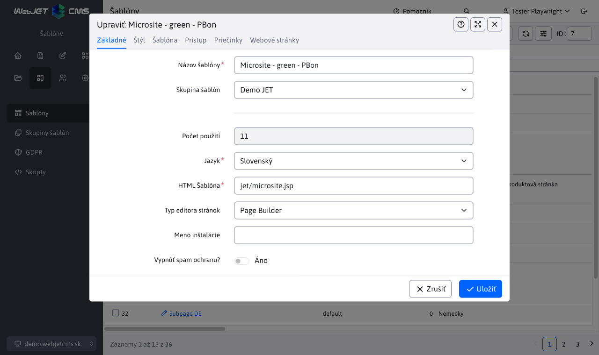

- Editor - pridaný Typ editora stránok HTML, kedy sa editor stránky zobrazí priamo v HTML režime (HTML kód). Umožňuje upravovať špeciálne typy stránok, ktoré sa nesmú prepnúť do vizuálneho režimu z dôvodu napr. špeciálneho kódu (#56129).


- Editor - pridaná možnosť nastaviť veľkosť/šírku editora aj v režime Štandardný. Viete tak zobraziť stránku v režime šírky pre mobilný telefón, tablet a počítač (#56129).
- Editor - zjednotené prepínanie režimu Štandardný/Page Builder (#56129).
- Ninja - pridaná podpora dodatočných prehliadačov pre definovanie minimálnej podporovanej verzie v `config.properties` typu `minBrowserVersion.crazy\u0020browser=10` (#56129).
- Pre stránky s vypnutým zobrazením upravená aj farba názvu stránky na červenú (#55997).
- Editor - upravená funkcia Vložiť ako čistý text a Vložiť z Word-u na otvorenie dialógového okna, do ktorého sa vloží text zo schránky (#56189).


- Editor - zlepšené čistenie kódu vloženého z Excel-u - odstránené je nastavenie šírky buniek a triedy CSS štýlov (#56189).
- Editor - upravené vkladanie odkazov na email adresu - chybné zobrazenie http prefixu pri zadávaní email adresy (#56189).

### Page Builder

- Page Builder prerobený na používanie nových JavaScript súborov identických ako pri editácii web stránky (doteraz sa používali staré z verzie 8). Kód stránky je vložený priamo pri zobrazení, nemusí sa vykonať volanie REST služby. Doplnkové CSS a JavaScript súbory sú vložené pomocou `combine` jedným volaním. Pri zobrazení bežnej stránky sa znížil počet HTTP požiadaviek z 42 na 24 (#56017).
- Načítanie v editore by malo byť rýchlejšie, nová verzia neobsahuje staré časti kódu, niektoré objekty sa znova použijú.
- Do budúcna bude dostupná už len verzia Page Builder v sekcii Web stránky, samostatná inline editácia pri zobrazení web stránky bude zrušená (z dôvodu jednotnosti skriptov).
- Nastavenie viditeľnosti upravené na možnosti Mobil, Tablet, Desktop v zhode s možnosťou prepnutia šírky editora (#56017).
- Pridaná možnosť [generovať menu](frontend/page-builder/blocks.md#podpora-menu) pre `single page` typy stránok. Menu sa generuje automaticky podľa sekcií vo web stránke (#56017).

### Aplikácie Spring

- Pridaný názov aplikácie do okna nastavenia namiesto generického názvu Upraviť (#55997).
- Aplikácie typu Spring majú pridanú [kartu Zobrazenie](custom-apps/appstore/README.md#karta-zobrazenie) pre nastavenie zobrazenia aplikácie na rôznych zariadeniach a možnosť nastaviť ukladanie HTML výstupu do vyrovnávacej pamäte pre rýchlejšie zobrazenie web stránky. Ak nie je zvolené žiadne zariadenie aplikácia sa zobrazí vždy.


### Reštauračné menu

- Sekcia (aplikácia) Reštauračné menu prerobená do datatabuliek [Reštauračné menu](redactor/apps/restaurant-menu/README.md) (#55945).

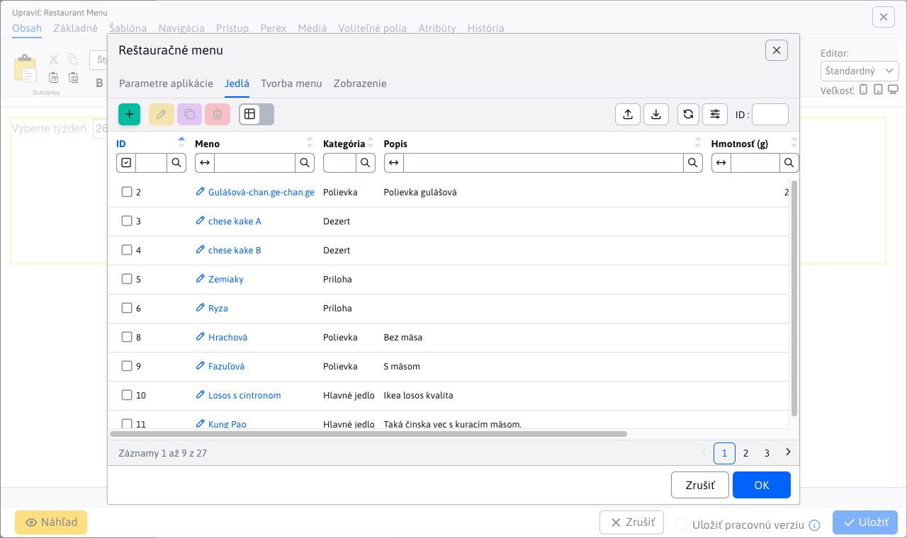

### Aktualizácia WebJETu

Vylepšený proces [aktualizácie WebJET CMS](sysadmin/update/README.md), prenesené do nového dizajny, doplnená diakritika do zoznamu zmien, zobrazenie zoznamu zmien so zvýraznenými textami a obrázkami.


### Bannerový systém

- Pridaná podpora pre [Zobrazenie banneru pre špecificky typ zariadenia](redactor/apps/banner/README.md#zobrazenie-banneru-pre-špecificky-typ-zariadenia), čiže zobrazenie len napr. na mobilnom telefóne, alebo len na tablete. Viete tak zobrazovať rôzne bannery pre rôzne zariadenia (#55921).


### Formuláre

- Doplnené pole Firma do zoznamu polí prihláseného používateľa pri vyplnení formuláru (#55961).

### Galéria

- Optimalizovaná inicializácia editora obrázkov - po prvej inicializácii sa použije existujúca inštancia (#55853).
- Optimalizované načítanie dát - pri zobrazení galérie znížený počet volaní REST služby z 6 na 1 (#56093).

### HTTP hlavičky

- Doplnená možnosť nastavenia hlavičky `Content-Language`, [automatické nastavenie](admin/settings/response-header/README.md#nastavenie-pre-súbory) hlavičky pre súbory.
- Doplnená podpora [nastavenia hlavičiek](admin/settings/response-header/README.md) pre presnú zhodu URL adresy pomocou `^/path/subpath/$` a možnosť nastavenia pre určité prípony `/path/subpath/*.pdf,*.jpg` (#56109).


### Kalendár udalostí

- Pridaná možnosť vytvoriť typ udalosti s medzerou v názve (#56054).
- Pridané zmazanie Cache po pridaní novej udalosti (#56054).

### Klonovanie štruktúry

- [Klonovanie štruktúry](redactor/apps/clone-structure/README.md) je integrované so [zrkadlením](redactor/apps/docmirroring/README.md) pre možnosť vytvorenia prekladu a prepojenia stránok pri klonovaní jazykovej mutácie. Jazyk sa preberie z nastavenia zdrojového a cieľového priečinka (#55733).
- Po vytvorení klonu je automaticky nastavené zrkadlenie zmien, v prípade potreby ho môžete zrušiť úpravou konf. premennej `structureMirroringConfig`. Medzi klonom a originálnou štruktúrou sa budú prenášať zmeny.


### Novinky

- Do [šablóny noviniek](redactor/apps/news/README.md#šablóna) pridané objekty `$pagesAll` s celým zoznamom stránkovania (`$pages` obsahuje skrátený zoznam) a `$totalPages` s celkovým počtom stránok.

### Používatelia

- Vymazanie používateľa - ošetrená situácia keď aktuálne prihlásený používateľ sa snaží vymazať sám seba (#55917).
- [Zoznam používateľov](admin/users/README.md) - v tabuľke pridané stĺpce Práva na adresáre a stránky a Schvaľovanie. Vzhľadom na vnorené údaje v stĺpcoch nie je možné vyhľadávať a usporiadať podľa hodnoty (#55897).
- Zoznam používateľov - pridané zobrazenie Skupiny práv pre zobrazenie skupín práv administrátorov v tabuľke s možnosťou filtrovania podľa zvolenej skupiny (#55601).

### Prekladové kľúče

- Pridaná možnosť [importovať iba nové](admin/settings/translation-keys/README.md) (ešte neexistujúce) kľúče. Existencia kľúča sa kontroluje pre každý jazyk (#56061).


### Presmerovania

- Presmerovania ciest - vo viac doménovej inštalácii sa zobrazujú len záznamy podľa aktuálnej zvolenej domény a záznamy, ktoré nemajú nastavenú doménu (#55957).

### Proxy

- Pridané nastavenie HTTP hlavičky `Content-Type` podľa [odpovedi z proxy](redactor/apps/proxy/README.md) (pri použití proxy na REST služby/bez vloženia do web stránky) (#56054).

### Štatistika

- Filter výberu priečinkov v zobrazení štatistiky zobrazuje len priečinky, na ktoré má používateľ práva v zozname web stránok. Pri prvej návšteve sa štatistika zobrazí pre prvý povolený priečinok. Umožňuje to zobraziť štatistiku aj redaktorom s obmedzenými právami na stromovú štruktúru web stránok (#55941).
- Pridané právo Zobraziť štatistiku pre všetky priečinky, ktoré povolí zobrazenie celej stromovej štruktúry bez ohľadu na práva na web stránky (#55941).

### Voliteľné polia

- Pridaný typ poľa `UUID` pre generovanie [unikátneho identifikátora](frontend/webpages/customfields/README.md#unikátny-identifikátor).


### Značky

- Značky - zoznam dostupných značiek sa zobrazuje podľa práv na sekcie web stránok. Viete tak sprístupniť administráciu značiek len pre určitú stromovú sekciu web stránok (alebo doménu). Ak má teda používateľ povolený len prístup do sekcie web stránok /Newsletter zobrazia sa mu len značky, ktoré majú pridanú túto sekciu, alebo značky bez obmedzenia zobrazenia (#55961).

### Zrkadlenie štruktúry

- Pridaná možnosť neskôr doplniť ID ďalšieho priečinka na zrkadlenie, pomocou [Klonovanie štruktúry](redactor/apps/clone-structure/README.md) je možné doplniť obsah nového jazyka (#55733).
- Doplnená kontrola nastavenia synchronizácie - ak odstránite ID priečinka z konf. premennej `structureMirroringConfig` nebudú sa stránky a priečinky v odobratej štruktúre ďalej synchronizovať (#55733).
- Pridaná možnosť vytvárať v zrkadlených priečinkoch [stránky a priečinky so zapnutým zobrazením](redactor/apps/docmirroring/README.md#priebeh-zrkadlenia) (napr. počas fázy vývoja stránky), stačí nastaviť konf. premennú `structureMirroringDisabledOnCreate` na hodnotu `false` (#55733).
- Prekladač - [pre DeepL](admin/setup/translation.md) je možné v konf. premennej `deepl_api_url` nastaviť URL adresu API služby. Predvolená je hodnota pre voľnú verziu, pri použití `Pro` verzie nastavte na `https://api.deepl.com/v2/translate`. Upravený spôsob autorizácie voči API na novú verziu pomocou HTTP hlavičky `Authorize` (#55733).

### Bezpečnosť

- Aktualizovaná knižnica `logback` na verziu 1.3.14.
- Opravená zraniteľnosť `CVE-2022-26960` v knižnici `elfinder`.
- Používatelia - Profil - doplnená informácia o kvalite hesla pri jeho zmene (#56077).

### Systémové zmeny

- Optimalizovaná veľkosť JavaScript súborov - knižnica `moment` je načítaná len s potrebnými jazykmi namiesto všetkými dostupnými (použitý `MomentLocalesPlugin`). Veľkosť znížená o 300kB (#56093).
- Aktualizácia - od 2023.40-SNAPSHOT sú na aktualizačnom serveri pripravené aj balíky pre aktualizáciu WebJETu bežiaceho v JAR režime, aktualizačný server poskytne aktualizačný súbor podľa typu režimu.

**Prechod z knižnice Struts na Spring**

- Aktualizácia WebJETu - prerobené aktualizovanie WebJETu [Aktualizácia WebJETu](sysadmin/update/README.md) (#55797)
- Diskusia/Fórum - prerobené pridanie nového príspevku zo Struts na Spring, prerobené schvaľovanie (#55649).
- Hodnotenie stránok - prerobené [Hodnotenie/Rating](redactor/apps/rating/README.md). Trieda `RatingDB` nahradená za `RatingService` a `RatingBean` za `RatingEntity` (#55729).
- Import XLS - URL adresa pre import XLS súborov zmenená z `/admin/importxls.do` na `/admin/import/excel/`, použite príklad v `/admin/spec/import_xls.jsp` pre aktualizáciu vašich súborov (#55905).
- Reštauračné menu - prerobené na Spring, triedy `MenuDB,MealDB,MenuBean,MealBean` nahradené za `RestaurantMenuService,RestaurantMenuEntity,RestaurantMenuMealsEntity` (#55945).
- Web stránky - prerobená možnosť Klonovania štruktúr zo struts na Spring [Klonovanie štruktúry](redactor/apps/clone-structure/README.md) (#55733).
- Web stránky - prerobené importovanie stránok zo ZIP archívu [Importovanie web stránok zo ZIP archívu](redactor/webpages/import-export.md#importovanie-web-stránok-zo-zip-archívu) (#55905).
- Web stránky - prerobené importovanie stránok z Excel súboru [Importovanie web stránok z Excel súboru](redactor/webpages/import-export.md#import-štruktúry-z-excel-súboru) (#55905).

### Oprava chýb

- Číselníky - opravené stránkovanie v číselníkoch (#56013).
- Datatabuľky - opravená pozícia okna z vnorenej datatabuľky aby sa zmestilo celé do prehliadača.
- Formuláre - opravená chyba zobrazenie dátumu v Naposledy odoslaný v zozname formulárov na Oracle databáze.
- Formuláre - opravený export dát z formuláru a duplicitné generovanie export súboru (#56141).
- Galéria, Zobrazenie súborov, Archív súborov - opravený výber priečinka vo vlastnostiach aplikácie v stránke (#54953-27).
- Galéria - opravená dvojitá lomka v URL adrese galérie v niektorých scenároch (#56017).
- Hromadný email - doplnená kontrola duplicity emailových adries bez ohľadu na veľkosť písmen (#55961).
- Konfigurácia - opravené duplicitné zobrazenie konf. premennej pri pridaní už existujúcej premennej (#55733).
- Konfigurácia - opravený import špeciálnych znakov ako je `'&#<` a vyhľadávanie v takejto hodnote (#55993).
- Json editor - opravené nastavenie a zmena obrázku v aplikáciách používajúcich Json editor (napr. Odporúčania, Pôsobivá prezentácia atď) (#55293).
- Používatelia - opravené zobrazenie práv používateľa v editácii - zobrazovali sa zaškrtnuté aj práva podľa skupiny, nielen tie nastavené (#55797).
- Používatelia - Profil - opravená chyba zmeny hesla (#56077).
- Reštartovať - opravená funkcia Reštartovať v menu Nastavenia (#54953-30).
- Skripty - opravené vkladanie skriptov do stránky - pre meno pozície sa chybne používalo vyhľadávanie ako pod-reťazec a skript sa vkladal aj keď sa meno pozície nezhodovalo presne (#54953-30).
- `Slider` - opravená kompatibilita knižnice jQuery (#55293).
- Šablóny - opravené zobrazenie šablón, ktoré majú nastavené zobrazenie len pre určitý priečinok a zároveň tento priečinok má prázdne doménové meno (#55993).
- Web stránky - pridaná podpora pri schvaľovaní web stránky v móde žiadna akcia (#55897).
- Web stránky - odstránenie záznamov schvaľovania, ktoré ostali po vymazaní priečinka z koša (#55897).
- Web stránky - doplnené automatické nastavenie malých písmen pri zadaní domény (doména sa zadáva štandardne len s malými písmenami) (#55993).
- Web stránky - opravené prepnutie na kartu Základné po pridaní nového média v novej web stránke (#54953-29).
- Web stránky - opravené zobrazenie náhľadu ak je Spring nastavený predvolene na JSON odpovede (#56054).
- Web stránky - opravené premenovanie domény - Systém priečinku sa doména nezmenila (#54953-30).
- Web stránky - bloky - vylepšené nastavenie veľkosti okna pri vkladaní Bloku (#55293).
- Zobrazenie súborov - opravené zobrazenie súborov (detekcia domény) (#54953-27).
- Oprava chyby posielania parametrov pri externých filtroch, hodnote dátum do sa nastaví čas na 23:59:59 (#56021).

### Pre programátora

- Aplikácie - pridaná možnosť zobraziť aplikáciu v stránke [podľa typu zariadenia](custom-apps/appstore/README.md#podmienené-zobrazenie-aplikácie) (mobil, tablet, pc) pridaním parametra `!INCLUDE(/components..., device=mobil)!`. Pre [Bannerový systém](redactor/apps/banner/README.md) je pridané nastavenie aj do rozhrania nastavenia aplikácie.
- Datatabuľky - pridaná podpora `LocalDate/LocalDateTime` pre dátové polia, pridaný atribút `alwaysCopyProperties` do `DatatableColumn` pre možnosť kopírovania pri editácii z [existujúceho záznamu](developer/datatables-editor/datatable-columns.md).
- Používatelia - doplnená dokumentácia k použitiu `afterSaveInterceptor` pri [registrácii používateľa](custom-apps/apps/user/README.md) a možnosť neposlať štandardný uvítací email prepísaním metódy `shouldSendUserWelcomeEmail` (#54953-28).


## 2023.40

> Verzia 2023.40 pridáva možnosť **vyhľadávania v prieskumníku**/súboroch, možnosť použiť **video banner**, zlepšuje používateľské rozhranie, zrýchľuje načítanie dát vo web stránkach. **Banner** pridáva nastavenia obmedzení pre **zobrazenie len v zadaných web stránkach a priečinkoch**. Nová aplikácia **HTTP hlavičky** umožňuje nastavovať HTTP hlavičky pre zadané URL adresy. **Médiám** sme pridali **voliteľné polia**. Zrkadlenie štruktúry podporuje **preklad aj tela web stránky** a zlepšuje detekciu zmien. Do nového dizajnu prerobené aplikácie **Monitorovanie servera, SEO, Novinky, Diskusia**. Verzia je zameraná aj na odstránenie starých častí kódu, z toho dôvodu je potrebné nanovo [skompilovať vaše triedy a upraviť JSP súbory](install/README.md#zmeny-pri-aktualizácii-na-202318).

<div class="video-container">
    <iframe width="560" height="315" src="https://www.youtube.com/embed/5hlbQYoOF6U" title="YouTube video player" frameborder="0" allow="accelerometer; autoplay; clipboard-write; encrypted-media; gyroscope; picture-in-picture" allowfullscreen></iframe>
</div>

### Prelomové zmeny

Táto verzia prináša viaceré zmeny, ktoré nemusia byť spätne kompatibilné:

- Upravené prihlasovanie pomocou `ActiveDirectory` z knižnice `Struts` na `Spring`, pred nasadením na produkciu overte na testovacích prostrediach funkčnosť prihlasovania (#55489-4).
- Upravené prihlásenie návštevníka do zaheslovanej zóny z knižnice `Struts` na `Spring`. Ak používate vlastnú prihlasovaciu JSP je potrebné upraviť jej kód (použitie struts html tagov - nahradiť za štandardné HTML tagy). Štandardné zmeny upraví automaticky volanie `/admin/update/update-2023-18.jsp`, ktoré odporúčame znova spustiť na kontrolu kompilácie JSP súborov (#55489-4).
- Aktualizovaná verzia knižnice `Thymeleaf` na verziu 3.1. Obsahuje [viaceré zmeny](https://www.thymeleaf.org/doc/articles/thymeleaf31whatsnew.html) oproti verzii 3.0, hlavne odstránenie objektov `#request, #response, #session, #servletContext`. WebJET automaticky pre aplikácie do modelu pridáva objekty `request,session` ale je potrebné upraviť HTML kód aplikácií aby používali objekt `${request` a nie `${#request`. Automaticky to vie upraviť volanie `/admin/update/update-2023-18.jsp`, ktoré je rozšírené aj o opravu `.html` súborov Thymeleaf šablón.

Po nasadení tejto verzie skontrolujte minimálne:

- Prihlasovanie pomocou `ActiveDirectory` do administrácie aj zaheslovanej sekcie (ak používate integráciu na `ActiveDirectory`).
- Prihlasovanie a registráciu návštevníkov do zaheslovanej sekcie (ak na web stránke máte zaheslovanú sekciu).
- Aplikácie a šablóny používajúce knižnicu `Thymeleaf`.
- Proces schvaľovania web stránok (ak používate).

### Vylepšenia používateľského rozhrania

- Aplikácie - **zväčšené okno pre nastavenie aplikácie**, napr. zoznam fotografií v aplikácii galéria. Výška aj šírka okna sa prispôsobuje aktuálnemu rozlíšeniu prehliadača. Na veľkých monitoroch sa okno nastavenia aplikácie zobrazí výrazne väčšie ako v predchádzajúcej verzii (#54953-15).


- Aplikácie - upravený počet stĺpcov v zozname všetkých aplikácií na 4 pre zobrazenie vyššieho počtu aplikácií naraz (#54953-15).
- Datatabuľky - opravená pozícia okna v režime editácia bunky pri type ```quill``` (napr. perex/anotácia v galérii). Okno bolo príliš vysoké a nedalo sa posunúť, v novej verzii je bublina širšia pre pohodlnejšiu prácu (#54953-15).
- Datatabuľky - **zrýchlené hľadanie záznamu podľa ID** v URL adrese, zrýchlené prepínanie stránok ak nie je záznam na prvej strane (#54273).
- Datatabuľky - **pridaná možnosť filtrovať zoznam podľa ID**, viete tak ľahko vyhľadať záznam aj pri vysokom počte strán. Na rozdiel od poľa ID v nástrojovej lište záznamy len filtruje, neotvorí automaticky aj editor. Zadanie ID v nástrojovej lište stránkuje do 5 strany a následne použije filtrovanie podľa ID pre otvorenie editora. Upravená možnosť označenia/od-značenia všetkých záznamov na jednu ikonu. Ak nie sú označené žiadne záznamy označia sa všetky, ak sú nejaké označené odznačia sa (#55581).
- Datatabuľky - upravený názov súboru s exportom na formát `názov-YYYYMMDD-HHmmss.xlsx` pre lepšie usporiadanie exportovaných súborov podľa abecedy v štandardnom prieskumníku počítača (#55581).
- Datatabuľky - ak editor obsahuje hodnotu, ktorá sa nenachádza vo výberovom poli ako možnosť, pridá sa aspoň s ID hodnotou a zobrazí sa varovanie. Situácia nastane ak napr. stránku presuniete do iného priečinka a priradená šablóna sa v novom priečinku kvôli obmedzeniam nemá používať (#54953-16).

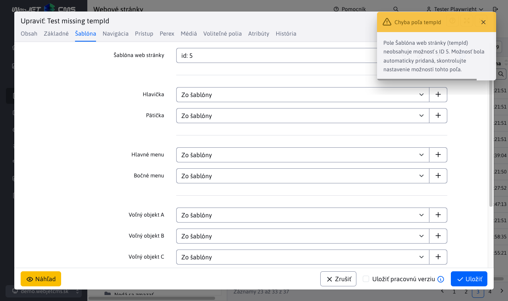

- Galéria - doplnené zapamätanie zobrazených stĺpcov a ich poradia v tabuľkovom zobrazení (#54953-15).
- Galéria - doplnená ikona na zobrazenie zvoleného obrázku v novej karte prehliadača (#54953-15).
- Web stránky - editor - **preferencia režimu editora (Štandardný/PageBuilder) sa uloží do nastavení** používateľa na serveri a je perzistentná medzi jednotlivými prihláseniami používateľa. (#54953-15).
- Web stránky - editor - tabuľka - pri vložení novej tabuľky do stránky je prednastavená šírka `100%` namiesto pôvodnej hodnoty `500px` (#54273).
- Web stránky - **optimalizované dáta** pri načítaní zoznamu stránok a stromovej štruktúry pri zadaní ID stránky/priečinka v URL. Potrebné dáta sú odoslané priamo zo servera počas načítania stránky. Zrýchľuje napr. zobrazenie stránky hlavičky z editora šablón a podobne (vnorený editor z výberového menu hlavičky/pätičky/navigácia) (#54273).
- Web stránky - história - verzie so zamietnutým schválením sú zobrazené červenou farbou (#55493).
- Web stránky - **upravené zobrazenie ikon pri menšom pomere** medzi stĺpcom stromovej štruktúry a zoznamu web stránok. Konflikt s poľom na zadávanie ID, krajšie zobrazenie ikon v 2 riadkoch pri malom rozlíšení. Prepočet výšky prerobený z CSS na JavaScript výpočet (#54953-22).
- Externý filter - teraz podporuje aj filtrovanie pomocou Web stránok a Vyhľadávača (#55537).
- Prieskumník - pridaná možnosť **vyhľadania súboru/obrázky/web stránky**. Funkcia je dostupná aj v editore stránok pri vložení obrázku, alebo odkazu na súbor/stránku. Vyhľadávať je možné v aktuálnom priečinku, alebo aj v pod priečinkoch (#54953-25).

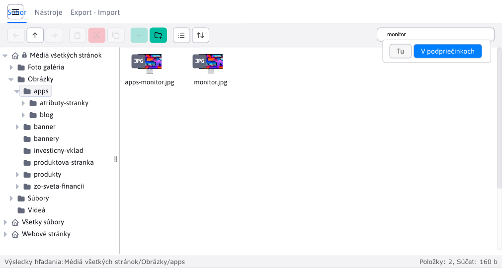

### Community/Open Source verzia

- Pridaná podpora spustenia WebJETu bez **licenčného čísla v komunitnej/Open Source verzii** (#55789).
- Zverejnený [zdrojový kód](https://github.com/webjetcms/webjetcms) (#55789).
- K verzii je možné dokúpiť niektoré platené aplikácie.
- Zoznam dostupných aplikácii sa nachádza na stránke [www.webjetcms.sk](https://www.webjetcms.sk/) (#55773).

### Web stránky

- Prerobený **proces schvaľovania** z pôvodnej verzie na Spring DATA repozitáre a REST služby. Optimalizovaný kód, zmazané duplicitné časti (#55493,#54953-21).
- Prerobený **proces mazania web stránok a schvaľovania mazania** na Spring DATA a REST služby (#55493).
- Doplnená možnosť zadať znak `/` do názvu priečinka alebo web stránky. Interne sa uloží ako HTML entita `&#47;` ale v editore a stromovej štruktúre sa zobrazí ako lomka (#55517).
- Optimalizované iniciálne načítanie dát pre používateľov s obmedzenými právami len na zobrazenie konkrétnej web stránky (#54953-17).
- Upravené **vkladanie z Word dokumentov** - odstránené sú štýly (farby, veľkosť písma...), tabuľkám je nastavená CSS trieda podľa štandardnej tabuľky, upravené HTML značky `b,i` na `strong,em`, odstránené `span` elementy (#55681).
- Pri uložení web stránky do viacerých priečinkov sa zmení režim zobrazenia ďalších stránok z presmerovania na štandardné zobrazenie (stránky sú akoby samostatné). Režim presmerovania na hlavnú stránku je možné zapnúť konf. premennou `multigroupRedirectSlavesToMaster=true` (#54953-23).
- Doplnená možnosť otvoriť web stránku s verziou z histórie v editore zadaním URL parametra `&historyid=XXX`. Využíva sa napr. v inline editácii v zobrazení histórie zmien po kliknutí na meno používateľa, ktorý stránku naposledy zmenil. (#54953-25).
- Prieskumník - v časti Zoznam web stránok sa zobrazuje **zoznam filtrovaný podľa aktuálne zvolenej domény** (#54953-25).

### Bannerový systém

- Doplnená informácia o počte videní a kliknutí na banner aj do okna editora (#55285).
- Doplnené zobrazenie obrázku banneru a možnosť kliknúť pre otvorenie odkazu do datatabuľky (#55285).
- Pridaná možnosť **nastavenia obmedzení pre zobrazenie bannera** len v zadaných [web stránkach a priečinkoch](redactor/apps/banner/README.md). Umožňuje vám to nastaviť **zobrazenie bannera v stromovej štruktúre web stránok** (#55285).

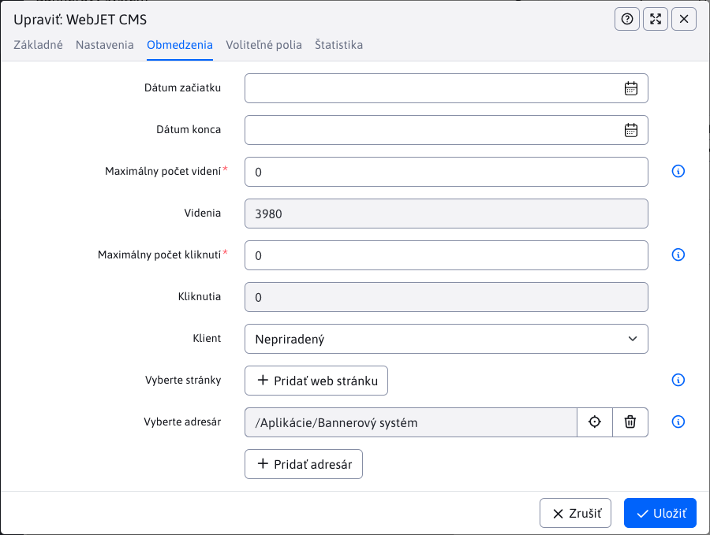

- Pridaná podpora pre [bannery typu Video](redactor/apps/banner/README.md#banner-typu-video) vo formáte `mp4` a `YouTube` a podpora pre **pridanie videa** do pozadia Obsahového bannera (#55817).

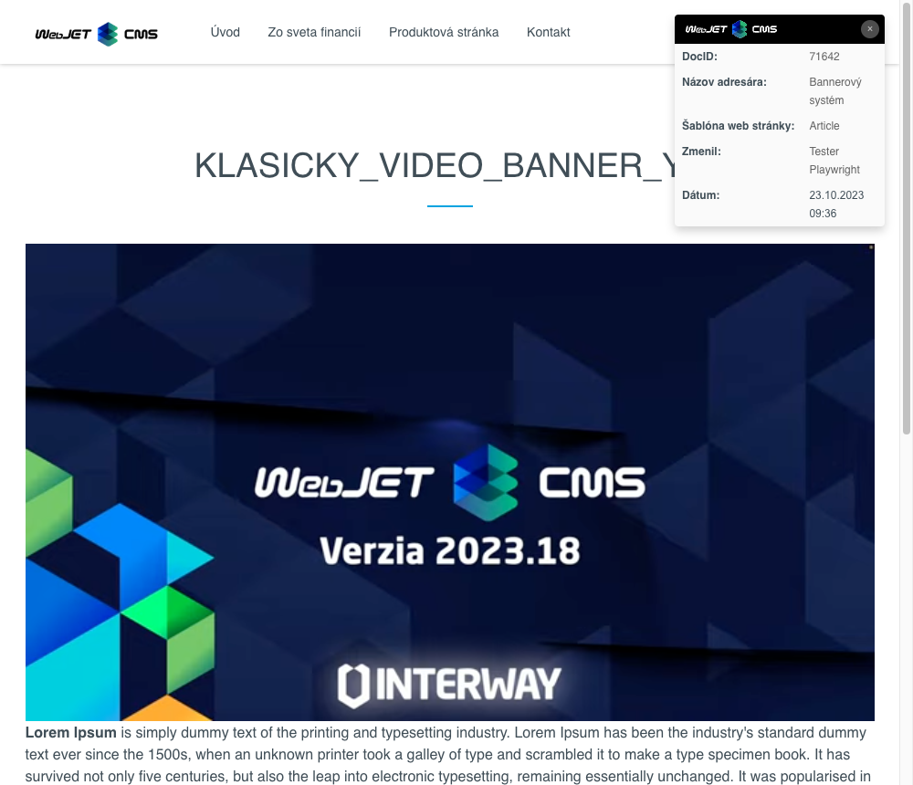

### Diskusia

- Sekcie [diskusia](redactor/apps/forum/forum-list.md) prerobená do nového dizajnu (#55501).

### Export dát

- Pridaná možnosť **vytvoriť vlastný typ exportu dát** s [vlastným JSP súborom](redactor/apps/export/README.md#vlastný-formát-exportu) (#54953-19).
- Pridaný export dát vo formáte pre `Úradní desku` v [OpenData ČR](https://ofn.gov.cz/úřední-desky/2021-07-20/) JSON (#54953-19).

### Formuláre

- Upravené čítanie zoznamu formulárov - riadiace riadky sa čítajú podľa ```NULL``` hodnoty v stĺpci ```create_date```, pôvodne podľa stĺpca ```html``` (#54273-43).

### Galéria

- Doplnené zapamätanie zobrazených stĺpcov a ich poradia v tabuľkovom zobrazení (#54953-15).
- Doplnená ikona na **zobrazenie zvoleného obrázku** v novej karte prehliadača (#54953-15).
- Doplnená **ochrana systémových priečinkov**, napr. `/images/DOMAIN-ALIAS` a priečinkov na ktoré používateľ **nemá práva**. Priečinok je zobrazený ako ne-editovateľný a nie je možné do neho nahrať fotografiu (#54953-26).

### HTTP hlavičky

Nová aplikácia [HTTP hlavičky](admin/settings/response-header/README.md) v sekcii Nastavenia umožňuje definovať HTTP hlavičky odpovede (`HTTP Response Header`) na základe URL adries zobrazenej stránky. Hlavičky sú nastavené podľa najdlhšej zhody URL adresy a je možné použiť v názve aj hodnote makro premennú.

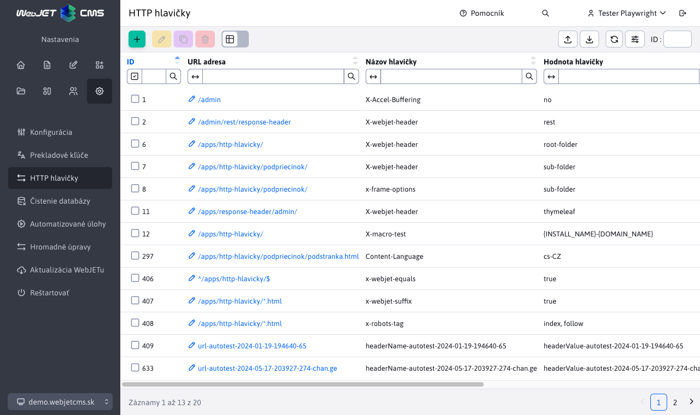

### Média

- Sekcie Správa všetkých médii je **filtrovaná podľa aktuálne zvolenej domény**. Zobrazia sa teda len média pre stránky v aktuálnej doméne podobne ako v iných aplikáciách (#55197).
- V správa všetkých médií doplnené filtrovanie tabuľky podľa skupiny a názvu/cesty k web stránke, stĺpec Obrázok zobrazené s náhľadom obrázka, stĺpec **Linka a Web stránka zobrazená s možnosťou kliknutia na odkaz** (#55197).
- Doplnená možnosť použiť [voliteľné polia](frontend/webpages/customfields/README.md) aj pre médiá (#55685).
- Opravená editácia médií v stránke vo viacerých priečinkoch (#54953-23).
- V sekcii Správa všetkých médií je v editore pole ```DOC ID``` nahradené výberom web stránky zo stromovej štruktúry (#55197).


### Monitorovanie servera

- Prerobené získanie zaťaženia CPU priamo z Java `OperatingSystemMXBean` bez potreby externej knižnice, doplnené grafy o hodnotu Zaťaženie CPU WebJET procesu, automatické zapisovanie do zaznamenaných hodnôt/databázy (#55865).
- Sekcie Aplikácie, WEB stránky, SQL dotazy prerobená do nového dizajnu (#55497).
- Doplnená dokumentácia [Výmena údajov uzlov clustra](sysadmin/monitoring/nodes-logic.md).

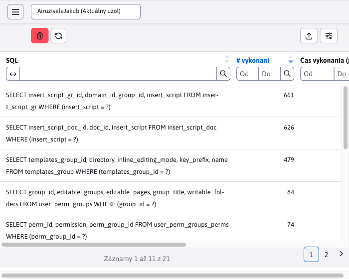

### SEO

- Celá sekcia SEO prerobená do nového dizajnu (#55537).
- Doplnená dokumentácia o [SEO sekcii](redactor/apps/seo/README.md).


### Novinky

- Prerobená aplikácia [Novinky](redactor/apps/news/README.md) (v sekcii Príspevky) do nového dizajnu. Umožňuje pracovať s novinkami podobne ako sa pracuje s web stránkami. (#55441).
- **Zoznam možných priečinkov je automaticky generovaný** podľa použitia aplikácie novinky vo web stránkach (#55441).
- Upravený dizajn nastavenia aplikácie vo web stránke (#55441).


- Pri nastavení aplikácie v stránke je zoznam značiek/perex skupín filtrovaný podľa vybraných priečinkov. Umožní vám to vybrať značky aj keď vkladáte zoznam noviniek do priečinka mimo zadaných priečinkov pre značky. Zoznam sa neaktualizuje dynamicky, najskôr nastavte priečinky, kliknite na OK pre vloženie aplikácie a následne znova otvorte jej nastavenia pre aktualizáciu zoznamu značiek (#54953-17).

### Používatelia

- Upravené **vyhľadávanie podľa skupín** - pri nastavení možnosti Rovná sa sa vyhľadajú používatelia, ktorí majú len túto jednu skupinu (nemajú zadané iné skupiny) (#54953-20).
- Schvaľovanie používateľov - pridané **schvaľovanie používateľov pri registrácií** do zaheslovanej zóny. Pridaná [dokumentácia popisujúca celý proces](redactor/zaheslovana-zona/README.md) (#55545).


- Doplnená možnosť editácie profilu do menu zobrazeného po kliknutí na meno používateľa v hlavičke. **Profil je dostupný len v novej verzii** (napr. na stránke Úvod), v starých JSP súboroch profil nie je možné upravovať. (#54953-22).
- Import - zlepšená **chybová správa pri importe**, ak bunka obsahuje nesprávnu JSON hodnotu (#54953-22).
- Import - zlepšený test importu - doplnená kontrola buniek, ktoré sú po importe zachované - nenachádzajú sa ako stĺpec v Excel súbore - nastavením hodnoty `preserveColumns` (#54953-22).

### Prekladové kľúče

Sekcia **Chýbajúce kľúče** prerobená do nového dizajnu. Doplnená informácia o **poslednom čase a URL adrese volania chýbajúceho kľúča**. Kliknutím na meno kľúča sa zobrazí editor, v ktorom môžete jednoducho doplniť chýbajúci preklad.


- Upravený import z Excelu - **importujú sa iba jazyky zadané v Excel súbore** ako stĺpec. Ak potrebujete importovať iba jeden jazyk zmažte v Exceli stĺpce s prekladmi v ostatných jazykoch. Neprepíšu sa vám tak prípadné zmeny v prekladoch iných jazykov.

### Proxy

- Pridaná možnosť vytvoriť **proxy pre REST službu vo vnútornej sieti**. Aby sa odpoveď z REST služby nevkladala do stránky zadajte do poľa Prípony vložené do stránky prázdnu hodnotu (#54953-21,#55689).
- Pridaná možnosť zadať [viacero URL adries](redactor/apps/proxy/README.md#nastavenie-aplikácie) do poľa Lokálna URL adresa a možnosť použiť presnú zhodu a končí na pri URL adrese (#55689).

### Šablóny

- Zoznam súborov pre pole HTML Šablóna berie do úvahy hodnotu v poli Meno inštalácie, zoznam je dynamicky načítaný pri kliknutí do poľa, nie pri otvorení editora (#54953-17).
- Zoznam šablón je **filtrovaný podľa aktuálne zobrazenej domény**. Filtrovanie je na základe vybratých priečinkov v poli Zobraziť pre a zhody doménových mien (ak nemá šablóna žiadne obmedzenie prístupu zobrazí sa vo všetkých doménach). Filtrovanie sa použije len keď je nastavená konf. premenná `enableStaticFilesExternalDir=true` (#54953-17).

### Zrkadlenie štruktúry

- Doplnená kontrola existencie priečinka/stránky po nastavení zrkadlenia, aby sa **priečinky/stránky zbytočne neduplikovali, ak už v danom jazyku existujú** (a preklad sa zhoduje) (#55193).
- Doplnená cache prekladov pre urýchlenie opakovaného získania prekladu a zníženia zaťaženia API (#55193).
- Doplnené [prekladanie textu web stránky](redactor/apps/docmirroring/README.md#automatický-preklad) (#55709).
- Doplnená lepšia [identifikácia automatického prekladu](redactor/apps/docmirroring/README.md#úprava-existujúcej-web-stránky) s možnosťou **kontinuálnej aktualizácie preložených stránok** do momentu ich revízie. Automaticky preložené stránky majú nastaveného autora `autotranslate` pre jednoznačnú identifikáciu (#55709)

### Bezpečnosť

- Aktualizovaná knižnica ```xlsx``` pre import XLSX súborov na verziu 0.19.3. Knižnica ```amcharts``` ešte nemá aktualizáciu, nevzniká v nej ale problém, keďže ```xlsx``` knižnica sa tam používa len na generovanie XLSX súborov (#55193).
- Aktualizovaná knižnica ```tui-image-editor``` pre použitie novšej verzie ```fabricjs``` (#55193).
- Aktualizovaná knižnica ```bootstrap-select``` na verziu 1.13.14.
- Aktualizované knižnice `slf4j` a `logback`.
- Aktualizovaná verzia knižnice `Thymeleaf` na verziu 3.1.
- Aktualizované NPM moduly na novšiu verziu (#55193).
- Audit - zlepšené auditovanie úloh na pozadí - do auditného záznamu sa nastaví IP adresa servera a zaznamená sa používateľ, pod ktorým je spustený aplikačný server (#55441).
- Audit - zlepšené auditovanie záznamov entít používajúcich `@MappedSuperclass`. Auditované sú aj vlastnosti zo super triedy (#54953-22).
- Do CI/CD doplnené automatické nasadenie na server pre penetračné testovanie, nastavené kontinuálne penetračné testovanie nástrojom ```Acunetix OVS``` (#55193).
- Logovanie - opravená možná XSS v nastavení úrovní logovania (#54273).
- Odstránené staré ```Flash/SWF``` súbory pre bannerový systém, YouTube a video prehrávač (#55285).
- Odstránená knižnica `org.bouncycastle:bcprov-jdk15on:1.70`, používala sa len pre službu `Pay24` a obsahovala možnú zraniteľnosť (#55193-4).
- Pri volaní URL adries obsahujúcich ```/rest``` sú povolené všetky HTTP metódy (#54273-44).
- Prihlásenie - zapnuté [predĺženie doby nemožnosti prihlásenia](sysadmin/pentests/README.md#blokovanie-prihlásenia) na 60 sekúnd po 5 neúspešných pokusoch zadania hesla (#55489-4).
- Dvojstupňové overovanie - ak používate overovanie voči `ActiveDirectory/SSO` serveru môžete vypnúť menu položku pre nastavenie dvojstupňového overenia nastavením konf. premennej `2factorAuthEnabled` na hodnotu `false`.

### Aktualizácia WebJETu

- Zlepšený **proces aktualizácie WebJETu** priamo cez WebJET. Počas aktualizácie sú zmazané súbory, ktoré boli zmazané počas prechodu na verziu 2023.18 (#55293).
- Upravená kombinácia súborov na prihlasovacej obrazovke pre znova načítanie JS/CSS súborov po aktualizácii (#55293).
- Doplnená kontrola ```web.xml``` súboru po aktualizácii, kontroluje sa výskyt ```web-app_2_4.xsd```, ak sa nachádza aktualizuje sa podľa súboru ```web-v2023.xml```, ktorý je ```web-app_3_0.xsd``` (#55293).

### Systémové zmeny

- Knižnica `Amcharts` pre generovanie grafov aktualizovaná na verziu 5. Podpora pre v4 bola zrušená a všetky funkcie na prácu s grafmi v [chart-tools.js](../src/main/webapp/admin/v9/src/js/libs/chart/chart-tools.js) boli upravené na prácu s v5 (#55405).

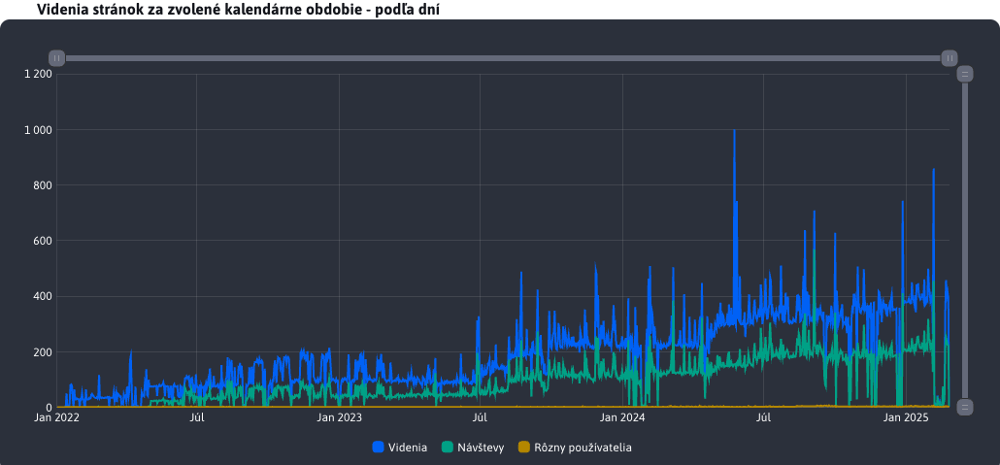


- Aktualizácia WebJETu - zlepšená kontrola zmazania súborov po aktualizácii, tie ktoré sa nepodarí zmazať sa zapíšu do súboru `/WEB-INF/update/error-log.txt` (#55441).
- Cluster - doplnená **možnosť použiť posledných 16 znakov** z `HOSTNAME` v režime `clusterNames=auto` nastavením konf. premennej `clusterHostnameTrimFromEnd=true`. Potrebné napr. pre `Kubernetes`, kde je náhodná hodnota na konci `HOSTNAME` (#54953-22).
- Datatabuľky - pridaná možnosť zmeniť **limit maximálneho počtu riadkov** pre export pomocou konf. premennej `datatablesExportMaxRows`, predvolene 50000. Vysoká hodnota môže spôsobiť nadmerné zaťaženie servera aj počítača redaktora (#54953-17).
- **Optimalizácia veľkosti JavaScript súborov** - upravené vkladanie knižnice `amcharts` pre generovanie grafov do hlavného JavaScript súboru. Knižnica je vkladaná do stránky asynchrónne len v prípade potreby. Veľkosť súboru sa zmenšila o 1MB, čo zrýchli jeho prvotné načítanie a znižuje pamäťovú náročnosť (#55405).
- Oracle - do `autoupdate` pridaný `trigger` po prihlásení, ktorý nastaví `NLS_SORT=BINARY_AI NLS_COMP=LINGUISTIC` pre podporu vyhľadávania bez ohľadu na diakritiku a veľkosť písmen (#JTB1684).
- Odstránená knižnica `backport-util-concurrent` a `org.mnode.ical4j` - v štandardnom WebJET CMS sa nepoužívajú, v prípade potreby pre váš projekt si ich môžete pridať do vášho `build.gradle` (#54953-19).
- Odstránené nepoužívané súbory `/admin/FCKeditor/editor/dialog/editor_check_file_exist.jsp,/admin/file_browser/dragdropupload.js.jsp` a priečinok `/admin/swfupload/*` (#55609).
- Na úvodnú stránku doplnená **informácia o minimálne vyžadovanej verzii Javy na serveri**. Minimálna verzia sa nastavuje v konf. premennej `javaMinimalVersion`, nastavením na hodnotu `0` sa upozornenie vypne (#54953-17).

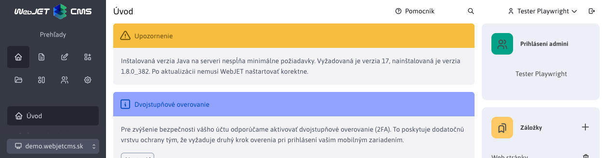

**Prechod z knižnice Struts na Spring**

- Začali sme prechod zo [Struts framework na Spring](developer/frameworks/struts/README.md). Prerobené sú volania `/admin/findex.do->/admin/fbrowser/fulltext-index/index/` (#55389). Struts volanie `/sync/getobject.do` je zrušené (používalo sa na online synchronizáciu medzi WebJET-mi), podporovaná je synchronizácia pomocou XML/zip súborov (#55489-3).
- Anketa - hlasovanie - prerobené z frameworku (volanie `/inquiry.answer.do`) (#55389).
- Upravené prihlasovanie pomocou `ActiveDirectory` (volanie `/ntlm/logon.do`), pred nasadením na produkciu overte na testovacích prostrediach funkčnosť prihlasovania. Odstránená knižnica `jcifs` (#55489-4).
- Upravené prihlasovanie návštevníka do zaheslovanej zóny (volanie `/usrlogon.do`) (#55489-4).
- Zmazané už nepoužívané Struts volania `/admin/newgroup.do,/admin/media.do` a triedy `NewGroupAction/Form,MediaAction/Form` (#55489).
- Otázky a odpovede - prerobené volanie `/qa.add.do` na Spring (#55493).
- Web stránky - prerobené schvaľovanie zmien v stránke (`/admin/approve.do,/admin.approvedel.do`) na Spring (#55493).
- Web stránky - prerobené nahratie obrázkov, ktoré sú `drag&drop` do editora web stránok. Prerobená stará struts `/admin/uploadfile.do` logika na Spring `/admin/web-pages/upload/` (#55609).
- Prieskumník - prerobené okno pre Nastavenie adresáru a súboru zo struts `/admin/fbrowser.savedir.do,/admin/fbrowser.save.do` na Spring `/admin/fbrowser/dirprop/,/admin/fbrowser/fileprop/` (#55617).
- Pri použití `jar-packaging` je súbor `struts-config.xml` čítaný z JAR súboru pre možnosť jeho aktualizácie s WebJETom, pôvodný na súborovom systéme je zmazaný.
- Stiahnutie prílohy vo formulároch - prerobené zo struts `/admin/formatt.do` na Spring `/apps/forms/admin/attachment/` (#55613).
- Odstránené nepoužívané volania `/admin/FCKeditor/styles.do,/admin/dir.do,/admin/editornewdir.do,/admin/formsendnotify.do,/admin/dragdropupload.do` a príslušné Java triedy (#55489).
- Odstránené volanie `/admin/savedoc.do`, upravený `inline_page_toolbar.jsp` na použitie Spring form (#55489).
- Odstránená nepoužívaná trieda `SearchForm` a formuláre `uploadFileForm,formNoteForm` (#55489).
- Prerobená [inicializácia WebJETu](install/setup/README.md) a nastavenie [licenčného kľúča](install/license/README.md) (#55701)

### Dokumentácia

- V sekcii [Manuál pre redaktora](redactor/README.md) a [Manuál pre správcu](admin/README.md) doplnené dokumenty vo formáte `docx` na stiahnutie, ktoré obsahujú základné informácie o práci vo WebJET CMS (#43144).
- Vytvorená dokumentácia pre [inštaláciu](install/setup/README.md) a [základnú konfiguráciu](install/config/README.md) (#54953-23).

### Oprava chýb

- Automatizované úlohy - doplnené chýbajúce pole Beží na uzle pre nastavenie uzla v cluster inštalácii (#55193).
- Číselníky - opravené nastavenie ID číselníka pre import, opravený import číselníka, ktorý ešte nemá žiadny záznam (#55569).
- Číselníky - opravené filtrovanie podľa zvoleného typu číselníka (#55541).
- Datatabuľky - opravené duplikovanie záznamu pre niektoré prípady (napr. doménové limity kde sa používa ako ID primitívny int).
- Datatabuľky - opravené zobrazenie nastavenia stĺpcov pri ich presunutí - zle zobrazený zoznam v okne Zobrazenie stĺpcov (#54953-15).
- Datatabuľky - Import/Export - upravený formát exportu pre hodnoty typu `1,2,3` aby boli považované za reťazec, nie číslo (#55569).
- Datatabuľky - upravené vyhľadávanie keď zadáte hodnotu ale kliknete na ikonu lupy v inom stĺpci (alebo zadáte viacero filtrovacích kritérií naraz) (#54953-18).
- Datatabuľky - opravené nastavenie šírky stĺpcov po zadaní dátumu do filtra (#55497).
- Datatabuľky - export - doplnené použitie externého filtra pri exporte dát (#55845).
- Diskusné fórum - opravený HTML kód pri vytváraní viactémovej diskusie, doplnené nástroje pre nastavenie diskusie v administrácii (nastavenie schvaľovania, termíny).
- Email - opravené nastavenie SMTP server portu ak sa nepoužíva prihlasovacie meno a heslo (#55545).
- Formuláre - opravené dešifrovanie HTML kódu formuláru.
- Formuláre - opravený konflikt názvov stĺpcov a systémového názvu (napr. `note`) (#54273-47).
- Formuláre - opravené odosielanie formuláru ako prílohy (#55705).
- Formulár ľahko - pridaná možnosť použiť znak `+` v poli zástupný text (#54953-21).
- Galéria - doplnené pre generovanie ```/thumb``` obrázka pri zmene oblasti záujmu - po uložení sa obrázku nastaví aktuálny dátum a čas, čo vyvolá jeho pre generovanie (#54953-15).
- Galéria - opravené načítanie obrázka pri prihlásenom používateľovi, zadanom `v` parametri a jeho neexistencii/presmerovaní (#54953-17).
- Galéria - opravené nahratie obrázku do galérie ak obrázok už existuje (prepísanie `o_` obrázku) (#54953-25).
- HTMLBox - pridaná podpora vkladania súborov cez httpS protokol pri použití `/components/htmlbox/include.jsp`. Protokol httpS sa použije ak je spojenie s web stránkou zabezpečené (#55489-4).
- Novinky - opravené zobrazenie chyby v logoch servera pri neexistujúcej značke. Opravené zbytočné volanie starej JSP komponenty pre zobrazenie noviniek v editore (#54953-18).
- Oracle - opravené vyhľadávanie podľa mena (napr. v audite) (#JTB1684).
- Počasie - upravený vzhľad nastavenia aplikácie, doplnená kompatibilita s behom na Java 11 (#55293).
- Prekladač - opravené nastavenie kódovania znakov ```utf-8``` pre korektný prenos diakritiky (#55193).
- Prekladové kľúče - opravená možnosť vyhľadávania podľa viacerých stĺpcov, pridané zapamätanie zobrazených stĺpcov (#54953-18).
- Presmerovania domén - opravená aktualizácia cache a clustra pri vytvorení nového presmerovania typu `ALIAS` (#55489-4).
- Prieskumník - opravené nastavenie súboru a priečinku, zmazané duplicitné a nepodporované možnosti (vytvoriť archív, konvertovať do PDF atď) (#55489-1).
- Prieskumník - opravená funkcia Duplikovať a zobrazenie menu prihláseného používateľa (#54953-22).
- Používatelia - opravená kontrola povinného poľa Prihlasovacie meno, opravená kontrola kvality hesla.
- Používatelia - opravené nastavenie práv pri načítaní editora s URL parametrom `id` (#54953-22).
- Skupiny šablón - opravený import zoznamu skupín šablón - prázdna hodnota ```renderFormat``` (#55285).
- Šablóny - skupiny šablón - opravená možnosť nastaviť prázdnu hodnotu do metadát (#54273-47).
- Štatistika - opravené zobrazenie Videnia stránok v sekcii TOP stránky (#55193).
- Vyhľadávanie v administrácii - opravený odkaz na editáciu prekladového kľúča na novú verziu a odkaz na zobrazenie priečinku web stránok (#54953-22).
- Web stránky - doplnená kontrola textu ```data not loaded``` pri ukladaní stránky. To môže nastať pri chybnom načítaní údajov web stránky pred editáciou (#54273-43).
- Web stránky - upravený import web stránok - uloženie zoznamu bannerov (#55285).
- Web stránky - PageBuilder - opravené CSS štýly pre nastavenie nulového okraju pre elementy ```div.row div.row``` (#54953-15).
- Web stránky - PageBuilder - opravená chyba nastavenia šablóny pre novo vytváranú stránku, ak sa nezhoduje šablóna priečinku a hlavnej stránky priečinku (#55441).
- Web stránky - opravené duplikovanie koreňového priečinku pri jeho editácii (ak sa jedná o hlavný doménový priečinok) (#55441).
- Web stránky - opravené načítanie stránky z histórie ak je stránka uložená vo viacerých priečinkoch (#54953-20).
- Web stránky - opravené zobrazenie náhľadu novo vytváranej (ešte neuloženej) stránky (#54953-20).
- Web stránky - opravené presúvanie stránok uložených vo viacerých priečinkoch v stromovej štruktúre (#54953-21).
- Web stránky - opravené filtrovanie podľa značiek, ak je použité výberové pole - je definovaných viac ako 30 značiek (#54953-23).
- Web stránky - opravené nastavenie URL adresy stránky ak už stránka s rovnakým názvom/URL adresou existuje (#54953-23).
- Web stránky - opravené načítanie zoznamu stránok na schvaľovanie v Oracle DB pri vysokom množstve priečinkov (#54953-24).
- Web stránky - opravená chyba nastavenia hodnoty 0 do atribútu `viewsTotal` pri uložení web stránky  (#54953-24).
- Web stránky - opravené uloženie atribútov pri web stránke vo viacerých priečinkoch (#54953-24).
- Web stránky - opravené zobrazenie zoznamu Média tejto stránky pri galérii a použití doménových aliasov (duplicitné zobrazenie Obrázky namiesto Fotogaléria) (#54953-25).
- Web stránky - opravené zobrazenie správneho priečinka pri zmene existujúceho obrázku (označiť obrázok a kliknúť na ikonu vloženia obrázku) (#54953-25).
- Kampane - opravené sortovanie vo vnorených datatabuľkách editora. Vytvorený autotest na overenie fungovania (#55565).
- Externý filter - pri prednastavení hodnôt z externého filtra sa hodnota zapísala aj do datatabuľky (ak sa stĺpce volali rovnako), a táto hodnota v datatabuľke bránila filtrovaniu cez externý filter. Oprava, tieto hodnoty sa už nenastavia do datatabuľky + jej filter nad takýmto stĺpcom sa stáva `disabled` aby sa takejto chybe predošlo (#55537).
- Šírka tabuľky - opravená chyba kde šírka tabuľky sa neupravovala s parametrom tabuľky `autoHeight` v prípade, ak sme v danej tabuľke filtrovali (#55537).
- Web stránky - opravené načítanie zoznamu regulárnych výrazov pri editácii stránky pre používateľov, ktorý nemajú práva na sekciu formuláre (#55501).
- Web stránky - doplnená logika mazania stránok vo [viacerých priečinkoch](redactor/webpages/editor.md#zaradenie-v-stromovej-štruktúre). Pri zmazaní hlavnej web stránky z koša sa vymažú aj všetky stránky v ostatných priečinkoch (#55813).

### Pre programátora

- Datatabuľka - pridaný ```renderFormat = "dt-format-image"``` pre zobrazenie [malého náhľadu obrázka](developer/datatables/README.md#nastavenie-stĺpcov) s odkazom na plnú verziu a textom linky na obrázok (#55285).
- Datatabuľka - pridaná možnosť pridať [notifikáciu](developer/datatables-editor/notify.md) aj pri volaní `/all` (#55497).
- Upravené konštruktory ```Tools/DB/utility``` tried z ```private``` na ```protected``` pre možnosť ich rozšírenia v klientských projektoch (#54953-14).
- Odstránená knižnica ```com.googlecode.lambdaj:lambdaj```, výrazy nahradené štandardnými Lambda funkciami Java 8 (#54425).
- Pridaná ukážková podpora [vývoja v kontajneroch](developer/install/devcontainers/README.md) za použitia špecifikácie ```devcontainers```.


- Vytvorená dokumentácia pre [prechod zo Struts do Spring](developer/frameworks/struts/README.md)
- Upravené spracovania nahratia/`upload` súboru. Pre URL adresy `path.contains("spring") || path.contains("rest") || path.startsWith("/admin/v9/") || queryString.contains("__sfu=0")` sa nepoužije starý `MultipartWrapper.getFileParameterValue(key)` ale štandardný Spring `MultipartFile`.


## 2023.18

> Verzia 2023.18 je zameraná na integráciu kódu pôvodnej verzie 8. **Zrušená** je možnosť **prepnutia do starej verzie 8**, odstránené sú časti kódu, ktoré sú už prerobené do nového dizajnu, alebo nie sú naďalej podporované. **Hlavné zmeny API** sú v použití **generických objektov** typu ```List/Map``` namiesto špecifických implementácií ```ArrayList/Hashtable```. Z toho dôvodu **je potrebné nanovo skompilovať vaše triedy a upraviť JSP súbory**.

Významné zmeny v tejto verzii:

- Web stránky
  - Aktualizovaná knižnica ```ckeditor``` (editor stránok) na najnovšiu verziu 4.21.
  - Doplnená možnosť nastaviť pomer [šírky stĺpca stromovej štruktúry a datatabuľky](redactor/webpages/README.md#nastavenie-zobrazenia-stromovej-štruktúry).
  - Doplnená integrácia [atribútov stránky do editora](redactor/webpages/doc-attributes/README.md).
- Aplikácie
  - Bannerový systém - prerobená **štatistika zobrazení a kliknutí** na banner na novú podobu.
  - Formuláre - doplnená možnosť **archivovať formulár**.
  - [Číselníky](redactor/apps/enumeration/README.md) - prerobené do nového dizajnu.
  - Používatelia - v multi doménovej inštalácii je v editácii používateľa a skupín práv možné vyberať priečinky web stránok a jednotlivé web stránky bez ohľadu na aktuálne zvolenú doménu.
  - Prekladové kľúče - zobrazenie **prekladových kľúčov** upravené do **tabuľkového formátu**, kde stĺpce predstavujú jazyky.
  - Šablóny - pridaná možnosť **zlúčiť dve šablóny** do jednej.
- Bezpečnosť
  - Vykonané **bezpečnostné testy** pri nasadení u klienta a testy automatizovaným nástrojom ```Acunetix OVS```.
  - Aktualizované viaceré knižnice.
- Systém
  - Zlepšená **podpora** databázového servera **Oracle a Microsoft SQL**.

Samozrejme bolo opravených aj viacero chýb, ktoré boli identifikované pri používaní WebJETu na viacerých projektoch.

<div class="video-container">
    <iframe width="560" height="315" src="https://www.youtube.com/embed/A5upeBuEMbg" title="YouTube video player" frameborder="0" allow="accelerometer; autoplay; clipboard-write; encrypted-media; gyroscope; picture-in-picture" allowfullscreen></iframe>
</div>

### Odstránenie závislosti na verzii 8

Z dôvodu lepšej integrácie a budúceho vývoja je odstránená závislosť na WebJET CMS verzie 8, ktorá bola doteraz dostupná a to vrátane možnosti prepnutia používateľského rozhrania administrácie na verziu 8. Je dlhodobo neudržateľné podporovať obe verzie a zároveň používať nové technológie. Súbory verzie 8 presunuté priamo do verzie 2023, čo nám umožní ich priamu úpravu na nové rozhranie. Ešte neprerobené časti zostávajú v starom rozhraní, prerobené sú dostupné už len v novom rozhraní. Zrušená možnosť prepnutia používateľského rozhrania do verzie 8.

Pre zjednodušenie aktualizácie môžete použiť skript ```/admin/update/update-2023-18.jsp``` pre kontrolu a opravu JSP súborov. Zákaznícke Java triedy je potrebné nanovo skompilovať a opraviť chyby z dôvodu zmeny API.

Z ```build.gradle``` súboru je potrebné zmazať kód:

```
implementation("sk.iway:webjet:${webjetVersion}:struts")
implementation("sk.iway:webjet:${webjetVersion}:daisydiff")
implementation("sk.iway:webjet:${webjetVersion}:jtidy")
```

Prečistené/zmazané viaceré Java triedy a balíky a príslušné JSP súboru. Pre podporu zmazaných častí v projektoch je potrebné použiť buď príslušný produkt typu WebJET NET alebo do projektu ich preniesť z verzie 8:

- Odosielanie SMS správ ```SendSMS```, konverzia Sk na Eur ```SkkEuroLoader```, Import SAX ```XmlSaxImporter```, Vkladanie JS/CSS priamo do stránky (Packager), kompilácia ```sass``` ```SassFileMonitor```, ```Skriptovanie v editore```, import používateľov z ```TXT/CSV``` súboru v starom ```Outlook``` formáte (použite import z xlsx formátu).
- Značky ```iwcm:vue``` a ```vue.tld``` pre vkladanie VUE komponent, dnes odporúčame ich vkladať priamo ako JS súbory.
- Integrácia na ```Alfresco``` a ```Sharepoint``` (bude neskôr dostupné ako súčasť produktu NET).
- Aplikácie: Bazár, ```AppCache```, ```Chat```, ```Clipboard```, ```Docman```, ```emailAttachmentsPublisher```, ```Events```, Graf, Majetok, Inzercia, ```PageUpdateInfo```, Poradňa, SITA, Tip dňa, Úschovňa, ```Wiki```, Zmluvy (časť aplikácii je nahradená v produkte WebJET NET).
- Prihlasovanie cez sociálne siete, použitá bola knižnica bez podpory ```socialauth```. Plánovaná je integrácia ```OAuth```, alebo použitie Spring Social.
- Konverzia z Doc na PDF (služba už nebola dlhšie dostupná).
- Odstránené konf. premenné: ```editorEnableScripting,enableToPdfConversion,doc2pdfConvertUrl,packagerMode,packager*,```.

### Web stránky

- Pri duplikovaní web stránky sa pri otvorení okna prepne na kartu Základne pre jednoduchšiu zmenu názvu, zmaže sa hodnota poľa URL adresa a Názov položky v menu aby sa automaticky nastavili podľa nového názvu stránky. Podobne sa nastavia prázdne hodnoty pri duplikovaní priečinka (#54953-6).
- Doplnené duplikovanie médií pri duplikovaní web stránky (#54953-6).
- Doplnená možnosť nastaviť pomer [šírky stĺpca stromovej štruktúry a datatabuľky](redactor/webpages/README.md#nastavenie-zobrazenia-stromovej-štruktúry). Vhodné ak máte široký alebo naopak úzky monitor a potrebujete vidieť viac/menej v stromovej štruktúre (#54953-7).


- Upravené usporiadanie URL adries pri vyhľadávaní zadaním ID stránky. V zozname sú na začiatku stránky, ktorých URL adresa je najkratšia (usporiadanie podľa abecedy s ohľadom na dĺžku URL adresy) (#55001).
- V [histórii stránky](redactor/webpages/history.md) pridaný stĺpec Bude vypnuté s prípadným dátumom kedy bude vypnuté zobrazenie web stránky (#54953-10).
- Aktualizovaná knižnica ```ckeditor``` (editor stránok) na najnovšiu verziu 4.21.1, vytvorený [GIT repozitár](https://github.com/webjetcms/libs-ckeditor4/pull/1/files) s verziou pre WebJET CMS (#55093).
- Opravená funkcia Nastavenie bloku (#55093).
- Editor obrázkov (kliknutie na ceruzku po označení obrázka v stránke) nahradený novou verziou ako sa používa v galérii, vypnutá možnosť použiť ```Pixlr``` editor (prešiel na komerčnú verziu a nefunguje API prístup) (#54993).

### Atribúty stránky

Doplnená integrácia [atribútov stránky do editora](redactor/webpages/doc-attributes/README.md). Umožňuje definovať polia, ktoré sa následne nastavujú web stránke. Atribúty sa delia do skupín (napr. Monitory, Mobilné telefóny atď) z ktorých je možné vyberať (#55145).

Výhoda oproti voliteľným poliam je v teoreticky nekonečnom počte polí a zároveň v možnosti organizovať polia do skupín. V databáze sú hodnoty ukladané v korektných dátových typoch, čo umožňuje vykonávať usporiadanie pomocou databázových dotazov (voliteľné polia aj typ číslo dátovo ukladajú ako reťazec).


Po nastavení je možné atribúty zobrazovať v porovnávacej tabuľke:


Alebo je možné zadané atribúty zobraziť ako aplikáciu vo web stránke, napr. ako zoznam vlastností produktu:


Doplnené vlastnosti:

- Definícia atribútov je naviazaná na aktuálnu doménu, v každej doméne môžete mať definované nezávislé atribúty.

### Datatabuľky

- Voliteľné polia - pridaná možnosť nastaviť typ pola [textová oblasť a ne-editovateľný text](frontend/webpages/customfields/README.md#textová-oblasť) (#55001).
- Pridaná možnosť [nastaviť tabuľke](developer/datatables/README.md#možnosti-konfigurácie) výšku podľa jej obsahu (počtu riadkov) tak, že nevypĺňa celú výšku okna (napr. ak je za sebou viacero tabuliek alebo je pridaný aj graf) nastavením možnosti ```autoHeight: false``` (#54989).

### Bannerový systém

- Prerobená štatistika zobrazení a kliknutí na banner na novú podobu (datatabuľky, grafy) (#54989).

### Formuláre

- Doplnená možnosť archivovať formulár, prerobená sekcia Archív formulárov do datatabuľky. Odstránený starý kód zobrazenia zoznamu formulárov (#54993).

### Číselníky

- Aplikácia číselníky prerobená do nového dizajnu (#55009).

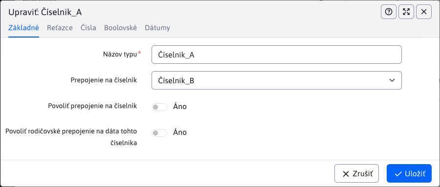

### Galéria

- Doplnená možnosť nastaviť pomer šírky stĺpca stromovej štruktúry a datatabuľky. Vhodné ak máte široký alebo naopak úzky monitor a potrebujete vidieť viac/menej v stromovej štruktúre (#54953-7).
- Doplnená možnosť zobraziť galériu so špecifikovaného priečinka v URL parametri ```dir```. Pri úprave nastavenia aplikácie galéria v stránke sa teda priamo zobrazí nastavený priečinok (#54953-8).
- Pri vytvorení nového priečinka sú hodnoty rozmerov (vrátane spôsobu zmeny veľkosti) a vodotlače prednastavené podľa rodičovského priečinka (#54953-11).
- Doplnená podpora zobrazenia priečinkov pri používaní doménových aliasov. Predvolene sa zobrazí/otvorí priečinok ```/images/ALIAS/gallery```, kvôli spätnej kompatibilite sa ale zobrazia aj iné priečinky galérie (ak neobsahujú v názve doménový alias inej domény) (#54953-12).

### Používatelia

- V multi doménovej inštalácii je v editácii používateľa a skupín práv možné vyberať priečinky web stránok a jednotlivé web stránky bez ohľadu na aktuálne zvolenú doménu. Domény sa zobrazia ako koreňové priečinky. Zobrazenie vybranej položky obsahuje prefix s doménovým menom, aby bolo možné rozlíšiť jednotlivé priečinky (často sa volajú v rôznych doménach rovnako, napr. Slovensky) (#54953-11).

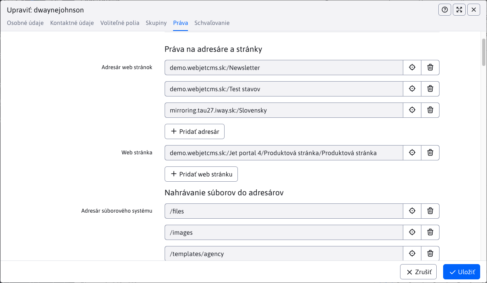

- Používateľské rozhranie - odstránená možnosť upraviť profil používateľa kliknutím na meno v hlavičke, údaje používateľa môže modifikovať už len administrátor s právami do sekcie Používatelia.

### Proxy

- Aplikácia [Proxy](redactor/apps/proxy/README.md) prerobená do nového dizajnu/datatabuľky. Doplnená dokumentácia a automatizované testy (#55025).

### Prekladové kľúče

- Zobrazenie prekladových kľúčov upravené do tabuľkového formátu, kde stĺpce predstavujú jazyky. Naraz sú zobrazené teda preklady vo všetkých jazykoch (oproti pôvodnej verzii kde ste videli len preklad zvoleného jazyka) (#55001).
- Zobrazené jazyky sa definujú v [konf. premennej languages](admin/setup/languages.md).
- V nastavení zobrazených stĺpcov je možné zapnúť aj zobrazenie pôvodných hodnôt pred zmenou prekladového kľúča.


- Zrušený starý spôsob exportu/importu kľúčov v ```properties/json``` formáte, podporovaný je import a export cez Excel. (#54953-8).
- Optimalizovaná rýchlosť importu z Excel súboru - audituje sa len informácia o importe a nie jednotlivých záznamoch, prázdne hodnoty sa preskočia (typicky sa jedná o prázdne stĺpce nepoužívaných jazykov), porovnanie záznamov je voči cache tabuľke (pri importe sa nemusí pre každý záznam testovať, či v databáze existuje) (#MR342).

### Šablóny

- Pridaná možnosť zlúčiť dve šablóny do jednej. Pri zlúčení sa zmení zlúčená šablóna v priečinkoch a web stránkach za novo zvolenú šablónu (#55021).
- Upravený import - ak neexistujú príslušné stránky pre hlavičku/pätičku/menu tak sa vytvoria prázdne stránky aby nenastala chyba importu. Podobne pre skupinu šablón a priečinky (Zobraziť pre) (#MR348).

### Konfigurácia

- Pridaná možnosť importu a exportu konfiguračných premenných pomocou formátu Excel (#54513-11,MR360).

### Použiteľnosť

- Upravená použiteľnosť ```autocomplete``` polí (typicky výber skupiny v Bannerovom systéme, Ankete, Otázky a odpovede, Skripty). Kliknutím kurzora do poľa sa ihneď zobrazí výberové pole so zoznamom možností, do poľa je ale možné písať začiatok textu pre vyhľadanie v zozname a aj zadať novú hodnotu.

### Bezpečnosť

- Audit - pridané samostatné právo na Úrovne logovania, keďže tie umožňujú aj zobraziť logy servera. Právo je predvolene zakázané, po aktualizácii ho nastavte vhodným používateľom (#54953-5).
- Opravené nastavenie URL adresy s parametrom a pamätania hesla pri prihlasovaní - atribút ```autocomplete="off"```, atribút automaticky nastavený pre všetky polia typu heslo v editore datatabuľky (#JTB-1587).
- Doplnené vrátenie chyby 404 pre url typu ```/admin.tgz``` (#JTB-1587).
- Zlepšená kontrola prístupu do administrácie/kontroly práv na základe nálezov penetračných testov (#JTB-1606).
- Upravené chybové správy typu SQL pri uložení záznamu v datatabuľke - pre používateľa je zobrazená skrátená verzia chyby, kompletná je zaznamenaná v audite (#JTB-1606).
- Aktualizovaná knižnica ```Spring Security``` na verziu 5.8 (#54993).
- Web stránky - opravený možný XSS v názve stránky/priečinka (#55181).
- Web stránky - opravený možný XSS v náhľade aplikácie v stránke (#55181).
- Vyhľadať a nahradiť - opravený možný XSS v náhľade aplikácie v stránke (#55193).
- Odhlásenie - parameter ```forward``` umožňuje zadať len lokálnu URL adresu, externé je potrebné zadať pomocou presmerovania cez ```forwardDocId``` (#55193).
- Aktualizovaná knižnica Datatables na verziu 1.13.4 pre stránky verzie 8 a knižnica v ```/components/_common/datatables``` priečinku (#55193).
- Opravené možné zraniteľnosti pri vytváraní ZIP archívu (doplnená validácia cesty) (#55193).
- Pridané konfiguračné premenné `DocTools.removeCharsDir` a `FileBrowserTools.forbiddenSymbols` pre možnosť definovať zakázané znaky v názve súboru/adresára (#MR445).

### Systém

- Zlepšená podpora databázového servera Oracle (#54953-6, #54953-7).
- Pri multi doménovej inštalácii s použitím doménových aliasov je pri generovaní ```/thumb``` obrázka overené, či existuje varianta v priečinku s pridaným doménovým aliasom (```/images/ALIAS/cesta/obrazok.jpg```). Ak neexistuje, použije sa pôvodne požadovaná cesta (#54993).
- Pridaná konf. premenná `languages` [nastavujúca dostupné jazykové mutácie](admin/setup/languages.md)
- Upravená pauza pri zápise štatistík - pôvodne sa náhodná pauza (0-10 sekúnd) vykonala pred každým zápisom SQL výrazu, po novom sa vykoná len pred prvým záznamom. Pauza je náhodná, aby v clustri nedochádzalo k nadmernému zaťaženiu databázy v 0 sekunde kedy sa predvolene vykonáva úloha na pozadí pre zápis štatistík.

### Oprava chýb

- Bannerový systém - opravená chyba zaznamenania počtu zobrazení a kliknutí na banner (#54273-40).
- Datatabuľka - opravená editácia bunky vo vnorenej tabuľke (editácia bunky nemala správne nastavené zobrazenie nad) (#54953-5).
- Formuláre - opravená možnosť dešifrovania údajov formuláru (#54993).
- Galéria - opravené nastavenie lupy v karte Oblasť záujmu v prehliadači Firefox a posun veľkého obrázka (#54953-5,6).
- Galéria - opravené zobrazenie pri type tabuľka - nesprávna výška tabuľky (#54953-7).
- Hromadný email - opravená možnosť zadania viacerých emailových adries pre odhlásenie (#54953-6).
- Datatabuľka - opravený výpočet percent pri importe z Excelu, doplnená aj informácia o riadku a celkovom počte riadkov do okna importu (#MR341).
- Datatabuľka - opravené hľadanie záznamu podľa ID v URL parametri pri usporiadaní na klientskej strane (keď je tabuľka usporiadaná inak ako podľa ID) (#55021).
- Datatabuľka - opravené hľadanie podľa ID ak primárny kľúč je iný ako ```id``` (napr. ```tempId```) (#55021).
- Datatabuľka - opravené vnorenie editácie a otváranie ďalších okien (napr. z web stránky editácia šablóny, tam editácia stránky hlavičky). Doplnené stmavenie hlavičky a pätičky rodičovského okna a mierne zmenšenie vnoreného dialógu (#54273-41).
- Datatabuľka - v režime duplikovať budú vnorené datatabuľky zobrazené s čiernou prekrytou vrstvou nedostupné na editáciu (stmavené). Typicky vnorené datatabuľky zobrazujú napojené dáta a v režime duplikovať by došlo k zmene údajov pôvodného záznamu. Typicky pri editácii web stránky úprava v karte Média (#54273-37).
- Galéria - opravené nastavenie lupy v karte Oblasť záujmu v prehliadači Firefox a posun veľkého obrázka (#54953-5,6).
- Galéria - opravené zobrazenie pri type tabuľka - nesprávna výška tabuľky (#54953-7).
- Galéria - opravené načítanie obrázkov v multidomain verzii s externými súbormi (#MR341).
- Hromadný email - opravené zobrazenie chyby neplatnej emailovej adresy v skupine pri jej pridaní (#54953-12).
- Mazanie dát - upravené zobrazenie položiek v menu, viaceré položky zlúčené do Databázové záznamy (#54953-7).
- Otázky a odpovede - upravené predvolené usporiadanie tak, aby najnovšie otázky boli na začiatku zoznamu (#54993).
- PageBuilder - upravené ovplyvňovanie štýlov tlačidiel stránky štýlmi administrácie (#54953-6).
- Používatelia - opravené zobrazenie neaktívnych výberových polí v stromovej štruktúre práv (#54953-9).
- Používatelia - opravená chyba validácie emailovej adresy (#54953-12).
- Prekladové kľúče - opravená chyba vloženia kľúča so znakom tabulátor na začiatku/konci (#MR-364).
- Web stránky - opravené prvotné načítanie zoznamu stránok ak priečinok obsahuje viac ako 10 záznamov (#54953-6).
- Web stránky - opravené duplikovanie priečinka ak nie je nastavená multi doménová konfigurácia (#54953-6).
- Web stránky - opravené znova načítanie zoznamu web stránok v priečinku po zmene hlavnej stránky priečinka (#54953-7).
- Web stránky - opravená kozmetická vada zobrazenie filtra podľa stavu a zobrazenie tabuľky v dialógovom okne (#54953-8).
- Web stránky - opravené vypnutie publikovania stránky po zadanom dátume - možnosť Odverejniť stránku po tomto dátume (#54953-10).
- Web stránky - opravené nastavenie aktuálneho dátumu do poľa Dátum začiatku pri nastavenej konf. premennej ```editorAutoFillPublishStart=true``` (#54953-11).
- Web stránky - opravená nastavenie hodnoty textu editora pri editácii bunky (#55057).
- Web stránky - opravená detekcia duplicitnej URL adresy pri adresách bez .html na konci a bez lomky (#55161).
- Web stránky - opravené ikony v úprave šablóny noviniek (#54953-13).
- Web stránky - upravené zobrazenie dialógov (napr. vlastnosti aplikácie) pri použití PageBuilder (okno je vo vrstve vyššie ako nástrojová lišta editora), opravená možnosť presúvania okna pre Spring aplikácie.

### Testovanie

- Do [testovania Datatabuľky](developer/testing/datatable.md#možnosti-nastavenia) ```DataTables.baseTest``` doplnená možnosť ```afterCreateSteps(I, options, requiredFields, DT, DTE)``` pre nastavenie napr. povinných polí po uložení záznamu (ak tabuľka neobsahuje žiadne povinné polia je možné nastaviť pole pre vyhľadávanie záznamu v ďalších krokoch).
- Doplnený test ```webpages.webpage-virtual-path ```nastavovania URL adries stránok - kontrola duplicity, kontrola adries so znakom hviezdička (#55161).

### Dokumentácia

- Doplnená dokumentácia pre nastavovanie [atribútov stránky v editore](redactor/webpages/doc-attributes/README.md) (#55145).

### Pre programátora

- Doplnená API metóda [DatatableRestControllerV2.afterDuplicate(T entity, Long originalId)](developer/datatables/restcontroller.md) volaná po duplikovaní záznamu. Môžete tak napr. duplikovať aj pripojené dáta ako sú média web stránky (#54953-6).
- Doplnená JavaScript funkcia ```WJ.selectMenuItem(href)``` pre [zvýraznenie zadanej menu položky](custom-apps/admin-menu-item/README.md#frontend) v ```master-detail``` stránkach (#54953-9).
- Doplnená podpora polí typu ```DataTableColumnType.JSON``` v [parametroch aplikácií](custom-apps/appstore/README.md#parametre-aplikácie) a priamo v Spring triede. Zladené je nastavenie polí pre editor (nastavenie aplikácie v editore) a pri zobrazení aplikácie na stránke. (#55169).
- Vytvorená dokumentácia k [rozšíreniu existujúcich Spring DATA repozitárov](custom-apps/spring/repository-extend.md) vo vašom projekte (#UCMWS-14).
- Doplnená možnosť [rozšírenia dialógov](developer/datatables/export-import.md#špeciálny-typ-exportu) pre špeciálny import a export údajov z datatabuľky (#54513-11,MR360).


## 2023.0

<div class="video-container">
    <iframe width="560" height="315" src="https://www.youtube.com/embed/_Rt-GJk-E1Y" title="YouTube video player" frameborder="0" allow="accelerometer; autoplay; clipboard-write; encrypted-media; gyroscope; picture-in-picture" allowfullscreen></iframe>
</div>

Verzia 2023.0 je zhodná s [verziou 2022.52](CHANGELOG-2022.md).
