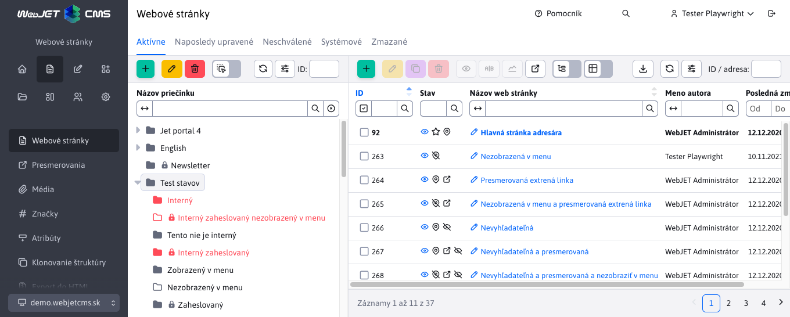
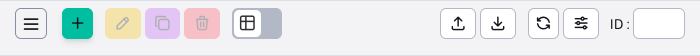
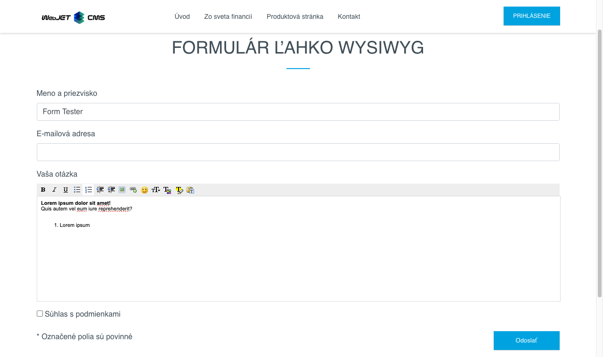

# Zoznam zmien verzia 2024

## 2024.18

> Verzia 2024.18 obsahuje **novú sadu ikon**, Formulár ľahko doplnený o **pokročilé nastavenia** (príjemcovia, presmerovania...), do nového dizajnu sú prerobené aplikácie AB Testovanie, Audit (čaká na publikovanie, zmenené stránky), Blog, Dotazníky, Kalendár udalostí (schvaľovanie). Pridáva **podporu inštalácie typu MultiWeb** (oddelenie údajov domén) v Šablónach, Hromadnom e-maile a ďalších aplikáciách. Nová knižnica na **detekciu prehliadačov**, v Štatistika-Prehliadače dôjde k drobným rozdielom, ale údaje o prehliadači anonymizovane zaznamenávame aj bez Cookies súhlasu.

**Upozornenie:** na spustenie verzie 2024 je potrebné mať na serveri inštalovanú Java verzie 17.

### Prelomové zmeny

Táto verzia prináša viaceré zmeny, ktoré nemusia byť spätne kompatibilné:

- Hromadný email - upravená podpora odosielania emailov cez službu Amazon SES z použitia špeciálneho API na [štandardný SMTP protokol](install/config/README.md#nastavenie-amazon-ses).
- [Odstránené knižnice](install/README.md#zmeny-pri-prechode-na-20240-snapshot) `bsf,c3p0,cryptix,datetime,jericho-html,jsass,opencloud,spring-messaging,uadetector,joda-time,aws-java-sdk-core,aws-java-sdk-ses,jackson-dataformat-cbor,jmespath-java` (#56265).
- Odstránená značka `iwcm:forEach`, je potrebné ju nahradiť za `c:forEach`. Rozdiel je v tom, že Java objekt nie je priamo dostupný, je potrebné ho získať pomocou `pageContext.getAttribute("name")`. Použite volanie `/admin/update/update-2023-18.jsp` pre aktualizáciu vašich JSP súborov (#56265).
- Hromadný email - oddelené kampane, príjemcovia a odhlásené emaily podľa domén, staršie záznamy sú do domén zaradené podľa URL adresy web stránky pre odoslanie. Výhoda v oddelení odhlásených emailov je v prípade prevádzkovania viacerých web sídiel a rozdielnych zoznamov príjemcov, kedy sa odhlasuje oddelene pre jednotlivé domény. UPOZORNENIE: aktuálne odhlásené emaily sa nastavia pre doménu s ID 1, ak používate primárne hromadný email na inej ako prvej doméne aktualizujte stĺpec `domain_id` v databázovej tabuľke `emails_unsubscribe` (#56425).
- Hromadný email - zmazané nepoužívané metódy z Java triedy `sk.iway.iwcm.dmail.EmailDB`, ak ich vo vašom projekte používate presuňte si ich z [pôvodného zdrojového kódu](https://github.com/webjetcms/webjetcms/blob/ef495c96da14e09617b4dc642b173dd029856092/src/webjet8/java/sk/iway/iwcm/dmail/EmailDB.java) do vašej vlastnej triedy (#56425).
- Ikony - z dôvodu prechodu na Open Source riešenia sme zmenili sadu ikon z pôvodnej FontAwesome na novú sadu [Tabler Icons](https://tabler.io/icons). Ak vo vašich vlastných aplikáciach používate ikony zo sady FontAwesome je potrebné upraviť kód a nahradiť ich ikonami zo sady `Tabler Icons`. Môžete použiť skript ```/admin/update/update-2023-18.jsp``` pre úpravu najčastejšie používaných ikon v administrácií (upraví iba súbory, ktoré vyžadujú prihlásenie).

### Prechod na Java 17

WebJET CMS verzie 2024 prešiel na Java verzie 17. Obsahuje nasledovné zmeny:

- Aktualizované viaceré knižnice, napr. `AspectJ 1.9.19, lombok 1.18.28`.
- Aktualizovaná knižnica Eclipselink na štandardnú verziu, použitie WebJET CMS `PkeyGenerator` nastavené pomocou triedy `JpaSessionCustomizer` a `WJGenSequence`.
- Aktualizovaný `gradle` na verziu 8.1.
- Odstránená stará knižnica ```ch.lambdaj```, použite štandardné Java Lambda výrazy (#54425).
- Odstránená značka `<iwcm:forEach`, použitie nahradené štandardným `<c:forEach` (#56265).
- Pre zjednodušenie aktualizácie môžete použiť skript ```/admin/update/update-2023-18.jsp``` pre kontrolu a opravu JSP súborov. Zákaznícke Java triedy je potrebné nanovo skompilovať a opraviť chyby z dôvodu zmeny API.

### Nová sada ikon

Z dôvodu prechodu na Open Source riešenia sme zmenili sadu ikon z pôvodnej FontAwesome na novú sadu [Tabler Icons](https://tabler.io/icons). Niektoré ikony boli upravené, aby lepšie vystihovali funkciu tlačidla.



Pri datatabuľkách sú ikony pre nastavenie tabuľky, znova načítanie údajov, import a export presunuté napravo, aby lepšie oddelili štandardné funkcie od nastavení a pokročilých operácií. Na obrázkoch vidno porovnanie novej (hore) a starej verzie (dole).




### Vylepšenia používateľského rozhrania

- Menu - menu položky/ikony sekcie (Prehľad, Web stránky, Príspevky...) sa zobrazia len ak má používateľ prístup k niektorej položke v danej sekcii (#56169).
- Novinky - upravené pridanie novinky - prepnutie na kartu Základné pre jednoduchšie nastavenie titulku novinky a nastavenie zaradenia v stromovej štruktúre podľa zvolenej sekcie v hlavičke stránky (#56169).
- Úvod - sekcie Prihlásení admini, Moje posledné stránky, Zmenené stránky a Audit sa zobrazujú len ak má používateľ potrebné práva (#56169).
- Úvod - doplnená informácia o priečinku v zozname posledných stránok, doplnená možnosť otvoriť auditný záznam (#56397).
- Web stránky - zlepšená editácia na mobilných zariadeniach - nástrojová lišta editora je posúvateľná, dostupné sú všetky ikony (#56249-5).
- Datatabuľky - zlepšené usporiadanie nástrojovej lišty editora pri malých rozlíšeniach - ikony sa korektne posunú na druhý riadok, možnosť zadať ID zostáva vpravo hore (#56249-5)
- Datatabuľky - ikona pre označenie/odznačenie všetkých záznamov mení stav podľa toho, či sú označené riadky, alebo nie (#56397).
- Datatabuľky - zmenšené medzery medzi stĺpcami, znížená výška názvu stránky, nástrojovej lišty a pätičky pre zobrazenie viacerých sltĺcov na obrazovke/zhustenie informácií. Na rovnakej obrazovke by sa mal v tabuľke zobraziť minimálne jeden riadok naviac. (#56397).

### Web stránky

- Štandardná [synchronizácia titulku](redactor/webpages/group.md#synchronizácia-názvu-priečinka-a-web-stránky) priečinka a hlavnej web stránky sa nepoužije, ak je jedna web stránka nastavená ako hlavná viacerým priečinkom, alebo keď je hlavná stránka z iného priečinku (#56477).

### MultiWeb

Pridaná podpora [prevádzky v režime MultiWeb](install/multiweb/README.md) - multi tenantná správa viacerých samostatných domén v jednom WebJETe. Domény sú navonok samostatné a každá sa tvári ako samostatná inštalácia WebJET CMS.

- Zoznam používateľov - oddelený podľa ID domény (#56421).
- Úvod - prihlásený admini - oddelený podľa domén (#56421).
- Práva na Doménové limity, HTTP hlavičky, Úrovne logovania, Posledné logy, Skupiny používateľov, Skupiny práv sú dostupné len v prvej/správcovskej doméne (#56421).
- Web stránky - pridaná možnosť vytvoriť viac koreňových priečinkov (#56421).
- Štatistika - Chybné stránky - pridaný stĺpec `domain_id` do databázy pre oddelenie chybných URL adries podľa domén (#56421).
- Média - skupiny médií - zoznam rozdelený podľa aktuálne zobrazeniej domény a práv stromovej štruktúry web stránok (#56421).

### AB testovanie

- Zoznam stránok v AB teste prerobený do [nového dizajnu](redactor/apps/abtesting/abtesting.md), pridaná sekcia pre nastavenie konfigurácie AB testovania (#56177).


### Audit

- Doplnená podpora filtrovania používateľa aj podľa zadanej email adresy.
- Prerobená sekcia Audit->[Čaká na publikovanie](sysadmin/audit/audit-awaiting-publish-webpages.md) do nového dizajnu. Prehľadne zobrazuje zoznam stránok, ktoré budú v zmenené v budúcnosti (#56165).
- Prerobená sekcia Audit->[Zmenené stránky](sysadmin/audit/audit-changed-webpages.md) do nového dizajnu. Zobrazuje kompletný zoznam zmenených stránok za zvolené obdobie (#56165).


### Blog

- Blog prerobený do novej administrácie. Sekcia zoznam článkov používa štandardné možnosti ako sú použité v zozname web stránok/noviniek (#56169, #56173).
- Pôvodný zoznam diskusných príspevkov je presunutý priamo do sekcie Diskusia, používatelia/blogeri získavajú právo aj na túto časť (#56169).
- Na zobrazenie zoznamu článkov je používaná štandardná aplikácia pre novinky.
- Správa blogerov (administrácia používateľov) prerobená na datatabuľku, umožňuje zjednodušene vytvoriť blogera a korektne mu nastaviť práva.


### Dotazníky

Aplikácia [dotazníky](redactor/apps/quiz/README.md) prerobená do nového dizajnu. Umožňuje vytvoriť dotazníky s vyhodnotením správnej odpovede. Dotazník môže byť s jednou správnou odpoveďou, alebo s bodovanými odpoveďami. Aplikácia obsahuje aj štatistické vyhodnotenie (#55949).


### Formulár ľahko

- Pridaná karta rozšírené s pokročilými možnosťami nastavenia spracovania formuláru podobne ako majú štandardné HTML formuláre. Pridané možnosti nastavenia príjemcov, presmerovaní, ID stránky s verziou do emailu atď. Upravený zoznam položiek formuláru pre lepšie využitie priestoru (#56481).


- Pridaný typ poľa Formátované textové pole pre zadávanie textov s formátovaním ako je tučné písmo, odrážky, číslovaný zoznam a podobne (#56481).



### GDPR Cookies

- Integrácia s [Google Tag Manager](redactor/apps/gdpr/gtm.md) doplnená o nové typy súhlasov `ad_user_data` a `ad_personalization`, ktoré sú napojené na súhlas s marketingovými cookies. Upravené generovanie JSON objektu z hodnôt `true/false` na správne hodnoty `granted/denied` (#56629).

### Hromadný e-mail

- Upravená podpora odosielania emailov cez službu Amazon SES z použitia špeciálneho API na [štandardný SMTP protokol](install/config/README.md#nastavenie-amazon-ses) (#56265).
- Nastavenie doménových limitov pridané ako samostatné právo, predvolene je nepovolené, je potrebné ho pridať vhodným používateľom (#56421).
- Oddelené kampane, príjemcovia a odhlásené emaily podľa domén, staršie záznamy sú do domén zaradené podľa URL adresy web stránky pre odoslanie. Výhoda v oddelení odhlásených emailov je v prípade prevádzkovania viacerých web sídiel a rozdielnych zoznamov príjemcov, kedy sa odhlasuje oddelene pre jednotlivé domény. UPOZORNENIE: aktuálne odhlásené emaily sa nastavia pre doménu s ID 1, ak používate primárne hromadný email na inej ako prvej doméne aktualizujte stĺpec `domain_id` v databázovej tabuľke `emails_unsubscribe` (#56425).
- Pridaná možnosť priameho [odhlásenia sa z hromadného emailu](redactor/apps/dmail/form/README.md#odhlásenie) kliknutím na odkaz zobrazený v emailovom klientovi/Gmail nastavením hlavičky emailu `List-Unsubscribe` a `List-Unsubscribe=One-Click` (#56409).

### Kalendár udalostí

- Neschválené a odporúčané udalosti - proces [schvaľovania nových udalostí](redactor/apps/calendar/non-approved-events/README.md) a [odporúčaných udalostí](redactor/apps/calendar/suggest-events/README.md) prerobené do nového dizajnu (#56181).

### Novinky

- Pridaná možnosť Vylúčiť hlavné stránky priečinkov v [zozname noviniek](redactor/apps/news/README.md#nastavenie-aplikácie-vo-web-stránke) pre vylúčenie hlavných stránok z pod priečinkov v zozname noviniek. Predpokladá sa, že podadresáre obsahujú hlavnú stránku so zoznamom noviniek v tomto priečinku, takéto stránky sa vylúčia a nepoužijú sa v zozname noviniek (#56169).

### Otázky a odpovede

- Pridané samostatné ukladanie odpovede do emailu aj do databázy pre neskoršie overenie odpovede (#56533).
- Opravené zobrazenie stĺpca Otázka už bola zodpovedaná (#56533).
- Pri zvolení možnosti Zobrazovať na web stránke sa skopíruje odpoveď do emailu do odpovede na web stránku (ak je už zadaná) (#56533).

### Šablóny

- Oddelený zoznam šablón podľa domén - zobrazujú sa len šablóny, ktoré nemajú obmedzenia zobrazenia podľa priečinkov alebo obsahujú obmedzenie na priečinok aktuálne zobrazenej domény (#56509).

### Štatistika

- Upravené získanie čísla týždňa podľa ISO 8601, hodnoty v štatistikách podľa týždňa môžu byť rozdielne voči predchádzajúcej verzii (#56305).
- Chybné stránky - pridaný stĺpec `domain_id` do databázy pre oddelenie chybných URL adries podľa domén. Historické údaje nie sú oddelené (zobrazia sa vo všetkých doménach), ale od momentu aktualizácie sa budú zobrazovať už chybné URL oddelené podľa domén (#56421).
- Upravená [detekcia prehliadača](redactor/apps/stat/README.md#prehliadače) s využitím knižnice [UAP-java](https://github.com/ua-parser/uap-java). Niektoré údaje sú detegované inak ako pôvodne - rozlišuje sa Safari a Mobile Safari na iOS, operačný systém pre Android telefóny je namiesto Unix nastavený na Android, pre niektoré prípady je detegovaný Linux namiesto Unix, macOS ako Mac OS X. Pridaná podpora detekcie Instagram a Facebook interného prehliadača. Po aktualizácii na túto verziu môžu teda nastať rozdiely pri zobrazení obdobia pred a po aktualizácii. Je možné aktualizovať súbor s definíciou prehliadačov nastavením cesty k [YAML](https://github.com/ua-parser/uap-core/blob/master/regexes.yaml) súboru v konf. premennej `uaParserYamlPath` (#56221).
- Typ prehliadača a operačný systém je zapísaný do štatistiky aj bez súhlasu s ukladaním cookies, keďže tento údaj cookies nepoužíva. Údaj je anonymizovaný a zapísaný so zaokrúhleným časom na 15 minút (#56221).

### Bezpečnosť

- 404 - pridaná možnosť vypnúť ochranu volania 404 stránky (počet požiadaviek) podobne ako iné spam ochrany nastavením IP adresy do konf. premennej `spamProtectionDisabledIPs`. Pre danú IP adresu sa vypnú aj ďalšie SPAM ochrany (pre  opakované volania).
- Pridaná kontrola licencií použitých knižníc pri `deployment` novej verzie (#56265).
- Aktualizované viaceré knižnice na novšie verzie, majoritné verzie zmenené pre `mariadb-java-client` z 2 na 3, `pdfbox` z 2 na 3 (#56265).

### Testovanie

- Pridali/upravili sme automatizované testovanie front-end časti (nie admin časti) aplikácií Mapa, Carousel, Archív súborov, Content Block, Dátum, Google Vyhľadávanie, Odkazy na sociálne siete, Odporúčania, Poslať stránku emailom, Počasie, Príbuzné stránky, Pôsobivá prezentácia, Slider, Slit Slider, Video, Carousel Slider, Vloženie HTML kódu, Vloženie dokumentu, Vyhľadávanie, Podmienené zobrazenia, Bloky (#56413).
- Pridaná podpor pre automatické otestovanie/kontrolu medzi-doménového oddelenia záznamov do [DataTables.baseTest](developer/testing/datatable.md#možnosti-nastavenia) (#56509).

### Pre programátora

- Hromadný email - zmazané nepoužívané metódy z Java triedy `sk.iway.iwcm.dmail.EmailDB`, ak ich vo vašom projekte používate presuňte si ich z [pôvodného zdrojového kódu](https://github.com/webjetcms/webjetcms/blob/ef495c96da14e09617b4dc642b173dd029856092/src/webjet8/java/sk/iway/iwcm/dmail/EmailDB.java) do vašej vlastnej triedy (#56425).
- `MailHelper` - pridaná možnosť nastaviť hlavičky emailu volaním `addHeader(String name, String value)`, API SendMail upravené na použitie `MailHelper`, ktorý odporúčame primárne používať na odosielanie emailov (#56409).
- Pridaná možnosť zobraziť vo vašej aplikácií zoznam konf. premenných podľa [zadaného prefixu](./custom-apps/config/README.md) (#56177).
- Pridaná možnosť kontrolovať práva pri vytvorení, editácii, mazaní, vykonaní akcie ale aj pri získaní záznamu implementáciou metódy `public boolean checkItemPerms(T entity, Long id)` (#56421).
- Pridaná trieda `DatatableRestControllerAvailableGroups` pre jednoduchú implementáciu kontroly práv používateľa aj na základe práv na stromovú štruktúru web stránok (#56421).

### Systémové zmeny

- WebJET CMS je dostupný priamo v [repozitári maven central](https://repo1.maven.org/maven2/com/webjetcms/webjetcms/), GitHub projekty [basecms](https://github.com/webjetcms/basecms) a [democms](https://github.com/webjetcms/democms) upravené na použitie priamo tohto repozitára. Zostavenie je mierne odlišné od pôvodného zostavenia, knižnice `wj*.jar` sú spojené do `webjet-VERZIA-libs.jar`. Použitá knižnica [pd4ml](https://pd4ml.com/support-topics/maven/) je vo verzii 4, pre generovanie PDF súborov vyžaduje zadanie licencie do súboru `pd4ml.lic` v [pracovnom priečinku](https://pd4ml.com/support-topics/pd4ml-v4-programmers-manual/) servera alebo priečinku kde sa nachádza `pd4ml.jar`. Neskôr bude doplnená možnosť zadať licenčné číslo cez konfiguračnú premennú (#43144).
- Zrušená podpora plno textového indexovania `rar` archívov (#43144).
- NTLM - pridaná konf. premenná `ntlmLogonAction.charsetEncoding` s názvom kódovania znakov pre LDAP prihlásenie. Ak je prázdne, nepoužije sa a znaky sa ponechajú v kódovaní ako ich vráti LDAP server.
- PostgreSQL - pridaná podpora [databázy PostgreSQL](install/setup/README.md#vytvorenie-db-schémy) (#56305).

Odstránili sme viaceré nepoužívané knižnice, málo používané sme nahradili alternatívami:

- Odstránená značka `<iwcm:forEach`, použitie nahradené štandardným `<c:forEach`. Zmenu vykonajte z `<iwcm:forEach items="${iii}" var="vvv" type="sk.iway.ttt">` na `<c:forEach items="${iii}" var="vvv"><%sk.iway.ttt vvv = (sk.iway.ttt)pageContext.getAttribute("vvv");%>`.
- Odstránená JSP knižnica `datetime`, ak používate JSP značky `<datetime:xxx>` môžete si ju pridať do `build.gradle` ako `implementation("taglibs:datetime:1.0.1")`.
- Odstránená knižnica `c3p0` a podpora použitia tohto databázového `pool`.
- Odstránené staré JS funkcie `saveEditor` a `historyPageClick` vrátane starej REST služby `/admin/rest/document/`.
- Hromadný email - upravená podpora odosielania emailov cez službu Amazon SES z použitia špeciálneho API/knižnice na [štandardný SMTP protokol](install/config/README.md#nastavenie-amazon-ses).

V prípade potreby niektorej z uvedených knižníc vo vašom projekte si ju pridajte do vášho `build.gradle`:

```gradle
dependencies {
    implementation("com.amazonaws:aws-java-sdk-core:1.12.+")
    implementation("com.amazonaws:aws-java-sdk-ses:1.12.+")
    implementation("bsf:bsf:2.4.0")
    implementation("commons-validator:commons-validator:1.3.1")
    implementation("taglibs:datetime:1.0.1")
    implementation("net.htmlparser.jericho:jericho-html:3.1")
    implementation("joda-time:joda-time:2.10.13")
    implementation("io.bit3:jsass:5.1.1")
    implementation("org.jsoup:jsoup:1.15.3")
    implementation("org.mcavallo:opencloud:0.3")
    implementation("org.springframework:spring-messaging:${springVersion}")
    implementation("net.sf.uadetector:uadetector-core:0.9.22")
    implementation("net.sf.uadetector:uadetector-resources:2014.10")
    implementation("cryptix:cryptix:3.2.0")
    implementation("org.springframework:spring-messaging:${springVersion}")
    implementation("com.google.protobuf:protobuf-java:3.21.7")
    implementation("com.google.code.findbugs:jsr305:3.0.2")
    implementation("org.apache.taglibs:taglibs-standard-spec:1.2.5")
    implementation("org.apache.taglibs:taglibs-standard-impl:1.2.5")
    implementation('com.mchange:c3p0:0.9.5.5')
}
```

### Oprava chýb

2024.0.21

UPOZORNENIE: upravené čítanie a ukladanie hesiel používateľov, po nasadení overte prácu s používateľským kontom, hlavne zmenu hesla, zabudnuté heslo atď. Použite skript `/admin/update/update-2023-18.jsp` pre základnú úpravu súborov.

- Bezpečnosť - opravená kontrola prístupu k súborom v priečinku `/files/protected/` pri použití externých súborov - nastavená konf. premenná `cloudStaticFilesDir` (#56277-6).
- Bezpečnosť - opravená kontrola typov súborov pri nahrávaní vo formulároch a použití `/XhrFileUpload` (#56633).
- Elektronický obchod - opravený import cenníka
- Hromadný email - vrátená trieda `EMailAction` pre použitie v úlohách na pozadí pre odosielanie hromadného emailu.
- Inštalácia - upravená detekcia `JarPackaging` pri štarte ak neexistuje súbor `poolman.xml`.
- Klonovanie štruktúry - opravené klonovanie v jedno doménovej inštalácii.
- Klonovanie štruktúry - pri klonovaní priečinka doplnené kopírovanie všetkých atribútov pôvodného priečinka (html kód do hlavičky, meno inštalácie, prístupové práva, zobrazenie v mape stránok a navigačnej lište) (#56633).
- Plno textové vyhľadávanie - doplnená kontrola nastavenia zaškrtávacieho poľa Indexovať súbory pre vyhľadávanie v nastavení priečinka. Ak pole nie je zaškrtnuté, súbory v priečinku sa nebudú indexovať. Pôvodná verzia kontrolovala len existenciu priečinka `/files` v karte System vo web stránkach (#56277-6).
- PostgreSQL - opravené chyby získania údajov z databázy (boolean hodnota) - Kalendár udalostí, Rezervácie, Nepoužívané súbory, Posielanie správ, Zoznam administrátorov (#56277-6).
- Používatelia - opravené uloženie hesla bez šifrovania pri použití API `UsersDB.getUser/UsersDB.saveUser` pri prechode cez GUI. Predpokladalo sa, že heslá budú pri API volaní vopred zašifrované, čo sa neudialo. Kód doplnený o detekciu `hash`, pri čítaní z databázy sa heslá, salt a API kľúč nečíta a nastaví sa hodnota "Heslo nezmenené". Pri zmene hesla dôjde k odhláseniu ostatných relácií toho istého používateľa. (#56277-6).
- Vyhľadávanie - vylúčené indexovanie súborov z priečinka začínajúce na `/files/protected/`, pre `Lucene` vyhľadávanie doplnená kontrola na túto cestu, odkaz nebude do vyhľadania zaradený (štandardné databázové vyhľadávanie podmienku už obsahovalo) (#56277-6).
- Zrkadlenie štruktúry/Klonovanie - doplnené kopírovanie voľných polí priečinka (#56637).
- Web stránky - upravené načítanie stránok z podadresárov - filtrovaný je zoznam stránok plno textového vyhľadávania, ak sa nachádza v hlavnom priečinku domény (#56277-6).

2024.0.17

- Bezpečnosť - opravené zraniteľnosti z penetračných testov (#55193-5).
- Bezpečnosť - upravené vkladanie objektov pomocou zápisu `!REQUEST` tak, aby boli [filtrované špeciálne HTML znaky](frontend/thymeleaf/text-replaces.md#parametre-a-atribúty) (#55193-6).
- Bezpečnosť - trieda `BrowserDetector` vráti hodnoty s filtrovanými špeciálnymi HTML znakmi (#55193-6).
- Bezpečnosť - opravené generovanie QR kódu pre dvoj faktorovú autorizáciu, opravené uloženie autorizačného tokenu pri vynútenej dvoj faktorovej autorizácii po prihlásení (keď je nastavená konf. premenná `isGoogleAuthRequiredForAdmin` na hodnotu true) (#56593).
- Datatabuľky - pridaná možnosť preskočiť chybné záznamy pri importe z xlsx, chybové správy sú kumulované do jednej spoločnej notifikácie (#56465).
- Datatabuľky - opravený import iba nových záznamov (#56393-4).
- Formuláre - opravené prepínanie kariet kliknutím na šípky na klávesnici pri zadávaní textu v kartách Rozšírené nastavenia alebo Limity na súbory (#56393-3).
- Formuláre - doplnená možnosť vytlačiť formulár v zozname formulárov (#56393-3).
- Formuláre - opravené zobrazenie náhľadu formulára odoslaného ako email bez formátovania (#55193-6).
- HTTP hlavička `Strict-Transport-Security` je predvolene nastavená na hodnotu `max-age=31536000` (#55193-5).
- Hromadný email - opravené získanie web stránky z URL adresy (#56393-3).
- Hromadný email - opravené nastavenie príjemcov pre novo vytváraný email (#56409).
- Hromadný email - pridaná možnosť manuálne zadať viacerých príjemcov emailu oddelených aj znakom medzera (podporované je oddelenie znakom čiarka, bodkočiarka, medzera alebo nový riadok) a preskočiť chybné emaily (#56465).
- Hromadný email - pri znova uložení kampane/spustení a zastavení odosielania sú z kampane zmazaný aktuálne odhlásený príjemcovia (aby nedošlo k opätovnému odoslaniu emailu po odhlásení), zlepšená kontrola duplicít pri manuálnom pridaní a importe z xlsx (#56465).
- Hromadný email - upravená kontrola email adresy, povolené aj jedno písmenové domény a email adresy (#56465).
- Mazanie dát - cache objekty - upravená dostupnosť tlačidiel zmazať všetko len pre prípad, keď nie je označený ani jeden riadok.
- Média - výber média skupiny, ktorá má obmedzené práva.
- Notifikácie - pridaná možnosť posúvania zoznamu notifikácii - pre prípad zobrazenia dlhej notifikácie, alebo veľkého množstva notifikácií (#56465).
- PDF - opravené generovanie PDF súborov s vloženým obrázkom cez httpS protokol - knižnica `pd4ml` chybne deteguje verziu Javy z druhého čísla podľa pôvodného číslovania `1.8`, pričom aktuálne sa používa `17.0`. Upravené dočasnou zmenou druhého čísla na hodnotu 8 (#56393-2).
- Používatelia - zlepšený import používateľov - automatické generovanie prihlasovacieho mena, hesla a doplnené číslo riadku pri chybnom zázname (#56465).
- Štatistika - opravený jazyk a formát dátumov v grafoch štatistiky podľa zvoleného jazyka prihlásenia (#56381).
- Otázky a odpovede - opravené zobrazenie stĺpca Otázka už bola zodpovedaná, pri uložení odpovede sa skopíruje odpoveď do emailu do odpovede na web stránku ako bolo vo verzii 8 (#56533).
- Vloženie dokumentu - doplnené opakované získanie náhľadu dokumentu, ak sa ho nepodarí načítať na prvý pokus (#56393-3).
- Web stránky - zrušená klávesová skratka `ctrl+shift+v` pre vloženie ako čistý text, keďže túto možnosť už štandardne poskytuje priamo prehliadač (#56393-3).

2024.0.9

- Datatabuľky - opravený export dát v štatistike (pri tabuľke so `serverSide=false`) (#56277-3).
- Galéria - opravené načítanie zoznamu fotografií pri zobrazení galérie so zadaného priečinku (napr. vo web stránke) (#56277-1).
- Používatelia - zobrazenie práv na web stránky a priečinky upravené pre zobrazenie každého záznamu na novom riadku pre lepší prehľad (#56269).
- Používatelia - upravený export a import pre podporu doménových mien pri nastavení práv na web stránky a priečinky (#56269).
- Web stránky - opravené nastavenie priečinka podľa titulku stránky pri ešte neuloženej web stránke a pretiahnutí obrázku priamo do editora (#56277-1)
- Web stránky - pridaná možnosť zadať do odkazu telefónne číslo vo forme `tel:0903xxxyyy` (#56277-4)
- SEO - oprava zaznamenania prístupu robota bez odsúhlaseného GDPR (štatistika robota sa zaznamená bez ohľadu na súhlas) (#56277-5).

### Testovanie

- Datatabuľky - základný test - pri povinných poliach, ktoré majú vopred nastavenú hodnotu sa preskočí test povinnosti poľa (#56265).


## 2024.0

> Verzia 2024.0 obsahuje novú verziu **aktualizácie s opisom zmien**, **klonovanie štruktúry** integrované s funkciou zrkadlenia (vrátane možnosti prekladov), pridáva možnosť **obnoviť** web stránku, alebo **celý priečinok z koša**, pridáva **editor typu HTML** a možnosť nastavenia typu editora priamo pre šablónu, **aplikáciam** je možné **zapnúť zobrazenie len pre zvolené typy zariadení** mobil, tablet, PC a samozrejme zlepšuje bezpečnosť a komfort práce.

<div class="video-container">
    <iframe width="560" height="315" src="https://www.youtube.com/embed/YGvWne70czo" title="YouTube video player" frameborder="0" allow="accelerometer; autoplay; clipboard-write; encrypted-media; gyroscope; picture-in-picture" allowfullscreen></iframe>
</div>

Zoznam zmien je zhodný s verziou [2023.53-java17](CHANGELOG-2023.md).
