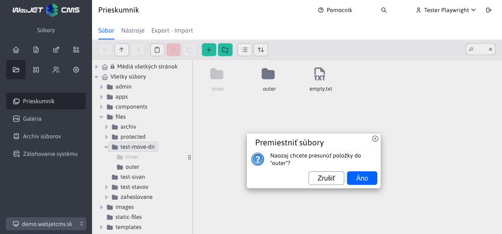
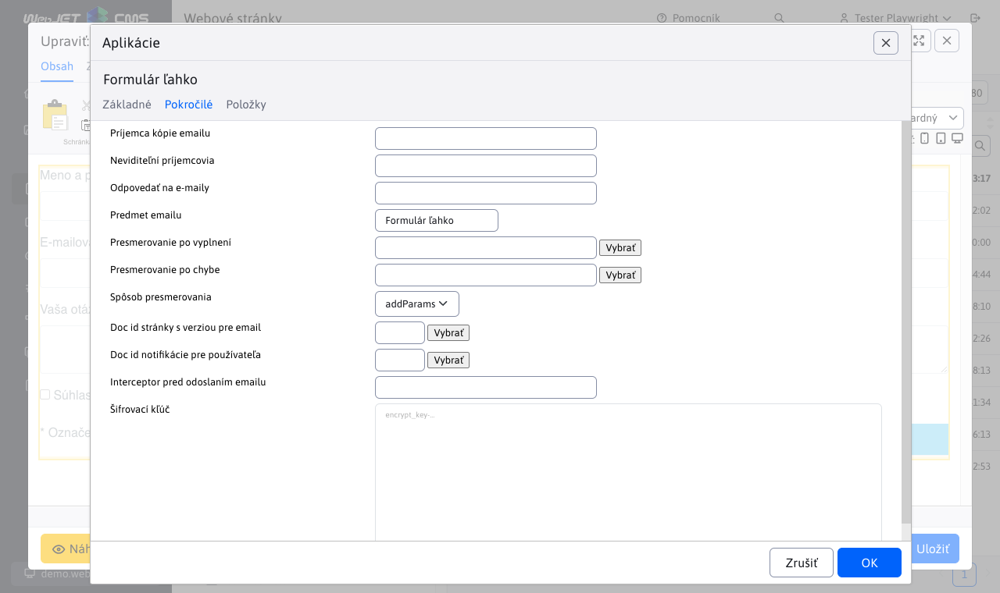

# Zoznam zmien verzia 2024

## 2024.40

> Vo verzii 2024.40 prináša **Prieskumník** nové funkcie a vylepšenia. Pri presune súborov pomocou **drag&drop sa teraz zobrazí potvrdenie**, čo zamedzí chybám pri správe súborov. V editore obrázkov bola pridaná možnosť nastavenia **veľkosti a orezania podľa šablón**, čo uľahčuje úpravu obrázkov priamo v rozhraní.
>
> Ďalším vylepšením je prepracovanie nastavení viacerých **aplikácií do nového, prehľadnejšieho dizajnu**. Autor stránky teraz dostáva **notifikácie pri časovom publikovaní stránky**, ako aj pri pridaní **príspevku do diskusného fóra**, čo zlepšuje kontrolu nad obsahom. Nová aplikácia pre rezervácie podľa času umožňuje jednoduché a prehľadné **rezervovanie objektov, ako sú tenisové kurty alebo zasadačky**. Táto aplikácia tiež ponúka štatistiky podľa používateľov a objektov, čo uľahčuje správu rezervácií.
>
> Vylepšili sme aj fungovanie nástroja PageBuilder a opravili chyby v publikovaní v Archíve súborov, čím sme zabezpečili lepšiu stabilitu a výkon pri práci s obsahom.


### Prelomové zmeny

- AB Testovanie - zamedzené volanie URL adries B verzie (obsahujúcich výraz `abtestvariant`) ak nie je prihlásený administrátor. Povoliť priame volanie takýchto URL je možné nastavením konf. premennej `ABTestingAllowVariantUrl` na hodnotu `true` (#56677).
- Databázové pripojenie - zmenená knižnica pre manažment databázových spojení z `Apache DBCP` na [HikariCP](https://github.com/brettwooldridge/HikariCP) (#56821).
- Inicializácia - upravená inicializácia WebJETu použitím `Spring.onStartup` namiesto `InitServlet`. Zabezpečené je správne poradie načítania konfiguračných premenných a ich použitia v `SpringBean` objektoch (#56913).
- Kódovanie znakov - vzhľadom na zmenu v inicializácii je kódovanie znakov čítane z konf. premennej `defaultEncoding` s predvolenou hodnotou `utf-8`. Ak historicky používate kódovanie `windows-1250` je potrebné hodnotu v konfigurácii upraviť. Už sa nepoužíva hodnota vo `web.xml` pre `SetCharacterEncodingFilter` ale hodnota v konfigurácii WebJETu. Filter môžete z `web.xml` zmazať. Zrušená podpora nastavenia chybovej správy pri nefunkčnom databázovom spojení nastavením parametra `dbErrorMessageText`, potrebné je vytvoriť súbor `/wjerrorpages/dberror.html` ak chcete zobraziť špecifickú HTML stránku pri chybe databázového spojenia (#56913, #56393-12).
- Optimalizované získanie presmerovania v `404.jsp`, vo vašich gradle projektoch odporúčame aktualizovať súbor `404.jsp` podľa [basecms](https://github.com/webjetcms/basecms/blob/master/src/main/webapp/404.jsp) projektu (#53469).
- Archív súborov - upravená predvolená hodnota konf. premennej `fileArchivIndexOnlyMainFiles` na hodnotu `true`. Do vyhľadávania/plno textového indexu sa zapisujú teda len hlavné súbory a nie archívne verzie. Dôvod je, že nechceme používateľov z vyhľadávania štandardne smerovať na staršie (archívne) verzie súborov (#57037).
- Archív súborov - opravené usporiadanie súborov v archíve podľa času, pridaná možnosť usporiadania podľa priority (tak sa usporadúvalo pri pôvodnej voľbe podľa času) (#57037).
- Zaheslovaná zóna - upravené prihlasovanie a funkcia zabudnutého hesla, ak máte vami upravený súbor `/components/user/logon.jsp` alebo `/components/user/change_password.jsp` overte korektné správanie a prípadne podľa štandardnej verzie upravte (#57185).

### Web stránky

- Klonovanie štruktúry - doplnená možnosť [ponechať URL adresy pri klonovaní](redactor/apps/clone-structure/README.md). Z URL adries sa odstráni prefix podľa zdrojového priečinka a doplní sa prefix podľa cieľového. Ak teda klonujete napr. novú jazykovú mutáciu, pridá sa len napr. `/en/` prefix, ale ostatné URL adresy zostanú bez zmeny (#56673).


- Editor obrázkov - doplnená možnosť nastaviť Bod záujmu na ľubovoľný obrázok (#57037).
- Editor obrázkov - upravené nastavenie veľkosti obrázku pre lepšie použitie funkcie zmeny veľkosti (ak je obrázok menší ako aktuálne okno bude sa zmenšovať) (#56969).
- Audit - upravené zapisovanie auditného záznamu pri uložení web stránky na štandardný data tabuľkový zápis so zoznamom všetkých zmenených vlastností (#57037).
- Porovnanie stránok - opravené zobrazenie "Zobraziť len text stránky" pri porovnaní verzií stránky z histórie (#57037).
- Obrázky - pri zmene obrázku, ktorý má v názve výraz `placeholder` alebo `stock` sa v okne prieskumníka nezobrazí priečinok s týmto obrázkom ale zobrazí sa Média tejto stránky/Obrázky pre jednoduché nahratie nového obrázku namiesto zástupného obrázku (#57037).
- Perex obrázok - upravené otvorenie okna tak, aby zobrazilo Média tejto stránky ako prvé a následne výber všetkých médií (nezobrazí sa zoznam všetkých súborov a odkazov na web stránky) (#57037).
- Page Builder - opravené nastavenie priečinku podľa titulku novej stránky pri vkladaní obrázka (#57037).
- Page Builder - opravené duplikovanie bloku pre `accordion` - korektné nastavenie ID editora aby nedošlo k prepísaniu textu pri uložení (#57037).
- Page Builder - opravené nastavenie [šírky stĺpcov](frontend/page-builder/blocks.md#nastavenie-šírky-stĺpcov) - do úvahy sa berie šírka okna nie šírka elementu (#57037).
- Zoznam promo aplikácii pri vkladaní novej aplikácie sa nastavuje cez konf. premennú `appstorePromo`, je možné tam okrem názvu priečinka zadať priamo aj `itemKey` hodnotu, napr. `cmp_news` pre podporu Spring aplikácií. Predvolená hodnota je `cmp_news,menuGallery,menuBanner,cmp_video` (#57157).
- Export do HTML - vytvorená [dokumentácia](redactor/webpages/export-to-html/README.md), testy, vypnutá kontrola SSL certifikátov pre možnosť použitia `SelfSigned` certifikátov počas vývoja alebo testovania (#57141).
- Publikovanie web stránky - pridané auditovanie úspešného časového publikovania web stránky a pridaná možnosť [poslať notifikáciu autorovi](redactor/webpages/editor.md#publikovanie-web-stránky) web stránky pri úspešnom publikovaní (#57173).


- Značky - pridaná premenná `perexGroupsRenderAsSelect` na určenie od akého [počtu značiek](redactor/webpages/perexgroups.md) sa začnú generovať ako viacnásobné výberové pole, pôvodne bola táto hodnota nastavená v kóde na 30 (#57185).
- Značky - aj pri vysokom počte definovaných značiek sa v tabuľke bude vždy filtrovanie zobrazovať ako textové pole (#57185).
- Voliteľné polia - doplnené nastavenie názvov stĺpcov [voliteľných polí](frontend/webpages/customfields/README.md) v zozname web stránok vrátane prefixu textových kľúčov (napr. `temp-3.editor.field_a`) podľa šablóny priečinka (#57185).

### Aplikácie

Prerobené nastavenie vlastností aplikácií v editore zo starého kódu v `JSP` na `Spring` aplikácie. Aplikácie automaticky získavajú aj možnosť nastaviť [zobrazenie na zariadeniach](custom-apps/appstore/README.md#podmienené-zobrazenie-aplikácie). Dizajn je v zhode so zvyškom WebJET CMS a dátových tabuliek.

- [Cookie lišta](redactor/apps/app-cookiebar/README.md)
- [Content Block](redactor/apps/content-block/README.md)
- [Disqus komentáre](redactor/apps/app-disqus/README.md)
- [Facebook Like tlačidlo](redactor/apps/app-facebook_like/README.md)
- [Facebook Like Box](redactor/apps/app-facebook_like_box/README.md)
- [GDPR Cookies súhlas](redactor/apps/gdpr/README.md)
- [Google vyhľadávanie](redactor/apps/app-vyhladavanie/README.md)
- [Live chat (SmartsUpp)](redactor/apps/app-smartsupp/README.md)
- [Menu navigačné](redactor/apps/menu/README.md)
- [Počasie](redactor/apps/app-weather/README.md)
- [Poslať stránku emailom](redactor/apps/send_link/README.md)
- [Štatistika - mapa kliknutí](redactor/apps/stat/README.md)
- [Vloženie dokumentu](redactor/apps/app-docsembed/README.md)
- [Vloženie HTML kódu](redactor/apps/app-htmlembed/README.md)
- [Vyhľadávanie](redactor/apps/search/README.md)
- [Zobrazenie súborov](redactor/apps/site-browser/README.md)


### Audit

- Zlepšený zápis zmien v entite, pridaná podpora polí, získanie hodnoty pre dátum (`Date` objekt alebo premenná s `date` v názve), pridaná podpora značiek (výpis názvu namiesto ID) (#57037).
- Prerobená sekcia **Úrovne logovania** na sekcie Audit->[Úrovne logovania](sysadmin/audit/audit-log-levels.md) a Audit->[Log súbory](sysadmin/audit/audit-log-files.md) do nového dizajnu (#56833).


- Upravene práva pre sekciu Audit-Zmenené stránky a Audit-Čaká na publikovanie aby sa správne skrývali v menu - vyžadujú právo na audit aj zoznam web stránok (#57145).
- Upravená zlá rola pre sekciu Audit-Log súbory (#57145).
- Zlepšené auditovanie záznamov úloh na pozadí - doplnený zoznam zmien pri úprave/vytvorení úlohy, doplnené ID úlohy (#56845).
- [Notifikácie](sysadmin/audit/audit-notifications.md) - upravené pole "Len ak obsahuje text" na viac riadkové pole pre možnosť zaslania notifikácie s kontrolou viac riadkového výrazu (#57229).


### AB Testovanie

- Pre vyhľadávacie boty (napr. Google) sa vždy zobrazí A varianta, aby text stránok bol konzistentný. Bot sa deteguje rovnako ako pre štatistiku podľa `User-Agent` hlavičiek nastavených v konf. premennej `statDisableUserAgent` (#56677).
- Do Ninja triedy pridaná [identifikácia zobrazenej varianty](frontend/ninja-starter-kit/ninja-bp/README.md) pomocou `data-ab-variant="${ninja.abVariant}` (#56677).
- Zamedzené volanie URL adries B verzie (obsahujúcich výraz `abtestvariant`) ak nie je prihlásený administrátor. Povoliť priame volanie takýchto URL je možné nastavením konf. premennej `ABTestingAllowVariantUrl` na hodnotu `true` (#56677).

### Archív súborov

- Upravené generovanie názvov súborov pri aktualizácii tak, aby vždy bol zachovaný pôvodný názov súboru a staršie verzie sa ukladali ako `_v1,_v2` atď (#57037).
- Opravené publikovanie súboru nastaveného ako Nahrať súbor neskôr (#57037).
- Opravené vytvorenie plno textového indexu pre vyhľadávanie v súboroch (#57037).
- Upravená predvolená hodnota konf. premennej `fileArchivIndexOnlyMainFiles` na hodnotu `true`. Do vyhľadávania/plno textového indexu sa zapisujú teda len hlavné súbory a nie archívne verzie. Dôvod je, že nechceme používateľov z vyhľadávania štandardne smerovať na staršie (archívne) verzie súborov (#57037).
- Opravené usporiadanie súborov v archíve podľa času, pridaná možnosť usporiadania podľa priority (tak sa usporadúvalo pri pôvodnej voľbe podľa času) (#57037)
- Doplnené zobrazenie poznámky a rozsahu platnosti dátumov aj pre archívne verzie súborov (#57037).


### Číselníky

- Upravená kontrola ID záznamu pri importe dát číselníka - kontroluje sa, či sa dané ID nenachádza v inom type číselníka, ak áno je nastavená hodnota `ID` na `-1` pre import nového záznamu. Chráni sa tak prepísanie dát v inom ako zvolenom číselníku ak náhodou existuje záznam s rovnakým ID (#57149).

### Diskusia

-  Pridaná možnosť [Odoslať notifikáciu autorovi stránky pri pridaní príspevku do diskusie](redactor/apps/forum/README.md#karta---parametre-aplikácie) pri vkladaní aplikácie Diskusia do stránky. Nastavením konf. premennej `forumAlwaysNotifyPageAuthor` na hodnotu `true` môžete notifikáciu zapnúť automaticky pre všetky diskusie/fóra (#57013).


### Formuláre

- Po odoslaní formuláru cez AJAX publikovaná udalosť `WJ.formSubmit`, na ktorú je možné počúvať pri napojení na `DataLayer`, napr. ako:

```javascript
    window.addEventListener("WJ.formSubmit", function(e) { console.log("DataLayer, submitEvent: ", e); dataLayer.push({"formSubmit": e.detail.formDiv, "formSuccess": e.detail.success}); });
```

- Pre formuláre, ktoré [vyžadujú potvrdiť platnosť email adresy](redactor/apps/form/README.md#nastavenie-potvrdenia-emailovej-adresy) kliknutím na odkaz v emaile, upravené hlásenie o úspešnosti odoslania na text "Formulár bol odoslaný, na váš email sme odoslali správu, v ktorej je potrebné potvrdiť odoslanie kliknutím na odkaz." aby návštevník dostal informáciu o nutnosti potvrdenia odoslania v email správe (#57125).
- Formuláre, ktoré vyžadujú potvrdiť platnosť email adresy kliknutím na odkaz v emaile a zatiaľ nie sú potvrdené sa v zozname formulárov zobrazujú červenou farbou (#57125).


### Galéria

- Upravené zobrazenie obrázkov v administrácii tak, aby sa nebral do úvahy nastavený bod záujmu, ale v zozname obrázkov bol zobrazený celý obrázok (#56969).
- Doplnená možnosť nastaviť [šablóny pre zmenu veľkosti obrázka a orezanie](redactor/image-editor/README.md) (#57201).
- Opravené vkladanie textu v samostatnom editore obrázkov a preklad chýbajúceho textu (#57201).
- Presunutá nástrojová lišta v editore obrázkov vľavo, aby sa lepšie využila plocha monitora (#57201).


- Zväčšená veľkosť poľa autor z 255 znakov na textové pole s rozsahom 64000 znakov (#57185).
- Upravené formátovanie HTML kódu v poliach Perex - vypnuté zalamovanie riadkov/formátovanie kódu aby nedochádzalo k doplneniu medzier (#57185).
- Doplnené čistenie HTML kódu od formátovania pri vložení textu cez schránku (#57185).

### Novinky

- Doplnená kontrola práv na priečinky - výberové pole priečinka pre zobrazenie noviniek je filtrované podľa práv na priečinky web stránok (#56661).

### Používatelia

- Pridaná možnosť nastaviť [skupine používateľov](admin/users/user-groups.md) zľavu z ceny v %, ktorá sa použije napr. pri vytvorení rezervácie ale v budúcnosti bude použitá aj v iných aplikáciách (#57049).
- Upravená logika pri zmene [zabudnutého hesla](redactor/admin/password-recovery/README.md). Ak zadaný email patrí viacerým používateľom, pri zmene hesla je možné pomocou výberového poľa určiť, ktorému používateľovi s daným emailom bude heslo zmenené (#57185).


### Prieskumník

- Nová verzia knižnice [elfinder](https://github.com/webjetcms/libs-elFinder/tree/feature/webjetcms-integration) pre [správu súborov](redactor/files/fbrowser/README.md). Upravený dizajn podľa vzhľadu datatabuliek pre krajšiu integráciu.


- Predvolené kódovanie súborov pre editor je nastavené podľa konf. premennej `defaultEncoding`. Pre JSP súbory je kódovanie `utf-8/windows-1250` detegované podľa atribútu `pageEncoding`, ak súbor na začiatku obsahuje výraz `#encoding=` použije sa podľa tejto hodnoty (#55849).
- Po nastavení konf. premennej `iwfs_useVersioning` na `true` sa začne zapisovať história zmien v súboroch (každý súbor sa po nahratí a pred prepísaním archivuje do priečinka `/WEB-INF/libfilehistory`). Zoznam je dostupný v prieskumníku v kontextovom menu Nastavenie súboru s možnosťou porovnania, zobrazenia historickej verzie a vrátenia zmeny (#57037).
- Opravené premenovanie súborov v priečinkoch `/images,/files` tak, aby sa automaticky odstránila diakritika (#57053).
- Indexovanie súborov - do Perex-Začiatok publikovania doplnený dátum poslednej zmeny súboru (#57177).
- Doplnená možnosť [potvrdenia presunu súboru/priečinka](redactor/files/fbrowser/README.md#konfigurácia). Potvrdzovanie môžete vypnúť nastavením konfiguračnej premennej `elfinderMoveConfirm` na hodnotu `false` (#57297).



### Rezervácie

- Pridaná podpora pre automatické vypočítanie ceny rezervácie pri jej vytváraní (#56841).
- Pridaná nová MVC [Aplikácia Rezervácia času](redactor/apps/reservation/time-book-app/README.md), pre rezerváciu zvolených objektov v hodinových intervaloch (#56841).
- Pridaná podpora pre získanie zľavy na [cenu rezervácie](redactor/apps/reservation/reservations/README.md#základné) z ceny rezervácie podľa nastavenej skupiny používateľov (#57049).
- Pridaná sekcia [Štatistika rezervácií](redactor/apps/reservation/reservations-stat/README.md) pre časové aj celodenné rezervácie (#57049).


- Pridaná možnosť nastaviť [skupine používateľov](admin/users/user-groups.md) zľavu z ceny v %, ktorá sa použije pri vytvorení rezervácie (#57049).
- Pridaná [štatistika rezervácií](redactor/apps/reservation/reservations-stat/README.md) kde vidno počty aj ceny rezervácií podľa používateľov (#57049).


### Bezpečnosť

- Upravené dialógy pre heslá, ich zmenu a multi faktorovú autorizáciu pre podporu hesiel dĺžky 64 znakov, doplnené testy zmeny hesla (#56657).
- Upravená logika pre [obnovenie hesla](redactor/admin/password-recovery/README.md), kde použitý email pre obnovenie patril viacerým účtom a pridaná bola možnosť výberu, ktorému používateľovi z nich sa dané heslo zmení (#57185).
- Používatelia - pri duplikovaní používateľa, pokiaľ nie je zadané heslo je novému používateľovi nastavené náhodné heslo (#57185).

### Dokumentácia

- Doplnená dokumentácia k chýbajúcim aplikáciam do sekcie [Pre redaktora](redactor/README.md) (#56649).
- Doplnená dokumentácia k aplikácii [skripty](redactor/apps/insert-script/README.md) (#56965).
- Doplnená anglická verzia dokumentácie (#56773).
- Doplnená dokumentácia k [editoru obrázkov](redactor/image-editor/README.md) (#56969).
- Doplnená dokumentácia pre generovanie [náhľadových obrázkov](frontend/thumb-servlet/README.md) a nastavenie [bodu záujmu](frontend/thumb-servlet/interest-point.md) (#56969).
- Vytvorená dokumentácia pre [prácu v editore stránok](redactor/webpages/working-in-editor/README.md) (#56981).
- Doplnená dokumentácia k [archívu súborov](redactor/apps/file_archiv/README.md) (#56891).
- Doplnená dokumentácia k [pred pripraveným blokom](redactor/apps/htmlbox/README.md) (#56981).
- Pridaná [česká verzia](https://docs.webjetcms.sk/latest/cs/) dokumentácie (#57033).
- Upravené generovanie odkazov na zdrojový kód tak, aby smerovali na [GitHub verziu](https://github.com/webjetcms/webjetcms/tree/main/src) zdrojového kódu (#57033).
- Vytvorená dokumentácia pre prevádzku - [Mazanie dát](sysadmin/data-deleting/README.md), [Zálohovanie systému](sysadmin/files/backup/README.md) a [Reštartovať](sysadmin/restart.md) (#57141).
- Vytvorená dokumentácia pre správcu - [Automatizované úlohy](admin/settings/cronjob/README.md) (#57141).
- Vytvorená dokumentácia pre redaktora - [Poslať správu](redactor/admin/send-message.md), [Export do HTML](redactor/webpages/export-to-html/README.md), [Presmerovania](redactor/webpages/redirects/README.md) (#57141).
- Vytvorená dokumentácia k použitiu funkcie [zabudnuté heslo](redactor/admin/password-recovery/README.md) (#57185).
- Vytvorená dokumentácia k nastaveniu [Spam ochrany](install/config/spam-protection.md) (#57185).

### Testovanie

- Vytvorený objekt `TempMail` pre jednoduchšiu prácu s email schránkou [tempmail.plus](https://tempmail.plus) pre testovanie odoslaných emailov (#56929).
- Všetky základné testy (používajúce `DataTables.baseTest`) doplnené o testovanie funkcie Duplikovať (#56849).
- V automatických testoch Data Tabuliek pridané znaky s diakritikou pre testovanie ukladania a filtrovania s ohľadom na diakritiku (#56393-12).

### Systémové zmeny

- Inicializácia - pridaná možnosť [inicializovať hodnoty](install/external-configuration.md) pre cluster (napr. `clusterMyNodeName,clusterMyNodeType,useSMTPServer,pkeyGenOffset`) aj nastavením environmentálnych premenných s prefixom `webjet_` alebo systémových s prefixom `webjet.` (#56877).
- Inicializácia - upravená inicializácia WebJETu použitím `Spring.onStartup` namiesto `InitServlet`. Zabezpečené je správne poradie načítania konfiguračných premenných a ich použitia v `SpringBean` objektoch (#56913).
- Kódovanie znakov - vzhľadom na zmenu v inicializácii je kódovanie znakov čítane z konf. premennej `defaultEncoding` s predvolenou hodnotou `utf-8`. Ak historicky používate kódovanie `windows-1250` je potrebné hodnotu v konfigurácii upraviť. Už sa nepoužíva hodnota vo `web.xml` pre `SetCharacterEncodingFilter` ale hodnota v konfigurácii WebJETu. Filter môžete z `web.xml` zmazať. Zrušená podpora nastavenia chybovej správy pri nefunkčnom databázovom spojení nastavením parametra `dbErrorMessageText`, potrebné je vytvoriť súbor `/wjerrorpages/dberror.html` ak chcete zobraziť špecifickú HTML stránku pri chybe databázového spojenia (#56913, #56393-12).
- Upravené získanie presmerovania z novej URL adresy (String) na priame získanie databázovej entity. Priamo sa tak získa aj presmerovací kód (301,302...) bez potreby dodatočného databázového volania. Zvýši sa tak výkon vykonania stránky 404 (#53469).
- PostgreSQL - opravené ukladanie histórie zmien v priečinku a mazanie schvaľovania pri zmazaní priečinku (#57061).
- Doplnená informácia o blížiacom sa konci platnosti licencie, zobrazí sa 2 mesiace pred jej exspiráciou na úvodnej obrazovke (#57169).


- Upravené volanie metód `before*/after*` v `DatatableRestControllerV2` tak, aby boli volané pre všetky `REST` služby a zároveň boli volané aj pri preťažení `insertItem,editItem,deleteItem` (#57186).
- Pre verejné uzly clustra, ktoré nemajú [povolený počas monitorovania](sysadmin/monitoring/README.md) zápis do tabuľky `_conf_/webjet_conf` je možné nastaviť konf. premennú `monitoringEnableCountUsersOnAllNodes` na hodnotu `false`. To vypne zapisovanie počtu `sessions` na jednotlivých uzloch do konfigurácie (#43144-3).
- Spam ochrana - pri zmazaní všetkých cache objektov v sekcii [Mazanie dát](sysadmin/data-deleting/README.md) je zmazaný aj obsah Spam ochrany. V prípade potreby tak ľahko viete resetovať spam ochranu (#57185).

### Pre programátora

- Datatabuľky - pridaná možnosť nastaviť tlačidlá v okne editora (štandardne obsahuje tlačidlo Vytvoriť) aj pre [vytvorenie nového záznamu](developer/datatables-editor/README.md#špeciálne-tlačidlá) nastavením `createButtons` (#55849).
- Dialógové okno - pridaná funkcia `WJ.openIframeModalDatatable` pre otvorenie [modálneho okna](developer/frameworks/webjetjs.md#iframe-dialóg) obsahujúceho editor datatabuľky (editácia záznamu). Automaticky nastaví možnosti pre uloženie a zatvorenie okna po uložení záznamu datatabuľky (#55849).
- Zrušená podpora knižníc `Apache Commons DBCP, Commons Pool a Oracle UCP`. Databázové pripojenia sú manažované pomocou [HikariCP](https://github.com/brettwooldridge/HikariCP). Zrušené API `ConfigurableDataSource.printStackTraces` (#56821).
- Databázové pripojenie - doplnené auditovanie nezatvorených databázových spojení (spojení, ktoré sú otvorené dlhšie ako 5 minút). Do auditu sa zaznamenajú ako typ `SQLERROR` s textom `Connection leak detection triggered` a výpisom zásobníka pre dohľadanie miesta, kde sa spojenie nezatvára (#56821).
- Zrušená podpora knižníc `Apache Commons DBCP, Commons Pool, Oracle UCP`. Databázové pripojenia sú manažované pomocou [HikariCP](https://github.com/brettwooldridge/HikariCP). Zrušené API `ConfigurableDataSource.printStackTraces` (#56821).
- Databázové pripojenie - doplnené auditovanie nezatvorených databázových spojení (spojení, ktoré sú otvorené dlhšie ako 5 minút). Do auditu sa zaznamenajú ako typ `SQLERROR` s textom `Connection leak detection triggered` a výpisom zásobníka pre dohľadanie miesta, kde sa spojenie nezatvára (#56821).
- Anotácia [@WebjetAppStore](custom-apps/appstore/README.md) umožňuje nastaviť atribút `custom` pre určenie zákazníckej aplikácie, ktorá je v zozname na začiatku pred štandardnými aplikáciami (#56841).
- Inicializácia - upravená inicializácia WebJETu použitím `Spring.onStartup` namiesto `InitServlet`. Zabezpečené je správne poradie načítania konfiguračných premenných a ich použitia v `SpringBean` objektoch (#56913).
- `SpringSecurity` - anotácia `@EnableGlobalMethodSecurity(securedEnabled = true, prePostEnabled=true)` nahradená `@EnableMethodSecurity(securedEnabled = true, prePostEnabled=true)` (#56913)
- Do `RequestBean` pridaná metóda `addAuditValue(String key, String value)` ktorá umožňuje pred zápisom do Auditu pridať dodatočné parametre, ktoré sa zaznamenajú v audite, napr. `RequestBean.addAuditValue("historyId", String.valueOf(historyId));` (#57037).
- Do Datatabuľky pridaný [typ poľa](developer/datatables-editor/standard-fields.md#boolean_text) `DataTableColumnType.BOOLEAN_TEXT` ktorý zobrazí titulok napravo namiesto naľavo a možnosti Áno pri zaškrtávacom poli (#57157).
- Do Datatabuľky pridaný [typ poľa](developer/datatables-editor/standard-fields.md#color) `DataTableColumnType.COLOR` pre výber farby v `HEX` formáte napr. `#FF0000` (#57157).
- Do Datatabuľky pridaný [typ poľa](developer/datatables-editor/standard-fields.md#iframe) `DataTableColumnType.IFRAME` pre vloženie inej stránky cez `iframe` element (#57157).
- Do Datatabuľky pridaný [typ poľa](developer/datatables-editor/standard-fields.md#base64) `DataTableColumnType.BASE64` pre kódovanie a dekódovanie hodnoty cez `base64` algoritmus (#57161).
- Do Datatabuľky pridaný [typ poľa](developer/datatables-editor/standard-fields.md#static_text) `DataTableColumnType.STATIC_TEXT` pre zobrazenie statického textu v pravej časti okna editora (#57161).
- Datatabuľky - pre [typ poľa](developer/datatables-editor/standard-fields.md#json) `JSON dt-tree-dir-simple` pridaná možnosť nastavenia koreňového priečinku cez `@DataTableColumnEditorAttr(key = "data-dt-field-root", value = "/images/gallery")`. Pole nemá nastavený atribút `disabled`, hodnotu je možné teda zadať aj priamo (#57157).
- Datatabuľky - pridaná možnosť nastavenia `editorLocking` pre vypnutie kontroly editácie záznamu viacerými používateľmi (#57161).
- Pre Spring aplikácie v editore pridaná možnosť [inicializácie dát](custom-apps/appstore/README.md#inicializácia-dát) implementáciou metódy `initAppEditor` a možnosť [nastavenia výberových polí](custom-apps/appstore/README.md#nastavenie-výberových-polí) implementáciou metódy `getAppOptions` (#57157).
- Amcharts - pridaná podpora pre nový typ grafu [DoublePie](developer/frameworks/charts/frontend/statjs.md#graf-typu-double_pie) pre účely štatistík (#57049).
- `Base64` - pridané funkcie `WJ.base64encode(text),WJ.base64decode(encodedText)` pre kódovanie a dekódovanie textu algoritmom `base64` s podporou `utf-8` znakov (#57161).
- Doplnené metódy `Adminlog.getChangelog(Long id, Object newObj, Object originalObj),Adminlog.getChangelogDelete(Long id, Object obj)` pre získanie zoznamu zmien pri vytvorení/úprave/zmazaní jednoduchého Java objektu (nie JPA entity) (#56845).


## 2024.18

> Verzia 2024.18 obsahuje **novú sadu ikon**, Formulár ľahko doplnený o **pokročilé nastavenia** (príjemcovia, presmerovania...), do nového dizajnu sú prerobené aplikácie AB Testovanie, Audit (čaká na publikovanie, zmenené stránky), Blog, Dotazníky, Kalendár udalostí (schvaľovanie). Pridáva **podporu inštalácie typu MultiWeb** (oddelenie údajov domén) v Šablónach, Hromadnom e-maile a ďalších aplikáciách. Nová knižnica na **detekciu prehliadačov**, v Štatistika-Prehliadače dôjde k drobným rozdielom, ale údaje o prehliadači anonymizovane zaznamenávame aj bez Cookies súhlasu.

!>**Upozornenie:** na spustenie verzie 2024 je potrebné mať na serveri inštalovanú Java verzie 17.

### Prelomové zmeny

Táto verzia prináša viaceré zmeny, ktoré nemusia byť spätne kompatibilné:

- Hromadný email - upravená podpora odosielania emailov cez službu Amazon SES z použitia špeciálneho API na [štandardný SMTP protokol](install/config/README.md#nastavenie-amazon-ses).
- [Odstránené knižnice](install/README.md#zmeny-pri-prechode-na-20240-snapshot) `bsf,c3p0,cryptix,datetime,jericho-html,jsass,opencloud,spring-messaging,uadetector,joda-time,aws-java-sdk-core,aws-java-sdk-ses,jackson-dataformat-cbor,jmespath-java` (#56265).
- Odstránená značka `iwcm:forEach`, je potrebné ju nahradiť za `c:forEach`. Rozdiel je v tom, že Java objekt nie je priamo dostupný, je potrebné ho získať pomocou `pageContext.getAttribute("name")`. Použite volanie `/admin/update/update-2023-18.jsp` pre aktualizáciu vašich JSP súborov (#56265).
- Hromadný email - oddelené kampane, príjemcovia a odhlásené emaily podľa domén, staršie záznamy sú do domén zaradené podľa URL adresy web stránky pre odoslanie. Výhoda v oddelení odhlásených emailov je v prípade prevádzkovania viacerých web sídiel a rozdielnych zoznamov príjemcov, kedy sa odhlasuje oddelene pre jednotlivé domény. **Upozornenie:** aktuálne odhlásené emaily sa nastavia pre doménu s ID 1, ak používate primárne hromadný email na inej ako prvej doméne aktualizujte stĺpec `domain_id` v databázovej tabuľke `emails_unsubscribe` (#56425).
- Hromadný email - zmazané nepoužívané metódy z Java triedy `sk.iway.iwcm.dmail.EmailDB`, ak ich vo vašom projekte používate presuňte si ich z [pôvodného zdrojového kódu](https://github.com/webjetcms/webjetcms/blob/ef495c96da14e09617b4dc642b173dd029856092/src/webjet8/java/sk/iway/iwcm/dmail/EmailDB.java) do vašej vlastnej triedy (#56425).
- Ikony - z dôvodu prechodu na Open Source riešenia sme zmenili sadu ikon z pôvodnej FontAwesome na novú sadu [Tabler Icons](https://tabler.io/icons). Ak vo vašich vlastných aplikáciach používate ikony zo sady FontAwesome je potrebné upraviť kód a nahradiť ich ikonami zo sady `Tabler Icons`. Môžete použiť skript ```/admin/update/update-2023-18.jsp``` pre úpravu najčastejšie používaných ikon v administrácií (upraví iba súbory, ktoré vyžadujú prihlásenie).

### Prechod na Java 17

WebJET CMS verzie 2024 prešiel na Java verzie 17. Obsahuje nasledovné zmeny:

- Aktualizované viaceré knižnice, napr. `AspectJ 1.9.19, lombok 1.18.28`.
- Aktualizovaná knižnica Eclipselink na štandardnú verziu, použitie WebJET CMS `PkeyGenerator` nastavené pomocou triedy `JpaSessionCustomizer` a `WJGenSequence`.
- Aktualizovaný `gradle` na verziu 8.1.
- Odstránená stará knižnica ```ch.lambdaj```, použite štandardné Java Lambda výrazy (#54425).
- Odstránená značka `<iwcm:forEach`, použitie nahradené štandardným `<c:forEach` (#56265).
- Pre zjednodušenie aktualizácie môžete použiť skript ```/admin/update/update-2023-18.jsp``` pre kontrolu a opravu JSP súborov. Zákaznícke Java triedy je potrebné nanovo skompilovať a opraviť chyby z dôvodu zmeny API.

### Nová sada ikon

Z dôvodu prechodu na Open Source riešenia sme zmenili sadu ikon z pôvodnej FontAwesome na novú sadu [Tabler Icons](https://tabler.io/icons). Niektoré ikony boli upravené, aby lepšie vystihovali funkciu tlačidla.


Pri datatabuľkách sú ikony pre nastavenie tabuľky, znova načítanie údajov, import a export presunuté napravo, aby lepšie oddelili štandardné funkcie od nastavení a pokročilých operácií. Na obrázkoch vidno porovnanie novej (hore) a starej verzie (dole).


### Vylepšenia používateľského rozhrania

- Menu - menu položky/ikony sekcie (Prehľad, Web stránky, Príspevky...) sa zobrazia len ak má používateľ prístup k niektorej položke v danej sekcii (#56169).
- Novinky - upravené pridanie novinky - prepnutie na kartu Základné pre jednoduchšie nastavenie titulku novinky a nastavenie zaradenia v stromovej štruktúre podľa zvolenej sekcie v hlavičke stránky (#56169).
- Úvod - sekcie Prihlásení admini, Moje posledné stránky, Zmenené stránky a Audit sa zobrazujú len ak má používateľ potrebné práva (#56169).
- Úvod - doplnená informácia o priečinku v zozname posledných stránok, doplnená možnosť otvoriť auditný záznam (#56397).
- Web stránky - zlepšená editácia na mobilných zariadeniach - nástrojová lišta editora je posúvateľná, dostupné sú všetky ikony (#56249-5).
- Datatabuľky - zlepšené usporiadanie nástrojovej lišty editora pri malých rozlíšeniach - ikony sa korektne posunú na druhý riadok, možnosť zadať ID zostáva vpravo hore (#56249-5)
- Datatabuľky - ikona pre označenie/odznačenie všetkých záznamov mení stav podľa toho, či sú označené riadky, alebo nie (#56397).
- Datatabuľky - zmenšené medzery medzi stĺpcami, znížená výška názvu stránky, nástrojovej lišty a pätičky pre zobrazenie viacerých sltĺcov na obrazovke/zhustenie informácií. Na rovnakej obrazovke by sa mal v tabuľke zobraziť minimálne jeden riadok naviac. (#56397).

### Web stránky

- Štandardná [synchronizácia titulku](redactor/webpages/group.md#synchronizácia-názvu-priečinka-a-web-stránky) priečinka a hlavnej web stránky sa nepoužije, ak je jedna web stránka nastavená ako hlavná viacerým priečinkom, alebo keď je hlavná stránka z iného priečinku (#56477).

### MultiWeb

Pridaná podpora [prevádzky v režime MultiWeb](install/multiweb/README.md) - multi tenantná správa viacerých samostatných domén v jednom WebJETe. Domény sú navonok samostatné a každá sa tvári ako samostatná inštalácia WebJET CMS.

- Zoznam používateľov - oddelený podľa ID domény (#56421).
- Úvod - prihlásený admini - oddelený podľa domén (#56421).
- Práva na Doménové limity, HTTP hlavičky, Úrovne logovania, Posledné logy, Skupiny používateľov, Skupiny práv sú dostupné len v prvej/správcovskej doméne (#56421).
- Web stránky - pridaná možnosť vytvoriť viac koreňových priečinkov (#56421).
- Štatistika - Chybné stránky - pridaný stĺpec `domain_id` do databázy pre oddelenie chybných URL adries podľa domén (#56421).
- Média - skupiny médií - zoznam rozdelený podľa aktuálne zobrazeniej domény a práv stromovej štruktúry web stránok (#56421).

### AB testovanie

- Zoznam stránok v AB teste prerobený do [nového dizajnu](redactor/apps/abtesting/abtesting.md), pridaná sekcia pre nastavenie konfigurácie AB testovania (#56177).


### Audit

- Doplnená podpora filtrovania používateľa aj podľa zadanej email adresy.
- Prerobená sekcia Audit->[Čaká na publikovanie](sysadmin/audit/audit-awaiting-publish-webpages.md) do nového dizajnu. Prehľadne zobrazuje zoznam stránok, ktoré budú v zmenené v budúcnosti (#56165).
- Prerobená sekcia Audit->[Zmenené stránky](sysadmin/audit/audit-changed-webpages.md) do nového dizajnu. Zobrazuje kompletný zoznam zmenených stránok za zvolené obdobie (#56165).


### Blog

- Blog prerobený do novej administrácie. Sekcia zoznam článkov používa štandardné možnosti ako sú použité v zozname web stránok/noviniek (#56169, #56173).
- Pôvodný zoznam diskusných príspevkov je presunutý priamo do sekcie Diskusia, používatelia/blogeri získavajú právo aj na túto časť (#56169).
- Na zobrazenie zoznamu článkov je používaná štandardná aplikácia pre novinky.
- Správa blogerov (administrácia používateľov) prerobená na datatabuľku, umožňuje zjednodušene vytvoriť blogera a korektne mu nastaviť práva.


### Dotazníky

Aplikácia [dotazníky](redactor/apps/quiz/README.md) prerobená do nového dizajnu. Umožňuje vytvoriť dotazníky s vyhodnotením správnej odpovede. Dotazník môže byť s jednou správnou odpoveďou, alebo s bodovanými odpoveďami. Aplikácia obsahuje aj štatistické vyhodnotenie (#55949).


### Formulár ľahko

- Pridaná karta rozšírené s pokročilými možnosťami nastavenia spracovania formuláru podobne ako majú štandardné HTML formuláre. Pridané možnosti nastavenia príjemcov, presmerovaní, ID stránky s verziou do emailu atď. Upravený zoznam položiek formuláru pre lepšie využitie priestoru (#56481).



- Pridaný typ poľa Formátované textové pole pre zadávanie textov s formátovaním ako je tučné písmo, odrážky, číslovaný zoznam a podobne (#56481).


### GDPR Cookies

- Integrácia s [Google Tag Manager](redactor/apps/gdpr/gtm.md) doplnená o nové typy súhlasov `ad_user_data` a `ad_personalization`, ktoré sú napojené na súhlas s marketingovými cookies. Upravené generovanie JSON objektu z hodnôt `true/false` na správne hodnoty `granted/denied` (#56629).

### Hromadný e-mail

- Upravená podpora odosielania emailov cez službu Amazon SES z použitia špeciálneho API na [štandardný SMTP protokol](install/config/README.md#nastavenie-amazon-ses) (#56265).
- Nastavenie doménových limitov pridané ako samostatné právo, predvolene je nepovolené, je potrebné ho pridať vhodným používateľom (#56421).
- Oddelené kampane, príjemcovia a odhlásené emaily podľa domén, staršie záznamy sú do domén zaradené podľa URL adresy web stránky pre odoslanie. Výhoda v oddelení odhlásených emailov je v prípade prevádzkovania viacerých web sídiel a rozdielnych zoznamov príjemcov, kedy sa odhlasuje oddelene pre jednotlivé domény. **Upozornenie:** aktuálne odhlásené emaily sa nastavia pre doménu s ID 1, ak používate primárne hromadný email na inej ako prvej doméne aktualizujte stĺpec `domain_id` v databázovej tabuľke `emails_unsubscribe` (#56425).
- Pridaná možnosť priameho [odhlásenia sa z hromadného emailu](redactor/apps/dmail/form/README.md#odhlásenie) kliknutím na odkaz zobrazený v emailovom klientovi/Gmail nastavením hlavičky emailu `List-Unsubscribe` a `List-Unsubscribe=One-Click` (#56409).

### Kalendár udalostí

- Neschválené a odporúčané udalosti - proces [schvaľovania nových udalostí](redactor/apps/calendar/non-approved-events/README.md) a [odporúčaných udalostí](redactor/apps/calendar/suggest-events/README.md) prerobené do nového dizajnu (#56181).

### Novinky

- Pridaná možnosť Vylúčiť hlavné stránky priečinkov v [zozname noviniek](redactor/apps/news/README.md#nastavenie-aplikácie-vo-web-stránke) pre vylúčenie hlavných stránok z pod priečinkov v zozname noviniek. Predpokladá sa, že podadresáre obsahujú hlavnú stránku so zoznamom noviniek v tomto priečinku, takéto stránky sa vylúčia a nepoužijú sa v zozname noviniek (#56169).

### Otázky a odpovede

- Pridané samostatné ukladanie odpovede do emailu aj do databázy pre neskoršie overenie odpovede (#56533).
- Opravené zobrazenie stĺpca Otázka už bola zodpovedaná (#56533).
- Pri zvolení možnosti Zobrazovať na web stránke sa skopíruje odpoveď do emailu do odpovede na web stránku (ak je už zadaná) (#56533).

### Šablóny

- Oddelený zoznam šablón podľa domén - zobrazujú sa len šablóny, ktoré nemajú obmedzenia zobrazenia podľa priečinkov alebo obsahujú obmedzenie na priečinok aktuálne zobrazenej domény (#56509).

### Štatistika

- Upravené získanie čísla týždňa podľa ISO 8601, hodnoty v štatistikách podľa týždňa môžu byť rozdielne voči predchádzajúcej verzii (#56305).
- Chybné stránky - pridaný stĺpec `domain_id` do databázy pre oddelenie chybných URL adries podľa domén. Historické údaje nie sú oddelené (zobrazia sa vo všetkých doménach), ale od momentu aktualizácie sa budú zobrazovať už chybné URL oddelené podľa domén (#56421).
- Upravená [detekcia prehliadača](redactor/apps/stat/README.md#prehliadače) s využitím knižnice [UAP-java](https://github.com/ua-parser/uap-java). Niektoré údaje sú detegované inak ako pôvodne - rozlišuje sa Safari a Mobile Safari na iOS, operačný systém pre Android telefóny je namiesto Unix nastavený na Android, pre niektoré prípady je detegovaný Linux namiesto Unix, macOS ako Mac OS X. Pridaná podpora detekcie Instagram a Facebook interného prehliadača. Po aktualizácii na túto verziu môžu teda nastať rozdiely pri zobrazení obdobia pred a po aktualizácii. Je možné aktualizovať súbor s definíciou prehliadačov nastavením cesty k [YAML](https://github.com/ua-parser/uap-core/blob/master/regexes.yaml) súboru v konf. premennej `uaParserYamlPath` (#56221).
- Typ prehliadača a operačný systém je zapísaný do štatistiky aj bez súhlasu s ukladaním cookies, keďže tento údaj cookies nepoužíva. Údaj je anonymizovaný a zapísaný so zaokrúhleným časom na 15 minút (#56221).

### Bezpečnosť

- 404 - pridaná možnosť vypnúť ochranu volania 404 stránky (počet požiadaviek) podobne ako iné spam ochrany nastavením IP adresy do konf. premennej `spamProtectionDisabledIPs`. Pre danú IP adresu sa vypnú aj ďalšie SPAM ochrany (pre  opakované volania).
- Pridaná kontrola licencií použitých knižníc pri `deployment` novej verzie (#56265).
- Aktualizované viaceré knižnice na novšie verzie, majoritné verzie zmenené pre `mariadb-java-client` z 2 na 3, `pdfbox` z 2 na 3 (#56265).

### Testovanie

- Pridali/upravili sme automatizované testovanie front-end časti (nie admin časti) aplikácií Mapa, Carousel, Archív súborov, Content Block, Dátum, Google Vyhľadávanie, Odkazy na sociálne siete, Odporúčania, Poslať stránku emailom, Počasie, Príbuzné stránky, Pôsobivá prezentácia, Slider, Slit Slider, Video, Carousel Slider, Vloženie HTML kódu, Vloženie dokumentu, Vyhľadávanie, Podmienené zobrazenia, Bloky (#56413).
- Pridaná podpor pre automatické otestovanie/kontrolu medzi-doménového oddelenia záznamov do [DataTables.baseTest](developer/testing/datatable.md#možnosti-nastavenia) (#56509).

### Pre programátora

- Hromadný email - zmazané nepoužívané metódy z Java triedy `sk.iway.iwcm.dmail.EmailDB`, ak ich vo vašom projekte používate presuňte si ich z [pôvodného zdrojového kódu](https://github.com/webjetcms/webjetcms/blob/ef495c96da14e09617b4dc642b173dd029856092/src/webjet8/java/sk/iway/iwcm/dmail/EmailDB.java) do vašej vlastnej triedy (#56425).
- `MailHelper` - pridaná možnosť nastaviť hlavičky emailu volaním `addHeader(String name, String value)`, API SendMail upravené na použitie `MailHelper`, ktorý odporúčame primárne používať na odosielanie emailov (#56409).
- Pridaná možnosť zobraziť vo vašej aplikácií zoznam konf. premenných podľa [zadaného prefixu](./custom-apps/config/README.md) (#56177).
- Pridaná možnosť kontrolovať práva pri vytvorení, editácii, mazaní, vykonaní akcie ale aj pri získaní záznamu implementáciou metódy `public boolean checkItemPerms(T entity, Long id)` (#56421).
- Pridaná trieda `DatatableRestControllerAvailableGroups` pre jednoduchú implementáciu kontroly práv používateľa aj na základe práv na stromovú štruktúru web stránok (#56421).

### Systémové zmeny

- WebJET CMS je dostupný priamo v [repozitári maven central](https://repo1.maven.org/maven2/com/webjetcms/webjetcms/), GitHub projekty [basecms](https://github.com/webjetcms/basecms) a [democms](https://github.com/webjetcms/democms) upravené na použitie priamo tohto repozitára. Zostavenie je mierne odlišné od pôvodného zostavenia, knižnice `wj*.jar` sú spojené do `webjet-VERZIA-libs.jar`. Použitá knižnica [pd4ml](https://pd4ml.com/support-topics/maven/) je vo verzii 4, pre generovanie PDF súborov vyžaduje zadanie licencie do súboru `pd4ml.lic` v [pracovnom priečinku](https://pd4ml.com/support-topics/pd4ml-v4-programmers-manual/) servera alebo priečinku kde sa nachádza `pd4ml.jar`. Neskôr bude doplnená možnosť zadať licenčné číslo cez konfiguračnú premennú (#43144).
- Zrušená podpora plno textového indexovania `rar` archívov (#43144).
- NTLM - pridaná konf. premenná `ntlmLogonAction.charsetEncoding` s názvom kódovania znakov pre LDAP prihlásenie. Ak je prázdne, nepoužije sa a znaky sa ponechajú v kódovaní ako ich vráti LDAP server.
- PostgreSQL - pridaná podpora [databázy PostgreSQL](install/setup/README.md#vytvorenie-db-schémy) (#56305).

Odstránili sme viaceré nepoužívané knižnice, málo používané sme nahradili alternatívami:

- Odstránená značka `<iwcm:forEach`, použitie nahradené štandardným `<c:forEach`. Zmenu vykonajte z `<iwcm:forEach items="${iii}" var="vvv" type="sk.iway.ttt">` na `<c:forEach items="${iii}" var="vvv"><%sk.iway.ttt vvv = (sk.iway.ttt)pageContext.getAttribute("vvv");%>`.
- Odstránená JSP knižnica `datetime`, ak používate JSP značky `<datetime:xxx>` môžete si ju pridať do `build.gradle` ako `implementation("taglibs:datetime:1.0.1")`.
- Odstránená knižnica `c3p0` a podpora použitia tohto databázového `pool`.
- Odstránené staré JS funkcie `saveEditor` a `historyPageClick` vrátane starej REST služby `/admin/rest/document/`.
- Hromadný email - upravená podpora odosielania emailov cez službu Amazon SES z použitia špeciálneho API/knižnice na [štandardný SMTP protokol](install/config/README.md#nastavenie-amazon-ses).

V prípade potreby niektorej z uvedených knižníc vo vašom projekte si ju pridajte do vášho `build.gradle`:

```gradle
dependencies {
    implementation("com.amazonaws:aws-java-sdk-core:1.12.+")
    implementation("com.amazonaws:aws-java-sdk-ses:1.12.+")
    implementation("bsf:bsf:2.4.0")
    implementation("commons-validator:commons-validator:1.3.1")
    implementation("taglibs:datetime:1.0.1")
    implementation("net.htmlparser.jericho:jericho-html:3.1")
    implementation("joda-time:joda-time:2.10.13")
    implementation("io.bit3:jsass:5.1.1")
    implementation("org.jsoup:jsoup:1.15.3")
    implementation("org.mcavallo:opencloud:0.3")
    implementation("org.springframework:spring-messaging:${springVersion}")
    implementation("net.sf.uadetector:uadetector-core:0.9.22")
    implementation("net.sf.uadetector:uadetector-resources:2014.10")
    implementation("cryptix:cryptix:3.2.0")
    implementation("org.springframework:spring-messaging:${springVersion}")
    implementation("com.google.protobuf:protobuf-java:3.21.7")
    implementation("com.google.code.findbugs:jsr305:3.0.2")
    implementation("org.apache.taglibs:taglibs-standard-spec:1.2.5")
    implementation("org.apache.taglibs:taglibs-standard-impl:1.2.5")
    implementation('com.mchange:c3p0:0.9.5.5')
}
```

### Oprava chýb

2024.0.X

- Datatabuľky - opravené zobrazené meno stĺpca pri nastavení zobrazenia stĺpcov ak je upravené ich poradie (#56393-14).
- Export do HTML - opravená kontrola práv, opravené zobrazenie generovaných súborov v priečinku `/html` (#57141).
- Persistent cache objekty - opravené uloženie záznamu - nastavenie správneho typu (#56393-15).
- Úlohy na pozadí - opravený reštart úloh na pozadí po zmazaní úlohy (#56393-14).
- Web stránky - opravené uloženie web stránok, ktorých názov je jedno písmenový `N,B,S,P` (#56393-15).
- Web stránky - Page Builder - zlepšená klávesová skratka `CTRL/CMD+S` pre uloženie stránky bez zatvorenia editora, je aktívna aj mimo zelených častí s editorom.
- Zálohovanie systému - opravená kontrola práv (#57141).
- Značky - upravené zobrazenie priečinkov a ich výber tak, aby bolo možné voliť značku zo všetkých domén (#56393-15).
- `DatatableRestControllerV2` presunuté volanie `afterDelete` mimo metódy `deleteItem` aby pri preťažení tejto metódy bolo `afterDelete` korektne zavolané.
- Formuláre - opravené nastavenie jazyka pri presmerovaní formuláru na stránku, ktorá obsahuje `Spring` aplikáciu (#56393-15).
- Web stránky - Editor - opravené nastavenie jazyka v náhľade vloženej `Spring` aplikácie (#56393-15).
- Audit - Notifikácie - opravené uloženie novej notifikácie pri použití MicroSoft SQL databázy, doplnené zmazanie cache zoznamu notifikácií pri úprave záznamu (#57225).
- Galéria - opravené zobrazenie možnosti pridania priečinku ak má používateľ obmedzené práva na priečinky (#56393-17).
- Galéria - pridaná možnosť nastavenia vodoznaku rekurzívne aj na pod adresáre a pre generovanie obrázkov po zmene vodoznaku (#MR181).
- Galéria - vytvorená dokumentácia pre [nastavenie vodoznaku](redactor/apps/gallery/watermark.md) v galérii (#MR181).
- Galéria - opravená kontrola práv na presun priečinka pomocou Drag&Drop (#MR11).
- Galéria - opravená chyba zobrazenia obrázkov pri presune priečinka pomocou Drag&Drop (#MR11).

2024.0.34

- Audit - opravené zobrazenie opisu auditu v prehliadači Firefox.
- Bezpečnosť - pri chybe nahrávania súboru nebude zobrazená chyba zo servera ale generická chybová správa (#56277-13).
- Číselníky - optimalizované načítanie údajov, upravené nastavenie rodiča číselníka na `autocomplete` pre optimálnejšie čítanie dát (#57017).
- Datatabuľky - opravené vyhľadávanie podľa ID záznamu - hľadá sa typ rovná sa, nie obsahuje pri tabuľkách bez serverového stránkovania (#56993).
- Galéria - opravené vyhľadávanie - hľadá sa len v aktuálne zobrazenom priečinku nie všetkých priečinkoch (#56945).
- GDPR/Cookies - opravené nastavenie cookies v jedno doménovom WebJETe (duplikovanie nastavených cookies).
- Datatabuľky - vypnutá možnosť filtrovania podľa ID v tabuľkách, kde ID nie je primárny kľúč, napr. Konfigurácia, Mazanie dát, Prekladové kľúče (#56277-12).
- Formuláre - opravené zobrazenie stĺpca Dátum potvrdenia súhlasu pri formulároch s nastaveným [potvrdením email adresy](redactor/apps/form/README.md#nastavenie-potvrdenia-emailovej-adresy) (#56393-7).
- Formuláre - opravené zobrazenie textu "prázdne" v tabuľke (#56277-10).
- Formuláre - upravený export čísel - čísla s desatinným miestom oddeleným znakom čiarka sú skonvertované na oddeľovač bodka a na číselnú reprezentáciu pre správny formát v Exceli. Nepoužije sa na čísla začínajúce znakom + alebo 0 (#56277-10).
- Formuláre - opravený duplicitný export pri prechode medzi viacerými formulármi bez obnovenia stránky (#56277-10).
- Formuláre - pri vypnutej spam ochrane `spamProtection=false` sa už nebude kontrolovať CSRF token pri odoslaní formuláru (#56277-13).
- Galéria - opravené zmazanie priečinka galérie vytvorenej cez web stránku pri vkladaní obrázku (#56393-8).
- Galéria - opravené nastavenie parametrov priečinka galérie ak rodičovský priečinok nemá uložené nastavenia (je biely). Hľadá sa uložené nastavenie priečinka smerom ku koreňu (#56393-10).
- Galéria/Editor obrázkov - doplnená chýbajúca funkcia na zmenu veľkosti obrázka.
- Hromadný email - opravená chyba vloženia príjemcu zo skupiny používateľov, ktorý nemá povolené prihlásenie (je deaktivovaný, alebo nemá platné dátumy prihlásenia od-do) (#56701).
- Klonovanie štruktúry - opravené nastavenie prepojenia priečinkov pri klonovaní (mohlo dochádzať k neúplnému klonovaniu priečinkov) (#56277-7).
- Mapa stránok - opravené generovanie súboru `/sitemap.xml` podľa nastavených atribútov zobrazenia web stránky v Mape stránok (karta Navigácia web stránky) (#56993).
- Prekladové kľúče - upravené zobrazenie aby sa zobrazil v tabuľke prípadný HTML kód hodnoty kľúča (#56993).
- Skripty, Bannerový systém, Skupiny práv - opravená funkcia duplikovať záznam (#56849).
- Štatistika - pridaná možnosť [nastaviť licenčné číslo](install/config/README.md#licencie) pre knižnicu amcharts na zobrazenie grafov (#56277-7).
- Štatistika - upravené zaznamenávanie chybných URL adries - odstránený identifikátor session `jsessionid`, ktorý môžu pridávať do URL adresy niektoré roboty (#56277-11).
- Úlohy na pozadí - opravený reštart úloh na pozadí po uložení úlohy.
- Úrovne logovania - opravené nastavenie úrovní do `Logger` objektu (#56277-12).
- Video - pridaná podpora vkladania odkazov na `YouTube Shorts` stránku (#56993).
- Web stránky - opravené otvorenie priečinka zadaním jeho ID, ak sa priečinok nachádza v inej doméne (#56277-7).
- Web stránky - PageBuilder - opravené vkladanie odkazu (duplikovanie okna súborov), vkladanie formulárových polí a upravený vizuál podľa aktuálnej verzie (#56277-9).
- Web stránky - v okne vloženia obrázku pridaná podpora zobrazenia cesty v stromovej štruktúre k existujúcemu obrázku s prefixom `/thumb` (#56277-9).
- Web stránky - opravené zobrazenie prekladových kľúčov na základe prefixu ID šablóny (#56393-7).
- Web stránky - opravené zmazanie stránky, ktorá má nastavené aj publikovanie do budúcna/notifikáciu (a pred zmazaním bola zobrazená v editore stránok) (#56393-8).
- Web stránky - Page Builder - opravené vkladanie video súborov (odkazov na YouTube video) (#56993).
- Web stránky - pri vkladaní odkazu na web stránku sú filtrované priečinky `images,files` s plno textovým indexom aj keď sa nejedná o koreňový priečinok (#56981).

2024.0.21

!>**Upozornenie:** upravené čítanie a ukladanie hesiel používateľov, po nasadení overte prácu s používateľským kontom, hlavne zmenu hesla, zabudnuté heslo atď. Použite skript `/admin/update/update-2023-18.jsp` pre základnú úpravu súborov.

- Bezpečnosť - opravená kontrola prístupu k súborom v priečinku `/files/protected/` pri použití externých súborov - nastavená konf. premenná `cloudStaticFilesDir` (#56277-6).
- Bezpečnosť - opravená kontrola typov súborov pri nahrávaní vo formulároch a použití `/XhrFileUpload` (#56633).
- Elektronický obchod - opravený import cenníka
- Hromadný email - vrátená trieda `EMailAction` pre použitie v úlohách na pozadí pre odosielanie hromadného emailu.
- Inštalácia - upravená detekcia `JarPackaging` pri štarte ak neexistuje súbor `poolman.xml`.
- Klonovanie štruktúry - opravené klonovanie v jedno doménovej inštalácii.
- Klonovanie štruktúry - pri klonovaní priečinka doplnené kopírovanie všetkých atribútov pôvodného priečinka (html kód do hlavičky, meno inštalácie, prístupové práva, zobrazenie v mape stránok a navigačnej lište) (#56633).
- Plno textové vyhľadávanie - doplnená kontrola nastavenia zaškrtávacieho poľa Indexovať súbory pre vyhľadávanie v nastavení priečinka. Ak pole nie je zaškrtnuté, súbory v priečinku sa nebudú indexovať. Pôvodná verzia kontrolovala len existenciu priečinka `/files` v karte System vo web stránkach (#56277-6).
- PostgreSQL - opravené chyby získania údajov z databázy (boolean hodnota) - Kalendár udalostí, Rezervácie, Nepoužívané súbory, Posielanie správ, Zoznam administrátorov (#56277-6).
- Používatelia - opravené uloženie hesla bez šifrovania pri použití API `UsersDB.getUser/UsersDB.saveUser` pri prechode cez GUI. Predpokladalo sa, že heslá budú pri API volaní vopred zašifrované, čo sa neudialo. Kód doplnený o detekciu `hash`, pri čítaní z databázy sa heslá, salt a API kľúč nečíta a nastaví sa hodnota "Heslo nezmenené". Pri zmene hesla dôjde k odhláseniu ostatných relácií toho istého používateľa. (#56277-6).
- Vyhľadávanie - vylúčené indexovanie súborov z priečinka začínajúce na `/files/protected/`, pre `Lucene` vyhľadávanie doplnená kontrola na túto cestu, odkaz nebude do vyhľadania zaradený (štandardné databázové vyhľadávanie podmienku už obsahovalo) (#56277-6).
- Zrkadlenie štruktúry/Klonovanie - doplnené kopírovanie voľných polí priečinka (#56637).
- Web stránky - upravené načítanie stránok z podadresárov - filtrovaný je zoznam stránok plno textového vyhľadávania, ak sa nachádza v hlavnom priečinku domény (#56277-6).

2024.0.17

- Bezpečnosť - opravené zraniteľnosti z penetračných testov (#55193-5).
- Bezpečnosť - upravené vkladanie objektov pomocou zápisu `!REQUEST` tak, aby boli [filtrované špeciálne HTML znaky](frontend/thymeleaf/text-replaces.md#parametre-a-atribúty) (#55193-6).
- Bezpečnosť - trieda `BrowserDetector` vráti hodnoty s filtrovanými špeciálnymi HTML znakmi (#55193-6).
- Bezpečnosť - opravené generovanie QR kódu pre dvoj faktorovú autorizáciu, opravené uloženie autorizačného tokenu pri vynútenej dvoj faktorovej autorizácii po prihlásení (keď je nastavená konf. premenná `isGoogleAuthRequiredForAdmin` na hodnotu true) (#56593).
- Datatabuľky - pridaná možnosť preskočiť chybné záznamy pri importe z xlsx, chybové správy sú kumulované do jednej spoločnej notifikácie (#56465).
- Datatabuľky - opravený import iba nových záznamov (#56393-4).
- Formuláre - opravené prepínanie kariet kliknutím na šípky na klávesnici pri zadávaní textu v kartách Rozšírené nastavenia alebo Limity na súbory (#56393-3).
- Formuláre - doplnená možnosť vytlačiť formulár v zozname formulárov (#56393-3).
- Formuláre - opravené zobrazenie náhľadu formulára odoslaného ako email bez formátovania (#55193-6).
- HTTP hlavička `Strict-Transport-Security` je predvolene nastavená na hodnotu `max-age=31536000` (#55193-5).
- Hromadný email - opravené získanie web stránky z URL adresy (#56393-3).
- Hromadný email - opravené nastavenie príjemcov pre novo vytváraný email (#56409).
- Hromadný email - pridaná možnosť manuálne zadať viacerých príjemcov emailu oddelených aj znakom medzera (podporované je oddelenie znakom čiarka, bodkočiarka, medzera alebo nový riadok) a preskočiť chybné emaily (#56465).
- Hromadný email - pri znova uložení kampane/spustení a zastavení odosielania sú z kampane zmazaný aktuálne odhlásený príjemcovia (aby nedošlo k opätovnému odoslaniu emailu po odhlásení), zlepšená kontrola duplicít pri manuálnom pridaní a importe z xlsx (#56465).
- Hromadný email - upravená kontrola email adresy, povolené aj jedno písmenové domény a email adresy (#56465).
- Mazanie dát - cache objekty - upravená dostupnosť tlačidiel zmazať všetko len pre prípad, keď nie je označený ani jeden riadok.
- Média - výber média skupiny, ktorá má obmedzené práva.
- Notifikácie - pridaná možnosť posúvania zoznamu notifikácii - pre prípad zobrazenia dlhej notifikácie, alebo veľkého množstva notifikácií (#56465).
- PDF - opravené generovanie PDF súborov s vloženým obrázkom cez httpS protokol - knižnica `pd4ml` chybne deteguje verziu Javy z druhého čísla podľa pôvodného číslovania `1.8`, pričom aktuálne sa používa `17.0`. Upravené dočasnou zmenou druhého čísla na hodnotu 8 (#56393-2).
- Používatelia - zlepšený import používateľov - automatické generovanie prihlasovacieho mena, hesla a doplnené číslo riadku pri chybnom zázname (#56465).
- Štatistika - opravený jazyk a formát dátumov v grafoch štatistiky podľa zvoleného jazyka prihlásenia (#56381).
- Otázky a odpovede - opravené zobrazenie stĺpca Otázka už bola zodpovedaná, pri uložení odpovede sa skopíruje odpoveď do emailu do odpovede na web stránku ako bolo vo verzii 8 (#56533).
- Vloženie dokumentu - doplnené opakované získanie náhľadu dokumentu, ak sa ho nepodarí načítať na prvý pokus (#56393-3).
- Web stránky - zrušená klávesová skratka `ctrl+shift+v` pre vloženie ako čistý text, keďže túto možnosť už štandardne poskytuje priamo prehliadač (#56393-3).

2024.0.9

- Datatabuľky - opravený export dát v štatistike (pri tabuľke so `serverSide=false`) (#56277-3).
- Galéria - opravené načítanie zoznamu fotografií pri zobrazení galérie so zadaného priečinku (napr. vo web stránke) (#56277-1).
- Používatelia - zobrazenie práv na web stránky a priečinky upravené pre zobrazenie každého záznamu na novom riadku pre lepší prehľad (#56269).
- Používatelia - upravený export a import pre podporu doménových mien pri nastavení práv na web stránky a priečinky (#56269).
- Web stránky - opravené nastavenie priečinka podľa titulku stránky pri ešte neuloženej web stránke a pretiahnutí obrázku priamo do editora (#56277-1)
- Web stránky - pridaná možnosť zadať do odkazu telefónne číslo vo forme `tel:0903xxxyyy` (#56277-4)
- SEO - oprava zaznamenania prístupu robota bez odsúhlaseného GDPR (štatistika robota sa zaznamená bez ohľadu na súhlas) (#56277-5).

### Testovanie

- Datatabuľky - základný test - pri povinných poliach, ktoré majú vopred nastavenú hodnotu sa preskočí test povinnosti poľa (#56265).


## 2024.0

> Verzia 2024.0 obsahuje novú verziu **aktualizácie s opisom zmien**, **klonovanie štruktúry** integrované s funkciou zrkadlenia (vrátane možnosti prekladov), pridáva možnosť **obnoviť** web stránku, alebo **celý priečinok z koša**, pridáva **editor typu HTML** a možnosť nastavenia typu editora priamo pre šablónu, **aplikáciam** je možné **zapnúť zobrazenie len pre zvolené typy zariadení** mobil, tablet, PC a samozrejme zlepšuje bezpečnosť a komfort práce.

<div class="video-container">
    <iframe width="560" height="315" src="https://www.youtube.com/embed/YGvWne70czo" title="YouTube video player" frameborder="0" allow="accelerometer; autoplay; clipboard-write; encrypted-media; gyroscope; picture-in-picture" allowfullscreen></iframe>
</div>

Zoznam zmien je zhodný s verziou [2023.53-java17](CHANGELOG-2023.md).
