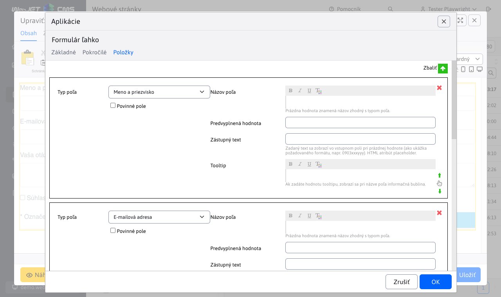
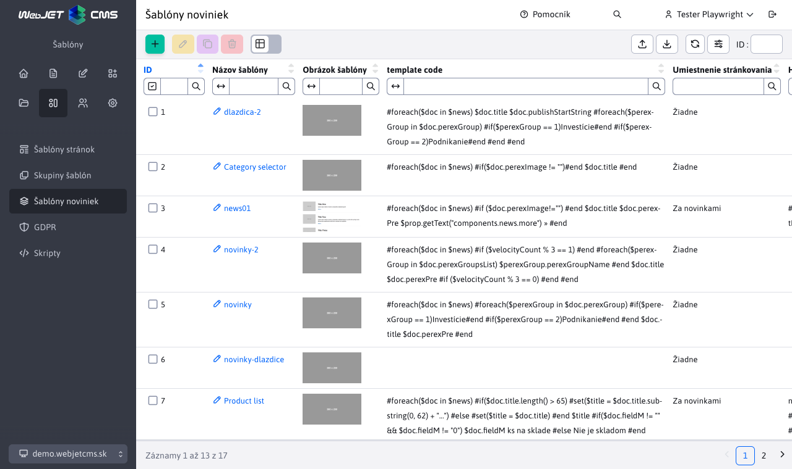
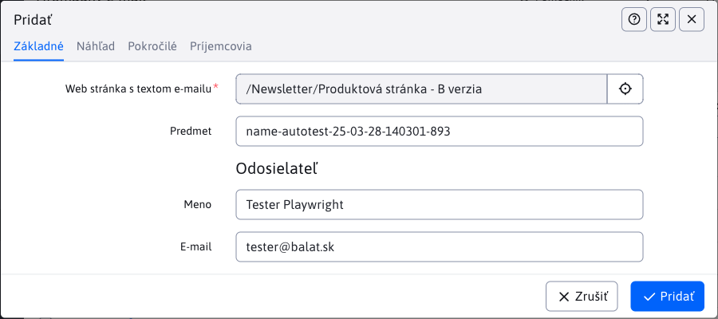
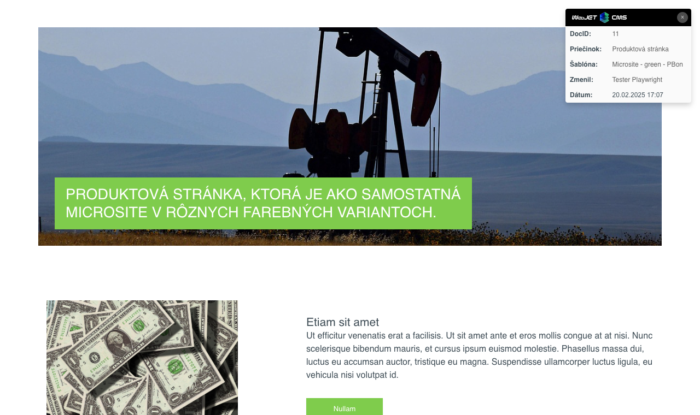

# Zoznam zmien verzia 2025

## 2025.0-SNAPSHOT

> **WebJET CMS 2025.SNAPSHOT** prináša vylepšenú verziu nástroja **Page Builder** pre tvorbu **komplexných web stránok**. V blokoch je možné **vyhľadávať a filtrovať** na základe značiek, ľahko tak nájdete vhodný blok pre vloženie do stránky. Pridané boli nové funkcie ako **rozdelenie stĺpca**, **vkladanie viacerých sekcií naraz** a **stále zobrazené tlačidlo na pridanie novej sekcie** pre rýchle rozšírenie obsahu stránky.
>
> Podpora **PICTURE elementu** umožňuje zobrazovať **rôzne obrázky podľa rozlíšenia obrazovky** návštevníka, čím sa zlepšuje vizuálny zážitok na rôznych zariadeniach. Navyše je možné vkladať **vlastné ikony** definované v spoločnom SVG súbore, čo prináša väčšiu flexibilitu v dizajne.
>
> Nový nástroj pre tvorbu formulárov umožňuje vytvárať viac krokové formuláre s pokročilými funkciami ako **podmienené zobrazenie polí**, **podmienená validácia** a **prispôsobené správy po odoslaní**.

### Prelomové zmeny

- Aktualizované knižnice `commons-lang,displaytag`, viac v [sekcii pre programátora](#pre-programátora) (#58153).
- Zmenené správanie ikony Bloky v režime Page Builder - [textové bloky integrované](frontend/page-builder/blocks.md) do priečinka `content` podobne ako sú bloky pre `section, container, column` (#58165).
- Upravené spracovanie nahrávania súborov `multipart/form-data`, viac v [sekcii pre programátora](#pre-programátora) (#57793-3).

### Webové stránky

- Pridaná možnosť vkladať `PICTURE` element, ktorý zobrazuje [obrázok podľa rozlíšenia obrazovky](frontend/setup/ckeditor.md#picture-element) návštevníka. Môžete teda zobraziť rozdielne obrázky na mobilnom telefóne, tablete alebo počítači (#58141).


- Pridaná možnosť vkladať [vlastné ikony](frontend/setup/ckeditor.md#svg-ikony) definované v spoločnom SVG súbore (#58181).


- Pridaný prenos aktuálneho HTML kódu pri prepnutí režimu editora Štandardný/HTML/Page Builder. Môžete tak jednoducho upraviť Page Builder stránku v HTML kóde a znova zobraziť úpravy v režime Page Builder (#58145).
- Page Builder - upravené generovanie štýlov pri použití nástroja ceruzka. Do CSS štýlu sa generujú len zmenené hodnoty, tie sú v dialógovom okne zvýraznené modrým orámovaním vstupného poľa (#58145).
- Page Builder - pridaná možnosť volania [vlastného JavaScript súboru](frontend/page-builder/blocks.md#podporný-javascript-kód) s podpornými funkciami pre úpravu kódu. Pridaná možnosť upraviť nastavenia ako selektory pre elementy, farby a podobne (#58141).
- Page Builder - upravené generovanie kotiev pri kartách tak, aby názov kotvy bol generovaný podľa názvu karty - pôvodne bol generovaný nesémanticky ako `autotabs-x-y` (#112).
- Page Builder - doplnená možnosť nastaviť šírku stĺpca na `auto` pre automatické prispôsobenie obsahu (#114).
- Page Builder - doplnená možnosť pripraviť [textové bloky](frontend/page-builder/blocks.md) priamo do priečinka `content`, vkladajú sa namiesto pôvodných blokov čítaných z web stránok z priečinka Šablóny. Web dizajnér ich pripraví spolu s ostatnými typmi Page Builder blokov. Umožňuje rýchle vloženie často používaných textových častí, tlačidiel a podobne (#58165).
- Page Builder - pri vkladaní nového bloku je predvolená karta Knižnica namiesto Základné, aby sa zjednodušil výber bloku z pripraveného zoznamu (#58165).
- Page Builder - doplnená možnosť rozdeliť stĺpec na dve časti pomocou novej funkcie Rozdeliť stĺpec. Vyvoláte ju pomocou kliknutia na + v žltej lište, zvolením možnosti Blok a následne v karte Základné zvolíte možnosť Rozdeliť stĺpec. Funkcia umožňuje rýchle rozdelenie stĺpca bez nutnosti vkladať nový stĺpec a presúvať obsah (#58165).
- Page Builder - doplnená možnosť vložiť blok, ktorý obsahuje viacero sekcií alebo iných elementov - označia sa po vložení všetky sekcie (#58173).
- Page Builder - doplnené [ID bloku](frontend/page-builder/blocks.md#id-bloku) do atribútu `data-pb-id` pre možnosť vyhľadania použitia bloku vo web stránkach cez vyhľadávanie v administrácii (#58193).
- Page Builder - zoznam oblúbených blokov je ukladaný pre každého používateľa zvlášť, aby si každý mohol spravovať vlastný zoznam obľúbených blokov (#58193).
- Page Builder - pridaná stále zobrazená ikona na pridanie novej sekcie na konci stránky, čo zjednodušuje pridávanie nových sekcií do stránky (#58173).


- Page Builder - upravený dizajn nástrojovej lišty pre lepšiu viditeľnosť na rôznych pozadiach (#58165).


- Page Builder - doplnená možnosť [filtrovať bloky](frontend/page-builder/blocks.md#názov-a-značky-bloku) podľa názvu a štítkov (#58173).


- Doplnená [detekcia zmeny obsahu](redactor/webpages/working-in-editor/README.md#detekcia-zmeny-obsahu-stránky) a upozornenie na neuložené zmeny pri zatváraní okna prehliadača. Zmeny sa začnú detegovať 5 sekúnd po otvorení web stránky. (#112).
- Doplnená možnosť nastaviť predvolené hodnoty pre tabuľky v CKEditore cez konfiguračné premenné, viac v [sekcii nastavenia CKEditora](frontend/setup/ckeditor.md#konfiguračné-premenné) (#58189).

### Aplikácie

Prerobené nastavenie vlastností aplikácií v editore zo starého kódu v `JSP` na `Spring` aplikácie. Aplikácie automaticky získavajú aj možnosť nastaviť [zobrazenie na zariadeniach](custom-apps/appstore/README.md#podmienené-zobrazenie-aplikácie). Dizajn je v zhode so zvyškom WebJET CMS a dátových tabuliek (#58073).

- [Novinky](redactor/apps/news/README.md)


- [Formulár ľahko](redactor/apps/formsimple/README.md)



### Presmerovania

- Pridané možnosť ukončiť platnosť presmerovania v stanovenom čase a možnosť zadať poznámku s informáciou na čo presmerovanie slúži. Presmerovania, ktoré už nie sú časovo platné sa zobrazia červenou farbou (#58105).


### Bezpečnosť

- Pridaná podpora pre povolenie iba **jedného aktívneho prihlásenia** na jedného používateľa. Režim zapnete nastavením konfiguračnej premennej `sessionSingleLogon` na hodnotu `true`. Pri novom prihlásení sa zruší predchádzajúca aktívna `session` (#58121).
- Odstránená nepodporovaná knižnica [commons-lang](https://mvnrepository.com/artifact/commons-lang/commons-lang), nahradená novou knižnicou [commons-lang3](https://mvnrepository.com/artifact/org.apache.commons/commons-lang3), v `update-2023-18.jsp` je aktualizačný skript pre úpravu zdrojových kódov (#58153).
- Pridaný zoznam [Moje aktívne prihlásenia](redactor/admin/welcome.md#moje-aktívne-prihlásenia) na úvodnej obrazovke administrácie, ktorá zobrazuje všetky aktívne prihlásenia do administrácie pod vaším používateľským kontom a možnosť ich ukončenia. Pridaná aj možnosť odoslať email prihlásenému administrátorovi (#58125).


- Captcha - nastavením konfiguračnej premennej `captchaType` na hodnotu `none` je možné Captcha úplne vypnúť. Nezobrazí sa aj v prípade, ak má šablóna zobrazenej web stránky vypnutú SPAM ochranu. V takom prípade je ale potrebné korektne kontrolovať vypnutie SPAM ochrany šablóny aj v prípadnom kóde spracovania/verifikácie Captcha odpovede, pre formuláre je táto kontrola zabezpečená. Môžete použiť volanie `Captcha.isRequired(component, request)` pre overenie režimu a vypnutia spam ochrany (#54273-78).
- Aktualizovaná knižnica pre [odosielanie emailov](install/config/README.md#odosielanie-emailov) z `com.sun.mail:javax.mail:1.6.2` na `com.sun.mail:jakarta.mail:1.6.8` z dôvodu podpory nových autentifikačných mechanizmov SMTP serverov ako napríklad `NTLMv2` a pridaná konfiguračná premenná `smtpAuthMechanism` pre vynútenie použitia autorizačného mechanizmu - nastavte napr. na hodnotu `NTLM` pre vynútenie `NTLM` autorizácie namiesto použitia `BASIC` autorizácie (#58153).
- Upravené logovanie výnimiek pri prerušení HTTP spojenia (napr. pri zatvorení prehliadača, odchodu na inú web stránku a podobne). Takéto výnimky sa nezapíšu do logu, aby nenastala chyba obsadenia miesta. Týka sa výnimiek typu `IOExceptio` a názvov výnimiek definovaných cez konfiguračnú premennú `clientAbortMessages`, predvolene `response already,connection reset by peer,broken pipe,socket write error` (#58153).

### Iné menšie zmeny

- Vyhľadávanie - upravené načítanie zoznamu šablón pri hľadaní web stránok. Načítajú sa všetky šablóny bez ohľadu na ich dostupnosť v priečinkoch, aby sa nestalo, že pri editácii web stránky šablóna nie je dostupná (#58073).
- HTTP hlavičky - pridaná možnosť nastaviť hlavičku dlhšiu ako 255 znakov, napríklad pre nastavenie `Content-Security-Policy` ([#82](https://github.com/webjetcms/webjetcms/issues/82))


- Konfigurácia - upravený spôsob zmazania konfiguračnej premennej. Po vymazaní sa automatický nastaví pôvodná hodnota z `Constants`, aby bola rovnaká ako bude po reštarte servera. V pôvodnom riešení sa premenná len zmazala, ale jej hodnota zostala interne nastavená do reštartu servera (#57849).
- Bezpečnosť - pridaná možnosť konfigurácie blokovaných ciest súborov/adresárov cez premennú `pathFilterBlockedPaths`. Štandardne sú blokované URL adresy, ktoré v názve obsahujú výraz `.DS_Store,debug.,config.properties,Thumbs.db,.git,.svn`. Je možné pridať ďalšie podľa potreby (#PR103).
- Značky - upravené zobrazené značiek, v prípade duplicity hodnôt. Porovnanie je bez vplyvu diakritiky a veľkých/malých písmen [#115](https://github.com/webjetcms/webjetcms/issues/115).


- Zrkadlenie - pridaná možnosť zobraziť obrázok vlajky namiesto textu v [prepínači jazyka stránky](redactor/apps/docmirroring/README.md#vytvorenie-odkazu-na-jazykové-mutácie-v-hlavičke-stránky) (#54273-79).
- Zmena hesla - pridaná možnosť nastaviť meno a email adresu z ktorej je odoslaný email s odkazom na zmenu hesla cez konfiguračné premenné `passwordResetDefaultSenderEmail` a `passwordResetDefaultSenderName` (#58125).

### Oprava chýb

- Značky - opravené duplikovanie priečinka v Zobraziť pre pri uložení značky, odstránený výber priečinka z ostatných domén, keďže značky sú už oddelené podľa domén (#58121).

### Dokumentácia

- Aktualizované všetky fotky obrazovky v českej verzii dokumentácie (#58113).

### Pre programátora

- Voľné polia - pridaná možnosť špecifikovať vlastné stĺpce pre label a hodnotu pri [prepojení na číselník](frontend/webpages/customfields/README.md#číselník). Umožňuje flexibilnejšie nastavenie, ktorá vlastnosť z číselníka sa použije ako zobrazený text a ktorá ako uložená hodnota (#PR108).
- Zmazané nepoužívané súbory `/admin/spec/gallery_editor_perex_group.jsp,/admin/spec/perex_group.jsp`, ak ich vo vašom projekte používate zoberte ich zo [staršej verzie](https://github.com/webjetcms/webjetcms/tree/release/2025.40/src/main/webapp/admin/spec) WebJET CMS (#58073).
- Mierne upravené API v [NewsActionBean](../../src/webjet8/java/sk/iway/iwcm/components/news/NewsActionBean.java), hlavne nastavenie `groupIds` ktoré sú teraz typu `List<GroupDetails>`. Môžete použiť `setGroupIds(int[] groupIds)` pre nastavenie s poľom ID hodnôt (#58073).
- Opravená možnosť vkladania úvodzoviek do parametrov aplikácií (#58117).
- Pripravené kontajnery pre všetky podporované databázové serveri vo WebJET CMS pre ľahké spustenie vo VS Code. Nachádzajú sa v priečinku `.devcontainer/db` (#58137).
- Navigačná lišta - pridaná možnosť použiť vlastnú implementáciu generátora [navigačnej lišty](redactor/apps/navbar/README.md). Cez konfiguračnú premennú `navbarDefaultType` je možné nastaviť meno triedy implementujúcej `NavbarInterface` (#PR101).
- Odstránená nepodporovaná knižnica [commons-lang](https://mvnrepository.com/artifact/commons-lang/commons-lang), nahradená novou knižnicou [commons-lang3](https://mvnrepository.com/artifact/org.apache.commons/commons-lang3), v `update-2023-18.jsp` je aktualizačný skript pre úpravu zdrojových kódov (#58153).
- Aktualizovaná knižnica [displaytag](https://mvnrepository.com/artifact/com.github.hazendaz/displaytag) na verziu `2.9.0` (#58153).
- Upravené spracovanie nahrávania súborov `multipart/form-data`. V Spring aplikáciach pre súborové pole použite namiesto `org.apache.commons.fileupload.FileItem` priamo `org.springframework.web.multipart.MultipartFile`, ktoré bude automaticky nastavené. Nie je už potrebné používať volanie typu `entity.setDocument(MultipartWrapper.getFileStoredInRequest("document", request))` pre získanie súboru. **Upozornenie:** je potrebné nahradiť všetky výskyty `CommonsMultipartFile` za `MultipartFile` vo vašom kóde, tiež zrušiť URL parametre v Spring aplikácii pre vynútené spracovanie. Výraz `data-th-action="@{${request.getAttribute('ninja').page.urlPath}(\_\_forceParse=1,\_\_setf=1)}"` nahraďte za `data-th-action="${request.getAttribute('ninja').page.urlPath}"`. Môžete použiť `/admin/update/update-2023-18.jsp` na aktualizáciu súborov (#57793-3).
- Doplnená možnosť vytvorenia [projektových kópií súborov](frontend/customize-apps/README.md) Spring aplikácii. Stačí vytvoriť vlastnú verziu súboru v priečinku `/apps/INSTALL_NAME/` podobne ako sa používa pre JSP súbory. WebJET CMS najskôr hľadá súbor v projektovom priečinku a ak nie je nájdený použije štandardný súbor z `/apps/` priečinka (#58073).

### Testovanie

- Doplnený skript [rm-same-images.sh](../../src/test/webapp/rm-same-images.sh) pre odstránenie rovnakých obrázkov pri vytvorení nových snímkov obrazovky (#58113).

## 2025.40

> **WebJET CMS 2025.40** prináša integrovaného **AI Asistenta**, ktorý zásadne zjednodušuje prácu s obsahom. Umožňuje automaticky **opravovať gramatiku**, **prekladať** texty, navrhovať titulky, sumarizovať články a generovať **ilustračné obrázky** priamo v editore. Vďaka tomu je tvorba obsahu **rýchlejšia, presnejšia a kreatívnejšia** než kedykoľvek predtým.
>
> Významné zmeny sa týkajú aj **značiek** a **šablón noviniek**, ktoré boli prepracované do **samostatných databázových tabuliek** s podporou oddelenia podľa domén. To prináša vyššiu **prehľadnosť, jednoduchšiu správu** a možnosť efektívneho prispôsobenia obsahu pre viacero webov. Používateľské prostredie bolo **optimalizované pre menšie obrazovky** – systém automaticky prispôsobí zobrazenie okien a maximalizuje využiteľný priestor.
>
> Na technickej úrovni bol odstránený zastaraný Struts Framework. Vďaka tomu je WebJET CMS výkonnejší, stabilnejší, **bezpečnejší** a pripravený na ďalší rozvoj moderných webových riešení.

### Prelomové zmeny

- Odstránený `Struts Framework`, je potrebné vykonať aktualizáciu `JSP` súborov, Java tried a upraviť súbor `web.xml`, viac v [sekcii pre programátora](#pre-programátora) (#57789).
- Ak používate aplikačný server Tomcat vo verzii 9.0.104 a viac je potrebné [aktualizovať nastavenie](install/versions.md#zmeny-pri-prechode-na-tomcat-90104) parametra `maxPartCount` na `<Connector` elemente (#54273-70).
- Značky - rozdelené podľa domén - pri štarte sa vytvorí kópia značiek pre každú doménu (ak je používané rozdelenie údajov podľa domén - nastavená konfiguračná premenná `enableStaticFilesExternalDir=true`). Aktualizujú sa ID značiek pre web stránky a galériu. Je potrebné manuálne skontrolovať ID značiek pre všetky aplikácie novinky a iné aplikácie, ktoré obsahujú ID značky - aktualizácia sa ich pokúsi opraviť, ale odporúčame ID skontrolovať. Viac informácii v sekcii pre programátora. (#57837).
- Novinky - [šablóny noviniek](frontend/templates/news/README.md) prerobené z definície cez prekladové kľúče na vlastnú databázovú tabuľku. Pri štarte WebJETu sa skonvertujú záznamy z pôvodného formátu. Sú oddelené podľa domén, ak obsahujú doménový alias vytvoria sa len v príslušnej doméne (#57937).
- Bezpečnosť - prísnejšia kontrola URL adries administrácie - je potrebné, aby URL adresa v administrácii mala na konci znak `/`, nesprávna adresa je `/admin/v9/webpages/web-pages-list` alebo `/apps/quiz/admin`, správna `/admin/v9/webpages/web-pages-list/` alebo `/apps/quiz/admin/`. Je potrebné aby programátor skontroloval definície URL adries v súboroch `modinfo.properties` (#57793).

### AI Asistent

V dnešnom svete je umelá inteligencia všade okolo nás a samozrejme, WebJET ako moderný redakčný systém nechce zostať pozadu. Preto s hrdosťou predstavujeme novú verziu WebJET CMS, kde sme integrovali [pokročilé AI nástroje](redactor/ai/README.md).


Tieto funkcie vám zjednodušia tvorbu a úpravu obsahu – od opravy gramatiky, cez preklady textov, návrhy titulkov, až po generovanie ilustračných obrázkov.

<div class="video-container">
    <iframe width="560" height="315" src="https://www.youtube.com/embed/LhXo7zx7bEc" title="YouTube video player" frameborder="0" allow="accelerometer; autoplay; clipboard-write; encrypted-media; gyroscope; picture-in-picture" allowfullscreen></iframe>
</div>

### Web stránky

- AB Testovanie - pridaná možnosť [zobrazovať AB verziu](redactor/apps/abtesting/README.md) podľa stavu prihláseného používateľa - neprihlásenému používateľovi sa zobrazí A verzia a prihlásenému B verzia. Režim aktivujete nastavením konfiguračnej premennej `ABTestingForLoggedUser` na hodnotu `true` (#57893).
- [Page Builder](redactor/webpages/pagebuilder.md) - upravený vizuál, aby lepšie zapadal do aktuálneho dizajnu WebJET CMS (#57893).


- Povolené zobrazenie stránok obsahujúcich `404.html` v URL adrese zo systémových priečinkov, aby vám takáto technická stránka neprekážala medzi štandardnými web stránkami (#57657-8).
- Značky - rozdelené zobrazenie značiek podľa aktuálne zvolenej domény, aby ste mohli mať značky zvlášť pre každú doménu vo WebJETe (#57837).
- Klonovanie štruktúry - pridaná informácia o nakonfigurovanom prekladači a koľko voľných znakov na preklad ostáva (#57881).
- Zrkadlenie štruktúry - pridaná možnosť vymazať `sync_id` hodnoty pre zvolený priečinok (rekurzívne). Aby bolo ľahko možné zrušiť/resetovať zrkadlenie stránok (#57881).


- Zrkadlenie - pridanie novej sekcie [zrkadlenie](redactor/webpages/mirroring/README.md) na sledovanie a manažovanie previazaných priečinkov a stránok po akcií zrkadlenia (#57941).


- Pri výbere obrázka, alebo video súboru, v editore stránok sú v prieskumníkovi zobrazené len vhodné typy súborov, ostatné sú filtrované (#57921).

### Šablóny

- Pridaná nová sekcia [Šablóny noviniek](frontend/templates/news/README.md) na správu a manažovanie šablón noviniek (#57937).



### Používateľské rozhranie

- Pri použití malého monitora (výška okna menej ako 760 bodov) sa zobrazí okno automaticky na celú plochu a zmenší sa hlavička a pätička (titulok okna je menším písmom). Zvýši sa tak zobrazené množstvo informácií, čo je potrebné hlavne v sekcii web stránky. Používa sa pri oknách používajúcich CSS triedu `modal-xl`, čo sú aktuálne web stránky, foto galéria, editor obrázkov a používatelia (#57893).


- V editore pridaná možnosť kliknúť na ikonu obrázka na začiatku poľa, pre jeho zobrazenie v novej karte.


### Aplikácie

- Pridaná možnosť zobraziť aplikáciu len prihlásenému/neprihlásenému používateľovi. Režim sa nastavuje v karte [Zobrazenie nastavenia aplikácie](redactor/webpages/working-in-editor/README.md#karta-zobrazenie) v editore stránok (#57893).


Prerobené nastavenie vlastností aplikácií v editore zo starého kódu v `JSP` na `Spring` aplikácie. Aplikácie automaticky získavajú aj možnosť nastaviť [zobrazenie na zariadeniach](custom-apps/appstore/README.md#podmienené-zobrazenie-aplikácie). Dizajn je v zhode so zvyškom WebJET CMS a dátových tabuliek (#57409).

- [Carousel Slider](redactor/apps/carousel_slider/README.md)
- [Emotikony](redactor/apps/emoticon/README.md)
- [Fórum/Diskusia](redactor/apps/forum/README.md)
- [Otázky a odpovede](redactor/apps/qa/README.md)
- [Používatelia](redactor/apps/user/README.md)
- [Pôsobivá prezentácia](redactor/apps/app-impress_slideshow/README.md)
- [Reštauračné menu](redactor/apps/restaurant-menu/README.md)
- [Slider](redactor/apps/slider/README.md)
- [Slit slider](redactor/apps/app-slit_slider/README.md)
- [Sociálne ikony](redactor/apps/app-social_icon/README.md)
- [Video](redactor/apps/video/README.md)


### Menu

- Ak [menu web stránky](redactor/apps/menu/README.md) nemá zadaný koreňový priečinok (hodnota je nastavená na 0), automaticky sa použije koreňový priečinok pre aktuálne zobrazenú web stránku. Je to výhodné ak sa zobrazuje menu vo viacerých jazykových mutáciách kde každá je koreňový priečinok - nemusíte mať menu/hlavičky pre každý jazyk samostatne, stačí jedna spoločná (#57893).

### Štatistika

- V sekcií [návštevnosť](redactor/apps/stat/README.md#návštevnosť) pridaný sumárny počet Videní, Návštev a Počet rôznych používateľov pre ľahký prehľad celkovej návštevnosti za zvolené obdobie (#57929).


- V sekcií [chybné stránky](redactor/apps/stat/README.md#chybné-stránky) pridané filtrovanie podľa botov (aplikuje sa len na novo zaznamenané údaje) a sumárny počet v pätičke. Je potrebné upraviť stránku `404.jsp` vo vašom projekte pridaním objektu `request` do volania `StatDB.addError(statPath, referer, request);` (#58053).


### Voliteľné polia

- Pridaná podpora pre nové typy [voliteľných polí](frontend/webpages/customfields/README.md):
  - [Výber priečinku webových stránok](frontend/webpages/customfields/README.md#výber-priečinku-webových-stránok) (#57941).
  - [Výber webovej stránky](frontend/webpages/customfields/README.md#výber-webovej-stránky) (#57941).


### Bezpečnosť

- Opravená možná zraniteľnosť v Safari pri špeciálnej URL adrese smerujúcej na archív súborov v kombinácii s peknou 404 stránkou (#57657-8).

### Iné menšie zmeny

- Audit zmien - vyhľadávanie - pole Typ je usporiadané podľa abecedy (#58093).
- Elektronický obchod - pridaná možnosť nastaviť [koreňový priečinok](redactor/apps/eshop/product-list/README.md) so zoznamom produktov pomocou konfiguračnej premennej `basketAdminGroupIds`, ak nevyhovuje automatické hľadanie podľa vloženej aplikácie zoznam produktov (#58057).
- Elektronický obchod - aplikácia na nastavenie platobných metód presunutá z priečinka `/apps/eshop/admin/payment-methods/` do štandardného `/apps/basket/admin/payment-methods/` (#58057).
- Elektronický obchod - po zmazaní objednávky sú zmazané z databázy aj jej položky a platby (#58070).
- Monitorovanie servera - aktuálne hodnoty - pridaný typ databázového servera (MariaDB, Microsoft SQL, Oracle, PostgreSQL) (#58101).
- Prekladač - pri prekladači `DeepL` sa zlepšilo spracovanie vrátených chybových hlášok, pre presnejšie identifikovanie problému (#57881).
- Prekladač - pridaná podpora pre implementáciu viacerých prekladačov a ich automatické spracovanie/využitie (#57881).
- Prekladač - pridané automatické [auditovanie počtu spotrebovaných znakov](admin/setup/translation.md) pri každom preklade. Do audit záznamu typu `TRANSLATION` sa do stĺpca `EntityID` zapíše spotrebované množstvo kreditov pri preklade. Audituje sa aj počet dostupných znakov, výsledok je uložený do cache a aktualizuje sa znova najskôr o 5 minút (#57965).
- Prieskumník - optimalizované načítanie, opravené duplicitné čítanie knižnice `jQuery UI` (#57997).

### Oprava chýb

- Dátové tabuľky - opravené nastavenie možností do výberového menu externého filtra (#57657-8).
- Klonovanie štruktúry - opravená validácia zadaných id priečinkov a pridaný výpis chybovej správy (#57941).
- Galéria - pridaná podpora pre výber priečinka galérie, v aplikácii Galéria vo web stránke, pri použití doménových aliasov a editácia záznamu v galérii s doménovým aliasom (#57657-11).
- Webové stránky - opravené zobrazenie zoznamu stránok pri zobrazení priečinkov ako tabuľky (#57657-12).
- Grafy - opravené zobrazenie veľkého množstva legend v grafoch, automaticky sa využije posúvanie v legendách (#58093).

### Dokumentácia

- Doplnená dokumentácia pre nastavenie a používanie [dvoj stupňového overovania/autorizácie](redactor/admin/logon.md#dvojstupňové-overovanie) (#57889).

### Pre programátora

- Zrušená trieda `ImportXLSForm`, ktorá sa používala v importoch z `XLS` formátu v [spec/import_xls.jsp](../../src/main/webapp/admin/spec/import_xls.jsp). Technicky trieda nie je potrebná, stačí zmazať referenciu v JSP a upraviť formulár na štandardný HTML formulár (#57789).
- Zlepšený aktualizačný skript `/admin/update/update-2023-18.jsp` pre Archív súborov - vie aktualizovať štandardné zmeny a doplniť potrebné zmeny do vašej verzie `FileArchivatorBean` a pomocných tried (#57789).
- Trieda `org.apache.struts.action.ActionMessage` nahradená objektom `String`, trieda `ActionMessages` nahradená `List<String>` (#57789).
- Zrušený framework `Struts`, tagy `<logic:present/iterate/...` nahradené za zodpovedajúce `<iwcm:present/iterate/...`, pozor `<bean:write` za `<iwcm:beanWrite`.
- V Java kóde sú z dôvodu odstránenia `Struts` nasledovné zmeny:
  - `ActionMessage` nahradený za `String`
  - `ActionMessages` nahradený za `List<String>`
  - `BasicLdapLogon.logon` vráti `List<String>` namiesto `ActionMessages`
  - `org.apache.struts.util.ResponseUtils.filter` nahradený `sk.iway.iwcm.tags.support.ResponseUtils.filter`
- Amcharts - pridaná podpora pre zadanie funkcie na transformáciu textu v štítkoch kategórií u grafu typu `PIE` (#58093).
- Amcharts - pridaná podpora pre zadanie funkcie na transformáciu textu v legende grafu typu `LINE` (#58093).
- Amcharts - pridaná možnosť skryť tooltip keď hodnota je `null` alebo `0` v grafe typu `LINE` (#58093).

Na konverziu JSP aj Java súborov môžete použiť skript `/admin/update/update-2023-18.jsp`. Ak zadáte ako cestu hodnotu `java` vykoná sa nahradenie aj v `../java/*.java` súboroch. Problémom je spustenie projektu, ak obsahuje chyby. Môžete ale priečinok `src/main/java` premenovať na `src/main/java-update` aby išiel spustiť čistý WebJET. Následne môžete použiť aktualizačný skript. Ten prehľadáva a aktualizuje priečinok `../java/*.java` aj `../java-update/*.java`.

V súbore `WEB-INF/web.xml` už nie je potrebná inicializácia `Apache Struts`, zmažte celú `<servlet>` sekciu obsahujúcu `<servlet-class>org.apache.struts.action.ActionServlet</servlet-class>` a `<servlet-mapping>` obsahujúci `<servlet-name>action</servlet-name>`.

- Rozdelené značky podľa domén (ak je nastavená konfiguračná premenná `enableStaticFilesExternalDir=true`), aby bolo možné jednoducho mať samostatné značky pre každú doménu. Pri spustení WebJET nakopíruje existujúce značky pre všetky definované domény. Preskočí značky, ktoré majú nastavene zobrazenie len v špecifickom priečinku, kde podľa prvého priečinku nastaví doménu pre značku. Aktualizuje značky pre Novinky, čiže pre aplikáciu `/components/news/news-velocity.jsp` kde vyhľadá výraz `perexGroup` a `perexGroupNot` pri ktorých sa pokúsi ID značiek aktualizovať podľa domény danej web stránky. Informácia sa zapíše do histórie a v Audite vznikne záznam s podrobnosťou ako sa `INCLUDE` nahradil, príklad:

```txt
UPDATE:
id: 76897

news-velocity.jsp - update perexGroups+perexGroupsNot for domainId, old code::
INCLUDE(/components/news/news-velocity.jsp, groupIds="24", alsoSubGroups="false", publishType="new", order="date", ascending="false", paging="false", pageSize="1", offset="0", perexNotRequired="false", loadData="false", checkDuplicity="true", contextClasses="", cacheMinutes="0", template="news.template.dlazdica-3", perexGroup="625", perexGroupNot="626")
new code:
INCLUDE(/components/news/news-velocity.jsp, groupIds="24", alsoSubGroups="false", publishType="new", order="date", ascending="false", paging="false", pageSize="1", offset="0", perexNotRequired="false", loadData="false", checkDuplicity="true", contextClasses="", cacheMinutes="0", template="news.template.dlazdica-3", perexGroup="", perexGroupNot="")

INCLUDE(/components/news/news-velocity.jsp, groupIds="24", alsoSubGroups="false", publishType="new", order="date", ascending="false", paging="false", pageSize="1", offset="0", perexNotRequired="false", loadData="false", checkDuplicity="true", contextClasses="", cacheMinutes="0", template="news.template.dlazdica-3", perexGroup="3+645", perexGroupNot="794")
new code:
INCLUDE(/components/news/news-velocity.jsp, groupIds="24", alsoSubGroups="false", publishType="new", order="date", ascending="false", paging="false", pageSize="1", offset="0", perexNotRequired="false", loadData="false", checkDuplicity="true", contextClasses="", cacheMinutes="0", template="news.template.dlazdica-3", perexGroup="1438+1439", perexGroupNot="1440")
```

Pre prvý `INCLUDE` boli odstránené značky s ID 625 a 626, pretože tie sa nezobrazujú v danom priečinku/doméne - mali nastavené zobrazenie len pre určitý priečinok. V druhom `INCLUDE` boli zmenené značky `3+645` na novo vzniknuté `1438+1439` a `794` za `1440`.

| perex_group_id | perex_group_name      | domain_id | available_groups |
|----------------|-----------------------|-----------|-----------------|
| 3              | ďalšia perex skupina  | 1         | NULL            |
| 645            | deletedPerexGroup     | 1         | NULL            |
| 794            | kalendár-udalostí     | 1         | NULL            |
| 1438           | ďalšia perex skupina  | 83        | NULL            |
| 1439           | deletedPerexGroup     | 83        | NULL            |
| 1440           | kalendár-udalostí     | 83        | NULL            |

Pred spustením aktualizácie existovali v databáze len záznamy `3, 645 a 794`, ktorým sa nastavilo `domain_id=1`. Záznamy `1438, 1439 a 1440` vznikli pri aktualizácii pre `domain_id=83`.

- Dátové tabuľky - pridaná podpora pre úpravu [lokálnych JSON dát](developer/datatables-editor/field-datatable.md#lokálne-json-dáta) (#57409).
- Dátové tabuľky - pridané rozšírenie [Row Reorder](https://datatables.net/extensions/rowreorder/) pre možnosť usporiadania zoznamu pomocou funkcie `Drag&Drop` (#57409).
- Datatabuľky - Pridaná možnosť nastavenia [Pätičky pre súčet hodnôt](developer/datatables/README.md#pätička-pre-súčet-hodnôt) (#57929).
- Aplikácie - doplnená možnosť použiť lokálne JSON dáta pre nastavenie položiek aplikácie, napríklad položiek pre [pôsobivú prezentáciu](redactor/apps/app-impress_slideshow/README.md) (#57409).


## 2025.18

> Verzia **2025.18** prináša kompletne prerobený modul **Elektronického obchodu** s podporou **platobnej brány GoPay** a vylepšeným zoznamom objednávok. Aplikácia **Kalendár noviniek** bola oddelená ako **samostatná aplikácia** a zároveň sme prerobili nastavenia viacerých aplikácii v editore stránok do nového dizajnu. **Manažér dokumentov** (pôvodne Archív súborov) prešiel **vizuálnym aj funkčným reštartom** vrátane nových nástrojov na správu, export a import dokumentov.
>
> Vylepšený bol aj systém **Hromadného e-mailu** s novými možnosťami pre odosielateľa a pohodlnejším výberom príjemcov. **Rezervácie** získali nové možnosti ako **nadmerné rezervácie**, vytváranie rezervácií spätne do minulosti a zasielanie notifikácií na špecifické emaily pre každý rezervačný objekt.
>
> Optimalizovali sme počet súborov v **Prieskumníku**, čo vedie k **rýchlejšiemu načítaniu** a pridali nové informácie do **Monitorovania servera**.

### Prelomové zmeny

- Aplikácia Kalendár noviniek oddelená do samostatnej aplikácie, ak kalendár noviniek používate je potrebné upraviť cestu `/components/calendar/news_calendar.jsp` na `/components/news-calendar/news_calendar.jsp` (#57409).
- Upravená inicializácia Spring a JPA, viac informácií v sekcii pre programátora (#43144).
- Prerobená backend časť aplikácie elektronický obchod, viac v sekcii pre programátora (#57685).

### Dátové tabuľky

- Pri nastavení filtra číselnej hodnoty od-do sa pole zväčší pre lepšie zobrazenie zadanej hodnoty podobne ako to robí dátumové pole (#57685).
- Aplikácia Archív súborov bola prerobená na Spring aplikáciu. Bližšie informácie nájdete v sekcii pre programátora (#57317).
- Aplikácia Elektronický obchod bola na `BE` časti prerobená. Bližšie informácie nájdete v sekcii pre programátora (#56609).

### Manažér dokumentov (Archív súborov)

- **Zoznam súborov** prerobený do nového dizajnu s pridaním novej logiky oproti starej verzií. Viac sa dočítate v časti [Archív súborov](redactor/files/file-archive/README.md) (#57317).


- **Manažér kategórií** opravený a prerobený do nového dizajnu. Viac sa dočítate v časti [Manažér kategórií](redactor/files/file-archive/category-manager.md) (#57317).
- **Manažér produktov** bol pridaný ako nová sekcia. Viac sa dočítate v časti [Manažér produktov](redactor/files/file-archive/product-manager.md) (#57317).
- **Export hlavných súborov** bol upravený tak, aby ponúkal širšie možnosti exportu súborov a zlepšil prehľadnosť výpisov. Viac sa dočítate v časti [Export hlavných súborov](redactor/files/file-archive/export-files.md) (#57317).


- **Import hlavných súborov** bol opravený a upravený, aby dokázal pracovať s rozšírenými možnosťami exportu. Viac sa dočítate v časti [Import hlavných súborov](redactor/files/file-archive/import-files.md) (#57317).
- **Indexovanie** dokumentov vo vyhľadávačoch typu `Google` upravené tak, aby sa neindexovali staré/historické verzie dokumentov a dokumenty mimo dátum platnosti (nastavená HTTP hlavička `X-Robots-Tag=noindex, nofollow`). Indexovanie týchto dokumentov sa dá povoliť v editore v manažérovi dokumentov (#57805).

### Aplikácie

Prerobené nastavenie vlastností aplikácií v editore zo starého kódu v `JSP` na `Spring` aplikácie. Aplikácie automaticky získavajú aj možnosť nastaviť [zobrazenie na zariadeniach](custom-apps/appstore/README.md#podmienené-zobrazenie-aplikácie). Dizajn je v zhode so zvyškom WebJET CMS a dátových tabuliek (#57409).

- [Anketa](redactor/apps/inquiry/README.md)
- [Bannerový systém](redactor/apps/banner/README.md)
- [Dátum a čas, Dátum a meniny](redactor/apps/app-date/README.md) - zlúčené do jednej spoločnej aplikácie
- [Dotazníky](redactor/apps/quiz/README.md)
- [Hromadný e-mail](redactor/apps/dmail/form/README.md)
- [Kalendár udalostí](redactor/apps/calendar/README.md)
- [Kalendár noviniek](redactor/apps/news-calendar/README.md)
- [Mapa stránok](redactor/apps/sitemap/README.md)
- [Média](redactor/webpages/media.md)
- [Príbuzné stránky](redactor/apps/related-pages/README.md)
- [Rating](redactor/apps/rating/README.md)
- [Rezervácie](redactor/apps/reservation/reservation-app/README.md)


- Zrýchlené načítanie údajov aplikácie v editore - dáta sú vložené priamo zo servera, nie je potrebné vykonať volanie REST služby (#57673).
- Upravený vizuál - názov aplikácie pri vkladaní do stránky presunutý do hlavného okna (namiesto pôvodného nadpisu Aplikácie) pre zväčšenie veľkosti plochy pre nastavenie aplikáciu (#57673).


- Doplnené fotky obrazovky aplikácií v českej jazykovej mutácii pre väčšinu aplikácií (#57785).

### Hromadný e-mail

- **Presunuté pole Web stránka** – teraz sa nachádza pred poľom **Predmet**, aby sa po výbere stránky predmet automaticky vyplnil podľa názvu zvolenej web stránky (#57541).
- **Úprava poradia v karte Skupiny** – e-mailové skupiny sú teraz zobrazené pred skupinami používateľov (#57541).
- **Nové možnosti pre meno a e-mail odosielateľa** – ak sú konfiguračné premenné `dmailDefaultSenderName` a `dmailDefaultSenderEmail` nastavené, použijú sa tieto hodnoty. Ak sú prázdne, systém automaticky vyplní meno a e-mail aktuálne prihláseného používateľa. (#57541)
  - Pomocou týchto premenných je možné nastaviť **fixné hodnoty** (napr. názov spoločnosti) pre všetky [kampane](redactor/apps/dmail/campaings/README.md), bez ohľadu na to, kto je prihlásený.



- Hromadný email - optimalizácia tvorby zoznamu príjemcov - karta [skupiny](redactor/apps/dmail/campaings/README.md#pridanie-zo-skupiny) presunutá do dialógového okna. Po zvolení skupiny príjemcov ich ihneď vidíte v karte Príjemcovia a viete ich ľahko upravovať, už nie je potrebné email najskôr uložiť pre zobrazenie príjemcov (#57537).


- Odhlásenie - pri priamom zadaní emailu na odhlásenie (nie kliknutie na odkaz v emaile) je zaslaný na zadanú email adresu potvrdzujúci email. V ňom je potrebné kliknúť na odkaz pre odhlásenie. Pôvodná verzia nekontrolovala žiadnym spôsobom platnosť/vlastníctvo email adresy a bolo možné odhlásiť aj cudzí email (#57665).

### Kalendár noviniek

- Kalendár noviniek oddelený ako samostatná aplikácia, pôvodne to bola možnosť v aplikácii Kalendár (#57409).
- Zobrazuje kalendár napojený na zoznam noviniek s možnosťou filtrovať novinky podľa zvoleného dátumu v kalendári.


### Monitorovanie servera

- Doplnená tabuľka s informáciou o databázových spojeniach a obsadenej pamäti (#54273-61).
- Doplnená informácia o verzii knižníc `Spring (Core, Data, Security)` do sekcie Monitorovanie servera-Aktuálne hodnoty (#57793).

### Rezervácie

- **Podpora pre nadmernú rezerváciu** – umožňuje administrátorom vytvoriť viac rezervácií `overbooking` na ten istý termín (#57405).
- **Vylepšená validácia pri importe** – teraz je možné importovať [rezervácie](redactor/apps/reservation/reservations/README.md) aj do minulosti, alebo vytvoriť `overbooking` rezervácie pri importe údajov (#57405).
- **Podpora pre pridanie rezervácie do minulosti** – umožňuje administrátorom vytvoriť rezervácie v minulosti (#57389).
- Do [rezervačných objektov](redactor/apps/reservation/reservation-objects/README.md) bol pridaný stĺpec **Emaily pre notifikácie**, ktorý pre každý zadaný platný email (oddelený čiarkou) odošle email ak bola rezervácia pridaná a schválená (#57389).
- Notifikáciám pre potvrdenie rezervácie a ďalším systémovým notifikáciám je možné nastaviť meno a email odosielateľa pomocou konfiguračných premenných `reservationDefaultSenderName,reservationDefaultSenderEmail` (#57389).
- Pridaná nová aplikácia [Rezervácia dní](redactor/apps/reservation/day-book-app/README.md), pre rezerváciu celodenných objektov na určitý interval pomocou integrovaného kalendára (#57389).


### Galéria

- Pridaná podpora pre **zmenu priečinka** obrázku, ktorá umožňuje [presunúť obrázok](redactor/apps/gallery/README.md#) pri úprave alebo duplikovaní do iného priečinka. Užitočné to je práve pri duplikovaní, keď môžete rovno nastaviť nový priečinok, kam chcete obrázok duplikovať. Ak priečinok zadáte manuálne a neexistuje, automaticky sa vytvorí a nastavia sa mu vlastnosti podľa najbližšieho existujúceho rodičovského priečinka (#57885).

### Elektronický obchod

!> **Upozornenie:** z dôvodu aktualizácie databázy môže prvý štart servera trvať dlhšie - do databázy sa vypočítajú hodnoty pre počet položiek a cenu pre rýchlejšie načítanie zoznamu objednávok.

- Pridaná karta **Osobné informácie** do zoznamu objednávok - obsahuje podrobné informácie o **adrese doručenia** ako aj **kontaktné informácie** všetko na jednom mieste (#57685).
- Pridaná karta **Voliteľné polia** do zoznamu objednávok - [voliteľné polia](frontend/webpages/customfields/README.md) podľa potreby implementácie (#57685).
- Export zoznamu objednávok - doplnené stĺpce celková cena s DPH a počet položiek (#57685).
- Formulár pre objednanie - doplnená možnosť definovať dostupný zoznam krajín cez konfiguračnú premennú `basketInvoiceSupportedCountries` (#57685).
- Upravené zobrazenie údajov z karty **Osobné údaje** v zozname objednávok, ich logické rozdelenie do častí pre lepší prehľad (#57685).
- V zozname objednávok boli pridané stĺpce **Počet položiek**, **Cena bez DPH** a **Cena s DPH**. Hodnoty sa automaticky prepočítajú pri zmene položiek objednávky (#57685).
- Do zoznamu položiek doplnená možnosť zobrazenia web stránky produktu kliknutím na ikonu, produkt sa zobrazí aj v karte Náhľad pri otvorení editora položky (#57685).
- V zozname objednávok prerobený výber krajiny cez výberové pole, ktorý ponúka iba krajiny zadefinované konštantou `basketInvoiceSupportedCountries` (#57685).


- Nová verzia [konfigurácie spôsobov platby](redactor/apps/eshop/payment-methods/README.md) a integrácie na platobné brány. Údaje sú oddelené podľa domén. Pridali sme podporu [platobnej brány GoPay](https://www.gopay.com), čo znamená aj akceptáciu platobných kariet, podporu `Apple/Google Pay`, platby cez internet banking, `PayPal`, `Premium SMS` atď. Okrem toho sú podporované platby prevodom a dobierka. Pre každý typ platby je možné nastaviť aj cenu, ktorá pri zvolení možnosti bude automaticky pripočítaná k objednávke. Nastavené spôsoby platby sa aj automaticky premietnu do možností pri vytváraní objednávky zákazníkom.


- Nová aplikácia Zoznam objednávok so zoznamom objednávok aktuálne prihláseného používateľa. Kliknutím na objednávku je možné zobraziť detail objednávky a stiahnuť ju v PDF formáte (#56609).

### Iné menšie zmeny

- Vyhľadávanie v administrácii - upravené rozhranie na vlastný `RestController` a `Service` (#57561).
- Prieskumník - rýchlejšie načítanie a nižšie zaťaženie servera znížením počtu súborov/požiadaviek na server (#56953).
- `dt-tree-dir-simple` - pridaná podpora na [skrytie rodičovských priečinkov](developer/datatables-editor/field-json.md#možnosti-classname) v zobrazenej stromovej štruktúre atribútom `data-dt-field-hideRootParents` (#57885).

### Oprava chýb

- Hromadný email - pri duplikovaní kampane doplnené duplikovanie zoznamu príjemcov (#57533).
- Dátové tabuľky - import - upravená logiky **Preskočiť chybné záznamy** pri importe tak, aby sa pri tejto možnosti spracovali aj generické chyby `Runtime` a zabezpečilo sa dokončenie importu bez prerušenia. Tieto chyby sa následne zobrazia používateľovi pomocou notifikácie v priebehu importovania (#57405).
- Súbory - opravený výpočet veľkosti súborov/priečinkov v pätičke prieskumníka a pri zobrazení detailu priečinka (#57669).
- Navigácia - opravená navigácia pomocou kariet v mobilnom zobrazení (#57673).
- Autocomplete - opravená chyba pri poli typu `Autocomplete`, kde prvá získaná hodnota v prípade `jstree` nebola korektná (#57317).

### Pre programátora

!> **Upozornenie:** upravená inicializácia Spring a JPA, postupujte podľa [návodu v sekcii inštalácia](install/versions.md#zmeny-pri-prechode-na-20250-snapshot).

Iné zmeny:

- Pridaná možnosť vykonať [doplnkový HTML/JavaScript kód](custom-apps/appstore/README.md#doplnkový-html-kód) v Spring aplikácii s anotáciou `@WebjetAppStore` nastavením atribútu `customHtml = "/apps/calendar/admin/editor-component.html"` (#57409).
- V datatable editore pridaný typ poľa [IMAGE_RADIO](developer/datatables-editor/standard-fields.md#image_radio) pre výber jednej z možnosti pomocou obrázka (#57409).
- Pridaný typ poľa `UPLOAD` pre [nahratie súboru](developer/datatables-editor/field-file-upload.md) v editore datatabuľky (#57317).
- Pri inicializácii [vnorenej datatabuľky](developer/datatables-editor/field-datatable.md) pridaná možnosť upraviť `columns` objekt zadaním JavaScript funkcie do atribútu `data-dt-field-dt-columns-customize` anotácie (#57317).
- Pridaná podpora pre získanie mena a emailu odosielateľa pre rôzne emailové notifikácie použitím `SendMail.getDefaultSenderName(String module, String fallbackName), getDefaultSenderEmail(String module, String fallbackEmail)` (#57389).
- Pridaná možnosť nastaviť koreňový priečinok pre [pole typu JSON](developer/datatables-editor/field-json.md) vo formáte ID aj cesty: `@DataTableColumnEditorAttr(key = "data-dt-field-root", value = "/Aplikácie/Atribúty stránky")` alebo `@DataTableColumnEditorAttr(key = "data-dt-field-root", value = "26")`.
- Spustenie úloh na pozadí sa vykoná až po kompletnej inicializácii vrátane `Spring` (#43144).
- Doplnená možnosť nastaviť [všetky vlastnosti HikariCP](install/setup/README.md#vytvorenie-db-schémy) (#54273-61).
- Doplnená kontrola, či databázový ovládač podporuje nastavenie sekvencií (#54273-61).
- Upravená funkcia `WJ.headerTabs`, ak počúvate na zmenu karty odporúčame použiť udalosť typu `$('#pills-tabsFilter a[data-wj-toggle="tab"]').on('click', function (e) {`, kde v `e` získate kartu, na ktorú sa kliklo (#56845-20250325).
- Prerobená aplikácia Manažér dokumentov (Archív súborov) na Spring aplikáciu. Ak používate pôvodnú verziu a chcete ju zachovať, musíte pridať späť súbory `/components/file_archiv/file_archiv.jsp` a `components/file_archiv/editor_component.jsp` a potrebné triedy zo [staršej verzie WebJET CMS](https://github.com/webjetcms/webjetcms/tree/release/2025.0/src/webjet8/java/sk/iway/iwcm/components/file_archiv).
- Manažér dokumentov (Archív súborov) - upravené API `FileArchivatorBean.getId()/getReferenceId()/saveAndReturnId()` vráti `Long`, môžete použiť `getFileArchiveId()` pre vrátanie `int` hodnoty. Zmazané nepoužívané metódy, v prípade ich potreby ich preneste do vašich tried. Neodporúčame modifikovať WebJET triedy, vytvorte si nové triedy typu `FileArchivatorProjectDB` vo vašom projekte kde metódy pridáte. Ak sme zmazali celú triedu, ktorú používate (napr. `FileArchivatorAction`), môžete si ju priamo pridať do vášho projektu (#57317).
- Pridané automatické nastavenie filtrovania stĺpca na hodnotu `false`, v prípade že hodnota je `null` (nenastavená) a ide o stĺpec, ktorý je vnorený, ako napr `editorFields` stĺpce (#57685).
- Pridaná možnosť [špeciálneho usporiadania](developer/datatables/restcontroller.md#usporiadanie) prepísaním metódy `DatatableRestControllerV2.addSpecSort(Map<String, String> params, Pageable pageable)` (#57685).
- Pridaná možnosť v anotácii `@DataTableColumn` nastaviť atribút `orderProperty` ktorý určí [stĺpce pre usporiadanie](developer/datatables/restcontroller.md#usporiadanie), napr. `orderProperty = "contactLastName,deliverySurName"`. Výhodné pre `EditorFields` triedy, ktoré môžu agregovať dáta z viacerých stĺpcov (#57685).
- Pre pole typu `dt-tree-dir-simple` s nastaveným `data-dt-field-root` doplnená stromová štruktúra rodičovských priečinkov pre lepšie [zobrazenie stromovej štruktúry](developer/datatables-editor/field-json.md) (pred tým sa priečinky zobrazovali až od zadaného koreňového priečinka). Pridaná možnosť definovať zoznam priečinkov, ktoré sa v stromovej štruktúre nezobrazia pomocou konfiguračnej premennej nastavenej do `data-dt-field-skipFolders`.
- Výberové [pole s možnosťou editácie](developer/datatables-editor/field-select-editable.md) upravené tak, aby po pridaní nového záznamu bol tento záznam automaticky v poli zvolený (#57757).
- Prerobená aplikácia Elektronický obchod na `BE` časti. Nakoľko sa využívajú už nové triedy, pre správne fungovanie musíte:
  - využiť aktualizačný skript `/admin/update/update-2023-18.jsp` pre základnú aktualizáciu vašich JSP súborov
  - nakoľko sa teraz využíva typ `BigDecimnal` namiesto `float`, musíte naviac upraviť všetky porovnania týchto hodnôt. Typ `BigDecimal` sa neporovnáva klasicky pomocou `<, =, >` ale pomocou `BigDecimal.compareTo( BigDecimal )`
  - musíte odstrániť volania súborov, alebo spätne pridať všetky súbory, ktoré boli odstránené, nakoľko sa nevyužívali

### Testovanie

- Média - doplnený test vkladania médii vo web stránke ak používateľ nemá právo na všetky média (#57625).
- Web stránky - doplnený test vytvorenia novej stránky s publikovaním v budúcnosti (#57625).
- Galéria - doplnený test vodoznaku s porovnaním obrázku, doplnený test kontroly práv (#57625).
- Web stránky - doplnený test voliteľných polí pri vytváraní web stránky (#57625).
- Allure - doplnené výsledky jUnit testov do spoločného Allure reportu (#57801).


## 2025.0.x

> Opravná verzia pôvodnej verzie 2025.0.

## 2025.0.50

> Opravná verzia pôvodnej verzie 2025.0.

- Bezpečnosť - opravená možnosť prihlásenia, ak heslo obsahuje diakritiku.
- Bezpečnosť - opravená možná zraniteľnosť v synchronizácii stránok (#55193-7).
- Bezpečnosť - pridaná možnosť konfigurácie blokovaných ciest súborov/adresárov cez premennú `pathFilterBlockedPaths`. Štandardne sú blokované URL adresy, ktoré v názve obsahujú výraz `.DS_Store,debug.,config.properties,Thumbs.db,.git,.svn,/WEB-INF/,./`. Je možné pridať ďalšie podľa potreby (#PR103).
- Bannerový systém - opravené zobrazenie YouTube video banneru (#55193-7).
- Dátové tabuľky - opravené zobrazenie pokročilých možností exportu (#58113).
- Kalendár udalostí - opravené ukladanie poľa popis, na ktorom nebolo povolené ukladanie HTML kódu (#58113).
- Novinky - opravené vylúčenie hlavných stránok pre zadaný koreňový priečinok (#57657-15).
- Webové stránky - PageBuilder - opravený jazyk používateľského rozhrania na jazyk prihláseného používateľa (nie jazyk web stránky) (#58133).
- Webové stránky - upravená možnosť vkladania HTML kódu do názvu priečinka a web stránky. Do názvu web stránky povolené vkladanie bezpečného HTML kódu (`AllowSafeHtmlAttributeConverter`) bez jeho úpravy, funguje tak v navigačnej lište, novinkách a podobne. Pre volanie `${ninja.page.seoTitle}` je vrátená hodnota s odstráneným HTML kódom, keďže sa predpokladá vloženie do `title` značky. Ak potrebujete získať titulok aj s HTML kódom môžete použiť volanie `${ninja.page.seoTitleHtml}`. Pri priečinku je nahradený znak `/` za entitu `&#47;`, keďže znak `/` sa používa na oddelenie jednotlivých priečinkov (#54273-75).
- Webové stránky - opravené zobrazenie režimu PageBuilder nastaveného priamo v šablóne stránky (#57657-15).
- PDF - opravené duplikovanie absolútnej cesty do `fonts` priečinka s písmami pri zadanej URL adrese v premennej `pdfBaseUrl` (#58185).
- Oracle/Microsoft SQL - opravené SQL chyby a dátové typy v základných testoch/tabuľkách, použité čisté databázy so [základnými dátami](developer/testing/README.md#zmazanie-databázy) (#58185).

## 2025.0.40

> Opravná verzia pôvodnej verzie 2025.0.

!> **Upozornenie:** možná zmena správania polí typu `quill` pre odrážkový zoznam v dátových tabuľkách (#54273-72).

- PDF - opravené nastavenie cesty do `fonts` priečinka s písmami. Je potrebné zadať plnú cestu na disku servera (#57657).
- Aktualizovaná knižnica `Apache Commons BeanUtils` na verziu 1.11.0.
- Inicializácia - doplnená kontrola existencie súboru `autoupdate.xml`, aby na verejných uzloch clustra nepísalo chybu pri štarte WebJETu (#54273-68).
- Bezpečnosť - doplnená kontrola výrazu `onwebkit` pri URL parametroch pre zamedzenie vykonania XSS útoku (#54273-68).
- Pole typu `QUILL` (malý HTML editor používaný v Banneroch, Galérii...) - opravené duplikovanie `P` elementu ak obsahuje CSS triedu alebo iný atribút (#54273-69).
- Bezpečnosť - v anotácii `@AllowSafeHtmlAttributeConverter` povolené vkladanie atribútov `alt,title` pre `img` a `class` pre elementy `a,img,div,span,p,h1,h2,h3,h4,h5,h6,i,b,strong,em` (#54273-69).
- Bezpečnosť - aktualizovaná knižnica `hibernate-validator` na verziu `6.2.5.Final` (#54273-69).
- Bezpečnosť - opravená možná zraniteľnosť v AB testovaní.
- Bezpečnosť - opravené zbytočné čítanie `dataAsc` v JSON objekte `DocBasic`.
- Bezpečnosť - znížene množstvo textu pri logovaní chyby `Session has already been invalidated` pri zahltení/útoku na web server (#BVSSLA-34).
- Administrácia - pridaná možnosť vkladať [doplnkový CSS/JavaScript](custom-apps/apps/customize-admin.md) súbor do administračnej časti, napr. pre vlastné CSS štýly pre [pole typu Quill](developer/datatables-editor/standard-fields.md#quill) (#54273-69).
- Dátové tabuľky - pre Oracle a Microsoft SQL vypnutá možnosť usporiadania podľa stĺpcov obsahujúcich dlhý text (`ntext/clob`) - tieto databázové systémy nepodporujú usporiadanie v prípade použitia tohto dátového typu. Atribút musí v `Entite` mať anotáciu `@Lob`, ktorá pre uvedené databázy vypne možnosť usporiadania pre daný stĺpec. Pre MariaDB a PostgreSQL je usporiadanie stále podporované (#54273-70).
- Dátové tabuľky - opravené vyhľadávanie ak v jednom poli zvolíte možnosť "Začína na" a v inom poli napr. "Končí na" (#54273-70).
- Dátové tabuľky / vyhľadávanie v administrácii - povolené špeciálne znaky (napr. úvodzovky) pre vyhľadávanie v dátových tabuľkách (#54273-70).
- Formuláre - schované zbytočné tlačidlo na vytvorenie nového záznamu v zozname vyplnených formulárov (#54273-70).
- Formulár ľahko - opravené nastavenie povinných polí v položkách formuláru (#57657-12).
- Webové stránky - doplnená možnosť vkladať HTML kód do názvov priečinkov ako napríklad `WebJET<sup>TM</sup>` - v zozname webových stránok sa z dôvodu bezpečnosti HTML kód nevykoná, ale v aplikáciach ako Menu a navigačná lišta sa HTML kód zobrazí korektne a vykoná sa. Dôležitá podmienka je, aby kód obsahoval uzatváraciu značku `</...>`. HTML kód je odstránený aj z automaticky generovanej URL adresy. Povolený je len bezpečný HTML kód povolený v triede `AllowSafeHtmlAttributeConverter` (#54273-70).
- Webové stránky - opravené zobrazenie karty média pri starých používateľoch, ktorý nemali právo na správu médií (#57657-10).
- Dátové tabuľky - pre polia typu malý HTML editor (`quill`) **upravené správanie pre odrážkový zoznam** (HTML značka `ul`). Pôvodný editor nastavoval pre tento prípad na `li` elemente atribút `data-list="bullet"` a nedokázal použiť priamo `ul` element namiesto `ol` elementu. Nové správanie používa korektnú HTML značku `ul` a odstraňuje nepotrebný atribút `data-list="bullet"` (#54273-72).
- Galéria - opravené zobrazenie perex skupín ak je ich viac ako 30 v galérii a editore obrázkov - zobrazené ako výberové pole. Opravené načítanie a uloženie skupín v editore obrázkov (#57657-9).
- Prieskumník - opravené nahrávanie celého priečinku s pod priečinkami do `/images/gallery` cez Prieskumník - korektné vytvorenie `o_` a `s_` obrázkov (#57657-11).
- Galéria - opravené zobrazenie ikony zdieľania v galérii typu `PrettyPhoto` (#57657-11).
- Galéria - opravené zobrazenie zoznamu priečinkov pri použití doménových aliasov (zobrazenie iba priečinkov z aktuálne zvolenej domény) (#57657-11).
- Galéria - opravené získanie vodoznaku pre galérie používajúce doménový alias (#57657-11).
- Nahrávanie súborov - upravené spracovanie súborov nahrávaných cez `/XhrFileUpload`. Upravená verzia umožní reštartovať server a následne po obnovení `session` súbor korektne spracovať. Doplnené zobrazenie varovania ak súbor je nepovoleného typu (#PR75).
- Galéria - zrušené nastavenie URL adresy pri zobrazení fotografií v galérii typu `PrettyPhoto` pre jednoduchšie použitie tlačidla späť v prehliadači (#57657-12).
- Novinky - opravené nastavenie zobrazenia hlavných stránok z priečinkov (#57657-12).
- PDF - pri generovaní PDF opravená chyba odhlásenia používateľa, ak PDF obsahuje obrázky vložené cez `/thumb` prefix (#57657-13).

## 2025.0.23

> Opravná verzia pôvodnej verzie 2025.0.

### Oprava chýb

- Dátové tabuľky - opravené chybné zobrazenie kariet, ktoré sa nemajú zobrazovať pri vytváraní nového záznamu (napr. v šablónach) (#57533).
- Dátové tabuľky - doplnený limit počtu záznamov pri zobrazení všetky. Hodnota je zhodná s maximálnym počtom riadkov pre exportu, nastavuje sa v konfiguračnej premennej `datatablesExportMaxRows` (#57657-2).
- Dátové tabuľky - opravený počet záznamov na strane keď stránka obsahuje navigačné karty (#57725-1).
- Dátové tabuľky - opravený nadpis Duplikovať namiesto Upraviť pri duplikovaní záznamu, upravená ikona tlačidla na duplikovanie (#57725-3).
- Dátové tabuľky - zjednotený názov `ID` stĺpca z pôvodných `ID, Id, id` na zjednotený `ID`. Pre `DataTableColumnType.ID` nie je potrebné nastaviť `title` atribút, automaticky sa použije kľúč `datatables.id.js`. Niektoré prekladové kľúče zmazané, keďže nie sú potrebné (#49144)
- Editor obrázkov - pri editácii obrázku zo vzdialeného servera doplnená notifikácia o potrebe stiahnutia obrázka na lokálny server (#57657-2).
- Web stránky - opravené vloženie bloku obsahujúce aplikáciu (#57657-2).
- Web stránky - doplnený `ninja` objekt pri vkladaní aplikácie do novej web stránky (#57389).
- Web stránky - stránky v koši sa už nebudú zobrazovať v karte Neschválené, ak schvaľovateľ klikne na odkaz v emaile zobrazí sa chyba Stránka je v koši, aby sa náhodou neschválila stránka, ktorá bola medzi tým zmazaná (#54273-62).
- Web stránky - schvaľovanie - opravené načítanie zoznamu v karte Neschválené pri použití databázového servera `Oracle` (#54273-62).
- Web stránky - opravená aktualizácia nodov clustra pri zmene značiek (#57717).
- Web stránky - opravené zobrazenie zoznamu stránok ak má používateľ právo iba na vybrané webové stránky (#57725-4).
- Web stránky - doplnený prepínač domén aj keď nie je nastavená konfiguračná premenná `enableStaticFilesExternalDir` ale len `multiDomainEnabled` (#57833).
- Aplikácie - opravené zobrazenie karty prekladové kľúče pri použití komponenty `editor_component_universal.jsp` (#54273-57).
- Aplikácie - pridaná podpora vkladania nového riadku cez klávesovú skratku `SHIFT+ENTER` do jednoduchého textového editora používaného napr. v Otázky a odpovede (#57725-1).
- Číselníky - presunutý výber číselníka priamo do nástrojovej lišty dátovej tabuľky (#49144).
- Novinky - presunutý výber sekcie priamo do nástrojovej lišty dátovej tabuľky (#49144).
- Prihlásenie - opravená chyba prihlásenia pri exspirovaní časovej platnosti hesla (#54273-57).
- Prihlásenie - opravené prihlásenie v multiweb inštalácii (#54273-57).
- GDPR - opravené zobrazenie karty Čistenie databázy pri použití `Oracle/PostgreSQL` databázy (#54273-57).
- Archív súborov - opravené zobrazenie ikon v dialógu dátumu a času (#54273-57).
- Bezpečnosť - aktualizovaná knižnica `Swagger UI` na verziu `5.20.0`, doplnené výnimky v `dependency-check-suppressions.xml`.
- Aktualizácia - doplnené mazanie nepotrebných súborov pri aktualizácii rozbalenej verzie (#57657-4).
- Multiweb - doplnená kontrola `ID` domény pri registrácii návštevníka web sídla (#57657-4).
- Používatelia - pridaná možnosť vybrať aj Koreňový priečinok v právach používateľa v sekcii Nahrávanie súborov do adresárov (54273-60).
- Používatelia - upravené nastavenie práv - zjednodušené nastavenie práv administrátorov a registrovaných používateľov (už nie je potrebné zvoliť aj právo Používatelia), opravené duplicitné položky, upravené zoskupenie v sekcii Šablóny (#57725-4).
- Prieskumník - doplnené lepšie hlásenia pri chybe vytvorenia ZIP archívu (#56058).
- Štatistika - opravené vytvorenie tabuľky pre štatistiku kliknutí v teplotnej mape.
- Prekladač - implementácia inteligentného oneskorenia pre prekladač `DeepL` ako ochrana proti chybe `HTTP 429: too many requests`, ktorá spôsobovala výpadok prekladov (#57833).
- Klonovanie štruktúry - opravené nechcené prekladanie implementácie aplikácií `!INCLUDE(...)!`, pri automatickom preklade tela stránky (#57833).
- Klonovanie štruktúry - pridaný preklad perex anotácie automatickom preklade stránok (#57833).
- Prieskumník - opravené práva nastavenia vlastností priečinku a súboru (#57833).
- Monitorovanie servera - opravené hlásenie o nastavení konfiguračnej premennej pre Aplikácie, WEB stránky a SQL dotazy (#57833).
- Úvod - opravené zobrazenie požiadavky na dvojstupňové overovanie pri integrácii cez `IIS` (#57833).
- Klonovanie/zrkadlenie štruktúry - opravené nastavenie URL adresy priečinku (odstránenie diakritiky a medzier) (#57657-7).
- Galéria - doplnené chýbajúce značky (#57837).
- Značky - opravené nastavenie priečinkov existujúcej značky v sekcii Zobraziť pre (#57837).

### Bezpečnosť

- Aktualizovaná knižnica `Apache POI` na verziu 5.4.1 pre opravu zraniteľností `CVE-2025-31672`.

## 2025.0

> Vo verzii **2025.0** sme priniesli **nový dizajn administrácie** pre ešte lepšiu prehľadnosť a používateľský komfort.
>
> Jednou z hlavných zmien je presunutie **druhej úrovne menu** do **kariet v hlavičke stránky**, čím sa zjednodušila navigácia. Vo webových stránkach sme tiež **zlúčili karty priečinkov a webových stránok**, aby ste mali všetko prehľadne na jednom mieste. Ak hlavička neobsahuje karty, tabuľky sa automaticky prispôsobia a zobrazia **riadok navyše**.
>
> Prosíme vás o spätnú väzbu prostredníctvom **formulára Spätná väzba**, ak pri používaní novej verzie identifikujete **akýkoľvek problém so zobrazením**. Pripomienku môžete doplniť aj o **fotku obrazovky**, čo nám pomôže rýchlejšie identifikovať a vyriešiť prípadné nedostatky.
>
> Ďakujeme za spoluprácu a pomoc pri vylepšovaní WebJET CMS!

### Prelomové zmeny

- Web stránky - zrušená inline editácia. Možnosť priamej editácie stránky v režime jej zobrazenia bola odstránená, keďže využívala staršiu verziu editora, ktorá už nie je podporovaná. Ako alternatívu je možné aktivovať [nástrojový panel](redactor/webpages/editor.md#nástrojový-panel) zobrazovaný v pravom hornom rohu webovej stránky. Tento panel umožňuje rýchly prístup k editoru web stránky, priečinka alebo šablóny. Môžete vypnúť alebo zapnúť pomocou konfiguračnej premennej `disableWebJETToolbar`. Po aktivácii sa začne zobrazovať na web stránke po vstupe do sekcie Webové stránky v administrácii (#57629).



- Prihlásenie - pre administrátorov nastavená [požiadavka na zmenu hesla](sysadmin/pentests/README.md#pravidlá-hesiel) raz za rok. Hodnotu je možné upraviť v konfiguračnej premennej `passwordAdminExpiryDays`, nastavením na hodnotu 0 sa kontrola vypne (#57629).
- Úvod - pridaná požiadavka na aktivácii dvojstupňového overovania pre zvýšenie bezpečnosti prihlasovacích údajov. Výzva sa nezobrazuje, ak je overovanie riešené cez `LDAP` alebo ak je prekladový kľúč `overview.2fa.warning` nastavený na prázdnu hodnotu (#57629).

### Dizajn

Vo verzii **2025.0** sme priniesli vylepšený **dizajn administrácie**, ktorý je prehľadnejší a efektívnejší.

**Upravený prihlasovací dialóg** – nové pozadie a presunutie prihlasovacieho dialógu na pravú stranu. Na **prihlásenie** je možné použiť nielen prihlasovacie meno ale **už aj email adresu**.


**Prehľadnejšia hlavička** – názov aktuálnej stránky alebo sekcie sa teraz zobrazuje priamo v hlavičke.

**Nová navigácia v ľavom menu** – pod položky už nie sú súčasťou ľavého menu, ale zobrazujú sa **ako karty v hornej časti** stránky.


**Zlúčené karty v sekcii Webové stránky** – prepínanie typov priečinky a typov web stránok sa teraz zobrazujú v spoločnej časti, čím sa zjednodušila navigácia. **Výber domény** bol presunutý na spodnú časť ľavého menu.
  

**Preorganizované menu položky**:

- **SEO** presunuté do sekcie **Prehľady**.
- **GDPR a Skripty** presunuté do sekcie **Šablóny**.
- **Galéria** je teraz v sekcii **Súbory**.
- Niektoré názvy položiek boli upravené, aby lepšie vystihovali ich funkciu.

### Web stránky

- Pridaná možnosť nastaviť inkrement poradia usporiadania pre priečinky v konfiguračnej premennej `sortPriorityIncrementGroup` a web stránky v konfiguračnej premennej `sortPriorityIncrementDoc`. Predvolené hodnoty sú 10 (#57667-0).

### Testovanie

- Štandardné heslo pre `e2e` testy sa získa z `ENV` premennej `CODECEPT_DEFAULT_PASSWORD` (#57629).

### Oprava chýb

- Webové stránky - vkladanie odkazov na súbor v PageBuilder (#57649).
- Webové stránky - doplnené informácie o odkaze (typ súboru, veľkosť) do atribútu Pomocný titulok `alt` (#57649).
- Webové stránky - opravené nastavenie poradia usporiadania web stránok pri použití `Drag&Drop` v stromovej štruktúre (#57657-1).
- Webové stránky - pri duplikovaní webovej stránky/priečinka sa nastaví hodnota `-1` do poľa Poradie usporiadania pre zaradenie na koniec zoznamu. Hodnotu `-1` môžete zadať aj manuálne pre získanie novej hodnoty poradia usporiadania (#57657-1).
- Webové stránky - import webových stránok - opravené nastavenie média skupín pri importe stránok obsahujúcich média. Pri importe sa automaticky vytvoria všetky Média skupiny (aj nepoužívané) z dôvodu, že sa pri importe stránok prekladá aj média skupina nastavená pre média aplikáciu `/components/media/media.jsp` v stránke (tá môže obsahovať aj ID média skupiny mimo importovaných stránok) (#57657-1).
- Firefox - znížená verzia sady `Tabler Icons` na `3.0.1`, pretože Firefox pri použití novších verzií výrazne zaťažuje procesor. Optimalizované čítanie CSS štýlu `vendor-inline.style.css` (#56393-19).

Zvyšný zoznam zmien zmien je zhodný s verziou [2024.52](CHANGELOG-2024.md).


