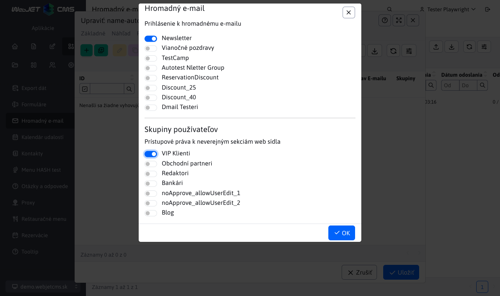
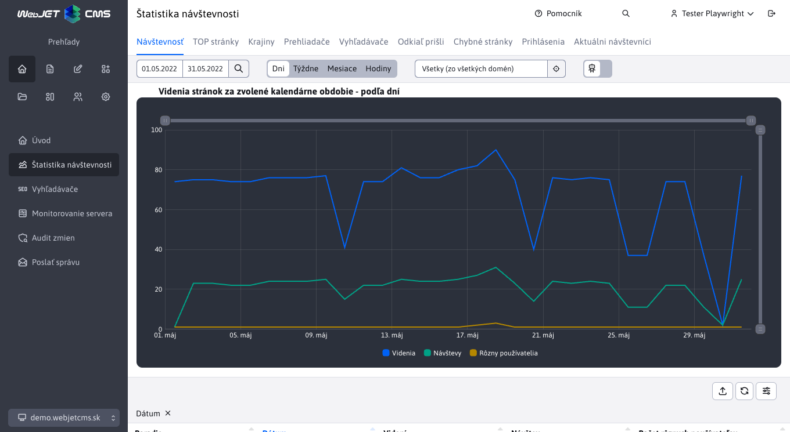

# Zoznam zmien verzia 2025

## 2025-SNAPSHOT

> Vývojová verzia

### Prelomové zmeny

- Aplikácia Kalendár noviniek oddelená do samostatnej aplikácie, ak kalendár noviniek používate je potrebné upraviť cestu `/components/calendar/news_calendar.jsp` na `/components/news-calendar/news_calendar.jsp` (#57409).
- Upravená inicializácia Spring a JPA, viac informácií v sekcii pre programátora (#43144).

### Aplikácie

Prerobené nastavenie vlastností aplikácií v editore zo starého kódu v `JSP` na `Spring` aplikácie. Aplikácie automaticky získavajú aj možnosť nastaviť [zobrazenie na zariadeniach](custom-apps/appstore/README.md#podmienené-zobrazenie-aplikácie). Dizajn je v zhode so zvyškom WebJET CMS a dátových tabuliek (#57409).

- [Anketa](redactor/apps/inquiry/README.md)
- [Bannerový systém](redactor/apps/banner/README.md)
- [Dátum a čas, Dátum a meniny](redactor/apps/app-date/README.md) - zlúčené do jednej spoločnej aplikácie
- [Dotazníky](redactor/apps/quiz/README.md)
- [Hromadný e-mail](redactor/apps/dmail/form/README.md)
- [Kalendár udalostí](redactor/apps/calendar/README.md)
- [Kalendár noviniek](redactor/apps/news-calendar/README.md)

- Zrýchlené načítanie údajov aplikácie v editore - dáta sú vložené priamo zo servera, nie je potrebné vykonať volanie REST služby (#57673).
- Upravený vizuál - názov aplikácie pri vkladaní do stránky presunutý do hlavného okna (namiesto pôvodného nadpisu Aplikácie) pre zväčšenie veľkosti plochy pre nastavenie aplikáciu (#57673).

### Hromadný e-mail

- **Presunuté pole Web stránka** – teraz sa nachádza pred poľom **Predmet**, aby sa po výbere stránky predmet automaticky vyplnil podľa názvu zvolenej web stránky (#57541).
- **Úprava poradia v karte Skupiny** – e-mailové skupiny sú teraz zobrazené pred skupinami používateľov (#57541).
- **Nové možnosti pre meno a e-mail odosielateľa** – ak sú konfiguračné premenné `dmailDefaultSenderName` a `dmailDefaultSenderEmail` nastavené, použijú sa tieto hodnoty. Ak sú prázdne, systém automaticky vyplní meno a e-mail aktuálne prihláseného používateľa. (#57541)
  - Pomocou týchto premenných je možné nastaviť **fixné hodnoty** (napr. názov spoločnosti) pre všetky [kampane](redactor/apps/dmail/campaings/README.md), bez ohľadu na to, kto je prihlásený.

- Hromadný email - optimalizácia tvorby zoznamu príjemcov - karta [skupiny](redactor/apps/dmail/campaings/README.md#pridanie-zo-skupiny) presunutá do dialógového okna. Po zvolení skupiny príjemcov ich ihneď vidíte v karte Príjemcovia a viete ich ľahko upravovať, už nie je potrebné email najskôr uložiť pre zobrazenie príjemcov (#57537).

### Kalendár noviniek

- Kalendár noviniek oddelený ako samostatná aplikácia, pôvodne to bola možnosť v aplikácii Kalendár (#57409).
- Zobrazuje kalendár napojený na zoznam noviniek s možnosťou filtrovať novinky podľa zvoleného dátumu v kalendári.

### Monitorovanie servera

- Doplnená tabuľka s informáciou o databázových spojeniach a obsadenej pamäti (#54273-61).

### Rezervácie

- **Podpora pre nadmernú rezerváciu** – umožňuje administrátorom vytvoriť viac rezervácií `overbooking` na ten istý termín (#57405).
- **Vylepšená validácia pri importe** – teraz je možné importovať [rezervácie](redactor/apps/reservation/reservations/README.md) aj do minulosti, alebo vytvoriť `overbooking` rezervácie pri importe údajov (#57405).
- **Podpora pre pridanie rezervácie do minulosti** – umožňuje administrátorom vytvoriť rezervácie v minulosti (#57389).
- Do [rezervačných objektov](redactor/apps/reservation/reservation-objects/README.md) bol pridaný stĺpec **Emaily pre notifikácie**, ktorý pre každý zadaný platný email (oddelený čiarkou) odošle email ak bola rezervácia pridaná a schválená (#57389).
- Notifikáciám pre potvrdenie rezervácie a ďalším systémovým notifikáciám je možné nastaviť meno a email odosielateľa pomocou konfiguračných premenných `reservationDefaultSenderName,reservationDefaultSenderEmail` (#57389).
- Pridaná nová aplikácia [Rezervácia dní](redactor/apps/reservation/day-book-app/README.md), pre rezerváciu celodenných objektov na určitý interval pomocou integrovaného kalendára (#57389).

### Oprava chýb

- Hromadný email - pri duplikovaní kampane doplnené duplikovanie zoznamu príjemcov (#57533).
- Dátové tabuľky - import - upravená logiky **Preskočiť chybné záznamy** pri importe tak, aby sa pri tejto možnosti spracovali aj generické chyby `Runtime` a zabezpečilo sa dokončenie importu bez prerušenia. Tieto chyby sa následne zobrazia používateľovi pomocou notifikácie v priebehu importovania (#57405).
- Súbory - opravený výpočet veľkosti súborov/priečinkov v pätičke prieskumníka a pri zobrazení detailu priečinka (#57669).
- Navigácia - opravená navigácia pomocou kariet v mobilnom zobrazení (#57673).

### Pre programátora

!> **Upozornenie:** upravená inicializácia Spring a JPA, postupujte podľa [návodu v sekcii inštalácia](install/versions.md#zmeny-pri-prechode-na-20250-snapshot).

Iné zmeny:

- Pridaná možnosť vykonať [doplnkový HTML/JavaScript kód](custom-apps/appstore/README.md#doplnkový-html-kód) v Spring aplikácii s anotáciou `@WebjetAppStore` nastavením atribútu `customHtml = "/apps/calendar/admin/editor-component.html"` (#57409).
- V datatable editore pridaný typ poľa [IMAGE_RADIO](developer/datatables-editor/standard-fields.md#image_radio) pre výber jednej z možnosti pomocou obrázka (#57409).
- Pridaná podpora pre získanie mena a emailu odosielateľa pre rôzne emailové notifikácie použitím `SendMail.getDefaultSenderName(String module, String fallbackName), getDefaultSenderEmail(String module, String fallbackEmail)` (#57389).
- Pridaná možnosť nastaviť koreňový priečinok pre [pole typu JSON](developer/datatables-editor/field-json.md) vo formáte ID aj cesty: `@DataTableColumnEditorAttr(key = "data-dt-field-root", value = "/Aplikácie/Atribúty stránky")` alebo `@DataTableColumnEditorAttr(key = "data-dt-field-root", value = "26")`.
- Spustenie úloh na pozadí sa vykoná až po kompletnej inicializácii vrátane `Spring` (#43144).
- Doplnená možnosť nastaviť [všetky vlastnosti HikariCP](install/setup/README.md#vytvorenie-db-schémy) (#54273-61).
- Doplnená kontrola, či databázový ovládač podporuje nastavenie sekvencií (#54273-61).
- Upravená funkcia `WJ.headerTabs`, ak počúvate na zmenu karty odporúčame použiť udalosť typu `$('#pills-tabsFilter a[data-wj-toggle="tab"]').on('click', function (e) {`, kde v `e` získate kartu, na ktorú sa kliklo (#56845-20250325).

### Testovanie

- Média - doplnený test vkladania médii vo web stránke ak používateľ nemá právo na všetky média (#57625).
- Web stránky - doplnený test vytvorenia novej stránky s publikovaním v budúcnosti (#57625).
- Galéria - doplnený test vodoznaku s porovnaním obrázku, doplnený test kontroly práv (#57625).
- Web stránky - doplnený test voliteľných polí pri vytváraní web stránky (#57625).

## 2025.0.x

> Opravná verzia pôvodnej verzie 2025.0.

### Oprava chýb

- Dátové tabuľky - opravené chybné zobrazenie kariet, ktoré sa nemajú zobrazovať pri vytváraní nového záznamu (napr. v šablónach) (#57533).
- Dátové tabuľky - doplnený limit počtu záznamov pri zobrazení všetky. Hodnota je zhodná s maximálnym počtom riadkov pre exportu, nastavuje sa v konfiguračnej premennej `datatablesExportMaxRows` (#57657-2).
- Dátové tabuľky - opravený počet záznamov na strane keď stránka obsahuje navigačné karty (#57725-1).
- Dátové tabuľky - opravený nadpis Duplikovať namiesto Upraviť pri duplikovaní záznamu, upravená ikona tlačidla na duplikovanie (#57725-3).
- Editor obrázkov - pri editácii obrázku zo vzdialeného servera doplnená notifikácia o potrebe stiahnutia obrázka na lokálny server (#57657-2).
- Web stránky - opravené vloženie bloku obsahujúce aplikáciu (#57657-2).
- Web stránky - doplnený `ninja` objekt pri vkladaní aplikácie do novej web stránky (#57389).
- Web stránky - stránky v koši sa už nebudú zobrazovať v karte Neschválené, ak schvaľovateľ klikne na odkaz v emaile zobrazí sa chyba Stránka je v koši, aby sa náhodou neschválila stránka, ktorá bola medzi tým zmazaná (#54273-62).
- Web stránky - schvaľovanie - opravené načítanie zoznamu v karte Neschválené pri použití databázového servera `Oracle` (#54273-62).
- Aplikácie - opravené zobrazenie karty prekladové kľúče pri použití komponenty `editor_component_universal.jsp` (#54273-57).
- Aplikácie - pridaná podpora vkladania nového riadku cez klávesovú skratku `SHIFT+ENTER` do jednoduchého textového editora používaného napr. v Otázky a odpovede (#57725-1).
- Prihlásenie - opravená chyba prihlásenia pri exspirovaní časovej platnosti hesla (#54273-57).
- Prihlásenie - opravené prihlásenie v multiweb inštalácii (#54273-57).
- GDPR - opravené zobrazenie karty Čistenie databázy pri použití `Oracle/PostgreSQL` databázy (#54273-57).
- Archív súborov - opravené zobrazenie ikon v dialógu dátumu a času (#54273-57).
- Bezpečnosť - aktualizovaná knižnica `Swagger UI` na verziu `5.20.0`, doplnené výnimky v `dependency-check-suppressions.xml`.
- Aktualizácia - doplnené mazanie nepotrebných súborov pri aktualizácii rozbalenej verzie (#57657-4).
- Multiweb - doplnená kontrola `ID` domény pri registrácii návštevníka web sídla (#57657-4).
- Používatelia - pridaná možnosť vybrať aj Koreňový priečinok v právach používateľa v sekcii Nahrávanie súborov do adresárov (54273-60).

## 2025.0

> Vo verzii **2025.0** sme priniesli **nový dizajn administrácie** pre ešte lepšiu prehľadnosť a používateľský komfort.
>
> Jednou z hlavných zmien je presunutie **druhej úrovne menu** do **kariet v hlavičke stránky**, čím sa zjednodušila navigácia. Vo webových stránkach sme tiež **zlúčili karty priečinkov a webových stránok**, aby ste mali všetko prehľadne na jednom mieste. Ak hlavička neobsahuje karty, tabuľky sa automaticky prispôsobia a zobrazia **riadok navyše**.
>
> Prosíme vás o spätnú väzbu prostredníctvom **formulára Spätná väzba**, ak pri používaní novej verzie identifikujete **akýkoľvek problém so zobrazením**. Pripomienku môžete doplniť aj o **fotku obrazovky**, čo nám pomôže rýchlejšie identifikovať a vyriešiť prípadné nedostatky.
>
> Ďakujeme za spoluprácu a pomoc pri vylepšovaní WebJET CMS!

### Prelomové zmeny

- Web stránky - zrušená inline editácia. Možnosť priamej editácie stránky v režime jej zobrazenia bola odstránená, keďže využívala staršiu verziu editora, ktorá už nie je podporovaná. Ako alternatívu je možné aktivovať [nástrojový panel](redactor/webpages/editor.md#nástrojový-panel) zobrazovaný v pravom hornom rohu webovej stránky. Tento panel umožňuje rýchly prístup k editoru web stránky, priečinka alebo šablóny. Môžete vypnúť alebo zapnúť pomocou konfiguračnej premennej `disableWebJETToolbar`. Po aktivácii sa začne zobrazovať na web stránke po vstupe do sekcie Webové stránky v administrácii (#57629).

- Prihlásenie - pre administrátorov nastavená [požiadavka na zmenu hesla](sysadmin/pentests/README.md#pravidlá-hesiel) raz za rok. Hodnotu je možné upraviť v konfiguračnej premennej `passwordAdminExpiryDays`, nastavením na hodnotu 0 sa kontrola vypne (#57629).
- Úvod - pridaná požiadavka na aktivácii dvojstupňového overovania pre zvýšenie bezpečnosti prihlasovacích údajov. Výzva sa nezobrazuje, ak je overovanie riešené cez `LDAP` alebo ak je prekladový kľúč `overview.2fa.warning` nastavený na prázdnu hodnotu (#57629).

### Dizajn

Vo verzii **2025.0** sme priniesli vylepšený **dizajn administrácie**, ktorý je prehľadnejší a efektívnejší.

**Upravený prihlasovací dialóg** – nové pozadie a presunutie prihlasovacieho dialógu na pravú stranu. Na **prihlásenie** je možné použiť nielen prihlasovacie meno ale **už aj email adresu**.

**Prehľadnejšia hlavička** – názov aktuálnej stránky alebo sekcie sa teraz zobrazuje priamo v hlavičke.

**Nová navigácia v ľavom menu** – pod položky už nie sú súčasťou ľavého menu, ale zobrazujú sa **ako karty v hornej časti** stránky.

**Zlúčené karty v sekcii Webové stránky** – prepínanie typov priečinky a typov web stránok sa teraz zobrazujú v spoločnej časti, čím sa zjednodušila navigácia. **Výber domény** bol presunutý na spodnú časť ľavého menu.
  

**Preorganizované menu položky**:
  - **SEO** presunuté do sekcie **Prehľady**.
  - **GDPR a Skripty** presunuté do sekcie **Šablóny**.
  - **Galéria** je teraz v sekcii **Súbory**.
  - Niektoré názvy položiek boli upravené, aby lepšie vystihovali ich funkciu.

### Web stránky

- Pridaná možnosť nastaviť inkrement poradia usporiadania pre priečinky v konfiguračnej premennej `sortPriorityIncrementGroup` a web stránky v konfiguračnej premennej `sortPriorityIncrementDoc`. Predvolené hodnoty sú 10 (#57667-0).

### Testovanie

- Štandardné heslo pre `e2e` testy sa získa z `ENV` premennej `CODECEPT_DEFAULT_PASSWORD` (#57629).

### Oprava chýb

- Webové stránky - vkladanie odkazov na súbor v PageBuilder (#57649).
- Webové stránky - doplnené informácie o odkaze (typ súboru, veľkosť) do atribútu Pomocný titulok `alt` (#57649).
- Webové stránky - opravené nastavenie poradia usporiadania web stránok pri použití `Drag&Drop` v stromovej štruktúre (#57657-1).
- Webové stránky - pri duplikovaní webovej stránky/priečinka sa nastaví hodnota `-1` do poľa Poradie usporiadania pre zaradenie na koniec zoznamu. Hodnotu `-1` môžete zadať aj manuálne pre získanie novej hodnoty poradia usporiadania (#57657-1).
- Webové stránky - import webových stránok - opravené nastavenie média skupín pri importe stránok obsahujúcich média. Pri importe sa automaticky vytvoria všetky Média skupiny (aj nepoužívané) z dôvodu, že sa pri importe stránok prekladá aj média skupina nastavená pre média aplikáciu `/components/media/media.jsp` v stránke (tá môže obsahovať aj ID média skupiny mimo importovaných stránok) (#57657-1).
- Firefox - znížená verzia sady `Tabler Icons` na `3.0.1`, pretože Firefox pri použití novších verzií výrazne zaťažuje procesor. Optimalizované čítanie CSS štýlu `vendor-inline.style.css` (#56393-19).

Zvyšný zoznam zmien zmien je zhodný s verziou [2024.52](CHANGELOG-2024.md).

