# Zoznam zmien verzia 2026

## 2026.0-SNAPSHOT

> Vývojová verzia aktualizovaná z main repozitára.

### Prelomové zmeny

- Z administrácie bola odstránená závislosť na knižnici [Vue.js](https://vuejs.org). Pred aktualizáciou odporúčame overiť kompatibilitu vlastných aplikácií. Veľkosť JavaScript súborov sa zmenšila o cca 170kB, čo má dopad aj na rýchlosť inicializácie administrácie. Viac v [sekcii pre programátora](#pre-programátora).
- AspectJ - z distribúcie bola odstránená podpora `load-time weavingu` (`aspectjweaver` a `META-INF/aop-ajc.xml`); vstavané aspekty sa spracujú už pri kompilácii, viac v [sekcii pre programátora](#pre-programátora). Pri použití v MultiWeb inštalácii môžete odstrániť `-javaagent:/www/tomcat/.../aspectjweaver.jar` nastavenie z `JAVA_OPTS` v aplikačnom serveri (#290).
- Export obsahu pre Flash - odstránená bola historická funkcia generovania XML súborov `/flash_xml/{docId}.xml` pri publikovaní stránky. Konfiguračná premenná `exportFlash` už nie je podporovaná a jej definovanie v `SpringConfig` funkciu neobnoví (#293).
- Microsoft SQL Server - ukončená bola podpora verzií starších ako 2012 a odstránená konfiguračná premenná `mssqlUseOldTopQuery`. WebJET CMS vyžaduje Microsoft SQL Server 2012 alebo novší, starý spôsob stránkovania pomocou `TOP` už nie je podporovaný (#293).

### Webové stránky

- Kôš webových stránok - pridané [automatické mazanie starých stránok a priečinkov](redactor/apps/gdpr/data-deleting.md) z koša podľa nastaveného retenčného obdobia. Pridaná možnosť mazania stránok a priečinkov v koši aj v sekcii [Mazanie dát](sysadmin/data-deleting/README.md) podľa zvoleného rozsahu dátumov. Zjednotená logika výpočtu počtu a mazania, opravené trvalé odstránenie priečinka koša a prázdnych priečinkov (#271).

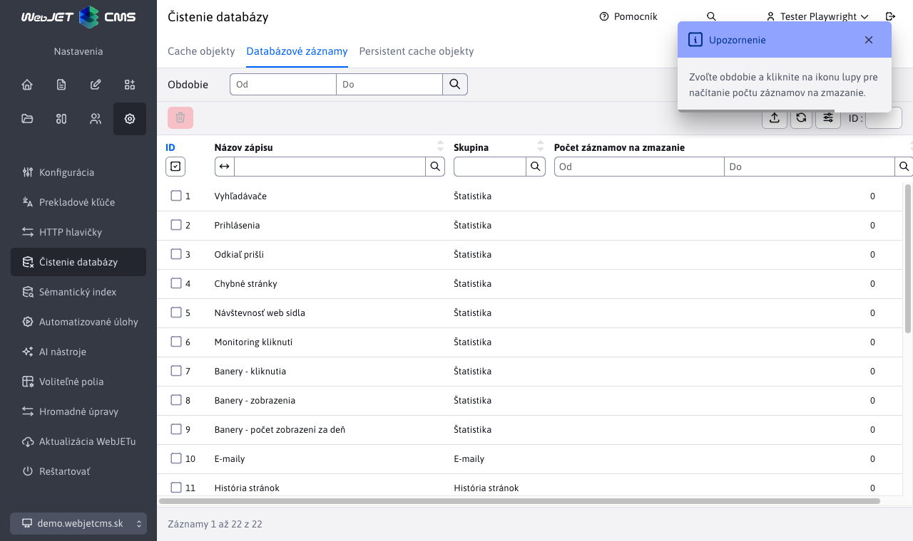

- Presmerovania - presmerovania vytvorené používateľom sú odlíšené od automatických (označené sivým pozadím) a je možné ich samostatne [filtrovať v zozname presmerovaní](redactor/webpages/redirects/README.md#automatické-a-používateľom-vytvorené-presmerovania) (#58625).

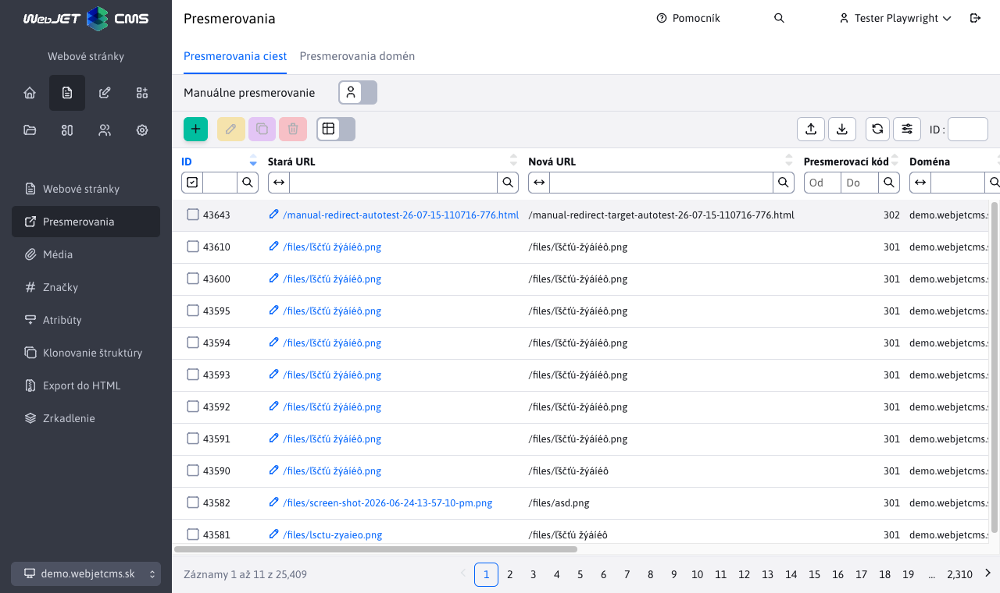

- SEO - pridané samostatné nastavenie **Nasledovanie odkazov vyhľadávačmi** s možnosťami **Podľa nastavenia Prehľadávať**, **Povoliť nasledovanie odkazov** (`follow`) a **Zakázať nasledovanie odkazov** (`nofollow`). HTTP hlavička `X-Robots-Tag` a Ninja `${ninja.page.robots}` používajú rovnakú logiku: pri indexovaní bez obmedzení vrátia `all`, inak kombináciu direktív `noindex` a `nofollow` podľa nastavenia stránky. Viac v [dokumentácii Ninja](frontend/ninja-starter-kit/ninja-jv/page/README.md#nastavenie-indexovania-string) (#OSK563).
- SEO - v [skupinách šablón](frontend/templates/template-groups.md#karta-seo) je možné nastaviť predvolený SEO opis, obrázok a alternatívny text obrázka. Objekt Ninja `Page` ich použije, ak stránka nemá zadané vlastné hodnoty; pribudla aj hodnota `${ninja.page.seoImageAlt}` pre `og:image:alt` (#OSK593).

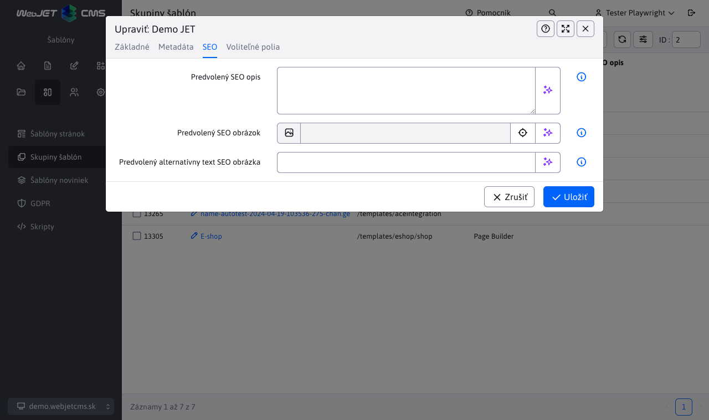

- Ninja - doplnené [generovanie rozmerov](frontend/ninja-starter-kit/ninja-bp/README.md) SEO obrázka `og:image:width` a `og:image:height` (#OSK563).
- Šablóny - pridaná možnosť nastaviť presun `<style>` a `<link rel="stylesheet">` značiek z tela stránky do `<head>` cez [voľbu v šablóne](frontend/templates/templates.md) s podporou globálnej konfiguračnej premennej `showDocMoveStyleToHead`. Bloky v IE podmienkach, `noscript` a `script` zostávajú na mieste (#231).

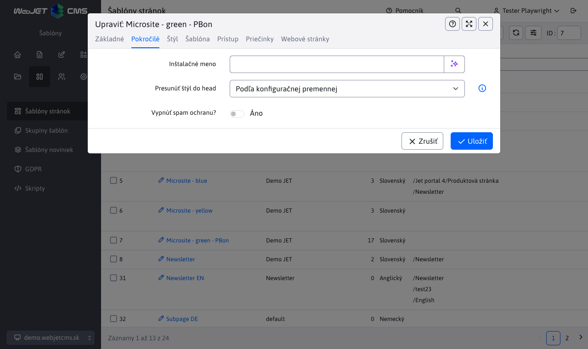

- V dialógu vkladania obrázkov pridaná karta **Miniatúra** pre nastavenie parametrov [generovania zmenšených obrázkov](redactor/webpages/working-in-editor/README.md#karta-miniatúra) `thumbnail` (#58317).

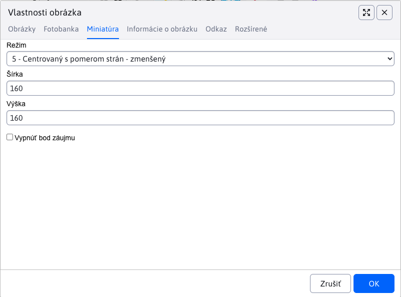

- V dialógu vkladania odkazu pridaná karta [Manažér dokumentov](redactor/files/file-archive/README.md) pre jednoduché vkladanie odkazov na súbory v manažérovi dokumentov, nahrávanie nových súborov a ich správu. Viac sa dozviete v časti [Odkazy na súbory a nahrávanie súborov](redactor/webpages/working-in-editor/README.md#odkazy-na-súbory-a-nahrávanie-súborov) (#58593).

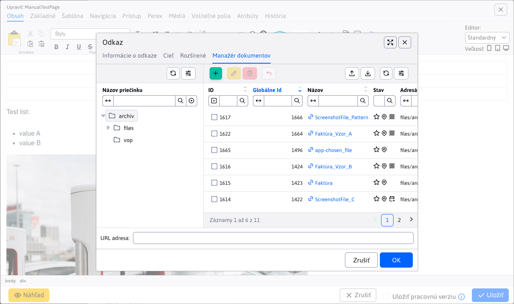

- Súbory Manažéra dokumentov v priečinku `/files/archiv` sú v dialógoch vkladania odkazu a obrázka dostupné iba na zobrazenie a výber. Nahrávanie, premenovanie, mazanie a ostatné úpravy je možné vykonať len cez [Manažér dokumentov](redactor/files/file-archive/README.md).

- [Fotobanka](redactor/webpages/working-in-editor/README.md#karta-fotobanka) - pri sťahovaní obrázka z fotobanky je možné nastaviť názov súboru. Názov sa automaticky predvyplní a očistí, prípona sa určí podľa zdrojového obrázka a existujúci súbor sa neprepíše. Pridaná aj podpora výberu typu a kategórie obrázku a možnosť hľadať video súbory (#58645).

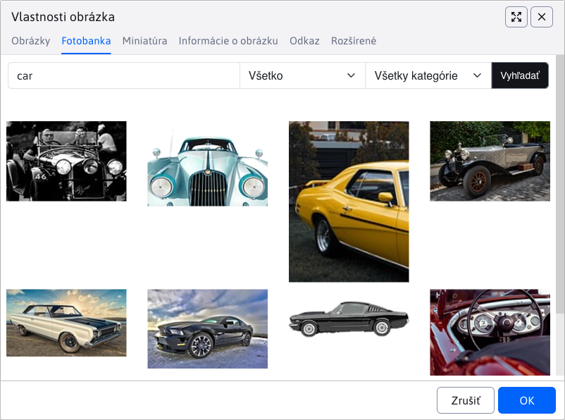

### Headless režim

Pridaná [podpora headless režimu](frontend/headless/README.md), v ktorom WebJET CMS slúži čisto ako `backend` CMS. Obsah, navigácia, vyhľadávanie a formuláre sú dostupné cez REST API. Frontend aplikácia (napr. Astro, Next.js, Vue, React alebo akýkoľvek HTTP klient) si dáta stiahne a zobrazuje ich podľa vlastných šablón (#258).


V jednom WebJET CMS v môžete mať viacero (desiatky) domén a následne mať menšie web stránky vytvorené v rôznych technológiách, ktoré konzumujú a zobrazujú obsah z CMS systému. Podporované je aj vkladanie štandardný aplikácií ako foto galéria, formuláre, GDPR cookies a podobne.

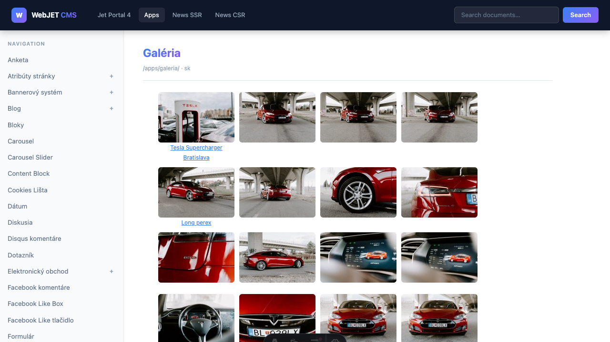

- Presmerovania - pridané [čistenie a optimalizácia presmerovaní](redactor/webpages/redirects/README.md#čistenie-presmerovaní) s náhľadom zmien pred vykonaním. Čistenie odstraňuje staré, duplicitné a cyklické presmerovania a skracuje reťazce presmerovaní (#58629).


### Formuláre

- [Štatistiky viackrokových formulárov](redactor/apps/multistep-form/stat.md) boli rozšírené o dátumový filter a pokročilé metriky zobrazení/pokusov/jazykov etc. (#58509).

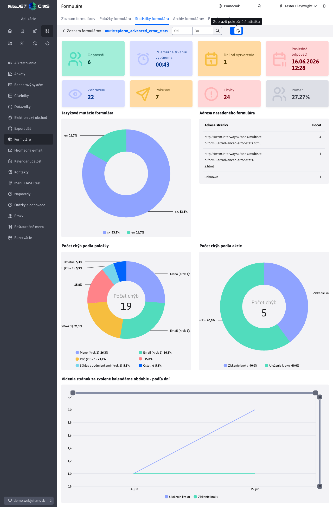

- Do viackrokových formulárov pridaná možnosť jednoducho nastavovať výberové polia a skupiny zaškrtávacích / výberových polí (#58517).

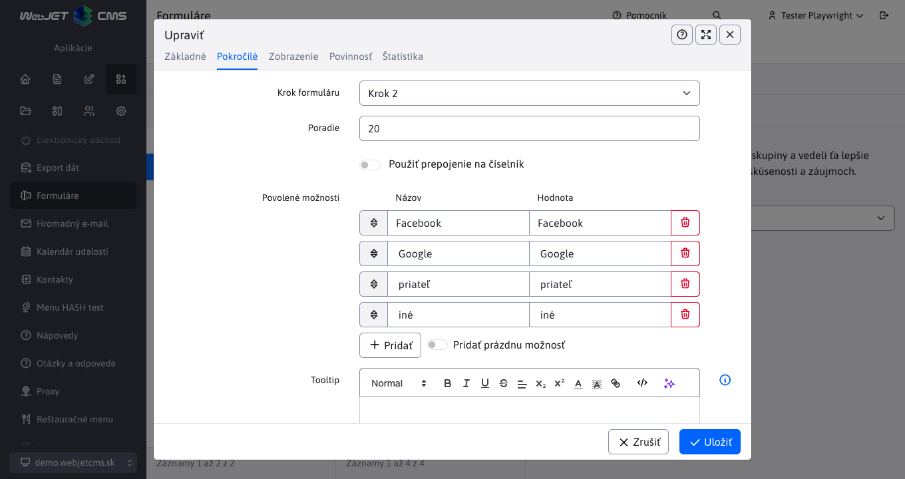

- Do viackrokových formulárov pridaná možnosť prepojenia výberového poľa a skupiny zaškrtávacích / výberových polí na číselník (#58517).


- Pridaná možnosť vo formulári nastaviť maximálnu kombinovaná veľkosť súboru, pôvodne sa dala nastavovať len veľkosť pre súbor, ak formulár obsahuje viac súborov je možné nastaviť maximálnu veľkosť pre všetky súbory spoločne (#58517).
- [Viackrokové formuláre](redactor/apps/multistep-form/README.md) - pridané duplikovanie celého formulára vrátane nastavení, krokov a položiek. Editor položiek zobrazuje ich automaticky vytvorený identifikátor a podporuje vlastnú chybovú správu, orezanie medzier, prázdnu možnosť vo výberovom zozname a nový typ poľa automatické dopĺňanie s vyhľadávaním bez rozlíšenia diakritiky (#osk573).
- [Viackrokové formuláre](redactor/apps/multistep-form/README.md) - do úvodného textu kroku a [stránky s verziou pre email](redactor/apps/form/README.md#karta---nastavenia) je možné vložiť hodnoty položiek pomocou značiek. Opravené bolo rozpoznávanie polí mena a emailu podľa začiatku identifikátora, spracovanie jazyka, reCAPTCHA v3, nezávislé vloženie viacerých inštancií formulára na jednu stránku a vymazanie všetkých odpovedí bez odstránenia definície formulára (#osk573).
- [Viackrokové formuláre](redactor/apps/multistep-form/README.md) - pridaná možnosť zadať vlastnú chybovú správu a orezať medzery na začiatku a konci textu zadaného návštevníkom (#osk573).

### Sémantické vyhľadávanie

- Pridaná podpora [sémantického vyhľadávania](redactor/apps/semantic-search/README.md) postaveného na technológii vektorovej databázy `pgvector` a `OpenAI embeddings`. Umožňuje návštevníkom nájsť relevantné stránky na základe **významu otázky**, nielen zhody kľúčových slov (#211).

- Doplnený hybridný režim sémantického vyhľadávania a voliteľná RAG odpoveď z indexovaného obsahu. Aplikácia **Vyhľadávanie** má nové nastavenia pre typ vyhľadávania, hybridné správanie, výber AI asistenta a limity kontextu odpovede (#58521).

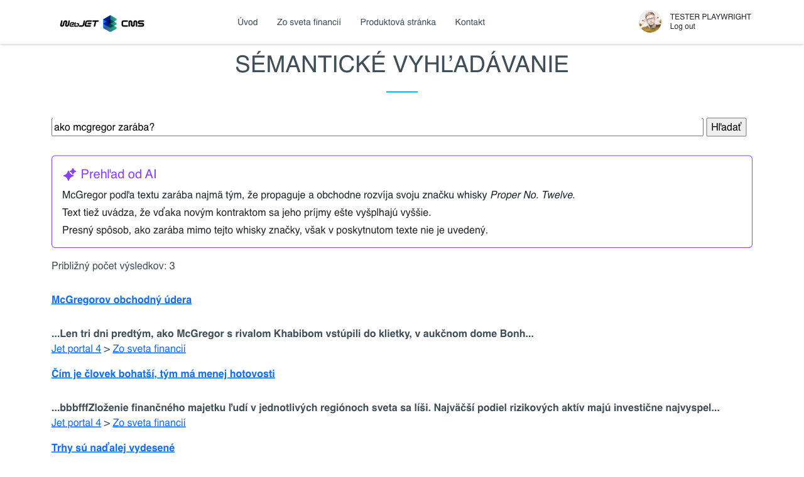

- Embedding indexovanie a vyhľadávanie používa poskytovateľa a model nastavený v systémovom AI asistentovi. Indexy rôznych poskytovateľov a modelov môžu existovať súčasne; stránka **Sémantický index** zobrazuje aktuálne nastavenie a pri opätovnom indexovaní zachová ostatné kombinácie. Jadro embedding požiadaviek, odpovedí a komunikácie s poskytovateľmi bolo vyčlenené do knižnice `webjet-ai`; WebJET CMS naďalej zabezpečuje výber asistenta, indexovanie a uloženie vektorov (#58694).

### Aplikácie

- Číselníky - pre pomenované reťazcové polia je možné v novej karte [Typy reťazcových polí](redactor/apps/enumeration/README.md#karta-typy-reťazcových-polí) nastaviť typ poľa, možnosti výberu, povinnosť, pomocný text a obmedzenia dĺžky rovnako ako pri voliteľných poliach. Ponuka a názvy konfigurácií vychádzajú z poslednej uloženej verzie typu číselníka. Nepomenované polia zostávajú skryté, nevyhodnocujú sa ako povinné a polia bez špecifickej konfigurácie sa zobrazia ako bežný text. Staršie vlastné Excel šablóny a integrácie REST API je potrebné upraviť z atribútov `string1` až `string12` na `fieldA` až `fieldL` (#58641).

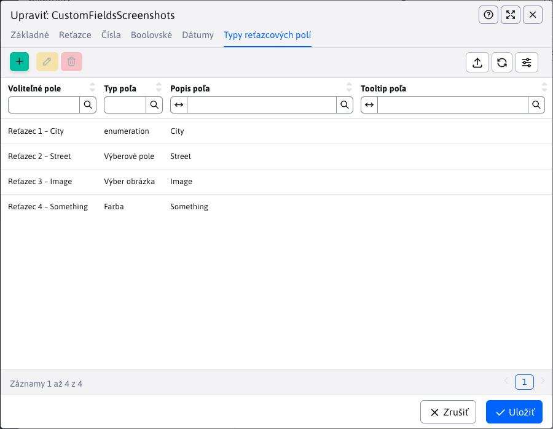

- Elektronický obchod - pridaná aplikácia [Štatistiky](redactor/apps/eshop/stats/README.md) so súhrnnými ukazovateľmi, filtrovaním podľa stavu, meny a obdobia a grafmi tržieb, produktov, kategórií, spôsobov doručenia a platobných metód (#58065).

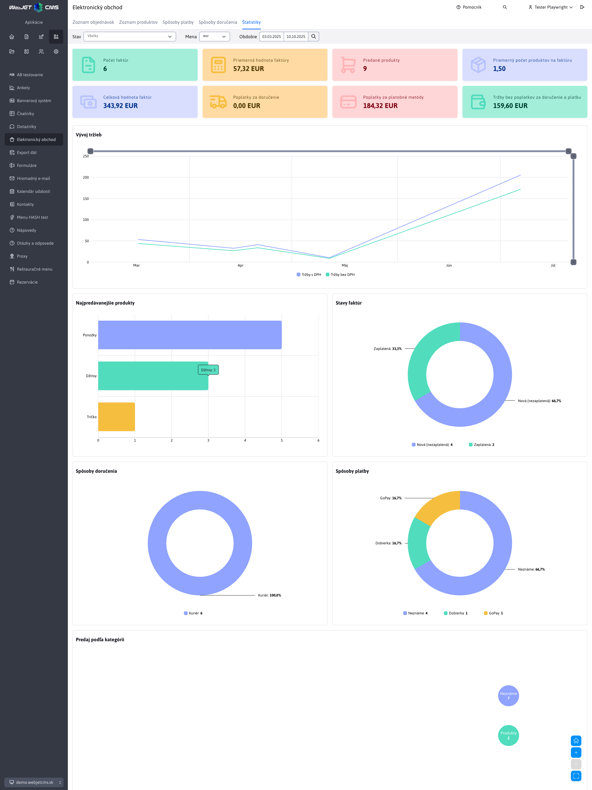

- Pridaná nová aplikácia [Presmerovanie podľa jazyka](redactor/apps/language-redirect/README.md) na automatické presmerovanie návštevníkov na jazykovú verziu stránky podľa detekcie jazyka z HTTP hlavičky `Accept-Language`. Podporuje až 8 priradení jazykov na URL adresy, rešpektovanie jazykového cookie a možnosť presmerovania len na koreňovej URL (#58497).

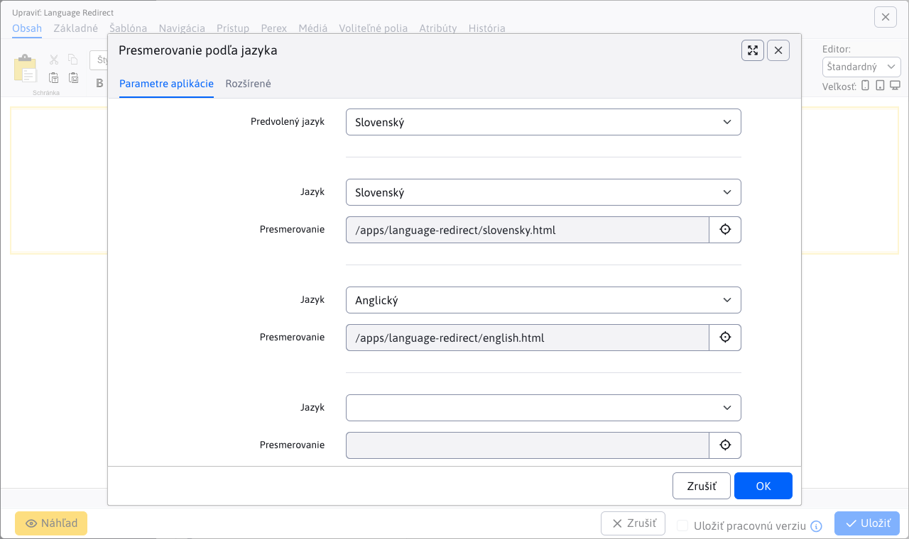

- Rezervácie - aplikácie **Rezervácia času** a **Rezervácia dní** majú zjednotený vizuálny štýl podľa kalendára `Vanilla Calendar`, upravené kontrastné farby buniek podľa `WCAG`, oddelené vizuálne CSS štýly do samostatných súborov a **Rezervácia času** zobrazuje v hodinových bunkách skutočnú cenu podľa cenníka rezervačného objektu (#58565).

- Rezervácie - pridaná nová aplikácia [Moje rezervácie](redactor/apps/reservation/my-reservations-app/README.md), ktorá prihlásenému používateľovi zobrazí prehľad jeho rezervácií, stavom rezervácie a možnosťou zmazania povolených budúcich rezervácií (#58565).

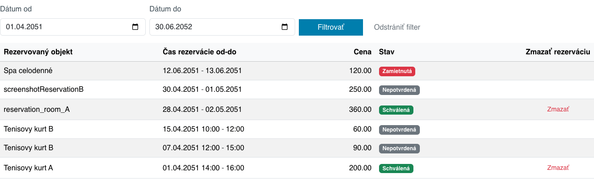

- Manažér dokumentov - pridané zobrazenie stromovej štruktúry priečinkov (#58593).

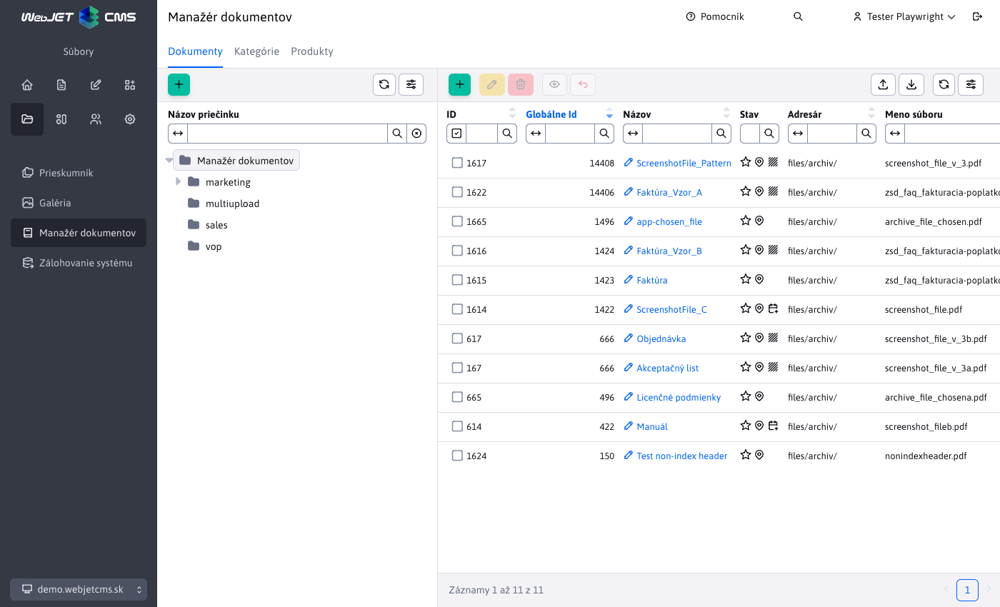

- Manažér dokumentov - pridaná možnosť nahrať viac súborov naraz cez `drag&drop` (#58593).

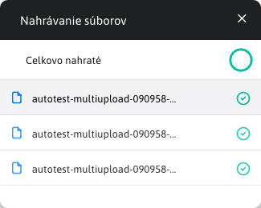

### Galéria

- Pridaná možnosť nastaviť samostatný spôsob [zmeny veľkosti pre veľký obrázok](redactor/apps/gallery/structure.md#karta-rozmery) nezávisle od malého obrázka. Predvolene sa použije spôsob zmeny veľkosti rovnako ako je nastavené pre malý obrázok. Nastavenie je možné voliteľne prekopírovať aj do podpriečinkov (#58633).

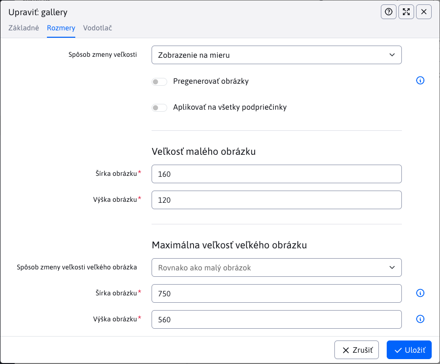

### Voliteľné polia

- Kompletne implementovaná funkčnosť [nastavenia voliteľných polí](frontend/webpages/customfields/custom-fields-settings.md). Umožňuje centrálne nastaviť vlastnosti polí bez editácie prekladových kľúčov. Podporované sú všetky typy polí (text, textarea, select, multiselect, autocomplete, enumeration, obrázok, odkaz, JSON a ďalšie) s typovo špecifickými nastaveniami ako maximálna dĺžka textu, možnosti výberu, prepojenie na číselníky alebo závislosť na iných poliach. Používateľské rozhranie ponúka aj jednoduchý spôsob nastavenia možných hodnôt pre výberové/autocomplete polia (#58529).

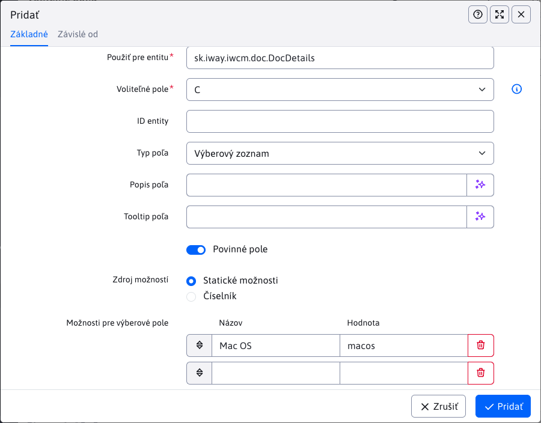

- Pridaná možnosť nastaviť voliteľné pole ako povinné (#58413).
- Pridané nové typy voliteľných polí [prepínač a zaškrtávacie pole](frontend/webpages/customfields/custom-fields-settings.md#rozdiel-medzi-selectmultiselect-a-radiocheckbox) s podporou statických možností aj prepojenia na číselník. Typ `multiselect` teraz tiež podporuje [prepojenie na číselník](frontend/webpages/customfields/custom-fields-settings.md#zdroj-možností). Pôvodný typ `enumeration` bol nahradený prepínačom zdroja možností pri typoch `select`, `multiselect`, `radio` a `checkbox` kde sa pre všetky tieto typy polí načítajú možnosti z prepojeného číselníka (#58637).

### Prístupnosť

- Administrácia - rozšírené ovládanie klávesnicou a podpora čítačiek obrazovky pre dátové tabuľky, modálne okná a notifikácie, bublinová nápoveda, výber dátumu a farby a HTML editor. Upravené bolo presúvanie a vracanie zamerania, výber riadkov a buniek, prístupné názvy a ARIA stavy, označenie povinných polí, kontrasty ovládacích prvkov a odkaz na preskočenie na hlavný obsah. Doplnené boli automatizované regresné `a11y` testy pre tieto scenáre (#235).

### Multiweb

- Pridaná možnosť [vytvoriť novú doménu](install/multiweb/config.md) z riadiacej domény, vytvorí aj používateľa, skupinu šablón, šablónu a systémové stránky (#58525).
- Pridané zobrazenie zoznamu skupín šablón (#58525).
- V riadiacej doméne je možné upravovať všetky presmerovania domén.
- V riadiacej doméne pridaná možnosť zobraziť všetky súbory.

### Iné menšie zmeny

- Monitorovanie servera - v aktuálnych hodnotách bola pridaná sekcia [Kódovanie znakov](sysadmin/monitoring/README.md#kódovanie-znakov), ktorá zobrazuje kódovanie HTTP odpovedí, JVM a locale prostredie bežiaceho procesu aplikačného servera (#305).
- Konfigurácia - pridaný hierarchický strom konfiguračných premenných s pohľadmi **Zmenené**, **Zákaznícke**, **Všetky** a modulovými vetvami (#293).
- Konfigurácia - pridaná možnosť **Nastaviť dočasne**, ktorá nastaví hodnotu konfiguračnej premennej len na aktuálnom uzle bez uloženia do databázy. Po reštarte sa obnoví hodnota uložená v databáze (#291).

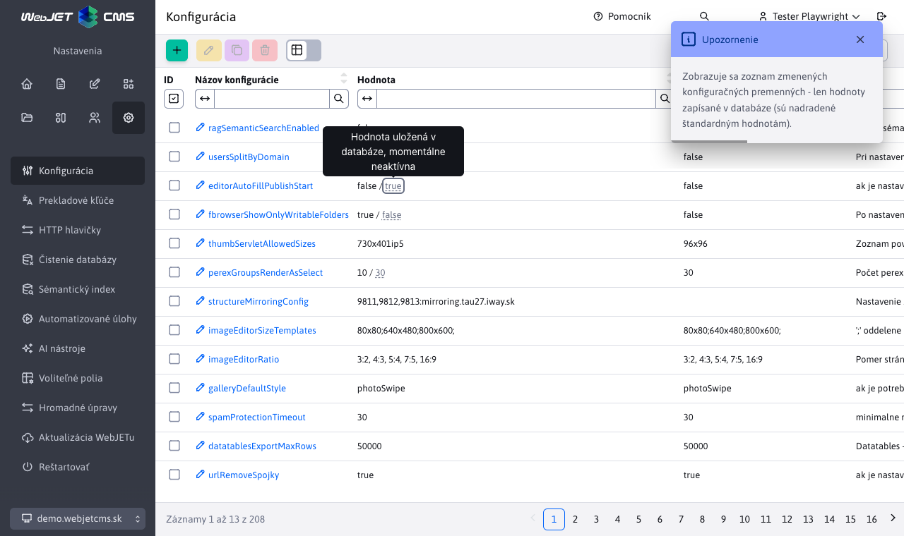

- Automatizované úlohy - pridaná možnosť [manuálne spustiť úlohu](admin/settings/cronjob/README.md) na uzle alebo skupine uzlov nastavenej v poli **Beží na uzle**. Pôvodné lokálne spustenie na aktuálnom uzle zostáva dostupné samostatným tlačidlom (#58718).

- Prekladové kľúče - pridaná stromová štruktúra prefixov prekladových kľúčov s filtrovaním zoznamu podľa zvoleného prefixu (#58714).

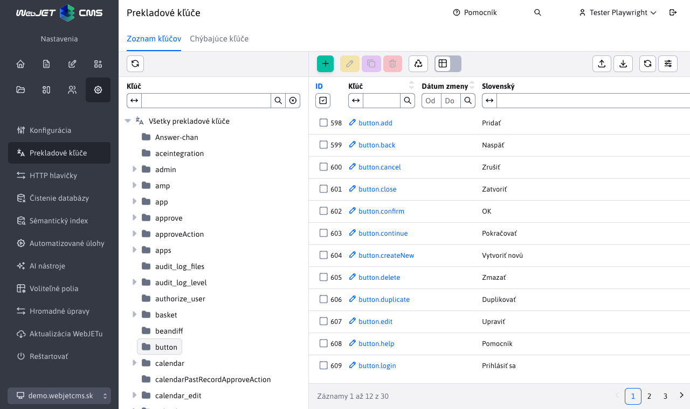

- Prieskumník - vo vlastnostiach priečinka pridaná karta [Nepoužívané súbory](redactor/files/fbrowser/folder-settings/README.md#nepoužívané-súbory) na vyhľadanie a zmazanie nepoužívaných súborov (#58621).

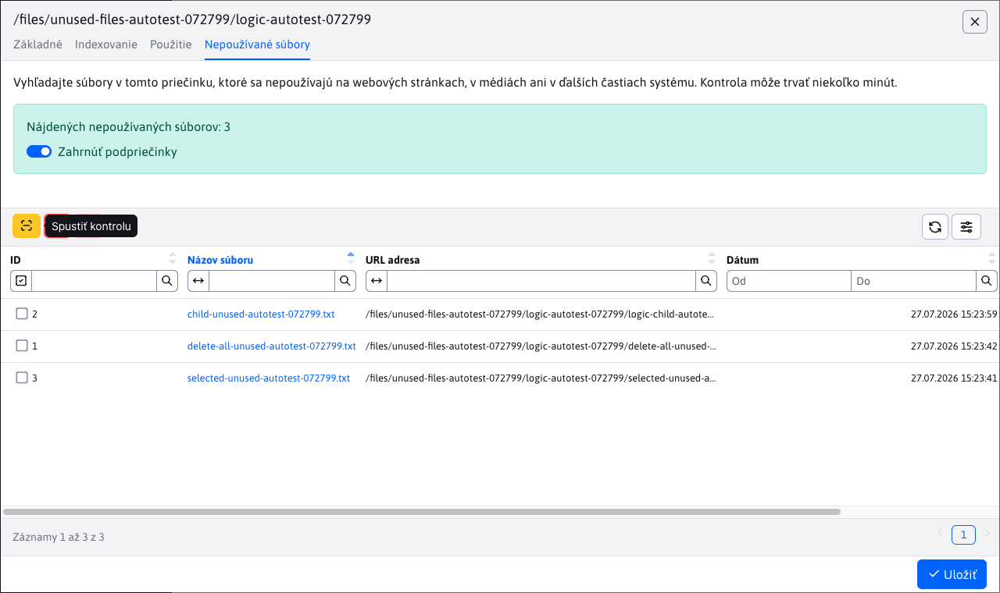

- Prieskumník - pridané právo **Povoliť nahrávanie súborov s diakritikou**, ktoré umožňuje zachovať diakritiku pri nahrávaní, vytváraní a premenovaní súborov a priečinkov v priečinkoch `/files`, `/images` a `/shared`. Bez tohto práva sa názvy naďalej automaticky upravia bez diakritiky (#58589).
- Prihlásenie - zrýchlené načítanie úvodnej stránky v administrácii - pridaná vyrovnávacia pamäť pre zoznam posledných stránok, zmenených stránok a auditných záznamov (#58589).
- Export/import súborov - upravený dizajn dialógového okna a responzívne zobrazenie formulárových polí podľa aktuálneho dizajnu administrácie (#58581).
- Grafy - pridaný nový stromový graf [`TreeChartForm`](developer/frameworks/charts/frontend/statjs.md#graf-typu-tree) pre vizualizáciu hierarchických dát s približovaním, rozbaľovaním a maximalizovaním (#58065).
- Google reCaptcha - doplnená podpora vkladania viacerých viac krokových formulárov do stránky, podporovaný je režim `invisible/reCaptcha/reCaptchaV3`, upravené chybové hlásenie na zrozumiteľnejší text (#osk573).
- Webové stránky - doplnené zvýraznenie elementu nad ktorým je vyvolané kontextové menu. Dôležité ak chcete vykonať akciu Zmazať element, aby ste presne videli ktorý element je označený (#OSK675).
- Multiweb - doplnená možnosť premenovať existujúcu doménu + presmerovanie po premenovaní (#58317-15).
- Multiweb - upravené [zobrazenie skupín šablón](install/multiweb/README.md) podľa dostupných šablón a aliasu aktuálnej domény (#58317-17).
- Štatistika - nastavený dátum/rozsah od-do sa ukladá v prehliadači a je zapamätaný aj po odhlásení/reštarte prehliadača (#58065).
- Štatistika - prehliadače sa ukladajú bez často sa meniaceho čísla verzie. Doplnená je ručne spúšťaná dávková migrácia v sekcii Aktualizácia WebJET, ktorá zlúči historické záznamy bez výpadku webu.
- Viackrokové formuláre - doplnené presunutie (`scroll`) na začiatok formuláru po prechode na ďalší krok (#osk573).

### Oprava chýb

- Formuláre - opravené archivovanie formulárov (#305).
- Prieskumník - upravené porovnávanie súborov s diakritikou pri kontrole existencie súboru pri jeho prepísaní - formát `utf-8 NFC vs NFD` (#58317-12, #58698).
- Webové stránky - opravené pridávanie prázdneho `P` elementu na koniec stránky (#58317-13).
- Webové stránky - opravené načítanie hodnoty `ckeditor_button_sizes` pre tlačidlo typu `A` (#OSK674).
- Monitorovanie SQL - opravená správa životného cyklu meraní `PreparedStatement`. Záznam sa odstráni aj pri zatvorení pred spustením merania a jednotlivé objekty `PreparedStatement` sa rozlišujú podľa identity bez volania JDBC `hashCode()` a `equals()`. Súbežný prístup používa `ConcurrentHashMap` a atomický stav bez globálneho `synchronized` bloku, takže vlákna nečakajú na spoločný zámok a merania sa nespoja ani pri kolízii identitných hashov.

### Bezpečnosť

- Pridaná podpora generovania `nonce` pre [Content-Security-Policy](sysadmin/pentests/README.md#content-security-policy-csp) hlavičku (#58533).
- AI asistenti - pridaná ochrana pred `prompt injection` útokmi s oddelením systémových inštrukcií od používateľského obsahu a detekciou kódovaných vstupov (#58549).

### Dokumentácia

- Vytvorená nová sekcia [Prehľad nových vlastností](sales/README.md) ktorá obsahuje opisy nových vlastností a **funkcionalít WebJET CMS zrozumiteľným jazykom**, bez zbytočne technických formulácií (#58505).
- Vytvorená sekcia [Riešenie problémov](sysadmin/troubleshooting/README.md) v manuáli pre prevádzku.

### Pre programátora

- Administrácia - odstránená závislosť od [Vue.js](https://vuejs.org). Stromové polia, úvodná stránka, výber oblasti obrázka a monitorovanie servera používajú natívne [web komponenty](developer/frameworks/web-components.md). Globálny objekt `window.VueTools` ani balíky pre Vue už nie sú súčasťou administrácie. Vlastné rozšírenia ich musia nahradiť web komponentmi alebo si Vue zostaviť samostatne (#58722).
- AI asistenti - klientska logika nezávislá od poskytovateľa pre OpenAI, Gemini a OpenRouter, spracovanie streamov, typy požiadaviek/odpovedí a ochrana promptov boli vyčlenené do samostatného artefaktu `com.webjetcms:webjet-ai` a externého [repozitára webjet-ai](https://github.com/webjetcms/webjet-ai). WebJET CMS odovzdáva konfiguráciu cez typovaný adaptér a naďalej zabezpečuje auditovanie, perzistenciu a integráciu používateľského rozhrania. Ide o nekompatibilnú zmenu: pôvodné CMS SPI pre vlastných poskytovateľov a jeho transportné a streamovacie podporné triedy boli odstránené. Vlastných poskytovateľov je nutné migrovať na rozhranie `AiProvider` knižnice a CMS adaptér `LibrarySupportLogic`  (#58670).
- AI poskytovatelia - vlastnú implementáciu je možné [pridať do projektu](custom-apps/apps/ai/assistants/README.md) ako Spring bean `AiProvider`; CMS ju automaticky spojí so vstavanými poskytovateľmi. Konfigurácia a polia editora sú sústredené v jednom adaptéri `LibrarySupportLogic`/`AiAssitantsInterface`. Možnosti generovania obrázkov sa načítajú podľa poskytovateľa, modelu a operácie z knižnice `webjet-ai`, takže sa dynamicky zobrazí iba podporovaný počet, rozmer, kvalita a pomer strán (#58694).
- Dátové tabuľky - pridaný nový typ poľa `OPTIONS` pre [dynamický zoznam hodnôt](developer/datatables-editor/standard-fields.md#options) v editore. Každý riadok obsahuje dva textové polia (kľúč a hodnota), podporuje pridávanie, odoberanie a zmenu poradia pomocou `drag & drop` (#58517).


- Dátové tabuľky - rozšírená funkcionalita poľa typu [`OPTIONS`](developer/datatables-editor/standard-fields.md#options) o možnosť pridať prázdnu hodnotu pomocou `allowEmptyOption` (#osk573).
- Dátové tabuľky - HTML editor [`QUILL`](developer/datatables-editor/standard-fields.md#quill) pri úprave zdrojového kódu odstraňuje nadbytočné prázdne odseky (#osk573).
- Dátové tabuľky - pridaný nový typ poľa `ENUMERATION` pre [napojenie na číselníky](developer/datatables-editor/standard-fields.md#enumeration) v editore. Pole ukladá konfiguráciu vo formáte `enumeration-options|ID_CISELNIKA|MENO_STLPCA_TEXTU|MENO_STLPCA_HODNOTY` a umožňuje nastaviť zdroj hodnôt (#58517).
- Dátové tabuľky - [výber priečinka](developer/datatables-editor/field-json.md#možnosti-classname) cez pole `dt-tree-dir-simple` pri obmedzených právach správne zobrazuje nastavený koreňový priečinok aj neaktívnych rodičov povolených priečinkov a rešpektuje konfiguračnú premennú `fbrowserShowOnlyWritableFolders`. Pridaný atribút `data-dt-field-writableOnly` umožňuje obmedziť výber iba na priečinky s právom na zápis (#58317-17).


- AspectJ - historické aspekty `CloudFilter`, `SqlPerformance` a `AspectException` vo formáte `.aj` boli migrované na Java triedy s anotáciou `@Aspect`. Gradle najskôr skompiluje zdrojové kódy cez `javac`, ktorý spustí anotačné procesory Lombok/MapStruct, a plugin `io.freefair.aspectj.post-compile-weaving` následne spracuje bajtový kód pomocou `AspectJ weaving`. Odstránená bola duplicitná Ant/AJC kompilácia aj lokálne kópie build knižníc; Ant balenie používa výstup z Gradle a úlohy `Delombok`. `CloudFilter` používa `execution pointcut` a príslušný `advice` sa pri kompilácii vloží do `GroupsDB` a `DocDB`, takže sa filtrovanie aplikuje aj pri volaní z JSP skompilovaných bez LTW. Doplnené boli regresné testy a aktualizovaná [dokumentácia nasadenia](developer/install/deployment.md#kompilácia-java-a-aspectj) (#290).
- Logovanie - do [Logback MDC](https://logback.qos.ch/manual/mdc.html) doplnený atribút `sessionId` a prihlasovacieho mena používateľa `userLogin` (#OSK526).
- Aktualizovaná knižnica [Tabler Icons](https://tabler.io/icons) na verziu 3.44.0, vyriešený problém so súčasným používaním `Outline` a `Filled` sád (#58509).
- Web stránky - ak potrebujete mať prázdny prvý riadok v konfiguračnej premennej `imageMagickCustomParams*` pre [nastavenie vlastných parametrov](redactor/apps/gallery/README.md#vlastné-parametre-imagemagick) `ImageMagick` zadajte hodnotu `---`.
- Prekladové kľúče - upravené auditovanie chýbajúcich prekladových kľúčov - vylúčené auditovanie ak sa neskôr testuje, či kľúč skutočne existuje (#261).
- Testovanie - pridané [automatizované nahrávanie prezentačných videí](developer/testing/video.md) pomocou CodeceptJS a Playwright. Video scenáre vytvárajú kvalitný WebM výstup so syntetickým kurzorom, prirodzenou dráhou pohybu a reprodukovateľným priebehom kliknutí. Hovorené slovo je možné zo scenára automaticky vygenerovať cez ElevenLabs API ako MP3 súbor s nastaviteľným modelom a hlasom (#299).
- Konfigurácia - z tried `Constants` a `ConstantsV9` boli odstránené zastarané konfiguračné premenné. Ak ich vo svojom projekte používate môžete si do vášho `SpringConfig` pridať potrebnú definíciu:

```java
		setString("smsSendCmd", "", MOD_SMS,
				"Format pre odosielanie SMS, pre Orange:email e2sms@e2sms.orange.sk smtp.iway.sk tomas.kosec@interway.sk, pre T-Mobile:email sms.eurotel.sk obsidian.interway.sk");
		setString("smsSendInternational", "", MOD_SMS, "Format cisla pre SMS, moze mat hodnoty ++42, +42, 42");
		setInt("smsSendMaxlength", 140, MOD_SMS, "maximalna dlzka SMS spravy");
		setString("syncRemoteServer", "", "sync", "Adresa servera, s ktorym sa tento synchronizuje");
		setString("multilang", "", MOD_CONFIG, "overwrite string na ziskanie moznych hodnot MultilangDB");
		setBoolean("editorEnableXHTML", true, MOD_OBSOLETE, "xhtml mode for Struts framework");
		setBoolean("usrLogonRequireSMS", false, "user;security",
				"ak je true, tak prihlasenie na stranke vyzaduje SMS autorizaciu, vyzaduje nastavenie modulu SMS");
		setString("fbrowserFileEditor", "editarea", MOD_OBSOLETE, "typ editora suborov - normal, alebo editarea");
		setString("chartColors", "#5C5CF7,#F75C5C,#5CF75C,#FFC165,#E463E4,#A13600,#55FFFF,#FFAFAF,#B10505,#065BD8",
				"stat;config", "farby ciar a textov pre grafy statistiky (Open Flash Chart)");
		setString("mapGoogleLicense", "", "map", "predvoleny licencny kluc pre google mapy");
		setBoolean("magzillaChangeEmailRecipients", true, MOD_MAGZILLA,
				"flag ci sa v magzille pri commente k bugu zobrazi moznost zmenit komu sa posle email, alebo sa nezobrazi a maily sa poslu podla default nastaveni");
		setString("magzilla_mail_sufix", "interway.sk", MOD_MAGZILLA, "suffix emailu pre komunikaciu s magzillou");
		setString("magzilla_web", "", MOD_MAGZILLA,
				"base URL adresa pre magzilla stranky (napr. http://www.interway.sk/helpdesk)");
		setString("magzilla_attachments_dir", "/files/helpdesk/", MOD_MAGZILLA, "adresar pre prilohy magzilly");
		setString("mgz_mailbox", "INBOX", MOD_MAGZILLA, "udaje pre mail parser helpdesku - priecinok s inboxom");
		setString("mgz_user_name", "", MOD_MAGZILLA, "udaje pre mail parser helpdesku - prihlasovacie meno");
		setString("mgz_host", "", MOD_MAGZILLA, "udaje pre mail parser helpdesku - adresa POP3 servera");
		setInt("mgz_port", -1, MOD_MAGZILLA, "udaje pre mail parser helpdesku - port POP3 servera");
		setBoolean("mgz_use_ssl", false, MOD_MAGZILLA,
				"udaje pre mail parser helpdesku - pouzitie SSL pri pristupe k POP3 serveru");
		setString("mgz_password", "", MOD_MAGZILLA, "udaje pre mail parser helpdesku - heslo");
		setString("mgz_client_type", "pop3", MOD_MAGZILLA, "udaje pre mail parser helpdesku - typ pripojenia");
		setString("mgz_strings",
				"__________ Informacia od ESET NOD32 Antivirus|--\nS pozdravom|<br>--\n<br>|<pre class=\"moz-signature\"|<p class=MsoAutoSig>",
				MOD_MAGZILLA, "zoznam retazcov oddelenych znakom | za ktorymi sa povazuje sprava za ukoncenu");
		setString("mgz_subjects", "Re:|Fwd:|FW:", MOD_MAGZILLA, "prefixy, ktore sa odstranuje z predmetu spravy");
		setString("mgzManagerGroupName", "Prava-manazeri", MOD_MAGZILLA, "Nazov hlavnej skupiny manazerov");
		setString("mgzClientGroupName", "HD Klienti", MOD_MAGZILLA, "Nazov hlavnej skupiny klientov");
		setString("mgzSolverGroupName", "Prava-solveri", MOD_MAGZILLA, "Nazov hlavnej skupiny solverov");
		setString("mgzTesterGroupName", "Prava-testeri", MOD_MAGZILLA, "Nazov hlavnej skupiny testerov");
		setString("mgzManagerBugViews", "managerAllBugs,managerWaitingBugs,allNewBugs,allBugs,notSolvedBugs,solvedBugs",
				MOD_MAGZILLA,
				"predvolene pohlady bugov generovane do selectBoxu v MagZille pri parametri allowBugs=all, generuju sa do selectBoxu podla poradia - pre manazera");
		setString("mgzClientBugViews", "clientAllBugs,clientWaitingBugs,clientSolvedBugs", MOD_MAGZILLA,
				"predvolene pohlady bugov generovane do selectBoxu v MagZille pri parametri allowBugs=all, generuju sa do selectBoxu podla poradia -  pre klienta");
		setString("mgzSolverBugViews", "assignedSolverBugs,allNewBugs,notSolvedBugs,solvedBugs", MOD_MAGZILLA,
				"predvolene pohlady bugov generovane do selectBoxu v MagZille pri parametri allowBugs=all, generuju sa do selectBoxu podla poradia - pre solvera");
		setString("mgzTesterBugViews", "assignedTesterBugs,newTesterBugs,allTesterBugs,notSolvedBugs,solvedBugs",
				MOD_MAGZILLA,
				"predvolene pohlady bugov generovane do selectBoxu v MagZille pri parametri allowBugs=all, generuju sa do selectBoxu podla poradia - pre testera");
		setString("microsite_web", "", MOD_MICROSITE,
				"base URL adresa pre microsite stranky (napr. http://www.interway.sk/microsite)");
		setInt("KurzyDBCacheInMinutes", 60, "kurzy;performance", "default nastavenie poctu minut, pre KurzyDB");
		setBoolean("magmaSaveAttendance", false, "magma",
				"Nastavenim na true sa bude zaznamenavat prihlasenie pouzivatela do prace");
		setString("magma_defaultApproverEmail", "", "magma",
				"email adresa pre schvalovanie dovoleniek ak nie je nikto nastaveny");
		setString("magma_holidaysApproveCC", "", "magma",
				"CC email so spravou o schvaleni dovolenky (napr. email ekonomky)");
		setString("magmaCalendarLoginEnabled", "", "magma",
				"ciarkou oddeleny zoznam IP adries z ktorych sa zaznamena prichod a odchod do prace (aby sa nezaznamenal prichod do prace napr. z domu");
		setString("usersPositionListReport", "", MOD_MAGZILLA,
				"Pre helpdesk definuje zoznam pozicii zamestnanca, pre ktore sa budu generovat reporty. Jednotlive pozicie sa oddeluju znakom |.");
		setString("magma_meetingUserGroup", "", "magma",
				"Názov skupiny z ktorej sa budú zobrazovat pouzivatelia pri vytvarani schodzky");
		setString("magzilla_private_web", "", MOD_MAGZILLA,
				"interna base URL adresa pre magzilla stranky(napr. http://intra.iway.sk/helpdesk)");
		setString("magzillaNotifyOnTicket", "", MOD_MAGZILLA,
				"Zoznam bodkociarkou oddelenych zaznamov v tvare id ticketu:email napr. (5555:helpdesk@iway.sk;). Nasledne ak si pouzivatel prida ticket 5555 do kalendara, odosle sa mail na helpdesk@iway.sk");
		setBoolean("webdavActive", false, "webdav", "Určuje či je prístup cez WebDav aktívny");
		setString("webdavUrlPrefix", "webdav", "webdav", "Určuje prefix cez ktorý je WebDav pristupny napr 'webdav' ");
		setString("webdavSharedDirectories", "/css/;/jscripts/;/files/;/images/", "webdav",
				"Urcuje, ktore adresare su pristupne cez WebDav. Priklad : /images/;/files/;");
		setString("mgzAutoreplyWords", "Out Of Office|Automatická odpoveď|AutoReply", MOD_MAGZILLA,
				"Slovička, ktorými sa definujú autoreply maily v predmete správy. Takéto správy sa odstraňujú. Pokiaľ je hodnota prázdna, tak sa funkcia odstraňovania takýchto e-mailov vypne.");
		setString("magzillaAutomaticChangeStatus", "RIESI SA,In progress", MOD_MAGZILLA,
				"Automatická zmena statusu ticketu pri vytvorení nového záznamu do kalendára z prostredia helpdesk v intranete");
		setBoolean("dragDropUploadEnabled", true, MOD_OBSOLETE,
				"Povolenia Drag & Drop nahrávania súborov z desktopu do WebJETu vo FireFoxe");
		setBoolean("googleDocsEnabled", false, "Googel Docs",
				"Ak je nastavene na true, spristupni sa upload a otvorenie prilohy v ticketoch cez Google Docs.");
		setString("googleDocsConsumerKey", "", "Googel Docs",
				"Kluc pre domenu, cez ktoru sa bude ku Google Docs pristupovat. Ak je prazdne, Google Docs v tiketoch nie je pristupny.");
		setString("googleDocsConsumerSecret", "", "Googel Docs",
				"Secret pre domenu, cez ktoru sa bude ku Google Docs pristupovat. Ak je prazdne, Google Docs v tiketoch nie je pristupny.");
		setString("mgzBugErrorStrings", "bug,chyba", MOD_MAGZILLA, " Vyhladavane texty pri nefakturovanom case");
		setBoolean("zmluvyApprovEditChanges", false, "zmluvy",
				"Pokial je nastavena hodnota na true, tak editovanu zmluvu bude treba opatovne schvalit na publikaciu. E-mail o zmene sa posle schvalovatelom ci je hodnota true alebo false.");
		setBoolean("portalStartup", false, "portal", "Spustanie portalu pri starte WJ");
		setString("AngularCDNVersion", "2.0.0-beta.0");
		setBoolean("sassCompilerEnabled", false, MOD_CONFIG,
				"nastavenim na true, sa zapne kompilacia sass a scss suborov");
		setString("AngularCDNVersion", "", "angular", "Verzia angular.io ktora sa ma vlozit do stranky");
		setString("emailAttachmentsPublisher.pop3.host", "", "emailAttachmentsPublisher", "adresa na pop3");
		setString("emailAttachmentsPublisher.pop3.user", "", "emailAttachmentsPublisher", "pouzivatel na pop3");
		setString("emailAttachmentsPublisher.pop3.password", "", "emailAttachmentsPublisher", "heslo na pop3");
		setBoolean("zmluvyEnableVo", false, "zmluvy",
				"Ak je nastavena na true, tak sa budu zobrazovat aj skupiny pre verejne obstaravanie.");
```

## 2026.18

> WebJET CMS 2026.18 prináša **schvaľovanie zmien priečinkov** s podporou viacúrovňového schvaľovania a **testovanie prístupnosti** integrované priamo do automatizovaných testov.
>
> V editore stránok môžete teraz **maximalizovať dialógové okná** pri nastavovaní aplikácií, vkladaní obrázkov či odkazov. Nastavenie aplikácie zároveň získalo nové možnosti pre atribúty prístupnosti (aria) a **vlastné CSS štýly** zobrazenia.
>
> V oblasti bezpečnosti pribudla **podpora prihlasovania cez OAuth2/Keycloak/Google/Facebook** a **Prístupové kľúče** (PassKey/WebAuthn), spolu s vylepšeniami pre stabilnejšiu prevádzku v klastrovom prostredí.

!>**Upozornenie:** Verzia určená pre `jakarta namespace`, vyžaduje aplikačný server Tomcat 11, používa Spring verzie 7. Pred aktualizáciou [skontrolujte požiadavky](install/versions.md#zmeny-pri-prechode-na-jakarta-verziu).

### Prelomové zmeny

- Vyžadovaný je aplikačný server Tomcat 11, verzia 10 už nie je podporovaná (#58385).
- Odstránené historické aplikácie `/components/adresar/editor_component.jsp` a `/components/sharing_icons/editor_component.jsp`, ktoré sa už nepoužívali. Ak ich chcete naďalej používať, stiahnite si z platformy [GitHub](https://github.com/webjetcms/webjetcms/tree/hotfix/2026.0-main/src/main/webapp/components) (#57409).

### Webové stránky

- Schvaľovanie - pridané [schvaľovanie zmien priečinkov](redactor/webpages/approve/README.md) vrátane schvaľovanie vytvorenia, editácie a zmazania priečinka. Schvaľovateľ dostane email s prehľadom zmien a možnosťou schváliť alebo zamietnuť zmenu. Podporované je aj viacúrovňové schvaľovanie (#58405).

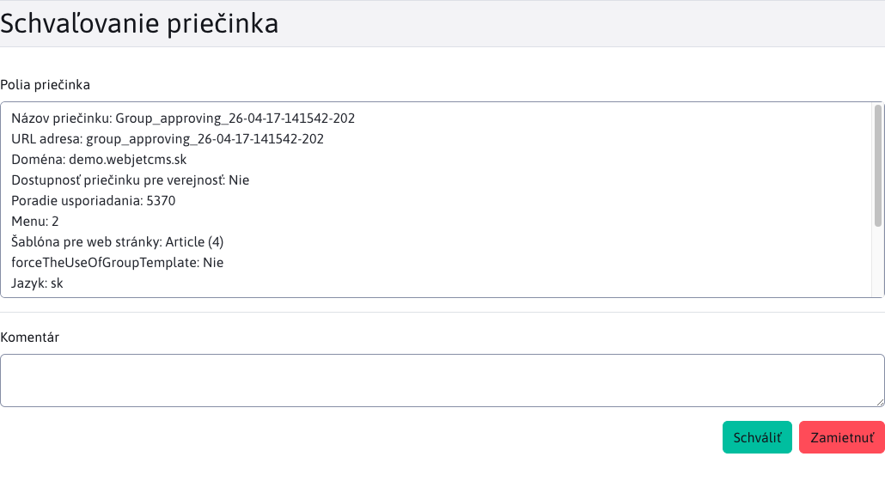

- Schvaľovanie priečinkov - v karte `Na schválenie` pridané pod-karty `Dokumenty` a `Priečinky` pre oddelené zobrazenie stránok a priečinkov čakajúcich na schválenie (#58405).
- Schvaľovanie priečinkov - pridané zobrazenie stĺpca s dátumom schválenia/zamietnutia a menom schvaľovateľa v histórii zmien priečinkov (#58405).
- Aplikácie - pridaná možnosť nastaviť [štýly zobrazenia aplikácie](redactor/webpages/working-in-editor/README.md#karta-zobrazenie). Môžete tak nastaviť napríklad odsadenie aplikácie v stránke, šírku alebo rôzne štýly zobrazenia, ale aj informácie pre čítačku pre slabozrakých návštevníkov (#osk418).

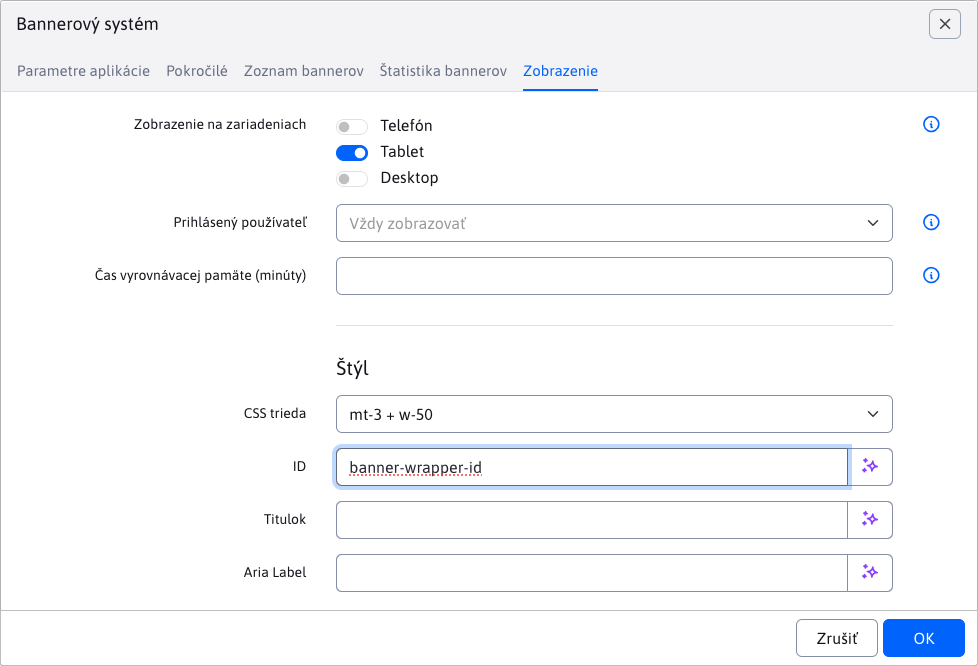

- Editor stránok - do dialógového okna [Odkaz a Tlačidlo](redactor/webpages/working-in-editor/README.md#tlačidlá) pridaná karta s rozšírenými nastaveniami ako ID, titulok, popis pre čítačky (aria-label) a podobne (#osk115).
- Ninja - pridané pole `canonical` ako [voliteľné pole Q](frontend/ninja-starter-kit/ninja-jv/page/README.md#informácie-o-stránke) pre nastavenie kanonickej URL adresy stránky. V prípade, že je pole prázdne, použije sa URL adresa stránky. Hodnotu v šablóne získate ako `${ninja.page.canonical}`. Pridá do URL parameter `page`, ak existuje, pre zobrazenie správnej strany v zozname noviniek (#OSK149, #54273-88).
- Page Builder - opravené presúvanie okna pre vloženie blokov, opravené prekrývanie výberu režimu editora, zapracované UX pripomienky (#58353).
- Zjednotené používanie nástroja `ImageMagick` pre zmenu veľkostí obrázkov medzi galériou a `/thumb servlet` (#osk396).
- Pridaná podpora vkladania obrázkov vo formáte `webp` vrátane zápisu pri zmene veľkosti pomocou natívnej knižnice `libwebp` cez `ImageIO` (#osk396).
- Pridané konfiguračné premenné `imageMagickCustomParams*` pre [nastavenie vlastných parametrov](redactor/apps/gallery/README.md#vlastné-parametre-imagemagick) `ImageMagick` operácií podľa typu operácie a formátu obrázka (#osk396).
- Aplikácie - doplnená možnosť **maximalizovať a minimalizovať** okno pre **vkladanie aplikácií, obrázku, odkazov** atď. do stránky (#57409).
- Pridaná podpora pre automatické obnovenie všetkých previazaných (zrkadlených) stránok a priečinkov z koša, keď jedna z nich bola obnovená (#osk423).
- Priečinok - pridaná možnosť nastaviť HTML kód novej stránky z lokálneho Systém/Šablóny priečinka, pôvodne sa zoznam stránok čítal podľa konfiguračnej premennej `tempGroupId` (#57409).
- Upravené názvoslovie [voliteľných polí](frontend/ninja-starter-kit/ninja-jv/page/README.md) pre SEO hodnoty (#228).
- Pridaná ikona na presun [kurzoru na ťažko dostupné miesto](redactor/webpages/working-in-editor/README.md#vkladanie-textu-na-ťažko-dostupné-miesta), ako napríklad za poslednú SVG ikonu v riadku a podobne (#osk105).


### Aplikácie

Prerobené nastavenie vlastností aplikácií v editore zo starého kódu v `JSP` na `Spring` aplikácie. Aplikácie automaticky získavajú aj možnosť nastaviť [zobrazenie na zariadeniach](custom-apps/appstore/README.md#podmienené-zobrazenie-aplikácie). Dizajn je v zhode so zvyškom WebJET CMS a dátových tabuliek (#57409).

- [Anketa ľahko](redactor/apps/inquiry/inquiry-simple.md)

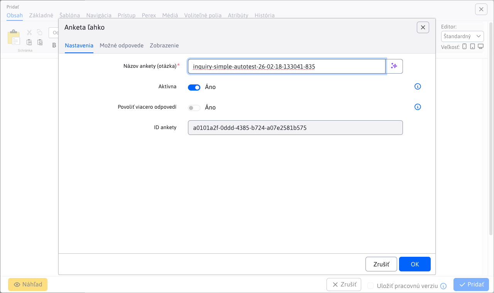

- [Mapa](redactor/apps/map/README.md)


- [Odporúčania](redactor/apps/app-testimonials/README.md)

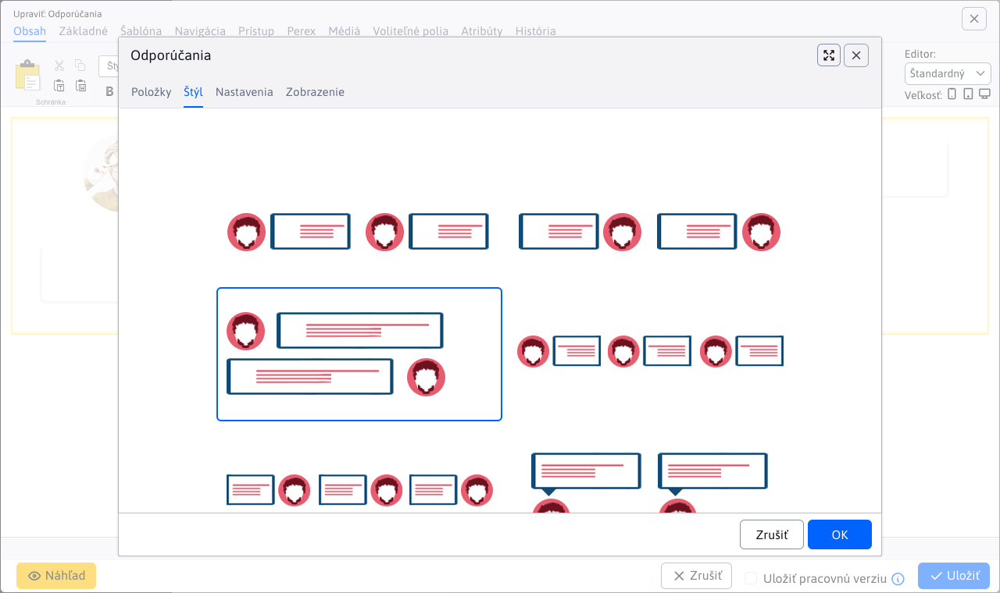

- [Predpripravené bloky (HTMLBox)](redactor/apps/htmlbox/README.md)

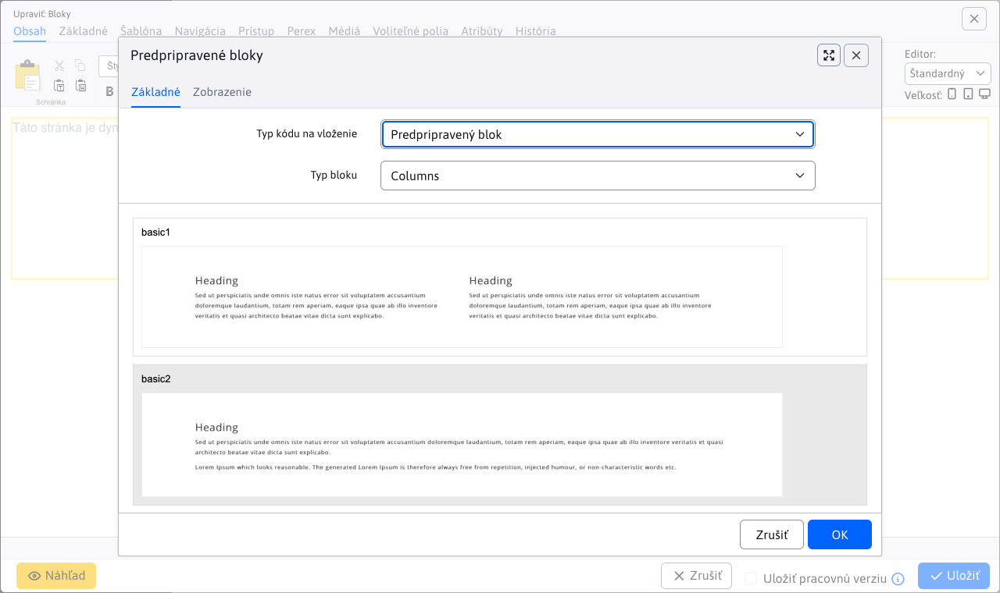

- Video - pridaná možnosť nastaviť [CSS triedy pre pomer strán videa](redactor/apps/video/README.md#konfigurácia), možnosti zobrazené v aplikácii sa nastavujú cez konfiguračné premenné `videoClasses`, `videoWrapperClass` a `videoItemClass` (#osk496).

### Formuláre

- Pridaná karta [Štatistika](redactor/apps/multistep-form/stat.md) pre zobrazenie odpovedí formulárov vo forme grafov (#58333).

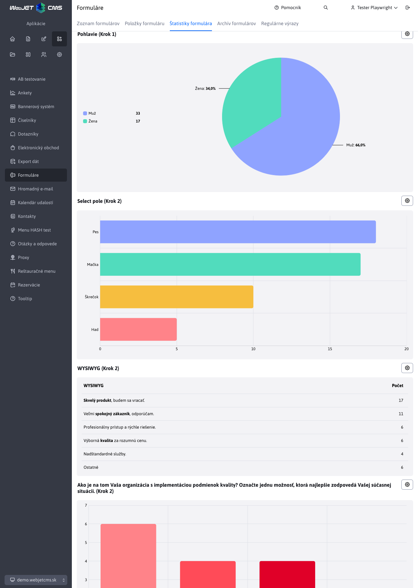

- Pre viackrokové formuláre pridaný stĺpec **Trvanie vyplnenia**, ktorý zobrazuje ako dlho trvalo vyplnenie formuláru používateľom (čas od jeho zobrazenia po odoslanie) (#58333).
- Viackrokové formuláre - pridaná podpora pre podmienené zobrazenie/validovanie položky formulára na základe vytvorených podmienok. Viac v časti [Podmienené zobrazenie/validovanie položky](redactor/apps/multistep-form/README.md#podmienené-zobrazenievalidovanie-položky) (#58477).

### Galéria

- Pridaná možnosť presúvať priečinky galérie priamo v editore zmenou nadradeného priečinka. Podrobnosti nájdete v časti [správa štruktúry](redactor/apps/gallery/structure.md) (#58433).
- Vylepšené spracovanie presunu priečinkov galérie s cieľom zabrániť vzniku neplatných odkazov. Viac informácií v časti [premiestnenie priečinku Galérie](redactor/apps/gallery/structure.md#premiestnenie-priečinku-galérie) (#58433).
- Pridaná podpora pre filtrovanie priečinkov galérií podľa aktuálneho ale aj pôvodného/súborového názvu priečinka galérie v stromovej štruktúre (#58445).
- Pridaná podpora pre [zobrazenie pôvodného/súborového názvu priečinka](redactor/apps/gallery/structure.md#nastavenie-zobrazenia-stromovej-štruktúry) galérie v stromovej štruktúre. Meno priečinka na disku môže byť iné ako pekné meno zadané vo vlastnostiach galérie (#58445).

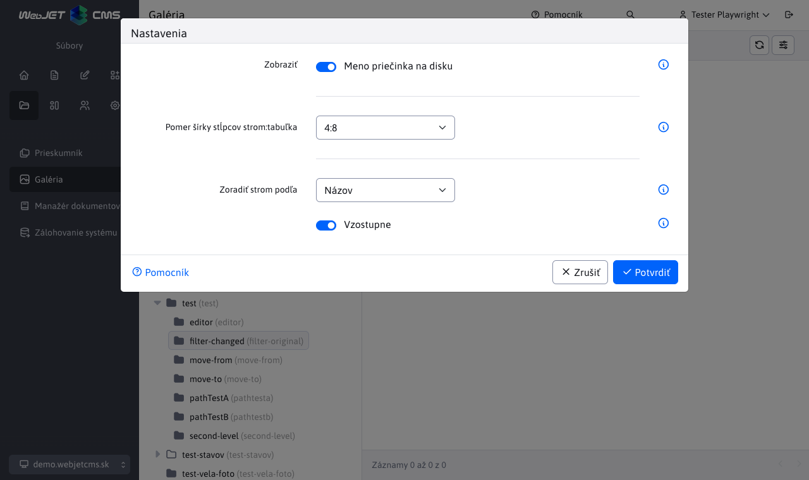

### Manažér dokumentov

- Pridané zobrazenie hodnoty **Globálne Id** pre dokumenty (#58357).
- Pridaná možnosť zvoliť dokumenty k zobrazeniu v aplikácii pomocou ich `globalId` hodnoty vo vnorenej tabuľke, viac v časti [Karta - Vybrané dokumenty](redactor/files/file-archive/file-archive-app.md#karta---vybrané-dokumenty) (#58357).

### Prístupnosť

- Pridané [automatizované testovanie prístupnosti](developer/testing/a11y.md) (a11y / WCAG) pomocou `axe-core` integrovaných do CodeceptJS. Testy pokrývajú úrovne WCAG 2.0/2.1/2.2 AA (#58389).
- Zlepšená prístupnosť / opravené WCAG chyby na stránkach:
  - Prihlásenie do administrácie (#58389-2).
  - Úvod / menu položky / hlavička (#58389-3).
  - Zlepšené kontrasty farieb v chybových správach a hláseniach (#58389-4).
  - Dátové tabuľky, editor (#58389-4).
- Rozšírené a11y testy o nové scenáre pre správcu súborov, monitorovanie, štatistiky, nahrávanie súborov, správu používateľov a webové stránky. Metóda `a11y.check()` podporuje parameter `context` pre obmedzenie kontroly na konkrétnu časť stránky vrátane vnorených `iframe` elementov (#58389-5).

### Iné menšie zmeny

- Galéria - pridaná podpora priesvitnosti v `png/webp/gif` obrázkoch pri zmene ich veľkosti, ak sa nepoužíva [ImageMagick](redactor/apps/gallery/README.md#možné-konfiguračné-premenné) (#osk396).
- GitHub pipeline - po `merge pull request` sa automaticky vygeneruje príspevok na sociálne siete pomocou LLM (GitHub Copilot / Google Gemini) a pridá sa ako komentár k danému `pull request` spolu s prípadnými fotkami obrazovky z dokumentácie (#177).
- Skripty - pridaná možnosť nastaviť, či sa má skript vkladať v editore stránok v režime PageBuilder (#58349).
- Skripty - pridaný atribút [Poradie vkladania](redactor/apps/insert-script/README.md) pre nastavenie poradia vkladania skriptov v rámci rovnakej pozície. Predvolená hodnota pre existujúce skripty je 10, pri novom skripte sa automaticky nastaví na najvyššiu hodnotu + 10 (#osk387).
- Editor stránok - opravené určenie priečinka pre nahrávanie obrázkov/súborov pri novej/ešte neuloženej web stránke s duplicitným názvom: priečinok teraz zodpovedá skutočnej URL adrese stránky vrátane prípony `-2`, `-3` atď (#58361).
- Zrkadlenie štruktúry - pridaná možnosť generovať [odkazy na jazykové mutácie](redactor/apps/docmirroring/README.md#nastavenie-atribútu-hreflang) v hlavičke stránky pomocou aplikácie `hreflang.jsp`, odkazy obsahujú atribút `hreflang` pre lepšiu SEO optimalizáciu jazykových verzií (#58357).
- Stromová štruktúra - pridané automatické posunutie na aktuálne zvolený prvok v stromové štruktúre (#58433).
- Aplikácie - pridaná možnosť skryť polia/karty v editore aplikácie pomocou konfiguračnej premennej `appHideFields`. Viac sa dočítate v časti [Skrývanie polí/kariet](custom-apps/appstore/README.md#skrývanie-políkariet) (#58433).
- `imageradio` - pridaná možnosť nastaviť pole typu `imageradio` ako `disabled` (#58333).
- Dizajn všetkých grafov v celom projekte bol prerobený z tmavého na svetlý režim pre lepšie zladenie dizajnu (#58333).

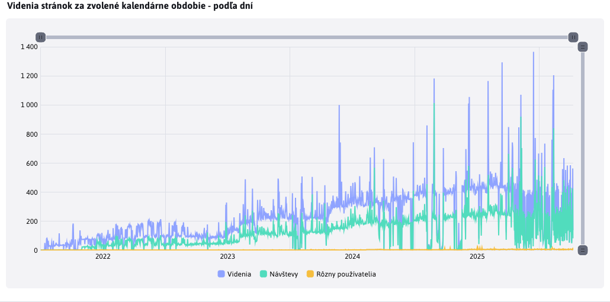

- Aplikácia `Tooltip` premenovaná na Nápovedy (#205).
- Štatistika návštevnosti - upravené filtrovanie podľa priečinka. Používateľ môže zvoliť ľubovoľný priečinok aj z iných domén, ak nemá obmedzené práva na priečinky alebo ak má právo **Zobraziť štatistiku pre všetky priečinky** (#58453).
- Používatelia - upravená možnosť vidieť všetky priečinky v nastavení **Práva na adresáre a stránky**, ak má administrátor právo **Správa administrátorov**. Priečinky sú zobrazené aj v prípade, že administrátor má sám obmedzené práva na priečinky (#58453).

### Oprava chýb

- `imageradio` - opravené zobrazenie poľa typu `imageradio` v editore datatabuľky (#58333).
- Webové stránky - opravené obnovenie stránky, ktorá bola vytvorená cez zrkadlenie a nemala historický záznam, ktorý sa dal použiť na obnovenie (#208).
- Webové stránky - pri obnovení stránky z koša sa použije historická verzia aby sa zachoval jej pôvodný stav pred vymazaním (#208).
- Tlačidlo - opravená možnosť nastaviť vlastnosti tlačidla ktoré je zakázané (atribút `disabled=disabled`) (#209).
- Fotogaléria - opravené vyhľadávanie v priečinkoch (#58433).
- Súbory - doplnené zachovanie `.min.js` a `.min.css` v názve súboru pri nahratí do `/files,/images` priečinkov (#213).

### Výkon

- Upravený `PkeyGenerator` pre režim cluster `auto`. Metóda `allocate` obalená do transakcie (`setAutoCommit(false)`) s opakovaním pri `deadlock`. Zlepšené získanie bloku aj v režime cluster `auto`, čím sa znižuje počet prístupov do databázy a riziko `deadlock`. Navýšenie a čítanie hodnoty `pkey_generator` prebieha v jednom atomickom SQL dotaze, čo zabraňuje prideleniu rovnakého bloku viacerým uzlom clustra. Používajú sa databázovo špecifické SQL príkazy (#213):

| Databáza | SQL príkaz | Minimálna verzia |
| --- | --- | --- |
| MySQL | `LAST_INSERT_ID(expr)` | 3.23+ |
| MariaDB | `LAST_INSERT_ID(expr)` | 5.1+ (všetky GA) |
| Microsoft SQL Server | `UPDATE ... OUTPUT inserted` | 2005+ |
| PostgreSQL | `UPDATE ... RETURNING` | 8.2+ |
| Oracle | `RETURNING value INTO` | 10g+ |

- `SeoManager` a `ClusterRefresher` tolerujú databázový `deadlock` pri `UPDATE/DELETE` operáciách bez chybového logu (#213).
- Režim cluster `auto` - pridaná konfiguračná premenná `clusterAutoRandomDelay` pre [náhodné oneskorenie štartu](install/config/README.md#režim-auto) niektorých úloh, aby sa znížilo riziko súbežných databázových konfliktov medzi uzlami clustra (#213).

### Bezpečnosť

- Pridaný súbor `.github/SECURITY.md` so [zodpovedným oznamovaním zraniteľností](sysadmin/responsible-disclosure/README.md) (#187).
- Aktualizované knižnice `AspectJ, Eclipselink, slf4j, GoPay` (#57793).
- Verzia `SpringSecurity` zvýšená na verziu 7 (#56665).
- Pridaná možnosť prihlasovania sa cez [OAuth2/Keycloak/Google/Facebook...](install/oauth2/oauth2.md) (#56665).

<div class="video-container">
    <iframe width="560" height="315" src="https://www.youtube.com/embed/q8xs3qDq-G4" title="YouTube video player" frameborder="0" allow="accelerometer; autoplay; clipboard-write; encrypted-media; gyroscope; picture-in-picture" allowfullscreen></iframe>
</div>

- Odstránené nepoužívané knižnice `lodash,pdfmake`, aktualizovaný zoznam `dependency-check-suppressions`, opravená prvotná inštalácia (#204).
- Opravené spracovanie neplatného hesla pri API/BASIC autentifikácii po prechode na `Spring Security 7`, aby sa chyba `password encoder` nepremenila na internú výnimku a požiadavka sa korektne zamietla (#58369).
- Pridaná podpora prihlasovania do administrácie cez [Prístupové kľúče](redactor/admin/logon.md#použiť-prístupový-kľúč) `PassKey/WebAuthn` (#58369).


- Používatelia - ak vytváraní nového používateľa alebo jeho editácii do poľa heslo zadáte znak `*` vygeneruje sa nové bezpečné heslo a zobrazí sa vám v notifikácii (#58369).
- [Skupiny práv](admin/users/perm-groups.md) - pridaná možnosť nastaviť príznak **Prístup ku všetkým adresárom web stránok** a **Prístup ku všetkým priečinkom súborového systému**, ktoré pri prihlásení prepíšu sčítané práva z ostatných skupín a poskytnú používateľovi neobmedzený prístup k web stránkam, alebo súborom (#osk422).
- Aktualizovaná knižnica `Datatables.net/Editor` z verzie `2.2.2/2.3.2` na `2.3.7/2.5.2` (#206).

### Dokumentácia

- Upravený automatický prekladač pre použitie Google Translator API v3 (#58301).
- Anglická verzia dokumentácie nanovo preložená (#58301).

### Pre programátora

- AI - nový `AI skill` pre opravu A11Y/WCAG chýb, stačí použiť nástroj `/wj-accessibility`.
- Aktualizované závislosti na minimálne požiadavky pre Tomcat 11 (Tomcat 10 už nie je podporovaný). `Stripes` validácie - upravené vykonávanie EL výrazov z odstráneného `jakarta.servlet.jsp.el` na `jakarta.el` kvôli kompatibilite s `jakarta.servlet.jsp-api:4.0.0` (#58385).
- Aktualizovaný spôsob zobrazenia API dokumentácie na štandard [OpenAPI 3.0](https://www.openapis.org/). Dokumentácia je dostupná na adrese `/admin/swagger-ui/index.html` pre používateľov, ktorí majú právo na editáciu administrátorov (#57793).
- Administrácia - zmenený `build` súborov administrácie z `webpack` na `rspack`, ktorý je výrazne rýchlejší (#206).
- Administrácia - zjednotené generovanie `PUG` šablón pre `watch` a `prod`, odstránené nepoužívané `npm` build závislosti a historické `webpack` skripty (#206).
- Administrácia - doplnené automatické obnovenie otvorenej stránky pri `npm run watch` po zmene `JS/CSS/PUG` súborov (#206).
- Administrácia - pridaný skript `npm run analyze` s HTML reportom veľkosti použitých knižníc (#206).
- Datatabuľky - pridaný nový typ udalosti `DatatableColumnsEvent`, na ktorý je možné počúvať a dynamicky upraviť definíciu stĺpcov pred inicializáciou tabuľky. Viac sa dozviete v časti [Udalosť DatatableColumnsEvent](developer/backend/events-datatable.md#udalosť-DatatableColumnsEvent) (#58433).
- Doplnená knižnica `Jackson v3`, niektoré JSON objekty nemusí serializovať správne pokiaľ nemajú správne `Java Bean` meno (napr. `setcookieId` bez veľkého `C`, alebo `set__rowNum__`). Najlepšie riešenie je správne nastaviť meno premennej, prípadne použiť anotáciu typu `@JsonProperty("__rowNum__")` aj na `getter/setter` (#58369).
- Galéria - upravené volanie knižnice ImageMagick, zmenené API pre jeho volanie na `ImageTools.executeImageMagick(...)` (#osk396).
- Grafy - nástroj/knižnica [chart-tool.js](../../src/main/webapp/admin/v9/src/js/libs/chart/chart-tools.js) na prácu s `amcharts` grafmi bol aktualizovaný, priali sa nové funkcionality, nové grafy a vylepšila sa logika (#58333).
- Grafy - pridaná nová trieda/knižnica [stats-by-charts.js](../../src/main/webapp/apps/_common/charts/stats-by-charts.js) na rýchle vytváranie celých sekcií štatistík s využitím [chart-tool.js](../../src/main/webapp/admin/v9/src/js/libs/chart/chart-tools.js) na vytváranie grafov (#58333).
- Hlavičkové záložky - pridaná podpora pod-kariet cez funkciu `WJ.headerSubTabs()` pre vnorené karty v zozname Neschválené vo webových stránkach (#58405).
- Odstránená anotácia `@Temporal` na dátumových stĺpcoch v databázových entitách, odporúčané riešenie je pre nové entity používať `java.time.*` typy. Zdá sa, že Eclipselink/JPA správne deteguje typ `Date` ako dátum a čas a anotácia nie je potrebná. Odporúčame po aktualizácii skontrolovať správanie dátumových polí (#57793).
- Trieda `PageListHolder/MutableSortDefinition` je v Spring 7 `Deprecated`, ako priamu náhradu môžete použiť našu implementáciu `PagedListHolder/SortDefinition` z package `sk.iway.iwcm.system.datatable` (#57793).
- Webové stránky - obnovenie z koša - doplnené [publikovanie udalostí](developer/backend/events.md) `ON_RECOVER` a `AFTER_RECOVER` pre obnovu stránok a priečinkov z koša (#161).
- Webové stránky - doplnená možnosť upraviť karty okne [Štýl pri použití PageBuilder](frontend/page-builder/blocks.md#podporný-javascript-kód) volaním funkcie `window.pbBuildTabMenu`. Viete tak pre zákazníka zobraziť len relevantné karty a nastavenia bloku (#58345).
- Webové stránky - doplnená možnosť volať [vlastnú funkciu pre čistenie HTML kódu](frontend/page-builder/blocks.md#podporný-javascript-kód) po vložení z `Microsoft Office` alebo pri získaní HTML kódu (#OSK49).
- `WebjetEvent` – pridaná možnosť nastaviť používateľa typu `Identity` priamo do udalosti. Vhodné pri spracovaní udalostí, kde je potrebný používateľ, ale nie je dostupný `context` alebo `request` (#OSK423).
- `WJ.openIframeModal` - pridaná možnosť presúvať dialógové okno uchopením za hlavičku (drag & drop), maximalizovať/minimalizovať okno a definovať vlastné tlačidlá v pätičke cez parameter `buttons` (#58405).


## 2026.0.x

> Opravná verzia pôvodnej verzie 2026.0.

- Webové stránky - opravené ukladanie web stránky s medzerou na konci URL adresy (vykoná sa odstránenie prázdnych znakov) (#OSK650).
- Webové stránky - opravené zacyklenie nepublikovanej stránky ak URL nekončí na znak `/` - konfiguračná premenná `virtualPathLastSlash=false` (#OSK684).
- Manažér dokumentov - pridané zmazanie cache pamäte po publikovaní novej verzie súboru (#TB2754).
- Multiweb - opravená možnosť zmazať alebo upraviť doménové presmerovanie, ktoré obsahuje `http/s` prefix (#58317-15).
- Galéria - v editore aplikácie sa medzi vizuálnymi štýlmi zobrazujú iba JSP súbory z priečinkov `/components/{INSTALL_NAME}/gallery` a `/components/gallery`, bez duplicitných položiek (#58317-16).
- Vloženie HTML kódu - v náhľade aplikácie v editore webových stránok sa pre obsah tvorený iba elementmi `script` zobrazí zdrojový kód namiesto prázdneho obsahu (#OSK625).
- Bezpečnosť - sprísnené overovanie odkazu na obnovu zabudnutého hesla. Overovací záznam sa kontroluje pre vybraný používateľský účet aj pri vlastnom spôsobe odosielania, rešpektuje časovú platnosť a po použití sa zneplatní pre všetky účty zahrnuté v žiadosti (#292).
- Bezpečnosť - sprísnené overovanie oprávnení pri práci so záznamami v administrácii (#295).
- Bezpečnosť - sprísnená kontrola práv na priečinok pri nahrávaní súboru do administrácie a jeho prepísaní ak súbor existuje.
- Bezpečnosť - sprísnená kontrola oprávnení pri obnove historickej verzie súboru (#295).
- Bezpečnosť - sprísnená kontrola oprávnení pri správe blogerov (#295).
- Bezpečnosť - sprísnená validácia názvov databázových stĺpcov pri dynamickom usporiadaní a filtrovaní. **Upozornenie:** verejné API už v parametroch usporiadania nepodporujú vlastné SQL výrazy, používajú sa iba bezpečné názvy stĺpcov alebo dostupné pomenované konštanty (#294).
- Bezpečnosť - [zabezpečený koncový bod `row-reorder`](developer/datatables/README.md#poradie-usporiadania-riadkov) dátových tabuliek. Povolené je meniť iba numerické pole označené `DataTableColumnType.ROW_REORDER`, pričom sa kontrolujú oprávnenia pre každý záznam aj dodatočný rozsah celej dávky pomocou `checkRowReorderScope`. Pri formulároch sa overuje príslušnosť k formuláru a kroku aj prístup používateľa; neplatná požiadavka sa neuloží (#295).
- CKEditor - doplnená možnosť [konfigurovať pravidlá čistenia obsahu](frontend/setup/ckeditor.md#čistenie-html-kódu-pri-vložení-z-wordexcel) pri vložení z Word/Excel. **Upozornenie:** predvolené čistenie po novom odstraňuje aj atribút `nowrap` z buniek `TD` a CSS triedy s atribútmi `align` a `valign` z buniek `TH` (#300).

## 2026.0.28

> Opravná verzia pôvodnej verzie 2026.0.

!> Upozornenie: po aktualizácii skontrolujte funkčnosť generovania `/thumb` obrázkov a [nastavenie povolených rozmerov](frontend/thumb-servlet/README.md#obmedzenia).

- Web stránky - zrušené [plánované verzie](redactor/webpages/history.md) sú v histórii zobrazené preškrtnutým písmom a nie je možné ich zmazať (#58573).
- Archív súborov - upravená úloha na pozadí pre publikovanie súborov - z dôvodu práv sa nevykonáva na verejnom uzle (#246).
- Úlohy na pozadí - pridaná možnosť spustiť [úlohu na pozadí](admin/settings/cronjob/README.md) len na uzloch v plnej konfigurácii alebo na verejných uzloch (#246).
- Generátor primárnych kľúčov - doplnená automatická oprava mien tabuliek a názvov stĺpca s primárnou hodnotou (#246).
- Bezpečnosť - opravené chyby Local File Inclusion, kontrola nahrávaných súborov a RCE. Ďakujeme Josef Korbel (Citadelo) za nahlásenie týchto zraniteľností (#252).
- Bezpečnosť - pridaná [kontrola povolených rozmerov](frontend/thumb-servlet/README.md#obmedzenia) generovania `/thumb` obrázkov, prvý mesiac v režime učenia a následne po reštarte WebJETu v režime kontroly (#259).
- Bezpečnosť - aktualizované knižnice `jackson-annotations` (2.22), `jackson-databind` (2.22.0), `logback-core/classic` (1.5.37) a `tink` (1.22.0). Z dôvodu spätnej kompatibility v opravnej verzii nebola realizovaná migrácia `Apache HttpClient` z 4.x na 5.x, ale WebJET sa typicky pripája na bezpečné/vnútorné API/domény (#264).
- Aktualizované premosťovacie knižnice `slf4j-api`, `jcl-over-slf4j` a `log4j-over-slf4j` na verziu `2.0.18`. Zároveň sú v `dependency-check` potlačené falošne hlásené zraniteľnosti `CVE-2020-9493` a `CVE-2022-23307`, ktoré sa týkajú pôvodného `Apache log4j 1.2.x`, nie premostenia `log4j-over-slf4j` (#264).
- Aktualizovaná knižnica `swagger-ui` na verziu 5.32.8 (#264).
- JPA - opravené viac násobné ukončenie databázovej transakcie pri importe presmerovaní (#256).
- `/thumb` - opravené generovanie obrázka pri `ip=1/2` a nulovej veľkosti `w/h` parametra (#58317-10).
- Hromadné úpravy - upravené hľadanie/nahradenie viac riadkového HTML kódu v `replaceall` skripte (#262).
- Cluster - upravené nastavenie CSRF tokenov v `session` tak, aby sa zmena distribuovala aj v `redis` (#265).

## 2026.0.25

> Opravná verzia pôvodnej verzie 2026.0.

!> Upozornenie: po aktualizácii skontrolujte funkčnosť všetkých formulárov. Ak niektorý nejde odoslať, uložte znova jeho nastavenia.

- AI asistent - upravené získanie odpovede pri použití `reasoning` v OpenAI (#244).
- AI asistent - doplnená propagácia zmazania cache do uzlov clustra pri úprave asistenta.
- Apache Tomcat - vo verzii `9.0.118/11.0.22` bolo zmenené správanie získania zoznamu Java tried čo má za následok nefunkčnosť `Stripes Framework`. Upravená verzia filtruje nesprávne verzie súborov aby štart prebehol korektne. Do staršieho projektu môžete preniesť priamo triedu [VFS.java](https://github.com/webjetcms/webjetcms/blob/main/src/main/java/net/sourceforge/stripes/vfs/VFS.java), skompilovať ju vo vašom projekte a použiť bez potreby aktualizácie.
- Bezpečnosť - opravená možnosť nastaviť [meno HTTP hlavičky pre získanie IP adresy](sysadmin/pentests/README.md#konfigurácia) cez premennú `xForwardedForHeader`.
- Bezpečnosť - opravené chyby Local File Inclusion, kontrola nahrávaných súborov a RCE. Ďakujeme Josef Korbel (Citadelo) za nahlásenie týchto zraniteľností (#252). Možné dočasné riešenie bez aktualizácie celého WebJET CMS je:
  - zmazať alebo [aktualizovať](https://github.com/webjetcms/webjetcms/blob/main/src/main/webapp/components/grideditor/phantom/phantom_sablona_ajax.jsp) súbor `/components/grideditor/phantom/phantom_sablona_ajax.jsp`
  - ak máte WebJET CMS novší ako `2025.52` do konfiguračnej premennej `pathFilterBlockedPaths` pridať hodnotu `,/components/grideditor/phantom/`
  - ak máte WebJET CMS novší ako `2025.52` môžete [globálne pre celý server](install/external-configuration.md) do `JAVA_OPTS` pridať systémovú premennú:

```txt
-Dwebjet.pathFilterBlockedPaths=.DS_Store,debug.,config.properties,Thumbs.db,.git,.svn,/WEB-INF/,./,/components/grideditor/phantom/
```

- Bezpečnosť - pridaný CSRF token pre formulár pri vypnutej SPAM ochrane (#245).
- Bezpečnosť - každé odoslanie formuláru kontroluje nastavenie formuláru v databáze, ak sa nenájde formulár nie je možné odoslať. Pôvodná verzia toto kontrolovala len na verejných uzloch clustra, teraz sa to kontroluje bez ohľadu na cluster. V prípade potreby vypnete funkčnosť nastavením konfiguračnej premennej `formAllowOnlyExistingFormsOnPublicNode` na hodnotu `false` (#245).
- Bezpečnosť - opravená možnosť získania administrátorského účtu pri generovaní offline verzie (#245).
- Formulár ľahko - upravené polia pre zadanie názvu poľa a tooltipu na jednoriadkový WYSIWYG editor, aby výsledok neobsahoval `P` element (#244).
- Galéria - opravené vytvorenie záznamu v databáze pri kopírovaní súborov v prieskumníku. Záznam sa nevytvorí pre `o_` a `s_` obrázky (#58317-9).
- Manažér dokumentov - doplnené filtrovanie súborov podľa dátumov platnosti (ak nie je platný rozsah dátumov, nezobrazia sa) a súborov ktoré nemajú nastavený atribút zobrazovať (#233).
- Video - aktualizovaná knižnica `videojs` na prehrávanie lokálnych audio/video súborov z verzie 6.2.0 na verziu 8.23.6 (#233).
- Video - opravené nastavenie odkazu na lokálny audio/video súbor pri editácii už vloženej aplikácie (#233).
- Výkon - pridaný index v tabuľke `emails` podľa `click_hash` pre lepší výkon v Oracle databáze (#244).
- Web stránky - doplnené zobrazenie `mp3` súborov vo výbere Média všetkých stránok/Videá (#233).
- Web stránky - povolené vkladanie súborov typu `svg,webp,mp3` ak používateľ nemá povolené právo Kompletné menu v editore, hodnota nastavená v konfiguračnej premennej `FCKConfig.UploadFileTypes[Basic][image]` (#233).

## 2026.0.18

> Opravná verzia pôvodnej verzie 2026.0.

- Administrácia - doplnené presmerovanie po prihlásení ak pôvodná cesta začína na `/components` a obsahuje `/admin` (#58317-4).
- Aktualizácia WebJETu - opravené odkazy na dokumentáciu.
- Bannerový Systém - opravené načítanie zoznamu skupín v Microsoft SQL.
- Bezpečnosť - pridaná možnosť [deaktivovať aplikáciu](sysadmin/pentests/README.md#deaktivácia-aplikácie), aby nebola dostupná. Viete tak vypnúť aplikácie ako Zálohovanie systému, Reštartovať a podobne, ak nasadzujete cez `CI-CD` službu a dané aplikácie nemajú využitie, alebo nie sú žiadúce z bezpečnostných dôvodov.
- Bezpečnosť - aktualizovaný `Swagger UI` a výnimky pre `dependencyCheckAnalyze` (#58317-6).
- Bezpečnosť - aktualizované knižnice `log4j,pdfbox,thymeleaf,postgresql` (#58317-6,#226).
- Bezpečnosť - pridaná ochrana pred brute force útokmi na 2FA tokeny. Pri neúspešných pokusoch sa IP adresa dočasne zablokuje - rovnako ako pri prihlasovaní heslom (#222).
- Bezpečnosť - generované PDF súbory viac neobsahujú v meta údajoch `Creator/Producer` informácie o generátore `PD4ML`. Hodnota sa preberá z konfiguračnej premennej `pdfAuthorName`. Čistenie metadát je riadené premennou `metadataCleanFiles` (predvolená hodnota `pdf-gen`) (#222).
- Bezpečnosť - opravené spracovanie chyby prázdneho hesla (#222).
- Dátové tabuľky - opravená možnosť zatvorenia editora vo vnorenom modálnom okne (#OSK303).
- Dotazníky - opravené ukladanie dotazníka pri použití databázy Oracle alebo Microsoft SQL (#217).
- Galéria - opravené uloženie nastavenia galérie pre priečinok na disku (bez záznamu v databáze) v Oracle DB.
- Galéria - pridaná konfiguračná premenná `metadataRemoveMinFileSize` pre nastavenie minimálnej veľkosti súboru v bajtoch, pod ktorú sa preskočí odstraňovanie metadát (#osk378).
- GDPR - mazanie dát - opravené mazanie formulárov v Oracle/PostgreSQL databáze (#224).
- Hromadný email - opravený prenos príjemcov pri duplikovaní kampane v Oracle DB (#54273-82).
- Hromadný email - opravené nahradenie externých odkazov, ktoré obsahujú viaceré URL parametre v emaile (#54273-83).
- Média - opravená kontrola oprávnení pri pridávaní médií do neuloženej web stránky používateľom bez práva na všetky médiá (#58317-6).
- Manažér dokumentov - opravené zmazanie indexu súboru pri uložení, ak súbor už nie je platný. Opravené iniciálne SQL pre nastavenie indexovania súborov ak sa súbor nemá zobrazovať (#227).
- Multiweb - opravené nastavenie domény po prihlásení (#58317-03).
- Multiweb - opravené používanie doménových aliasov pri použití externých priečinkov - nastavená konfiguračná premenná `cloudStaticFilesDir` (#58317-4).
- Prekladové kľúče - opravené nastavenie prázdnych hodnôt pri vytvorení nového záznamu a odsadenie polí s pôvodnou hodnotou (#56845).
- Prieskumník - opravené nahrávanie viacerých súborov cez drag & drop (#58317-2).
- Voliteľné polia - opravené zobrazenie hodnôt (namiesto ID) a filtra (výberové pole namiesto textového poľa) pre výberové polia, číselníky a výber web stránky (#58421-0).
- Webové stránky - opravené odstránenie diakritiky pri nahratí obrázka do editora cez drag&drop (#58361).
- Webové stránky - Page Builder - pri vytvorení novej stránky sa použije hodnota nastavená v poli HTML kód novej stránky priečinka. Stránka teda nemusí byť prázdna, ale môže obsahovať pripravené bloky (#osk378).
- Webové stránky - Nastavenie bloku - opravené nastavenie pozadí a pokročilých nastavení (#TB2456).
- Webové stránky - opravené zmazanie priečinka z koša pri multiweb inštalácii (#58317-03).
- Webové stránky - zladené získanie zoznamu šablón medzi web stránkami a priečinkami (#58317-03).
- Webové stránky - opravený prenos dátumov publikovania pri náhľade web stránky a presmerovanie pri vlastnostiach bloku (#osk412).
- Webové stránky - opravená chyba získania [šablóny pre mobilné zariadenia](frontend/templates/templates.md#zobrazenie-pre-špecifické-zariadenie) v MultiWEB inštalácii pri zhode mien šablóny v rôznych doménach (#58317-5).
- Webové stránky - opravené ukladanie stránky, ktorá má kópie vo viacerých priečinkoch a zároveň je použité zrkadlenie stránok (#58317-7).
- Webové stránky - Ninja - doplnený atribút `${ninja.temp.lngIsoUnderscore}` s kódom jazykovej mutácie vo formáte `sk_SK` namiesto `sk-SK` (#217).
- Webové stránky - opravená uzatváracia značka `</link>`, správne nahradená za `/>`, keďže `link` je prázdny element (#osk498).
- Webové stránky - opravená chyba odstránenia časovej zložky pri nastavení dátumu konania (#54273-89).
- Webové stránky - pridaná možnosť [nastaviť JavaScript funkciu](frontend/setup/config.md) pre `target="_blank"` odkazy, predvolene nastavené na `return openTargetBlank(this, event)`. Hodnota sa nastavuje v konfiguračnej premennej `editorTargetBlankFunction`, ak je nastavené na prázdnu hodnotu `onclick` funkcia sa nenastaví (#225).
- Hromadný email - opravené vytváranie kampaní a emailov pri duplikovaní kampane (#58649).

Jakarta verzia:

- Aktualizovaná knižnica `Spring Security` z verzie 6 na verziu 7 (#43144).

## 2026.0

> **WebJET CMS 2026.0** prináša vylepšenú verziu nástroja **Page Builder** pre tvorbu **komplexných web stránok**. V blokoch je možné **vyhľadávať a filtrovať** na základe značiek, ľahko tak nájdete vhodný blok pre vloženie do stránky. Pridané boli nové funkcie ako **rozdelenie stĺpca**, **vkladanie viacerých sekcií naraz** a **stále zobrazené tlačidlo na pridanie novej sekcie** pre rýchle rozšírenie obsahu stránky.
>
> Podpora **PICTURE elementu** umožňuje zobrazovať **rôzne obrázky podľa rozlíšenia obrazovky** návštevníka, čím sa zlepšuje vizuálny zážitok na rôznych zariadeniach. Navyše je možné vkladať **vlastné ikony** definované v spoločnom SVG súbore, čo prináša väčšiu flexibilitu v dizajne.
>
> Nový nástroj pre **tvorbu formulárov** umožňuje ľahko vytvárať **viackrokové formuláre** s možnosťou programovej validácie jednotlivých krokov a možnosťou **potvrdenia platnosti emailovej adresy** pomocou zaslaného kódu. Vyhnete sa tak vyplneniu formulárov rôznymi robotmi.

!> Upozornenie: verzia **2026.0** je posledná verzia pre aplikačný server Tomcat 9 s využitím `javax namespace`. Všetky novšie verzie od `2026.18` budú určené **už len pre** aplikačný server **Tomcat 10/11** s využitím `Jakarta namespace`. Zmena z `javax` na `jakarta namespace` je dôsledkom odovzdania `Java EE` špecifikácií z Oracle do `Open Source/Eclipse Foundation`, kde projekt pokračuje pod názvom `Jakarta EE`. Táto zmena si vyžaduje aktualizáciu aplikačného servera, keďže verzie Tomcat 10 a novšie už používajú výhradne `jakarta namespace` pre všetky `Java EE` API. Aktuálny zoznam dostupných verzií nájdete v [sekcii inštalácia](install/versions.md).

### Prelomové zmeny

- Aktualizované knižnice `commons-lang,displaytag`, viac v [sekcii pre programátora](#pre-programátora) (#58153).
- Zmenené správanie ikony Bloky v režime Page Builder - [textové bloky integrované](frontend/page-builder/blocks.md) do priečinka `content` podobne ako sú bloky pre `section, container, column` (#58165).
- Upravené spracovanie **nahrávania súborov** `multipart/form-data`, viac v [sekcii pre programátora](#pre-programátora) (#57793-3).
- Odporúčame **skontrolovať funkčnosť všetkých formulárov** z dôvodu úprav ich spracovania, viac informácií v sekcii [pre programátora](#pre-programátora) (#58161).

### Webové stránky

- Pridaná možnosť vkladať `PICTURE` element, ktorý zobrazuje [obrázok podľa rozlíšenia obrazovky](frontend/setup/ckeditor.md#picture-element) návštevníka. Môžete teda zobraziť rozdielne obrázky na mobilnom telefóne, tablete alebo počítači (#58141).

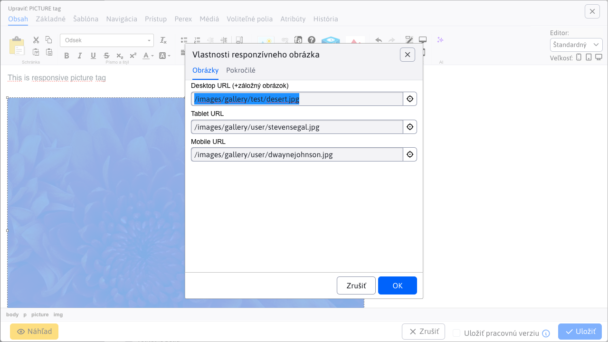

- Pridaná možnosť vkladať [vlastné ikony](frontend/setup/ckeditor.md#svg-ikony) definované v spoločnom SVG súbore (#58181).

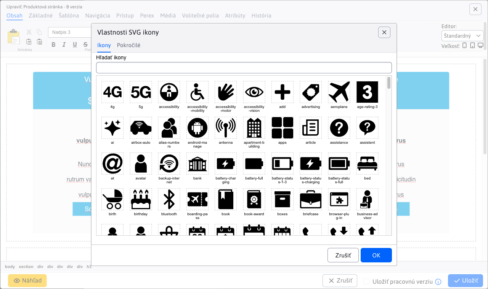

- Pridaný prenos aktuálneho HTML kódu pri prepnutí režimu editora Štandardný/HTML/Page Builder. Môžete tak jednoducho upraviť Page Builder stránku v HTML kóde a znova zobraziť úpravy v režime Page Builder (#58145).
- Pridané kontextové menu Zmazať element, pomocou ktorého môžete ľahko zmazať tlačidlo, odkaz, odstavec, formulár, sekciu a podobne. Stačí keď na element kliknete pravým tlačidlom pre zobrazenie kontextového menu (#osk233).
- Page Builder - upravené generovanie štýlov pri použití nástroja ceruzka. Do CSS štýlu sa generujú len zmenené hodnoty, tie sú v dialógovom okne zvýraznené modrým orámovaním vstupného poľa (#58145).
- Page Builder - pridaná možnosť volania [vlastného JavaScript súboru](frontend/page-builder/blocks.md#podporný-javascript-kód) s podpornými funkciami pre úpravu kódu. Pridaná možnosť upraviť nastavenia ako selektory pre elementy, farby a podobne (#58141).
- Page Builder - upravené generovanie kotiev pri kartách tak, aby názov kotvy bol generovaný podľa názvu karty - pôvodne nebol generovaný sémanticky ako `autotabs-x-y` (#112).
- Page Builder - doplnená možnosť nastaviť šírku stĺpca na `auto` pre automatické prispôsobenie obsahu (#114).
- Page Builder - doplnená možnosť pripraviť [textové bloky](frontend/page-builder/blocks.md) priamo do priečinka `content`, vkladajú sa namiesto pôvodných blokov čítaných z web stránok z priečinka Šablóny. Web dizajnér ich pripraví spolu s ostatnými typmi Page Builder blokov. Umožňuje rýchle vloženie často používaných textových častí, tlačidiel a podobne (#58165).
- Page Builder - pri vkladaní nového bloku je predvolená karta Knižnica namiesto Základné, aby sa zjednodušil výber bloku z pripraveného zoznamu (#58165).
- Page Builder - doplnená možnosť rozdeliť stĺpec na dve časti pomocou novej funkcie Rozdeliť stĺpec. Vyvoláte ju pomocou kliknutia na + v žltej lište, zvolením možnosti Blok a následne v karte Základné zvolíte možnosť Rozdeliť stĺpec. Funkcia umožňuje rýchle rozdelenie stĺpca bez nutnosti vkladať nový stĺpec a presúvať obsah (#58165).
- Page Builder - doplnená možnosť vložiť blok, ktorý obsahuje viacero sekcií alebo iných elementov - označia sa po vložení všetky sekcie (#58173).
- Page Builder - doplnené [ID bloku](frontend/page-builder/blocks.md#id-bloku) do atribútu `data-pb-id` pre možnosť vyhľadania použitia bloku vo web stránkach cez vyhľadávanie v administrácii (#58193).
- Page Builder - zoznam obľúbených blokov je ukladaný pre každého používateľa zvlášť, aby si každý mohol spravovať vlastný zoznam obľúbených blokov (#58193).
- Page Builder - pridaná stále zobrazená ikona na pridanie novej sekcie na konci stránky, čo zjednodušuje pridávanie nových sekcií do stránky (#58173).

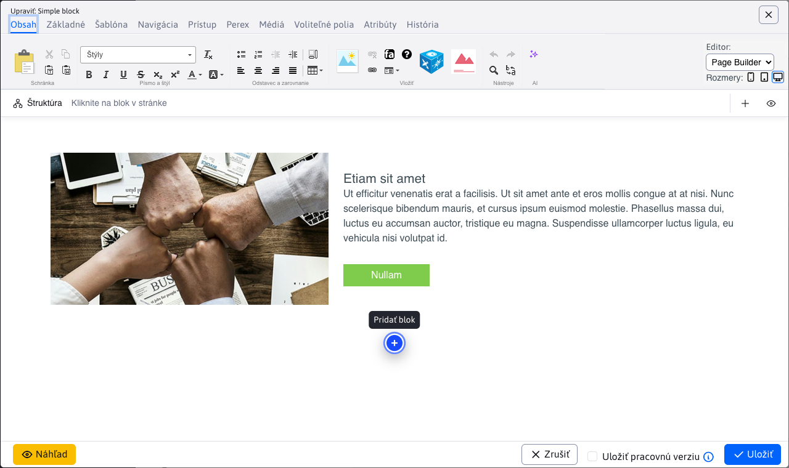

- Page Builder - upravený dizajn nástrojovej lišty pre lepšiu viditeľnosť na rôznych pozadiach (#58165).


- Page Builder - doplnená možnosť [filtrovať bloky](frontend/page-builder/blocks.md#názov-a-značky-bloku) podľa názvu a štítkov (#58173).

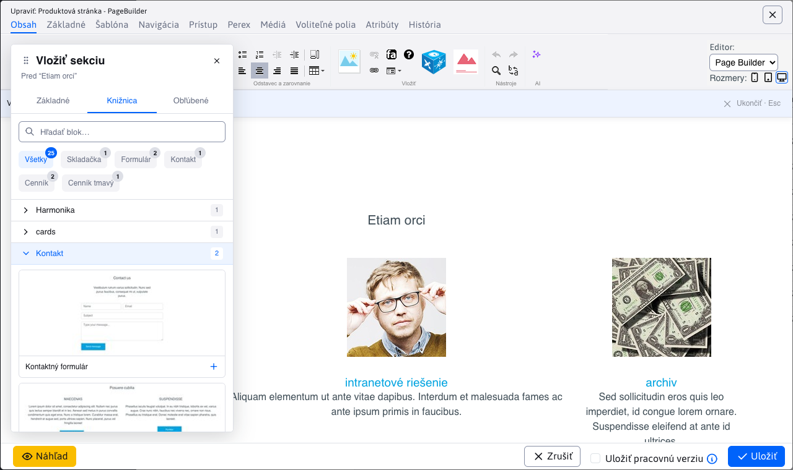

- Doplnená [detekcia zmeny obsahu](redactor/webpages/working-in-editor/README.md#detekcia-zmeny-obsahu-stránky) a upozornenie na neuložené zmeny pri zatváraní okna prehliadača. Zmeny sa začnú detegovať 5 sekúnd po otvorení web stránky. (#112).
- Doplnená možnosť nastaviť predvolené hodnoty pre tabuľky v CKEditore cez konfiguračné premenné, viac v [sekcii nastavenia CKEditora](frontend/setup/ckeditor.md#konfiguračné-premenné) (#58189).
- Doplnená možnosť vkladať [tlačidlo](frontend/setup/ckeditor.md#tlačidlo) - element `button`. Viete tak ľahko vkladať rôzne akčné `call to action` tlačidlá (#58201).
- Štýl - [výber štýlu](frontend/examples/template-bare/README.md#zoznam-štýlov-pre-editor) definovaného pre element napr. `p.paragraph-green,p.paragraph-red-border,p.paragraph-yellow-background` alebo `section.test-section,section.test-section-green` umožňuje nastaviť viaceré štýly súčasne. Opakovaným zvolením už nastaveného štýlu sa tento štýl odstráni (#OSK140).
- Upravený text pre publikovanie stránky do budúcnosti na **Naplánovať zmenu stránky po tomto dátume**, pri zvolení tejto možnosti sa aj zmení tlačidlo na uloženie na text **Naplánovať** pre jasnejšiu informáciu pre používateľa (#58253).
- Do žiadosti o schválenie web stránky doplnený zoznam zmenených polí (#58077).

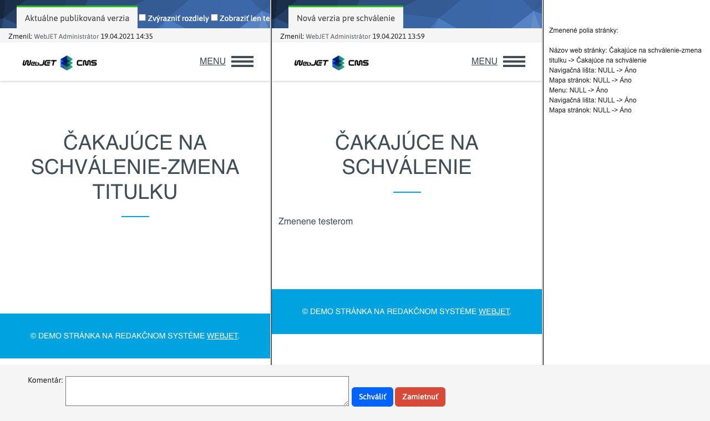

### Aplikácie

Prerobené nastavenie vlastností aplikácií v editore zo starého kódu v `JSP` na `Spring` aplikácie. Aplikácie automaticky získavajú aj možnosť nastaviť [zobrazenie na zariadeniach](custom-apps/appstore/README.md#podmienené-zobrazenie-aplikácie). Dizajn je v zhode so zvyškom WebJET CMS a dátových tabuliek (#58073).

- [Novinky](redactor/apps/news/README.md)

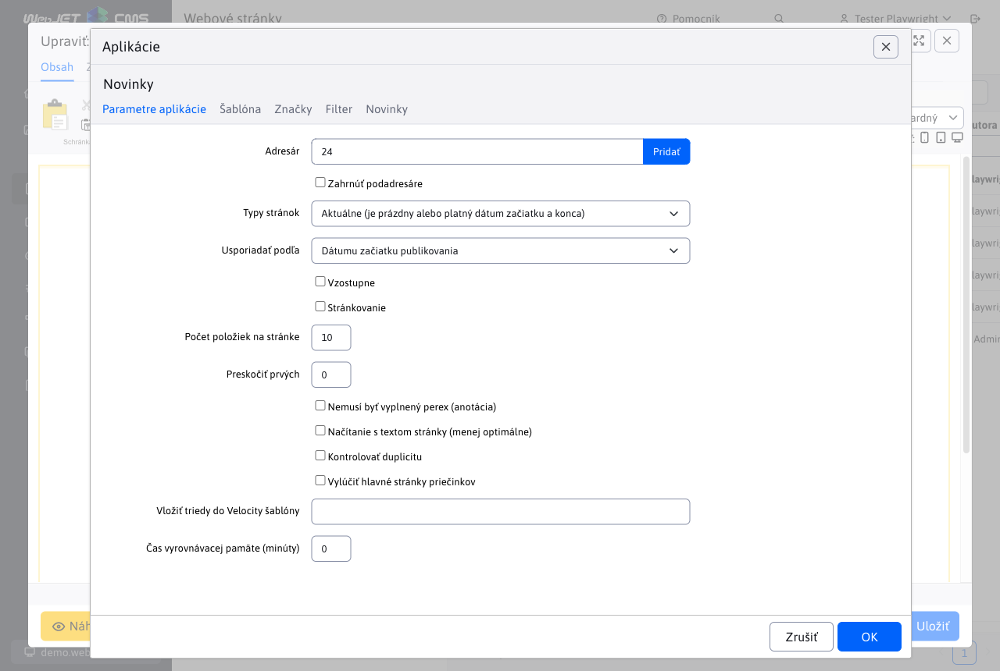

- [Formulár ľahko](redactor/apps/formsimple/README.md)

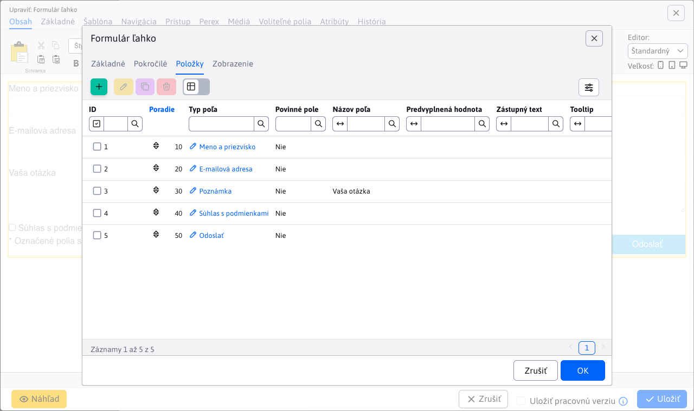

### Formuláre

- Nový spôsob vytvárania formulárov, ktoré môžu obsahovať [viac krokov](redactor/apps/multistep-form/README.md) s pokročilými funkciami. V zozname formulárov viete vytvoriť nový formulár, ktorému následne pridáte jednotlivé položky a prípadne viaceré kroky. Karta položky formuláru je viditeľná v detaile formuláru typu Viackrokový formulár (#58161).

<div class="video-container">
    <iframe width="560" height="315" src="https://www.youtube.com/embed/XRnwipQ-mH4" title="YouTube video player" frameborder="0" allow="accelerometer; autoplay; clipboard-write; encrypted-media; gyroscope; picture-in-picture" allowfullscreen></iframe>
</div>

- Zoznam formulárov - celá sekcia bola prerobená z technológie `Vue.js` na štandardné `Html + JavaScript` pre lepšiu integráciu do WebJET CMS a zjednodušenie úprav (#58161).
- Zoznam formulárov - umožnené vytváranie formuláru, ktorý je automaticky typu [viackrokový formulár](redactor/apps/multistep-form/README.md) (#58161).
- Zoznam formulárov - umožnené nastavovanie parametrov/atribútov všetkých typov formulárov priamo v editore formuláru (#58161).
- Zoznam formulárov - pole poznámka umožňuje vkladať formátovaný text, viete tak lepšie evidovať doplnkové informácie k formuláru (#58161).
- Detail formuláru - pridaná možnosť zobrazenie všetkých údajov prihláseného používateľa, údaje sa aj exportujú do Excelu (#58161).
- Overovací kód - pridaná možnosť odoslať formulár až po zadaní [overovacieho kódu](redactor/apps/form/README.md#nastavenie-potvrdenia-zaslaným-kódom) zaslaného na email adresu. Viete tak lepšie chrániť formuláre pred SPAM-om (#58161).

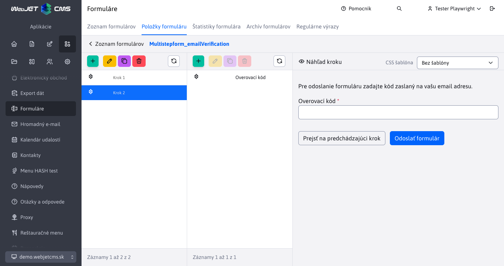

### Presmerovania

- Pridané možnosť ukončiť platnosť presmerovania v stanovenom čase a možnosť zadať poznámku s informáciou na čo presmerovanie slúži. Presmerovania, ktoré už nie sú časovo platné sa zobrazia červenou farbou (#58105).

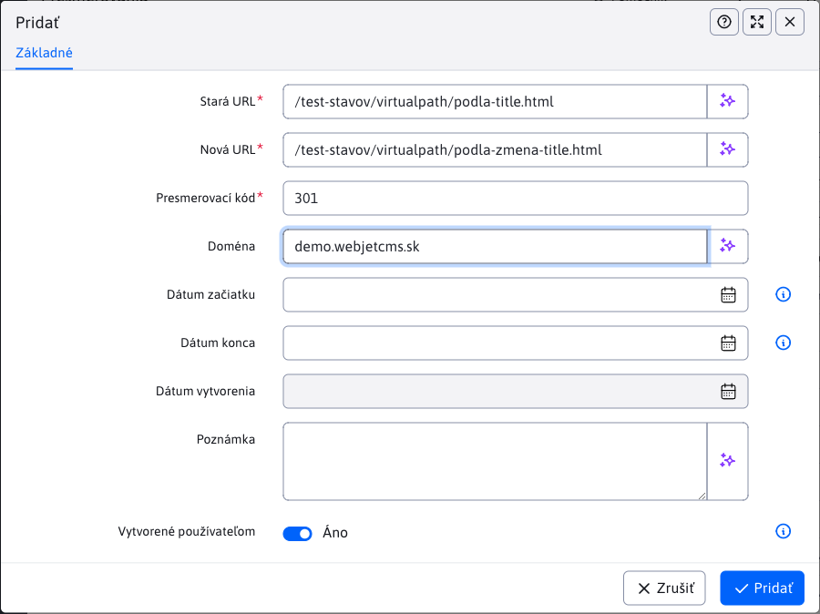

### Elektronický obchod

- Nová sekcia [Spôsoby doručenia](redactor/apps/eshop/delivery-methods/README.md), ako samostatná tabuľka nahrádza pôvodnú konfiguráciu dostupných spôsob doručenia, ktorá sa nachádzala priamo v nastaveniach aplikácie **elektronického obchodu**. Pre každý spôsob doručenia je možné nastaviť aj cenu, ktorá pri zvolení možnosti bude automaticky pripočítaná k objednávke. Nastavené spôsoby doručenia sa aj automaticky premietnu do možností pri vytváraní objednávky zákazníkom. Pripravené je doručenie poštou a osobné vyzdvihnutie, do budúcna plánujeme doplniť integráciu na doručovacie spoločnosti (#58061).


### Bezpečnosť

- Pridaná podpora pre povolenie iba **jedného aktívneho prihlásenia** na jedného používateľa. Režim zapnete nastavením konfiguračnej premennej `sessionSingleLogon` na hodnotu `true`. Pri novom prihlásení sa zruší predchádzajúca aktívna `session` (#58121).
- Odstránená nepodporovaná knižnica [commons-lang](https://mvnrepository.com/artifact/commons-lang/commons-lang), nahradená novou knižnicou [commons-lang3](https://mvnrepository.com/artifact/org.apache.commons/commons-lang3), v `update-2023-18.jsp` je aktualizačný skript pre úpravu zdrojových kódov (#58153).
- Pridaný zoznam [Moje aktívne prihlásenia](redactor/admin/welcome.md#moje-aktívne-prihlásenia) na úvodnej obrazovke administrácie, ktorá zobrazuje všetky aktívne prihlásenia do administrácie pod vaším používateľským kontom a možnosť ich ukončenia. Pridaná aj možnosť odoslať email prihlásenému administrátorovi (#58125).

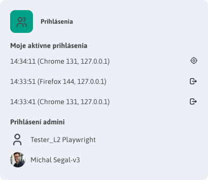

- Captcha - nastavením konfiguračnej premennej `captchaType` na hodnotu `none` je možné Captcha úplne vypnúť. Nezobrazí sa aj v prípade, ak má šablóna zobrazenej web stránky vypnutú SPAM ochranu. V takom prípade je ale potrebné korektne kontrolovať vypnutie SPAM ochrany šablóny aj v prípadnom kóde spracovania/verifikácie Captcha odpovede, pre formuláre je táto kontrola zabezpečená. Môžete použiť volanie `Captcha.isRequired(component, request)` pre overenie režimu a vypnutia spam ochrany (#54273-78).
- Aktualizovaná knižnica pre [odosielanie emailov](install/config/README.md#odosielanie-emailov) z `com.sun.mail:javax.mail:1.6.2` na `com.sun.mail:jakarta.mail:1.6.8` z dôvodu podpory nových autentifikačných mechanizmov SMTP serverov ako napríklad `NTLMv2` a pridaná konfiguračná premenná `smtpAuthMechanism` pre vynútenie použitia autorizačného mechanizmu - nastavte napr. na hodnotu `NTLM` pre vynútenie `NTLM` autorizácie namiesto použitia `BASIC` autorizácie (#58153).
- Upravené logovanie výnimiek pri prerušení HTTP spojenia (napr. pri zatvorení prehliadača, odchodu na inú web stránku a podobne). Takéto výnimky sa nezapíšu do logu, aby nenastala chyba obsadenia miesta. Týka sa výnimiek typu `IOExceptio` a názvov výnimiek definovaných cez konfiguračnú premennú `clientAbortMessages`, predvolene `response already,connection reset by peer,broken pipe,socket write error` (#58153).

### Iné menšie zmeny

- Vyhľadávanie - upravené načítanie zoznamu šablón pri hľadaní web stránok. Načítajú sa všetky šablóny bez ohľadu na ich dostupnosť v priečinkoch, aby sa nestalo, že pri editácii web stránky šablóna nie je dostupná (#58073).
- HTTP hlavičky - pridaná možnosť nastaviť hlavičku dlhšiu ako 255 znakov, napríklad pre nastavenie `Content-Security-Policy` ([#82](https://github.com/webjetcms/webjetcms/issues/82))

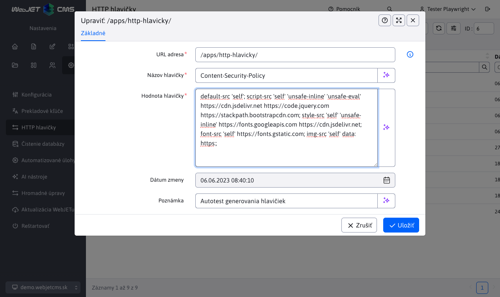

- Konfigurácia - upravený spôsob zmazania konfiguračnej premennej. Po vymazaní sa automatický nastaví pôvodná hodnota z `Constants`, aby bola rovnaká ako bude po reštarte servera. V pôvodnom riešení sa premenná len zmazala, ale jej hodnota zostala interne nastavená do reštartu servera (#57849).
- Konfigurácia - pridaná možnosť nastaviť [meno HTTP hlavičky](sysadmin/pentests/README.md#konfigurácia) pre získanie IP adresy návštevníka cez konfiguračnú premennú `xForwardedForHeader` (#58237).
- Bezpečnosť - pridaná možnosť konfigurácie blokovaných ciest súborov/adresárov cez premennú `pathFilterBlockedPaths`. Štandardne sú blokované URL adresy, ktoré v názve obsahujú výraz `.DS_Store,debug.,config.properties,Thumbs.db,.git,.svn`. Je možné pridať ďalšie podľa potreby (#PR103).
- Značky - upravené zobrazené značiek, v prípade duplicity hodnôt. Porovnanie je bez vplyvu diakritiky a veľkých/malých písmen [#115](https://github.com/webjetcms/webjetcms/issues/115).

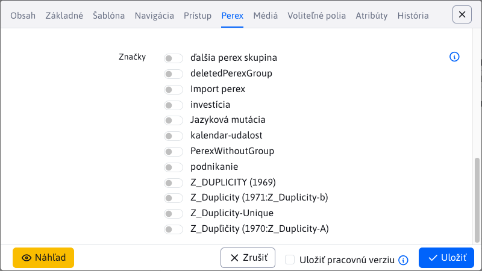

- Zrkadlenie - pridaná možnosť zobraziť obrázok vlajky namiesto textu v [prepínači jazyka stránky](redactor/apps/docmirroring/README.md#vytvorenie-odkazu-na-jazykové-mutácie-v-hlavičke-stránky) (#54273-79).
- Zmena hesla - pridaná možnosť nastaviť meno a email adresu z ktorej je odoslaný email s odkazom na zmenu hesla cez konfiguračné premenné `passwordResetDefaultSenderEmail` a `passwordResetDefaultSenderName` (#58125).
- Štatistika - doplnené sumárne počty videní a návštev v TOP stránkach (#PR136).
- Novinky - premenovaná hodnota usporiadať podľa priority na usporiadať podľa Poradia usporiadania (priority) pre zladenie s hodnotou v editore (#57667-16).
- Formulár ľahko - pridaná možnosť nastaviť hodnotu `useFormDocId` pre vloženie formuláru napr. do pätičky stránky (#57667-16).
- Novinky / Šablóny noviniek - presunuté pole `contextClasses` z aplikácie Novinky do Šablóny noviniek, aby sa vlastnosť nastavovala priamo v šablóne noviniek. Pôvodná hodnota `contextClasses` z Noviniek bude naďalej fungovať, ale nie je možné ho už nastavovať v používateľskom rozhraní (#58245).
- Manažér dokumentov - pridaná možnosť [upraviť metadáta historickej verzie dokumentu](redactor/files/file-archive/README.md#úprava-historickej-verzie-dokumentu-v-manažéri) v manažéri dokumentov (#58241).
- Hromadný email - upravené auditovanie zmien v kampani. Ak sa pridá skupina neaudituje sa celý zoznam príjemcov (bolo to zbytočne veľa záznamov v audite), zapíše sa len zoznam zmenených skupín. Pri manuálnom pridaní emailov sa naďalej audituje meno aj emailová adresa (#58249).
- Používatelia - pri importe ak stĺpec v Exceli neobsahuje pole heslo, tak sa pre nových používateľov vygeneruje náhodné heslo. Ak nie je v Exceli zadaný stav Schválený používateľ, tak sa nastaví na hodnotu `true` (#58253).
- MultiWeb - doplnené zobrazenie domény v bočnej lište (#58317-0).
- MultiWeb - doplnená možnosť nastaviť doménu presmerovania aby bolo možné zadať `https://` prefix (#58317-0).
- MultiWeb - doplnená kontrola práv pre skupiny médií a značky (#58317-0).
- Zoznam formulárov - nastavenie [spracovateľa formulárov](custom-apps/apps/multistep-forms/README.md), pomocou autocomplete poľa, ktorý ponúka triedy implementujúce `FormProcessorInterface` (#58313).
- Číselníky - doplnené odstránenie medzier na začiatku a konci poľa typu reťazec v dátach číselníka (#OSK233).

### Oprava chýb

- Značky - opravené duplikovanie priečinka v Zobraziť pre pri uložení značky, odstránený výber priečinka z ostatných domén, keďže značky sú už oddelené podľa domén (#58121).
- Web stránky - opravené vkladanie tvrdej medzery za spojky tak, aby sa aplikovalo iba na text stránky a nie na atribúty alebo HTML značky (#OSK235).
- Datatables - opravené spracovanie udalosti `Enter` pri vybraných vstupných poliach filtrov tabuľky (#58313).
- Datatables - opravené filtrovanie kedy sa viacero `serverSide:false` tabuliek na stránke navzájom ovplyvňovalo pri filtrovaní (#58313).
- Elektronický obchod - opravené odosielanie email notifikácie, pri zmene stavu objednávky (#58313).
- Elektronický obchod - opravené automatické nastavenie stavu objednávky po zmene platieb (#58313).

### Dokumentácia

- Aktualizované všetky fotky obrazovky v českej verzii dokumentácie (#58113).

### Pre programátora

- Voľné polia - pridaná možnosť špecifikovať vlastné stĺpce pre label a hodnotu pri [prepojení na číselník](frontend/webpages/customfields/README.md#číselník). Umožňuje flexibilnejšie nastavenie, ktorá vlastnosť z číselníka sa použije ako zobrazený text a ktorá ako uložená hodnota (#PR108).
- Zmazané nepoužívané súbory `/admin/spec/gallery_editor_perex_group.jsp,/admin/spec/perex_group.jsp`, ak ich vo vašom projekte používate zoberte ich zo [staršej verzie](https://github.com/webjetcms/webjetcms/tree/release/2025.40/src/main/webapp/admin/spec) WebJET CMS (#58073).
- Mierne upravené API v [NewsActionBean](../../src/main/java/sk/iway/iwcm/components/news/NewsActionBean.java), hlavne nastavenie `groupIds` ktoré sú teraz typu `List<GroupDetails>`. Môžete použiť `setGroupIds(int[] groupIds)` pre nastavenie s poľom ID hodnôt (#58073).
- Opravená možnosť vkladania úvodzoviek do parametrov aplikácií (#58117).
- Pripravené kontajnery pre všetky podporované databázové serveri vo WebJET CMS pre ľahké spustenie vo VS Code. Nachádzajú sa v priečinku `.devcontainer/db` (#58137).
- Elektronický obchod - kvôli zmenám pri procese implementácie **spôsobov doručenia** je potrebné vykonať úpravu súboru pomocou aktualizačného skriptu `update-2023-18.jsp` a to nad sekciou `basket` (#58061).
- Elektronický obchod - premenovaná anotácia `@PaymentMethod` na `@FieldsConfig` a `@PaymentFieldMapAttr` na `@FieldMapAttr` pre zjednotenie anotácií medzi platbami a spôsobmi doručenia (#58061).
- Elektronický obchod - pri procese implementácie **spôsobov doručenia** do súboru `order_form.jsp` pribudlo niekoľko zmien, ktoré si musíte implementovať manuálne. Tieto zmeny sú príliš komplexné, aby sa dali doplniť pomocou aktualizačného skriptu `update-2023-18.jsp` (#58061).
- Navigačná lišta - pridaná možnosť použiť vlastnú implementáciu generátora [navigačnej lišty](redactor/apps/navbar/README.md). Cez konfiguračnú premennú `navbarDefaultType` je možné nastaviť meno triedy implementujúcej `NavbarInterface` (#PR101).
- Odstránená nepodporovaná knižnica [commons-lang](https://mvnrepository.com/artifact/commons-lang/commons-lang), nahradená novou knižnicou [commons-lang3](https://mvnrepository.com/artifact/org.apache.commons/commons-lang3), v `update-2023-18.jsp` je aktualizačný skript pre úpravu zdrojových kódov (#58153).
- Aktualizovaná knižnica [displaytag](https://mvnrepository.com/artifact/com.github.hazendaz/displaytag) na verziu `2.9.0` (#58153).
- Upravené spracovanie nahrávania súborov `multipart/form-data`. V Spring aplikáciach pre súborové pole použite namiesto `org.apache.commons.fileupload.FileItem` priamo `org.springframework.web.multipart.MultipartFile`, ktoré bude automaticky nastavené. Nie je už potrebné používať volanie typu `entity.setDocument(MultipartWrapper.getFileStoredInRequest("document", request))` pre získanie súboru. **Upozornenie:** je potrebné nahradiť všetky výskyty `CommonsMultipartFile` za `MultipartFile` vo vašom kóde, tiež zrušiť URL parametre v Spring aplikácii pre vynútené spracovanie. Výraz `data-th-action="@{${request.getAttribute('ninja').page.urlPath}(\_\_forceParse=1,\_\_setf=1)}"` nahraďte za `data-th-action="${request.getAttribute('ninja').page.urlPath}"`. Môžete použiť `/admin/update/update-2023-18.jsp` na aktualizáciu súborov (#57793-3).
- Doplnená možnosť vytvorenia [projektových kópií súborov](frontend/customize-apps/README.md) Spring aplikácii. Stačí vytvoriť vlastnú verziu súboru v priečinku `/apps/INSTALL_NAME/` podobne ako sa používa pre JSP súbory. WebJET CMS najskôr hľadá súbor v projektovom priečinku a ak nie je nájdený použije štandardný súbor z `/apps/` priečinka (#58073).
- Doplnená možnosť nastaviť [meno pre CSS štýl](frontend/examples/template-bare/README.md) v CSS súbore cez komentár `/* editor title: Style Name */`. Meno sa zobrazí v zozname štýlov v editore (#58209).
- Editor - upravený dialóg pre nastavenie `a.btn` - zrušené nastavenie farieb a veľkostí, [používajú sa už len CSS triedy](frontend/setup/ckeditor.md#tlačidlo) rovnako ako pre `button` (#57657-16).
- Dátové tabuľky - možnosť zobrazenia iba ikony bez poradia pre `rowReorder` ak danému stĺpcu pridáme triedu `icon-only` (#58161).
- Dátové tabuľky - nové možnosti pre výber riadkov v tabuľke `toggleSelector` a `toggleStyle`, viac v [sekcii dátových tabuliek](developer/datatables/README.md#možnosti-konfigurácie) (#58161).
- Dátové tabuľky - nová možnosť vlastnej [render](developer/datatables-editor/datatable-columns.md) funkcie pomocou anotácie `@DataTableColumn(...renderFunction = "renderStepName")`. Umožní vám zobraziť v stĺpci zložené hodnoty z viacerých polí a podobne (#58161).
- Dátové tabuľky - pridaná možnosť [presmerovať používateľa](developer/datatables/restcontroller.md#presmerovanie-po-uložení) na inú stránku po uložení záznamu volaním metódy `setRedirect(String redirect)` (#58161).
- Formuláre - Upravené zobrazenie zoznamu formulárov, zrušená trieda `FormAttributesDB`, nahradená triedou `FormService`. Nastavenie formulárov zmenené z tabuľky `form_attributes` na tabuľku `form_settings`. Odporúčame po aktualizácii overiť funkčnosť všetkých formulárov na web stránke (#58161).
- Formuláre - vytvorenie novej tabuľky `form_settings` ako náhradu za tabuľku `form_attributes`, kde sa ukladajú vlastnosti formulárov. Jednotlivé atribúty (nastavenia) sú teraz uložené v samostatných stĺpcoch ako jeden záznam na riadok. Dáta boli do novej tabuľky konvertované pomocou `UpdateDatabase.java` (#58161).
- Prechod na novú tabuľku `form_settings` pre vlastnosti formulárov v `.jsp` súboroch. Je potrebné si spustiť aktualizačný skript `update-2025-0.jsp`, ktorý upraví potrebné `.jsp` (#58161).
- Zoznam formulárov - nastavovanie parametrov/atribútov všetkých typov formulárov presmerované z tabuľky `form_attributes` do novej tabuľky `form_settings` (#58161).
- Dátové tabuľky - pridaná BE podpora pre `row-reorder`, kedy je možné meniť poradie záznamov priamo v dátovej tabuľke pomocou drag&drop (#58161).
- Udalosti - pridaná udalosť [Aktualizácia kódov v texte](developer/backend/events.md#aktualizácia-kódov-v-texte) pre možnosť úprav kódov v texte stránky typu `!CUSTOM_CODE!` a podobne (#54273-63).
- Dátové tabuľky - pridané [Spring udalosti](developer/backend/events-datatable.md) pre možnosť úprav dát v zákazníckych inštaláciách (#54273-63).

### Testovanie

- Doplnený skript [rm-same-images.sh](../../src/test/webapp/rm-same-images.sh) pre odstránenie rovnakých obrázkov pri vytvorení nových snímkov obrazovky (#58113).


