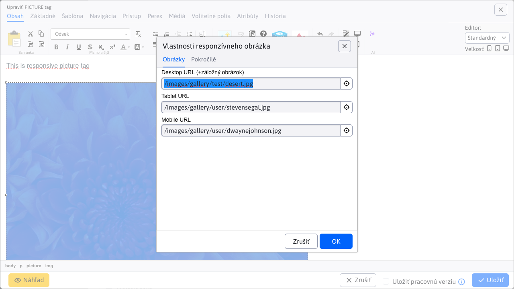

# Zoznam zmien verzia 2026

## 2026.0-SNAPSHOT

> Vývojová verzia aktualizovaná z main repozitára.

!>**Upozornenie:** Verzia určená pre `jakarta namespace`, vyžaduje aplikačný server Tomcat 10/11, používa Spring verzie 7. Pred aktualizáciou [skontrolujte požiadavky](install/versions.md#zmeny-pri-prechode-na-jakarta-verziu).

### Bezpečnosť

- Aktualizované knižnice `AspectJ, Eclipselink, slf4j, GoPay` (#57793).
- Pridaná možnosť autorizácie cez [OAuth2/Keycloak](install/oauth2/oauth2.md) (#56665).

### Pre programátora

- Aktualizovaný spôsob zobrazenia API dokumentácie na štandard [OpenAPI 3.0](https://www.openapis.org/). Dokumentácia je dostupná na adrese `/admin/swagger-ui/index.html` pre používateľov, ktorí majú právo na editáciu administrátorov (#57793).
- Trieda `PageListHolder/MutableSortDefinition` je v Spring 7 `Deprecated`, ako priamu náhradu môžete použiť našu implementáciu `PagedListHolder/SortDefinition` z package `sk.iway.iwcm.system.datatable` (#57793).
- Odstránená anotácia `@Temporal` na dátumových stĺpcoch v databázových entitách, odporúčané riešenie je pre nové entity používať `java.time.*` typy. Zdá sa, že Eclipselink/JPA správne deteguje typ `Date` ako dátum a čas a anotácia nie je potrebná. Odporúčame po aktualizácii skontrolovať správanie dátumových polí (#57793).
- Webové stránky - obnovenie z koša - doplnené [publikovanie udalostí](developer/backend/events.md) `ON_RECOVER` a `AFTER_RECOVER` pre obnovu stránok a priečinkov z koša (#161).

## 2026.0.x

> Opravná verzia pôvodnej verzie 2026.0.

- Bannerový Systém - opravené načítanie zoznamu skupín v Microsoft SQL.
- Galéria - opravené uloženie nastavenia galérie pre priečinok na disku (bez záznamu v databáze) v Oracle DB.
- Hromadný email - opravený prenos príjemcov pri duplikovaní kampane v Oracle DB (#54273-82).
- Hromadný email - opravené nahradenie externých odkazov, ktoré obsahujú viaceré URL parametre v emaile (#54273-83).

## 2026.0

> **WebJET CMS 2026.0** prináša vylepšenú verziu nástroja **Page Builder** pre tvorbu **komplexných web stránok**. V blokoch je možné **vyhľadávať a filtrovať** na základe značiek, ľahko tak nájdete vhodný blok pre vloženie do stránky. Pridané boli nové funkcie ako **rozdelenie stĺpca**, **vkladanie viacerých sekcií naraz** a **stále zobrazené tlačidlo na pridanie novej sekcie** pre rýchle rozšírenie obsahu stránky.
>
> Podpora **PICTURE elementu** umožňuje zobrazovať **rôzne obrázky podľa rozlíšenia obrazovky** návštevníka, čím sa zlepšuje vizuálny zážitok na rôznych zariadeniach. Navyše je možné vkladať **vlastné ikony** definované v spoločnom SVG súbore, čo prináša väčšiu flexibilitu v dizajne.
>
> Nový nástroj pre **tvorbu formulárov** umožňuje ľahko vytvárať **viackrokové formuláre** s možnosťou programovej validácie jednotlivých krokov a možnosťou **potvrdenia platnosti emailovej adresy** pomocou zaslaného kódu. Vyhnete sa tak vyplneniu formulárov rôznymi robotmi.

!> Upozornenie: verzia **2026.0** je posledná verzia pre aplikačný server Tomcat 9 s využitím `javax namespace`. Všetky novšie verzie od `2026.18` budú určené **už len pre** aplikačný server **Tomcat 10/11** s využitím `Jakarta namespace`. Zmena z `javax` na `jakarta namespace` je dôsledkom odovzdania `Java EE` špecifikácií z Oracle do **Open Source/Eclipse Foundation**, kde projekt pokračuje pod názvom `Jakarta EE`. Táto zmena si vyžaduje aktualizáciu aplikačného servera, keďže verzie Tomcat 10 a novšie už používajú výhradne `jakarta namespace` pre všetky `Java EE` API. Aktuálny zoznam dostupných verzií nájdete v [sekcii inštalácia](install/versions.md).

### Prelomové zmeny

- Aktualizované knižnice `commons-lang,displaytag`, viac v [sekcii pre programátora](#pre-programátora) (#58153).
- Zmenené správanie ikony Bloky v režime Page Builder - [textové bloky integrované](frontend/page-builder/blocks.md) do priečinka `content` podobne ako sú bloky pre `section, container, column` (#58165).
- Upravené spracovanie **nahrávania súborov** `multipart/form-data`, viac v [sekcii pre programátora](#pre-programátora) (#57793-3).
- Odporúčame **skontrolovať funkčnosť všetkých formulárov** z dôvodu úprav ich spracovania, viac informácií v sekcii [pre programátora](#pre-programátora) (#58161).

### Webové stránky

- Pridaná možnosť vkladať `PICTURE` element, ktorý zobrazuje [obrázok podľa rozlíšenia obrazovky](frontend/setup/ckeditor.md#picture-element) návštevníka. Môžete teda zobraziť rozdielne obrázky na mobilnom telefóne, tablete alebo počítači (#58141).

- Pridaná možnosť vkladať [vlastné ikony](frontend/setup/ckeditor.md#svg-ikony) definované v spoločnom SVG súbore (#58181).

- Pridaný prenos aktuálneho HTML kódu pri prepnutí režimu editora Štandardný/HTML/Page Builder. Môžete tak jednoducho upraviť Page Builder stránku v HTML kóde a znova zobraziť úpravy v režime Page Builder (#58145).
- Pridané kontextové menu Zmazať element, pomocou ktorého môžete ľahko zmazať tlačidlo, odkaz, odstavec, formulár, sekciu a podobne. Stačí keď na element kliknete pravým tlačidlom pre zobrazenie kontextového menu (#osk233).
- Page Builder - upravené generovanie štýlov pri použití nástroja ceruzka. Do CSS štýlu sa generujú len zmenené hodnoty, tie sú v dialógovom okne zvýraznené modrým orámovaním vstupného poľa (#58145).
- Page Builder - pridaná možnosť volania [vlastného JavaScript súboru](frontend/page-builder/blocks.md#podporný-javascript-kód) s podpornými funkciami pre úpravu kódu. Pridaná možnosť upraviť nastavenia ako selektory pre elementy, farby a podobne (#58141).
- Page Builder - upravené generovanie kotiev pri kartách tak, aby názov kotvy bol generovaný podľa názvu karty - pôvodne bol generovaný nesémanticky ako `autotabs-x-y` (#112).
- Page Builder - doplnená možnosť nastaviť šírku stĺpca na `auto` pre automatické prispôsobenie obsahu (#114).
- Page Builder - doplnená možnosť pripraviť [textové bloky](frontend/page-builder/blocks.md) priamo do priečinka `content`, vkladajú sa namiesto pôvodných blokov čítaných z web stránok z priečinka Šablóny. Web dizajnér ich pripraví spolu s ostatnými typmi Page Builder blokov. Umožňuje rýchle vloženie často používaných textových častí, tlačidiel a podobne (#58165).
- Page Builder - pri vkladaní nového bloku je predvolená karta Knižnica namiesto Základné, aby sa zjednodušil výber bloku z pripraveného zoznamu (#58165).
- Page Builder - doplnená možnosť rozdeliť stĺpec na dve časti pomocou novej funkcie Rozdeliť stĺpec. Vyvoláte ju pomocou kliknutia na + v žltej lište, zvolením možnosti Blok a následne v karte Základné zvolíte možnosť Rozdeliť stĺpec. Funkcia umožňuje rýchle rozdelenie stĺpca bez nutnosti vkladať nový stĺpec a presúvať obsah (#58165).
- Page Builder - doplnená možnosť vložiť blok, ktorý obsahuje viacero sekcií alebo iných elementov - označia sa po vložení všetky sekcie (#58173).
- Page Builder - doplnené [ID bloku](frontend/page-builder/blocks.md#id-bloku) do atribútu `data-pb-id` pre možnosť vyhľadania použitia bloku vo web stránkach cez vyhľadávanie v administrácii (#58193).
- Page Builder - zoznam obľúbených blokov je ukladaný pre každého používateľa zvlášť, aby si každý mohol spravovať vlastný zoznam obľúbených blokov (#58193).
- Page Builder - pridaná stále zobrazená ikona na pridanie novej sekcie na konci stránky, čo zjednodušuje pridávanie nových sekcií do stránky (#58173).

- Page Builder - upravený dizajn nástrojovej lišty pre lepšiu viditeľnosť na rôznych pozadiach (#58165).

- Page Builder - doplnená možnosť [filtrovať bloky](frontend/page-builder/blocks.md#názov-a-značky-bloku) podľa názvu a štítkov (#58173).

- Doplnená [detekcia zmeny obsahu](redactor/webpages/working-in-editor/README.md#detekcia-zmeny-obsahu-stránky) a upozornenie na neuložené zmeny pri zatváraní okna prehliadača. Zmeny sa začnú detegovať 5 sekúnd po otvorení web stránky. (#112).
- Doplnená možnosť nastaviť predvolené hodnoty pre tabuľky v CKEditore cez konfiguračné premenné, viac v [sekcii nastavenia CKEditora](frontend/setup/ckeditor.md#konfiguračné-premenné) (#58189).
- Doplnená možnosť vkladať [tlačidlo](frontend/setup/ckeditor.md#tlačidlo) - element `button`. Viete tak ľahko vkladať rôzne akčné `call to action` tlačidlá (#58201).
- Štýl - [výber štýlu](frontend/examples/template-bare/README.md#zoznam-štýlov-pre-editor) definovaného pre element napr. `p.paragraph-green,p.paragraph-red-border,p.paragraph-yellow-background` alebo `section.test-section,section.test-section-green` umožňuje nastaviť viaceré štýly súčasne. Opakovaným zvolením už nastaveného štýlu sa tento štýl odstráni (#OSK140).
- Upravený text pre publikovanie stránky do budúcnosti na **Naplánovať zmenu stránky po tomto dátume**, pri zvolení tejto možnosti sa aj zmení tlačidlo na uloženie na text **Naplánovať** pre jasnejšiu informáciu pre používateľa (#58253).
- Do žiadosti o schválenie web stránky doplnený zoznam zmenených polí (#58077).

### Aplikácie

Prerobené nastavenie vlastností aplikácií v editore zo starého kódu v `JSP` na `Spring` aplikácie. Aplikácie automaticky získavajú aj možnosť nastaviť [zobrazenie na zariadeniach](custom-apps/appstore/README.md#podmienené-zobrazenie-aplikácie). Dizajn je v zhode so zvyškom WebJET CMS a dátových tabuliek (#58073).

- [Novinky](redactor/apps/news/README.md)

- [Formulár ľahko](redactor/apps/formsimple/README.md)

### Formuláre

- Nový spôsob vytvárania formulárov, ktoré môžu obsahovať [viac krokov](redactor/apps/multistep-form/README.md) s pokročilými funkciami. V zozname formulárov viete vytvoriť nový formulár, ktorému následne pridáte jednotlivé položky a prípadne viaceré kroky. Karta položky formuláru je viditeľná v detaile formuláru typu Viackrokový formulár (#58161).

    <iframe width="560" height="315" src="https://www.youtube.com/embed/XRnwipQ-mH4" title="YouTube video player" frameborder="0" allow="accelerometer; autoplay; clipboard-write; encrypted-media; gyroscope; picture-in-picture" allowfullscreen></iframe>

- Zoznam formulárov - celá sekcia bola prerobená z technológie `Vue.js` na štandardné `Html + JavaScript` pre lepšiu integráciu do WebJET CMS a zjednodušenie úprav (#58161).
- Zoznam formulárov - umožnené vytváranie formuláru, ktorý je automaticky typu [viackrokový formulár](redactor/apps/multistep-form/README.md) (#58161).
- Zoznam formulárov - umožnené nastavovanie parametrov/atribútov všetkých typov formulárov priamo v editore formuláru (#58161).
- Zoznam formulárov - pole poznámka umožňuje vkladať formátovaný text, viete tak lepšie evidovať doplnkové informácie k formuláru (#58161).
- Detail formuláru - pridaná možnosť zobrazenie všetkých údajov prihláseného používateľa, údaje sa aj exportujú do Excelu (#58161).
- Overovací kód - pridaná možnosť odoslať formulár až po zadaní [overovacieho kódu](redactor/apps/form/README.md#nastavenie-potvrdenia-zaslaným-kódom) zaslaného na email adresu. Viete tak lepšie chrániť formuláre pred SPAM-om (#58161).

### Presmerovania

- Pridané možnosť ukončiť platnosť presmerovania v stanovenom čase a možnosť zadať poznámku s informáciou na čo presmerovanie slúži. Presmerovania, ktoré už nie sú časovo platné sa zobrazia červenou farbou (#58105).

### Elektronický obchod

- Nová sekcia [Spôsoby doručenia](redactor/apps/eshop/delivery-methods/README.md), ako samostatná tabuľka nahrádza pôvodnú konfiguráciu dostupných spôsob doručenia, ktorá sa nachádzala priamo v nastaveniach aplikácie **elektronického obchodu**. Pre každý spôsob doručenia je možné nastaviť aj cenu, ktorá pri zvolení možnosti bude automaticky pripočítaná k objednávke. Nastavené spôsoby doručenia sa aj automaticky premietnu do možností pri vytváraní objednávky zákazníkom. Pripravené je doručenie poštou a osobné vyzdvihnutie, do budúcna plánujeme doplniť integráciu na doručovacie spoločnosti (#58061).

### Bezpečnosť

- Pridaná podpora pre povolenie iba **jedného aktívneho prihlásenia** na jedného používateľa. Režim zapnete nastavením konfiguračnej premennej `sessionSingleLogon` na hodnotu `true`. Pri novom prihlásení sa zruší predchádzajúca aktívna `session` (#58121).
- Odstránená nepodporovaná knižnica [commons-lang](https://mvnrepository.com/artifact/commons-lang/commons-lang), nahradená novou knižnicou [commons-lang3](https://mvnrepository.com/artifact/org.apache.commons/commons-lang3), v `update-2023-18.jsp` je aktualizačný skript pre úpravu zdrojových kódov (#58153).
- Pridaný zoznam [Moje aktívne prihlásenia](redactor/admin/welcome.md#moje-aktívne-prihlásenia) na úvodnej obrazovke administrácie, ktorá zobrazuje všetky aktívne prihlásenia do administrácie pod vaším používateľským kontom a možnosť ich ukončenia. Pridaná aj možnosť odoslať email prihlásenému administrátorovi (#58125).

- Captcha - nastavením konfiguračnej premennej `captchaType` na hodnotu `none` je možné Captcha úplne vypnúť. Nezobrazí sa aj v prípade, ak má šablóna zobrazenej web stránky vypnutú SPAM ochranu. V takom prípade je ale potrebné korektne kontrolovať vypnutie SPAM ochrany šablóny aj v prípadnom kóde spracovania/verifikácie Captcha odpovede, pre formuláre je táto kontrola zabezpečená. Môžete použiť volanie `Captcha.isRequired(component, request)` pre overenie režimu a vypnutia spam ochrany (#54273-78).
- Aktualizovaná knižnica pre [odosielanie emailov](install/config/README.md#odosielanie-emailov) z `com.sun.mail:javax.mail:1.6.2` na `com.sun.mail:jakarta.mail:1.6.8` z dôvodu podpory nových autentifikačných mechanizmov SMTP serverov ako napríklad `NTLMv2` a pridaná konfiguračná premenná `smtpAuthMechanism` pre vynútenie použitia autorizačného mechanizmu - nastavte napr. na hodnotu `NTLM` pre vynútenie `NTLM` autorizácie namiesto použitia `BASIC` autorizácie (#58153).
- Upravené logovanie výnimiek pri prerušení HTTP spojenia (napr. pri zatvorení prehliadača, odchodu na inú web stránku a podobne). Takéto výnimky sa nezapíšu do logu, aby nenastala chyba obsadenia miesta. Týka sa výnimiek typu `IOExceptio` a názvov výnimiek definovaných cez konfiguračnú premennú `clientAbortMessages`, predvolene `response already,connection reset by peer,broken pipe,socket write error` (#58153).

### Iné menšie zmeny

- Vyhľadávanie - upravené načítanie zoznamu šablón pri hľadaní web stránok. Načítajú sa všetky šablóny bez ohľadu na ich dostupnosť v priečinkoch, aby sa nestalo, že pri editácii web stránky šablóna nie je dostupná (#58073).
- HTTP hlavičky - pridaná možnosť nastaviť hlavičku dlhšiu ako 255 znakov, napríklad pre nastavenie `Content-Security-Policy` ([#82](https://github.com/webjetcms/webjetcms/issues/82))

- Konfigurácia - upravený spôsob zmazania konfiguračnej premennej. Po vymazaní sa automatický nastaví pôvodná hodnota z `Constants`, aby bola rovnaká ako bude po reštarte servera. V pôvodnom riešení sa premenná len zmazala, ale jej hodnota zostala interne nastavená do reštartu servera (#57849).
- Konfigurácia - pridaná možnosť nastaviť [meno HTTP hlavičky](sysadmin/pentests/README.md#konfigurácia) pre získanie IP adresy návštevníka cez konfiguračnú premennú `xForwardedForHeader` (#58237).
- Bezpečnosť - pridaná možnosť konfigurácie blokovaných ciest súborov/adresárov cez premennú `pathFilterBlockedPaths`. Štandardne sú blokované URL adresy, ktoré v názve obsahujú výraz `.DS_Store,debug.,config.properties,Thumbs.db,.git,.svn`. Je možné pridať ďalšie podľa potreby (#PR103).
- Značky - upravené zobrazené značiek, v prípade duplicity hodnôt. Porovnanie je bez vplyvu diakritiky a veľkých/malých písmen [#115](https://github.com/webjetcms/webjetcms/issues/115).

- Zrkadlenie - pridaná možnosť zobraziť obrázok vlajky namiesto textu v [prepínači jazyka stránky](redactor/apps/docmirroring/README.md#vytvorenie-odkazu-na-jazykové-mutácie-v-hlavičke-stránky) (#54273-79).
- Zmena hesla - pridaná možnosť nastaviť meno a email adresu z ktorej je odoslaný email s odkazom na zmenu hesla cez konfiguračné premenné `passwordResetDefaultSenderEmail` a `passwordResetDefaultSenderName` (#58125).
- Štatistika - doplnené sumárne počty videní a návštev v TOP stránkach (#PR136).
- Novinky - premenovaná hodnota usporiadať podľa priority na usporiadať podľa Poradia usporiadania (priority) pre zladenie s hodnotou v editore (#57667-16).
- Formulár ľahko - pridaná možnosť nastaviť hodnotu `useFormDocId` pre vloženie formuláru napr. do pätičky stránky (#57667-16).
- Novinky / Šablóny noviniek - presunuté pole `contextClasses` z aplikácie Novinky do Šablóny noviniek, aby sa vlastnosť nastavovala priamo v šablóne noviniek. Pôvodná hodnota `contextClasses` z Noviniek bude naďalej fungovať, ale nie je možné ho už nastavovať v používateľskom rozhraní (#58245).
- Manažér dokumentov - pridaná možnosť [upraviť metadáta historickej verzie dokumentu](redactor/files/file-archive/README.md#úprava-historickej-verzie-dokumentu-v-manažéri) v manažéri dokumentov (#58241).
- Hromadný email - upravené auditovanie zmien v kampani. Ak sa pridá skupina neaudituje sa celý zoznam príjemcov (bolo to zbytočne veľa záznamov v audite), zapíše sa len zoznam zmenených skupín. Pri manuálnom pridaní emailov sa naďalej audituje meno aj emailová adresa (#58249).
- Používatelia - pri importe ak stĺpec v Exceli neobsahuje pole heslo, tak sa pre nových používateľov vygeneruje náhodné heslo. Ak nie je v Exceli zadaný stav Schválený používateľ, tak sa nastaví na hodnotu `true` (#58253).
- MultiWeb - doplnené zobrazenie domény v bočnej lište (#58317-0).
- MultiWeb - doplnená možnosť nastaviť doménu presmerovania aby bolo možné zadať `https://` prefix (#58317-0).
- MultiWeb - doplnená kontrola práv pre skupiny médií a značky (#58317-0).
- Zoznam formulárov - nastavenie [spracovateľa formulárov](custom-apps/apps/multistep-forms/README.md), pomocou autocomplete poľa, ktorý ponúka triedy implementujúce `FormProcessorInterface` (#58313).
- Číselníky - doplnené odstránenie medzier na začiatku a konci poľa typu reťazec v dátach číselníka (#OSK233).

### Oprava chýb

- Značky - opravené duplikovanie priečinka v Zobraziť pre pri uložení značky, odstránený výber priečinka z ostatných domén, keďže značky sú už oddelené podľa domén (#58121).
- Web stránky - opravené vkladanie tvrdej medzery za spojky tak, aby sa aplikovalo iba na text stránky a nie na atribúty alebo HTML značky (#OSK235).
- Datatables - opravené spracovanie udalosti `Enter` pri vybraných vstupných poliach filtrov tabuľky (#58313).
- Datatables - opravené filtrovanie kedy sa viacero `serverSide:false` tabuliek na stránke navzájom ovplyvňovalo pri filtrovaní (#58313).
- Elektronický obchod - opravené odosielanie email notifikácie, pri zmene stavu objednávky (#58313).
- Elektronický obchod - opravené automatické nastavenie stavu objednávky po zmene platieb (#58313).

### Dokumentácia

- Aktualizované všetky fotky obrazovky v českej verzii dokumentácie (#58113).

### Pre programátora

- Voľné polia - pridaná možnosť špecifikovať vlastné stĺpce pre label a hodnotu pri [prepojení na číselník](frontend/webpages/customfields/README.md#číselník). Umožňuje flexibilnejšie nastavenie, ktorá vlastnosť z číselníka sa použije ako zobrazený text a ktorá ako uložená hodnota (#PR108).
- Zmazané nepoužívané súbory `/admin/spec/gallery_editor_perex_group.jsp,/admin/spec/perex_group.jsp`, ak ich vo vašom projekte používate zoberte ich zo [staršej verzie](https://github.com/webjetcms/webjetcms/tree/release/2025.40/src/main/webapp/admin/spec) WebJET CMS (#58073).
- Mierne upravené API v [NewsActionBean](../../src/main/java/sk/iway/iwcm/components/news/NewsActionBean.java), hlavne nastavenie `groupIds` ktoré sú teraz typu `List<GroupDetails>`. Môžete použiť `setGroupIds(int[] groupIds)` pre nastavenie s poľom ID hodnôt (#58073).
- Opravená možnosť vkladania úvodzoviek do parametrov aplikácií (#58117).
- Pripravené kontajnery pre všetky podporované databázové serveri vo WebJET CMS pre ľahké spustenie vo VS Code. Nachádzajú sa v priečinku `.devcontainer/db` (#58137).
- Elektronický obchod - kvôli zmenám pri procese implementácie **spôsobov doručenia** je potrebné vykonať úpravu súboru pomocou aktualizačného skriptu `update-2023-18.jsp` a to nad sekciou `basket` (#58061).
- Elektronický obchod - premenovaná anotácia `@PaymentMethod` na `@FieldsConfig` a `@PaymentFieldMapAttr` na `@FieldMapAttr` pre zjednotenie anotácií medzi platbami a spôsobmi doručenia (#58061).
- Elektronický obchod - pri procese implementácie **spôsobov doručenia** do súboru `order_form.jsp` pribudlo niekoľko zmien, ktoré si musíte implementovať manuálne. Tieto zmeny sú príliš komplexné, aby sa dali doplniť pomocou aktualizačného skriptu `update-2023-18.jsp` (#58061).
- Navigačná lišta - pridaná možnosť použiť vlastnú implementáciu generátora [navigačnej lišty](redactor/apps/navbar/README.md). Cez konfiguračnú premennú `navbarDefaultType` je možné nastaviť meno triedy implementujúcej `NavbarInterface` (#PR101).
- Odstránená nepodporovaná knižnica [commons-lang](https://mvnrepository.com/artifact/commons-lang/commons-lang), nahradená novou knižnicou [commons-lang3](https://mvnrepository.com/artifact/org.apache.commons/commons-lang3), v `update-2023-18.jsp` je aktualizačný skript pre úpravu zdrojových kódov (#58153).
- Aktualizovaná knižnica [displaytag](https://mvnrepository.com/artifact/com.github.hazendaz/displaytag) na verziu `2.9.0` (#58153).
- Upravené spracovanie nahrávania súborov `multipart/form-data`. V Spring aplikáciach pre súborové pole použite namiesto `org.apache.commons.fileupload.FileItem` priamo `org.springframework.web.multipart.MultipartFile`, ktoré bude automaticky nastavené. Nie je už potrebné používať volanie typu `entity.setDocument(MultipartWrapper.getFileStoredInRequest("document", request))` pre získanie súboru. **Upozornenie:** je potrebné nahradiť všetky výskyty `CommonsMultipartFile` za `MultipartFile` vo vašom kóde, tiež zrušiť URL parametre v Spring aplikácii pre vynútené spracovanie. Výraz `data-th-action="@{${request.getAttribute('ninja').page.urlPath}(\_\_forceParse=1,\_\_setf=1)}"` nahraďte za `data-th-action="${request.getAttribute('ninja').page.urlPath}"`. Môžete použiť `/admin/update/update-2023-18.jsp` na aktualizáciu súborov (#57793-3).
- Doplnená možnosť vytvorenia [projektových kópií súborov](frontend/customize-apps/README.md) Spring aplikácii. Stačí vytvoriť vlastnú verziu súboru v priečinku `/apps/INSTALL_NAME/` podobne ako sa používa pre JSP súbory. WebJET CMS najskôr hľadá súbor v projektovom priečinku a ak nie je nájdený použije štandardný súbor z `/apps/` priečinka (#58073).
- Doplnená možnosť nastaviť [meno pre CSS štýl](frontend/examples/template-bare/README.md) v CSS súbore cez komentár `/* editor title: Style Name */`. Meno sa zobrazí v zozname štýlov v editore (#58209).
- Editor - upravený dialóg pre nastavenie `a.btn` - zrušené nastavenie farieb a veľkostí, [používajú sa už len CSS triedy](frontend/setup/ckeditor.md#tlačidlo) rovnako ako pr `button` (#57657-16).
- Dátové tabuľky - možnosť zobrazenia iba ikony bez poradia pre `rowReorder` ak danému stĺpcu pridáme triedu `icon-only` (#58161).
- Dátové tabuľky - nové možnosti pre výber riadkov v tabuľke `toggleSelector` a `toggleStyle`, viac v [sekcii dátových tabuliek](developer/datatables/README.md#možnosti-konfigurácie) (#58161).
- Dátové tabuľky - nová možnosť vlastnej [render](developer/datatables-editor/datatable-columns.md) funkcie pomocou anotácie `@DataTableColumn(...renderFunction = "renderStepName")`. Umožní vám zobraziť v stĺpci zložené hodnoty z viacerých polí a podobne (#58161).
- Dátové tabuľky - pridaná možnosť [presmerovať používateľa](developer/datatables/restcontroller.md#presmerovanie-po-uložení) na inú stránku po uložení záznamu volaním metódy `setRedirect(String redirect)` (#58161).
- Formuláre - Upravené zobrazenie zoznamu formulárov, zrušená trieda `FormAttributesDB`, nahradená triedou `FormService`. Nastavenie formulárov zmenené z tabuľky `form_attributes` na tabuľku `form_settings`. Odporúčame po aktualizácii overiť funkčnosť všetkých formulárov na web stránke (#58161).
- Formuláre - vytvorenie novej tabuľky `form_settings` ako náhradu za tabuľku `form_attributes`, kde sa ukladajú vlastnosti formulárov. Jednotlivé atribúty (nastavenia) sú teraz uložené v samostatných stĺpcoch ako jeden záznam na riadok. Dáta boli do novej tabuľky konvertované pomocou `UpdateDatabase.java` (#58161).
- Prechod na novú tabuľku `form_settings` pre vlastnosti formulárov v `.jsp` súboroch. Je potrebné si spustiť aktualizačný skript `update-2025-0.jsp`, ktorý upraví potrebné `.jsp` (#58161).
- Zoznam formulárov - nastavovanie parametrov/atribútov všetkých typov formulárov presmerované z tabuľky `form_attributes` do novej tabuľky `form_settings` (#58161).
- Dátové tabuľky - pridaná BE podpora pre `row-reorder`, kedy je možné meniť poradie záznamov priamo v dátovej tabuľke pomocou drag&drop (#58161).
- Udalosti - pridaná udalosť [Aktualizácia kódov v texte](developer/backend/events.md#aktualizácia-kódov-v-texte) pre možnosť úprav kódov v texte stránky typu `!CUSTOM_CODE!` a podobne (#54273-63).
- Dátové tabuľky - pridané [Spring udalosti](developer/backend/events-datatable.md) pre možnosť úprav dát v zákazníckych inštaláciách (#54273-63).

### Testovanie

- Doplnený skript [rm-same-images.sh](../../src/test/webapp/rm-same-images.sh) pre odstránenie rovnakých obrázkov pri vytvorení nových snímkov obrazovky (#58113).

