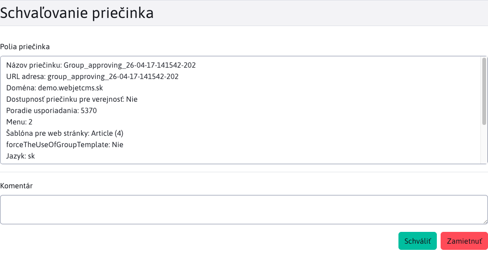
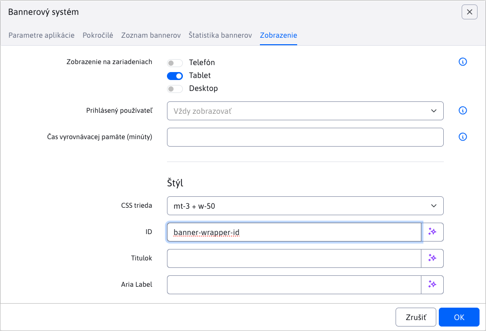
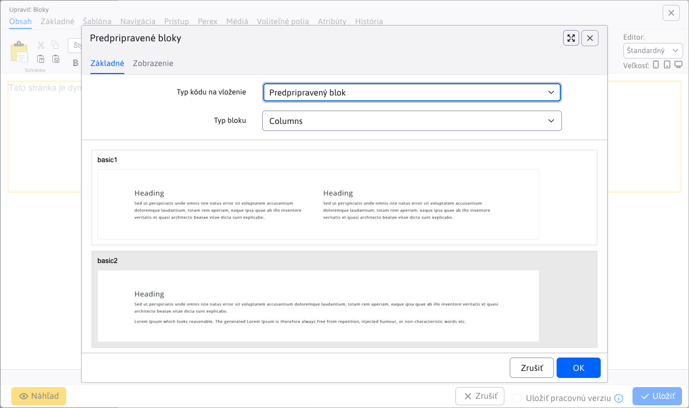

# WebJET CMS 2026

Vitajte v dokumentácii k WebJET CMS verzie 2026. Odporúčame prečítať si [zoznam zmien](CHANGELOG-2026.md) a [roadmap](ROADMAP.md).

## Zoznam zmien vo verzii 2026.18

> WebJET CMS 2026.18 prináša **schvaľovanie zmien priečinkov** s podporou viacúrovňového schvaľovania a **testovanie prístupnosti** integrované priamo do automatizovaných testov.
>
> V editore stránok môžete teraz **maximalizovať dialógové okná** pri nastavovaní aplikácií, vkladaní obrázkov či odkazov. Nastavenie aplikácie zároveň získalo nové možnosti pre atribúty prístupnosti (aria) a **vlastné CSS štýly** zobrazenia.
>
> V oblasti bezpečnosti pribudla **podpora prihlasovania cez OAuth2/Keycloak/Google/Facebook** a **Prístupové kľúče** (PassKey/WebAuthn), spolu s vylepšeniami pre stabilnejšiu prevádzku v klastrovom prostredí.

!>**Upozornenie:** Verzia určená pre `jakarta namespace`, vyžaduje aplikačný server Tomcat 11, používa Spring verzie 7. Pred aktualizáciou [skontrolujte požiadavky](install/versions.md#zmeny-pri-prechode-na-jakarta-verziu).

### Prelomové zmeny

- Vyžadovaný je aplikačný server Tomcat 11, verzia 10 už nie je podporovaná (#58385).
- Odstránené historické aplikácie `/components/adresar/editor_component.jsp` a `/components/sharing_icons/editor_component.jsp`, ktoré sa už nepoužívali. Ak ich chcete naďalej používať, stiahnite si z platformy [GitHub](https://github.com/webjetcms/webjetcms/tree/hotfix/2026.0-main/src/main/webapp/components) (#57409).

### Webové stránky

- Schvaľovanie - pridané [schvaľovanie zmien priečinkov](redactor/webpages/approve/README.md) vrátane schvaľovania vytvorenia, editácie a zmazania priečinka. Schvaľovateľ dostane email s prehľadom zmien a možnosťou schváliť alebo zamietnuť zmenu. Podporované je aj viacúrovňové schvaľovanie (#58405).

- Schvaľovanie priečinkov - v karte `Na schválenie` pridané pod-karty `Dokumenty` a `Priečinky` pre oddelené zobrazenie stránok a priečinkov čakajúcich na schválenie (#58405).
- Schvaľovanie priečinkov - pridané zobrazenie stĺpca s dátumom schválenia/zamietnutia a menom schvaľovateľa v histórii zmien priečinkov (#58405).
- Aplikácie - pridaná možnosť nastaviť [štýly zobrazenia aplikácie](redactor/webpages/working-in-editor/README.md#karta-zobrazenie). Môžete tak nastaviť napríklad odsadenie aplikácie v stránke, šírku alebo rôzne štýly zobrazenia, ale aj informácie pre čítačku pre slabozrakých návštevníkov (#osk418).

- Editor stránok - do dialógového okna [Odkaz a Tlačidlo](redactor/webpages/working-in-editor/README.md#tlačidlá) pridaná karta s rozšírenými nastaveniami ako ID, titulok, popis pre čítačky (aria-label) a podobne (#osk115).
- Ninja - pridané pole `canonical` ako [voliteľné pole Q](frontend/ninja-starter-kit/ninja-jv/page/README.md#informácie-o-stránke) pre nastavenie kanonickej URL adresy stránky. V prípade, že je pole prázdne, použije sa URL adresa stránky. Hodnotu v šablóne získate ako `${ninja.page.canonical}`. Pridá do URL parameter `page`, ak existuje, pre zobrazenie správnej strany v zozname noviniek (#OSK149, #54273-88).
- Page Builder - opravené presúvanie okna pre vloženie blokov, opravené prekrývanie výberu režimu editora, zapracované UX pripomienky (#58353).
- Zjednotené používanie nástroja `ImageMagick` pre zmenu veľkostí obrázkov medzi galériou a `/thumb servlet` (#osk396).
- Pridaná podpora vkladania obrázkov vo formáte `webp` vrátane zápisu pri zmene veľkosti pomocou natívnej knižnice `libwebp` cez `ImageIO` (#osk396).
- Pridané konfiguračné premenné `imageMagickCustomParams*` pre [nastavenie vlastných parametrov](redactor/apps/gallery/README.md#vlastné-parametre-imagemagick) `ImageMagick` operácií podľa typu operácie a formátu obrázka (#osk396).
- Aplikácie - doplnená možnosť **maximalizovať a minimalizovať** okno pre **vkladanie aplikácií, obrázku, odkazov** atď. do stránky (#57409).
- Pridaná podpora pre automatické obnovenie všetkých previazaných (zrkadlených) stránok a priečinkov z koša, keď jedna z nich bola obnovená (#osk423).
- Priečinok - pridaná možnosť nastaviť HTML kód novej stránky z lokálneho Systém/Šablóny priečinka, pôvodne sa zoznam stránok čítal podľa konfiguračnej premennej `tempGroupId` (#57409).
- Upravené názvoslovie [voliteľných polí](frontend/ninja-starter-kit/ninja-jv/page/README.md) pre SEO hodnoty (#228).
- Pridaná ikona na presun [kurzoru na ťažko dostupné miesto](redactor/webpages/working-in-editor/README.md#vkladanie-textu-na-ťažko-dostupné-miesta), ako napríklad za poslednú SVG ikonu v riadku a podobne (#osk105).

### Aplikácie

Prerobené nastavenie vlastností aplikácií v editore zo starého kódu v `JSP` na `Spring` aplikácie. Aplikácie automaticky získavajú aj možnosť nastaviť [zobrazenie na zariadeniach](custom-apps/appstore/README.md#podmienené-zobrazenie-aplikácie). Dizajn je v zhode so zvyškom WebJET CMS a dátových tabuliek (#57409).

- [Predpripravené bloky (HTMLBox)](redactor/apps/htmlbox/README.md)

- [Anketa ľahko](redactor/apps/inquiry/inquiry-simple.md)

- [Mapa](redactor/apps/map/README.md)

- [Odporúčania](redactor/apps/app-testimonials/README.md)

- [Predpripravené bloky](redactor/apps/htmlbox/README.md)

- Video - pridaná možnosť nastaviť [CSS triedy pre pomer strán videa](redactor/apps/video/README.md#konfigurácia), možnosti zobrazené v aplikácii sa nastavujú cez konfiguračné premenné `videoClasses`, `videoWrapperClass` a `videoItemClass` (#osk496).

### Formuláre

- Pridaná karta [Štatistika](redactor/apps/multistep-form/stat.md) pre zobrazenie odpovedí formulárov vo forme grafov (#58333).

- Pre viackrokové formuláre pridaný stĺpec **Trvanie vyplnenia**, ktorý zobrazuje ako dlho trvalo vyplnenie formuláru používateľom (čas od jeho zobrazenia po odoslanie) (#58333).

### Galéria

- Pridaná možnosť presúvať priečinky galérie priamo v editore zmenou nadradeného priečinka. Podrobnosti nájdete v časti [správa štruktúry](redactor/apps/gallery/structure.md) (#58433).
- Vylepšené spracovanie presunu priečinkov galérie s cieľom zabrániť vzniku neplatných odkazov. Viac informácií v časti [premiestnenie priečinku Galérie](redactor/apps/gallery/structure.md#premiestnenie-priečinku-galérie) (#58433).
- Pridaná podpora pre filtrovanie priečinkov galérií podľa aktuálneho ale aj pôvodného/súborového názvu priečinka galérie v stromovej štruktúre (#58445).
- Pridaná podpora pre [zobrazenie pôvodného/súborového názvu priečinka](redactor/apps/gallery/structure.md#nastavenie-zobrazenia-stromovej-štruktúry) galérie v stromovej štruktúre. Meno priečinka na disku môže byť iné ako pekné meno zadané vo vlastnostiach galérie (#58445).

### Manažér dokumentov

- Pridané zobrazenie hodnoty **Globálne Id** pre dokumenty (#58357).
- Pridaná možnosť zvoliť dokumenty k zobrazeniu v aplikácii pomocou ich `globalId` hodnoty vo vnorenej tabuľke, viac v časti [Karta - Vybrané dokumenty](redactor/files/file-archive/file-archive-app.md#karta---vybrané-dokumenty) (#58357).

### Prístupnosť

- Pridané [automatizované testovanie prístupnosti](developer/testing/a11y.md) (a11y / WCAG) pomocou `axe-core` integrovaných do CodeceptJS. Testy pokrývajú úrovne WCAG 2.0/2.1/2.2 AA (#58389).
- Zlepšená prístupnosť / opravené WCAG chyby na stránkach:
  - Prihlásenie do administrácie (#58389-2).
  - Úvod / menu položky / hlavička (#58389-3).
  - Zlepšené kontrasty farieb v chybových správach a hláseniach (#58389-4).
  - Dátové tabuľky, editor (#58389-4).
- Rozšírené a11y testy o nové scenáre pre správcu súborov, monitorovanie, štatistiky, nahrávanie súborov, správu používateľov a webové stránky. Metóda `a11y.check()` podporuje parameter `context` pre obmedzenie kontroly na konkrétnu časť stránky vrátane vnorených `iframe` elementov (#58389-5).

### Iné menšie zmeny

- Galéria - pridaná podpora priesvitnosti v `png/webp/gif` obrázkoch pri zmene ich veľkosti, ak sa nepoužíva [ImageMagick](redactor/apps/gallery/README.md#možné-konfiguračné-premenné) (#osk396).
- GitHub pipeline - po `merge pull request` sa automaticky vygeneruje príspevok na sociálne siete pomocou LLM (GitHub Copilot / Google Gemini) a pridá sa ako komentár k danému `pull request` spolu s prípadnými fotkami obrazovky z dokumentácie (#177).
- Skripty - pridaná možnosť nastaviť, či sa má skript vkladať v editore stránok v režime PageBuilder (#58349).
- Skripty - pridaný atribút [Poradie vkladania](redactor/apps/insert-script/README.md) pre nastavenie poradia vkladania skriptov v rámci rovnakej pozície. Predvolená hodnota pre existujúce skripty je 10, pri novom skripte sa automaticky nastaví na najvyššiu hodnotu + 10 (#osk387).
- Editor stránok - opravené určenie priečinka pre nahrávanie obrázkov/súborov pri novej/ešte neuloženej web stránke s duplicitným názvom: priečinok teraz zodpovedá skutočnej URL adrese stránky vrátane prípony `-2`, `-3` atď (#58361).
- Zrkadlenie štruktúry - pridaná možnosť generovať [odkazy na jazykové mutácie](redactor/apps/docmirroring/README.md#nastavenie-atribútu-hreflang) v hlavičke stránky pomocou aplikácie `hreflang.jsp`, odkazy obsahujú atribút `hreflang` pre lepšiu SEO optimalizáciu jazykových verzií (#58357).
- Stromová štruktúra - pridané automatické posunutie na aktuálne zvolený prvok v stromové štruktúre (#58433).
- Aplikácie - pridaná možnosť skryť polia/karty v editore aplikácie pomocou konfiguračnej premennej `appHideFields`. Viac sa dočítate v časti [Skrývanie polí/kariet](custom-apps/appstore/README.md#skrývanie-políkariet) (#58433).
- `imageradio` - pridaná možnosť nastaviť pole typu `imageradio` ako `disabled` (#58333).
- Dizajn všetkých grafov v celom projekte bol prerobený z tmavého na svetlý režim pre lepšie zladenie dizajnu (#58333).

- Aplikácia `Tooltip` premenovaná na Nápovedy (#205).
- Štatistika návštevnosti - upravené filtrovanie podľa priečinka. Používateľ môže zvoliť ľubovoľný priečinok aj z iných domén, ak nemá obmedzené práva na priečinky alebo ak má právo **Zobraziť štatistiku pre všetky priečinky** (#58453).
- Používatelia - upravená možnosť vidieť všetky priečinky v nastavení **Práva na adresáre a stránky**, ak má administrátor právo **Správa administrátorov**. Priečinky sú zobrazené aj v prípade, že administrátor má sám obmedzené práva na priečinky (#58453).

### Oprava chýb

- `imageradio` - opravené zobrazenie poľa typu `imageradio` v editore datatabuľky (#58333).
- Webové stránky - opravené obnovenie stránky, ktorá bola vytvorená cez zrkadlenie a nemala historický záznam, ktorý sa dal použiť na obnovenie (#208).
- Webové stránky - pri obnovení stránky z koša sa použije historická verzia aby sa zachoval jej pôvodný stav pred vymazaním (#208).
- Tlačidlo - opravená možnosť nastaviť vlastnosti tlačidla ktoré je zakázané (atribút `disabled=disabled`) (#209).
- Fotogaléria - opravené vyhľadávanie v priečinkoch (#58433).
- Súbory - doplnené zachovanie `.min.js` a `.min.css` v názve súboru pri nahratí do `/files,/images` priečinkov (#213).

### Výkon

- Upravený `PkeyGenerator` pre režim cluster `auto`. Metóda `allocate` obalená do transakcie (`setAutoCommit(false)`) s opakovaním pri `deadlock`. Zlepšené získanie bloku aj v režime cluster `auto`, čím sa znižuje počet prístupov do databázy a riziko `deadlock`. Navýšenie a čítanie hodnoty `pkey_generator` prebieha v jednom atomickom SQL dotaze, čo zabraňuje prideleniu rovnakého bloku viacerým uzlom clustra. Používajú sa databázovo špecifické SQL príkazy (#213):

| Databáza | SQL príkaz | Minimálna verzia |
| --- | --- | --- |
| MySQL | `LAST_INSERT_ID(expr)` | 3.23+ |
| MariaDB | `LAST_INSERT_ID(expr)` | 5.1+ (všetky GA) |
| Microsoft SQL Server | `UPDATE ... OUTPUT inserted` | 2005+ |
| PostgreSQL | `UPDATE ... RETURNING` | 8.2+ |
| Oracle | `RETURNING value INTO` | 10g+ |

- `SeoManager` a `ClusterRefresher` tolerujú databázový `deadlock` pri `UPDATE/DELETE` operáciách bez chybového logu (#213).
- Režim cluster `auto` - pridaná konfiguračná premenná `clusterAutoRandomDelay` pre [náhodné oneskorenie štartu](install/config/README.md#režim-auto) niektorých úloh, aby sa znížilo riziko súbežných databázových konfliktov medzi uzlami clustra (#213).

### Bezpečnosť

- Pridaný súbor `.github/SECURITY.md` so [zodpovedným oznamovaním zraniteľností](sysadmin/responsible-disclosure/README.md) (#187).
- Aktualizované knižnice `AspectJ, Eclipselink, slf4j, GoPay` (#57793).
- Verzia `SpringSecurity` zvýšená na verziu 7 (#56665).
- Pridaná možnosť prihlasovania sa cez [OAuth2/Keycloak/Google/Facebook...](install/oauth2/oauth2.md) (#56665).

    <iframe width="560" height="315" src="https://www.youtube.com/embed/q8xs3qDq-G4" title="YouTube video player" frameborder="0" allow="accelerometer; autoplay; clipboard-write; encrypted-media; gyroscope; picture-in-picture" allowfullscreen></iframe>

- Odstránené nepoužívané knižnice `lodash,pdfmake`, aktualizovaný zoznam `dependency-check-suppressions`, opravená prvotná inštalácia (#204).
- Opravené spracovanie neplatného hesla pri API/BASIC autentifikácii po prechode na `Spring Security 7`, aby sa chyba `password encoder` nepremenila na internú výnimku a požiadavka sa korektne zamietla (#58369).
- Pridaná podpora prihlasovania do administrácie cez [Prístupové kľúče](redactor/admin/logon.md#použiť-prístupový-kľúč) `PassKey/WebAuthn` (#58369).

- Používatelia - ak vytváraní nového používateľa alebo jeho editácii do poľa heslo zadáte znak `*` vygeneruje sa nové bezpečné heslo a zobrazí sa vám v notifikácii (#58369).
- [Skupiny práv](admin/users/perm-groups.md) - pridaná možnosť nastaviť príznak **Prístup ku všetkým adresárom web stránok** a **Prístup ku všetkým priečinkom súborového systému**, ktoré pri prihlásení prepíšu sčítané práva z ostatných skupín a poskytnú používateľovi neobmedzený prístup k web stránkam, alebo súborom (#osk422).
- Aktualizovaná knižnica `Datatables.net/Editor` z verzie `2.2.2/2.3.2` na `2.3.7/2.5.2` (#206).

### Dokumentácia

- Upravený automatický prekladač pre použitie Google Translator API v3 (#58301).
- Anglická verzia dokumentácie nanovo preložená (#58301).

### Pre programátora

- AI - nový `AI skill` pre opravu A11Y/WCAG chýb, stačí použiť nástroj `/wj-accessibility`.
- Aktualizované závislosti na minimálne požiadavky pre Tomcat 11 (Tomcat 10 už nie je podporovaný). `Stripes` validácie - upravené vykonávanie EL výrazov z odstráneného `jakarta.servlet.jsp.el` na `jakarta.el` kvôli kompatibilite s `jakarta.servlet.jsp-api:4.0.0` (#58385).
- Aktualizovaný spôsob zobrazenia API dokumentácie na štandard [OpenAPI 3.0](https://www.openapis.org/). Dokumentácia je dostupná na adrese `/admin/swagger-ui/index.html` pre používateľov, ktorí majú právo na editáciu administrátorov (#57793).
- Administrácia - zmenený `build` súborov administrácie z `webpack` na `rspack`, ktorý je výrazne rýchlejší (#206).
- Administrácia - zjednotené generovanie `PUG` šablón pre `watch` a `prod`, odstránené nepoužívané `npm` build závislosti a historické `webpack` skripty (#206).
- Administrácia - doplnené automatické obnovenie otvorenej stránky pri `npm run watch` po zmene `JS/CSS/PUG` súborov (#206).
- Administrácia - pridaný skript `npm run analyze` s HTML reportom veľkosti použitých knižníc (#206).
- Datatabuľky - pridaný nový typ udalosti `DatatableColumnsEvent`, na ktorý je možné počúvať a dynamicky upraviť definíciu stĺpcov pred inicializáciou tabuľky. Viac sa dozviete v časti [Udalosť DatatableColumnsEvent](developer/backend/events-datatable.md#udalosť-DatatableColumnsEvent) (#58433).
- Doplnená knižnica `Jackson v3`, niektoré JSON objekty nemusí serializovať správne pokiaľ nemajú správne `Java Bean` meno (napr. `setcookieId` bez veľkého `C`, alebo `set__rowNum__`). Najlepšie riešenie je správne nastaviť meno premennej, prípadne použiť anotáciu typu `@JsonProperty("__rowNum__")` aj na `getter/setter` (#58369).
- Galéria - upravené volanie knižnice ImageMagick, zmenené API pre jeho volanie na `ImageTools.executeImageMagick(...)` (#osk396).
- Grafy - nástroj/knižnica [chart-tool.js](../../src/main/webapp/admin/v9/src/js/libs/chart/chart-tools.js) na prácu s `amcharts` grafmi bol aktualizovaný, priali sa nové funkcionality, nové grafy a vylepšila sa logika (#58333).
- Grafy - pridaná nová trieda/knižnica [stats-by-charts.js](../../src/main/webapp/apps/_common/charts/stats-by-charts.js) na rýchle vytváranie celých sekcií štatistík s využitím [chart-tool.js](../../src/main/webapp/admin/v9/src/js/libs/chart/chart-tools.js) na vytváranie grafov (#58333).
- Hlavičkové záložky - pridaná podpora pod-kariet cez funkciu `WJ.headerSubTabs()` pre vnorené karty v zozname Neschválené vo webových stránkach (#58405).
- Odstránená anotácia `@Temporal` na dátumových stĺpcoch v databázových entitách, odporúčané riešenie je pre nové entity používať `java.time.*` typy. Zdá sa, že Eclipselink/JPA správne deteguje typ `Date` ako dátum a čas a anotácia nie je potrebná. Odporúčame po aktualizácii skontrolovať správanie dátumových polí (#57793).
- Trieda `PageListHolder/MutableSortDefinition` je v Spring 7 `Deprecated`, ako priamu náhradu môžete použiť našu implementáciu `PagedListHolder/SortDefinition` z package `sk.iway.iwcm.system.datatable` (#57793).
- Webové stránky - obnovenie z koša - doplnené [publikovanie udalostí](developer/backend/events.md) `ON_RECOVER` a `AFTER_RECOVER` pre obnovu stránok a priečinkov z koša (#161).
- Webové stránky - doplnená možnosť upraviť karty okne [Štýl pri použití PageBuilder](frontend/page-builder/blocks.md#podporný-javascript-kód) volaním funkcie `window.pbBuildTabMenu`. Viete tak pre zákazníka zobraziť len relevantné karty a nastavenia bloku (#58345).
- Webové stránky - doplnená možnosť volať [vlastnú funkciu pre čistenie HTML kódu](frontend/page-builder/blocks.md#podporný-javascript-kód) po vložení z `Microsoft Office` alebo pri získaní HTML kódu (#OSK49).
- `WebjetEvent` – pridaná možnosť nastaviť používateľa typu `Identity` priamo do udalosti. Vhodné pri spracovaní udalostí, kde je potrebný používateľ, ale nie je dostupný `context` alebo `request` (#OSK423).
- `WJ.openIframeModal` - pridaná možnosť presúvať dialógové okno uchopením za hlavičku (drag & drop), maximalizovať/minimalizovať okno a definovať vlastné tlačidlá v pätičke cez parameter `buttons` (#58405).

