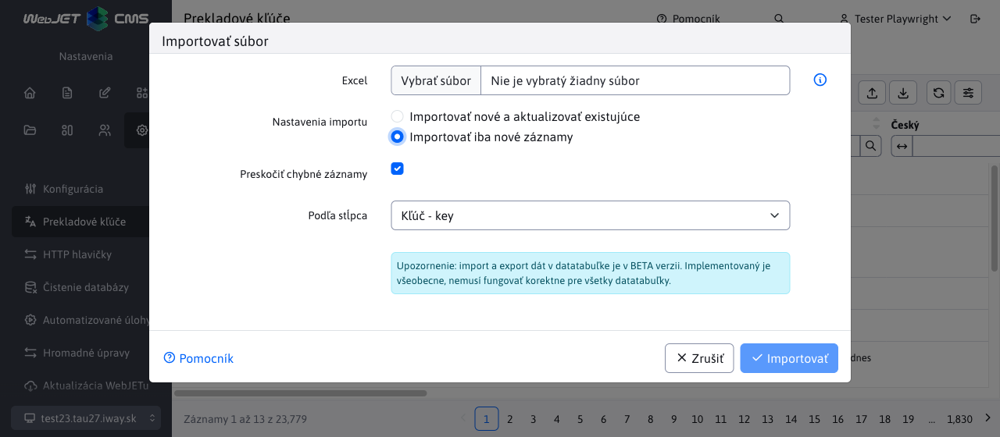
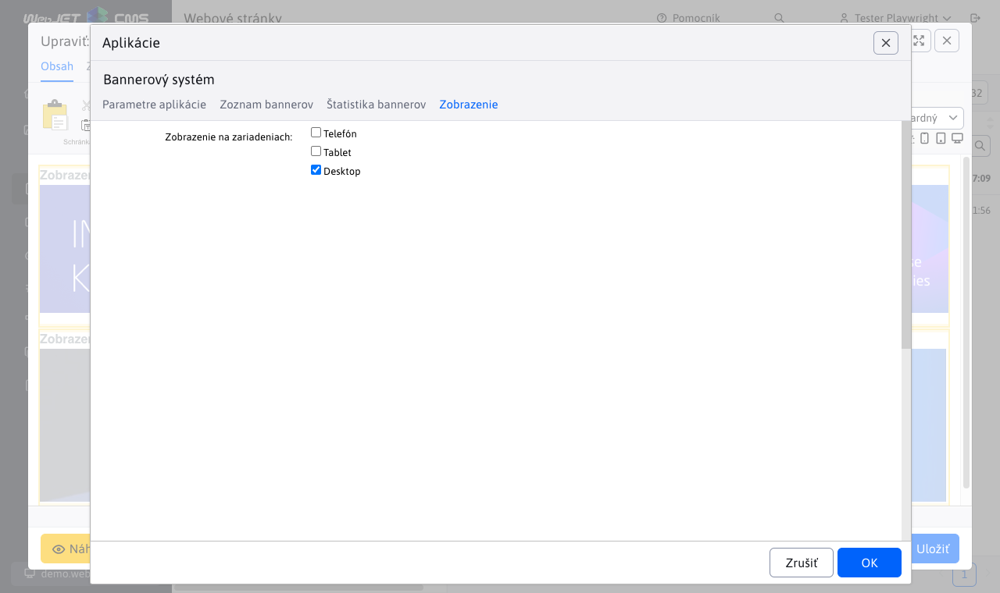
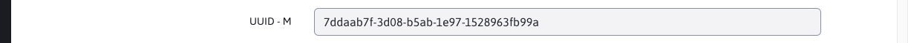

# WebJET CMS 2024

Vitajte v dokumentácii k WebJET CMS verzie 2024. Odporúčame prečítať si [zoznam zmien](CHANGELOG-2024.md) a [roadmap](ROADMAP.md).

# Zoznam zmien v poslednej verzii

## 2024.0

> Verzia 2024.0 obsahuje novú verziu **aktualizácie s opisom zmien**, **klonovanie štruktúry** integrované s funkciou zrkadlenia (vrátane možnosti prekladov), pridáva možnosť **obnoviť** web stránku, alebo **celý priečinok z koša**, pridáva **editor typu HTML** a možnosť nastavenia typu editora priamo pre šablónu, **aplikáciam** je možné **zapnúť zobrazenie len pre zvolené typy zariadení** mobil, tablet, PC a samozrejme zlepšuje bezpečnosť a komfort práce.

    <iframe width="560" height="315" src="https://www.youtube.com/embed/YGvWne70czo" title="YouTube video player" frameborder="0" allow="accelerometer; autoplay; clipboard-write; encrypted-media; gyroscope; picture-in-picture" allowfullscreen></iframe>

### Prelomové zmeny

Táto verzia prináša viaceré zmeny, ktoré nemusia byť spätne kompatibilné:

- Diskusia/Fórum - pridanie nového príspevku a schvaľovanie upravené z frameworku Struts na Spring, použite volanie `/admin/update/update-2023-18.jsp` pre [základnú úpravu](install/README.md#zmeny-pri-aktualizácii-na-202318). Zrušená editácia profilu používateľa, odporúčame použiť štandardnú komponentu pre editáciu [registrovaného používateľa](redactor/zaheslovana-zona/README.md) (#55649).
- Import z Excelu - ak máte v projekte špeciálnu verziu importu z Excelu, ktorá volá URL adresu `/admin/importxls.do` upravte formulár a URL adresu podľa `/admin/spec/import_xls.jsp`. Základ by vám mal vyriešiť aktualizačný skript `/admin/update/update-2023-18.jsp` (#55905).
- Reštauračné menu - prerobené zo Struts na Spring, použite aktualizačný skript a overte zobrazenie menu na web stránke (#55945).

### Vylepšenia používateľského rozhrania

- Web stránky - Bloky - zväčšená veľkosť okna pre vkladanie blokov, pridaná možnosť priamo editovať web stránku pri jej vložení Dynamickým odkazom (#56017).
- Web stránky - Editor - zvýšená výška výberového menu štýlov textu/nadpisu pre lepší prehľad/výber možnosti (#56017).
- Aplikácie - ešte raz vylepšená veľkosť okna pre aplikácie - výška aj šírka vrátane okien pri použití PageBuilder. Optimalizovaná veľkosť vnorených datatabuliek. Úprava v `top.jsp,datatables-wjfunctions.js` (#56013).
- Aplikácie - aktualizované fotky aplikácií a ich opis v zozname aplikácií v editore stránok. Opravené rôzne drobné vizuálne chyby v nastaveniach aplikácií (#55293).
- Datatabuľky - pri dlho trvajúcej operácii môže dôjsť k prerušeniu spojenia so serverom, v takom prípade sa zobrazí hlásenie "Pri komunikácii so serverom sa vyskytla chyba. Je možné, že operácia trvá príliš dlho a bude vykonaná neskôr. Počkajte a po chvíli skontrolujte, či je operácia vykonaná." pre odlíšenie od štandardnej chyby uloženia záznamu.
- Datatabuľky - pridaná možnosť [importovať iba nové záznamy](redactor/datatables/export-import.md#import-dát), ak záznam podľa zvoleného stĺpca už existuje je ponechaný bez zmeny (#56061).

### Web stránky

- Import/Export - pridané nastavenie lokálnych ID priečinkov pri vytvorení šablóny. Rieši problém pri editácii stránky po importe, kde šablóna síce je vytvorená, ale nemá správne nastavený prístup k priečinkom. Neexistujúce priečinky sú odfiltrované. Po importe odporúčame skontrolovať nastavenie šablón (#55993).
- Pri vytvorení novej web stránky a vkladaní obrázka/súboru/média je už pred uložením vytvorený priečinok pre Média tejto stránky. Vytvorí sa podľa hodnoty zadanej v poli Názov položky v menu (#54953-29).
- Pri editácii jednej web stránky si okno pre vloženie obrázku/vytvorenie odkazu pamätá aj po zatvorení posledný priečinok a neprepne sa nazad do sekcie Média tejto stránky pri znova otvorení. Ak vkladáte viacero obrázkov z iného priečinka je to praktickejšie. Do sekcie Média tejto stránky sa stále môžete prepnúť kliknutím v stromovej štruktúre (#54953-29).
- Pridaná podpora pre  [Obnovenie web stránok a priečinkov z koša](redactor/webpages/recover.md) (#55937).
- Priečinok `/files` s plno textovým indexom súborov je presunutý do karty Systém (#54953-30).
- Šablóny - pridaná možnosť nastaviť Typ editora stránok (pôvodne Inline editor štruktúry) pre šablónu, predvolená hodnota je Podľa skupiny šablón, kedy sa Typ editora stránok nastaví podľa priradenej skupiny šablón (#56129).

- Editor - pridaný Typ editora stránok HTML, kedy sa editor stránky zobrazí priamo v HTML režime (HTML kód). Umožňuje upravovať špeciálne typy stránok, ktoré sa nesmú prepnúť do vizuálneho režimu z dôvodu napr. špeciálneho kódu (#56129).

- Editor - pridaná možnosť nastaviť veľkosť/šírku editora aj v režime Štandardný. Viete tak zobraziť stránku v režime šírky pre mobilný telefón, tablet a počítač (#56129).
- Editor - zjednotené prepínanie režimu Štandardný/Page Builder (#56129).
- Ninja - pridaná podpora dodatočných prehliadačov pre definovanie minimálnej podporovanej verzie v `config.properties` typu `minBrowserVersion.crazy\u0020browser=10` (#56129).
- Pre stránky s vypnutým zobrazením upravená aj farba názvu stránky na červenú (#55997).
- Editor - upravená funkcia Vložiť ako čistý text a Vložiť z Word-u na otvorenie dialógového okna, do ktorého sa vloží text zo schránky (#56189).

- Editor - zlepšené čistenie kódu vloženého z Excel-u - odstránené je nastavenie šírky buniek a triedy CSS štýlov (#56189).
- Editor - upravené vkladanie odkazov na email adresu - chybné zobrazenie http prefixu pri zadávaní email adresy (#56189).

### Page Builder

- Page Builder prerobený na používanie nových JavaScript súborov identických ako pri editácii web stránky (doteraz sa používali staré z verzie 8). Kód stránky je vložený priamo pri zobrazení, nemusí sa vykonať volanie REST služby. Doplnkové CSS a JavaScript súbory sú vložené pomocou `combine` jedným volaním. Pri zobrazení bežnej stránky sa znížil počet HTTP požiadaviek z 42 na 24 (#56017).
- Načítanie v editore by malo byť rýchlejšie, nová verzia neobsahuje staré časti kódu, niektoré objekty sa znova použijú.
- Do budúcna bude dostupná už len verzia Page Builder v sekcii Web stránky, samostatná inline editácia pri zobrazení web stránky bude zrušená (z dôvodu jednotnosti skriptov).
- Nastavenie viditeľnosti upravené na možnosti Mobil, Tablet, Desktop v zhode s možnosťou prepnutia šírky editora (#56017).
- Pridaná možnosť [generovať menu](frontend/page-builder/blocks.md#podpora-menu) pre `single page` typy stránok. Menu sa generuje automaticky podľa sekcií vo web stránke (#56017).

### Aplikácie Spring

- Pridaný názov aplikácie do okna nastavenia namiesto generického názvu Upraviť (#55997).
- Aplikácie typu Spring majú pridanú [kartu Zobrazenie](custom-apps/appstore/README.md#karta-zobrazenie) pre nastavenie zobrazenia aplikácie na rôznych zariadeniach a možnosť nastaviť ukladanie HTML výstupu do vyrovnávacej pamäte pre rýchlejšie zobrazenie web stránky. Ak nie je zvolené žiadne zariadenie aplikácia sa zobrazí vždy.

### Reštauračné menu

- Sekcia (aplikácia) Reštauračné menu prerobená do datatabuliek [Reštauračné menu](redactor/apps/restaurant-menu/README.md) (#55945).

### Aktualizácia WebJETu

Vylepšený proces [aktualizácie WebJET CMS](sysadmin/update/README.md), prenesené do nového dizajny, doplnená diakritika do zoznamu zmien, zobrazenie zoznamu zmien so zvýraznenými textami a obrázkami.

### Bannerový systém

- Pridaná podpora pre [Zobrazenie banneru pre špecificky typ zariadenia](redactor/apps/banner/README.md#zobrazenie-banneru-pre-špecificky-typ-zariadenia), čiže zobrazenie len napr. na mobilnom telefóne, alebo len na tablete. Viete tak zobrazovať rôzne bannery pre rôzne zariadenia (#55921).

### Formuláre

- Doplnené pole Firma do zoznamu polí prihláseného používateľa pri vyplnení formuláru (#55961).

### Galéria

- Optimalizovaná inicializácia editora obrázkov - po prvej inicializácii sa použije existujúca inštancia (#55853).
- Optimalizované načítanie dát - pri zobrazení galérie znížený počet volaní REST služby z 6 na 1 (#56093).

### HTTP hlavičky

- Doplnená možnosť nastavenia hlavičky `Content-Language`, [automatické nastavenie](admin/settings/response-header/README.md#nastavenie-pre-súbory) hlavičky pre súbory.
- Doplnená podpora [nastavenia hlavičiek](admin/settings/response-header/README.md) pre presnú zhodu URL adresy pomocou `^/path/subpath/$` a možnosť nastavenia pre určité prípony `/path/subpath/*.pdf,*.jpg` (#56109).

### Kalendár udalostí

- Pridaná možnosť vytvoriť typ udalosti s medzerou v názve (#56054).
- Pridané zmazanie Cache po pridaní novej udalosti (#56054).

### Klonovanie štruktúry

- [Klonovanie štruktúry](redactor/apps/clone-structure/README.md) je integrované so [zrkadlením](redactor/apps/docmirroring/README.md) pre možnosť vytvorenia prekladu a prepojenia stránok pri klonovaní jazykovej mutácie. Jazyk sa preberie z nastavenia zdrojového a cieľového priečinka (#55733).
- Po vytvorení klonu je automaticky nastavené zrkadlenie zmien, v prípade potreby ho môžete zrušiť úpravou konf. premennej `structureMirroringConfig`. Medzi klonom a originálnou štruktúrou sa budú prenášať zmeny.

### Novinky

- Do [šablóny noviniek](redactor/apps/news/README.md#šablóna) pridané objekty `$pagesAll` s celým zoznamom stránkovania (`$pages` obsahuje skrátený zoznam) a `$totalPages` s celkovým počtom stránok.

### Používatelia

- Vymazanie používateľa - ošetrená situácia keď aktuálne prihlásený používateľ sa snaží vymazať sám seba (#55917).
- [Zoznam používateľov](admin/users/README.md) - v tabuľke pridané stĺpce Práva na adresáre a stránky a Schvaľovanie. Vzhľadom na vnorené údaje v stĺpcoch nie je možné vyhľadávať a usporiadať podľa hodnoty (#55897).
- Zoznam používateľov - pridané zobrazenie Skupiny práv pre zobrazenie skupín práv administrátorov v tabuľke s možnosťou filtrovania podľa zvolenej skupiny (#55601).

### Prekladové kľúče

- Pridaná možnosť [importovať iba nové](admin/settings/translation-keys/README.md) (ešte neexistujúce) kľúče. Existencia kľúča sa kontroluje pre každý jazyk (#56061).

### Presmerovania

- Presmerovania ciest - vo viac doménovej inštalácii sa zobrazujú len záznamy podľa aktuálnej zvolenej domény a záznamy, ktoré nemajú nastavenú doménu (#55957).

### Proxy

- Pridané nastavenie HTTP hlavičky `Content-Type` podľa [odpovedi z proxy](redactor/apps/proxy/README.md) (pri použití proxy na REST služby/bez vloženia do web stránky) (#56054).

### Štatistika

- Filter výberu priečinkov v zobrazení štatistiky zobrazuje len priečinky, na ktoré má používateľ práva v zozname web stránok. Pri prvej návšteve sa štatistika zobrazí pre prvý povolený priečinok. Umožňuje to zobraziť štatistiku aj redaktorom s obmedzenými právami na stromovú štruktúru web stránok (#55941).
- Pridané právo Zobraziť štatistiku pre všetky priečinky, ktoré povolí zobrazenie celej stromovej štruktúry bez ohľadu na práva na web stránky (#55941).

### Voliteľné polia

- Pridaný typ poľa `UUID` pre generovanie [unikátneho identifikátora](frontend/webpages/customfields/README.md#unikátny-identifikátor).

### Značky

- Značky - zoznam dostupných značiek sa zobrazuje podľa práv na sekcie web stránok. Viete tak sprístupniť administráciu značiek len pre určitú stromovú sekciu web stránok (alebo doménu). Ak má teda používateľ povolený len prístup do sekcie web stránok /Newsletter zobrazia sa mu len značky, ktoré majú pridanú túto sekciu, alebo značky bez obmedzenia zobrazenia (#55961).

### Zrkadlenie štruktúry

- Pridaná možnosť neskôr doplniť ID ďalšieho priečinka na zrkadlenie, pomocou [Klonovanie štruktúry](redactor/apps/clone-structure/README.md) je možné doplniť obsah nového jazyka (#55733).
- Doplnená kontrola nastavenia synchronizácie - ak odstránite ID priečinka z konf. premennej `structureMirroringConfig` nebudú sa stránky a priečinky v odobratej štruktúre ďalej synchronizovať (#55733).
- Pridaná možnosť vytvárať v zrkadlených priečinkoch [stránky a priečinky so zapnutým zobrazením](redactor/apps/docmirroring/README.md#priebeh-zrkadlenia) (napr. počas fázy vývoja stránky), stačí nastaviť konf. premennú `structureMirroringDisabledOnCreate` na hodnotu `false` (#55733).
- Prekladač - [pre DeepL](admin/setup/translation.md) je možné v konf. premennej `deepl_api_url` nastaviť URL adresu API služby. Predvolená je hodnota pre voľnú verziu, pri použití `Pro` verzie nastavte na `https://api.deepl.com/v2/translate`. Upravený spôsob autorizácie voči API na novú verziu pomocou HTTP hlavičky `Authorize` (#55733).

### Bezpečnosť

- Aktualizovaná knižnica `logback` na verziu 1.3.14.
- Opravená zraniteľnosť `CVE-2022-26960` v knižnici `elfinder`.
- Používatelia - Profil - doplnená informácia o kvalite hesla pri jeho zmene (#56077).

### Systémové zmeny

- Optimalizovaná veľkosť JavaScript súborov - knižnica `moment` je načítaná len s potrebnými jazykmi namiesto všetkými dostupnými (použitý `MomentLocalesPlugin`). Veľkosť znížená o 300kB (#56093).
- Aktualizácia - od 2023.40-SNAPSHOT sú na aktualizačnom serveri pripravené aj balíky pre aktualizáciu WebJETu bežiaceho v JAR režime, aktualizačný server poskytne aktualizačný súbor podľa typu režimu.

**Prechod z knižnice Struts na Spring**

- Aktualizácia WebJETu - prerobené aktualizovanie WebJETu [Aktualizácia WebJETu](sysadmin/update/README.md) (#55797)
- Diskusia/Fórum - prerobené pridanie nového príspevku zo Struts na Spring, prerobené schvaľovanie (#55649).
- Hodnotenie stránok - prerobené [Hodnotenie/Rating](redactor/apps/rating/README.md). Trieda `RatingDB` nahradená za `RatingService` a `RatingBean` za `RatingEntity` (#55729).
- Import XLS - URL adresa pre import XLS súborov zmenená z `/admin/importxls.do` na `/admin/import/excel/`, použite príklad v `/admin/spec/import_xls.jsp` pre aktualizáciu vašich súborov (#55905).
- Reštauračné menu - prerobené na Spring, triedy `MenuDB,MealDB,MenuBean,MealBean` nahradené za `RestaurantMenuService,RestaurantMenuEntity,RestaurantMenuMealsEntity` (#55945).
- Web stránky - prerobená možnosť Klonovania štruktúr zo struts na Spring [Klonovanie štruktúry](redactor/apps/clone-structure/README.md) (#55733).
- Web stránky - prerobené importovanie stránok zo ZIP archívu [Importovanie web stránok zo ZIP archívu](redactor/webpages/import-export.md#importovanie-web-stránok-zo-zip-archívu) (#55905).
- Web stránky - prerobené importovanie stránok z Excel súboru [Importovanie web stránok z Excel súboru](redactor/webpages/import-export.md#import-štruktúry-z-excel-súboru) (#55905).

### Oprava chýb

- Číselníky - opravené stránkovanie v číselníkoch (#56013).
- Datatabuľky - opravená pozícia okna z vnorenej datatabuľky aby sa zmestilo celé do prehliadača.
- Formuláre - opravená chyba zobrazenie dátumu v Naposledy odoslaný v zozname formulárov na Oracle databáze.
- Formuláre - opravený export dát z formuláru a duplicitné generovanie export súboru (#56141).
- Galéria, Zobrazenie súborov, Archív súborov - opravený výber priečinka vo vlastnostiach aplikácie v stránke (#54953-27).
- Galéria - opravená dvojitá lomka v URL adrese galérie v niektorých scenároch (#56017).
- Hromadný email - doplnená kontrola duplicity emailových adries bez ohľadu na veľkosť písmen (#55961).
- Konfigurácia - opravené duplicitné zobrazenie konf. premennej pri pridaní už existujúcej premennej (#55733).
- Konfigurácia - opravený import špeciálnych znakov ako je `'&#<` a vyhľadávanie v takejto hodnote (#55993).
- Json editor - opravené nastavenie a zmena obrázku v aplikáciách používajúcich Json editor (napr. Odporúčania, Pôsobivá prezentácia atď) (#55293).
- Používatelia - opravené zobrazenie práv používateľa v editácii - zobrazovali sa zaškrtnuté aj práva podľa skupiny, nielen tie nastavené (#55797).
- Používatelia - Profil - opravená chyba zmeny hesla (#56077).
- Reštartovať - opravená funkcia Reštartovať v menu Nastavenia (#54953-30).
- Skripty - opravené vkladanie skriptov do stránky - pre meno pozície sa chybne používalo vyhľadávanie ako pod-reťazec a skript sa vkladal aj keď sa meno pozície nezhodovalo presne (#54953-30).
- `Slider` - opravená kompatibilita knižnice jQuery (#55293).
- Šablóny - opravené zobrazenie šablón, ktoré majú nastavené zobrazenie len pre určitý priečinok a zároveň tento priečinok má prázdne doménové meno (#55993).
- Web stránky - pridaná podpora pri schvaľovaní web stránky v móde žiadna akcia (#55897).
- Web stránky - odstránenie záznamov schvaľovania, ktoré ostali po vymazaní priečinka z koša (#55897).
- Web stránky - doplnené automatické nastavenie malých písmen pri zadaní domény (doména sa zadáva štandardne len s malými písmenami) (#55993).
- Web stránky - opravené prepnutie na kartu Základné po pridaní nového média v novej web stránke (#54953-29).
- Web stránky - opravené zobrazenie náhľadu ak je Spring nastavený predvolene na JSON odpovede (#56054).
- Web stránky - opravené premenovanie domény - Systém priečinku sa doména nezmenila (#54953-30).
- Web stránky - bloky - vylepšené nastavenie veľkosti okna pri vkladaní Bloku (#55293).
- Zobrazenie súborov - opravené zobrazenie súborov (detekcia domény) (#54953-27).
- Oprava chyby posielania parametrov pri externých filtroch, hodnote dátum do sa nastaví čas na 23:59:59 (#56021).

### Pre programátora

- Aplikácie - pridaná možnosť zobraziť aplikáciu v stránke [podľa typu zariadenia](custom-apps/appstore/README.md#podmienené-zobrazenie-aplikácie) (mobil, tablet, pc) pridaním parametra `!INCLUDE(/components..., device=mobil)!`. Pre [Bannerový systém](redactor/apps/banner/README.md) je pridané nastavenie aj do rozhrania nastavenia aplikácie.
- Datatabuľky - pridaná podpora `LocalDate/LocalDateTime` pre dátové polia, pridaný atribút `alwaysCopyProperties` do `DatatableColumn` pre možnosť kopírovania pri editácii z [existujúceho záznamu](developer/datatables-editor/datatable-columns.md).
- Používatelia - doplnená dokumentácia k použitiu `afterSaveInterceptor` pri [registrácii používateľa](custom-apps/apps/user/README.md) a možnosť neposlať štandardný uvítací email prepísaním metódy `shouldSendUserWelcomeEmail` (#54953-28).

[Kompletný zoznam zmien >>](CHANGELOG-2023.md)
