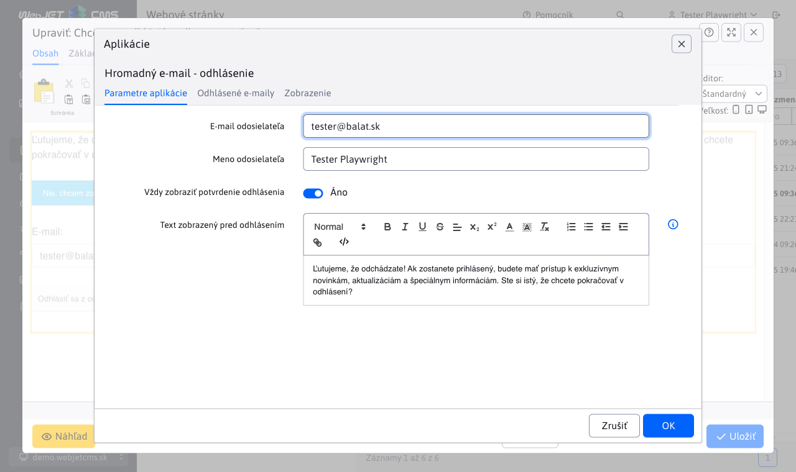
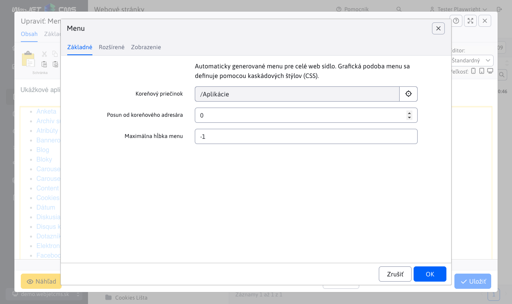
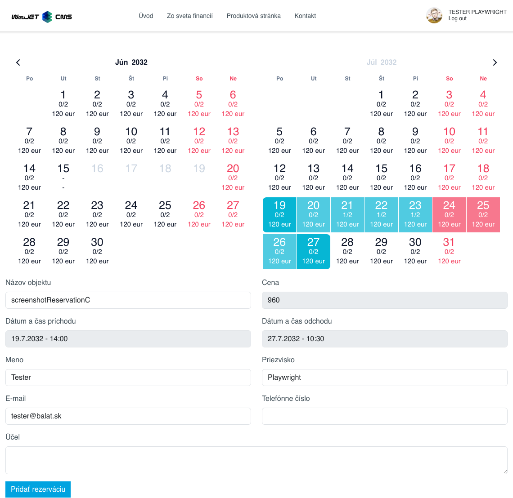
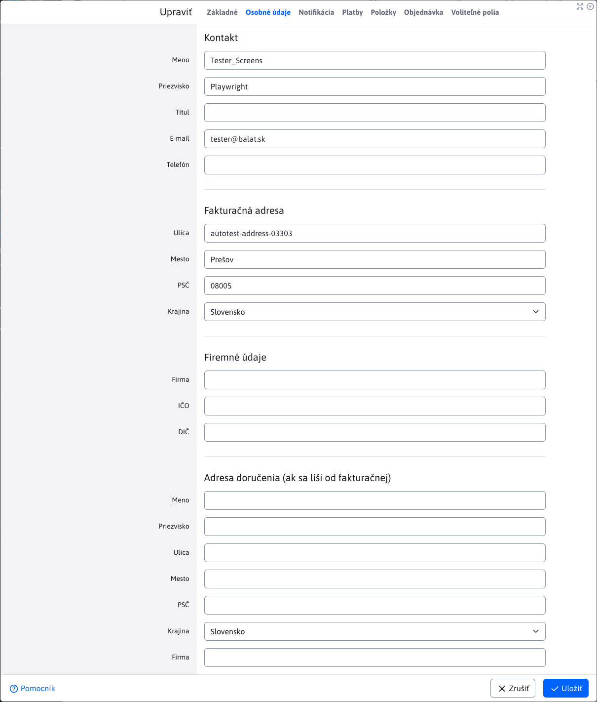

# WebJET CMS 2025

Vitajte v dokumentácii k WebJET CMS verzie 2025. Odporúčame prečítať si [zoznam zmien](CHANGELOG-2025.md) a [roadmap](ROADMAP.md).

## Zoznam zmien vo verzii 2025.18

> Verzia **2025.18** prináša kompletne prerobený modul **Elektronického obchodu** s podporou **platobnej brány GoPay** a vylepšeným zoznamom objednávok. Aplikácia **Kalendár noviniek** bola oddelená ako **samostatná aplikácia** a zároveň sme prerobili nastavenia viacerých aplikácii v editore stránok do nového dizajnu. **Manažér dokumentov** (pôvodne Archív súborov) prešiel **vizuálnym aj funkčným reštartom** vrátane nových nástrojov na správu, export a import dokumentov.
>
> Vylepšený bol aj systém **Hromadného e-mailu** s novými možnosťami pre odosielateľa a pohodlnejším výberom príjemcov. **Rezervácie** získali nové možnosti ako **nadmerné rezervácie**, vytváranie rezervácií spätne do minulosti a zasielanie notifikácií na špecifické emaily pre každý rezervačný objekt.
>
> Optimalizovali sme počet súborov v **Prieskumníku**, čo vedie k **rýchlejšiemu načítaniu** a pridali nové informácie do **Monitorovania servera**.

### Prelomové zmeny

- Aplikácia Kalendár noviniek oddelená do samostatnej aplikácie, ak kalendár noviniek používate je potrebné upraviť cestu `/components/calendar/news_calendar.jsp` na `/components/news-calendar/news_calendar.jsp` (#57409).
- Upravená inicializácia Spring a JPA, viac informácií v sekcii pre programátora (#43144).
- Prerobená backend časť aplikácie elektronický obchod, viac v sekcii pre programátora (#57685).

### Dátové tabuľky

- Pri nastavení filtra číselnej hodnoty od-do sa pole zväčší pre lepšie zobrazenie zadanej hodnoty podobne ako to robí dátumové pole (#57685).
- Aplikácia Archív súborov bola prerobená na Spring aplikáciu. Bližšie informácie nájdete v sekcii pre programátora (#57317).
- Aplikácia Elektronický obchod bola na `BE` časti prerobená. Bližšie informácie nájdete v sekcii pre programátora (#56609).

### Manažér dokumentov (Archív súborov)

- **Zoznam súborov** prerobený do nového dizajnu s pridaním novej logiky oproti starej verzií. Viac sa dočítate v časti [Archív súborov](redactor/files/file-archive/README.md) (#57317).

- **Manažér kategórií** opravený a prerobený do nového dizajnu. Viac sa dočítate v časti [Manažér kategórií](redactor/files/file-archive/category-manager.md) (#57317).
- **Manažér produktov** bol pridaný ako nová sekcia. Viac sa dočítate v časti [Manažér produktov](redactor/files/file-archive/product-manager.md) (#57317).
- **Export hlavných súborov** bol upravený tak, aby ponúkal širšie možnosti exportu súborov a zlepšil prehľadnosť výpisov. Viac sa dočítate v časti [Export hlavných súborov](redactor/files/file-archive/export-files.md) (#57317).

- **Import hlavných súborov** bol opravený a upravený, aby dokázal pracovať s rozšírenými možnosťami exportu. Viac sa dočítate v časti [Import hlavných súborov](redactor/files/file-archive/import-files.md) (#57317).
- **Indexovanie** dokumentov vo vyhľadávačoch typu `Google` upravené tak, aby sa neindexovali staré/historické verzie dokumentov a dokumenty mimo dátum platnosti (nastavená HTTP hlavička `X-Robots-Tag=noindex, nofollow`). Indexovanie týchto dokumentov sa dá povoliť v editore v manažérovi dokumentov (#57805).

### Aplikácie

Prerobené nastavenie vlastností aplikácií v editore zo starého kódu v `JSP` na `Spring` aplikácie. Aplikácie automaticky získavajú aj možnosť nastaviť [zobrazenie na zariadeniach](custom-apps/appstore/README.md#podmienené-zobrazenie-aplikácie). Dizajn je v zhode so zvyškom WebJET CMS a dátových tabuliek (#57409).

- [Anketa](redactor/apps/inquiry/README.md)
- [Bannerový systém](redactor/apps/banner/README.md)
- [Dátum a čas, Dátum a meniny](redactor/apps/app-date/README.md) - zlúčené do jednej spoločnej aplikácie
- [Dotazníky](redactor/apps/quiz/README.md)
- [Hromadný e-mail](redactor/apps/dmail/form/README.md)
- [Kalendár udalostí](redactor/apps/calendar/README.md)
- [Kalendár noviniek](redactor/apps/news-calendar/README.md)
- [Mapa stránok](redactor/apps/sitemap/README.md)
- [Média](redactor/webpages/media.md)
- [Príbuzné stránky](redactor/apps/related-pages/README.md)
- [Rating](redactor/apps/rating/README.md)
- [Rezervácie](redactor/apps/reservation/reservation-app/README.md)

- Zrýchlené načítanie údajov aplikácie v editore - dáta sú vložené priamo zo servera, nie je potrebné vykonať volanie REST služby (#57673).
- Upravený vizuál - názov aplikácie pri vkladaní do stránky presunutý do hlavného okna (namiesto pôvodného nadpisu Aplikácie) pre zväčšenie veľkosti plochy pre nastavenie aplikáciu (#57673).

- Doplnené fotky obrazovky aplikácií v českej jazykovej mutácii pre väčšinu aplikácií (#57785).

### Hromadný e-mail

- **Presunuté pole Web stránka** – teraz sa nachádza pred poľom **Predmet**, aby sa po výbere stránky predmet automaticky vyplnil podľa názvu zvolenej web stránky (#57541).
- **Úprava poradia v karte Skupiny** – e-mailové skupiny sú teraz zobrazené pred skupinami používateľov (#57541).
- **Nové možnosti pre meno a e-mail odosielateľa** – ak sú konfiguračné premenné `dmailDefaultSenderName` a `dmailDefaultSenderEmail` nastavené, použijú sa tieto hodnoty. Ak sú prázdne, systém automaticky vyplní meno a e-mail aktuálne prihláseného používateľa. (#57541)
  - Pomocou týchto premenných je možné nastaviť **fixné hodnoty** (napr. názov spoločnosti) pre všetky [kampane](redactor/apps/dmail/campaings/README.md), bez ohľadu na to, kto je prihlásený.

- Hromadný email - optimalizácia tvorby zoznamu príjemcov - karta [skupiny](redactor/apps/dmail/campaings/README.md#pridanie-zo-skupiny) presunutá do dialógového okna. Po zvolení skupiny príjemcov ich ihneď vidíte v karte Príjemcovia a viete ich ľahko upravovať, už nie je potrebné email najskôr uložiť pre zobrazenie príjemcov (#57537).

- Odhlásenie - pri priamom zadaní emailu na odhlásenie (nie kliknutie na odkaz v emaile) je zaslaný na zadanú email adresu potvrdzujúci email. V ňom je potrebné kliknúť na odkaz pre odhlásenie. Pôvodná verzia nekontrolovala žiadnym spôsobom platnosť/vlastníctvo email adresy a bolo možné odhlásiť aj cudzí email (#57665).

### Kalendár noviniek

- Kalendár noviniek oddelený ako samostatná aplikácia, pôvodne to bola možnosť v aplikácii Kalendár (#57409).
- Zobrazuje kalendár napojený na zoznam noviniek s možnosťou filtrovať novinky podľa zvoleného dátumu v kalendári.

### Monitorovanie servera

- Doplnená tabuľka s informáciou o databázových spojeniach a obsadenej pamäti (#54273-61).
- Doplnená informácia o verzii knižníc `Spring (Core, Data, Security)` do sekcie Monitorovanie servera-Aktuálne hodnoty (#57793).

### Rezervácie

- **Podpora pre nadmernú rezerváciu** – umožňuje administrátorom vytvoriť viac rezervácií `overbooking` na ten istý termín (#57405).
- **Vylepšená validácia pri importe** – teraz je možné importovať [rezervácie](redactor/apps/reservation/reservations/README.md) aj do minulosti, alebo vytvoriť `overbooking` rezervácie pri importe údajov (#57405).
- **Podpora pre pridanie rezervácie do minulosti** – umožňuje administrátorom vytvoriť rezervácie v minulosti (#57389).
- Do [rezervačných objektov](redactor/apps/reservation/reservation-objects/README.md) bol pridaný stĺpec **Emaily pre notifikácie**, ktorý pre každý zadaný platný email (oddelený čiarkou) odošle email ak bola rezervácia pridaná a schválená (#57389).
- Notifikáciám pre potvrdenie rezervácie a ďalším systémovým notifikáciám je možné nastaviť meno a email odosielateľa pomocou konfiguračných premenných `reservationDefaultSenderName,reservationDefaultSenderEmail` (#57389).
- Pridaná nová aplikácia [Rezervácia dní](redactor/apps/reservation/day-book-app/README.md), pre rezerváciu celodenných objektov na určitý interval pomocou integrovaného kalendára (#57389).

### Elektronický obchod

!> **Upozornenie:** z dôvodu aktualizácie databázy môže prvý štart servera trvať dlhšie - do databázy sa vypočítajú hodnoty pre počet položiek a cenu pre rýchlejšie načítanie zoznamu objednávok.

- Pridaná karta **Osobné informácie** do zoznamu objednávok - obsahuje podrobné informácie o **adrese doručenia** ako aj **kontaktné informácie** všetko na jednom mieste (#57685).
- Pridaná karta **Voliteľné polia** do zoznamu objednávok - [voliteľné polia](frontend/webpages/customfields/README.md) podľa potreby implementácie (#57685).
- Export zoznamu objednávok - doplnené stĺpce celková cena s DPH a počet položiek (#57685).
- Formulár pre objednanie - doplnená možnosť definovať dostupný zoznam krajín cez konfiguračnú premennú `basketInvoiceSupportedCountries` (#57685).
- Upravené zobrazenie údajov z karty **Osobné údaje** v zozname objednávok, ich logické rozdelenie do častí pre lepší prehľad (#57685).
- V zozname objednávok boli pridané stĺpce **Počet položiek**, **Cena bez DPH** a **Cena s DPH**. Hodnoty sa automaticky prepočítajú pri zmene položiek objednávky (#57685).
- Do zoznamu položiek doplnená možnosť zobrazenia web stránky produktu kliknutím na ikonu, produkt sa zobrazí aj v karte Náhľad pri otvorení editora položky (#57685).
- V zozname objednávok prerobený výber krajiny cez výberové pole, ktorý ponúka iba krajiny zadefinované konštantou `basketInvoiceSupportedCountries` (#57685).

- Nová verzia [konfigurácie spôsobov platby](redactor/apps/eshop/payment-methods/README.md) a integrácie na platobné brány. Údaje sú oddelené podľa domén. Pridali sme podporu [platobnej brány GoPay](https://www.gopay.com), čo znamená aj akceptáciu platobných kariet, podporu `Apple/Google Pay`, platby cez internet banking, `PayPal`, `Premium SMS` atď. Okrem toho sú podporované platby prevodom a dobierka. Pre každý typ platby je možné nastaviť aj cenu, ktorá pri zvolení možnosti bude automaticky pripočítaná k objednávke. Nastavené spôsoby platby sa aj automaticky premietnu do možností pri vytváraní objednávky zákazníkom.

- Nová aplikácia Zoznam objednávok so zoznamom objednávok aktuálne prihláseného používateľa. Kliknutím na objednávku je možné zobraziť detail objednávky a stiahnuť ju v PDF formáte (#56609).

### Iné menšie zmeny

- Vyhľadávanie v administrácii - upravené rozhranie na vlastný `RestController` a `Service` (#57561).
- Prieskumník - rýchlejšie načítanie a nižšie zaťaženie servera znížením počtu súborov/požiadaviek na server (#56953).

### Oprava chýb

- Hromadný email - pri duplikovaní kampane doplnené duplikovanie zoznamu príjemcov (#57533).
- Dátové tabuľky - import - upravená logiky **Preskočiť chybné záznamy** pri importe tak, aby sa pri tejto možnosti spracovali aj generické chyby `Runtime` a zabezpečilo sa dokončenie importu bez prerušenia. Tieto chyby sa následne zobrazia používateľovi pomocou notifikácie v priebehu importovania (#57405).
- Súbory - opravený výpočet veľkosti súborov/priečinkov v pätičke prieskumníka a pri zobrazení detailu priečinka (#57669).
- Navigácia - opravená navigácia pomocou kariet v mobilnom zobrazení (#57673).
- Autocomplete - opravená chyba pri poli typu `Autocomplete`, kde prvá získaná hodnota v prípade `jstree` nebola korektná (#57317).

### Pre programátora

!> **Upozornenie:** upravená inicializácia Spring a JPA, postupujte podľa [návodu v sekcii inštalácia](install/versions.md#zmeny-pri-prechode-na-20250-snapshot).

Iné zmeny:

- Pridaná možnosť vykonať [doplnkový HTML/JavaScript kód](custom-apps/appstore/README.md#doplnkový-html-kód) v Spring aplikácii s anotáciou `@WebjetAppStore` nastavením atribútu `customHtml = "/apps/calendar/admin/editor-component.html"` (#57409).
- V datatable editore pridaný typ poľa [IMAGE_RADIO](developer/datatables-editor/standard-fields.md#image_radio) pre výber jednej z možnosti pomocou obrázka (#57409).
- Pridaný typ poľa `UPLOAD` pre [nahratie súboru](developer/datatables-editor/field-file-upload.md) v editore datatabuľky (#57317).
- Pri inicializácii [vnorenej datatabuľky](developer/datatables-editor/field-datatable.md) pridaná možnosť upraviť `columns` objekt zadaním JavaScript funkcie do atribútu `data-dt-field-dt-columns-customize` anotácie (#57317).
- Pridaná podpora pre získanie mena a emailu odosielateľa pre rôzne emailové notifikácie použitím `SendMail.getDefaultSenderName(String module, String fallbackName), getDefaultSenderEmail(String module, String fallbackEmail)` (#57389).
- Pridaná možnosť nastaviť koreňový priečinok pre [pole typu JSON](developer/datatables-editor/field-json.md) vo formáte ID aj cesty: `@DataTableColumnEditorAttr(key = "data-dt-field-root", value = "/Aplikácie/Atribúty stránky")` alebo `@DataTableColumnEditorAttr(key = "data-dt-field-root", value = "26")`.
- Spustenie úloh na pozadí sa vykoná až po kompletnej inicializácii vrátane `Spring` (#43144).
- Doplnená možnosť nastaviť [všetky vlastnosti HikariCP](install/setup/README.md#vytvorenie-db-schémy) (#54273-61).
- Doplnená kontrola, či databázový ovládač podporuje nastavenie sekvencií (#54273-61).
- Upravená funkcia `WJ.headerTabs`, ak počúvate na zmenu karty odporúčame použiť udalosť typu `$('#pills-tabsFilter a[data-wj-toggle="tab"]').on('click', function (e) {`, kde v `e` získate kartu, na ktorú sa kliklo (#56845-20250325).
- Prerobená aplikácia Manažér dokumentov (Archív súborov) na Spring aplikáciu. Ak používate pôvodnú verziu a chcete ju zachovať, musíte pridať späť súbory `/components/file_archiv/file_archiv.jsp` a `components/file_archiv/editor_component.jsp` a potrebné triedy zo [staršej verzie WebJET CMS](https://github.com/webjetcms/webjetcms/tree/release/2025.0/src/webjet8/java/sk/iway/iwcm/components/file_archiv).
- Manažér dokumentov (Archív súborov) - upravené API `FileArchivatorBean.getId()/getReferenceId()/saveAndReturnId()` vráti `Long`, môžete použiť `getFileArchiveId()` pre vrátanie `int` hodnoty. Zmazané nepoužívané metódy, v prípade ich potreby ich preneste do vašich tried. Neodporúčame modifikovať WebJET triedy, vytvorte si nové triedy typu `FileArchivatorProjectDB` vo vašom projekte kde metódy pridáte. Ak sme zmazali celú triedu, ktorú používate (napr. `FileArchivatorAction`), môžete si ju priamo pridať do vášho projektu (#57317).
- Pridané automatické nastavenie filtrovania stĺpca na hodnotu `false`, v prípade že hodnota je `null` (nenastavená) a ide o stĺpec, ktorý je vnorený, ako napr `editorFields` stĺpce (#57685).
- Pridaná možnosť [špeciálneho usporiadania](developer/datatables/restcontroller.md#usporiadanie) prepísaním metódy `DatatableRestControllerV2.addSpecSort(Map<String, String> params, Pageable pageable)` (#57685).
- Pridaná možnosť v anotácii `@DataTableColumn` nastaviť atribút `orderProperty` ktorý určí [stĺpce pre usporiadanie](developer/datatables/restcontroller.md#usporiadanie), napr. `orderProperty = "contactLastName,deliverySurName"`. Výhodné pre `EditorFields` triedy, ktoré môžu agregovať dáta z viacerých stĺpcov (#57685).
- Pre pole typu `dt-tree-dir-simple` s nastaveným `data-dt-field-root` doplnená stromová štruktúra rodičovských priečinkov pre lepšie [zobrazenie stromovej štruktúry](developer/datatables-editor/field-json.md) (pred tým sa priečinky zobrazovali až od zadaného koreňového priečinka). Pridaná možnosť definovať zoznam priečinkov, ktoré sa v stromovej štruktúre nezobrazia pomocou konfiguračnej premennej nastavenej do `data-dt-field-skipFolders`.
- Výberové [pole s možnosťou editácie](developer/datatables-editor/field-select-editable.md) upravené tak, aby po pridaní nového záznamu bol tento záznam automaticky v poli zvolený (#57757).
- Prerobená aplikácia Elektronický obchod na `BE` časti. Nakoľko sa využívajú už nové triedy, pre správne fungovanie musíte:
  - využiť aktualizačný skript `/admin/update/update-2023-18.jsp` pre základnú aktualizáciu vašich JSP súborov
  - nakoľko sa teraz využíva typ `BigDecimnal` namiesto `float`, musíte naviac upraviť všetky porovnania týchto hodnôt. Typ `BigDecimal` sa neporovnáva klasicky pomocou `<, =, >` ale pomocou `BigDecimal.compareTo( BigDecimal )`
  - musíte odstrániť volania súborov, alebo spätne pridať všetky súbory, ktoré boli odstránené, nakoľko sa nevyužívali

### Testovanie

- Média - doplnený test vkladania médii vo web stránke ak používateľ nemá právo na všetky média (#57625).
- Web stránky - doplnený test vytvorenia novej stránky s publikovaním v budúcnosti (#57625).
- Galéria - doplnený test vodoznaku s porovnaním obrázku, doplnený test kontroly práv (#57625).
- Web stránky - doplnený test voliteľných polí pri vytváraní web stránky (#57625).
- Allure - doplnené výsledky jUnit testov do spoločného Allure reportu (#57801).

