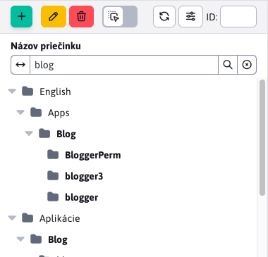

# WebJET CMS 2024

Vitajte v dokumentácii k WebJET CMS verzie 2024. Odporúčame prečítať si [zoznam zmien](CHANGELOG-2024.md) a [roadmap](ROADMAP.md).

# Zoznam zmien v poslednej verzii

## 2024.52

> Vo verzii 2024.52 Web stránky pridávajú možnosť nastaviť **spôsob usporiadania** a **vyhľadávať v stromovej štruktúre**, import ZIP umožňuje nastaviť spôsob porovnania existujúcej verzie stránky. **Elektronický obchod** dostal nový dizajn zoznamu objednávok a produktov. Pridaná **štatistika ankiet**, lepší editor obrázkov v prieskumníku a vylepšené vyhľadávanie v administrácii. V **hromadných e-mailoch** pribudla možnosť **nastaviť potvrdenie odhlásenia**. Galéria obsahuje nové pole pre **URL adresu zdroja obrázku**, ktoré je vyplnené automaticky pri použití fotobanky, **Značky** pridávajú **jazykové mutácie** a voliteľné polia.

### Prelomové zmeny

- Aktualizované Java a JavaScript knižnice na novšie verzie, skontrolujte zmeny v sekcii pre programátora nižšie. Môžete použiť aktualizačný skript `/admin/update/update-2023-18.jsp`.
- Zvýšené zabezpečenie [verejných REST služieb](custom-apps/spring/public-services.md), ak ich využívate je potrebné doplniť povolenia. Zrušená REST služba `/admin/rest/property/set` (#57202).
- FontAwesome - upravené vkladanie [FontAwesome ikon](frontend/webpages/fontawesome/README.md) v editore (#57461).
- Elektronický obchod - metódy v `DocDetails` pre získanie ceny upravené z návratovej hodnoty `double` na `BigDecimal`. Môžete použiť skript `/admin/update/update-2023-18.jsp` pre základnú aktualizáciu vašich JSP súborov. V prípade potreby môžete dočasne použiť metódy `getPriceDouble/getVatDouble/getLocalPriceDouble/getLocalPriceDouble` (#56385).

### Web stránky

- Pridaná možnosť výberu spôsobu a smeru pre usporiadanie [stromovej štruktúry](redactor/webpages/README.md#nastavenie-zobrazenia-stromovej-štruktúry) (#57257).


- Stromová štruktúra - doplnenie možnosti [vyhľadávania v stromovej štruktúre](redactor/webpages/README.md#vyhľadávanie-v-stromovej-štruktúre) priečinkov web stránok do hĺbky (#57265).



- Značky - pridaná možnosť [nastavenia jazykových mutácií](redactor/webpages/perexgroups.md#karta-preklady) názvu perex skupiny pre zobrazenie názvu značky podľa jazyka web stránky (#57273).


- FontAwesome - upravené vkladanie [FontAwesome ikon](frontend/webpages/fontawesome/README.md) v editore (#57461).

- Importovanie web stránok zo ZIP archívu - doplnenie možnosti voľby parametra [pre porovnanie existencie](redactor/webpages/import-export.md#importovanie-web-stránok-zo-zip-archívu) web stránky, upravený vizuál, doplnené možnosti o/od/značenia všetkých stránok/súborov, otvorenia/zatvorenia priečinkov a doplnená informácia o progrese importu. Porovnanie podľa voliteľného poľa umožňuje stránkam cez typ voliteľného poľa nastaviť Unikátny identifikátor pre jednoznačnú identifikáciu web stránky (#57441).


- Importovanie web stránok zo ZIP archívu - doplnené oddelenie dát pri `multi-domain`, kde dáta inej domény sa ignorujú pri hľadaní existujúcej verzie importovaných dát (#57493).
- Zlepšený prenos mena inštalácie zo šablóny do `CombineTag`. Hodnota sa uloží do `session` a použije aj v získaní súborov počas vykonania `combine` (#56325).
- Hľadanie JSP súboru šablóny berie do úvahy meno inštalácie nastavené v šablóne (#56325).
- Značky - pridaná karta s [voliteľnými poľami](redactor/webpages/perexgroups.md#karta-voliteľné-polia) pre možnosť pridania vlastných dát k značkám. Napríklad nastavenie farby značky, jej dizajnu a podobne (#57449).
- Klonovanie štruktúry - počas klonovania je vypnuté synchronizovanie názvu web stránky a priečinka, aby sa zachovali názvy podľa pôvodného priečinka. Konfiguračná premenná `syncGroupAndWebpageTitle` je nastavená na hodnotu `false` a po skončení klonovania nastavená na pôvodnú hodnotu (#57489).
- Upravené číslovanie ak existuje web stránka s rovnakým názvom/URL adresou - novo vytvorená stránka začína od čísla 2 namiesto čísla 1, vznikajú tak URL adresy typu `/en/page.html,/en/page-2.html,/en/page-3.html` namiesto `/en/page.html,/en/page-1.html,/en/page-2.html` kde `-1.html` nebolo významovo optimálne (#54273-50).
- Pridaná možnosť zmeniť správanie posledného `/` pri [generovaní URL adries stránok](frontend/setup/config.md). Štandardne pre hlavnú stránky priečinka URL adresa končí znakom `/`, teda napríklad `/en/products/`, po nastavení konfiguračnej premennej `virtualPathLastSlash` na hodnotu `false` bude URL adresa generovaná bez posledného `/` teda ako `/en/products` (#54273-50).

### Anketa

- Pridaná [štatistika odpovedí](redactor/apps/inquiry/inquiry-stat.md) ankety (#57337).


### Elektronický obchod

- [Zoznam objednávok](redactor/apps/eshop/invoice/README.md) a [Zoznam produktov](redactor/apps/eshop/product-list/README.md) upravený na nový dizajn do datatabuliek (#56325).


- Metódy v `DocDetails` pre získanie ceny upravené z návratovej hodnoty `double` na `BigDecimal` (#56385).

### Galéria

- Predvolený typ vizuálneho štýlu galérie je možné nastaviť cez konf. premennú `galleryDefaultStyle`, predvolene `photoSwipe` (#56393-18).
- Pridaná možnosť výberu spôsobu a smeru pre usporiadanie [stromovej štruktúry](redactor/webpages/README.md#nastavenie-zobrazenia-stromovej-štruktúry) (#57257).
- Pridané pole URL adresa zdroja obrázku s možnosťou zadať adresu, z ktorej ste obrázok získali. Pole sa automaticky nastavuje pri použití [fotobanky](redactor/webpages/working-in-editor/README.md#karta-fotobanka) v zozname web stránok (#57313).
- Pridaná možnosť **vyhľadávať v stromovej štruktúre** podľa názvu, podobne ako je to vo web stránkach (#57437).


### Hromadný e-mail

- Odosielanie - pri odosielaní je ignorovaný SSL certifikát web stránky, keďže často vo vnútornom prostredí je použitý dočasný SSL certifikát (#57525).
- Odhlásenie - vytvorená nová aplikácia pre nastavenie odhlásenia. Pridaná možnosť zadať vlastný text pred odhlásením a možnosť zobrazenia potvrdenia namiesto okamžitého odhlásenia kliknutím na odkaz v e-maile (#57525).
- Odhlásenie - upravený formulár na odhlásenie z hromadného e-mailu - doplnená možnosť zobraziť potvrdenie odhlásenia a možnosť znova vrátiť email po odhlásení (#57525).


### Prieskumník

- Kompletná výmena editora obrázkov pri akcii [úprava súborov](redactor/files/fbrowser/file-edit/README.md) v časti prieskumník za editor vo forme `DataTable` podľa foto galérie (#57313).
- Zlepšené zobrazenie na mobilných telefónoch pre lepšiu použiteľnosť - upravená výška, veľkosti (#55645).

### Iné

- Prerobené vyhľadávanie v administrácii na dátové tabuľky (#57333).


- Premenovaná možnosť Úprava bunky na Upraviť v zobrazení mriežky podľa názvoslovia používaného v `Microsoft SharePoint`.
- Vyhľadávanie - upravený formulár vyhľadávania na web stránke pre možnosť definovania zástupného textu (`placeholder`) namiesto štandardného Vyhľadávanie. Môžete tak zadať vlastný text, ktorý sa zobrazí vo formulári ako napr. Hľadať na web stránke (#54273-53).

### Bezpečnosť

- Upravený log pri štarte - citlivé informácie ako heslá, token, certifikáty z konfiguračných premenných sú nahradené výrazom `********` (#MR643).
- [Pre verejné REST služby](custom-apps/spring/public-services.md) pridaná možnosť nastavovať povolené IP adresy pre každú službu samostatne (#57202).
- Prekladové kľúče - pridaná možnosť filtrovať kľúče v REST službe [/rest/properties/](custom-apps/spring/public-services.md) podľa konf. premennej `propertiesRestControllerAllowedKeysPrefixes`, aby nebolo možné verejne získať všetky kľúče z WebJET CMS (#57202).
- Do auditu pridaná HTTP hlavička `Referer` (#57565).

### Oprava chýb

- Opravené generovanie URL adresy pre AB Testovanie ak pôvodná URL adresa obsahuje znak `*` (#54273-50).
- Editor obrázkov - opravené premenovanie obrázku v editore obrázkov otvoreným z prieskumníka (#57269).
- Presmerovania domén - opravená možnosť zadať protokol pre doménu presmerovania. Doplnená logika presmerovania na `https` verziu pri zvolení možnosti `http` pôvodného protokolu - predpokladá sa presmerovania na `https` verziu (#56393-20).
- Web stránky - Page Builder - opravené vkladanie aplikácií a blokov na správne miesto kurzora (#57613).
- Web stránky - Bloky - opravené zmazanie prázdnej medzery v prehliadači Firefox pri vkladaní bloku (#57613).

### Dokumentácia

- Vytvorená dokumentácia pre [zlepšenie výkonu servera](sysadmin/performance/README.md) (#57357).
- Vytvorená dokumentácia v PDF pre [redaktora](_media/manuals/webjetcms-redactor.pdf), [správcu](_media/manuals/webjetcms-admin.pdf), [prevádzku](_media/manuals/webjetcms-sysadmin.pdf) a [inštaláciu](_media/manuals/webjetcms-install.pdf). Dokumentácia v PDF je vygenerovaná automaticky z aktuálnej dokumentácie vo formáte MarkDown a obsahuje aj dátum verzie WebJET CMS (#57269).

### Pre programátora

- Zmenené API pre datatabuľku `table.ajax.url(newUrl); -> table.setAjaxUrl(newUrl);`, `table.ajax.url() -> table.getAjaxUrl()` (#57365).
- Aktualizovaný `Swagger-UI` na adrese `/admin/swagger-ui/` na verziu `org.webjars:swagger-ui:5.17.14` (#57365).
- Aktualizovaná knižnica `Bootstrap` z 4.6.1 na 5.3.3 a `jQuery` z 3.5.1 na 3.7.1 pre starú v8 administráciu (#57365).
- Vo verzii 8 odstránené knižnice `bootstrap-modal,bootstrap-switch,bootstrap-toastr,uniform,simple-line-icons` (#57365).
- Je potrebné upraviť prepínanie kariet vo vašich JSP súboroch, vyhľadajte `data-toggle="tab"` a nahraďte za `data-bs-toggle="tab"`, `LI` elementom nastavte `class="nav-item"` a prvému `A` elementu nastavte `class="active"`:

```html
<ul class="nav nav-tabs">
    <li class="nav-item">
        <a class="active" href="#tabMenu1" data-bs-toggle="tab">
            <iwcm:text key="components.filter"/>
        </a>
    </li>
    <li class="nav-item">
        <a href="#tabMenu2" data-bs-toggle="tab" onclick="loadComponentIframe();">
            <iwcm:text key="components.file_archiv.waiting_files"/>
        </a>
    </li>
</ul>
```

- Odstránené metódy `DocDB.searchTextAll,searchTextUrl`, použite triedu `sk.iway.iwcm.search.SearchService` (#57333).
- Aplikácie cez `!INCLUDE` je možné vkladať aj z priečinkov `/apps` a `/templates` (#56325).
- [Voliteľné polia](frontend/webpages/customfields/README.md#farba) - pridaný typ poľa `color` pre výber farby (#57449).
- Pre [aplikáciu v editore](custom-apps/appstore/README.md#použitie-anotácie) je možné definovať viacero JSP súborov pre ktoré sa použije, napríklad `@WebjetAppStore(...componentPath = "/components/search/search.jsp,/components/search/lucene_search.jsp")`. Pri vložení novej aplikácie sa použije prvý JSP súbor v zozname (#54273-53).

[Kompletný zoznam zmien >>](CHANGELOG-2024.md)

