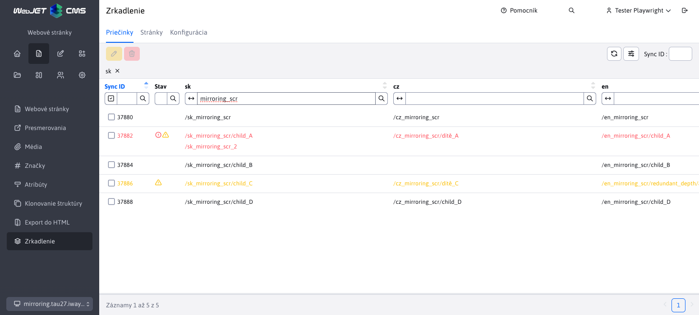
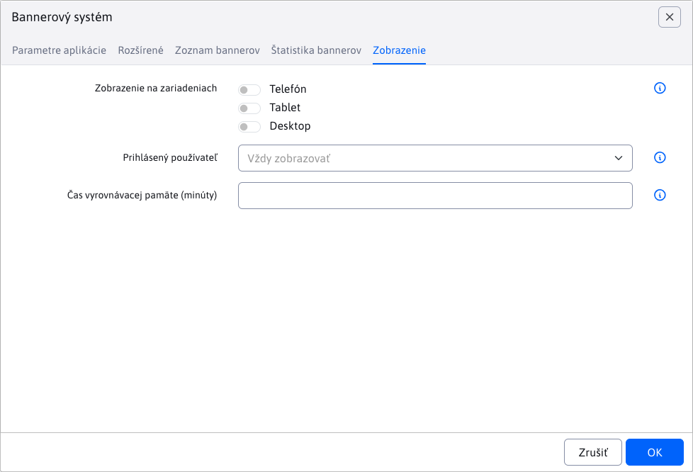
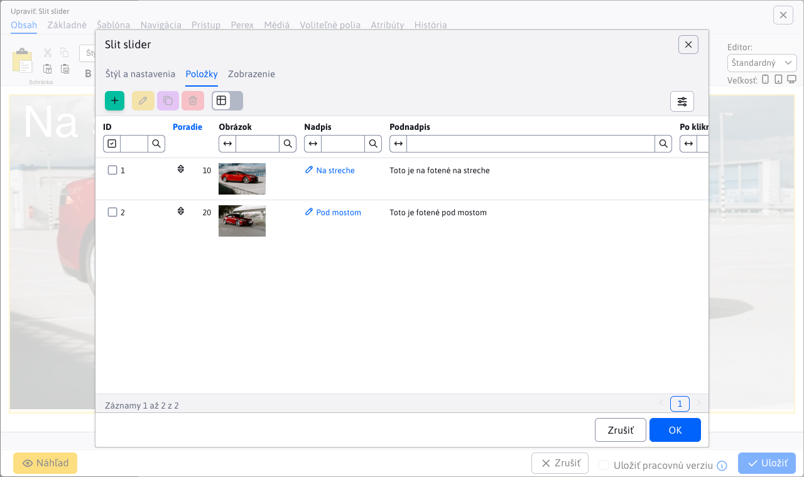
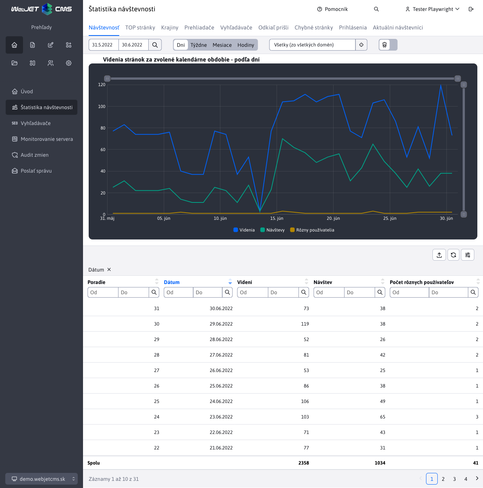

# WebJET CMS 2025

Vitajte v dokumentácii k WebJET CMS verzie 2025. Odporúčame prečítať si [zoznam zmien](CHANGELOG-2025.md) a [roadmap](ROADMAP.md).

## Zoznam zmien vo verzii 2025.40

> **WebJET CMS 2025.40** prináša integrovaného **AI Asistenta**, ktorý zásadne zjednodušuje prácu s obsahom. Umožňuje automaticky **opravovať gramatiku**, **prekladať** texty, navrhovať titulky, sumarizovať články a generovať **ilustračné obrázky** priamo v editore. Vďaka tomu je tvorba obsahu **rýchlejšia, presnejšia a kreatívnejšia** než kedykoľvek predtým.
>
> Významné zmeny sa týkajú aj **značiek** a **šablón noviniek**, ktoré boli prepracované do **samostatných databázových tabuliek** s podporou oddelenia podľa domén. To prináša vyššiu **prehľadnosť, jednoduchšiu správu** a možnosť efektívneho prispôsobenia obsahu pre viacero webov. Používateľské prostredie bolo **optimalizované pre menšie obrazovky** – systém automaticky prispôsobí zobrazenie okien a maximalizuje využiteľný priestor.
>
> Na technickej úrovni bol odstránený zastaraný Struts Framework. Vďaka tomu je WebJET CMS výkonnejší, stabilnejší, **bezpečnejší** a pripravený na ďalší rozvoj moderných webových riešení.

### Prelomové zmeny

- Odstránený `Struts Framework`, je potrebné vykonať aktualizáciu `JSP` súborov, Java tried a upraviť súbor `web.xml`, viac v [sekcii pre programátora](#pre-programátora) (#57789).
- Ak používate aplikačný server Tomcat vo verzii 9.0.104 a viac je potrebné [aktualizovať nastavenie](install/versions.md#zmeny-pri-prechode-na-tomcat-90104) parametra `maxPartCount` na `<Connector` elemente (#54273-70).
- Značky - rozdelené podľa domén - pri štarte sa vytvorí kópia značiek pre každú doménu (ak je používané rozdelenie údajov podľa domén - nastavená konfiguračná premenná `enableStaticFilesExternalDir=true`). Aktualizujú sa ID značiek pre web stránky a galériu. Je potrebné manuálne skontrolovať ID značiek pre všetky aplikácie novinky a iné aplikácie, ktoré obsahujú ID značky - aktualizácia sa ich pokúsi opraviť, ale odporúčame ID skontrolovať. Viac informácii v sekcii pre programátora. (#57837).
- Novinky - [šablóny noviniek](frontend/templates/news/README.md) prerobené z definície cez prekladové kľúče na vlastnú databázovú tabuľku. Pri štarte WebJETu sa skonvertujú záznamy z pôvodného formátu. Sú oddelené podľa domén, ak obsahujú doménový alias vytvoria sa len v príslušnej doméne (#57937).
- Bezpečnosť - prísnejšia kontrola URL adries administrácie - je potrebné, aby URL adresa v administrácii mala na konci znak `/`, nesprávna adresa je `/admin/v9/webpages/web-pages-list` alebo `/apps/quiz/admin`, správna `/admin/v9/webpages/web-pages-list/` alebo `/apps/quiz/admin/`. Je potrebné aby programátor skontroloval definície URL adries v súboroch `modinfo.properties` (#57793).

### AI Asistent

V dnešnom svete je umelá inteligencia všade okolo nás a samozrejme, WebJET ako moderný redakčný systém nechce zostať pozadu. Preto s hrdosťou predstavujeme novú verziu WebJET CMS, kde sme integrovali [pokročilé AI nástroje](redactor/ai/README.md).


Tieto funkcie vám zjednodušia tvorbu a úpravu obsahu – od opravy gramatiky, cez preklady textov, návrhy titulkov, až po generovanie ilustračných obrázkov.

<div class="video-container">
    <iframe width="560" height="315" src="https://www.youtube.com/embed/LhXo7zx7bEc" title="YouTube video player" frameborder="0" allow="accelerometer; autoplay; clipboard-write; encrypted-media; gyroscope; picture-in-picture" allowfullscreen></iframe>
</div>

### Web stránky

- AB Testovanie - pridaná možnosť [zobrazovať AB verziu](redactor/apps/abtesting/README.md) podľa stavu prihláseného používateľa - neprihlásenému používateľovi sa zobrazí A verzia a prihlásenému B verzia. Režim aktivujete nastavením konfiguračnej premennej `ABTestingForLoggedUser` na hodnotu `true` (#57893).
- [Page Builder](redactor/webpages/pagebuilder.md) - upravený vizuál, aby lepšie zapadal do aktuálneho dizajnu WebJET CMS (#57893).


- Povolené zobrazenie stránok obsahujúcich `404.html` v URL adrese zo systémových priečinkov, aby vám takáto technická stránka neprekážala medzi štandardnými web stránkami (#57657-8).
- Značky - rozdelené zobrazenie značiek podľa aktuálne zvolenej domény, aby ste mohli mať značky zvlášť pre každú doménu vo WebJETe (#57837).
- Klonovanie štruktúry - pridaná informácia o nakonfigurovanom prekladači a koľko voľných znakov na preklad ostáva (#57881).
- Zrkadlenie štruktúry - pridaná možnosť vymazať `sync_id` hodnoty pre zvolený priečinok (rekurzívne). Aby bolo ľahko možné zrušiť/resetovať zrkadlenie stránok (#57881).


- Zrkadlenie - pridanie novej sekcie [zrkadlenie](redactor/webpages/mirroring/README.md) na sledovanie a manažovanie previazaných priečinkov a stránok po akcií zrkadlenia (#57941).



- Pri výbere obrázka, alebo video súboru, v editore stránok sú v prieskumníkovi zobrazené len vhodné typy súborov, ostatné sú filtrované (#57921).

### Šablóny

- Pridaná nová sekcia [Šablóny noviniek](frontend/templates/news/README.md) na správu a manažovanie šablón noviniek (#57937).


### Používateľské rozhranie

- Pri použití malého monitora (výška okna menej ako 760 bodov) sa zobrazí okno automaticky na celú plochu a zmenší sa hlavička a pätička (titulok okna je menším písmom). Zvýši sa tak zobrazené množstvo informácií, čo je potrebné hlavne v sekcii web stránky. Používa sa pri oknách používajúcich CSS triedu `modal-xl`, čo sú aktuálne web stránky, foto galéria, editor obrázkov a používatelia (#57893).


- V editore pridaná možnosť kliknúť na ikonu obrázka na začiatku poľa, pre jeho zobrazenie v novej karte.


### Aplikácie

- Pridaná možnosť zobraziť aplikáciu len prihlásenému/neprihlásenému používateľovi. Režim sa nastavuje v karte [Zobrazenie nastavenia aplikácie](redactor/webpages/working-in-editor/README.md#karta-zobrazenie) v editore stránok (#57893).



Prerobené nastavenie vlastností aplikácií v editore zo starého kódu v `JSP` na `Spring` aplikácie. Aplikácie automaticky získavajú aj možnosť nastaviť [zobrazenie na zariadeniach](custom-apps/appstore/README.md#podmienené-zobrazenie-aplikácie). Dizajn je v zhode so zvyškom WebJET CMS a dátových tabuliek (#57409).

- [Carousel Slider](redactor/apps/carousel_slider/README.md)
- [Emotikony](redactor/apps/emoticon/README.md)
- [Fórum/Diskusia](redactor/apps/forum/README.md)
- [Otázky a odpovede](redactor/apps/qa/README.md)
- [Používatelia](redactor/apps/user/README.md)
- [Pôsobivá prezentácia](redactor/apps/app-impress_slideshow/README.md)
- [Reštauračné menu](redactor/apps/restaurant-menu/README.md)
- [Slider](redactor/apps/slider/README.md)
- [Slit slider](redactor/apps/app-slit_slider/README.md)
- [Sociálne ikony](redactor/apps/app-social_icon/README.md)
- [Video](redactor/apps/video/README.md)



### Menu

- Ak [menu web stránky](redactor/apps/menu/README.md) nemá zadaný koreňový priečinok (hodnota je nastavená na 0), automaticky sa použije koreňový priečinok pre aktuálne zobrazenú web stránku. Je to výhodné ak sa zobrazuje menu vo viacerých jazykových mutáciách kde každá je koreňový priečinok - nemusíte mať menu/hlavičky pre každý jazyk samostatne, stačí jedna spoločná (#57893).

### Štatistika

- V sekcií [návštevnosť](redactor/apps/stat/README.md#návštevnosť) pridaný sumárny počet Videní, Návštev a Počet rôznych používateľov pre ľahký prehľad celkovej návštevnosti za zvolené obdobie (#57929).



- V sekcií [chybné stránky](redactor/apps/stat/README.md#chybné-stránky) pridané filtrovanie podľa botov (aplikuje sa len na novo zaznamenané údaje) a sumárny počet v pätičke. Je potrebné upraviť stránku `404.jsp` vo vašom projekte pridaním objektu `request` do volania `StatDB.addError(statPath, referer, request);` (#58053).


### Voliteľné polia

- Pridaná podpora pre nové typy [voliteľných polí](frontend/webpages/customfields/README.md):
  - [Výber priečinku webových stránok](frontend/webpages/customfields/README.md#výber-priečinku-webových-stránok) (#57941).
  - [Výber webovej stránky](frontend/webpages/customfields/README.md#výber-webovej-stránky) (#57941).


### Bezpečnosť

- Opravená možná zraniteľnosť v Safari pri špeciálnej URL adrese smerujúcej na archív súborov v kombinácii s peknou 404 stránkou (#57657-8).

### Iné menšie zmeny

- Audit zmien - vyhľadávanie - pole Typ je usporiadané podľa abecedy (#58093).
- Elektronický obchod - pridaná možnosť nastaviť [koreňový priečinok](redactor/apps/eshop/product-list/README.md) so zoznamom produktov pomocou konfiguračnej premennej `basketAdminGroupIds`, ak nevyhovuje automatické hľadanie podľa vloženej aplikácie zoznam produktov (#58057).
- Elektronický obchod - aplikácia na nastavenie platobných metód presunutá z priečinka `/apps/eshop/admin/payment-methods/` do štandardného `/apps/basket/admin/payment-methods/` (#58057).
- Elektronický obchod - po zmazaní objednávky sú zmazané z databázy aj jej položky a platby (#58070).
- Monitorovanie servera - aktuálne hodnoty - pridaný typ databázového servera (MariaDB, Microsoft SQL, Oracle, PostgreSQL) (#58101).
- Prekladač - pri prekladači `DeepL` sa zlepšilo spracovanie vrátených chybových hlášok, pre presnejšie identifikovanie problému (#57881).
- Prekladač - pridaná podpora pre implementáciu viacerých prekladačov a ich automatické spracovanie/využitie (#57881).
- Prekladač - pridané automatické [auditovanie počtu spotrebovaných znakov](admin/setup/translation.md) pri každom preklade. Do audit záznamu typu `TRANSLATION` sa do stĺpca `EntityID` zapíše spotrebované množstvo kreditov pri preklade. Audituje sa aj počet dostupných znakov, výsledok je uložený do cache a aktualizuje sa znova najskôr o 5 minút (#57965).
- Prieskumník - optimalizované načítanie, opravené duplicitné čítanie knižnice `jQuery UI` (#57997).

### Oprava chýb

- Dátové tabuľky - opravené nastavenie možností do výberového menu externého filtra (#57657-8).
- Klonovanie štruktúry - opravená validácia zadaných id priečinkov a pridaný výpis chybovej správy (#57941).
- Galéria - pridaná podpora pre výber priečinka galérie, v aplikácii Galéria vo web stránke, pri použití doménových aliasov a editácia záznamu v galérii s doménovým aliasom (#57657-11).
- Webové stránky - opravené zobrazenie zoznamu stránok pri zobrazení priečinkov ako tabuľky (#57657-12).
- Grafy - opravené zobrazenie veľkého množstva legend v grafoch, automaticky sa využije posúvanie v legendách (#58093).

### Dokumentácia

- Doplnená dokumentácia pre nastavenie a používanie [dvoj stupňového overovania/autorizácie](redactor/admin/logon.md#dvojstupňové-overovanie) (#57889).

### Pre programátora

- Zrušená trieda `ImportXLSForm`, ktorá sa používala v importoch z `XLS` formátu v [spec/import_xls.jsp](../../src/main/webapp/admin/spec/import_xls.jsp). Technicky trieda nie je potrebná, stačí zmazať referenciu v JSP a upraviť formulár na štandardný HTML formulár (#57789).
- Zlepšený aktualizačný skript `/admin/update/update-2023-18.jsp` pre Archív súborov - vie aktualizovať štandardné zmeny a doplniť potrebné zmeny do vašej verzie `FileArchivatorBean` a pomocných tried (#57789).
- Trieda `org.apache.struts.action.ActionMessage` nahradená objektom `String`, trieda `ActionMessages` nahradená `List<String>` (#57789).
- Zrušený framework `Struts`, tagy `<logic:present/iterate/...` nahradené za zodpovedajúce `<iwcm:present/iterate/...`, pozor `<bean:write` za `<iwcm:beanWrite`.
- V Java kóde sú z dôvodu odstránenia `Struts` nasledovné zmeny:
  - `ActionMessage` nahradený za `String`
  - `ActionMessages` nahradený za `List<String>`
  - `BasicLdapLogon.logon` vráti `List<String>` namiesto `ActionMessages`
  - `org.apache.struts.util.ResponseUtils.filter` nahradený `sk.iway.iwcm.tags.support.ResponseUtils.filter`
- Amcharts - pridaná podpora pre zadanie funkcie na transformáciu textu v štítkoch kategórií u grafu typu `PIE` (#58093).
- Amcharts - pridaná podpora pre zadanie funkcie na transformáciu textu v legende grafu typu `LINE` (#58093).
- Amcharts - pridaná možnosť skryť tooltip keď hodnota je `null` alebo `0` v grafe typu `LINE` (#58093).

Na konverziu JSP aj Java súborov môžete použiť skript `/admin/update/update-2023-18.jsp`. Ak zadáte ako cestu hodnotu `java` vykoná sa nahradenie aj v `../java/*.java` súboroch. Problémom je spustenie projektu, ak obsahuje chyby. Môžete ale priečinok `src/main/java` premenovať na `src/main/java-update` aby išiel spustiť čistý WebJET. Následne môžete použiť aktualizačný skript. Ten prehľadáva a aktualizuje priečinok `../java/*.java` aj `../java-update/*.java`.

V súbore `WEB-INF/web.xml` už nie je potrebná inicializácia `Apache Struts`, zmažte celú `<servlet>` sekciu obsahujúcu `<servlet-class>org.apache.struts.action.ActionServlet</servlet-class>` a `<servlet-mapping>` obsahujúci `<servlet-name>action</servlet-name>`.

- Rozdelené značky podľa domén (ak je nastavená konfiguračná premenná `enableStaticFilesExternalDir=true`), aby bolo možné jednoducho mať samostatné značky pre každú doménu. Pri spustení WebJET nakopíruje existujúce značky pre všetky definované domény. Preskočí značky, ktoré majú nastavene zobrazenie len v špecifickom priečinku, kde podľa prvého priečinku nastaví doménu pre značku. Aktualizuje značky pre Novinky, čiže pre aplikáciu `/components/news/news-velocity.jsp` kde vyhľadá výraz `perexGroup` a `perexGroupNot` pri ktorých sa pokúsi ID značiek aktualizovať podľa domény danej web stránky. Informácia sa zapíše do histórie a v Audite vznikne záznam s podrobnosťou ako sa `INCLUDE` nahradil, príklad:

```txt
UPDATE:
id: 76897

news-velocity.jsp - update perexGroups+perexGroupsNot for domainId, old code::
INCLUDE(/components/news/news-velocity.jsp, groupIds="24", alsoSubGroups="false", publishType="new", order="date", ascending="false", paging="false", pageSize="1", offset="0", perexNotRequired="false", loadData="false", checkDuplicity="true", contextClasses="", cacheMinutes="0", template="news.template.dlazdica-3", perexGroup="625", perexGroupNot="626")
new code:
INCLUDE(/components/news/news-velocity.jsp, groupIds="24", alsoSubGroups="false", publishType="new", order="date", ascending="false", paging="false", pageSize="1", offset="0", perexNotRequired="false", loadData="false", checkDuplicity="true", contextClasses="", cacheMinutes="0", template="news.template.dlazdica-3", perexGroup="", perexGroupNot="")

INCLUDE(/components/news/news-velocity.jsp, groupIds="24", alsoSubGroups="false", publishType="new", order="date", ascending="false", paging="false", pageSize="1", offset="0", perexNotRequired="false", loadData="false", checkDuplicity="true", contextClasses="", cacheMinutes="0", template="news.template.dlazdica-3", perexGroup="3+645", perexGroupNot="794")
new code:
INCLUDE(/components/news/news-velocity.jsp, groupIds="24", alsoSubGroups="false", publishType="new", order="date", ascending="false", paging="false", pageSize="1", offset="0", perexNotRequired="false", loadData="false", checkDuplicity="true", contextClasses="", cacheMinutes="0", template="news.template.dlazdica-3", perexGroup="1438+1439", perexGroupNot="1440")
```

Pre prvý `INCLUDE` boli odstránené značky s ID 625 a 626, pretože tie sa nezobrazujú v danom priečinku/doméne - mali nastavené zobrazenie len pre určitý priečinok. V druhom `INCLUDE` boli zmenené značky `3+645` na novo vzniknuté `1438+1439` a `794` za `1440`.

| perex_group_id | perex_group_name      | domain_id | available_groups |
|----------------|-----------------------|-----------|-----------------|
| 3              | ďalšia perex skupina  | 1         | NULL            |
| 645            | deletedPerexGroup     | 1         | NULL            |
| 794            | kalendár-udalostí     | 1         | NULL            |
| 1438           | ďalšia perex skupina  | 83        | NULL            |
| 1439           | deletedPerexGroup     | 83        | NULL            |
| 1440           | kalendár-udalostí     | 83        | NULL            |

Pred spustením aktualizácie existovali v databáze len záznamy `3, 645 a 794`, ktorým sa nastavilo `domain_id=1`. Záznamy `1438, 1439 a 1440` vznikli pri aktualizácii pre `domain_id=83`.

- Dátové tabuľky - pridaná podpora pre úpravu [lokálnych JSON dát](developer/datatables-editor/field-datatable.md#lokálne-json-dáta) (#57409).
- Dátové tabuľky - pridané rozšírenie [Row Reorder](https://datatables.net/extensions/rowreorder/) pre možnosť usporiadania zoznamu pomocou funkcie `Drag&Drop` (#57409).
- Datatabuľky - Pridaná možnosť nastavenia [Pätičky pre súčet hodnôt](developer/datatables/README.md#pätička-pre-súčet-hodnôt) (#57929).
- Aplikácie - doplnená možnosť použiť lokálne JSON dáta pre nastavenie položiek aplikácie, napríklad položiek pre [pôsobivú prezentáciu](redactor/apps/app-impress_slideshow/README.md) (#57409).


