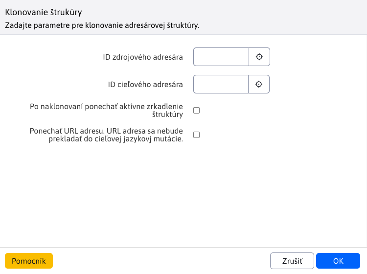
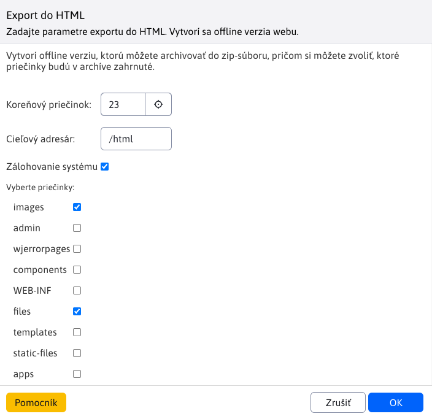
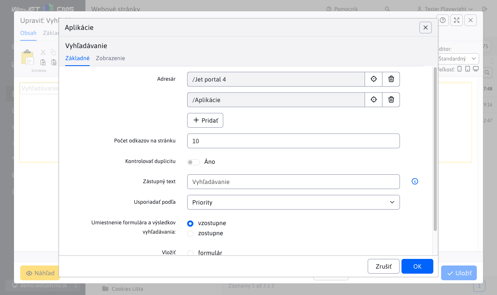
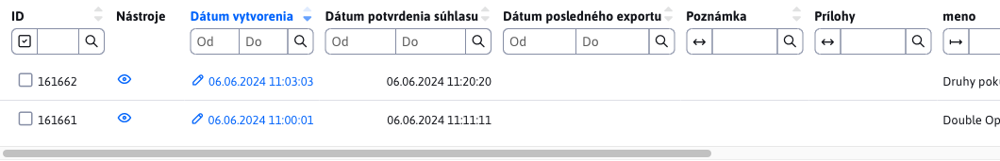
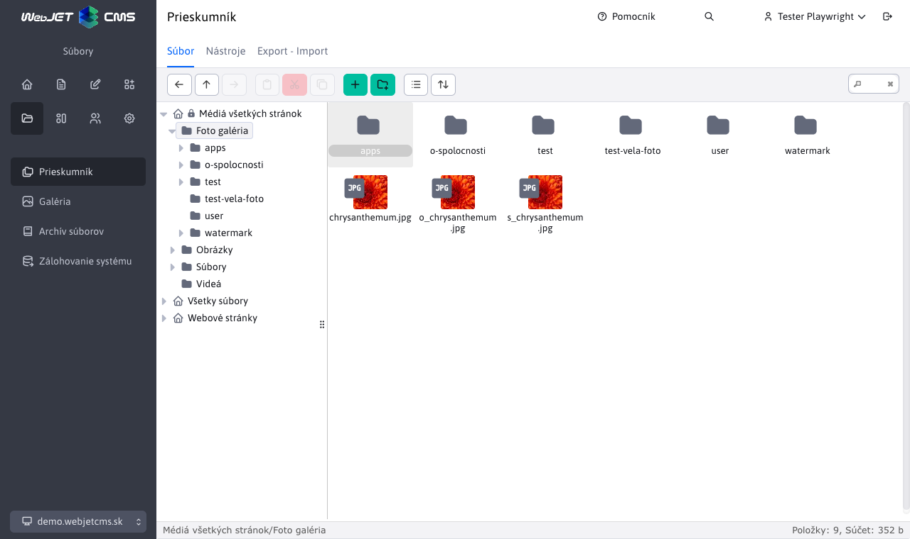
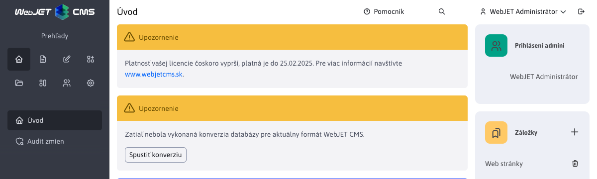

# WebJET CMS 2024

Vitajte v dokumentácii k WebJET CMS verzie 2024. Odporúčame prečítať si [zoznam zmien](CHANGELOG-2024.md) a [roadmap](ROADMAP.md).

# Zoznam zmien v poslednej verzii

## 2024.40

> Vo verzii 2024.40 prináša **Prieskumník** nové funkcie a vylepšenia. Pri presune súborov pomocou **drag&drop sa teraz zobrazí potvrdenie**, čo zamedzí chybám pri správe súborov. V editore obrázkov bola pridaná možnosť nastavenia **veľkosti a orezania podľa šablón**, čo uľahčuje úpravu obrázkov priamo v rozhraní.
>
> Ďalším vylepšením je prepracovanie nastavení viacerých **aplikácií do nového, prehľadnejšieho dizajnu**. Autor stránky teraz dostáva **notifikácie pri časovom publikovaní stránky**, ako aj pri pridaní **príspevku do diskusného fóra**, čo zlepšuje kontrolu nad obsahom. Nová aplikácia pre rezervácie podľa času umožňuje jednoduché a prehľadné **rezervovanie objektov, ako sú tenisové kurty alebo zasadačky**. Táto aplikácia tiež ponúka štatistiky podľa používateľov a objektov, čo uľahčuje správu rezervácií.
>
> Vylepšili sme aj fungovanie nástroja PageBuilder a opravili chyby v publikovaní v Archíve súborov, čím sme zabezpečili lepšiu stabilitu a výkon pri práci s obsahom.


### Prelomové zmeny

- AB Testovanie - zamedzené volanie URL adries B verzie (obsahujúcich výraz `abtestvariant`) ak nie je prihlásený administrátor. Povoliť priame volanie takýchto URL je možné nastavením konf. premennej `ABTestingAllowVariantUrl` na hodnotu `true` (#56677).
- Databázové pripojenie - zmenená knižnica pre manažment databázových spojení z `Apache DBCP` na [HikariCP](https://github.com/brettwooldridge/HikariCP) (#56821).
- Inicializácia - upravená inicializácia WebJETu použitím `Spring.onStartup` namiesto `InitServlet`. Zabezpečené je správne poradie načítania konfiguračných premenných a ich použitia v `SpringBean` objektoch (#56913).
- Kódovanie znakov - vzhľadom na zmenu v inicializácii je kódovanie znakov čítane z konf. premennej `defaultEncoding` s predvolenou hodnotou `utf-8`. Ak historicky používate kódovanie `windows-1250` je potrebné hodnotu v konfigurácii upraviť. Už sa nepoužíva hodnota vo `web.xml` pre `SetCharacterEncodingFilter` ale hodnota v konfigurácii WebJETu. Filter môžete z `web.xml` zmazať. Zrušená podpora nastavenia chybovej správy pri nefunkčnom databázovom spojení nastavením parametra `dbErrorMessageText`, potrebné je vytvoriť súbor `/wjerrorpages/dberror.html` ak chcete zobraziť špecifickú HTML stránku pri chybe databázového spojenia (#56913, #56393-12).
- Optimalizované získanie presmerovania v `404.jsp`, vo vašich gradle projektoch odporúčame aktualizovať súbor `404.jsp` podľa [basecms](https://github.com/webjetcms/basecms/blob/master/src/main/webapp/404.jsp) projektu (#53469).
- Archív súborov - upravená predvolená hodnota konf. premennej `fileArchivIndexOnlyMainFiles` na hodnotu `true`. Do vyhľadávania/plno textového indexu sa zapisujú teda len hlavné súbory a nie archívne verzie. Dôvod je, že nechceme používateľov z vyhľadávania štandardne smerovať na staršie (archívne) verzie súborov (#57037).
- Archív súborov - opravené usporiadanie súborov v archíve podľa času, pridaná možnosť usporiadania podľa priority (tak sa usporadúvalo pri pôvodnej voľbe podľa času) (#57037).
- Zaheslovaná zóna - upravené prihlasovanie a funkcia zabudnutého hesla, ak máte vami upravený súbor `/components/user/logon.jsp` alebo `/components/user/change_password.jsp` overte korektné správanie a prípadne podľa štandardnej verzie upravte (#57185).

### Web stránky

- Klonovanie štruktúry - doplnená možnosť [ponechať URL adresy pri klonovaní](redactor/apps/clone-structure/README.md). Z URL adries sa odstráni prefix podľa zdrojového priečinka a doplní sa prefix podľa cieľového. Ak teda klonujete napr. novú jazykovú mutáciu, pridá sa len napr. `/en/` prefix, ale ostatné URL adresy zostanú bez zmeny (#56673).



- Editor obrázkov - doplnená možnosť nastaviť Bod záujmu na ľubovoľný obrázok (#57037).
- Editor obrázkov - upravené nastavenie veľkosti obrázku pre lepšie použitie funkcie zmeny veľkosti (ak je obrázok menší ako aktuálne okno bude sa zmenšovať) (#56969).
- Audit - upravené zapisovanie auditného záznamu pri uložení web stránky na štandardný data tabuľkový zápis so zoznamom všetkých zmenených vlastností (#57037).
- Porovnanie stránok - opravené zobrazenie "Zobraziť len text stránky" pri porovnaní verzií stránky z histórie (#57037).
- Obrázky - pri zmene obrázku, ktorý má v názve výraz `placeholder` alebo `stock` sa v okne prieskumníka nezobrazí priečinok s týmto obrázkom ale zobrazí sa Média tejto stránky/Obrázky pre jednoduché nahratie nového obrázku namiesto zástupného obrázku (#57037).
- Perex obrázok - upravené otvorenie okna tak, aby zobrazilo Média tejto stránky ako prvé a následne výber všetkých médií (nezobrazí sa zoznam všetkých súborov a odkazov na web stránky) (#57037).
- Page Builder - opravené nastavenie priečinku podľa titulku novej stránky pri vkladaní obrázka (#57037).
- Page Builder - opravené duplikovanie bloku pre `accordion` - korektné nastavenie ID editora aby nedošlo k prepísaniu textu pri uložení (#57037).
- Page Builder - opravené nastavenie [šírky stĺpcov](frontend/page-builder/blocks.md#nastavenie-šírky-stĺpcov) - do úvahy sa berie šírka okna nie šírka elementu (#57037).
- Zoznam promo aplikácii pri vkladaní novej aplikácie sa nastavuje cez konf. premennú `appstorePromo`, je možné tam okrem názvu priečinka zadať priamo aj `itemKey` hodnotu, napr. `cmp_news` pre podporu Spring aplikácií. Predvolená hodnota je `cmp_news,menuGallery,menuBanner,cmp_video` (#57157).
- Export do HTML - vytvorená [dokumentácia](redactor/webpages/export-to-html/README.md), testy, vypnutá kontrola SSL certifikátov pre možnosť použitia `SelfSigned` certifikátov počas vývoja alebo testovania (#57141).
- Publikovanie web stránky - pridané auditovanie úspešného časového publikovania web stránky a pridaná možnosť [poslať notifikáciu autorovi](redactor/webpages/editor.md#publikovanie-web-stránky) web stránky pri úspešnom publikovaní (#57173).



- Značky - pridaná premenná `perexGroupsRenderAsSelect` na určenie od akého [počtu značiek](redactor/webpages/perexgroups.md) sa začnú generovať ako viacnásobné výberové pole, pôvodne bola táto hodnota nastavená v kóde na 30 (#57185).
- Značky - aj pri vysokom počte definovaných značiek sa v tabuľke bude vždy filtrovanie zobrazovať ako textové pole (#57185).
- Voliteľné polia - doplnené nastavenie názvov stĺpcov [voliteľných polí](frontend/webpages/customfields/README.md) v zozname web stránok vrátane prefixu textových kľúčov (napr. `temp-3.editor.field_a`) podľa šablóny priečinka (#57185).

### Aplikácie

Prerobené nastavenie vlastností aplikácií v editore zo starého kódu v `JSP` na `Spring` aplikácie. Aplikácie automaticky získavajú aj možnosť nastaviť [zobrazenie na zariadeniach](custom-apps/appstore/README.md#podmienené-zobrazenie-aplikácie). Dizajn je v zhode so zvyškom WebJET CMS a dátových tabuliek.

- [Cookie lišta](redactor/apps/app-cookiebar/README.md)
- [Content Block](redactor/apps/content-block/README.md)
- [Disqus komentáre](redactor/apps/app-disqus/README.md)
- [Facebook Like tlačidlo](redactor/apps/app-facebook_like/README.md)
- [Facebook Like Box](redactor/apps/app-facebook_like_box/README.md)
- [GDPR Cookies súhlas](redactor/apps/gdpr/README.md)
- [Google vyhľadávanie](redactor/apps/app-vyhladavanie/README.md)
- [Live chat (SmartsUpp)](redactor/apps/app-smartsupp/README.md)
- [Menu navigačné](redactor/apps/menu/README.md)
- [Počasie](redactor/apps/app-weather/README.md)
- [Poslať stránku emailom](redactor/apps/send_link/README.md)
- [Štatistika - mapa kliknutí](redactor/apps/stat/README.md)
- [Vloženie dokumentu](redactor/apps/app-docsembed/README.md)
- [Vloženie HTML kódu](redactor/apps/app-htmlembed/README.md)
- [Vyhľadávanie](redactor/apps/search/README.md)
- [Zobrazenie súborov](redactor/apps/site-browser/README.md)




### Audit

- Zlepšený zápis zmien v entite, pridaná podpora polí, získanie hodnoty pre dátum (`Date` objekt alebo premenná s `date` v názve), pridaná podpora značiek (výpis názvu namiesto ID) (#57037).
- Prerobená sekcia **Úrovne logovania** na sekcie Audit->[Úrovne logovania](sysadmin/audit/audit-log-levels.md) a Audit->[Log súbory](sysadmin/audit/audit-log-files.md) do nového dizajnu (#56833).


- Upravene práva pre sekciu Audit-Zmenené stránky a Audit-Čaká na publikovanie aby sa správne skrývali v menu - vyžadujú právo na audit aj zoznam web stránok (#57145).
- Upravená zlá rola pre sekciu Audit-Log súbory (#57145).
- Zlepšené auditovanie záznamov úloh na pozadí - doplnený zoznam zmien pri úprave/vytvorení úlohy, doplnené ID úlohy (#56845).
- [Notifikácie](sysadmin/audit/audit-notifications.md) - upravené pole "Len ak obsahuje text" na viac riadkové pole pre možnosť zaslania notifikácie s kontrolou viac riadkového výrazu (#57229).


### AB Testovanie

- Pre vyhľadávacie boty (napr. Google) sa vždy zobrazí A varianta, aby text stránok bol konzistentný. Bot sa deteguje rovnako ako pre štatistiku podľa `User-Agent` hlavičiek nastavených v konf. premennej `statDisableUserAgent` (#56677).
- Do Ninja triedy pridaná [identifikácia zobrazenej varianty](frontend/ninja-starter-kit/ninja-bp/README.md) pomocou `data-ab-variant="${ninja.abVariant}` (#56677).
- Zamedzené volanie URL adries B verzie (obsahujúcich výraz `abtestvariant`) ak nie je prihlásený administrátor. Povoliť priame volanie takýchto URL je možné nastavením konf. premennej `ABTestingAllowVariantUrl` na hodnotu `true` (#56677).

### Archív súborov

- Upravené generovanie názvov súborov pri aktualizácii tak, aby vždy bol zachovaný pôvodný názov súboru a staršie verzie sa ukladali ako `_v1,_v2` atď (#57037).
- Opravené publikovanie súboru nastaveného ako Nahrať súbor neskôr (#57037).
- Opravené vytvorenie plno textového indexu pre vyhľadávanie v súboroch (#57037).
- Upravená predvolená hodnota konf. premennej `fileArchivIndexOnlyMainFiles` na hodnotu `true`. Do vyhľadávania/plno textového indexu sa zapisujú teda len hlavné súbory a nie archívne verzie. Dôvod je, že nechceme používateľov z vyhľadávania štandardne smerovať na staršie (archívne) verzie súborov (#57037).
- Opravené usporiadanie súborov v archíve podľa času, pridaná možnosť usporiadania podľa priority (tak sa usporadúvalo pri pôvodnej voľbe podľa času) (#57037)
- Doplnené zobrazenie poznámky a rozsahu platnosti dátumov aj pre archívne verzie súborov (#57037).


### Číselníky

- Upravená kontrola ID záznamu pri importe dát číselníka - kontroluje sa, či sa dané ID nenachádza v inom type číselníka, ak áno je nastavená hodnota `ID` na `-1` pre import nového záznamu. Chráni sa tak prepísanie dát v inom ako zvolenom číselníku ak náhodou existuje záznam s rovnakým ID (#57149).

### Diskusia

-  Pridaná možnosť [Odoslať notifikáciu autorovi stránky pri pridaní príspevku do diskusie](redactor/apps/forum/README.md#karta---parametre-aplikácie) pri vkladaní aplikácie Diskusia do stránky. Nastavením konf. premennej `forumAlwaysNotifyPageAuthor` na hodnotu `true` môžete notifikáciu zapnúť automaticky pre všetky diskusie/fóra (#57013).


### Formuláre

- Po odoslaní formuláru cez AJAX publikovaná udalosť `WJ.formSubmit`, na ktorú je možné počúvať pri napojení na `DataLayer`, napr. ako:

```javascript
    window.addEventListener("WJ.formSubmit", function(e) { console.log("DataLayer, submitEvent: ", e); dataLayer.push({"formSubmit": e.detail.formDiv, "formSuccess": e.detail.success}); });
```

- Pre formuláre, ktoré [vyžadujú potvrdiť platnosť email adresy](redactor/apps/form/README.md#nastavenie-potvrdenia-emailovej-adresy) kliknutím na odkaz v emaile, upravené hlásenie o úspešnosti odoslania na text "Formulár bol odoslaný, na váš email sme odoslali správu, v ktorej je potrebné potvrdiť odoslanie kliknutím na odkaz." aby návštevník dostal informáciu o nutnosti potvrdenia odoslania v email správe (#57125).
- Formuláre, ktoré vyžadujú potvrdiť platnosť email adresy kliknutím na odkaz v emaile a zatiaľ nie sú potvrdené sa v zozname formulárov zobrazujú červenou farbou (#57125).



### Galéria

- Upravené zobrazenie obrázkov v administrácii tak, aby sa nebral do úvahy nastavený bod záujmu, ale v zozname obrázkov bol zobrazený celý obrázok (#56969).
- Doplnená možnosť nastaviť [šablóny pre zmenu veľkosti obrázka a orezanie](redactor/image-editor/README.md) (#57201).
- Opravené vkladanie textu v samostatnom editore obrázkov a preklad chýbajúceho textu (#57201).
- Presunutá nástrojová lišta v editore obrázkov vľavo, aby sa lepšie využila plocha monitora (#57201).


- Zväčšená veľkosť poľa autor z 255 znakov na textové pole s rozsahom 64000 znakov (#57185).
- Upravené formátovanie HTML kódu v poliach Perex - vypnuté zalamovanie riadkov/formátovanie kódu aby nedochádzalo k doplneniu medzier (#57185).
- Doplnené čistenie HTML kódu od formátovania pri vložení textu cez schránku (#57185).

### Novinky

- Doplnená kontrola práv na priečinky - výberové pole priečinka pre zobrazenie noviniek je filtrované podľa práv na priečinky web stránok (#56661).

### Používatelia

- Pridaná možnosť nastaviť [skupine používateľov](admin/users/user-groups.md) zľavu z ceny v %, ktorá sa použije napr. pri vytvorení rezervácie ale v budúcnosti bude použitá aj v iných aplikáciách (#57049).
- Upravená logika pri zmene [zabudnutého hesla](redactor/admin/password-recovery/README.md). Ak zadaný email patrí viacerým používateľom, pri zmene hesla je možné pomocou výberového poľa určiť, ktorému používateľovi s daným emailom bude heslo zmenené (#57185).


### Prieskumník

- Nová verzia knižnice [elfinder](https://github.com/webjetcms/libs-elFinder/tree/feature/webjetcms-integration) pre [správu súborov](redactor/files/fbrowser/README.md). Upravený dizajn podľa vzhľadu datatabuliek pre krajšiu integráciu.



- Predvolené kódovanie súborov pre editor je nastavené podľa konf. premennej `defaultEncoding`. Pre JSP súbory je kódovanie `utf-8/windows-1250` detegované podľa atribútu `pageEncoding`, ak súbor na začiatku obsahuje výraz `#encoding=` použije sa podľa tejto hodnoty (#55849).
- Po nastavení konf. premennej `iwfs_useVersioning` na `true` sa začne zapisovať história zmien v súboroch (každý súbor sa po nahratí a pred prepísaním archivuje do priečinka `/WEB-INF/libfilehistory`). Zoznam je dostupný v prieskumníku v kontextovom menu Nastavenie súboru s možnosťou porovnania, zobrazenia historickej verzie a vrátenia zmeny (#57037).
- Opravené premenovanie súborov v priečinkoch `/images,/files` tak, aby sa automaticky odstránila diakritika (#57053).
- Indexovanie súborov - do Perex-Začiatok publikovania doplnený dátum poslednej zmeny súboru (#57177).
- Doplnená možnosť [potvrdenia presunu súboru/priečinka](redactor/files/fbrowser/README.md#konfigurácia). Potvrdzovanie môžete vypnúť nastavením konfiguračnej premennej `elfinderMoveConfirm` na hodnotu `false` (#57297).


### Rezervácie

- Pridaná podpora pre automatické vypočítanie ceny rezervácie pri jej vytváraní (#56841).
- Pridaná nová MVC [Aplikácia Rezervácia času](redactor/apps/reservation/time-book-app/README.md), pre rezerváciu zvolených objektov v hodinových intervaloch (#56841).
- Pridaná podpora pre získanie zľavy na [cenu rezervácie](redactor/apps/reservation/reservations/README.md#základné) z ceny rezervácie podľa nastavenej skupiny používateľov (#57049).
- Pridaná sekcia [Štatistika rezervácií](redactor/apps/reservation/reservations-stat/README.md) pre časové aj celodenné rezervácie (#57049).


- Pridaná možnosť nastaviť [skupine používateľov](admin/users/user-groups.md) zľavu z ceny v %, ktorá sa použije pri vytvorení rezervácie (#57049).
- Pridaná [štatistika rezervácií](redactor/apps/reservation/reservations-stat/README.md) kde vidno počty aj ceny rezervácií podľa používateľov (#57049).


### Bezpečnosť

- Upravené dialógy pre heslá, ich zmenu a multi faktorovú autorizáciu pre podporu hesiel dĺžky 64 znakov, doplnené testy zmeny hesla (#56657).
- Upravená logika pre [obnovenie hesla](redactor/admin/password-recovery/README.md), kde použitý email pre obnovenie patril viacerým účtom a pridaná bola možnosť výberu, ktorému používateľovi z nich sa dané heslo zmení (#57185).
- Používatelia - pri duplikovaní používateľa, pokiaľ nie je zadané heslo je novému používateľovi nastavené náhodné heslo (#57185).

### Dokumentácia

- Doplnená dokumentácia k chýbajúcim aplikáciam do sekcie [Pre redaktora](redactor/README.md) (#56649).
- Doplnená dokumentácia k aplikácii [skripty](redactor/apps/insert-script/README.md) (#56965).
- Doplnená anglická verzia dokumentácie (#56773).
- Doplnená dokumentácia k [editoru obrázkov](redactor/image-editor/README.md) (#56969).
- Doplnená dokumentácia pre generovanie [náhľadových obrázkov](frontend/thumb-servlet/README.md) a nastavenie [bodu záujmu](frontend/thumb-servlet/interest-point.md) (#56969).
- Vytvorená dokumentácia pre [prácu v editore stránok](redactor/webpages/working-in-editor/README.md) (#56981).
- Doplnená dokumentácia k [archívu súborov](redactor/apps/file_archiv/README.md) (#56891).
- Doplnená dokumentácia k [pred pripraveným blokom](redactor/apps/htmlbox/README.md) (#56981).
- Pridaná [česká verzia](https://docs.webjetcms.sk/latest/cs/) dokumentácie (#57033).
- Upravené generovanie odkazov na zdrojový kód tak, aby smerovali na [GitHub verziu](https://github.com/webjetcms/webjetcms/tree/main/src) zdrojového kódu (#57033).
- Vytvorená dokumentácia pre prevádzku - [Mazanie dát](sysadmin/data-deleting/README.md), [Zálohovanie systému](sysadmin/files/backup/README.md) a [Reštartovať](sysadmin/restart.md) (#57141).
- Vytvorená dokumentácia pre správcu - [Automatizované úlohy](admin/settings/cronjob/README.md) (#57141).
- Vytvorená dokumentácia pre redaktora - [Poslať správu](redactor/admin/send-message.md), [Export do HTML](redactor/webpages/export-to-html/README.md), [Presmerovania](redactor/webpages/redirects/README.md) (#57141).
- Vytvorená dokumentácia k použitiu funkcie [zabudnuté heslo](redactor/admin/password-recovery/README.md) (#57185).
- Vytvorená dokumentácia k nastaveniu [Spam ochrany](install/config/spam-protection.md) (#57185).

### Testovanie

- Vytvorený objekt `TempMail` pre jednoduchšiu prácu s email schránkou [tempmail.plus](https://tempmail.plus) pre testovanie odoslaných emailov (#56929).
- Všetky základné testy (používajúce `DataTables.baseTest`) doplnené o testovanie funkcie Duplikovať (#56849).
- V automatických testoch Data Tabuliek pridané znaky s diakritikou pre testovanie ukladania a filtrovania s ohľadom na diakritiku (#56393-12).

### Systémové zmeny

- Inicializácia - pridaná možnosť [inicializovať hodnoty](install/external-configuration.md) pre cluster (napr. `clusterMyNodeName,clusterMyNodeType,useSMTPServer,pkeyGenOffset`) aj nastavením environmentálnych premenných s prefixom `webjet_` alebo systémových s prefixom `webjet.` (#56877).
- Inicializácia - upravená inicializácia WebJETu použitím `Spring.onStartup` namiesto `InitServlet`. Zabezpečené je správne poradie načítania konfiguračných premenných a ich použitia v `SpringBean` objektoch (#56913).
- Kódovanie znakov - vzhľadom na zmenu v inicializácii je kódovanie znakov čítane z konf. premennej `defaultEncoding` s predvolenou hodnotou `utf-8`. Ak historicky používate kódovanie `windows-1250` je potrebné hodnotu v konfigurácii upraviť. Už sa nepoužíva hodnota vo `web.xml` pre `SetCharacterEncodingFilter` ale hodnota v konfigurácii WebJETu. Filter môžete z `web.xml` zmazať. Zrušená podpora nastavenia chybovej správy pri nefunkčnom databázovom spojení nastavením parametra `dbErrorMessageText`, potrebné je vytvoriť súbor `/wjerrorpages/dberror.html` ak chcete zobraziť špecifickú HTML stránku pri chybe databázového spojenia (#56913, #56393-12).
- Upravené získanie presmerovania z novej URL adresy (String) na priame získanie databázovej entity. Priamo sa tak získa aj presmerovací kód (301,302...) bez potreby dodatočného databázového volania. Zvýši sa tak výkon vykonania stránky 404 (#53469).
- PostgreSQL - opravené ukladanie histórie zmien v priečinku a mazanie schvaľovania pri zmazaní priečinku (#57061).
- Doplnená informácia o blížiacom sa konci platnosti licencie, zobrazí sa 2 mesiace pred jej exspiráciou na úvodnej obrazovke (#57169).



- Upravené volanie metód `before*/after*` v `DatatableRestControllerV2` tak, aby boli volané pre všetky `REST` služby a zároveň boli volané aj pri preťažení `insertItem,editItem,deleteItem` (#57186).
- Pre verejné uzly clustra, ktoré nemajú [povolený počas monitorovania](sysadmin/monitoring/README.md) zápis do tabuľky `_conf_/webjet_conf` je možné nastaviť konf. premennú `monitoringEnableCountUsersOnAllNodes` na hodnotu `false`. To vypne zapisovanie počtu `sessions` na jednotlivých uzloch do konfigurácie (#43144-3).
- Spam ochrana - pri zmazaní všetkých cache objektov v sekcii [Mazanie dát](sysadmin/data-deleting/README.md) je zmazaný aj obsah Spam ochrany. V prípade potreby tak ľahko viete resetovať spam ochranu (#57185).

### Pre programátora

- Datatabuľky - pridaná možnosť nastaviť tlačidlá v okne editora (štandardne obsahuje tlačidlo Vytvoriť) aj pre [vytvorenie nového záznamu](developer/datatables-editor/README.md#špeciálne-tlačidlá) nastavením `createButtons` (#55849).
- Dialógové okno - pridaná funkcia `WJ.openIframeModalDatatable` pre otvorenie [modálneho okna](developer/frameworks/webjetjs.md#iframe-dialóg) obsahujúceho editor datatabuľky (editácia záznamu). Automaticky nastaví možnosti pre uloženie a zatvorenie okna po uložení záznamu datatabuľky (#55849).
- Zrušená podpora knižníc `Apache Commons DBCP, Commons Pool a Oracle UCP`. Databázové pripojenia sú manažované pomocou [HikariCP](https://github.com/brettwooldridge/HikariCP). Zrušené API `ConfigurableDataSource.printStackTraces` (#56821).
- Databázové pripojenie - doplnené auditovanie nezatvorených databázových spojení (spojení, ktoré sú otvorené dlhšie ako 5 minút). Do auditu sa zaznamenajú ako typ `SQLERROR` s textom `Connection leak detection triggered` a výpisom zásobníka pre dohľadanie miesta, kde sa spojenie nezatvára (#56821).
- Zrušená podpora knižníc `Apache Commons DBCP, Commons Pool, Oracle UCP`. Databázové pripojenia sú manažované pomocou [HikariCP](https://github.com/brettwooldridge/HikariCP). Zrušené API `ConfigurableDataSource.printStackTraces` (#56821).
- Databázové pripojenie - doplnené auditovanie nezatvorených databázových spojení (spojení, ktoré sú otvorené dlhšie ako 5 minút). Do auditu sa zaznamenajú ako typ `SQLERROR` s textom `Connection leak detection triggered` a výpisom zásobníka pre dohľadanie miesta, kde sa spojenie nezatvára (#56821).
- Anotácia [@WebjetAppStore](custom-apps/appstore/README.md) umožňuje nastaviť atribút `custom` pre určenie zákazníckej aplikácie, ktorá je v zozname na začiatku pred štandardnými aplikáciami (#56841).
- Inicializácia - upravená inicializácia WebJETu použitím `Spring.onStartup` namiesto `InitServlet`. Zabezpečené je správne poradie načítania konfiguračných premenných a ich použitia v `SpringBean` objektoch (#56913).
- `SpringSecurity` - anotácia `@EnableGlobalMethodSecurity(securedEnabled = true, prePostEnabled=true)` nahradená `@EnableMethodSecurity(securedEnabled = true, prePostEnabled=true)` (#56913)
- Do `RequestBean` pridaná metóda `addAuditValue(String key, String value)` ktorá umožňuje pred zápisom do Auditu pridať dodatočné parametre, ktoré sa zaznamenajú v audite, napr. `RequestBean.addAuditValue("historyId", String.valueOf(historyId));` (#57037).
- Do Datatabuľky pridaný [typ poľa](developer/datatables-editor/standard-fields.md#boolean_text) `DataTableColumnType.BOOLEAN_TEXT` ktorý zobrazí titulok napravo namiesto naľavo a možnosti Áno pri zaškrtávacom poli (#57157).
- Do Datatabuľky pridaný [typ poľa](developer/datatables-editor/standard-fields.md#color) `DataTableColumnType.COLOR` pre výber farby v `HEX` formáte napr. `#FF0000` (#57157).
- Do Datatabuľky pridaný [typ poľa](developer/datatables-editor/standard-fields.md#iframe) `DataTableColumnType.IFRAME` pre vloženie inej stránky cez `iframe` element (#57157).
- Do Datatabuľky pridaný [typ poľa](developer/datatables-editor/standard-fields.md#base64) `DataTableColumnType.BASE64` pre kódovanie a dekódovanie hodnoty cez `base64` algoritmus (#57161).
- Do Datatabuľky pridaný [typ poľa](developer/datatables-editor/standard-fields.md#static_text) `DataTableColumnType.STATIC_TEXT` pre zobrazenie statického textu v pravej časti okna editora (#57161).
- Datatabuľky - pre [typ poľa](developer/datatables-editor/standard-fields.md#json) `JSON dt-tree-dir-simple` pridaná možnosť nastavenia koreňového priečinku cez `@DataTableColumnEditorAttr(key = "data-dt-field-root", value = "/images/gallery")`. Pole nemá nastavený atribút `disabled`, hodnotu je možné teda zadať aj priamo (#57157).
- Datatabuľky - pridaná možnosť nastavenia `editorLocking` pre vypnutie kontroly editácie záznamu viacerými používateľmi (#57161).
- Pre Spring aplikácie v editore pridaná možnosť [inicializácie dát](custom-apps/appstore/README.md#inicializácia-dát) implementáciou metódy `initAppEditor` a možnosť [nastavenia výberových polí](custom-apps/appstore/README.md#nastavenie-výberových-polí) implementáciou metódy `getAppOptions` (#57157).
- Amcharts - pridaná podpora pre nový typ grafu [DoublePie](developer/frameworks/charts/frontend/statjs.md#graf-typu-double_pie) pre účely štatistík (#57049).
- `Base64` - pridané funkcie `WJ.base64encode(text),WJ.base64decode(encodedText)` pre kódovanie a dekódovanie textu algoritmom `base64` s podporou `utf-8` znakov (#57161).
- Doplnené metódy `Adminlog.getChangelog(Long id, Object newObj, Object originalObj),Adminlog.getChangelogDelete(Long id, Object obj)` pre získanie zoznamu zmien pri vytvorení/úprave/zmazaní jednoduchého Java objektu (nie JPA entity) (#56845).

[Kompletný zoznam zmien >>](CHANGELOG-2024.md)

