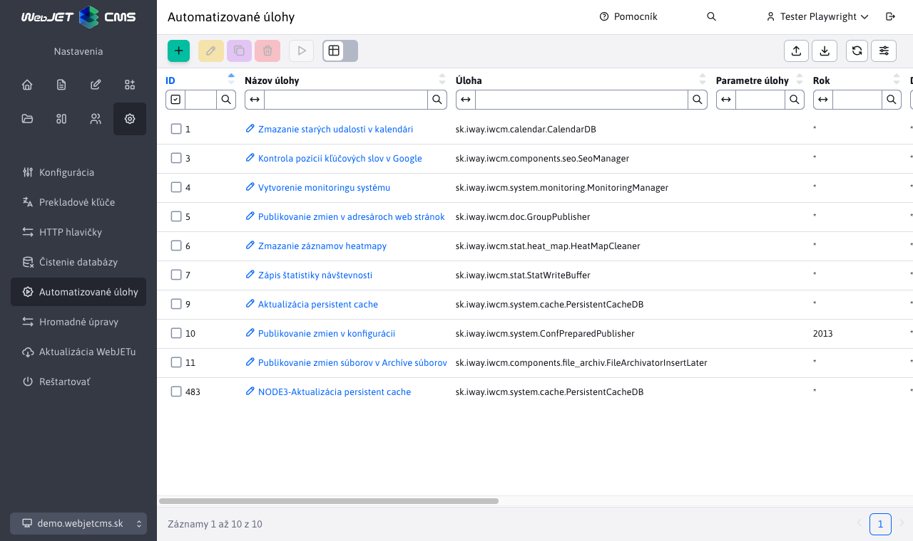
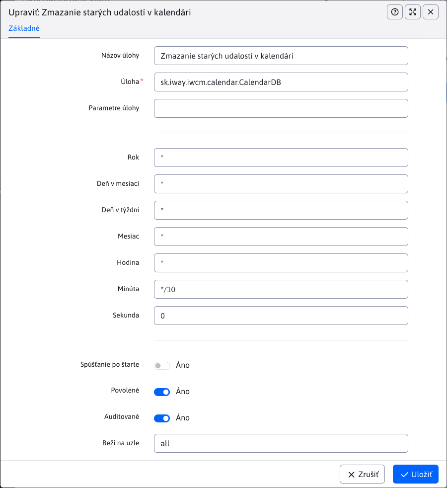

# Automatizované úlohy

Automatizované úlohy umožňujú zadefinovať úlohy, ktoré sa vykonávajú automatizovane na serveri.
Položku nájdete v sekcii **Nastavenia** pod položkou **Automatizované úlohy**.

V okne editora záznamu je možné nastaviť:

- **Názov úlohy** - Zadajte názov úlohy, ktorý bude popisovať, čo úloha robí (váš vlastný názov).
- **Úloha** - odkaz na Java triedu implementujúcu metódu `main`, ktorá sa vykoná. Pripravená je napr. úloha na sťahovanie dát [sk.iway.iwcm.system.cron.DownloadURL](../../../../../src/webjet8/java/sk/iway/iwcm/system/cron/DownloadURL.java)
- **Parametre úlohy** - parametre predané pre zadanú úlohu oddelené znakom `|`. V prípade úlohy `DownloadURL` sú parametre:
  - `URL-adresa|[fromEmail]|[toEmail]|[subject]`
  - Povinný parameter **URL-adresa** musí byť kompletná adresa vrátane `http://`.
  - Nepovinné parametre `fromEmail,toEmail,subject` umožňujú po stiahnutí stránky jej zaslanie na zadaný email (pre kontrolu).
- **Rok, deň v mesiaci, deň v týždni, mesiac, hodina, minúta, sekunda** - časový interval, kedy sa má zadaná úloha vykonať. Možné hodnoty sú napríklad:
  - `*` - vykoná sa vždy.
  - `*/10` - každých 10 (alebo iné zadané číslo).
  - `20` - keď má daný typ hodnotu 20.
  - `3-5` - 3., 4. a 5. časovú jednotku. Počíta sa od nuly, takže každá sekunda sa dá zapísať ako rozpätie 0-59.
  - Ak napr. chcete udalosť spúšťať každých 10 minút, zadáte všade znak `*` a do poľa **Minúty** zadáte `*/10`.
- **Spúšťanie po štarte** - Určuje, či sa má úloha spustiť automaticky po štarte WebJET (napr. pre aktualizáciu údajov).
- **Povolené** - Určuje, či je úloha aktuálne povolená alebo zakázaná. Ak je povolená, bude sa vykonávať podľa zadaného časového harmonogramu. Ak je zakázaná, nebude sa spúšťať vôbec.
- **Auditované** - Určuje, či sú záznamy o vykonaní úlohy zaznamenávané v audite. Táto možnosť je užitočná pre sledovanie a kontrolu vykonávania úloh.
- **Beží na uzle** - Určuje, na ktorom uzle alebo serveri sa má úloha vykonávať, ak pracujete v prostredí s viacerými uzlami clustra.

Zmeny pre časovanie úloh sa aplikujú okamžite, ale už odštartované úlohy ostanú bežať až pokým neskončia.

## Štandardné úlohy

[sk.iway.iwcm.system.cron.Echo](../../../../../src/webjet8/java/sk/iway/iwcm/system/cron/Echo.java) - Diagnostická úloha - svoj prvý parameter vypíše do konzoly.

**Parametre:**
1. Text, ktorý chcete vypísať.

[sk.iway.iwcm.system.cron.DownloadURL](../../../../../src/webjet8/java/sk/iway/iwcm/system/cron/DownloadURL.java) - Stiahne zadané URL a pošle ho na email.

**Parametre:**
1. URL, vrátane `http://` predpony, napr. `https://www.interway.sk/`.
2. Email odosielateľa.
3. Prijímateľ (možno aj viacero oddelených čiarkou).
4. Predmet správy.

[sk.iway.iwcm.system.cron.SqlBatchRunner](../../../../../src/webjet8/java/sk/iway/iwcm/system/cron/SqlBatchRunner.java) - Spustí SQL príkazy zadané ako parametre.

**Parametre:**
SQL príkazy, oddelené znakom `|`.

[sk.iway.iwcm.filebrowser.UnusedFilesCleaner](../../../../../src/webjet8/java/sk/iway/iwcm/filebrowser/UnusedFilesCleaner.java) - Preskúma zadaný adresár (súborový), či neobsahuje indexované súbory, na ktoré sa už žiadna stránka neodkazuje, a zruší publikovanie takýchto súborov. Takéto nepoužité súbory by sa totiž mohli zobrazovať vo výsledkoch vyhľadávania. Automatické prečisťovanie má význam iba pri automatickom indexovaní, ktoré sa zapína konfiguračnou premennou `fileIndexerIndexAllFiles`.

**Parametre:**
1. Adresár na skenovanie, napr.: `/files`.
2. Email, na ktorý sa pošle notifikácia o zrušených súboroch.
3. `true/false` hodnota. Ak je nastavená hodnota `true`, stránkam sa zruší publikovanie. Ak `false`, pošle sa iba notifikácia.

[sk.iway.iwcm.doc.GroupPublisher](../../../../../src/webjet8/java/sk/iway/iwcm/doc/GroupPublisher.java) - Publikuje naplánované zmeny v priečinkoch web stránok.

**Parametre:**
- Nemá.

[sk.iway.iwcm.calendar.CalendarDB](../../../../../src/webjet8/java/sk/iway/iwcm/calendar/CalendarDB.java) - Posiela notifikácie na email o blížiacich sa udalostiach v kalendári udalostí.

**Parametre:**
- Nemá.

[sk.iway.iwcm.components.seo.SeoManager](../../../../../src/webjet8/java/sk/iway/iwcm/components/seo/SeoManager.java) - Zisťuje poradie stránky vo vyhľadávačoch podľa kľúčových slov.

**Parametre:**
- Nemá.

[sk.iway.iwcm.system.monitoring.MonitoringManager](../../../../../src/webjet8/java/sk/iway/iwcm/system/monitoring/MonitoringManager.java) - Ukladá údaje pre monitorovanie servera.

**Parametre:**
- Nemá.

[sk.iway.iwcm.stat.StatWriteBuffer](../../../../../src/webjet8/java/sk/iway/iwcm/stat/StatWriteBuffer.java) - Údaje o štatistikách návštevnosti web stránky sa zbierajú do pamäte. Pri spustení tejto triedy sa pamäť vyčistí a zapíše sa do databázy.

**Parametre:**
- Nemá.

[sk.iway.iwcm.stat.heat_map.HeatMapCleaner](../../../../../src/webjet8/java/sk/iway/iwcm/stat/heat_map/HeatMapCleaner.java) - Maže generované obrázky teplotných máp kliknutí v štatistike.

**Parametre:**
- Nemá.

[sk.iway.iwcm.system.ConfPreparedPublisher](../../../../../src/webjet8/java/sk/iway/iwcm/system/ConfPreparedPublisher.java) - Publikuje naplánované zmeny v konfiguračných premenných.

**Parametre:**
- Nemá.

[sk.iway.iwcm.components.file_archiv.FileArchivatorInsertLater](../../../../../src/webjet8/java/sk/iway/iwcm/components/file_archiv/FileArchivatorInsertLater.java) - Publikuje naplánované zmeny v archíve súborov.

**Parametre:**
- Nemá.