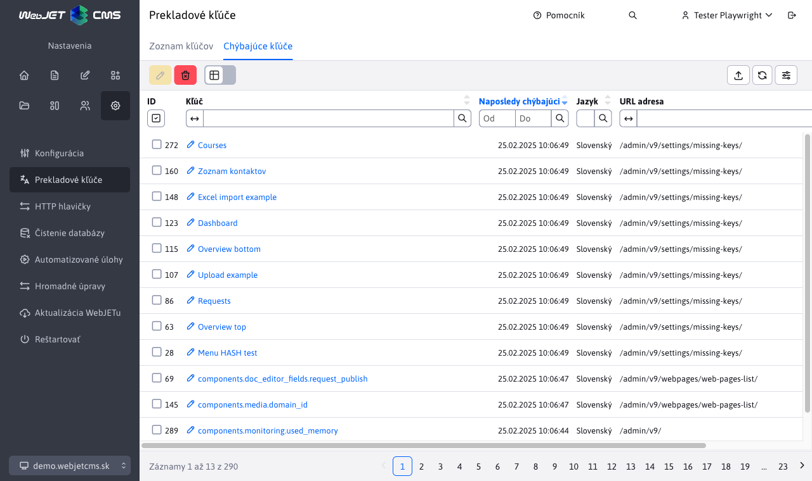

# Chýbajúce kľúče

Sekcia Chýbajúce kľuče zobrazuje prekladové kľúče, ktoré boli vyžiadané na preklad, ale neboli nájdené. V tejto sekcii nie je povolený žiaden typ editácie záznamov. Povolený je iba export záznamov.

Okrem samotného chýjúceho kľúča a jazyka tabuľka zobrazuje čas v ktorom bolo naposledy požiadané o preklad daného kľúča a poslednú URL adresu stránky na ktorej bolo získanie preklado volané.

Kliknutím na tlačidlo **Zmazať všetko** zmažete pamäť zoznamu chýbajúcich kľúčov, následne sa zoznam začne plniť nanovo. Je to vhodné, ak napr. potrebujete overiť, či na niektorej stránke nechýbajú preklady.

Upozornenie: v stĺpci ID je len poradové číslo z dôvodu korektného zobrazenia, kľúč môže mať hodnotu ID vždy náhodnú, nedá sa podľa nej orientovať.

Kliknutím na kľúč sa zobrazí editor, v ktorom môžete doplniť preklad a ihneď ho uložiť.

